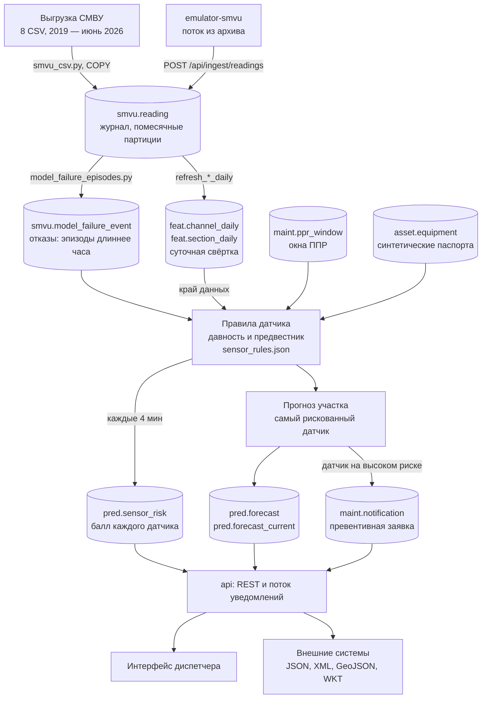
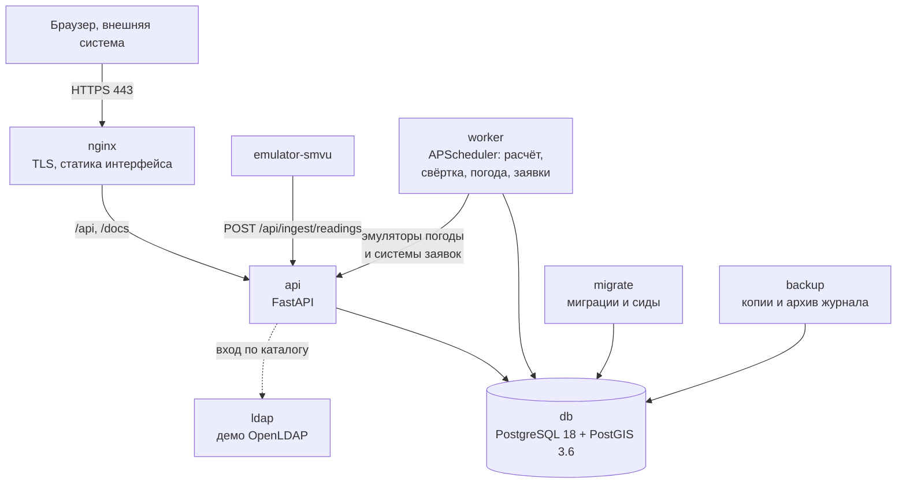

# Архитектура решения

**Москоллектор · прогноз отказов датчиков** 
ЛЦТ-2026 · задача 8 · АО «Москоллектор»

 

[← README](README.md) &nbsp;·&nbsp; [Открыть сервис](https://moskollektor.mbogatyreva.ru) &nbsp;·&nbsp; [Swagger](https://moskollektor.mbogatyreva.ru/docs) &nbsp;·&nbsp; [Документация, PDF](documentation.pdf)

---

Здесь две части: **функциональная архитектура** — кто что делает в системе и как данные
идут от журнала СМВУ до экрана диспетчера и заявки, и **компонентная** — из каких
контейнеров собрано решение и как устроена база. Методы расчёта, ограничения и установка
подробно — в [сопроводительной документации](documentation.pdf).

## Функциональная архитектура

### Роли и функции

| Роль | Что видит и делает |
|---|---|
| Диспетчер ОДС (`ods1`) | риски, прогнозы, объекты и заявки по всему парку; решение по прогнозу, квитирование уведомлений |
| Диспетчер района (`disp2`) | то же в своём районе — коллекторы «объект Альфа» и «объект Гамма» |
| Техник (`tech1`) | риски, прогнозы, объекты и заявки своего комплекса; история отказов канала перед выездом |
| Администратор ИС (`admin1`) | пользователи и их блокировка, каталог LDAP, настройки расчёта, состояние источников данных, журнал действий пользователей |

Пароли демо-учёток показаны на экране входа. Каждое действие пользователя пишется
в журнал `audit.user_action`.

| Функция | Экран | Метод API |
|---|---|---|
| Сводка рисков по датчикам и коллекторам | «Дашборд рисков», `/dashboard` | `GET /api/sensor-risk/summary`, `GET /api/sensor-risk` |
| Схема коллектора по пикетам с масштабом до одного пикета, фильтры по риску и типу объекта | «Карта объектов», `/map` | `GET /api/objects/tree`, `GET /api/risks`, `GET /api/geo/sections` |
| Карточка участка: датчики, показания, отказы каналов, блок «Почему такой риск» | `/objects/<участок>` | `GET /api/objects/{section_id}` и вложенные |
| Журнал прогнозов с моментом расчёта, вероятностью и решением диспетчера | «Журнал прогнозов», `/log`, `/forecasts/<id>` | `GET /api/forecasts`, `POST /api/forecasts/{id}/feedback`, `POST /api/forecasts/{id}/outcome` |
| Превентивные заявки со сроком, приоритетом и обоснованием | «Заявки», `/orders` | `GET /api/orders` |
| Журнал технологических событий СМВУ с фильтрами | «Журнал событий», `/tech-events` | `GET /api/tech-events` |
| Уведомления о новых заявках высокого риска без перезагрузки страницы | полоса уведомлений над экраном, вкладка «Неквитированные» в заявках | `GET /api/alerts/stream`, `GET /api/notifications` |
| Администрирование | `/admin/users`, `/admin/directory`, `/admin/settings`, `/admin/sources`, `/admin/audit` | `GET /api/auth/users`, `GET /api/settings`, `GET /api/sources`, `GET /api/audit` |

Кнопка «Тур по системе» в интерфейсе проводит по экранам с пояснениями.

### Путь данных от журнала до экрана и заявки

Шаги по порядку.

1. Выгрузка заливается в `smvu.reading` один раз при установке (документация, разд. 3.2). Служба
   `emulator-smvu` дописывает туда поток из архива, но в прогноз он не идёт (документация, разд. 5.2).
2. Из журнала строятся эпизоды отказа (документация, разд. 3.4) и суточная свёртка (документация, разд. 3.6).
3. Каждые 4 минуты `worker` применяет правила к каждому из 11 485 датчиков на срезе
   расчёта, исключая окна ППР (документация, разд. 3.5 и 3.7), и пишет балл, уровень и причины
   в `pred.sensor_risk`.
4. Датчики сворачиваются в участки (документация, разд. 3.8); прогноз ложится в `pred.forecast` —
   журнал всех прогнозов — и `pred.forecast_current` — текущий прогноз по участку.
5. На участки с датчиком на высоком риске расчёт заводит заявку (документация, разд. 3.9).
6. `api` раз в 5 секунд проверяет новые уведомления — это заявки, заведённые расчётом, —
   и передаёт их в открытые окна браузера потоком `GET /api/alerts/stream`. Диспетчер
   видит новый высокий риск без перезагрузки страницы; остальные данные экран
   перечитывает раз в минуту.
7. Диспетчер отмечает решение по прогнозу, а позже — исход: подтвердилось или ложная
   тревога с причиной. Эти отметки ложатся в `pred.feedback` и `pred.forecast_outcome`.

## Компонентная архитектура

### Контейнеры

Система описана одним файлом `deploy/docker-compose.yml` и состоит из восьми контейнеров. Сервисы приложения включены
профилем `app`, демо-каталог LDAP — профилем `ldap`.

| Контейнер | Образ | Что делает | Связи |
|---|---|---|---|
| `db` | `postgis/postgis:18-3.6` | база: журнал, прогнозы, заявки, справочники; архивирует журнал упреждающей записи не реже раза в 15 минут | порт 5432 только на петле хоста |
| `nginx` | `nginx:1.31-alpine` | TLS 1.2 и 1.3, редирект с HTTP на HTTPS, отдаёт собранный интерфейс и файл схемы участков, проксирует `/api` и `/docs` в `api` | порты 80 и 443 наружу |
| `api` | собирается из `backend/Dockerfile` | REST API, вход и роли, поток уведомлений, эмуляторы погоды и системы заявок, приём потока СМВУ | к `db`, к `ldap` при входе через каталог |
| `worker` | тот же образ, команда `python -m app.worker.scheduler` | расписание из разд. 3.10 документации: расчёт прогноза и заявок, свёртка, погода, статусы заявок | к `db`, к эмуляторам на `api` |
| `migrate` | тот же образ, команда `python -m app.migrate` | накатывает `db/migrations/*.sql` по возрастанию номера, каждый файл в своей транзакции, затем сиды `db/seed/*.sql`; живёт секунды и выходит | `api` и `worker` ждут его успешного завершения |
| `emulator-smvu` | тот же образ | раз в минуту шлёт показания архива со сдвигом на 364 дня, чтобы совпал день недели | к `api` |
| `backup` | `postgis/postgis:18-3.6` | раз в сутки копия кластера `pg_basebackup`, хранение последних копий вместе с архивом журнала, восстановление | к `db`, том `backups` |
| `ldap` | собирается из `deploy/ldap/Dockerfile` | демонстрационный каталог OpenLDAP с учётками четырёх ролей | внутри сети compose |

Интерфейс — не отдельный контейнер, а статика: сборка `frontend` кладётся в каталог
`deploy/nginx/app`, который монтирует `nginx`. Тома: `pgdata` — база, `backups` —
копии и архив журнала, `parquet`, `uploads` и `score` — рабочие каталоги `worker`.

### Схема базы данных

Одна база, 11 прикладных схем, 55 файлов миграций с номерами от `001` до `062`.
Журнал накатанных миграций — `public.schema_migration`.

| Схема | Назначение | Главные таблицы |
|---|---|---|
| `smvu` | журнал и справочники СМВУ, эпизоды отказа | `reading` (помесячные партиции), `channel`, `object_tree`, `model_failure_episode`, `fault_episode`, `data_outage`, `sensor_kind`, `system_kind` |
| `feat` | суточные свёртки | `channel_daily`, `section_daily`, `refresh_run` |
| `pred` | прогнозы и решения по ним | `run`, `sensor_risk`, `forecast`, `forecast_current`, `feedback`, `forecast_outcome` |
| `maint` | заявки и работы ТОиР | `notification`, `notification_status_log`, `work_order`, `ppr_window`, `ods_event`, `plan`, `strategy` |
| `asset` | техместа и оборудование | `func_location`, `equipment`, `measuring_point`, `measurement` |
| `ref` | справочники и настройки | `object_xref` (участки), `app_setting`, `app_user`, `user_role`, `user_scope`, `role_permission`, `priority`, `criticality` |
| `geo` | синтетическая геометрия | `geo_object` |
| `permit` | наряды-допуски | `permit`, `permit_status_log`, `location` |
| `load` | пакеты заливки и отчёт о качестве | `batch`, `error` |
| `audit` | журнал действий пользователей | `user_action` |
| `ext` | внешние данные | `weather_hourly` |

Структура `asset` и `maint` повторяет модель данных ТОиР: техническое место,
единица оборудования, точка измерения, сообщение, заказ. Поэтому настоящий реестр
оборудования, если он появится, ляжет в готовые таблицы без изменения схемы.

### Три контура хранения

Данные лежат в одной базе PostgreSQL, но разделены на три контура по тому, кто их
читает и как часто.

| Контур | Что в нём | Где лежит | Кто читает |
|---|---|---|---|
| **Оперативный** | прогнозы последнего расчёта, уведомления, заявки, допуски, решения диспетчера | `pred.forecast_current`, `pred.sensor_risk`, `maint.notification`, `maint.work_order`, `permit.permit`, `pred.feedback` | экраны диспетчера и REST API, каждую минуту |
| **Архив** | журнал показаний СМВУ с января 2019 года, эпизоды отказа, история прогнозов | `smvu.reading` — помесячные партиции с января 2019 года, `smvu.model_failure_episode`, `pred.run`, `pred.forecast` | расчёт прогноза, карточка объекта, «Журнал событий» |
| **Аналитические витрины** | суточные свёртки журнала по участку и по каналу | схема `feat`: `section_daily` — `worker` освежает её на каждом цикле расчёта, `channel_daily` | вес участка в прогнозе, карточка участка |

Запрос к архиву за один месяц читает одну партицию, а не весь журнал на 313 млн строк.
Поэтому архив и оперативный контур живут в одной базе и друг другу не мешают.

### Защита информации и персональные данные

Использование сервиса и оформление его результатов подчиняются 149-ФЗ «Об информации,
информационных технологиях и о защите информации» и 152-ФЗ «О персональных данных».
Ниже перечислено, что для этого сделано в системе.

**Персональные данные.** Данные мониторинга ПДн не содержат: заказчик передал выгрузку
уже обезличенной, объекты в ней называются «объект Альфа», «объект Бета», а каналы
обозначены номерами. Персональные данные в системе есть только у пользователей: логин
и ФИО в `ref.app_user`. Пароль хранится хешем argon2, а у учёток из каталога LDAP
пароля в базе нет вовсе.

**Доступ.** Войти можно только по паролю или через каталог LDAP. Сессия хранится в куке
`mk_session` с флагами `HttpOnly`, `Secure` и `SameSite=Lax`. Что пользователь видит,
определяют четыре роли заказчика и область видимости: диспетчер района видит свой
район, техник — свой комплекс. Блокировать учётки и менять настройки может только
администратор.

**Журнал действий.** Каждый запрос человека к API записывается в `audit.user_action`:
кто, когда, какой метод и с каким кодом ответа. Администратор читает его на экране
«Журнал действий». Поток показаний СМВУ в журнал не попадает, потому что это действия
системы, а не человека.

**Передача.** Снаружи открыт только nginx на портах 80 и 443, и принимает он TLS 1.2
и 1.3. База слушает только внутри сервера, каталог LDAP наружу не выставлен. Поток
показаний `POST /api/ingest/readings` закрыт отдельным токеном.

**Целостность и восстановление.** Контейнер `backup` делает копии базы и хранит
журнал WAL. Из них база восстанавливается на любой момент времени:
`deploy/backup.sh --restore`.

Пароли демо-учёток на экране входа показаны нарочно: стенд и поставка нужны экспертам
для проверки, поэтому в `deploy/.env.example` стоит `AUTH_DEMO_HINTS=1`. При эксплуатации
подсказку выключают, ставя `AUTH_DEMO_HINTS=0`, а пароли задаёт администратор.
