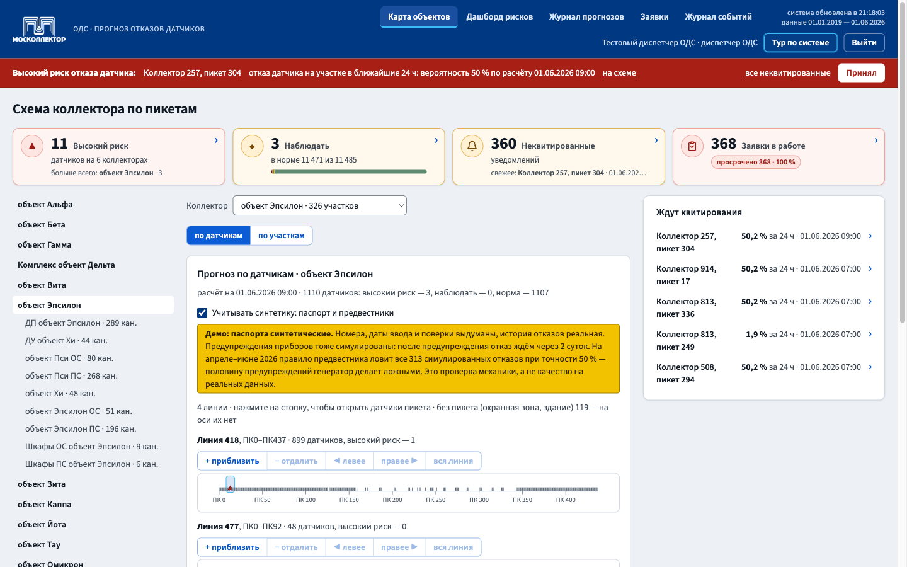
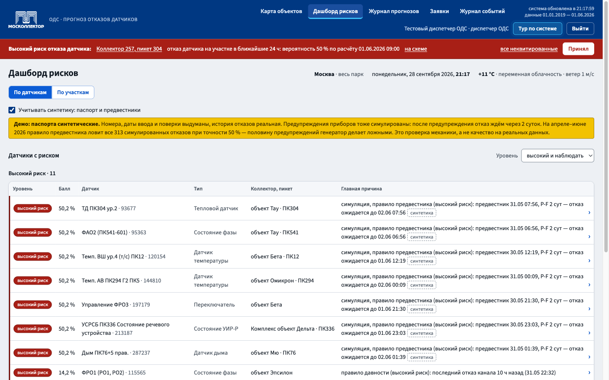

<div align="center">

# Москоллектор · прогноз отказов датчиков

**Сервис прогнозирования аварий инженерных коллекторов Москвы**<br>
ЛЦТ-2026 · задача 8 · АО «Москоллектор» · команда «Скайнет»

<br>

<table>
<tr>
<td align="center" width="50%">
<a href="https://moskollektor.mbogatyreva.ru"></a><br>
<b><a href="https://moskollektor.mbogatyreva.ru">moskollektor.mbogatyreva.ru</a></b><br>
<sub>демо-учётки — на экране входа, кнопка «Войти как»</sub>
</td>
<td align="center" width="50%">
<a href="https://moskollektor.mbogatyreva.ru/docs"></a><br>
<b><a href="https://moskollektor.mbogatyreva.ru/docs">moskollektor.mbogatyreva.ru/docs</a></b><br>
<sub>все методы API с описанием</sub>
</td>
</tr>
<tr>
<td align="center" colspan="2">
<a href="documentation.pdf"></a><br>
<b><a href="documentation.pdf">documentation.pdf</a></b><br>
<sub>методы, ограничения, архитектура, API, сборка и установка — 25 страниц</sub>
</td>
</tr>
</table>

<br>


</div>

---

## Что делает сервис

Москоллектор эксплуатирует 825 км коллекторов с датчиками охранной и пожарной сигнализации
и диспетчерского управления; в выгрузке заказчика их 11 485. Сервис оценивает, какой датчик
откажет в ближайшие **24 часа**, и помогает диспетчеру ОДС успеть раньше отказа.

| | |
|---|---|
| 🗺️ **Схема коллектора** | линия с пикетами вместо карты: где на трассе стоит датчик с риском, масштаб до одного пикета |
| 📊 **Дашборд рисков** | датчики и участки по уровню риска и главной причине |
| 📓 **Журнал прогнозов** | каждый прогноз с моментом расчёта, вероятностью и решением диспетчера |
| 🛠️ **Заявки** | превентивные заявки создаются сами по правилам, со сроком и приоритетом |
| 🔔 **Уведомления** | высокий риск приходит сразу, без перезагрузки страницы |
| 🔌 **REST API** | всё, что есть на экранах, доступно внешним системам; описание — Swagger |

<table>
<tr>
<td width="50%"></td>
<td width="50%"></td>
</tr>
<tr>
<td align="center"><sub>Схема коллектора по пикетам</sub></td>
<td align="center"><sub>Дашборд рисков по датчикам</sub></td>
</tr>
</table>

## Где посмотреть

| | |
|---|---|
| 🖥️ **Сервис** | **https://moskollektor.mbogatyreva.ru** — на экране входа кнопка «Войти как» у каждой демо-учётки |
| 📘 **REST API (Swagger)** | **https://moskollektor.mbogatyreva.ru/docs** — все методы с описанием; вызвать их со страницы можно после входа в сервис в том же браузере |
| 📄 **Сопроводительная документация** | **[documentation.pdf](documentation.pdf)** — 25 страниц: методы обработки данных, ограничения, архитектура, API, сборка и установка |

## Требования ТЗ

Все требования технического задания заказчика — 175 пунктов по разделам, с номером страницы
и цитатой, — [`tz-requirements.md`](tz-requirements.md). У каждого пункта отмечено, выполнен ли он
и где это проверить: выполнено 95 из 147 требований, ещё 28 пунктов — критерии оценки экспертами.

## Документация

Сопроводительная документация — [`documentation.pdf`](documentation.pdf), 25 страниц: что и как мы
прогнозируем, методы обработки данных, условия и ограничения, функциональная и компонентная
архитектура, REST API, сборка и установка, стек и лицензии.

## Как считается прогноз

Отказ — эпизод «Неисправен» журнала СМВУ длиннее часа, то есть потеря связи с датчиком.
Прогноз считают два правила: **давность** (канал недавно отказывал) и **предвестник**
(симулированное предупреждение прибора). Пороги выбраны на январе–марте 2026,
замер — на апреле–июне 2026, срез в 21:00 каждых суток.

| Режим | Precision | Recall |
|---|:---:|:---:|
| на реальных отказах (606 отказов) | **0,120** | **0,097** |
| с симуляцией паспортов и предвестников | 0,334 | 0,405 |

Precision 0,120 в 252 раза выше случайного выбора. Порогов 0,7 и 0,5 реальные данные
не дают: отказ канала редок, а предвестника отказа в журнале нет. Как повторить замер —
[`ml-model/sensor/`](ml-model/sensor/README.md).

### Почему горизонт 24 часа

Мы проверили то же правило давности на пяти горизонтах. Чем длиннее окно, тем выше
Precision, но растёт он в основном за счёт самого окна: за 14 суток отказ случается
почти в 30 раз чаще, чем за 12 часов, и угадать его проще даже наугад. Поэтому мы
сравниваем с долей пар «канал × срез», за которыми в пределах горизонта идёт отказ.

| Горизонт | Precision | Recall | Во сколько раз лучше случайного выбора |
|---|:---:|:---:|:---:|
| 12 часов | 0,022 | 0,018 | 115 |
| **24 часа** | **0,120** | **0,097** | **252** |
| 3 суток | 0,146 | 0,117 | 111 |
| 7 суток | 0,199 | 0,158 | 67 |
| 14 суток | 0,335 | 0,264 | 59 |

24 часа — целевой горизонт постановки, и на нём правило сильнее всего опережает
случайный выбор. Замер повторяет `ml-model/sensor/horizons.py`, числа —
в [`ml-model/sensor/horizons.json`](ml-model/sensor/horizons.json).

### Ещё три числа

| Число | Что это | Откуда |
|---|---|---|
| **11 485 из ≈108 500** | датчиков в нашей выгрузке против всего парка заказчика — 10,6 % | парк назвал заказчик в докладе 17.09.2026: около 100 000 датчиков ОПС и ДУ и 8 500 метановых |
| **≈3 секунды** | весь расчёт прогноза по парку: 10 720 датчиков на 3 173 участках; требование — меньше 5 минут | журнал worker на стенде, например прогон 2831 28.09.2026: «стадии 6/6, суммарно 3.2 с». Повторить без следа в базе: `docker exec moskollektor-worker-1 python -m app.worker.run --rollback` |
| **раз в 4 минуты** | как часто пересчитывается весь парк | `GET /api/data-status`, поле `computed_at`; интервал задан в `backend/app/worker/scheduler.py` |

## Запуск у себя

Нужны Docker с Compose и Node.js.

```sh
cd deploy
cp .env.example .env    # вписать POSTGRES_PASSWORD (openssl rand -hex 16)
                        # и AUTH_SECRET (openssl rand -hex 32)
sh make-cert.sh         # самоподписанный сертификат для nginx
docker compose up -d    # база и nginx
docker compose --profile app up -d   # миграции, API, расчёт
cd ../frontend && npm ci && npm run build \
  && mkdir -p ../deploy/nginx/app && cp -R dist/. ../deploy/nginx/app/
```

Интерфейс откроется на https://localhost. Каждый шаг с проверкой и заливка выгрузки
заказчика расписаны в [`deploy/README.md`](deploy/README.md). Выгрузку (13 ГБ)
в репозиторий мы не кладём.

## Что где лежит

| Каталог | Что внутри |
|---|---|
| [`frontend/`](frontend) | интерфейс диспетчера: Vite + Preact + TypeScript + Tailwind, E2E-тесты на Playwright |
| [`backend/`](backend) | REST API на FastAPI, расчёт прогноза и заявок по расписанию, заливка выгрузки |
| [`db/`](db) | миграции PostgreSQL + PostGIS и начальные данные |
| [`ml-model/`](ml-model) | правила датчика и модели: признаки, обучение, метрики |
| [`contracts/`](contracts) | форматы обмена между бэкендом и моделью |
| [`deploy/`](deploy) | Docker Compose, nginx, резервные копии, выкладка |
| [`delivery/`](delivery) | сборка пакета сдачи и сквозные проверки |
| [`code/`](code) | самопроверки схемы, метрик и выкладки |

---

<div align="center">

**Сервис:** https://moskollektor.mbogatyreva.ru &nbsp;·&nbsp; **Swagger:** https://moskollektor.mbogatyreva.ru/docs &nbsp;·&nbsp; **Документация:** [documentation.pdf](documentation.pdf)

</div>

## Команда

Мирослава Богатырева<br>
Николай Тлехугов
