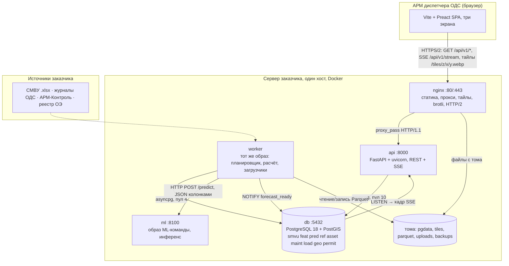

# Высокоуровневый дизайн сервиса прогнозирования аварий

АО «Москоллектор»: 825 км коллекторов, 4125 участков по 200 м, десятки тысяч датчиков,
логи СМВУ за 12+ лет.

Это рабочий документ команды. Требования лежат в `docs/acceptance-test.md`, схемы БД —
в `code/*.sql`. Числа производительности я мерил сам в сентябре 2026 года и привожу
их здесь же: бюджет фронта в разд. 4.1, правила API в разд. 3.4, бюджет расчёта
по стадиям в разд. 8.2.
Здесь я собираю это в конструкцию и дописываю то, чего в них нет: границу
с ML-командой, состав контейнеров, порядок миграций, сквозные сценарии.

**Решено до меня, не переигрываю:** Vite + Preact вместо Next.js, Leaflet вместо
MapLibre, обычный PostgreSQL вместо TimescaleDB, DuckDB поверх Parquet для истории,
колоночный JSON вместо MessagePack, Docker как способ поставки.

**Решаю здесь впервые:** язык и фреймворк бэкенда (3), планировщик и защита
от двойного расчёта (3.4), контракт с ML (6), состав контейнеров (7), сведение
четырёх схем в одну базу и четыре расхождения между ними (5.2–5.3).

**Железо, к которому привязаны все числа:** сервер 4 ядра, 16 ГБ ОЗУ, SATA SSD;
АРМ диспетчера — старая офисная машина, 1280×1024, канал 1,6 Мбит/с, RTT 150 мс.
Оба предположения заказчик не подтвердил, это ОВ-2 и ОВ-3 в конце.

---

## 1. Общая картина



Пунктир — источники, по которым способ доставки не согласован (ОВ-4). Сегодня это
ручная загрузка .xlsx через интерфейс администратора, загрузчик уже написан
(`code/load_smvu_xlsx.py`). Дадут сетевой доступ — заменим один модуль,
а не архитектуру.

### 1.1. Информационные потоки

Эта таблица — не украшение: она же служит заявкой на правила межсетевого экрана
(формат разд. 5.6 ЦТА КСУ ТОиР, Арктик СПГ 2).

| № | Отправитель | Получатель | Назначение | Протокол | Порт | Наружу |
|---|---|---|---|---|---|---|
| 1 | браузер АРМ | nginx | интерфейс, API, SSE, тайлы | HTTP/2 + TLS | 443 | **да** |
| 2 | nginx | api | проксирование `/api/v1/*` | HTTP/1.1 | 8000 | нет |
| 3 | api, worker | db | запросы, LISTEN/NOTIFY | PostgreSQL | 5432 | нет |
| 4 | worker | ml | инференс `/predict`, `/model` | HTTP/1.1 JSON | 8100 | нет |
| 5 | worker | том `parquet` | архив и метки для обучения | файловый | — | нет |
| 6 | администратор | api | загрузка выгрузок .xlsx | HTTP/2 + TLS | 443 | **да** |

Наружу торчит один порт. Остальное живёт во внутренней сети Docker и с хоста
недоступно — это снимает половину разговора со службой безопасности заказчика.
Система садится в отдельный сетевой сегмент и тянет данные через шлюз, а не сидит
в одной сети с технологией — так собрана СПТМ ОРУ Иркутской ГЭС (разд. 5.1 ТЗ).

**HTTP/2 обязателен.** В HTTP/1.1 браузер держит не больше 6 соединений на домен,
одно из них у нас навсегда занято потоком SSE. Диспетчер, открывший седьмую вкладку,
получит зависшую. В HTTP/2 потоков по умолчанию 100.

---

## 2. Структура репозитория

**Монорепозиторий на всё наше, отдельный репозиторий у ML-команды.**

Почему не один общий с ML: у них другой цикл — эксперименты, ноутбуки, веса, датасеты.
Их артефакты за месяц раздуют репозиторий до гигабайтов, а наша сборка фронта начнёт
ждать их зависимостей. Плюс граница из раздела 6 должна быть видна физически:
два репозитория — два владельца и один контракт.

Почему не пять (бэк, фронт, схемы, деплой, контракты): нас мало, выкатываем всё разом
одним `docker compose up`, и правка API почти всегда тянет правку фронта. В пяти
репозиториях это пять PR и ручная сверка версий, в одном — один PR и один тег.

```
moskollektor-service/
├── contracts/            ЕДИНСТВЕННОЕ место, где живёт граница с ML
│   ├── features.v1.yaml          вход: имена признаков, типы, единицы, окна
│   ├── predict.v1.schema.json    JSON Schema запроса и ответа /predict
│   └── README.md                 правила изменения контракта
├── db/migrations/        нумерованные .sql, порядок — в разделе 5.4
├── db/seed/              типы событий, уставки Регламента, нормативы ТО
├── backend/app/
│   ├── api/ stream/ worker/ ingest/ archive/ mlclient/ domain/
├── frontend/src/screens/ {dashboard, map, log}
├── frontend/lh-arm.js, lighthouserc.json   профиль «АРМ-ОДС», часть поставки
├── tiles/                генерация растровой подложки
├── deploy/               docker-compose{,.dev,.stand}.yml, nginx/, .env.example
└── code/                 прототипы расчёта, схемы БД, разборщики выгрузок

moskollektor-ml/          репозиторий ML-команды
├── contracts/            копия наших файлов, обновляется по тегу
├── training/ serving/ models/ Dockerfile
```

Контракт живёт у нас, а не у них: перед заказчиком за приёмку отвечаем мы. Изменение
контракта — это PR в наш репозиторий, который ML-команда открывает сама, а мы
согласуем. Дальше они забирают файл по тегу.

Фронт собирается в статику и уезжает в образ nginx. Node живёт только на стадии
сборки: **на сервере один рантайм — Python**. Next.js в режиме App Router заставил бы
нас ставить, обновлять и мониторить второй рантайм — Node, ради серверного рендеринга,
который интерфейсу диспетчера не нужен: он открывается один раз за смену и его
не индексирует поисковик.

---

## 3. Бэкенд: на чём и почему

### 3.1. Сравнение трёх вариантов

Требуется: REST поверх PostgreSQL (~15 методов), поток SSE к десяткам клиентов,
расчёт по расписанию в 5 минут, чтение .xlsx с заливкой через COPY, соседство с ML
на Python.

| | **Python + FastAPI** | **Go + chi/pgx** | **Node + NestJS** |
|---|---|---|---|
| Второй рантайм на сервере | нет, ML уже на Python | да | да |
| Загрузчик xlsx | `python-calamine` 3,58 с на 500 тыс. строк, код готов | библиотек уровня calamine нет, придётся звать Python процессом | `exceljs` медленнее и прожорливее |
| Память на процесс | 150–250 МБ RSS | 20–40 МБ | 90–150 МБ |
| Размер образа | 180–250 МБ | 15–25 МБ | 180–300 МБ |
| SSE | `StreamingResponse`, 15 строк | горутина и канал | просто |
| OpenAPI для М-17 | генерируется из типов | руками или генератором | из декораторов |
| Кто сопровождает у заказчика | Python знают все, кто трогает ML | отдельный человек | отдельный человек |

**Беру Python + FastAPI (uvicorn, asyncpg).** Два довода, оба про экономию.

**Один рантайм.** Python на сервере обязан быть в любом случае — на нём инференс.
Go выигрывает 170 МБ на процесс, при четырёх процессах это 0,7 ГБ, то есть 4%
от 16 ГБ. За эти 4% я плачу вторым языком в поставке, вторым набором инструментов
сборки и вторым разговором со службой эксплуатации. Не стоит.

**Загрузчик уже написан и померен.** `load_smvu_xlsx.py` читает 500 тыс. строк
за 3,58 с против 32,98 у pandas и льёт через COPY (232–316 тыс. строк/с против
31–38 тыс. у пакетного INSERT). Переписывать на Go — минус неделя и потеря
измеренного результата, причём этот шаг всё равно пришлось бы звать процессом Python.

Теряю честно: FastAPI на четырёх ядрах держит меньше запросов в секунду, чем Go.
Но нагрузка — десятки диспетчеров с одним SSE и запросом раз в минуту; даже сотня
при 23 КБ на соединение — это 2,3 МБ памяти. Узкое место у нас в сборке признаков
(20 с из 41), а не в веб-слое.

Django не рассматривал: его сила — админка и ORM поверх собственных миграций,
а у нас схемы написаны руками на SQL, с триггерами, BRIN и `EXCLUDE USING gist`.

### 3.2. Что внутри

**asyncpg вместо ORM.** Тяжёлые запросы уже написаны на SQL в схемах
(`refresh_section_daily`, `sections_in_view`, `f_permit_features`, `area_summary`).
ORM поверх них — слой, который эти же функции вызывает строкой. **Pydantic**
даёт валидацию и OpenAPI бесплатно: `/api/v1/openapi.json` закрывает М-17.
**Пулы раздельные:** api 10, worker 4 — расчёт не должен съесть пул у интерфейса.

### 3.3. Планировщик и защита от двойного расчёта

| Вариант | Чем плох у нас |
|---|---|
| cron в контейнере | у контейнера нет init, cron — отдельный надзиратель, логи мимо `docker logs`, падение задачи никто не увидит |
| Celery + Redis | плюс два контейнера и 300–400 МБ памяти ради **одной** периодической задачи |
| **APScheduler в контейнере `worker`** | одна библиотека, логи в stdout; сам по себе от двойного запуска не защищает — см. ниже |

**Беру APScheduler в отдельном контейнере `worker`** из того же образа, что `api`,
с другой командой запуска.

| Задача | Когда | Норматив |
|---|---|---|
| Инкрементальный расчёт | каждый час в :05 | 5 минут (М-21) |
| Полный расчёт | 03:00 и по кнопке | 5 минут |
| Ночной сервис: свёртка за всю историю, выгрузка Parquet, VACUUM ANALYZE | 03:30 | вне норматива, 30–60 мин |
| Пересчёт Precision/Recall за 30 суток | 04:30 | вне норматива |
| Проверка истёкших горизонтов (Ф-36) | каждые 10 минут | секунды |

**Двойной расчёт не пойдёт, потому что мешает советующая блокировка PostgreSQL.**
Расчёт первым делом берёт `pg_try_advisory_lock(48217)` — константа, одна на систему.
Не взялась — пишет в журнал «расчёт идёт с 09:05, run_id 48216» и выходит с кодом 0.

Почему advisory lock, а не флаг в таблице: **блокировка снимается сама, когда
умирает соединение.** Флаг после падения контейнера остаётся стоять, и наутро
окажется, что расчёты не идут вторые сутки, потому что никто не убрал строку.

Сверху — watchdog: если `pred.run` висит в `running` дольше 15 минут, следующий
запуск помечает его `failed` и идёт дальше. Иначе один зависший расчёт останавливает
систему навсегда.

### 3.4. REST API

| Метод | Что отдаёт | Размер | Требование |
|---|---|---|---|
| `GET /forecast/current` | тощий список 4125 участков колонками: id, промилле, ранг, направление | **19 КБ** gzip | М-15, Ф-55 |
| `GET /dashboard` | батч: шесть плиток, топ-10, статус расчёта | 8 КБ | М-04 |
| `GET /sections/{id}` | карточка: адрес, факторы, датчики, среда | 2–4 КБ | М-08, Ф-29, Ф-30 |
| `GET /sections/{id}/events?cursor=` | события страницами по 50, keyset | 6–8 КБ | курсорная пагинация, разд. 3.5 |
| `GET /forecasts?from=&to=&cursor=` | журнал прогнозов | 10 КБ/стр | М-06, М-16 |
| `POST /forecasts/{id}/feedback` | вердикт диспетчера + код причины | — | Ф-34, Ф-35 |
| `GET /notifications`, `POST /notifications/{id}/approve` | заявки на ТО и утверждение | 10 КБ/стр | М-09, М-16, Ф-43 |
| `GET /geo/sections?bbox=&z=` | геометрия видимой области, упрощённая под зум | 20–80 КБ | М-05 |
| `GET /stream` | SSE: статусы, тревоги, окончание расчёта | 1,5 КБ/кадр | поток событий, разд. 4.2 |
| `POST /runs`, `GET /runs/{id}` | запуск расчёта и статус с разбивкой по стадиям | — | М-21 |

Все под префиксом `/api/v1`. Пять правил на все ответы; числа под ними я намерил
на наших 4125 секциях скриптом `code/payload_budget.py`:

1. **Колонки вместо массива объектов** там, где больше 200 записей: на наших
   4125 секциях массив объектов после brotli — 49,0 КБ, колонками — 11,9 КБ.
   В 4,1 раза, ценой часа работы над сериализатором.
2. **`ensure_ascii=False`.** Экранирование кириллицы даёт +5% после сжатия и +33%
   до него (802 КБ против 1066), и эти 33% платит `JSON.parse` на слабой машине.
3. **ETag, ключ — `run_id`.** Планшет опрашивает раз в минуту, прогноз меняется раз
   в час: 59 из 60 ответов становятся пустыми 304, трафик падает с 14,9 МБ в час
   до 266 КБ на клиента. На поток SSE ETag не ставим: тело 1,5 КБ, а заголовки
   стоят почти 800 байт — экономить нечего.
4. **Brotli:11 на статику при сборке, brotli 4–5 на динамику, gzip запасным.**
   Одиннадцатый уровень жмёт 0,6 МБ/с против 32,9 у gzip:9 — на динамике недопустим.
5. **Курсорная пагинация.** На 50 млн строк `OFFSET 99980` занимает 8 секунд,
   keyset — 0,9 мс на любой глубине.

Бинарные форматы не берём: измерено, MessagePack после brotli весит 55,9 КБ против
49,0 у сжатого JSON и разбирается медленнее нативного `JSON.parse`.

### 3.5. Вход, роли, аудит

Роли три: **диспетчер ОДС, инженер, администратор** (Ф-66). Вход по личной учётной
записи; администратор заводит и блокирует пользователей из интерфейса, не из базы.
SSO через AD по Kerberos закладываем как точку расширения, но в первой версии
делаем логин с паролем: `ref.app_user`, argon2, сессия в httpOnly-куке. Правила
паролей берём из разд. 8.4 ЦТА КСУ ТОиР — минимум 8 символов, срок не больше 90 суток.

Аудит пишем в `ref.audit_log`: кто, когда, что, прежнее и новое значение, причина
(Ф-53, Ф-69). Две оговорки оттуда же: **журнал аудита автоматически не удаляется**,
и протоколировать изменения часто меняющихся таблиц нельзя — база распухнет.
Поэтому аудит только на действиях человека, а не на потоке событий СМВУ.

Проверка в ПМИ: прямой переход по URL закрытого раздела обязан дать отказ,
а не содержимое.

---

## 4. Фронтенд

### 4.1. Стек: число за каждым пунктом

| Решение | Число, которое его держит |
|---|---|
| **Next.js не берём** | пустая страница `create-next-app` — 107,5 КБ сжатого JS на Next 15 и 138,9 на Next 16 при бюджете 150 КБ на всё. Остаток 11–43 КБ — не бюджет |
| **Vite + Preact через `preact/compat`** | 9,7 КБ gzip против 47,2 у React 18 и 60,1 у React 19. Те же JSX, хуки, компоненты |
| **TypeScript** | ноль байт в бандле; данные из пяти источников, типы окупаются на первой неделе |
| **Tailwind** | в сборку попадают только использованные классы: бюджет CSS 40 КБ, ждём 10–20 |
| **Radix точечно** | `Dialog` 12,6 КБ — берём (фокус, Escape, клавиатура). `Select` и `DropdownMenu` по 29,4 КБ — не берём: родные `<select>` и `<details>` весят ноль, работают с клавиатуры и читаются скринридером |
| **Иконки поштучно** | `lucide-react` целиком — 190 КБ gzip; полтора десятка нужных кладём в SVG-спрайт |
| **Leaflet 1.9, не MapLibre** | 42,4 КБ против 206–283. Главное: MapLibre 6.0 требует WebGL2, Chrome с вехи 139 убирает программный откат. В тикете 8074 MapLibre 6.1 на программном WebGL **молча зависает** — `load` не приходит, ошибки нет. Диспетчер увидит серый прямоугольник |
| **Цель сборки `chrome109`** | если на АРМ Windows 7, потолок браузера — Chrome 109. Без явной цели сборщик выпустит `Object.groupBy`, и экран будет пустым |
| **Локальная поставка** | шрифты, библиотеки, тайлы — со своего сервера. Ноль внешних запросов |

Прикидка: Preact 9,7 + роутер 2 + TanStack Virtual 4 + Radix Dialog 12,6 + наш код
40–60 = **70–90 КБ** при бюджете 150. Leaflet 42 КБ грузится отдельным чанком
только на экране карты.

### 4.2. Три экрана и их данные

**Дашборд** (`/`). Шапка ≤10% высоты, шесть плиток ≤15%, два рабочих ряда
(`dashboard/dashboard.md`). Шесть плиток, а не десять: дальше глаз перестаёт читать
их как группу, а у диспетчера по EEMUA 191 около 3,3 минуты на разбор тревоги.
Данные: один батч `GET /dashboard` при открытии — при RTT 150 мс четыре отдельных
запроса стоят 600 мс только на дорогу. Дальше экран живёт на SSE.

**Карта** (`/map`). Четыре слоя: своя растровая подложка, участки из GeoJSON
по видимой области на холсте (`preferCanvas: true`), точечные объекты как
`CircleMarker`, поверх — кадр статусов на 1,5 КБ для всех 4125 секций.
`CircleMarker`, а не `Marker`, обязательно: на маркер с иконкой-картинкой
`preferCanvas` не действует, он остаётся узлом DOM, а Leaflet на 2000–5000 узлов
становится «серым и непригодным». Геометрия кэшируется надолго, статусы приходят
отдельно: склеив их, мы возили бы 900 КБ каждый час вместо 19 КБ.

**Журнал** (`/log`). Девять колонок (Ф-33), серверная пагинация по 50–100 строк
плюс виртуализация внутри страницы (TanStack Virtual, 4 КБ). Не бесконечная
прокрутка: диспетчеру нужен адресуемый номер страницы, который можно дать коллеге.
Две ловушки виртуализации на приёмку: высота строки должна быть фиксированной
(длинный текст режем многоточием), и Ctrl+F в виртуальном списке не работает —
значит свой поиск по журналу обязателен.

**Что кэшируется:** подложка — `max-age=31536000, immutable`; геометрия — ETag плюс
`max-age=86400`; справочники — `localStorage` с номером версии; прогноз — ETag
по `run_id`; журнал и карточки не кэшируем.

### 4.3. Живые данные: SSE

Сначала считаю поток. По ISA-18.2 бюджет — 6 тревог в час на диспетчера, пик
не больше 10 за 10 минут; датчик, дребезжащий чаще раза в минуту, по тому же
стандарту подлежит устранению, а не показу. Итого единицы событий в минуту.
Нам нужен транспорт, который **дёшево молчит и переживает обрыв**.

| Транспорт | Байт на событие | Почему не он |
|---|---|---|
| Опрос раз в 5 с | 884,7 (570 заголовков запроса + 198 ответа) | 720 запросов в час = 620 КБ служебного трафика ради шести полезных событий; при опросе раз в 30 с диспетчер узнаёт о тревоге через 15 с в среднем |
| **SSE** | **131,6** | берём: браузер сам переподключается и присылает `Last-Event-ID`, сервер отдаёт пропущенное |
| WebSocket | 119,7 | на 9% дешевле — при шести событиях в час это ничто, а переподключение, пульс и добор пропущенного придётся писать самому |

Команды от клиента (вердикт, квитирование, утверждение заявки) идут обычными POST:
им нужен код ответа и запись в журнал действий оператора (ГОСТ Р 22.1.12 п. 5.3).

**Три настройки, без которых SSE ломается:** `proxy_read_timeout 3600s`
и `proxy_buffering off` в nginx (по умолчанию таймаут 60 с, а без выключенной
буферизации nginx копит события и отдаёт пачками — выглядит как зависшая система);
пульс `: ping\n\n` раз в 20 секунд; `gzip off` на этом location.

**Сторожевой таймер на клиенте — 60 секунд тишины.** «Соединение открыто»
и «данные идут» — разные вещи: сокет висит открытым через умерший NAT часами.
Надёжный признак живой связи — пришедший кадр, поэтому считаем возраст последнего
кадра, а не состояние сокета.

**При обрыве связи** экран не очищаем. Плашка с точным временем: «нет связи
с 14:32, данные устарели на 4 мин 12 с», возраст тикает. Через 60 секунд — звук
и запись в журнал: потеря связи с мониторингом сама по себе событие. После
восстановления показываем, что пропустили: не «связь восстановлена», а «связь
восстановлена, за время отсутствия: 2 тревоги, 14 изменений статусов».

Если SSE не устанавливается три раза подряд (прокси заказчика может резать
`text/event-stream`), клиент переходит на опрос раз в 20 секунд и пишет в служебной
панели «режим опроса». Десяток строк кода против сетевой политики, которой мы
не знаем заранее.

---

## 5. База данных

### 5.1. Одна база, девять схем

Разносить по серверам незачем: объём 4–16 ГБ меньше ОЗУ, а джойны между реестром,
нарядами и событиями нужны в каждом расчёте признаков.

| Схема | Файл | Что внутри | Строк |
|---|---|---|---|
| `smvu` | `schema_events.sql` | события, телеметрия, датчики | 1,8–90 млн |
| `feat` | там же | суточная свёртка, вектор признаков | 5,4 млн + 4125 |
| `pred` | там же | прогнозы, журнал расчётов | 4125 на расчёт |
| `ref` / `asset` / `maint` / `load` | `schema_assets.sql` | НСИ ТОиР, техместа и оборудование, заявки и заказы, пакеты загрузки | тысячи — десятки тысяч |
| `geo` | `schema_geo.sql` | геометрия, сеть, риск объектов | 4125 + узлы |
| `permit` | `schema_permits.sql` | наряды, опасности, вывод датчиков из работы | тысячи |

**Чего в схемах нет, а надо добавить: `maint.equipment_life`.** Это представление
или таблица вида `(object_id, equipment_type, ttf_days, failed)`, где `failed = 0`
означает **«объект ещё работает»**, а не «отказа не было». Разница принципиальная:
насос, отработавший 900 дней и сломавшийся, и насос, работающий 900 дней и живой, —
это две разные записи, и если их смешать, средняя наработка выйдет заниженной,
потому что долгожители в статистику не попадут.

На этой одной таблице стоят сразу три расчёта: критерий прогнозируемости `k`,
оценка Каплана–Мейера и подгонка Вейбулла. Без неё их некуда положить, и вопрос
«имеет ли смысл прогноз по этому типу оборудования» останется без ответа
(`docs/toir-libs-verdict.md`, раздел «Что пишем сами»).

**Первая правка при сведении.** `schema_geo.sql` и `schema_permits.sql` создают
таблицы в `public`. Заворачиваем их в `geo` и `permit`, иначе `location` из нарядов
столкнётся именем с `ref.location` из ТОиР, и разбираться будет некому.

### 5.2. Три дыры, которые надо закрыть до первой строки кода

Две найдены в `dashboard/dashboard.md`, третью я нашёл, сводя схемы.

**Дыра 1: вердикт диспетчера хранить негде.** Без него не посчитать Precision
по факту (М-18, Ф-38) и не обучить второй слой модели (6.7).

```sql
CREATE TABLE pred.feedback (
    feedback_id bigint GENERATED ALWAYS AS IDENTITY PRIMARY KEY,
    forecast_id bigint      NOT NULL REFERENCES pred.forecast(forecast_id),
    verdict     smallint    NOT NULL,          -- 1 подтвердилось, 0 ложная
    reason_code text        REFERENCES ref.feedback_reason(code),
    comment     text,
    decided_at  timestamptz NOT NULL DEFAULT now(),
    decided_by  bigint      NOT NULL REFERENCES ref.app_user(id)
);
```

Четыре кода причины — **оборудование / датчик КИП / модель / человеческий фактор** —
взяты из классификатора инцидентов проекта En+ (ТЗ на СПА, п. 8.4.9,
«Модуль управления инцидентами»).
Они разделяют «сломалось оборудование» и «наврала модель»; без этого разделения
нельзя понять, ухудшается модель или ухудшается парк. Для вердикта «ложная»
причина обязательна и выбирается из закрытого списка (Ф-35).

**Дыра 2: у заявки нет происхождения.** Автозаявку не отличить от заведённой руками,
а плитка «заявки на ТО: 9, принято 7» считается именно по автозаявкам.

```sql
ALTER TABLE maint.notification
    ADD COLUMN origin text NOT NULL DEFAULT 'manual'
        CHECK (origin IN ('manual','predictive','schedule','import')),
    ADD COLUMN source_forecast_id bigint REFERENCES pred.forecast(forecast_id);
CREATE INDEX ix_notif_origin ON maint.notification (origin, created_at DESC);
```

`source_forecast_id` заодно закрывает М-12: из заявки открывается породивший
её прогноз и обратно.

**Дыра 3: у прогноза нет ни идентификатора, ни направления.** PK сейчас
`(run_id, section_id)`. Но постановка требует четыре направления, и они уже есть
в `geo.object_risk.risk_kind`. Без направления не получаются ни слой на каждое
направление (Ф-27), ни колонка «направление» в журнале (Ф-33), ни ссылка
из `pred.feedback`.

```sql
ALTER TABLE pred.forecast
    ADD COLUMN forecast_id bigint GENERATED ALWAYS AS IDENTITY UNIQUE,
    ADD COLUMN direction text NOT NULL
        CHECK (direction IN ('sensor_failure','fire','unauthorized_access','wear'));
ALTER TABLE pred.forecast DROP CONSTRAINT forecast_pkey;
ALTER TABLE pred.forecast ADD PRIMARY KEY (run_id, section_id, direction);
```

То же — в `pred.forecast_current`.

### 5.3. Четвёртое расхождение: у объекта четыре разных ключа

Оно опаснее дыр, потому что видно не сразу. Один и тот же участок зовут по-разному:
`smvu/feat/pred` — `section_id integer`; `geo` — `object_id uuid`; `asset` —
`func_location.id bigint`; `permit` — `location.id bigserial`. Плюс пятый «ключ»,
который не ключ: в выгрузках СМВУ место записано **адресом текстом**.

Решение — **одна таблица перекодировки, а не пять внешних ключей крест-накрест**:

```sql
CREATE TABLE ref.object_xref (
    section_id         integer PRIMARY KEY,    -- канонический короткий ключ
    geo_object_id      uuid   UNIQUE REFERENCES geo.geo_object(object_id),
    func_location_id   bigint UNIQUE REFERENCES asset.func_location(id),
    permit_location_id bigint UNIQUE REFERENCES permit.location(id),
    smvu_address       text,
    inventory_no       text
);
```

Канонический ключ — `integer`, потому что он стоит в горячем пути: 18 млн строк
событий и 5,4 млн строк свёртки. Четыре байта против шестнадцати у uuid — это
216 МБ разницы только в heap, плюс столько же в индексах.

Строки, которым место не нашлось, не пропадают и не получают координату (0,0):
они живут в `geo.geo_unresolved` с причиной (`no_geocode`, `low_score`,
`no_object_within_radius`, `ambiguous`), пока диспетчер не разберёт. Привязку делает
`geo.snap_to_network(точка, радиус)`; радиус 50 м — калибровочная ручка, её подбирают
по проценту привязки на реальной выгрузке, а не по теории. Риск, который надо держать
в реестре: журналы ОДС и реестр АРМ-Контроль могут не связаться по ключу,
триггер — доля сматченных записей ниже 60%.

### 5.4. Порядок миграций

```
001_extensions   postgis, btree_gist, uuid-ossp, pg_partman (опционально)
002_ref          НСИ ТОиР, критичность, каталоги, приоритеты, app_user,
                 feedback_reason, setpoint (уставки Регламента), norm_period, audit_log
003_geo          schema_geo.sql, завёрнутая в схему geo
004_asset        техместа и оборудование (ссылаются на ref)
005_maint        заявки и заказы (ссылаются на asset и ref)
006_permit       наряды-допуски
007_smvu         датчики, события, партиции, индексы
008_feat         свёртка, вектор признаков, refresh_section_daily
009_pred         run, forecast, forecast_current, feedback, metric_window
010_xref         ref.object_xref — связывает всё перечисленное
011_views        v_map_feature, v_equipment_card, v_permit_active_window,
                 v_training_labels
012_seed_refs    типы событий, уставки, нормативы ТО из reglament_to_schedule.json
```

**Партиционируем только `smvu.event` и `smvu.reading`**, помесячно: 12 лет × 12 =
144 партиции, планировщик отбрасывает лишние за единицы миллисекунд. При недельных
их было бы 626, и планирование запроса начало бы стоить дороже самого запроса.
Остальное не партиционируем: `feat.section_daily` на 5,4 млн строк читается одним
сканом, `pred.forecast_current` — это 4125 строк.

Индексы создаём на родительской таблице (Postgres 11+ каскадирует их на партиции),
но при первичной заливке 12 лет их снимаем и создаём заново после COPY — иначе
загрузка идёт втрое дольше.

### 5.5. Где живут 12 лет и почему не мешают

**Postgres отвечает на вопросы диспетчера, DuckDB — на вопросы ML-команды.**

| Слой | Технология | Объём | Что там |
|---|---|---|---|
| Оперативный | PostgreSQL 18 + партиции | 4–16 ГБ | события, реестры, наряды, прогнозы |
| Предрасчёт | обычные таблицы там же | 0,4 ГБ | свёртка, вектор признаков |
| Гео | PostGIS там же | 0,5 ГБ | участки, сеть, привязки |
| Архив и обучение | Parquet + DuckDB, том `parquet` | 5–150 ГБ | помесячные срезы, метки |

Три причины, по которым история не мешает. **Она не читается в онлайне:** главный
запрос интерфейса трогает 4125 строк `pred.forecast_current` в кэше и не касается
событий вообще. **Партиции отбрасываются:** запрос за 7 суток читает одну-две
партиции из 144. **Тяжёлая аналитика вынесена:** group-by на 5 млн строк Parquet
у DuckDB — 0,044 с, у Postgres — 0,73 с; на 20 ГБ с фильтром DuckDB отработал
за ~15 с против 3–5 минут у Postgres с настроенными индексами.

Ничего не удаляем (`retention = NULL`): 12 лет — это обучающая выборка, а не мусор,
и двенадцать гигабайт диска дешевле переобучения на укороченной истории.

**Порог, после которого я передумаю насчёт TimescaleDB**, записан в `schema_events.sql`:
когда `smvu.reading` перешагнёт 300 млн строк или полный скан месячной партиции
перестанет укладываться в 30 секунд.

---

## 6. Граница с ML-командой

Главный раздел. Остальное мы переделаем за неделю, а плохо проведённую границу
будем чинить весь проект.

### 6.1. Где проходит граница: признаки готовим мы

**Мы:** доставка и чистка данных, суточная свёртка, сборка вектора признаков, запись
прогноза, объяснение на русском, метрики по факту, интерфейс, заявки, развёртывание.
**ML-команда:** выбор алгоритма, обучение, гиперпараметры, калибровка вероятностей,
вклады признаков, метрики на отложенной выборке, образ `ml`.

Признаки готовим мы, потому что их сборка стоит **20 секунд целевых при потолке 60** —
половина бюджета в 41 секунду и самая дорогая стадия. Инференс на её фоне стоит
1,2 мс, то есть стадия 3 дороже стадии 4 примерно в двадцать раз. Оптимизируем мы
**чтение, а не модель**, а для этого нужны индексы, партиции, `btree_gist` на джойне
с нарядами и знание, что `section_id` продублирован в таблицу событий сознательно.
Отдать эту зону за границу — значит отдать туда же ответственность за пять минут.

**Что мы передаём ML-команде рекомендациями, а не требованиями** (проверено
14.09.2026, подробности в `docs/toir-libs-verdict.md`):

- **брать `xgboost-cpu`, а не `xgboost`.** Полный пакет на Linux тянет
  `nvidia-nccl-cu13` — библиотеку NVIDIA на сервер, где видеокарты нет.
  Колесо `xgboost-cpu` весит 5,8 МБ;
- **не ставить `scikit-survival`** — он под GPL-3.0. Для цензурированных данных
  в XGBoost есть режим `survival:aft`;
- **не ставить `shap`** — TreeSHAP встроен и в LightGBM, и в XGBoost;
- **не ставить `torch`** — образ вырастет до 2,5–3,5 ГБ, а учиться нейросети
  на тысячах положительных примеров нечему;
- базовый образ — не старше нашего `python:3.14-slim`.

**Но ML-команда не должна упираться в наш список признаков.** Поэтому список — не наш
внутренний код, а файл `contracts/features.v1.yaml`. ML-команда открывает PR: «нужен
`hot_work_man_hours_30d`, float, человеко-часы, окно 30 суток». Мы реализуем SQL
и выпускаем `features.v2.yaml`. Обсуждение идёт в PR, а не в чате.

### 6.2. Как передаём: HTTP на localhost, синхронно

| Способ | Задержка на 4125×60 | Чем плох |
|---|---|---|
| **HTTP POST колонками, localhost** | ~50 мс на сериализацию и разбор | — |
| Общая таблица в БД | 10–20 мс | ML-контейнеру нужны права на нашу базу и знание схемы; контракт становится неявным, его не проверить curl-ом |
| Файл Parquet через общий том | 100–200 мс | лишний ввод-вывод ради данных, живущих секунду, плюс уборка файлов |
| Очередь (Redis/RabbitMQ) | 5–10 мс | плюс контейнер брокера и 300 МБ памяти ради одного вызова в час |

**Беру HTTP.** Нагрузка считается честно: 4125 × 60 × 4 байта float32 = 990 КБ сырых,
в JSON колонками около 2,5 МБ, внутри Docker сжимать незачем. При бюджете стадии
в одну секунду с потолком пять даже 200 мс накладных — это 0,5% бюджета всего расчёта.

Главный довод не в миллисекундах, а в проверяемости: контракт, который дёргается
`curl` с файлом-примером, ML-команда проверит без нашей базы, а мы — без их модели.
Общая таблица такого не даёт.

### 6.3. Входной контракт

```jsonc
// POST http://ml:8100/predict
{
  "schema_version": "feat.v1",
  "run_id": 48217,
  "computed_at": "2026-09-14T09:05:12+03:00",
  "horizon_h": 24,
  "directions": ["sensor_failure"],
  "feature_names": ["ev_1d","ev_7d","ev_30d","ev_365d","confirmed_365d",
                    "false_rate_365d","days_since_last_event","days_since_last_repair",
                    "sensor_count","silent_sensor_share","zero_drift_max","age_years",
                    "criticality","season_sin","season_cos","hot_work_4h",
                    "hot_work_man_hours_30d","permits_active_cnt","detector_inhibited"],
  "section_ids": [40421, 40422],
  "values": [
    [3, 11, 48, 402, 7, 0.61, 0,   1340, 8, 0.375, 0.23, 41.2, 1, 0.71, 0.70, 0, 12.5, 0, 0],
    [0,  1,  6,  71, 0, 0.00, 4,    210, 6, 0.000, 0.04, 12.0, 3, 0.71, 0.70, 1, 48.0, 1, 1]
  ]
}
```

Три правила формата, все три не вкусовщина:

- **Колонками.** Имена признаков едут один раз, а не 4125 раз.
- **`null` означает «признака нет», а не ноль.** `days_since_last_confirmed = null`
  у участка без единой подтверждённой аварии — принципиально не то же, что 0.
  Бустинги работают с пропусками нативно, подменять их нулями нельзя.
- **Порядок `feature_names` — часть контракта.** ML-контейнер обязан его проверить
  и вернуть 422 при несовпадении. Молча переставленные колонки — самая дорогая
  ошибка в таком обмене.

### 6.4. Выходной контракт

```jsonc
{
  "schema_version": "pred.v1",
  "model_version": "lgbm-sensor-2026.09.1",
  "model_sha256": "9f2c…",
  "run_id": 48217, "horizon_h": 24, "degraded": false,
  "predictions": [{
    "direction": "sensor_failure",
    "section_ids": [40421, 40422],
    "probability": [0.1843, 0.0212],
    "factors": [
      [{"f":"confirmed_365d","v":0.31},{"f":"days_since_last_repair","v":0.18},
       {"f":"silent_sensor_share","v":0.12},{"f":"false_rate_365d","v":0.07},
       {"f":"age_years","v":0.04}],
      [{"f":"age_years","v":0.03}, "…"]
    ]
  }]
}
```

Минимум, который обязан быть и который тут есть: **объект, вероятность, горизонт,
вклад признаков, версия модели.** Топ-5 факторов — требование Ф-08, сумма вкладов
должна отличаться от итогового скоринга не больше чем на 0,01.

**Русские тексты собираем мы, а не модель.** Модель отдаёт
`{"f":"confirmed_365d","v":0.31}`, шаблонизатор в `backend/app/domain/explain.py`
превращает это в «7 подтверждённых аварий за год». Держать тексты в модели — значит
требовать пересборку образа ради правки формулировки.

**Стоимость объяснений измерена 14 сентября 2026 года** (`docs/toir-libs-verdict.md`),
до этого в бюджете стояла теоретическая оценка. Замер: LightGBM, 200 деревьев
глубиной 6, матрица 4125 × 19.

| Что считаем | Время |
|---|---|
| Обычный инференс | 7,1 мс |
| Он же с `pred_contrib=True` (TreeSHAP) | **507 мс** |
| Во сколько раз дороже | 71 |

Теоретическая оценка давала 36 раз, реальность — 71. Но в абсолютных числах это
полсекунды при бюджете 5 с и потолке 20 с. **Запасной план «считать вклады только
на топ-200 объектов» не потребовался**, объясняем все 4125.

**Ловушка для `explain.py`: вклады суммируются с логитом, а не с вероятностью.**
Если в карточке прогноза показывать проценты, сумма вкладов не сойдётся с числом
на экране, и заметит это диспетчер, а не мы. Переводить надо после суммирования.

**Отдельного пакета `shap` не ставим** — TreeSHAP встроен и в LightGBM, и в XGBoost,
а `shap` со всеми зависимостями весит около 180 МБ.

### 6.5. Версионирование модели

**Версия модели — это тег образа `ml`, и ничего больше.** Модель запекается в образ
при сборке, образ тегируется строкой `lgbm-sensor-2026.09.1`, эта же строка приходит
в каждом ответе `/predict`, пишется в `pred.run.model_version` и оттуда в каждую
строку `pred.forecast`.

Почему не том с весами и не «текущая модель по симлинку»: с томом невозможно
ответить, какая версия дала прогноз в мае — файл перезаписали. С тегом ответ железный:
`docker pull ml:lgbm-sensor-2026.09.1` воспроизводит тот же прогноз. Для приёмки, где
модель обязана быть зафиксирована протоколом до начала испытаний (М-02), это
единственный честный способ.

ML-контейнер обязан отдавать `GET /model`:

```json
{"model_version":"lgbm-sensor-2026.09.1","trained_at":"2026-09-10T02:14:00Z",
 "feature_schema":"feat.v1","directions":["sensor_failure"],"sha256":"9f2c…",
 "train_rows":184213,"holdout_precision":0.781,"holdout_recall":0.563}
```

Worker дёргает `/model` на старте каждого расчёта и пишет ответ в `pred.run`.
Если `feature_schema` не совпал с версией нашего контракта — расчёт не идёт,
статус `failed` с внятным текстом. Тихо посчитать прогноз на несовпадающих
признаках нельзя.

### 6.6. Синхронно, и что при падении

**Синхронно.** Асинхронная схема с колбэком нужна, когда инференс идёт минуты;
у нас он идёт 1,2 мс на CatBoost и 57 мс на LightGBM по всем 4125 объектам.
Таймаут 30 секунд при бюджете стадии 5 секунд: запас шестикратный, потому что
первый вызов после старта контейнера включает загрузку модели с диска.

| Что случилось | Что делаем | Что видит диспетчер |
|---|---|---|
| Запрос упал или вышел за таймаут | один повтор через 3 с | ничего |
| Повтор тоже упал | модель отдаёт свой запасной путь — логистическую регрессию, `degraded: true` | «упрощённый расчёт» |
| Контейнер `ml` не отвечает | считаем скорингом критичности из `criticality.py` — чистый Python, ноль зависимостей, он у нас в процессе | «прогноз недоступен, показан рейтинг критичности», `run.status='degraded'` |
| Не уложились в 5 минут | публикуем вчерашний прогноз, `is_stale = true` | «Прогноз от 13.09 09:00, расчёт не завершён» с временем последней успешной попытки |

Логистическая регрессия живёт в ML-контейнере — это их запасной путь. Наш последний
рубеж — скоринг критичности, он работает даже когда контейнера `ml` нет на хосте.

**Чего делать нельзя:** сокращать горизонт ниже 24 часов, молча исключать часть
объектов (в ответе всегда «посчитано N из M», Ф-57), показывать старый прогноз
без пометки. По этому прогнозу человек отправляет бригаду; отдать
вчерашнее под видом сегодняшнего — это не деградация, а обман.

### 6.7. Метрики: считаем мы, сверяем с ними

**Precision и Recall для приёмки считаем мы**, функцией
`predictive_metrics.evaluate_alerts()`, на скользящем окне 30 суток. Причина: эталон
истины — вердикты диспетчера (`pred.feedback`) и журнал неисправностей ОДС, они лежат
в нашей базе и наполняются нашим интерфейсом. ML-команда физически не может посчитать
метрики по факту эксплуатации, у неё есть только отложенная выборка.

ML-команда считает свои метрики на holdout и отдаёт их в `GET /model`. Числа должны
сходиться в разумном коридоре. У них 0,78, а у нас по факту 0,41 — это не спор
о методике, это сигнал, что модель переобучилась или прод отличается от обучающих данных.

Ночная задача пишет строку в `pred.metric_window`: окно, направление, TP, FP, FN,
Precision, Recall, медиана упреждения, ложных на 1000 объекто-суток. Последнее число
нужно потому, что абсолютное число ложных тревог растёт вместе с парком и ничего
не говорит.

**Ловушка, на которой мы уже споткнулись:** проверка упреждения в `verdict()` была
тавтологичной — функция отбирала совпадения с упреждением не меньше горизонта,
а потом проверяла, что минимум не меньше того же горизонта. Провалиться она не могла.
Настоящее распределение даёт только прогон с `horizon_hours=0` (М-20, НФ-06).

### 6.8. Как вердикт возвращается в обучение

Терять этот тракт нельзя: на вердиктах оператора строится второй слой, отсекающий
ложные тревоги. В работе Силезского политеха лес из 40 деревьев глубиной 8,
обученный **на вердиктах оператора**, снял 90,25% ложных тревог. Две кнопки в журнале —
это источник обучающих данных, а не украшение интерфейса.

```
диспетчер жмёт «Ложная» + причина
  → POST /api/v1/forecasts/{id}/feedback → INSERT INTO pred.feedback
  → ночью 03:30 pred.v_training_labels уезжает в /data/parquet/labels/2026-09.parquet
     (section_id, direction, forecast_id, run_id, probability, factors,
      verdict, reason_code, decided_at, model_version)
  → ML-команда обучает второй слой → новый образ ml с новым тегом
```

Выгрузка помесячная и накопительная: файл текущего месяца перезаписывается каждую
ночь, закрытые месяцы не трогаем. ML-команде не надо разбираться в инкрементах,
нам не надо держать состояние выгрузки.

**Правило в ТЗ:** `pred.feedback` не удаляется и не редактируется. Ошибочный вердикт
исправляется новой строкой. Иначе обучающая выборка начнёт меняться задним числом,
и воспроизвести обучение будет нельзя.

---

## 7. Docker

Решение заказчика, не обсуждаю. Описываю, как оно ложится.

### 7.1. Состав контейнеров

| Контейнер | Базовый образ | Что внутри | Кто собирает | Память |
|---|---|---|---|---|
| `nginx` | `nginx:1.31-alpine` | собранный фронт, конфиг, том `tiles` | мы | 30–50 МБ |
| `api` | `python:3.14-slim` | FastAPI, uvicorn, asyncpg | мы | 150–250 МБ |
| `worker` | **тот же образ** | APScheduler, стадии расчёта, загрузчики, DuckDB | мы | 400–800 МБ в пике |
| `db` | `postgis/postgis:18-3.6` | PostgreSQL 18 + PostGIS 3.6 | готовый | 4 ГБ |
| `ml` | их выбор | модель и обёртка | **ML-команда** | 250–400 МБ |
| `migrate` | тот же, что `api` | накат миграций, живёт секунды | мы | — |

В пике: 4 + 0,8 + 0,25 + 0,4 + 0,05 ≈ **5,5 ГБ из 16**. Остальное забирает кэш
файловой системы, и это правильно: база в 4–16 ГБ помещается в него целиком.

**Один образ на `api` и `worker`** — сознательно: код общий процентов на восемьдесят,
различается командой запуска. Два образа означали бы две сборки и риск разъехавшихся
версий.

Образы собираем под **linux/amd64 и linux/arm64**: целевой стек заказчика допускает
ARM (Байкал, Эльбрус) — так заявлен стек СПА SmartDiagnostics: Linux на x86-64 либо
ARM. Это одна строка `--platform` в сборке, но если о ней забыть, обнаружится это
только на стенде.

### 7.1.1. Версии: что взято и откуда

Все теги ниже я сверил на Docker Hub **14 сентября 2026 года**, а не взял по памяти.
Правило одно: берём последнюю стабильную минорную версию, беты не берём.

| Образ | Берём | Что было доступно на день сверки | Почему так |
|---|---|---|---|
| `postgis/postgis` | **18-3.6** | пары до `18-3.6`; под 19 пары нет вовсе | PostgreSQL 18 — последняя стабильная ветка, 18.6 — последняя минорная. **Версия 19 ещё не вышла**: на Docker Hub она лежит только как `19beta3`. Бету в поставку городской организации не ставим |
| `python` | **3.14-slim** | до `3.14-slim` | Проверил, что колёса под cp314 публикуют обе наши нативные зависимости: `asyncpg` 0.31.0 и `duckdb` 1.5.5. FastAPI, uvicorn и APScheduler — чистый Python, им версия безразлична. Без колёс сборка образа компилировала бы их из исходников на каждом прогоне |
| `nginx` | **1.31-alpine** | до `1.31-alpine` | Последняя стабильная |
| `node` | **24-alpine** | до `26.8-alpine` | Только стадия сборки фронта, на сервер не попадает. Берём ветку LTS, а не самую свежую: собирать production-артефакт на не-LTS рантайме — лишний риск ради нуля выгоды |
| `ml` | выбор ML-команды | — | Их образ, их зависимости. Наше требование одно — базовый образ не старше нашего |

**Почему важно не отставать.** PostgreSQL 15 выйдет из поддержки в ноябре 2027 года,
и если мы сдадим систему на ней, заказчик получит базу, которой жить два года.
Восемнадцатая ветка живёт до 2030-го. Разница в цене нулевая — это строка в
`docker-compose`, — а в сроке поддержки пять лет против двух.

**Что перепроверить перед сдачей.** Теги устаревают. Перед приёмкой прогнать сверку
заново: `curl -s "https://hub.docker.com/v2/repositories/<образ>/tags?page_size=100&ordering=last_updated"`.
Дату и результат записать сюда же, заменив таблицу выше.

### 7.1.2. Версии библиотек

Сверено на PyPI и в реестре npm **14 сентября 2026 года**.

| Пакет | Версия | Дата выпуска | Замечание |
|---|---|---|---|
| `fastapi` | 0.141.1 | 29.07.2026 | |
| `uvicorn` | 0.52.4 | 19.08.2026 | |
| `asyncpg` | 0.31.0 | 24.11.2025 | колёса под cp314 есть |
| `duckdb` | 1.5.5 | 22.07.2026 | колёса под cp314 есть, вес 21 МБ |
| `apscheduler` | **3.11.3** | 28.06.2026 | ветка 4.x существует только в альфе (`4.0.0a6`), в поставку не берём |
| `pydantic` | 2.13.5 | 28.08.2026 | |
| `alembic` | 1.20.0 | 11.09.2026 | |
| `vite` | 8.3.0 | | только сборка фронта |
| `preact` | 10.29.8 | | |
| `leaflet` | 1.9.4 | | ветка стабильна давно, это нормально для картографической библиотеки |
| `tailwindcss` | 4.3.3 | | четвёртая ветка, новый движок |
| `typescript` | 7.0.2 | | седьмая ветка — переписанный на Go компилятор, сборка заметно быстрее |
| `@tanstack/virtual-core` | 3.17.10 | | виртуализация журнала |

**Одно исключение из правила «берём свежее».** APScheduler остаётся на ветке 3.x,
потому что 4.x до сих пор в альфе: последний выпуск `4.0.0a6`. Альфу планировщика,
от которого зависит весь расчёт, в поставку городской организации не ставим.

### 7.2. Контейнер с ML — их, и это влияет на вес поставки

Дело не в вежливости. Python с численными библиотеками тянет много:

| Состав образа | Размер |
|---|---|
| `python:3.14-slim` голый | 130 МБ |
| + numpy + scipy | 134 МБ |
| + numpy + scipy + lightgbm | 400–550 МБ |
| + pandas | 650–800 МБ |
| + scikit-learn | 0,9–1,1 ГБ |
| + torch (CPU) | **2,5–3,5 ГБ** |

Три строки сверху — цена, которую мы **не платим**. Замеры `du -sm site-packages`
в чистом окружении (`docs/toir-libs-verdict.md`, 14.09.2026): `lifelines` со всеми
зависимостями 297 МБ, `reliability` 286 МБ, `scikit-survival` 274 МБ. Из них
69 МБ — matplotlib со шрифтами, рисовалка графиков, которой мы не пользуемся:
графики рисует фронт.

Мы их не ставим, потому что они дают ровно те же числа, что наш собственный код.
Подгонка Вейбулла по цензурированным данным написана на чистом Python в **25 строк**
и на выборке из 300 наблюдений (172 отказа, 128 цензурированных) вернула
`beta = 2,372`, `eta = 865,4` — совпало со `scipy`, `reliability` и `lifelines`
до четвёртого знака. Оценка Каплана–Мейера написана на **DuckDB, который в образе
`worker` уже есть**, и дала `S(365) = 0,862822` против того же числа у `lifelines`.

Последняя строка — прямое обоснование, почему нейросеть мы не берём: кроме того,
что на тысячах положительных примеров ей нечему учиться, её рантайм съест память
слабого сервера и утроит вес поставки. Захочет ML-команда torch — увидит это
в своём Dockerfile, а не мы у себя.

Наш образ остаётся лёгким: FastAPI + asyncpg + calamine + duckdb = **180–250 МБ**.
Ни sklearn, ни lightgbm мы себе не ставим. Граница по образам совпадает с границей
по ответственности, и это упрощает обновление: новая модель — это
`docker compose pull ml && docker compose up -d ml`, без остановки API и без потери
SSE-соединений.

### 7.3. Лицензии в поставке

Заказчик — городская организация, и перечень зависимостей у нас спросят. Правило
одно: **в образы `api`, `worker` и `nginx` не попадает ничего под GPL, LGPL и AGPL.**

Проверено 14 сентября 2026 года по реестру PyPI:

| Библиотека | Лицензия | Решение |
|---|---|---|
| `scikit-survival` | **GPL-3.0-or-later** | не ставим; замена для ML-команды — `xgboost-cpu` с `survival:aft` |
| `reliability` | **LGPL-3.0** | не ставим; те же расчёты у нас в 25 строках |
| `progpy` (NASA) | **NASA-1.3**, нестандартная, лежит двумя PDF без файла `LICENSE` | не ставим |
| `pythonasset/FMECA` | **файла лицензии нет вообще** | копировать нельзя: по умолчанию это «все права защищены» |
| `Grashjs/cmms` | **AGPL-3.0** | не ставим |
| `lifelines` | MIT | только в окружении разработки как эталон для сверки, в образ не едет |
| `scipy`, `xgboost-cpu`, `ramstk` | BSD-3 / Apache-2.0 / BSD-3 | лицензии чистые |

**Ловушка, на которую стоит смотреть при каждой новой зависимости.**
У `scikit-survival` в поле лицензии на PyPI написано `GPL-3.0-or-later`, но
**список классификаторов пуст**, а многие инструменты сборки перечня зависимостей
читают именно классификаторы. Автоматическая проверка такую библиотеку пропустит.
Смотреть надо оба поля и файл `LICENSE` в репозитории.

### 7.4. Сборка фронта

```dockerfile
FROM node:24-alpine AS build
WORKDIR /src
COPY frontend/package*.json ./
RUN npm ci
COPY frontend/ ./
RUN npm run build                                   # vite build, target chrome109
RUN find dist -type f \( -name '*.js' -o -name '*.css' -o -name '*.html' \) \
      -exec brotli -q 11 -k {} \;                   # brotli:11 один раз, при сборке

FROM nginx:1.31-alpine
COPY --from=build /src/dist /usr/share/nginx/html
COPY deploy/nginx/nginx.conf /etc/nginx/nginx.conf
```

Brotli:11 гоняем здесь, а не на каждый запрос: он сжимает 0,6 МБ/с против 32,9
у gzip:9. В nginx — `brotli_static on` для предсжатых файлов и `brotli_comp_level 4`
для динамики.

### 7.5. Тома, секреты, миграции

| Том | Что | Размер | Бэкап |
|---|---|---|---|
| `pgdata` | база | 4–20 ГБ | журналы раз в 15 мин, дифференциал ежедневно, полная еженедельно |
| `tiles` | подложка z10–z16 | 284 МБ | не нужен, пересоздаётся |
| `parquet` | архив истории и метки | 5–150 ГБ | копированием раз в неделю |
| `uploads` | принятые .xlsx | единицы ГБ | **обязателен и бессрочно** — это первоисточник, восстановить неоткуда |
| `backups` | дампы | — | вынести на другой носитель |

Подложку до z16 рендерим заранее — это 284 МБ, а один только z18 весит 3,3 ГБ.
z17–18 отдаём по требованию с кэшем: диспетчеру редко нужен z18 по всему городу,
ему нужен z18 в точке аварии.

**Секреты.** В разработке — `.env` в `.gitignore` рядом с `.env.example`. На стенде —
механизм `secrets:` docker compose: пароль базы лежит файлом с правами 0600
и подключается в `/run/secrets/db_password`. Разница существенная: переменные
окружения видны в `docker inspect` и в списке процессов, файл — нет. Скажу честно:
это простой рабочий вариант, а не самый правильный; правильный — Vault или `sops`,
и он отложен (раздел 10).

**Миграции накатывает разовый контейнер:**

```yaml
migrate:
  image: moskollektor/api:${TAG}
  command: python -m app.migrate
  depends_on: { db: { condition: service_healthy } }
  restart: "no"
api:
  depends_on: { migrate: { condition: service_completed_successfully } }
```

`app.migrate` — тридцать строк: читает `db/migrations/*.sql` по возрастанию номера,
сверяется с `public.schema_migration` (номер, имя, sha256, время), накатывает
недостающие, каждую в своей транзакции. Изменился sha256 уже накатанного файла —
падает с ошибкой, а не молча пропускает.

Alembic не беру: схемы написаны руками, с триггерами, частичными индексами, BRIN
с `pages_per_range` и `EXCLUDE USING gist`. Автогенерация всё это не увидит
и будет предлагать удалить.

### 7.6. Чем отличается стенд от разработки

| | dev | stand |
|---|---|---|
| Фронт | `vite dev` на :5173 с горячей перезагрузкой | статика в образе nginx |
| API | uvicorn `--reload`, исходники подмонтированы | код в образе |
| Порты наружу | 5173, 8000, 5432 для отладки | только 80 и 443 |
| Postgres | дефолт | `shared_buffers=4GB`, `effective_cache_size=12GB`, `work_mem=64MB`, `maintenance_work_mem=1GB`, `random_page_cost=1.1`, `max_parallel_workers_per_gather=2`, `max_wal_size=8GB` |
| `ml` | заглушка со случайными вероятностями по контракту | настоящий образ по тегу |
| TLS | нет | сертификат заказчика, том `certs` |
| Логи | stdout | stdout + ротация `json-file`, `max-size 50m`, `max-file 5` |

Заглушка `ml` — не лень, а страховка: она позволяет делать фронт и API, пока модели
нет, и проверяет соблюдение контракта с обеих сторон.

`random_page_cost = 1.1` — самая важная строка списка. При дефолтных 4.0 планировщик
на SSD систематически предпочитает последовательный скан индексному, и никакие
наши индексы не помогают.

---

## 8. Как это работает по шагам

### 8.1. Пришло событие СМВУ

```
1. Администратор загружает файл → POST /api/v1/ingest/smvu.
   api кладёт его в том uploads, создаёт load.batch, ставит задачу worker'у
   и отвечает 202 с batch_id. Ждать разбора в HTTP-запросе нельзя: 18 млн строк —
   это полчаса.
2. worker: python_calamine читает лист потоком. Заголовки сопоставляются
   по HEADER_MAP («ID датчика», «Идентификатор датчика», «Датчик» → external_id).
   Незнакомый заголовок роняет разбор с явной ошибкой, а не грузит молча
   сдвинутые колонки.
3. COPY в load.smvu_raw — таблица UNLOGGED и вся в text, индексов нет (они утроят
   время COPY). Цель — не меньше 40 тыс. строк/с.
4. SQL разбирает staging: парсит даты, джойнит со справочником датчиков,
   проставляет section_id, отсеивает брак. Каждая отвергнутая строка → load.error
   с номером строки файла, кодом правила и текстом. Три причины обязательны (Ф-60):
   дубль по тройке (датчик, время, тип), нечитаемая метка времени, тип вне
   справочника. Битая дата «32.13.2024» попадает в журнал ошибок, а не роняет
   загрузку на четырёхсоттысячной строке.
5. Строки, где адрес не привязался, уходят в geo.geo_unresolved с причиной.
   Они не теряются и не получают координату (0,0).
6. load.batch закрывается: loaded_rows, failed_rows, finished_at.
   Интерфейс показывает отчёт о качестве загрузки (Ф-59).
7. Событие, принятое через API от ОДС, идёт коротким путём:
   валидация → INSERT → NOTIFY events_new → api по LISTEN → кадр SSE → экран.
   Норматив — не позже 5 секунд (Ф-61).
```

### 8.2. Наступило время расчёта

Каждый час в :05. Целевое 41 с, потолок 155 с, норматив 300 с.

```
0. pg_try_advisory_lock(48217). Не взялась → выход.
   INSERT INTO pred.run (status='running') RETURNING run_id.
   GET http://ml:8100/model, сверка feature_schema с нашим контрактом.
   Не совпало → failed, выход. Молча считать нельзя.

1. Дозабор новых событий                        цель 5 с / потолок 30 с → ms_fetch
   172 события в час в реалистичном сценарии, 860 в пессимистичном — для COPY
   это доли секунды. Весь риск не в базе, а в канале до СМВУ.

2. Обновление суточной свёртки                  цель 5 с / потолок 20 с → ms_aggregate
   SELECT feat.refresh_section_daily(current_date - 1, current_date);
   Окно двое суток, а не одни: результат проверки события приходит с задержкой —
   бригада съездила сегодня, а событие было вчера.
   8250 строк вместо 18 млн — выигрыш в 2200 раз.

3. Сборка матрицы признаков                     цель 20 с / потолок 60 с → ms_features
   Скан feat.section_daily за 365 дней (4125 × 365 = 1,5 млн строк, 105 МБ),
   джойн с реестром ОЭ, с нарядами через permit_window (GiST по btree_gist),
   с выводом датчиков из работы (permit_detector_inhibit).
   Здесь же подавление: объект под действующим нарядом помечается «в работах»,
   прогноз и заявка по нему не формируются (Ф-10, Ф-20).
   Самая дорогая стадия. Не уложимся — чинить будем её.

4. Инференс                                     цель 1 с / потолок 5 с → ms_inference
   POST /predict, таймаут 30 с. Сам инференс — 1,2 мс у CatBoost, 57 мс у LightGBM
   на все 4125 объектов; секунда в бюджете — накладные Python и загрузка модели.

5. Объяснения                                   цель 5 с / потолок 20 с → ms_explain
   Приходят тем же ответом (pred_contrib). Шаблонизатор превращает
   {"f":"confirmed_365d","v":0.31} в «7 подтверждённых аварий за год».

6. Запись и прогрев                             цель 5 с / потолок 20 с → ms_write
   INSERT в pred.forecast, перезапись pred.forecast_current одной транзакцией,
   обновление geo.object_risk для раскраски карты, сброс кэша API,
   NOTIFY forecast_ready. status='done', objects_total=4125.

7. Модуль автозаявок — отдельный шаг после расчёта. Для каждого объекта
   с уверенностью выше порога:
     – есть открытая заявка с ненаступившим сроком → повышаем её приоритет
       на уровень, вторую не создаём (Ф-48);
     – объект удалён или выведен из эксплуатации → пропускаем, причину пишем
       в журнал расчёта (Ф-49, Ф-32);
     – иначе INSERT INTO maint.notification: origin='predictive',
       source_forecast_id, status='ожидает утверждения', вид работ из справочника,
       приоритет по матрице «критичность × важность», сроки «начать не позже» /
       «устранить не позже» из ref.norm_period (Регламент табл. 10.2–17.1),
       обоснование со ссылкой на прогноз, автор — расчёт (Ф-43…Ф-47).
   Заявка НЕ порождает наряд до утверждения человеком.

8. api ловит LISTEN forecast_ready → рассылает кадр всем открытым SSE.
   ETag прогноза меняется вместе с run_id, и следующий условный запрос
   получает уже не 304, а тело.
```

Все шесть `ms_*` заполняются обязательно: без разбивки по стадиям на приёмке нечего
показать, а когда расчёт однажды не уложится, нечем будет доказать, какая стадия
просела.

### 8.3. Диспетчер нажал «Ложная»

```
1. Клик в журнале. Открывается диалог (Radix Dialog) с обязательным выбором причины
   из закрытого списка: отказ датчика, плановые работы, погода, ремонт соседней
   сети, неизвестно. «Сохранить» неактивна, пока причина не выбрана (Ф-35).
   Свободный ввод недоступен: свободный текст в этом поле убивает статистику.
2. POST /api/v1/forecasts/{id}/feedback
   {"verdict": 0, "reason_code": "planned_works", "comment": "сварка на пикете 14"}
3. INSERT INTO pred.feedback (…, decided_by = текущий пользователь).
   Вставка, а не обновление: ошибочный вердикт исправляется новой строкой.
4. Меняется три вещи сразу: строка журнала получает вердикт ответом на тот же POST
   (страница не перезапрашивается); NOTIFY feedback_new → SSE → строка обновилась
   у остальных диспетчеров; если это был последний непроверенный прогноз
   по объекту, снимается пометка «требует проверки».
5. Ночью 04:30 пересчёт окна 30 суток: evaluate_alerts() по pred.forecast +
   pred.feedback + журнал отказов → строка в pred.metric_window. Плитка
   «точность/полнота» читает эту строку, а не считает на лету: скан журнала
   за 30 суток на каждое открытие экрана мы себе позволить не можем.
   Важно: прогноз с вердиктом «ложная» идёт в FP независимо от причины (Ф-38).
   «Плановые работы» объясняют ложную тревогу, но не отменяют её — диспетчер
   всё равно потратил на неё время.
6. Ночью 03:30 строка уезжает в /data/parquet/labels/2026-09.parquet вместе
   с вектором признаков и вкладами. Это вход для второго слоя модели.
7. ML-команда обучает второй слой, собирает новый образ, мы меняем тег в .env
   и делаем docker compose up -d ml. Старые прогнозы сохраняют свою
   model_version и остаются воспроизводимыми.
```

---

## 9. Развёртывание и окружения

### 9.1. Три контура, физически две машины

Эталон — разд. 2.1 ЦТА КСУ ТОиР: четыре контура (DEV/TST/TRN/PRD). TRN нам не нужен:
пользователи — смена ОДС, обучать их можно на TST. Остаются **DEV, TST, PRD**.

| Контур | Где | Для чего |
|---|---|---|
| DEV | ноутбуки команды | `docker compose -f docker-compose.yml -f docker-compose.dev.yml up` |
| TST | тот же сервер заказчика, второй проект compose, другие порты | прогон ПМИ до переключения продуктива |
| PRD | сервер заказчика | работа диспетчеров |

Отдельной машины под TST, скорее всего, не будет: на 4 ядрах и 16 ГБ два полных
стека не живут (два Postgres по 4 ГБ shared_buffers — уже половина памяти). Порядок
такой: поднимаем TST, прогоняем ПМИ, гасим, переключаем PRD. Это неудобно, и это
надо проговорить с заказчиком заранее, а не обнаружить в день приёмки.

Имена серверов по маске `msk-<контур>-<роль>-<номер>`: `msk-prd-app-01`,
`msk-prd-db-01`. Правило простое — имя читается без справочника.

### 9.2. Доступность и восстановление

Класс критичности считаю по матрице из разд. 6.1 ЦТА КСУ ТОиР: «приём и обработка
событий СМВУ» 2,75, «формирование прогноза» 2,25, «журнал прогнозов» 1,75, средний ≈ 2,2 →
класс **Critical**. Отсюда:

| Показатель | Значение | Откуда |
|---|---|---|
| RPO (допустимая потеря данных) | 1 час | класс Critical по матрице разд. 6.1 ЦТА |
| RTO (время восстановления) | 4 часа | там же |
| Коэффициент готовности | ≥ 0,99 | ФТС КСУ ТОиР 7.3 |
| Регламентные перерывы | ≤ 7 часов в месяц, вне рабочих часов | ФТС КСУ ТОиР 7.1 |
| Восстановление после критической ошибки | ≤ 2 часа, включая восстановление БД из архива | ФТС 7.2 |
| Восстановление после обрыва связи с источником | дозапрос с момента потери, расчётный максимум отсутствия 24 часа | ТЗ на СПТМ ОРУ ИГЭС, функц. требования; Ф-62 |

RPO в 1 час держится журналами БД раз в 15 минут; ежедневный дифференциальный дамп
плюс полный раз в неделю, глубина хранения месяц. Отдельной строкой — **архив
исходных выгрузок СМВУ: полная копия после каждой загрузки, хранение бессрочно**.
Проверка восстановления раз в квартал на TST, иначе бэкап превращается в ритуал.

Здоровье системы отдаёт `/api/v1/health`: коннект к базе, время последнего успешного
расчёта, статус контейнера `ml`, свободное место на томах.

### 9.3. Формальные допуски, которые надо проверить до начала работ

Заказчик — городская организация, и протокол технической оценки СПА Эн+ от 01.02.2024
показывает, что участников отсеивают по формальным признакам раньше,
чем по функциональным:

| Требование | Наш статус |
|---|---|
| Работа без доступа в интернет, закрытый контур | закрыто: локальная поставка, ноль внешних запросов, своя подложка карты |
| Работа в браузере, русский язык интерфейса | закрыто |
| Вхождение в Единый реестр российских программ | **не закрыто, ОВ-8** — стек (PostgreSQL, nginx, Python) свободный, но в реестр вносится готовый продукт, и это отдельная процедура |
| Класс защищённости не ниже 1Г (ГОСТ Р 51583-2000) | **уточнить у заказчика, ОВ-9** |
| Передача исходных кодов | закрыто: два репозитория целиком передаются |

### 9.4. Обновления

```
1. CI по тегу: сборка образов api и nginx, тесты, Lighthouse CI с lh-arm.js
   (пять прогонов, медиана).
2. Перенос: реестр заказчика, а если реестра нет — docker save / docker load.
   В закрытом контуре это, скорее всего, единственный путь.
3. На стенде: правим TAG в .env, затем
     docker compose pull
     docker compose up -d migrate      ← миграции первыми, отдельно
     docker compose up -d
4. Откат: вернуть предыдущий TAG и повторить.
```

Разные типы обновлений — ОС, СУБД, приложение — ставим **по отдельности в разное
время** (разд. 7.2 ЦТА КСУ ТОиР). Иначе при отказе непонятно, что откатывать.

**Миграции только вперёд.** Обратные миграции — работа, которую мы никогда
не проверим. Вместо них правило: **каждая миграция совместима с предыдущей версией
кода.** Колонку сначала добавляем, потом начинаем писать, потом читать, и только
через релиз удаляем старую. Дороже в три шага, зато не надо останавливать систему
на обновление.

### 9.5. Точки слома, если железо будет слабее

| Если у заказчика | Что перестанет укладываться |
|---|---|
| HDD вместо SSD | стадия 3 подорожает втрое: 105 МБ при 80 МБ/с случайного чтения — это больше секунды вместо 0,3 с; `random_page_cost` вернуть на 4.0 |
| 8 ГБ вместо 16 | `shared_buffers` до 2 ГБ, база перестанет помещаться в кэш ФС, стадия 3 упрётся в диск |
| 2 ядра | `max_parallel_workers_per_gather` в 0, сборка признаков перестанет идти параллельно с обслуживанием API |
| Канал 512 кбит/с | даже тощий сжатый список в 19 КБ идёт 0,3 с, норматив отклика в 3 секунды надо пересматривать |

---

## 10. Что решено отложить

| Не делаем в первой версии | Почему | Когда вернёмся |
|---|---|---|
| **TimescaleDB** | 18–90 млн строк и 3,8–16,3 ГБ меньше ОЗУ; гипертаблицы окупаются на сотнях миллионов; сжатие под лицензией TSL надо согласовывать со службой безопасности | `smvu.reading` перешагнёт 300 млн строк или скан месячной партиции перестанет укладываться в 30 с |
| **Приём потоковой телеметрии, OPC UA / Modbus / MQTT** | у нас нет промышленного слоя: данные приходят выгрузками .xlsx, а не потоком тегов. 30 тыс. датчиков с минутной дискретностью — 43,2 млн строк в сутки и 14,7 ТБ за 12 лет | заказчик подтвердит поток и назовёт дискретность; тогда же 5-минутная агрегация, 90 суток в Postgres, дальше Parquet |
| **Kubernetes и Helm** | один хост, один админ; k8s на 16 ГБ съест памяти больше, чем наше приложение. Заказчик выбрал Docker | хостов станет больше одного |
| **Векторные тайлы и OpenLayers** | Leaflet 42 КБ против 234 у полной сборки OpenLayers; в плотном городе MVT по трафику не дешевле растра (75–230 КБ на тайл z14 против 224 КБ растрового экрана в WebP) | Leaflet упрётся на настоящем АРМ: OpenLayers умеет MVT обычным холстом, без WebGL |
| **Кластеризация DBSCAN на карте** | результат зависит от того, какие точки попали в запрос, кластеры «пляшут» при перемещении | не вернёмся: для диспетчера стабильность картинки важнее красоты кластеров |
| **SSO через AD по Kerberos** | сервисная УЗ, SPN и согласование с админами домена — это недели ожидания ради входа | заказчик даст сервисную учётную запись |
| **Vault и ротация секретов** | на одном хосте с одним админом файл с правами 0600 решает ту же задачу | появится требование или второй хост |
| **Prometheus и Grafana** | плюс два контейнера и 500 МБ ради системы с одним расчётом в час; разбивка по стадиям уже лежит в `pred.run` | хостов станет больше одного |
| **Отдельная «облегчённая версия» интерфейса** | вторая кодовая база, которую надо тестировать и принимать и которая через полгода отстанет; автоопределение по `navigator.connection` врёт и работает только в Chromium | не вернёмся. Деградация встроена в один интерфейс: агрегаты на мелких зумах, виртуализация от 100 строк, агрегация трендов на сервере |
| **Прогноз остаточного ресурса в месяцах** | на отраслевом совещании прямо сказали, что в общем виде задача не решена ни у кого | не обещаем. Обещаем повышенный риск на горизонте, как в постановке |
| **Общая лента всех тревог по четырём направлениям** | по бюджету ISA-18.2 четыре направления на одной ленте дают до 590 тревог в сутки при норме 144 | появятся квоты по направлениям |
| **Обратные миграции, репликация БД** | обратные невозможно проверить; репликация без второго хоста — самообман | заказчик даст второй хост |
| **Полный количественный RBI по API RP 581** | стандарт платный, открытых реализаций нет: на GitHub один репозиторий без лицензии и с нулём звёзд | не вернёмся в первой версии. Делаем полуколичественную матрицу риска 5 × 5 — по оценке 2–3 дня работы |
| **Готовые библиотеки надёжности** (`reliability`, `lifelines`, `scikit-survival`) | GPL и LGPL в поставке городской организации, 274–297 МБ каждая, и дают те же числа, что 25 строк нашего кода | не вернёмся. Пишем сами: Вейбулл по цензуре готов, Каплан–Мейер полдня, критерий `k` два часа на SQL, оптимальный интервал замены полдня |

---

## Открытые вопросы

Первые три блокирующие: без них часть этого документа остаётся прикидкой.

**ОВ-1. Реальная частота событий СМВУ.** Вилка между сценариями — **в 50 раз**
(1,81 против 90,4 млн строк за 12 лет). От неё зависят объём базы, время заливки,
стоимость стадии 3 и нужна ли TimescaleDB. *Попросить одну месячную выгрузку
и посчитать в ней строки — полчаса работы закрывают половину неизвестности.*

**ОВ-2. Характеристики сервера.** Ядра, память, тип диска, версия PostgreSQL.
Точки слома — в 9.5.

**ОВ-3. Паспорта АРМ ОДС.** Процессор, память, видео, версия ОС и браузера, есть ли
аппаратный WebGL (`about:gpu` и `get.webgl.org/webgl2/` — минута на машину), ширина
канала и RTT (`ping`, `curl -w %{time_connect}`). Один опросный лист закрывает
половину рисков раздела 4.

**ОВ-3а. Прогнозируемость по типам оборудования — посчитать ДО начала обучения.**
По журналу ремонтов собрать `maint.equipment_life` (см. 5.1) и посчитать
`k = [1 − (σ/μ)²] / [1 + (σ/μ)²]` отдельно по каждому типу. Прогноз имеет смысл
при `k ≥ ½`. Если по контактным датчикам выйдет `k ≈ 0`, отказы у них чисто
случайные, и **целевой Recall 0,5 по направлению «отказ датчика» недостижим
в принципе — никакой моделью.** Это одна SQL-агрегация и два часа работы, а
разговор с заказчиком по её итогам должен состояться сейчас, а не на приёмке.

**ОВ-4. Формат доставки данных.** Ручная загрузка .xlsx или сетевой доступ к СМВУ,
АРМ-Контроль и журналам ОДС.

**ОВ-5. Совпадает ли код места работ в АРМ-Контроль с адресацией датчиков СМВУ.**
Если адрес текстом — сопоставление станет главным источником ошибок, и под него
надо закладывать отдельную работу.

**ОВ-6. Скорость TreeSHAP на слабом CPU.** Единственная цифра бюджета, выведенная
из сложности алгоритма, а не измеренная. Померить первой.

**ОВ-7. Какие направления сдаём.** Постановка разрешает одно с высоким качеством.
Зафиксировать протоколом **до** начала испытаний (М-02): от этого зависит состав
слоёв карты и колонок журнала.

**ОВ-8. Нужно ли вхождение в Единый реестр российских программ** и кто его оформляет.

**ОВ-9. Класс защищённости** по ГОСТ Р 51583-2000: в проекте-аналоге требовался
не ниже 1Г.

**ОВ-10. Противоречие по каналу.** ФТС КСУ ТОиР, разд. 3.7 требует не менее 10 Мбит/с
на рабочее место, а весь фронтенд мы считали по 1,6 Мбит/с как по худшему случаю.
Если в диспетчерской действительно 10 Мбит/с, бюджет в 150 КБ JS можно ослабить —
но я бы этого не делал до замера: 10 Мбит/с в требовании и 10 Мбит/с на рабочем
месте диспетчера — разные вещи.
