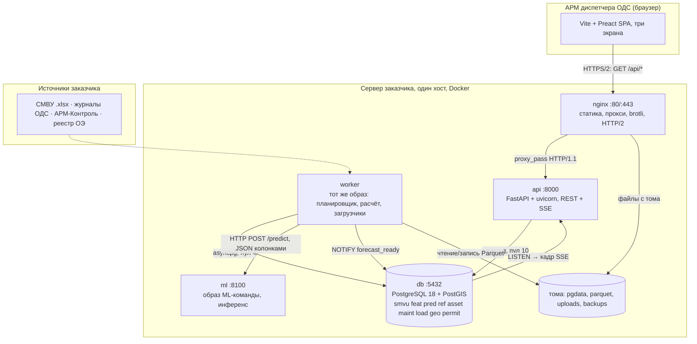

# Высокоуровневый дизайн сервиса прогнозирования аварий

АО «Москоллектор»: 825 км коллекторов. Участок у нас — пара (коллектор, пикет), пикет
10 м по ответу заказчика от 17.09.2026. **3173 участка** — замер по тегам выгрузки
15.09.2026, они покрывают 31,7 км из 825 км парка: выгрузка — около 1/26 парка по длине.
По числу датчиков пропорция другая: 11 485 каналов у нас против примерно 108 500
в парке заказчика (100 000 ОПС и ДУ плюс 8 500 метановых, доклад 17.09.2026) — 10,6 %.
Расчётное допущение 825 км / 200 м = 4125 отброшено
17.09.2026: пикет оказался десятиметровым, а не стометровым, и участки выгрузки не
покрывают весь парк, так что делить весь парк на размер пикета больше не имеет смысла.
Логи СМВУ за 12+ лет.

Это рабочий документ команды. Требования лежат в `docs/acceptance-test.md`, схемы БД —
в `code/*.sql`. Числа производительности я мерил сам в сентябре 2026 года и привожу
их здесь же: бюджет фронта в разд. 4.1, правила API в разд. 3.4, бюджет расчёта
по стадиям в разд. 8.2.
Здесь я собираю это в конструкцию и дописываю то, чего в них нет: границу
с ML-командой, состав контейнеров, порядок миграций, сквозные сценарии.

**Решено до меня, не переигрываю:** Vite + Preact вместо Next.js, обычный PostgreSQL
вместо TimescaleDB, DuckDB поверх Parquet для истории, колоночный JSON вместо MessagePack,
Docker как способ поставки. ~~Leaflet вместо MapLibre~~ — **решение снято 15.09.2026:**
экран `/map` стал схемой коллектора на SVG, Leaflet не собирается вовсе (разд. 4.1 и 4.2).
Заказчик подтвердил это дважды: голосом 17.09.2026 и письменно 19.09.2026 — «Схематичное
представление объектов, не привязанное к реальным координатам, допустимо и даже
рекомендуется». Карту Москвы больше не предлагаем.

**Решаю здесь впервые:** язык и фреймворк бэкенда (3), планировщик и защита
от двойного расчёта (3.4), контракт с ML (6), состав контейнеров (7), сведение
четырёх схем в одну базу и четыре расхождения между ними (5.2–5.3), E2E-тесты
по пользовательским историям на Playwright против стенда, а не Jest (7.1.2).

**Железо, к которому привязаны все числа:** сервер 4 ядра, 16 ГБ ОЗУ, SATA SSD;
АРМ диспетчера — старая офисная машина, 1280×1024, канал 1,6 Мбит/с, RTT 150 мс.
Оба предположения заказчик не подтвердил, это ОВ-2 и ОВ-3 в конце. Про сервер
17.09.2026 стало известно больше — разд. 9.5.

**Стек заказчика мы увидели 17.09.2026, и он совпадает с нашим в пяти позициях
из двенадцати:** PostgreSQL, Python, nginx, Debian, JavaScript. Разбор по именам
образов и по тому, чего у нас нет, — разд. 1.2.

---

## 1. Общая картина



Пунктир — источники, по которым способ доставки не согласован (ОВ-4). Сегодня это
ручная загрузка файла через интерфейс администратора, загрузчик уже написан
(`backend/app/ingest/smvu_csv.py`, читает и csv, и xlsx). Дадут сетевой доступ — заменим один модуль,
а не архитектуру.

### 1.1. Информационные потоки

Эта таблица — не украшение: она же служит заявкой на правила межсетевого экрана
(формат разд. 5.6 ЦТА КСУ ТОиР, Арктик СПГ 2).

| № | Отправитель | Получатель | Назначение | Протокол | Порт | Наружу |
|---|---|---|---|---|---|---|
| 1 | браузер АРМ | nginx | интерфейс, API, SSE, тайлы | HTTP/2 + TLS | 443 | **да** |
| 2 | nginx | api | проксирование `/api/*` | HTTP/1.1 | 8000 | нет |
| 3 | api, worker | db | запросы, LISTEN/NOTIFY | PostgreSQL | 5432 | нет |
| 4 | worker | ml | инференс `/predict`, `/model` | HTTP/1.1 JSON | 8100 | нет |
| 5 | worker | том `parquet` | архив и метки для обучения | файловый | — | нет |
| 6 | администратор | api | загрузка выгрузок .xlsx | HTTP/2 + TLS | 443 | **да** |

Наружу торчит один порт. Остальное живёт во внутренней сети Docker и с хоста
недоступно — это снимает половину разговора со службой безопасности заказчика.
Система садится в отдельный сетевой сегмент и тянет данные через шлюз, а не сидит
в одной сети с технологией — так собрана СПТМ ОРУ Иркутской ГЭС (разд. 5.1 ТЗ).

**HTTP/2 обязателен.** В HTTP/1.1 браузер держит не больше 6 соединений на домен,
одно из них у нас навсегда занято потоком SSE. Диспетчер, открывший седьмую вкладку,
получит зависшую. В HTTP/2 потоков по умолчанию 100.

### 1.2. Наш стек против стека заказчика

17.09.2026 начальник отдела по развитию эксплуатации информационных технологий
АО «Москоллектор» Дегтерев М. В. выступил на онлайн-форуме «Умные технологии Москвы»
и показал слайд «Используемые технологии и языки программирования»
(`docs/meetings/img-forum/26-25-стек-технологий.png`, запись доклада —
`docs/meetings/2026-09-17-форум-москоллектор-транскрипт.md`, [00:15:00]–[00:18:00]).
На слайде двенадцать имён. Я сверил их с тем, что мы кладём в поставку.

| Технология в СМВУ | Есть ли она у нас | Где именно у нас |
|---|---|---|
| PostgreSQL | **да** | контейнер `db` — образ `postgis/postgis:18-3.6`, PostgreSQL 18.6 (разд. 7.1) |
| Python | **да** | `api`, `worker`, `migrate` — образ `python:3.14-slim`, FastAPI 0.141.1 (разд. 7.1.2) |
| NGINX | **да** | контейнер `nginx` — образ `nginx:1.31-alpine`, раздаёт фронт и проксирует `/api/*` |
| Debian | **да** | `python:3.14-slim` и `postgis/postgis` собраны на Debian. Наш `nginx` — на Alpine, и Alpine Дегтерев назвал голосом в том же перечне: «Linux, Alpine Linux, Debian» [00:18:00] |
| JavaScript | **да** | фронт на Vite + Preact; TypeScript компилируется в тот же JavaScript, отдельного рантайма на сервере не появляется (разд. 2) |
| ClickHouse | нет | архив и обучающие выборки у нас на Parquet + DuckDB. Почему не ClickHouse — разд. 5.5 |
| Mosquitto (MQTT) | нет | показания принимаем по HTTP. Как это стыкуется с их брокером — разд. 10 |
| GeoServer | нет | координат в выгрузке нет, экран `/map` — схема коллектора на SVG (разд. 4.2) |
| Ext JS | нет | фронт на Preact 9,7 КБ gzip при бюджете 150 КБ на всё (разд. 4.1). Ext JS мы не мерили ни по весу, ни по лицензии — просто не рассматривали |
| SQLite | нет | одна база PostgreSQL на девять схем (разд. 5.1); второго хранилища мы не заводим |
| Ansible | нет | разворачиваем `docker compose` на одном хосте (разд. 9.4). Ansible окупается, когда хостов десятки |
| C++ | нет | нативного кода мы не пишем вовсе |

****Второй перечень заказчика — про заявки, а не про мониторинг, и складывать его с первым нельзя.** 19.09.2026 на вопрос, какие ИТ-решения компания использует для работы с заявками, он ответил: «собственные разработанные на базе фреймворков и готовых программных продуктов, GLPI, 1с, DocsVision, Django, Java, Kotlin и пр.» (`docs/meetings/2026-09-19-ответы-заказчика.md`, ответ 54). Слайд 17.09.2026 показывал стек СМВУ — системы мониторинга, в которую мы встаём; здесь названы системы соседнего контура, с которыми мы не интегрируемся вовсе, потому что тот же заказчик написал: «Никакие реальные интеграции не предоставляются». Поэтому на защите числа произносим раздельно: со стеком мониторинга совпадаем, с контуром заявок не пересекаемся и не должны. Пять совпадений из двенадцати — это довод на защиту, и произносить его надо числом.**
Инженер, который сегодня сопровождает СМВУ, открывает нашу поставку и видит те же
PostgreSQL, Python, nginx и Debian, что у него уже работают: второго рантайма
на сервере не появляется, второго языка сопровождения тоже, и дежурному не нужно
учить незнакомую СУБД. Тот же довод мы писали сами до встречи — разд. 3.1
(«один рантайм», «Python знают все, кто трогает ML») и разд. 2 («на сервере один
рантайм — Python»). Теперь под ним есть слайд заказчика, а не только наша логика.

**Одно расхождение внутри совпадения — фреймворк на Python.** Заказчик написал
письменно, что его система учёта дефектов и заявок построена на Django
(`docs/meetings/2026-09-17-эксперты.md`, разд. 2). Мы Django не берём, и причина
записана в разд. 3.1: тяжёлые запросы у нас уже написаны руками на SQL — с триггерами,
BRIN и `EXCLUDE USING gist`, — а Django продаёт как раз ORM поверх собственных миграций
и админку. Язык у нас с ними один, фреймворк разный, и на защите это лучше сказать
самим, чем услышать вопросом.

---

## 2. Структура репозитория

**Монорепозиторий на всё наше, отдельный репозиторий у ML-команды.**

Почему не один общий с ML: у них другой цикл — эксперименты, ноутбуки, веса, датасеты.
Их артефакты за месяц раздуют репозиторий до гигабайтов, а наша сборка фронта начнёт
ждать их зависимостей. Плюс граница из раздела 6 должна быть видна физически:
два репозитория — два владельца и один контракт.

Почему не пять (бэк, фронт, схемы, деплой, контракты): нас мало, выкатываем всё разом
одним `docker compose up`, и правка API почти всегда тянет правку фронта. В пяти
репозиториях это пять PR и ручная сверка версий, в одном — один PR и один тег.

```
moskollektor-service/
├── contracts/            ЕДИНСТВЕННОЕ место, где живёт граница с ML
│   ├── features.v1.yaml          вход: имена признаков, типы, единицы, окна
│   ├── predict.v1.schema.json    JSON Schema запроса и ответа /predict
│   ├── failure.v3.json           определение отказа, на котором учили модель v3
│   └── README.md                 правила изменения контракта
├── db/migrations/        нумерованные .sql, порядок — в разделе 5.4
├── db/seed/              типы событий, уставки Регламента, нормативы ТО
├── backend/app/
│   ├── api/ auth/ stream/ worker/ ingest/ archive/ mlclient/ domain/
├── frontend/src/screens/ {dashboard, map, log, orders}
├── frontend/lh-arm.js, lighthouserc.json   профиль «АРМ-ОДС», часть поставки
├── deploy/               docker-compose{,.dev,.stand}.yml, nginx/, .env.example
├── delivery/             презентация и страница сдачи
└── code/                 прототипы расчёта, схемы БД, разборщики выгрузок

moskollektor-ml/          репозиторий ML-команды
├── contracts/            копия наших файлов, обновляется по тегу
├── training/ serving/ models/ Dockerfile
```

*Дерево исправлено 15.09.2026 при заведении репозитория (`MOS-17`). Три правки. Каталог `tiles/` убран: карта Москвы заменена схемой коллектора решением ОВ-53, подкладывать растр не подо что — разд. 4 и 7.2 этого же файла уже говорили, что том `tiles` не создаётся, а дерево и схема разд. 1 всё ещё его рисовали. Каталог `auth/` добавлен: его требует `Q4.1` (роли), а в дереве он отсутствовал, хотя `docs/project-structure.md` называл его с самого начала. Каталог `delivery/` добавлен: в него кладёт файлы `Q9.7` (страница сдачи).*

Контракт живёт у нас, а не у них: перед заказчиком за приёмку отвечаем мы. Изменение
контракта — это PR в наш репозиторий, который ML-команда открывает сама, а мы
согласуем. Дальше они забирают файл по тегу.

Фронт собирается в статику и уезжает в образ nginx. Node живёт только на стадии
сборки: **на сервере один рантайм — Python**. Next.js в режиме App Router заставил бы
нас ставить, обновлять и мониторить второй рантайм — Node, ради серверного рендеринга,
который интерфейсу диспетчера не нужен: он открывается один раз за смену и его
не индексирует поисковик.

---

## 3. Бэкенд: на чём и почему

### 3.1. Сравнение трёх вариантов

Требуется: REST поверх PostgreSQL (~15 методов), поток SSE к десяткам клиентов,
расчёт по расписанию в 5 минут, чтение .xlsx с заливкой через COPY, соседство с ML
на Python.

| | **Python + FastAPI** | **Go + chi/pgx** | **Node + NestJS** |
|---|---|---|---|
| Второй рантайм на сервере | нет, ML уже на Python | да | да |
| Загрузчик xlsx | `python-calamine` 3,58 с на 500 тыс. строк, код готов | библиотек уровня calamine нет, придётся звать Python процессом | `exceljs` медленнее и прожорливее |
| Память на процесс | 150–250 МБ RSS | 20–40 МБ | 90–150 МБ |
| Размер образа | 180–250 МБ | 15–25 МБ | 180–300 МБ |
| SSE | `StreamingResponse`, 15 строк | горутина и канал | просто |
| OpenAPI для М-17 | генерируется из типов | руками или генератором | из декораторов |
| Кто сопровождает у заказчика | Python знают все, кто трогает ML | отдельный человек | отдельный человек |

**Беру Python + FastAPI (uvicorn, asyncpg).** Два довода, оба про экономию.

**Один рантайм.** Python на сервере обязан быть в любом случае — на нём инференс.
Go выигрывает 170 МБ на процесс, при четырёх процессах это 0,7 ГБ, то есть 4%
от 16 ГБ. За эти 4% я плачу вторым языком в поставке, вторым набором инструментов
сборки и вторым разговором со службой эксплуатации. Не стоит.

**Загрузчик уже написан и померен.** `load_smvu.py` читает 500 тыс. строк
за 3,58 с против 32,98 у pandas и льёт через COPY (232–316 тыс. строк/с против
31–38 тыс. у пакетного INSERT). Переписывать на Go — минус неделя и потеря
измеренного результата, причём этот шаг всё равно пришлось бы звать процессом Python.

Теряю честно: FastAPI на четырёх ядрах держит меньше запросов в секунду, чем Go.
Но нагрузка — десятки диспетчеров с одним SSE и запросом раз в минуту; даже сотня
при 23 КБ на соединение — это 2,3 МБ памяти. Узкое место у нас в расчёте, а не
в веб-слое: свёртка занимает 3 305 мс из 3,6 с (замер 22.09.2026 на стенде).
Прежде здесь стояло «сборка признаков, 20 с из 41» — после MOS-166 сборка
признаков укладывается в 48–64 мс, и узкое место переехало на свёртку.

Django не рассматривал: его сила — админка и ORM поверх собственных миграций,
а у нас схемы написаны руками на SQL, с триггерами, BRIN и `EXCLUDE USING gist`.

### 3.2. Что внутри

**asyncpg вместо ORM.** Тяжёлые запросы уже написаны на SQL в схемах
(`refresh_section_daily` в `db/migrations/004_events.sql`, `f_permit_features`
в `db/migrations/003_permits.sql`, `area_summary` в `db/migrations/002_geo.sql`).
ORM поверх них — слой, который эти же функции вызывает строкой. **Pydantic**
даёт валидацию и OpenAPI бесплатно: `/openapi.json` и `/docs` закрывают М-17.
Оба в корне, без префикса `/api` — FastAPI кладёт их туда сам.
**Пулы раздельные:** api 10, worker 4 — расчёт не должен съесть пул у интерфейса.

### 3.3. Планировщик и защита от двойного расчёта

| Вариант | Чем плох у нас |
|---|---|
| cron в контейнере | у контейнера нет init, cron — отдельный надзиратель, логи мимо `docker logs`, падение задачи никто не увидит |
| Celery + Redis | плюс два контейнера и 300–400 МБ памяти ради **одной** периодической задачи |
| **APScheduler в контейнере `worker`** | одна библиотека, логи в stdout; сам по себе от двойного запуска не защищает — см. ниже |

**Беру APScheduler в отдельном контейнере `worker`** из того же образа, что `api`,
с другой командой запуска.

| Задача | Когда | Норматив |
|---|---|---|
| Инкрементальный расчёт | каждые 4 минуты, слоты считаются от полуночи (MOS-146; было «каждый час в :05») | 5 минут (М-21), фактически 33,4 с |
| Полный расчёт | 03:00 и по кнопке | 5 минут |
| Ночной сервис: свёртка за всю историю, выгрузка Parquet, VACUUM ANALYZE | 03:30 | вне норматива, 30–60 мин |
| Пересчёт Precision/Recall за 30 суток | 04:30 | вне норматива |
| Проверка истёкших горизонтов (Ф-36) | каждые 10 минут | секунды |

**Двойной расчёт не пойдёт, потому что мешает советующая блокировка PostgreSQL.**
Расчёт первым делом берёт `pg_try_advisory_lock(48217)` — константа, одна на систему.
Не взялась — пишет в журнал «расчёт идёт с 09:05, run_id 48216» и выходит с кодом 0.

Почему advisory lock, а не флаг в таблице: **блокировка снимается сама, когда
умирает соединение.** Флаг после падения контейнера остаётся стоять, и наутро
окажется, что расчёты не идут вторые сутки, потому что никто не убрал строку.

**Сделано 17.09.2026, Q3.4 (MOS-34).** Из пяти заданий выше в `backend/app/worker/scheduler.py`
завелось два: полный расчёт по интервалу `SCHEDULER_INTERVAL_MIN` (**по умолчанию
4 минуты с 21.09.2026, было 60** — MOS-146; слоты выровнены по полуночи: расчёт
в начале интервала, а не через интервал после старта службы) и отдельно свёртка (`feat.refresh_section_daily`) по `SCHEDULER_REFRESH_INTERVAL_MIN`
(по умолчанию 5) — второе задание закрывает архитектурный блок строки НФ-73
`docs/acceptance-test.md`, а не входит в исходный список. Ночной сервис, пересчёт
метрик и проверка истёкших горизонтов — код других задач, которого пока нет.
Блокировка 48217 осталась в `run.прогон()`, планировщик её не повторяет.
`python -m app.worker.scheduler --selfcheck` проверяет механизм advisory lock
без модели и на своём ключе 48218, не на боевом: конкуренция двух сессий, снятие
явным `unlock`, снятие после обрыва соединения без `unlock`. **Ключ отдельный не
из перфекционизма — нашла проверяющая сессия 17.09.2026:** на боевом ключе
selfcheck конкурировал с настоящим часовым прогоном и падал `AssertionError`,
если тот в этот момент честно держал 48217. Красная строка без дефекта хуже
отсутствия проверки, поэтому теперь она не зависит от того, идёт ли расчёт.

Сверху — watchdog: если `pred.run` висит в `running` дольше 15 минут, следующий
запуск помечает его `failed` и идёт дальше. Иначе один зависший расчёт останавливает
систему навсегда.

### 3.4. REST API

Двадцать восемь маршрутов в двадцати семи строках — `GET /docs` и `GET /openapi.json`
стоят парой (счёт строк проверен 24.09.2026: до этого шапка говорила «двадцать»
при девятнадцати, шесть методов входа MOS-39 добавили без неё). Четырнадцать были
проверены на боевом стенде 21.09.2026 под двумя тестовыми учётками
(`db/seed/rbac.sql`), код ответа — в колонке «Ответил». **23.09.2026 добавлены
пять:** `GET /api/geo/sections` (MOS-45) и четыре метода MOS-42
(`GET /api/notifications`, `POST /api/notifications/{id}/ack`,
`GET /api/alerts/stream`, `GET /api/tech-events`). **24.09.2026 — ещё шесть,
вход по логину и паролю (MOS-39, Q4.2):** `POST /api/auth/login`,
`POST /api/auth/logout`, `GET /api/auth/me`, `GET /api/auth/info`,
`GET /api/auth/directory`, `POST /api/auth/directory/check` — у всех «Ответил»
пока не заполнен, колонку заполнит выкладка (миграция `047_auth.sql` встаёт
после 046, ещё не на стенде). **Тем же 24.09.2026 — ещё два, блокировка
пользователя из интерфейса (MOS-226, Q4.19, приёмка Ф-66):** `GET /api/auth/users`,
`PATCH /api/auth/users/{login}` — миграции нет, разрешения те же `settings.read`
и `settings.write`, что у `GET/PUT /api/settings`. Ранний план API, который здесь стоял

| Метод | Что отдаёт | Кому | Ответил | Приёмка |
|---|---|---|---|---|
| `GET /health` | `{"status": "ok"}` и ничего больше. Объявлен прямо на `app`, а не в роутере: живость не должна зависеть от разрешений и не пишется в `audit.user_action` | всем, заголовок не нужен | 200 без заголовка | М-14 |
| `POST /api/auth/login` | тело `{login, password}` → `{login, full_name, roles[], auth_source}` и `Set-Cookie mk_session` (`HttpOnly; Secure; SameSite=Lax`, `Max-Age` 28800 с у `local`, 3600 с у `ldap` — короче: администратор каталога может заблокировать учётку в любой момент). Способ решает `auth_source` учётки: `local` — argon2 против `ref.app_user.password_hash`, `ldap` (или неизвестный логин при заданном `LDAP_URI`) — simple bind и синхронизация ролей/области видимости из `ref.ldap_role_map`. 401 — один текст на «нет такого логина» и «неверный пароль», перебор логинов разведки не даёт | всем, ни кука, ни заголовок не нужны | 24.09.2026 на стенде (MOS-39, MOS-226): `admin1`, `dispatcher1`, `tech2` паролем — 200; заблокированный `tech2` — 401 | Ф-66 |
| `POST /api/auth/logout` | стирает `mk_session`, 204 без тела | всем | не проверено | — |
| `GET /api/auth/me` | тот же объект, что `login`; без сессии 401 | вошедшему, любая роль | не проверено | — |
| `GET /api/auth/info` | `{ldap_configured, demo_accounts[]}` для подсказки на экране входа; `demo_accounts` пуст, если `AUTH_DEMO_HINTS≠1` (на приёмке эксперта — 0, в `.env.example` поставки — 1 с пометкой «в эксплуатации 0») | всем, без сессии | не проверено | — |
| `GET /api/auth/directory` | адрес каталога, база поиска, шаблон DN и таблица `ref.ldap_role_map` для экрана «Служба каталогов»; `uri=""`, если `LDAP_URI` не задан | `settings.read`, администратор | не проверено | НФ-76 |
| `POST /api/auth/directory/check` | анонимный bind с таймаутом 3 с → `{ok, ms, message}`; каталог не отвечает — `ok=false` и понятный текст, не 500 | `settings.write`, администратор | не проверено | НФ-76 |
| `GET /api/auth/users` | список `[{login, full_name, auth_source, is_active, roles[]}]`, сортировка по `login`; учётка каталога, ни разу не входившая, в `ref.app_user` не лежит и в списке не появляется | `settings.read`, администратор | 24.09.2026 на стенде после выкладки `95c1de4`: admin1 → 200, dispatcher1 → 403; PATCH tech2 false/true → 200, между ними вход и старая кука 401; строка `audit.user_action` с `old`/`new` (замер 92, `code/check_block_user.py`) | Ф-66 |
| `PATCH /api/auth/users/{login}` | тело `{is_active}` → тот же элемент, что в списке. 404 — логина нет; 400 — `login` совпадает с текущим пользователем и `is_active=false` (себя не заблокировать). `request.state.audit_details = {login, old, new}` в `audit.user_action`. Блокировка каталожной учётки переживает следующий вход: `_sync_ldap_user` не трогает `is_active` | `settings.write`, администратор | 24.09.2026 на стенде после выкладки `95c1de4`: admin1 → 200, dispatcher1 → 403; PATCH tech2 false/true → 200, между ними вход и старая кука 401; строка `audit.user_action` с `old`/`new` (замер 92, `code/check_block_user.py`) | Ф-66 |
| `GET /api/risks` | текущий риск по каждому участку одной строкой: `section_id`, `probability`, `risk_rank`, `horizon_h`, `as_of`, `is_stale`, `risk_class`; источник — таблица `pred.forecast_current`. **`risk_class` добавлен 22.09.2026 (MOS-106, строка приёмки М-05):** колонка есть с миграции 026, но метод её не отдавал, схема коллектора читала поле, получала `undefined` и красила все 3 173 значка серым — уровень риска на карте не был виден вовсе. Класс считает расчёт, а не клиент: `publish.класс_риска()` держит гистерезис `risk_class_hysteresis`, а `publish.удержать_класс()` не даёт классу меняться чаще `risk_class_hold_min` минут; и то и другое — состояние МЕЖДУ прогонами, клиент видит одну точку во времени и воспроизвести их не может. Значения `high`/`normal`, возможен `null` до первого прогона по объекту. Замер 22.09.2026 на стенде: 3 173 строки, из них `high` — 303, `normal` — 2 870, без класса ноль. Ответ вырос с 435 221 до 504 421 байт (+16 %). **Первый замер в тот же день дал 3 173 `normal` и ноль `high`:** порог `risk_threshold_high` был 0,97 при максимуме модели 0,8676, то есть недостижим, и схема оставалась одноцветной. Порог опустила до 0,80 миграция `036_risk_threshold_v3.sql`, разбор запаса — ниже в этом же разделе, в абзацах про `ref.app_setting`. **Дата зовётся `as_of` с 21.09.2026 (MOS-118):** колонка хранит срез данных, а не время расчёта, и старое имя `computed_at` осталось за временем расчёта в соседнем методе. Переименовала миграция `025_forecast_current_as_of.sql`; пока она не выложена на стенд, стенд отвечает старым именем, и строки М-04 и М-15 в `code/check_frontend.py` красные | `risks.read` | 200 | М-15 |
| `GET /api/data-status` | три момента и отставание одной строкой: `data_edge` — докуда доехала выгрузка заказчика, `as_of` — срез последнего прогона, `computed_at` — когда этот прогон отработал, `lag_days` — на сколько суток срез отстал от края. **`lag_days` считает сервер, а не браузер:** вычти клиент две даты сам, он вычтет их в поясе браузера — на этом мы уже обжигались (коммит `d176033`, срез файла модели читался московским вместо пояса прогона). Знаменатель тот же, что у `run.прогон()`, то есть одно понятие — одно число. Замер 22.09.2026: при плановом прогоне `lag_days` равно 0,0, при ручном прогоне со срезом на час позже края — 0,0416667, то есть ровно час (замерено на прогоне 521; в первой редакции этой строки стояло 0,04168 — округление на единицу в пятом знаке, поправлено 22.09.2026). Поле сделано в MOS-148, а показывает его MOS-129: метод и документы правились одним заходом, второй проход по этой таблице и приёмочному листу стоил бы дороже поля. Край берётся из данных запросом `app.db.КРАЙ_ДАННЫХ` (`max(day)` по `feat.channel_daily`) — тем же, которым планировщик выбирает срез и которым `run.прогон()` меряет отставание. **Заведён 22.09.2026 (MOS-148), потому что дашборд выводил край из самих прогнозов:** брал `max(as_of)` по 3 173 строкам `GET /api/risks` и подписывал это число «конец выгрузки заказчика». Пока срез назначает планировщик, два числа совпадают и подмены не видно; прогон 501 на стенде со срезом 01.07.2026 при крае 30.06.2026 показал на плитке дату, которой в данных нет. Отдельным методом, а не полем в `GET /api/risks`: край — одно значение на весь парк, и в списочный ответ его пришлось бы либо повторить 3 173 раза, либо сломать форму ответа со списка на объект. Замер 22.09.2026 на боевом стенде: 426 байт и 208 мс против 435 521 байта и 310 мс у `GET /api/risks` — плитку можно обновлять раз в минуту (НФ-89), не перекачивая список рисков. `data_edge = null` означает «суточная свёртка пуста», а не ошибку | `risks.read` | 200 под `dispatcher1` и `admin1`, 401 без заголовка | М-04, М-15 |
| `GET /api/forecasts` | журнал прогнозов `{total, items[]}`. Параметры `from`, `to`, `limit`, `offset`. `from`/`to` — даты, обе границы включительны; `limit` — умолчание 200, потолок 1000; `total` — число совпадений по фильтру без обрезки страницей. В строке две даты разными полями: `as_of` — срез данных, `computed_at` — время работы расчёта (MOS-118), и `write_reason` — почему строка попала в журнал (MOS-147) | `forecasts.read` | 200 | М-06, М-16 |
| `GET /api/forecasts/{id}` | прогноз плюс массив `order_ids` — заявки, которые он породил. `as_of` и `computed_at` отдаются разными полями, это разные моменты | `forecasts.read` | 200 | М-12 |
| `GET /api/orders` | список заявок `{schema_version, total, items[]}`, параметры `limit` и `offset`; в строке — объект, вид работ, срок, `deadline_hours` (срок заявки в часах от обнаружения, `due_at − reported_at`), статус, код приоритета. **С 22.09.2026 (037, MOS-179) поля `lead_hours` нет** | `orders.read` | 200 | М-09, М-16 |
| `GET /api/orders/{id}` | карточка заявки: объект, вид работ, заказ ТОиР, приоритет с нормативом `response_hours`, `deadline_hours`, `warning_opened_at` (открытие предупреждения модели, `null` на прежнем пути), `risk_window_end` (конец окна риска), вложенный `forecast` с `forecast_id`, обоснование. **`forecast.predicted_failure_at` и `forecast.lead_hours` убраны** | `orders.read` | 200 | М-11, М-12, М-13 |
| `GET /api/objects/{id}` | карточка объекта: `smvu_key`, инвентарный номер, момент последнего показания | `objects.read` | 200 | М-08 |
| `GET /api/objects/{id}/readings` | ряд показаний за окно, параметры `from` и `to`. `from`/`to` обязательны: без них запрос обходит все 109 партиций `smvu.reading` | `objects.read` | 200 | Ф-91 |
| `GET /api/objects/{id}/channels` | каналы участка с фактом отказов `{total, items[]}`, параметры `limit`/`offset` (на участке бывает до 100 каналов). Отказ — эпизод модели v3 из представления `smvu.model_failure_event` (словарь D5 из `contracts/failure.v3.json`, длиннее часа, открытый считается; миграция 038, MOS-153), начат не раньше нижней границы `pred.weight_window()` (настройка `forecast_weight_window_from`, умолчание 2022-04-01, начало периода обучения модели; MOS-159, миграция 032) и до конца архива. Определение то же, что у веса `pred.section_weight` и у метрик М-18…М-20; окно у веса — период обучения целиком, до 2026-03-31, ему нельзя подглядывать в проверочное окно модели, а карточка — факт журнала для диспетчера, и апрель–июнь на ней есть. До 038 карточка считала экранные `smvu.fault_episode` вместе с «Неопределен»: на участке 1490 было 10 отказов с 2022-04, стало 0 | `objects.read` | 200 | М-05 |
| `GET /api/geo/sections` | геометрия участков: `?geometry=geojson` (по умолчанию) — FeatureCollection с типом `application/geo+json`, `?geometry=wkt` — `{crs, geometry_source, items[]}` со строкой WKT на участок. Параметр называется `geometry`, а не `format`: `?format=xml` занят под XML (Ф-80), и XML этот метод отдаёт, как все. `section_id` — фильтр списка: участок без геометрии или несуществующий даёт 200 и пустой список. В обоих ответах `"crs": "EPSG:4326"` и `"geometry_source": "synthetic"`: линии нарисованы нами (MOS-45, разд. 5.4, `046_synthetic_geometry.sql`), координаты обоих форматов одни и те же, по девять знаков после запятой. Подрезка областью видимости: `tech1` получает 79 участков, чужой `section_id` — 403 | `objects.read` | после выкладки MOS-45 | Ф-81 |
| `GET /api/settings` | все строки `ref.app_setting`, счёт не фиксирован — каждая новая настройка добавляет строку: горизонт, пороги Precision/Recall, риска и автозаявок, политика записи журнала, окно и сглаживание веса участка | только администратор | 200 под `admin1`, **403 под `dispatcher1`** | НФ-44 |
| `PUT /api/settings/{key}` | новое значение; старое и новое ложатся в `audit.user_action.details` тем же рядом, что пишет промежуточный слой на каждый запрос. Правило проверки — у каждого ключа (`_RULES` в `backend/app/api/settings.py`); ключ без правила отвечает 422 «нет правила проверки», а не 500, как до MOS-159 отвечали 10 ключей из 16 | только администратор | **422** под `admin1` на заведомо неверном значении, **403** под `dispatcher1` | НФ-44 |
| `GET /api/audit` | журнал действий `{total, items[]}`. Параметры `from`, `to`, `limit`, `offset`. `from`/`to` — моменты времени (`datetime`), а не даты | только администратор | 200 под `admin1`, **403 под `dispatcher1`** | НФ-77 |
| `GET /api/notifications` | уведомления от прогноза (`maint.notification`, `source_system='forecast'`) — вероятность, горизонт, локация (Ф-90) `{total, items[]}`. Параметры `acked` (true/false, без него — все), `limit`/`offset` | `notifications.read` | не проверено — 044 (MOS-107) ещё не на стенде | Ф-90 |
| `POST /api/notifications/{id}/ack` | квитирование (Q6.9): пишет `acked_by`/`acked_at`; повторный вызов не перезаписывает первую отметку (`UPDATE … WHERE acked_at IS NULL`, гонка решается на уровне строки) | `notifications.ack` | не проверено — 044 ещё не на стенде | — |
| `GET /api/alerts/stream` | SSE, разбор в разд. 4.3 ниже. Опрос раз в 5 с, пинг раз в 20 с при тишине, `Last-Event-ID` — курсор по `id`. Соединение из пула берётся на каждый опрос и сразу освобождается — не держится на весь поток | `notifications.read` | не проверено — 044 ещё не на стенде | Ф-88 |
| `GET /api/tech-events` | журнал технологических событий по форме Приложения 2 ТЗ ДЖКХ: пять колонок, `from`/`to` (потолок 31 сутки, иначе 422), фильтр по `sensor_kind`/`event_type`/`object`/`value_text`, `sort`/`order`. Разбор правила отбора строк и потолка диапазона — в шапке `backend/app/api/tech_events.py` | `tech_events.read` | не проверено — 044 ещё не на стенде | Ф-89 |
| `GET /docs`, `GET /openapi.json` | описание методов, генерирует сам FastAPI. Обратите внимание: без префикса `/api` | всем, заголовок не нужен | 200 без заголовка | М-17 |

**403 и 422 в колонке — это не поломка, а два ответа, которых я добивался нарочно.**
403 показывает, что ограничение по роли живое (НФ-44: диспетчер не имеет доступа
к настройкам), а не что метода нет — у отсутствующего метода код был бы 404.
422 у `PUT /api/settings/{key}` я получил, послав `forecast_horizon_h = 1`:
проверка отбивает значение меньше 24 до записи, поэтому маршрут доказан, а в базе
ничего не поменялось — после вызова `forecast_horizon_h` по-прежнему 24.

**Колонка «Кому» называет разрешение, но не весь доступ: с 23.09.2026 выдачу подрезает ещё
и область видимости** (MOS-107, разд. 3.5). У `GET /api/risks`, `GET /api/forecasts`
и `GET /api/orders` в ответе остаются только участки, которые видит пользователь, и `total`
считается по той же подрезке. У `GET /api/forecasts/{id}`, `GET /api/orders/{id}`
и `GET /api/objects/{id}` с `/readings` и `/channels` чужой участок даёт 403. Тому, кто видит
не весь парк, несуществующий объект тоже даёт 403, а не 404: иначе по разнице кодов техник
узнал бы, есть ли чужой объект. 404 получает только тот, кто видит весь парк. Под `dispatcher1`, `ods1` и `admin1` выдача полная, 3 173 участка; под
`tech1` — 79 участков коллектора «объект Бета». Проверяет строка «область видимости»
в `delivery/check-all.sh`.

**У 14 из 15 GET-методов `/api/` есть `response_model` (MOS-221, Q4.16), схема в `/openapi.json`
больше не пустая.** До 23.09.2026 методы отдавали сырой словарь из `asyncpg`, ни один
не был описан — первое условие готовности блока Q4 в `docs/plan.md` («тело проходит
по схеме из `/openapi.json`») проверить было не с чем: нашла проверяющая сессия 59
при написании `delivery/check-api-contract.py`. Модели — `backend/app/api/schemas.py`,
подключены только декоратором `response_model=`, тела методов не менялись. Два места,
где типизация молча меняла байты ответа, и как их закрыли: `datetime` у pydantic-core
пишется с суффиксом `Z` вместо смещения `+00:00`, которое даёт `jsonable_encoder` —
исправлено типом `IsoDatetime` с явным `.isoformat()`; `Decimal` (поле `settings.value`
и `avg_duration_h` у каналов) pydantic сериализует JSON-строкой, а не числом — исправлено
типом `JsonDecimal` с явным `float()`. Проверено 23.09.2026: 21 из 22 фиксированных
запросов (11 методов под `ods1` и `tech1`) дали побайтово одинаковое тело до и после
подключения схем; `GET /api/orders` под `ods1` разошёлся не из-за схемы — `ORDER BY
n.due_at` без второго ключа не держит порядок между заявками с одинаковым сроком,
это существующий пробел в `orders.py`, не относится к MOS-221. **Три метода добавила
тем же днём MOS-42 (Q4.5), и счёт из абзаца выше — уже с ними.** `GET /api/notifications`
и `GET /api/tech-events` получили свой `response_model` (`NotificationsResponse`,
`TechEventsResponse`) — модели лежат в самих `notifications.py` и `tech_events.py`,
а не в `schemas.py`: файл в ту же дату переписывала MOS-221, отдельные файлы — способ
не столкнуться. **`GET /api/alerts/stream` — тот один метод из пятнадцати без JSON-схемы,
и это не пробел, а факт формата:** ответ не JSON, а SSE, в openapi объявлен
`response_class=StreamingResponse` и `responses=` как `text/event-stream`.

**XML по выбору вызывающей системы (MOS-44, Q4.7, приёмка Ф-80).** Заголовок
`Accept: application/xml` или параметр `?format=xml` на любом из перечисленных
GET-методов оборачивает уже готовый JSON-ответ в XML: middleware `convert_to_xml`
в `backend/app/api/main.py` берёт байты ответа и пропускает их через сериализатор
`backend/app/api/xml.py` (`xml.etree.ElementTree` стандартной библиотеки, схему
XSD не пишем — ТЗ её не требует). Раскладка: элемент списка — `<item>`, ключ
словаря — имя элемента, а если имя не годится в XML — `<field name="…">`;
`null` — пустой элемент с `nil="true"`. **Требование строже плана:** XML отдают
все GET-методы, которые отвечают JSON, а не три перечисленных в `docs/plan.md`
4.7 — middleware стоит в одном месте, а не правкой в каждый метод, и этим же
решением закрыт ОВ-52. Ошибки 401/403/404 при запросе XML тоже выходят в XML:
middleware добавлен декоратором после `write_audit_log`, поэтому в стеке стоит
снаружи от него и снаружи от `ExceptionMiddleware`. Ответы не в JSON (поток SSE
из MOS-42, HTML `/docs`) middleware пропускает по `content-type`, как есть.
Проверка — не код ответа и не факт разбора парсером, а сверка каждого листа
XML-дерева со значением в JSON на `GET /api/risks` целиком и
`GET /api/forecasts?limit=1000`: `code/check_xml_response.py`, строка Ф-80
в `delivery/check-all.sh`; примеры вызова — `contracts/examples/api/examples.sh`.

**Параметры в таблице названы именами, а адреса из неё копировать нельзя.**
`?from=&to=&limit=&offset=` — это перечень имён; пустой `limit=` не разбирается
в число, и метод отвечает 422 ещё до обращения к базе. Я поймал на этом себя,
когда прогнал пути прямо из таблицы. Ниже — блок, который копируется целиком
и вызывает все четырнадцать методов с настоящими значениями (`-k` нужен потому,
что сертификат стенда самоподписанный, `docs/server.md`):

```bash
B=https://135.106.216.101
for u in /health /openapi.json /docs; do
  curl -s -k -o /dev/null -w "%{http_code}  $u\n" "$B$u"
done
for u in /api/risks "/api/forecasts?limit=1" /api/forecasts/424900 \
         "/api/orders?limit=1" /api/orders/79 /api/objects/1 \
         "/api/objects/1/readings?from=2026-06-01&to=2026-06-02" \
         "/api/objects/1/channels?limit=1"; do
  curl -s -k -o /dev/null -w "%{http_code}  $u\n" -H "X-User-Login: dispatcher1" "$B$u"
done
for u in /api/settings "/api/audit?limit=1"; do
  curl -s -k -o /dev/null -w "%{http_code}  $u  admin1\n"      -H "X-User-Login: admin1" "$B$u"
  curl -s -k -o /dev/null -w "%{http_code}  $u  dispatcher1\n" -H "X-User-Login: dispatcher1" "$B$u"
done
curl -s -k -o /dev/null -w "%{http_code}  PUT /api/settings/forecast_horizon_h  admin1\n" \
  -X PUT -H "X-User-Login: admin1" -H "Content-Type: application/json" \
  -d '{"value":"1"}' "$B/api/settings/forecast_horizon_h"
```

21.09.2026 блок отвечает 200 везде, кроме трёх нарочных отказов: 403 у диспетчера
на настройках и на журнале действий, 422 на `PUT` с заведомо неверным значением.
`forecast_horizon_h` после прогона по-прежнему 24 — значение меньше 24 отбивается
до записи, поэтому блок ничего в базе не меняет и его можно прогонять на стенде.

Команда, которой это проверяется целиком, лежит отдельным исполняемым файлом —
`contracts/examples/api/examples.sh` (приёмка М-17): он не описывает ответы словами,
а сверяет их с настоящими при каждом запуске.

```bash
BASE_URL=https://135.106.216.101 CURL_OPTS=-k bash contracts/examples/api/examples.sh
```

**Числа пересчитаны 15.09.2026 на фактических 3173 участках** (`code/payload_budget.py`).
Прежняя цифра «19 КБ» была неверна дважды и при этом описывала не то и не другое:
участков оказалось на 23 % меньше, чем закладывали, зато карте нужен слой на каждое
из четырёх направлений, и там ответ втрое тяжелее.

| Что отдаём | raw | gzip | brotli | на участок |
|---|---|---|---|---|
| сводка дашборда колонками | 79 026 | 18 025 | **9 339** | 2,94 Б |
| карта, риск по 4 направлениям | 163 696 | 42 646 | **29 652** | 9,35 Б |
| кадр статусов для SSE | 12 718 | 1 289 | **1 165** | 0,37 Б |
| дельта на 40 изменившихся | 1 140 | 311 | **270** | 0,09 Б |

Геометрия — отдельная история, и точность координат решает всё:

```
8 точек на участок, полная точность      brotli  334 697
то же, округление до 5 знаков            brotli  115 265
упрощение до 2 точек, 5 знаков           brotli   50 986
точки-центроиды, 5 знаков                brotli   24 776
```

Пятый знак после запятой — это метр на местности, для карты коллектора достаточно.
Одно это округление даёт трёхкратную экономию.

Пять правил на все ответы — они про форму ответа, а не про пути. Правила мы
поставили себе 15.09.2026, и это не то же самое, что выполнили: после каждого
стоит, что из него сделано на 21.09.2026. Проверял вызовом стенда, а не чтением кода:

1. **Колонки вместо массива объектов** там, где больше 200 записей: массив объектов
   после brotli — 49,0 КБ, колонками — 11,9 КБ. В 4,1 раза, ценой часа работы
   над сериализатором. **Не сделано:** `GET /api/risks` отдаёт массив объектов
   на 3 173 записи, сериализатор не написан. Выигрыш посчитан, и только.
2. **`ensure_ascii=False`.** Экранирование кириллицы даёт +5% после сжатия и +33%
   до него (802 КБ против 1066), и эти 33% платит `JSON.parse` на слабой машине.
   **Сделано:** в теле ответа стенда кириллица едет как есть —
   `"object_name":"Коллектор 477, пикет 72"`, а не `\u041a\u043e\u043b...`.
3. **ETag, ключ — `run_id`.** Планшет опрашивает раз в минуту, прогноз меняется раз
   в час: 59 из 60 ответов становятся пустыми 304, трафик падает с 14,9 МБ в час
   до 266 КБ на клиента. На поток SSE ETag не ставим: тело 1,5 КБ, а заголовки
   стоят почти 800 байт — экономить нечего. **Не сделано:** заголовка `ETag`
   в ответе нет, и в `backend/app/` его никто не ставит. Планшет пока забирает
   полный ответ каждую минуту.
4. **Brotli:11 на статику при сборке, brotli 4–5 на динамику, gzip запасным.**
   Одиннадцатый уровень жмёт 0,6 МБ/с против 32,9 у gzip:9 — на динамике недопустим.
   **Наполовину:** `gzip on` в `deploy/nginx/nginx.conf` стоит, brotli нет —
   в образе `nginx:1.31-alpine` модуль `ngx_brotli` не собран. На запрос
   с `Accept-Encoding: br` стенд отвечает `content-encoding: gzip`.
5. **Курсорная пагинация — на объёме, где смещение действительно дорого.** Число
   «8 секунд» меряно на 50 млн строк: там `OFFSET 99980` заставляет базу прочитать
   и выбросить сто тысяч строк, keyset — 0,9 мс на любой глубине. У нас в
   `pred.forecast` 425 183 строки на 21.09.2026, в 118 раз меньше, и цена смещения
   другая. Замер того же дня на боевом стенде, запрос страницы журнала
   (`EXPLAIN ANALYZE`, `LIMIT 200`, без фильтра по дате):

   | смещение | сам запрос | тот же вызов через API целиком |
   |---|---|---|
   | 0 | 136 мс | 0,66–0,70 с |
   | 100 000 | 173 мс | 1,03–1,09 с |
   | 400 000 | 449 мс | 1,15–1,17 с |

   Глубокое смещение стоит 313 мс запроса, а не 8 секунд. Разница между двумя
   колонками — постоянный `COUNT(*)`, TLS и передача ответа, они от смещения
   не зависят. Поэтому задача 4.13 (MOS-117) сделала `limit`/`offset`, а не keyset,
   и это не отступление от правила: правило начинает работать на десятках миллионов
   строк. Порог, за которым переходим на keyset, — секунда на страницу; линейная
   прикидка по трём точкам выше кладёт его примерно на 1,2 млн строк журнала,
   то есть на десятые сутки непрерывной работы планировщика (один расчёт добавляет
   3 173 строки в час). Это прикидка, а не замер: дойдём до миллиона — померим заново.

Бинарные форматы не берём: измерено, MessagePack после brotli весит 55,9 КБ против
49,0 у сжатого JSON и разбирается медленнее нативного `JSON.parse`.

Дальше — подробности по тем методам, которые их требуют: почему `total` считается
отдельным запросом, чем `as_of` отличается от `computed_at` и что стоит за
`GET`/`PUT /api/settings`.

**`GET /api/forecasts` до 21.09.2026 отдавал голый массив, теперь — объект
`{total, items}`, как `GET /api/orders`.** Смена поля ответа задела оба места,
которые его разбирали: `frontend/src/screens/log/` (журнал прогнозов) и
`contracts/examples/api/examples.sh` (М-17). `total` считается отдельным
запросом `COUNT(*)`, а не оконной функцией `count(*) OVER()` в одном запросе
с `LIMIT` — на полном журнале без фильтра по дате `pred.forecast` идёт
последовательным сканированием, и оконная функция заставляет отсортировать
все 425 183 строки до обрезки страницей: 415 мс против 68+121=189 мс раздельно
(замер 21.09.2026, боевой стенд). **У `GET /api/orders` сперва оставили оконную
функцию** — там `maint.notification` ведёт джойн от 224 строк, план быстрый
(21 мс) — **но она же и оказалась дефектом:** `count(*) OVER()` живёт внутри
строк ответа, а за последней страницей строк нет, и `total` молча подставлялся
нулём (`GET /api/orders?offset=1000` отвечал `total=0` при 224 заявках — нашла
28, 21.09.2026). Починили тем же способом, что у прогнозов: отдельный
`COUNT(*)` в `backend/app/api/orders.py::COUNT_SQL`, от страницы не зависит.

**`predicted_failure_at` и `lead_hours` убраны 22.09.2026 (миграция 037, MOS-179).**
Оба считались от `as_of + horizon_h` как от момента отказа, а это конец окна риска:
модель говорит «отказ возможен в ближайшие `horizon_h` часов». Вместо них API отдаёт
колонки самой заявки — `warning_opened_at` и `risk_window_end` — и срок двумя числами
рядом: `deadline_hours` (`due_at − reported_at`, из двух колонок заявки) и норматив
приоритета `priority.response_hours`. У заявок, заведённых до 037, они расходятся —
их срок считался по старой формуле, и задним числом мы его не переписываем.

**Две даты в ответах, и с 21.09.2026 их различают имена, а не подписи.** `as_of` —
срез данных, на котором считал расчёт (снимок выгрузки заказчика, `pred.run.as_of`);
`computed_at` — когда сам расчёт выполнился (`pred.run.started_at`). **Это правило
одно на все методы** (MOS-118): `GET /api/risks` отдаёт `as_of`, `GET /api/forecasts`
и `GET /api/forecasts/{id}` — обе даты рядом, `GET /api/objects/{id}` — `as_of`
у `current_risk` и `computed_at` у `recent_forecasts[]`.

До этого `GET /api/risks` отдавал срез данных под именем `computed_at`, а
`GET /api/forecasts` тем же именем — время расчёта: клиент, читавший оба метода,
сравнивал несравнимое. Разницы было не видно, пока расчёт брал срез по текущей дате
(на стенде 21.09.2026 прогон 147: `as_of` 06:37:35.905103 против `started_at`
06:37:35.905229 — 124 микросекунды). После MOS-142 срез идёт по краю выгрузки,
30.06.2026, и те же две даты расходятся на 83 суток. Колонку
`pred.forecast_current.computed_at` переименовала в `as_of` миграция
`025_forecast_current_as_of.sql` — второе имя рядом со старым оставило бы старое
читаемым, и клиент продолжил бы получать дату, только уже не ту. До 17.09.2026 карточка прогноза подписывала
`computed_at` как «Прогноз от …», а ссылка на тот же прогноз в карточке заявки —
`as_of` тем же текстом: клик по одной дате приводил на экран с другой датой
в заголовке, и это выглядело как ошибка. `ForecastCard.tsx` показывает оба
момента словами («срез данных …, расчёт …»), `OrderCard.tsx` подписывает ссылку
«срез данных …» — та же формулировка, что и в заголовке карточки прогноза.

**Пропуск в журнале прогнозов означает «значение не менялось», а не «расчёт не
шёл».** С миграции `026_forecast_write_policy.sql` расчёт пишет строку в
`pred.forecast`, только когда вероятность вышла за мёртвую зону, сменился класс
риска или подошёл безусловный «пульс» — раз в час на объект. Подход взят из
OPC UA часть 11 (Historical Access), где рядом стоят `ExceptionDeviation`
и `MaxTimeInterval`, и из COV в BACnet; свойств обязательно два, потому что
порог без пульса молча теряет всплески — 35 % кратковременных аномалий при
агрессивном сжатии по замеру инженеров Aramco (arXiv:2510.26868), а всплеск
вероятности перед отказом это и есть наш Recall.

Причину каждой строки несёт поле `write_reason`: `first` — первый прогноз
объекта, `change` — изменение, `heartbeat` — пульс, `full` — прогон с полным
журналом (`pred.run.full_log`, обратный расчёт для замера метрик М-18 и М-19),
`warning` — участок, на который этот прогон заводит заявку по новому предупреждению
модели (миграция 037, MOS-180): без неё заявка ждала пульса до часа.
Пропуски самого расчёта видны не в журнале прогнозов, а в `pred.run`, и их
стережёт строка приёмки НФ-91. Текущий прогноз при этом остаётся полным:
`pred.forecast_current` переписывается целиком каждый расчёт, все 3 173 строки —
«что показать диспетчеру сейчас» и «что система показывала в момент T» это
разные вопросы.

**Пульс обязан быть короче самого короткого повтора предупреждений, и запас
у нас четыре минуты.** Замер 21.09.2026 по ряду модели v3 (`code/check_write_policy.py`):
самый короткий повтор предупреждений одного объекта — 63,97 минуты при нашем пульсе
60 минут, поэтому на этом ряду прореживание не выбрасывает ни одного предупреждения
и метрика не двигается вовсе. Это не свойство политики, а свойство ряда: стоит пульсу
стать на минуту длиннее самого короткого повтора, как Recall уже падает с 0,528
до 0,523, а при пульсе в 30 суток — до 0,085. Значит с приходом обученной модели,
где повторы чаще часа появятся, пульс придётся укорачивать вместе с интервалом
расчёта, и число для этого даст та же проверка.

**Сжатие начинается ровно тогда, когда расчёт становится чаще пульса.** Пока
расчёт шёл раз в час и пульс был час, политика не отсекала ничего: каждый прогон
писал каждый объект, отношение сжатия единица. После MOS-146 расчёт идёт раз
в четыре минуты — пятнадцать прогонов в час, — а пульс остался часовым, и журнал
получает из этих пятнадцати один плюс настоящие изменения. Нижняя граница журнала
при 3 173 участках — 76 152 строки в сутки вместо 1 142 280, то есть учащение
расчёта в пятнадцать раз не увеличивает журнал вовсе.

На ряду предупреждений модели v3 прореживание с шагом 60 минут не отсекает ни одной
записи, с шагом 90 минут отсекает 9 из 166, со 120 минут — 17, с шести часов — 40.
Это и означает, что сегодня пульс метрику не двигает: он короче самого короткого
повтора предупреждений.

**`GET`/`PUT /api/settings` заменили константу `ГОРИЗОНТ_Ч` в `backend/app/worker/run.py`
на данные.** Заказчик сказал дважды на встрече 17.09.2026, как о само собой
разумеющемся: «у администратора есть возможность их поправить» и «это то, что
задается в системе, там, в админке». `прогон()` читает `forecast_horizon_h` из
таблицы, когда горизонт не передан явно (так его зовёт планировщик); константа
осталась значением по умолчанию на случай пустой таблицы, а не источником истины.
`PUT` проверяет значение перед записью: `forecast_horizon_h` — целое не меньше 24
(постановка требует горизонт не меньше 24 часов), `precision_min`, `recall_min`
и `risk_threshold_high` — в открытом интервале (0, 1); неверное значение отвечает
422 и в базу не идёт.

**Из четырёх строк `ref.app_setting` на сегодня, 18.09.2026, живых три.**
`forecast_horizon_h` читает `backend/app/worker/run.py`, `precision_min`
и `recall_min` — `code/check_metrics.py` (приёмка М-18/М-19), у обоих есть
`DATABASE_URL` в рантайме, поэтому оба видят правку администратора без
пересборки образа. **`risk_threshold_high` пока не читает никто** — это честно
незакрытый конец: строка хранится и правится через API, но ни на один расчёт
не влияет. Читать её должен экран 5.10 (`MOS-113`), который пока не сделан.
До тех пор это витрина без механизма, и на приёмке так и говорим, а не
обещаем то, чего нет.

**Живых четыре, а не три — абзац выше устарел 21.09.2026.** `risk_threshold_high`
читает расчёт: `publish.политика()` берёт его из `ref.app_setting` вместе
с остальными настройками записи журнала, а `publish.класс_риска()` сравнивает
с ним вероятность участка и кладёт результат в `pred.forecast_current.risk_class`.
Правку администратора расчёт видит со следующего прогона, то есть не позже
чем через 4 минуты, без пересборки образа. Абзац про витрину без механизма
оставлен как есть нарочно: он верен на свою дату, и по нему видно, когда конец
был закрыт.

**Значение опущено с 0,97 до 0,80 миграцией `036_risk_threshold_v3.sql`
22.09.2026 (MOS-106, строка приёмки М-05).** Причина — смена модели: 0,97
подобран под заглушку, дававшую числа до 0,9991, а модель v3 отдаёт по парку
максимум 0,8676. Класс `high` поднимается при `p >= порог + risk_class_hysteresis`,
то есть прежний порог требовал 0,99, и участков с высоким риском было ноль
из 3 173 — схема коллектора оставалась одноцветной. После наката `high` — 303
участка, `normal` — 2 870.

**Почему именно 0,80, и где у этого числа запас.** Модель отдаёт всего 16 разных
вероятностей на 3 173 участка, и они стоят сгустками. Мёртвая зона гистерезиса
при пороге 0,80 — это интервал от 0,78 до 0,82; значений внутри него нет
ни одного, поэтому класс не зависает между состояниями. Но запас с двух сторон
разный, и меньший стоит назвать вслух: ближайший сгусток снизу — 0,773631, это
267 участков, до нижней границы им **0,0064**; ближайший сверху — 0,867559, это
303 участка, до верхней границы **0,0476**. Сдвинься модель на сотую вверх, и эти
267 участков попадут в мёртвую зону: класс у них не сменится, а замрёт на прежнем,
и произойдёт это молча. Порог, безопасный с обеих сторон на этом распределении, —
любой из интервала 0,7937…0,8476, середина 0,82. Число 0,80 назвала Слава
22.09.2026, оно внутри интервала, и менять его ради симметрии мы не стали:
к нему привязано объяснение заказчику, а разница видна только при смене модели.
Проверять это надо при каждой замене весов — самопроверка миграции 036 сторожит
только верхнюю сторону (`high` достижим), нижнюю не сторожит никто.

#### Ранний план API: отменён целиком

До 21.09.2026 раздел открывался таблицей из двенадцати методов, расписанных
15.09.2026 — до того, как их написали. **Сервер не отвечает ни по одному из этих
путей.** Дело не в префиксе: из двенадцати методов того плана у пяти есть наследник
под другим путём и с другой формой ответа, а у семи нет ничего.

| Было в плане | Что отвечает сегодня |
|---|---|
| `GET /forecast/current`, `?layers=all` | `GET /api/risks` — без слоёв по направлениям, одна строка на участок |
| `GET /sections/{id}` | `GET /api/objects/{id}` |
| `GET /sections/{id}/events?cursor=` | `GET /api/objects/{id}/readings?from=&to=` — даты вместо курсора |
| `GET /forecasts?from=&to=&cursor=` | `GET /api/forecasts?from=&to=&limit=&offset=` |
| `GET /notifications` | `GET /api/orders` |
| `GET /dashboard` | ничего. Дашборд собирается несколькими вызовами, батча одним методом нет |
| `POST /forecasts/{id}/feedback` | ничего, метода нет |
| `POST /notifications/{id}/approve` | ничего, метода нет |
| `GET /geo/sections?bbox=&z=` | ничего, метода нет (разд. 11.7 держит эту строку открытой) |
| `GET /stream` | ничего, потока SSE нет (разд. 4.3 — план, не факт) |
| `POST /runs`, `GET /runs/{id}` | ничего. Расчёт запускает планировщик и `app.worker.run` из командной строки, HTTP-метода у него нет |

**Строки приёмки из отменённой таблицы я убрал нарочно, а не потерял.** Там стояли
М-04, М-05, М-06, М-08, М-15, М-16 и М-21, и они уводили читателя: приёмщик открывал
раздел, чтобы узнать, чем закрывается М-15, читал `GET /forecast/current` и получал
404. Ровно такой случай у нас был 16.09.2026 с `/openapi.json`. Половина этих строк
к REST API вообще не относится: М-04, М-05 и М-06 закрываются экранами
(разд. 4.2), а М-21 — временем полного расчёта, который запускает планировщик.
Где искать каждую живую строку, написано в таблице в начале раздела.

Числа бюджета ответа выше считаны по формам из этого плана: «сводка дашборда» —
это `GET /dashboard`, «карта, риск по 4 направлениям» — `?layers=all`, «кадр статусов
для SSE» — `GET /stream`. Как бюджет на форму ответа они остаются верны, но метода,
который такой ответ отдаёт, сегодня нет ни одного.

### 3.5. Вход, роли, аудит

**Роль говорит, что человек может делать, область видимости — с какими объектами, и это
разные поля.** Разделили их не мы: 19.09.2026 заказчик описал свою действующую модель так —
«роли "диспетчер" подразделения эксплуатации видит дерево своего района, "диспетчер ОДС"
центральной диспетчерской видит всё, "техник" видит только один комплекс, "администратор"
ИС. Также группы созданы для комплексов коллекторов, для области видимости. Роли
складываются» (`docs/meetings/2026-09-19-ответы-заказчика.md`, ответ 4). На вопрос, видят ли разные диспетчеры общие заявки и журнал,
он ответил «нет» (ответ 15).

**Как это устроено у нас с 23.09.2026 (MOS-107, миграция `db/migrations/044_roles_scope.sql`).**
До этого дня раздел предлагал одну колонку `scope_object_id` в `ref.app_user` и не складывал
роли, оговорив: «появится требование — заведём `ref.user_scope`». Требование появилось:
строка приёмки Ф-94 дословно пишет «Роли складываются», и эксперт проверит это по строке.
Поэтому стоят две таблицы, а не колонка.
Коды ролей — `dispatcher`, `ods_dispatcher`, `technician`, `admin`, по одной на каждое имя
заказчика; прежние `analyst` и `engineer` миграция убрала, их учётки отключила
(`is_active = false`, строки остались ради внешних ключей). Роли складываются: они лежат
в `ref.user_role (login, role_code)`, у человека их может быть несколько, и `require()`
пускает, если нужное разрешение даёт хотя бы одна. Область видимости лежит отдельно,
в `ref.user_scope (login, object_id → smvu.object_tree)`: узел уровня 2 — сам коллектор,
узел уровня 1 — все коллекторы под ним. Участок относится к коллектору тем же запросом
`УЧАСТКИ_КОЛЛЕКТОРА`, что в прогнозе (`backend/app/worker/run_v3.py`), — второй копии
правила нет. Спорный участок решает большинство каналов, как в прогнозе: участок 1490
(«798:0») висит 13 каналами на коллекторе 12 «объект Зита» и 3 каналами на коллекторе 6
«объект Бета», поэтому техник Беты его не видит. Отсюда два числа для Беты: 80 участков,
если считать всех, у кого есть хоть один канал под коллектором, и 79 по правилу большинства;
верное 79. Других участков на двух коллекторах в выгрузке нет. `ods_dispatcher` и `admin` видят всё без строк в `ref.user_scope`;
у `dispatcher` и `technician` без строк там выдача пустая, а не полная.

Всё это одна функция `видимые_участки()` в `backend/app/auth/deps.py` рядом с `require()`.
Её вызывают `GET /api/risks`, `GET /api/forecasts`, `GET /api/forecasts/{id}`,
`GET /api/objects/{id}` вместе с `/readings` и `/channels`, `GET /api/orders`
и `GET /api/orders/{id}`: в списках чужого участка просто нет, а карточка чужого участка,
прогноза или заявки отвечает 403. `GET /api/tech-events` и поток уведомлений подрезку
получат, когда их вольют (MOS-42).

**Район в выгрузке один** — узел 5773 «Район по эксплуатации», под ним 16 коллекторов.
Поэтому диспетчер района видит все 3 173 участка, так же как диспетчер ОДС, и различает
их пока только правило, а не число. Сузить выдачу сегодня можно только технику: тестовый
`tech1` привязан к коллектору 6 «объект Бета», это 79 участков и 11 заявок из 303
на 23.09.2026. Районы мы не выдумываем. Сложение областей проверяет `tech2` с двумя
коллекторами, 6 и 4068 «объект Сигма»: 79 + 9 = 88 участков — строго между одним
коллектором и всем парком.

**Учётные записи мы не заводим и не редактируем.** На вопрос, какие данные аккаунта может
менять администратор, заказчик ответил: «Несущественно, учетные записи ведутся вне ИС,
в каталоге AD» (ответ 16). Это снимает с плана экран управления пользователями: ФИО, почта,
должность и телефон живут в каталоге, у нас лежат логин, имя, роль, область видимости
и признак блокировки.

**Чем докажем LDAP на приёмке, если каталога заказчика не будет.** Его и не будет: «Доступа
к стейдж/дев/тест стендам или тестовому контуру контроллера домена нет» (сводный 10),
а на прямой вопрос о тестовом контуре ответ был короткий — «Любой LDAP сервис» (ответ 31).
Значит доказываем своим: профиль `ldap` в `deploy/docker-compose.yml` (`deploy/ldap/`,
MOS-39) с одним контейнером каталога — `debian:trixie-slim` и пакет `slapd`, лицензия
OpenLDAP Public License — и файлом `bootstrap.ldif` на четыре учётные записи по числу
ролей. Профиль не поднимается в обычном `docker compose up`, только явно вторым
`--profile`, но **в поставку входит** — это правка 24.09.2026, до неё здесь стояло
«в поставку не входит», когда контейнера ещё не существовало и решение было на словах.
Формулировка заказчика «интеграция с LDAP/AD не требуется»
снимает интеграцию **с его** каталогом, а не поддержку LDAP: ТЗ разд. 11 её требует,
и НФ-76 остаётся обязательной.

Ролей четыре, и называются они словами заказчика: **диспетчер, диспетчер ОДС, техник,
администратор** (Ф-66). До 23.09.2026 здесь стояли «аналитик» и «инженер» из ТЗ разд. 12;
заказчик назвал свои роли сам, этих двух среди них нет, и MOS-107 их убрала.

Вход по личной учётной записи, двумя способами через одну форму. Основной —
**LDAP simple bind** к службе каталогов заказчика: адрес контроллера, база поиска
и шаблон DN лежат в `.env` (`LDAP_URI`, `LDAP_BASE_DN`, `LDAP_USER_TEMPLATE`),
при успешном bind пользователь заводится в `ref.app_user` с `auth_source='ldap'`,
роль и область видимости берутся из членства в группах каталога по таблице
`ref.ldap_role_map` (`db/migrations/047_auth.sql`) — при каждом входе пересчитываются
заново, поэтому блокировка «убрать из групп каталога» действует немедленно. Пароль
у нас при этом не хранится вообще (`password_hash IS NULL`). Запасной — локальная
запись (`auth_source='local'`, argon2, `backend/app/auth/password.py`): она нужна
администратору и приёмочной учётке, чтобы вход работал, когда каталог недоступен.
Правила паролей для локальных записей берём из разд. 8.4 ЦТА КСУ ТОиР — минимум
8 символов, срок не больше 90 суток.

**Почему bind, а не Kerberos.** ТЗ разд. 11 требует «поддержку интеграции
с корпоративной службой каталогов (LDAP/AD)» — то есть система обязана уметь, а не
обязана быть единственным способом входа. Simple bind закрывает это требование
сорока строками на `python-ldap` (лицензия в стиле Python, классификатор PyPI — PSF) и тремя полями конфига; `ldap3` не берём —
он под LGPLv3, а её в поставке нет (разд. 7.3). Прозрачный вход по доменной сессии
через Kerberos требует сервисную учётную запись и SPN, а это недели согласований
с админами домена, поэтому он остаётся отложенным (разд. 10). Требование ТЗ при этом
закрыто, и на приёмке это проверяется строкой НФ-76.

**Сессия — кука `mk_session`, не токен в заголовке.** Подпись HMAC-SHA256
ключом `AUTH_SECRET` на стандартной библиотеке (`hmac`, `base64`; без новой
зависимости), внутри логин и срок (`backend/app/auth/session.py`). `HttpOnly;
Secure; SameSite=Lax; Path=/`. Срок разный: у `local` — 8 часов (`Max-Age=28800`,
единственный запасной путь входа, реже перелогиниваться удобнее), у `ldap` —
1 час (`Max-Age=3600`, решение Славы 24.09.2026: администратор AD может
заблокировать учётку каталога в любой момент, и час — тот срок, за который
блокировка успевает подействовать, не дожидаясь истечения куки). Без `AUTH_SECRET`
процесс `api` не стартует — падает понятной ошибкой при импорте, а не посреди
первого запроса. Заголовок `X-User-Login` без пароля (заглушка Q4.1) принимается
только при `AUTH_TRUST_HEADER=1`; на нашем стенде — 1, потому что на нём держатся
19 файлов проверок, написанных до входа, но в `.env.example` поставки — 0,
и на приёмке эксперта подделка заголовка отвечает 401 (НФ-43).

**Демо-учётки на экране входа (`GET /api/auth/info`, `AUTH_DEMO_HINTS=1`)
и учётки демо-каталога — разные пары «логин/секрет».** `dispatcher1`, `ods1`,
`tech1`, `admin1` (и `tech2` для проверки сложения области видимости) —
локальные, с готовым паролем и argon2-хешем в `db/seed/rbac.sql`, демо обязано
работать без каталога вовсе. `ldap_dispatcher1`, `ldap_ods1`, `ldap_tech1`,
`ldap_admin1` — учётки того же профиля `ldap` в `deploy/ldap/bootstrap.ldif`,
в `ref.app_user` их заводит сам первый вход. Группы каталога: `role-dispatcher`,
`role-ods`, `role-tech`, `role-admin` дают роль, `scope-tech-6` — область
видимости технику (узел 6 «объект Бета», тот же, что у локального `tech1`, —
оба пути дают одно и то же число участков на приёмке, легче сверять).

Аудит пишем в `audit.user_action` (схема `audit`, миграция `db/migrations/009_audit.sql`);
~~`ref.audit_log`~~ — имя из более раннего плана, такой таблицы нет, при расхождении верен
`docs/plan.md`, Q4.10. Требование подтверждено письменно 19.09.2026: на вопрос «Нужен ли
журнал действий пользователей: кто создал заявку, изменил решение или удалил аккаунт?»
заказчик ответил «да» (`docs/meetings/2026-09-19-ответы-заказчика.md`, ответ 17). Пишем: кто, когда, что, прежнее и новое значение, причина
(Ф-53, Ф-69). Две оговорки оттуда же: **журнал аудита автоматически не удаляется**,
и протоколировать изменения часто меняющихся таблиц нельзя — база распухнет.
Поэтому аудит только на действиях человека, а не на потоке событий СМВУ.

Проверка в ПМИ: прямой переход по URL закрытого раздела обязан дать отказ,
а не содержимое.

---

## 4. Фронтенд

### 4.1. Стек: число за каждым пунктом

| Решение | Число, которое его держит |
|---|---|
| **Next.js не берём** | пустая страница `create-next-app` — 107,5 КБ сжатого JS на Next 15 и 138,9 на Next 16 при бюджете 150 КБ на всё. Остаток 11–43 КБ — не бюджет |
| **Vite + Preact через `preact/compat`** | 9,7 КБ gzip против 47,2 у React 18 и 60,1 у React 19. Те же JSX, хуки, компоненты |
| **TypeScript** | ноль байт в бандле; данные из пяти источников, типы окупаются на первой неделе |
| **Tailwind** | в сборку попадают только использованные классы: бюджет CSS 40 КБ, ждём 10–20 |
| **Radix точечно** | `Dialog` 12,6 КБ — берём (фокус, Escape, клавиатура). `Select` и `DropdownMenu` по 29,4 КБ — не берём: родные `<select>` и `<details>` весят ноль, работают с клавиатуры и читаются скринридером |
| **Иконки поштучно** | `lucide-react` целиком — 190 КБ gzip; полтора десятка нужных кладём в SVG-спрайт |
| **Leaflet 1.9, не MapLibre** | 42,4 КБ против 206–283. Главное: MapLibre 6.0 требует WebGL2, Chrome с вехи 139 убирает программный откат. В тикете 8074 MapLibre 6.1 на программном WebGL **молча зависает** — `load` не приходит, ошибки нет. Диспетчер увидит серый прямоугольник |
| **Цель сборки `chrome109`** | если на АРМ Windows 7, потолок браузера — Chrome 109. Без явной цели сборщик выпустит `Object.groupBy`, и экран будет пустым |
| **Локальная поставка фронта** | шрифты, библиотеки, иконки ~~, тайлы подложки~~ — всё со своего сервера (тайлов с 15.09.2026 нет: карта заменена схемой коллектора). Браузер диспетчера не делает ни одного запроса за пределы контура: ни к CDN, ни к Google Fonts, ни к чужим тайл-серверам. Это и есть НФ-32. Метеоданные, которых требует ТЗ разд. 13, тянет `worker` на сервере, а в браузер они приходят обычным `/api/*` вместе с остальным ответом |

Прикидка: Preact 9,7 + роутер 2 + TanStack Virtual 4 + Radix Dialog 12,6 + наш код
40–60 = **70–90 КБ** при бюджете 150. ~~Leaflet 42 КБ грузится отдельным чанком
только на экране карты.~~ **С 15.09.2026 Leaflet не собирается вовсе:** экран `/map`
делается схемой коллектора на SVG, решение и его причина — выше в этом разделе.
Сорок два килобайта возвращаются в бюджет, и он перестаёт быть узким местом.

### 4.2. Три экрана и их данные

**Дашборд** (`/`). Шапка ≤10% высоты, шесть плиток ≤15%, два рабочих ряда
(`dashboard/dashboard.md`). Шесть плиток, а не десять: дальше глаз перестаёт читать
их как группу, а у диспетчера по EEMUA 191 около 3,3 минуты на разбор тревоги.
Данные: один батч `GET /dashboard` при открытии — при RTT 150 мс четыре отдельных
запроса стоят 600 мс только на дорогу. Дальше экран живёт на SSE.

**Карта — 15.09.2026 решено делать схему коллектора, а не карту Москвы.** Координат
в выгрузке нет: пикет говорит, сколько метров от начала коллектора, но не говорит широту
и долготу (ОВ-53). Экран `/map` — горизонтальная ось пикетов, метки на ней по расстоянию,
уровень риска виден цветом и формой. Обычный SVG: ни Leaflet, ни подложки, ни тайлов.

Что из этого следует для остального документа:

| Что было записано ниже | Действует ли сейчас |
|---|---|
| четыре слоя, `preferCanvas`, `CircleMarker` | нет, слоёв у схемы не бывает |
| геометрия по зуму, центроиды на обзорном | нет, геометрии нет вовсе |
| округление координат до пятого знака | нет, округлять нечего |
| подложка с `max-age=31536000` | нет, подложки нет |
| Leaflet 42 КБ отдельным чанком | нет, чанк не собирается — бюджет фронта становится свободнее на 42 КБ |
| тайлы z10–z16, 284 МБ в образе | нет, том `tiles` не создаётся |
| НФ-32, ноль внешних запросов из браузера | да, и теперь выполняется сам собой: запрашивать нечего |

**Решение обратимое, и это его главное свойство.** Пикет — это линейная привязка,
полноценная ГИС-модель, а не костыль: зная линию коллектора, мы получаем из пикета
координату, и ключ участка при этом не меняется.

**Где пикет лежит сегодня.** Не в `geo.network_edge`, как здесь было написано раньше.
Эта таблица сейчас пуста и заполниться не может: её `object_id`, `from_node_id`
и `to_node_id` ссылаются на `geo.geo_object`, а там `geom geometry(Geometry, 4326)`
объявлен `NOT NULL` — без координат в геореестр не вставить ни строки. Пикет живёт
в трёх других местах: номер ПК канала — в `smvu.channel.picket`, ключ участка
«коллектор:пикет» вида `847:106` — в `ref.object_xref.smvu_key` (3173 пары
на 30 коллекторах, замер 15.09.2026), границы участка по реестру ОЭ —
в `asset.func_location.picket_from` и `picket_to`.

**Что придётся сделать, когда заказчик отдаст линии коллекторов.** Это заливка нового
реестра, а не пересчёт одной колонки, и называть её «без миграции данных» неверно:

1. Залить сами коллекторы в `geo.geo_object` как `LINESTRING` — 30 строк.
2. Перевести пикет в метры от начала коллектора: `linear_metres()`
   в `backend/app/ingest/tag_to_section.py`. Пикет — десять метров (заказчик, 17.09.2026),
   смещение внутри пикета берётся
   из названия датчика: ПК176+6,5 — это 17 606,5 м.
3. Вырезать из линии коллектора отрезок участка:
   `ST_LineSubstring(collector.geom, м_от / длина, м_до / длина)`. Именно
   `ST_LineSubstring`, а не `ST_LineInterpolatePoint`: участок коллектора объявлен
   в `geo.object_kind` линией, а `ST_LineInterpolatePoint` возвращает точку. Точка
   нужна только для узлов — камер, вентшахт, люков.
4. Вставить получившиеся 3173 участка в `geo.geo_object` и проставить
   `ref.object_xref.geo_object_id` — вот этот шаг и правда один UPDATE.
5. Только после этого заполняется `geo.network_edge`.

Чего заливка не трогает: `section_id` остаётся прежним, а с ним вся история показаний,
эпизодов и прогнозов — 313 млн строк никуда не переезжают. В этом и состоит
обратимость. PostGIS в сборке остаётся, решение «Leaflet, не MapLibre» тоже:
оно понадобится в тот же день, когда придёт геометрия.

**Чего решение не закрывало до 19.09.2026 — и почему закрывает теперь.** Строка приёмки
Ф-81 требует отдавать геометрию объектов в GeoJSON и в WKT (ТЗ разд. 7, часть I,
обязательная). Раньше здесь было записано, что требование невыполнимо: WKT это запись вида
`LINESTRING(37.61 55.75, …)`, и без координат его не из чего построить. **Это больше
не так.** Заказчик письменно разрешил сгенерировать геометрию самим: «Для синтетических
макетов разумеется можно сгененировать геометрию объектов. Коллекторы имеют основное тело,
и боковые галереи. Достаточно осевых MultiLineString» и «Вы можете самостоятельно
сгенерировать любые линейные объекты и условные значки» (`docs/meetings/2026-09-19-ответы-заказчика.md`, ответ 2 и сводный 12).

Значит Ф-81 закрывается нашими силами и без единой новой зависимости: генератор кладёт
осевые линии коллекторов в `geo.geo_object` как синтетические `MultiLineString` в EPSG:4326,
длина линии — максимальный пикет коллектора, умноженный на 10 метров, дальше прежние шаги
с `ST_LineSubstring`, а `ST_AsGeoJSON` и `ST_AsText` отдают оба формата. Боковые галереи
заказчик назвал отдельно, из-за них тип геометрии участка — `MultiLineString`, а не
`LineString`: в первой версии генерируем только основное тело, то есть одну часть.

**Синтетику надо подписать синтетикой** — признаком в `geo.geo_object` или строкой
в `load.batch`. Иначе на приёмке наши линии примут за настоящую геоподоснову заказчика.

**Экран `/map` при этом остаётся схемой на SVG.** Синтетические координаты в схему
не приходят вовсе, они обслуживают только метод API: заказчик написал, что схема
«допустимо и даже рекомендуется, если оно нагляднее (например, линейная схема с пикетами)».
Единственное требование, которое он к схеме предъявил, — «Главное - обеспечить возможность
масштабирования и визуализации данных».

**У заказчика настоящая карта есть, и наша схема — её огрубление. На защите это надо
произносить самим.** 17.09.2026 на форуме прозвучали два факта. Первый: геоподоснову
Москоллектор берёт у города — «ЕГКО в масштабе 1 к 10 000, который нам предоставляет
город» (`docs/meetings/2026-09-17-форум-москоллектор-транскрипт.md`, [00:21:00], ответ
на вопрос из зала). Второй: в стеке СМВУ стоит GeoServer
(`docs/meetings/img-forum/26-25-стек-технологий.png`), а на слайде потоков данных
(`docs/meetings/img-forum/27-25-потоки-данных-в-город.png`) среди того, что Москоллектор
собирает у себя, отдельной строкой записана «поддержка геоданных». То есть координаты
у предприятия есть и лежат в работающей системе. В обезличенную выгрузку они не попали
(ОВ-53) — и это ограничение выгрузки, а не отсутствие данных.

**Одно число делает сравнение предметным.** Масштаб 1:10 000 означает, что миллиметр
на плане — это 10 метров на местности. Пикет у нас тоже 10 метров (заказчик подтвердил
17.09.2026, `docs/meetings/2026-09-17-эксперты.md`, разд. 4). Значит один пикет ложится
на их геоподоснову ровно одним миллиметром: наша ось режет коллектор с тем же шагом,
каким город рисует его на плане. Огрубляем мы не шаг по длине, а форму и положение —
у нас прямая ось вместо изгибов коллектора и никакой привязки к городу.

**Что это меняет для Ф-81.** Ничего не становится выполнимым сегодня, но у требования
теперь назван источник: GeoServer заказчика. Когда он отдаст осевые линии коллекторов —
письменно он согласился их сгенерировать хотя бы для макета, «коллекторы имеют основное
тело и боковые галереи, достаточно осевых MultiLineString»
(`docs/meetings/2026-09-17-эксперты.md`, разд. 1), — заливка идёт по пяти шагам выше,
а `ST_AsGeoJSON` и `ST_AsText` закрывают и GeoJSON, и WKT без единой новой зависимости.
Чего доклад не сказал: какие слои лежат в их GeoServer и отдаёт ли он линии коллекторов
вообще. Это отдельный вопрос заказчику, а не вывод из записи.

**Готовую ГИС-платформу мы проверяли и не берём — проверено 15.09.2026, повторять
не надо.** Слава прислала анонс GeoLibre 3.0: свободная ГИС, работает в браузере,
на десктопе и в Jupyter, рисует и двумерную карту, и трёхмерный глобус. Она закрыла бы
разом и экран карты, и экспорт геоданных, поэтому мы её разобрали.

Отказались по двум числам, каждого хватило бы отдельно.

**Первое: она не умеет работать без координат.** Все слои она приводит к обычной
географии — широте и долготе, EPSG:4326, это записано в её документации дважды. Наши
пикеты так не читаются: подадим ПК202 как координату — программа поймёт 202 как долготу,
а долгота бывает только от −180 до 180, и схема не отрисуется вовсе. Местных и условных
систем координат там нет. «Неземные» есть — Марс, Луна, Титан, — но это та же широта
с долготой на другом шаре, а не плоская схема.

**Второе: вес.** Живое приложение тянет 4,98 МБ сжатого JS на первой загрузке, 18 кусков
в предзагрузке. Наш бюджет — 150 КБ на всё, то есть она больше бюджета в 34 раза. Девять
десятых веса дают два куска: сборка плагинов вокруг MapLibre на 3,34 МБ и Cesium на
1,31 МБ. Для сравнения, Leaflet весит 42 КБ, и мы его выкинули не за тяжесть.

Третье, помельче: серверного в ней почти нет. WFS, WMS, CSW и сервисы ArcGIS она только
потребляет, а GeoJSON и WKT наружу по сети не отдаёт — есть лишь скачивание файла
из браузера. Для Ф-81 это не помощник, а `ST_AsGeoJSON` и `ST_AsText` в нашем PostGIS
оба формата уже отдают.

**По лицензиям она прошла бы, и это стоит записать отдельно** — чтобы при следующей
проверке не начинать с них. Сама платформа под MIT, CesiumJS под Apache-2.0, MapLibre
под BSD-3. Мы прогнали весь её список зависимостей, 1894 пакета: ни одного AGPL,
ни одного чистого GPL. Одна LGPL нашлась (`gdal3.js`), но в поставку не попадает —
тянется с чужого сервера в момент работы и выключается флагом сборки.

Отсюда порядок для следующей такой проверки: сначала спрашиваем, есть ли у нас данные,
на которых оно работает, и только потом разбираем условия поставки. Мы пошли наоборот
и потратили разбор 1894 пакетов на продукт, который отпал по первому же вопросу.

Ниже — описание карты на Leaflet, каким оно было до решения. Оставлено целиком:
если по ОВ-53 придут координаты, работа возобновляется по этому тексту.

**Карта** (`/map`, отложено до ответа по ОВ-53). Четыре слоя: своя растровая подложка,
участки из GeoJSON
по видимой области на холсте (`preferCanvas: true`), точечные объекты как
`CircleMarker`, поверх — кадр статусов на 1,2 КБ для всех 3173 участков.
`CircleMarker`, а не `Marker`, обязательно: на маркер с иконкой-картинкой
`preferCanvas` не действует, он остаётся узлом DOM, а Leaflet на 2000–5000 узлов
становится «серым и непригодным». Геометрия кэшируется надолго, статусы приходят
отдельно: склеив их, мы возили бы 900 КБ каждый час вместо 9,3 КБ.

**Геометрия отдаётся по зуму, и это проектное решение, а не оптимизация.**
Замер 15.09.2026 на 3173 участках (`code/payload_budget.py`):

| Что отдаём | brotli | На канале 512 кбит/с |
|---|---|---|
| полные линии, 8 точек на участок | 335 КБ | **5,2 с** — норматив НФ-22 сломан |
| линии, округление до 5 знаков | 115 КБ | 1,8 с |
| упрощение до 2 точек, 5 знаков | 51 КБ | 0,8 с |
| точки-центроиды, 5 знаков | **24,8 КБ** | **0,39 с** |

НФ-22 требует, чтобы карта открывалась не позднее пяти секунд. **На полной геометрии
это требование не выполняется в принципе** — 5,2 секунды только на передачу, без
отрисовки. Поэтому правило такое: **на обзорном зуме отдаются центроиды, полные линии
подгружаются по мере приближения, координаты везде округлены до пятого знака** (это метр
на местности, для коллектора достаточно; одно округление даёт трёхкратную экономию).

Записываю это отдельным абзацем, потому что иначе на приёмке кто-нибудь откроет карту
на полной геометрии, увидит пять секунд и не поймёт, почему медленно. Это не настройка,
которую можно «забыть включить», — это часть ответа метода `GET /geo/sections?bbox=&z=`.

**Журнал** (`/log`). Девять колонок (Ф-33), серверная пагинация по 50–100 строк
плюс виртуализация внутри страницы (TanStack Virtual, 4 КБ). Не бесконечная
прокрутка: диспетчеру нужен адресуемый номер страницы, который можно дать коллеге.
Две ловушки виртуализации на приёмку: высота строки должна быть фиксированной
(длинный текст режем многоточием), и Ctrl+F в виртуальном списке не работает —
значит свой поиск по журналу обязателен.

**Что кэшируется:** подложка — `max-age=31536000, immutable`; геометрия — ETag плюс
`max-age=86400`; справочники — `localStorage` с номером версии; прогноз — ETag
по `run_id`; журнал и карточки не кэшируем.

### 4.3. Живые данные: SSE

Сначала считаю поток. По ISA-18.2 бюджет — 6 тревог в час на диспетчера, пик
не больше 10 за 10 минут; датчик, дребезжащий чаще раза в минуту, по тому же
стандарту подлежит устранению, а не показу. Итого единицы событий в минуту.
Нам нужен транспорт, который **дёшево молчит и переживает обрыв**.

| Транспорт | Байт на событие | Почему не он |
|---|---|---|
| Опрос раз в 5 с | 884,7 (570 заголовков запроса + 198 ответа) | 720 запросов в час = 620 КБ служебного трафика ради шести полезных событий; при опросе раз в 30 с диспетчер узнаёт о тревоге через 15 с в среднем |
| **SSE** | **131,6** | берём: браузер сам переподключается и присылает `Last-Event-ID`, сервер отдаёт пропущенное |
| WebSocket | 119,7 | на 9% дешевле — при шести событиях в час это ничто, а переподключение, пульс и добор пропущенного придётся писать самому |

Команды от клиента (вердикт, квитирование, утверждение заявки) идут обычными POST:
им нужен код ответа и запись в журнал действий оператора (ГОСТ Р 22.1.12 п. 5.3).

**Три настройки, без которых SSE ломается:** `proxy_read_timeout 3600s`
и `proxy_buffering off` в nginx (по умолчанию таймаут 60 с, а без выключенной
буферизации nginx копит события и отдаёт пачками — выглядит как зависшая система);
пульс `: ping\n\n` раз в 20 секунд; `gzip off` на этом location.

**Сторожевой таймер на клиенте — 60 секунд тишины.** «Соединение открыто»
и «данные идут» — разные вещи: сокет висит открытым через умерший NAT часами.
Надёжный признак живой связи — пришедший кадр, поэтому считаем возраст последнего
кадра, а не состояние сокета.

**При обрыве связи** экран не очищаем. Плашка с точным временем: «нет связи
с 14:32, данные устарели на 4 мин 12 с», возраст тикает. Через 60 секунд — звук
и запись в журнал: потеря связи с мониторингом сама по себе событие. После
восстановления показываем, что пропустили: не «связь восстановлена», а «связь
восстановлена, за время отсутствия: 2 тревоги, 14 изменений статусов».

Если SSE не устанавливается три раза подряд (прокси заказчика может резать
`text/event-stream`), клиент переходит на опрос раз в 20 секунд и пишет в служебной
панели «режим опроса». Десяток строк кода против сетевой политики, которой мы
не знаем заранее.

---

## 5. База данных

### 5.1. Одна база, девять схем

Разносить по серверам незачем: объём 4–16 ГБ меньше ОЗУ, а джойны между реестром,
нарядами и событиями нужны в каждом расчёте признаков.

| Схема | Файл | Что внутри | Строк |
|---|---|---|---|
| `smvu` | `db/migrations/004_events.sql` | события, телеметрия, датчики | 1,8–90 млн |
| `feat` | там же | суточная свёртка, вектор признаков | 5,4 млн + 3173 |
| `pred` | там же | прогнозы, журнал расчётов | 3173 на расчёт |
| `ref` / `asset` / `maint` / `load` | `db/migrations/001_assets.sql` | НСИ ТОиР, техместа и оборудование, заявки и заказы, пакеты загрузки | тысячи — десятки тысяч |
| `geo` | `db/migrations/002_geo.sql` | геометрия, сеть, риск объектов | 3173 + узлы |
| `permit` | `db/migrations/003_permits.sql` | наряды, опасности, вывод датчиков из работы | тысячи |
| `ref.object_xref` + ключи между схемами | `db/migrations/005_xref.sql` | перекодировка участка (разд. 5.3) и внешние ключи, упёршиеся в порядок файлов; накатывается последним | 3173 |

**Чего в схемах нет, а надо добавить: `maint.equipment_life`.** Это представление
или таблица вида `(object_id, equipment_type, ttf_days, failed)`, где `failed = 0`
означает **«объект ещё работает»**, а не «отказа не было». Разница принципиальная:
насос, отработавший 900 дней и сломавшийся, и насос, работающий 900 дней и живой, —
это две разные записи, и если их смешать, средняя наработка выйдет заниженной,
потому что долгожители в статистику не попадут.

На этой одной таблице стоят сразу три расчёта: критерий прогнозируемости `k`,
оценка Каплана–Мейера и подгонка Вейбулла. Без неё их некуда положить, и вопрос
«имеет ли смысл прогноз по этому типу оборудования» останется без ответа
(`docs/toir-libs-verdict.md`, раздел «Что пишем сами»).

**Первая правка при сведении.** `db/migrations/002_geo.sql` и `db/migrations/003_permits.sql` создают
таблицы в `public`. Заворачиваем их в `geo` и `permit`, иначе `location` из нарядов
столкнётся именем с `ref.location` из ТОиР, и разбираться будет некому.

### 5.2. Три дыры, которые надо закрыть до первой строки кода

Две найдены в `dashboard/dashboard.md`, третью я нашёл, сводя схемы.

**Дыра 1: вердикт диспетчера хранить негде.** Без него не посчитать Precision
по факту (М-18, Ф-38) и не обучить второй слой модели (разд. 6.8).

```sql
CREATE TABLE pred.feedback (
    feedback_id bigint GENERATED ALWAYS AS IDENTITY PRIMARY KEY,
    forecast_id bigint      NOT NULL REFERENCES pred.forecast(forecast_id),
    verdict     smallint    NOT NULL,          -- 1 подтвердилось, 0 ложная
    reason_code text        REFERENCES ref.feedback_reason(code),
    comment     text,
    decided_at  timestamptz NOT NULL DEFAULT now(),
    decided_by  bigint      NOT NULL REFERENCES ref.app_user(id)
);
```

Четыре кода причины — **оборудование / датчик КИП / модель / человеческий фактор** —
взяты из классификатора инцидентов проекта En+ (ТЗ на СПА, п. 8.4.9,
«Модуль управления инцидентами»).
Они разделяют «сломалось оборудование» и «наврала модель»; без этого разделения
нельзя понять, ухудшается модель или ухудшается парк. Для вердикта «ложная»
причина обязательна и выбирается из закрытого списка (Ф-35).

**Дыра 2: у заявки нет происхождения.** Автозаявку не отличить от заведённой руками,
а плитка «заявки на ТО: 9, принято 7» считается именно по автозаявкам.

**Закрыта, но не теми колонками, что написаны ниже.** В схему легли `source_system`
и `forecast_id` (`db/migrations/001_assets.sql`, строки 632 и 639), внешний ключ на
`pred.forecast` стоит в `005_xref.sql`. Отдельной колонки `origin` мы не завели:
`source_system` уже отличает `'manual'` от `'forecast'`, и второе поле про то же самое
разошлось бы с первым в первый же день. Блок ниже оставлен как след замысла —
читать его как действующую схему нельзя.

```sql
-- НЕ НАКАТЫВАЛОСЬ. Действующая схема — maint.notification.source_system
-- и maint.notification.forecast_id, см. 001_assets.sql:632 и 639.
ALTER TABLE maint.notification
    ADD COLUMN origin text NOT NULL DEFAULT 'manual'
        CHECK (origin IN ('manual','predictive','schedule','import')),
    ADD COLUMN source_forecast_id bigint REFERENCES pred.forecast(forecast_id);
CREATE INDEX ix_notif_origin ON maint.notification (origin, created_at DESC);
```

`forecast_id` заодно закрывает М-12: из заявки открывается породивший
её прогноз и обратно.

**Автозаявку заводит седьмая стадия расчёта,** `backend/app/domain/order_rules.py`
из `backend/app/worker/run.py`. Правило — при каком риске, какой вид работ и на какой
срок — описано в `docs/order-rules.md` с разбором на одном участке. Повторы отсекает
уникальный индекс `uq_notif_forecast_key` по `source_key` (миграция 037, MOS-180):
на пути модели v3 ключ `warn:<префикс>:<момент открытия>:<участок>`, на прежнем
`day:<место>:<московская дата>`. До 037 повтор определял суточный индекс
`uq_notif_forecast_daily` (`db/migrations/010_orders.sql`), и предупреждение,
открывшееся второй раз за сутки, заявки не получало.

**Реестр объектов ТОиР синтетический.** Заявка не встаёт без объекта — у
`maint.notification` стоит `CHECK (func_location_id IS NOT NULL OR equipment_id IS NOT
NULL)`, — а своего реестра заказчик не даёт (`Ф-84`, ответ 17.09.2026: «для синтетических
макетов достаточно симуляции»). Поэтому `010_orders.sql` строит `asset.func_location`
из `ref.object_xref.smvu_key`: 1 предприятие, 1 район, 30 коллекторов и 3 173 участка
по 10 метров, всего 3 205 строк, и проставляет `ref.object_xref.func_location_id`.

**Дыра 3: у прогноза нет ни идентификатора, ни направления.** PK сейчас
`(run_id, section_id)`. Но постановка требует четыре направления, и они уже есть
в `geo.object_risk.risk_kind`. Без направления не получаются ни слой на каждое
направление (Ф-27), ни колонка «направление» в журнале (Ф-33), ни ссылка
из `pred.feedback`.

```sql
ALTER TABLE pred.forecast
    ADD COLUMN forecast_id bigint GENERATED ALWAYS AS IDENTITY UNIQUE,
    ADD COLUMN direction text NOT NULL
        CHECK (direction IN ('fire','flooding','unauthorized_access','sensor_failure','wear'));
ALTER TABLE pred.forecast DROP CONSTRAINT forecast_pkey;
ALTER TABLE pred.forecast ADD PRIMARY KEY (run_id, section_id, direction);
```

То же — в `pred.forecast_current`.

### 5.3. Четвёртое расхождение: у объекта четыре разных ключа

Оно опаснее дыр, потому что видно не сразу. Один и тот же участок зовут по-разному:
`smvu/feat/pred` — `section_id integer`; `geo` — `object_id uuid`; `asset` —
`func_location.id bigint`; `permit` — `location.id bigserial`. Плюс пятый «ключ»,
который не ключ: в выгрузках СМВУ место записано **тегом инженерной системы**
вида `15-11.1.131.2.`, и этот тег уникален для каждого из 11 485 каналовов — то есть
он ключ датчика, а не участка. Адреса текстом, под который эта глава писалась
изначально, в выгрузке нет вовсе: объекты называются «объект Альфа», данные обезличены
на стороне источника (ТЗ разд. 7). Геокодирование для СМВУ поэтому не нужно, а нужен
разбор тега по префиксу — каким уровнем задаётся участок, спрашиваем у заказчика
(ОВ-45 в `docs/acceptance-test.md`).

Решение — **одна таблица перекодировки, а не пять внешних ключей крест-накрест**:

```sql
CREATE TABLE ref.object_xref (
    section_id         integer PRIMARY KEY,    -- канонический короткий ключ
    geo_object_id      uuid   UNIQUE REFERENCES geo.geo_object(object_id),
    func_location_id   bigint UNIQUE REFERENCES asset.func_location(id),
    permit_location_id bigint UNIQUE REFERENCES permit.location(id),
    smvu_address       text,
    inventory_no       text
);
```

Канонический ключ — `integer`, потому что он стоит в горячем пути: 18 млн строк
событий и 5,4 млн строк свёртки. Четыре байта против шестнадцати у uuid — это
216 МБ разницы только в heap, плюс столько же в индексах.

Строки, которым место не нашлось, не пропадают и не получают координату (0,0):
они живут в `geo.geo_unresolved` с причиной (`no_geocode`, `low_score`,
`no_object_within_radius`, `ambiguous`), пока диспетчер не разберёт. Привязку делает
`geo.snap_to_network(точка, радиус)`; радиус 50 м — калибровочная ручка, её подбирают
по проценту привязки на реальной выгрузке, а не по теории. Риск, который надо держать
в реестре: журналы ОДС и реестр АРМ-Контроль могут не связаться по ключу,
триггер — доля сматченных записей ниже 60%.

### 5.4. Порядок миграций

**Список ниже переписан 15.09.2026.** Раньше здесь стояли двенадцать
выдуманных файлов, от расширений до сидов справочников, — план на бумаге,
который ни разу не совпадал с тем, что легло в репозиторий. Пять схем
из `code/` переехали в `db/migrations/` одним переносом (задача `Q2.1`,
коммит `51adfb2`), и порядок задаёт **каталог**, а не этот раздел:
`ls db/migrations/`, порядок по номеру в имени, проверяет
`python3 code/check_schema.py`. Числа файлов здесь намеренно нет: оно меняется
каждую сессию, а список, который врёт на единицу, хуже отсутствующего.

```
001_assets.sql              ref, asset, maint, load — НСИ ТОиР, критичность,
                            каталоги, техместа и оборудование, заявки и заказы,
                            пакеты загрузки
002_geo.sql                 geo — геометрия участков, сеть, риск объектов
003_permits.sql             permit — наряды-допуски, опасности, вывод датчиков
                            из работы
004_events.sql              smvu, feat, pred — каналы и показания СМВУ, эпизоды
                            неисправности, суточная свёртка, вектор признаков,
                            прогнозы и журнал расчётов
005_xref.sql                ref.object_xref — перекодировка участка и все
                            внешние ключи между схемами; накатывается последней
                            (обоснование — в шапке самого файла)
006_explain_templates.sql   ref.explain_template — шаблоны фраз объяснения
                            прогноза (задача `Q7.6`)
010_orders.sql              справочники ТОиР, синтетический реестр объектов
                            (3 205 техместа из ref.object_xref) и уникальный
                            индекс «объект + московские сутки» для автозаявок
                            (задачи `Q2.19`, `Q6.3`)
012_partitions_ahead.sql    партиции smvu.reading до конца 2027 и функция
                            smvu.ensure_partitions() (задача `Q2.10`)
013_setpoints.sql           ref.setpoint и ref.norm_period — уставки среды
                            и нормативы ТО (задача `Q2.2`)
020_app_setting.sql         ref.app_setting — пороги и горизонт прогноза,
                            правит администратор через API, не пересборка
                            образа; там же audit.user_action.details для
                            PUT /api/settings/{key} (задача `Q4.12`, MOS-110)
022_channel_daily.sql       feat.channel_daily — суточная свёртка по каналу
                            и функция feat.refresh_channel_daily(). Убирает
                            60 млн строк журнала из сборки признаков
                            (задача `Q3.8`)
023_refresh_run.sql         feat.refresh_run — журнал прогонов свёртки:
                            когда запускалась, сколько строк обновила,
                            чем кончилась. До него свёртка писала только
                            в журнал контейнера, и её пропуск не видела
                            ни одна проверка (строка приёмки НФ-73)
025_forecast_current_as_of.sql
                            pred.forecast_current.computed_at переименована
                            в as_of: колонка хранит срез данных, а имя
                            computed_at осталось за временем расчёта
                            (задача `Q4.14`, MOS-118)
026_forecast_write_policy.sql
                            pred.forecast.write_reason, pred.run.full_log
                            и четыре колонки состояния в forecast_current:
                            журнал пишет изменение плюс пульс, а не каждый
                            расчёт. Плюс четыре настройки в ref.app_setting
                            (задача `Q3.13`, MOS-147)
027_forecast_legacy_reason.sql
                            пятое значение write_reason — legacy: строки,
                            написанные до политики, не выдают себя
                            за изменения. Граница берётся из applied_at
                            миграции 026 в public.schema_migration
028_section_weight.sql      представление pred.section_weight: вес участка
                            внутри объекта, чем разносить вероятность
                            коллектора по пикетам (задача `Q3.16`, MOS-150)
029_ml_readonly.sql         представление smvu.channel_collector — ключ
                            коллектора для ML-команды — и роль ml_ro
                            только на чтение схем smvu и ref
                            (задача `Q7.14`, MOS-145)
030_model_failure_value.sql smvu.model_failure_value — словарь отказа модели
                            v3 из contracts/failure.v3.json — и эпизоды
                            по нему в smvu.model_failure_episode. Экранные
                            smvu.fault_rule и smvu.fault_episode не меняются
                            (MOS-133, строка плана 2.21)
031_channel_location_kind.sql
                            smvu.channel.location_kind: section, zone,
                            building или unknown — где стоит канал.
                            Два счёта, и они разные: по файлу выгрузки
                            от 15.09.2026 — 10 721 / 44 / 717 / 3,
                            на стенде после дозаполнения 22.09.2026 —
                            10 720 / 44 / 717 / 4. Разница в канале
                            «ОД АВ 185+5»: пикет записан без «ПК», и
                            на залитой базе участок ему не меняют.
                            Вместе с ней collector пишется из тега
                            у всех 11 485 каналов, а не только
                            у 10 720 с пикетом
032_section_weight_window.sql
                            окно веса участка — период обучения модели
                            v3, 2022-04-01 … 2026-03-31: настройки
                            forecast_weight_window_from/_to и функция
                            pred.weight_window() вместо
                            forecast_weight_exclude_year (MOS-159)
037_order_deadline.sql      maint.notification: warning_opened_at и
                            risk_window_end; индекс uq_notif_forecast_key
                            по source_key вместо суточного; write_reason
                            'warning'; нормативы ref.priority 16/48/72 ч
                            по Регламенту; order_preventive_cap_h;
                            forecast_horizon_h = 720 (MOS-180, MOS-179)
038_weight_on_d5.sql        представление smvu.model_failure_event —
                            отказ в определении D5 одним местом — и вес
                            pred.section_weight на нём, а не на экранном
                            smvu.fault_episode: 3 675 эпизодов в окне
                            вместо 10 726 (строка плана 3.17, MOS-153)
039_feedback_reason_five.sql
                            ref.feedback_reason: пять причин ложного
                            прогноза, как в строке приёмки Ф-35;
                            удалена model_error «Модель ошиблась»
040_data_outage_reason.sql  smvu.data_outage.reason: export_gap — тишина
                            выгрузки, vendor_migration — 2021 год по
                            Москве, заказчик просит исключить из анализа.
                            spans_outage ставится только по export_gap
                            (строка плана 2.12, MOS-87)
044_roles_scope.sql         ref.user_role и ref.user_scope: четыре роли
                            заказчика, роли складываются, область видимости
                            по узлам smvu.object_tree. Колонка
                            ref.app_user.role_code снята, analyst и
                            engineer убраны (строка плана 4.11, MOS-107)
046_synthetic_geometry.sql  вид geo.object_kind 'collector' с типом
                            MULTILINESTRING. Саму геометрию миграция не
                            рисует: на чистой установке она идёт до заливки.
                            Рисует backend/app/ingest/synthetic_geometry.py
                            на каждом проходе --channels: 16 коллекторов,
                            32 части (пары «коллектор, префикс»), 3 173
                            отрезка участков по 10 м (строка плана 4.8, MOS-45)
```

Номер 022, а не 019: номера 019, 020 и 021 розданы вперёд в `docs/plan.md`,
раздел «Миграции базы», задачам `Q4.11`, `Q4.12` и `Q4.8`. Разрыв в нумерации
накатчику не мешает — он сортирует файлы по имени и пропускает уже накатанное.

Дальше номера занимает `docs/plan.md`, раздел «Миграции базы» — он же источник
истины на будущее: там же имя и задача для каждой следующей миграции, и там же
написано, что нумерация сквозная и общая на двоих, чтобы два исполнителя не
взяли один номер.

**Список выше кончается на `031` и дальше не растёт — это осознанно, а не
забывчивость.** Миграции с `032` по `036` описаны в `docs/plan.md`, разделе
«Миграции базы», и дублировать их здесь значит завести второй список, который
разойдётся с первым. Открывая эту главу за составом схемы, идите в план;
здесь остались пять первых файлов и те, на которые ссылаются соседние разделы. `db/migrations/005_xref.sql` в своей шапке говорит то же самое
про себя: «в `docs/HLD.md` разд. 5.4 тот же файл назван `010_xref` — список из
двенадцати миграций, который план заменил. Верен план.»

**Партиционируем `smvu.reading`**, помесячно. Заказчик прислал данные с января
2019-го по июнь 2026-го — 7,5 лет, а не 12, — и на этот диапазон заводится
90 партиций (цикл в `db/migrations/004_events.sql:232-243`), планировщик
отбрасывает лишние за единицы миллисекунд. При недельных партициях на том же
диапазоне их было бы около 390, и планирование запроса начало бы стоить дороже
самого запроса. Остальное не партиционируем: `feat.section_daily` на 5,4 млн
строк читается одним сканом, `pred.forecast_current` — по одной строке
на участок.

Индексы создаём на родительской таблице (Postgres 11+ каскадирует их на партиции),
но при первичной заливке всего архива их снимаем и создаём заново после COPY —
иначе загрузка идёт втрое дольше.

### 5.5. Где живут 12 лет и почему не мешают

**Postgres отвечает на вопросы диспетчера, DuckDB — на вопросы ML-команды.**

| Слой | Технология | Объём | Что там |
|---|---|---|---|
| Оперативный | PostgreSQL 18 + партиции | **50 ГБ после заливки, 85 ГБ через год работы** | события, реестры, наряды, прогнозы |
| Предрасчёт | обычные таблицы там же | 0,4 ГБ | свёртка, вектор признаков |
| Гео | PostGIS там же | 0,5 ГБ | участки, сеть, привязки |
| Архив и обучение | Parquet + DuckDB, том `parquet` | 15 ГБ сырых csv | помесячные срезы, метки |

**Числа обновлены 15.09.2026 по замеру выгрузки, см. разд. 11.2.** Раньше здесь стояло
«4–16 ГБ» оперативного слоя и «5–150 ГБ» архива — они считались под 18 млн строк.
Факт: 313 546 016 строк за 7,5 лет, 15 ГБ в csv.

**Оценка уточнялась за день трижды, итог — около 50 ГБ.** Первая цифра, «31 ГБ кучи
плюс индексы, итого 35–40 ГБ», была неверна дважды: куча оценена грубо (100 байт на
строку), а индексы просто не посчитаны, хотя весят больше половины. Итоговый расчёт
сделан построчно по фактической схеме `smvu.reading` и по замеренной длине значения:

**Строка `smvu.reading` — 76 байт.** 24 байта заголовка кортежа, `journal_id` 8,
`read_time` 8, `channel_id` 4, `section_id` 4, `is_alarm` 1, `value_text` — замер по
данным дал **среднее 7,86 байта** плюс байт заголовка varlena, `value_num` 4,
`source_batch` 8, выравнивание, плюс 4 байта указателя в странице.

| Что | Размер |
|---|---|
| куча `smvu.reading`, 313 546 016 строк × 76 Б | **22,2 ГБ** |
| первичный ключ `(journal_id, read_time)` | 9,1 ГБ |
| `reading_channel_time_idx` | 9,1 ГБ |
| `reading_section_time_idx` | 9,1 ГБ |
| два частичных: тревоги (0,79 %) и неисправности (0,48 %) | 0,11 ГБ |
| BRIN по времени | единицы МБ |
| **одна таблица со всеми индексами** | **49,6 ГБ** |

Плюс `feat.section_daily` 130 МБ, гео и реестры. **Рабочий размер базы — 50 ГБ сразу
после заливки.** Больше половины веса — индексы, и один из трёх можно снять:
`reading_section_time_idx` держит единственный сценарий, карточку участка, а на участок
приходится 3,4 канала (10 720 / 3173) — тот же запрос закрывается индексом по каналу
со списком из трёх-четырёх значений. Минус 9,1 ГБ на диске и минус треть времени
построения индексов при заливке.

**И отдельно то, чего в прежних оценках не было вовсе: журнал прогнозов.** Расчёт идёт
каждый час, 8760 раз в год; 3173 участка × 4 направления = 12 692 строки на прогон,
значит **111 181 920 строк `pred.forecast` в год**. Строка с `factors jsonb` (топ-5
вкладов, около 150 байт) весит примерно 221 байт → **22,9 ГБ кучи в год плюс около
10 ГБ индексов**. Для сравнения: весь журнал СМВУ за 2025 год — 55,5 млн строк и 3,9 ГБ.
**За первый год работы наш собственный журнал прогнозов перевесит все 7,5 лет присланной
истории.** При одном направлении вместо четырёх — 27,8 млн строк и 5,7 ГБ в год, всё
равно больше годового притока от заказчика.

При этом разд. 5.4 сознательно оставляет `pred.forecast` без партиционирования
(«остальное не партиционируем»). Три выхода, любой дешёвый: партиционировать помесячно
теми же двенадцатью строками DDL; писать в журнал только прогнозы выше порога, держа
полный вектор в `pred.forecast_current`; или назначить срок хранения 90 суток.
**Решение за Славой, но умолчать нельзя: через год база станет 85 ГБ, и половина этого —
то, что система произвела сама.**

**Размер диска.** В разд. 9 он не назван вовсе, и это дыра. Считаем: 50 ГБ база + 26 ГБ
staging на пике + 10 ГБ временного места под сортировку индексов + 22 ГБ WAL от заливки
+ 15 ГБ исходных csv + архив Parquet + резервные копии (полная еженедельно,
дифференциальная ежедневно, глубина месяц — 60–80 ГБ) + 23 ГБ прироста прогнозов за год.
**Меньше 300 ГБ ставить нельзя, закладывать надо 500.**

**Это прикидка по формуле, а не замер**; заменить фактическим размером базы после первой
заливки (строка приёмки НФ-33).

**DuckDB из «решить по фактическому объёму» переходит в «нужна».** 313 млн строк —
это тот объём, ради которого она и выбиралась: group-by по всей истории в Postgres
пойдёт минутами, в DuckDB поверх Parquet — секундами.

Три причины, по которым история не мешает. **Она не читается в онлайне:** главный
запрос интерфейса трогает 3173 строки `pred.forecast_current` в кэше и не касается
событий вообще. **Партиции отбрасываются:** запрос за 7 суток читает одну-две
партиции из 144. **Тяжёлая аналитика вынесена:** group-by на 5 млн строк Parquet
у DuckDB — 0,044 с, у Postgres — 0,73 с; на 20 ГБ с фильтром DuckDB отработал
за ~15 с против 3–5 минут у Postgres с настроенными индексами.

Ничего не удаляем (`retention = NULL`): 12 лет — это обучающая выборка, а не мусор,
и сорок гигабайт диска дешевле переобучения на укороченной истории.

**ClickHouse у заказчика стоит, а мы его не берём — 17.09.2026.** На форуме Дегтерев
назвал ClickHouse первым в стеке СМВУ и сказал про него: «это терабайты данных, которые
у нас обрабатываются, она спокойно способна быстро показывать любые отчёты»
(`docs/meetings/2026-09-17-форум-москоллектор-транскрипт.md`, [00:15:00]–[00:18:00];
слайд `docs/meetings/img-forum/26-25-стек-технологий.png`). Мы для той же работы —
история и обучающие выборки — держим DuckDB поверх Parquet. Три причины, и их порядок
важен.

**Первая: вес контура.** ClickHouse — это отдельный сервер, то есть шестой контейнер
рядом с `nginx`, `api`, `worker`, `db` и `ml`. DuckDB — библиотека весом 21 МБ
(разд. 7.1.2) внутри уже существующего `worker`: ни порта, ни своего процесса,
ни отдельного дежурного. На сервере, где пик памяти по разд. 7.1 уже 5,5 ГБ из 16,
шестой контейнер стоит дороже, чем ускорение, которого мы не просим. Той же линейкой
мы отказались от Celery с Redis (два контейнера, 300–400 МБ) и от Prometheus с Grafana
(два контейнера, 500 МБ) — см. разд. 3.3 и 10.

**Вторая: у нас нет объёма, на котором ClickHouse окупается.** Он у заказчика держит
терабайты и отвечает десяткам пользователей с отчётами. Наш архив — 15 ГБ сырых csv
за 7,5 лет, читает его один потребитель, ML-команда, и ходит она раз в цикл обучения,
а не раз в секунду. Замеры выше: group-by на 5 млн строк Parquet — 0,044 с у DuckDB
против 0,73 с у Postgres, скан 20 ГБ с фильтром — около 15 с против 3–5 минут. Это
и есть требуемая скорость, дальше ускорять нечего.

**Третья, которую надо назвать вслух, потому что иначе её назовут за нас: лицензия
не мешает.** ClickHouse под Apache-2.0, правило разд. 7.3 о GPL, LGPL и AGPL он
не нарушает. Мы отказываемся по весу контура, а не по праву поставки.

**Что это значит для переноса решения к заказчику.** Архивный контур у нас — это файлы
Parquet на томе `parquet` плюс модуль чтения (каталог `backend/app/archive/`, сегодня
пустой). Если заказчик захочет, чтобы аналитика жила в его ClickHouse, переносить надо
модуль чтения, а не данные: Parquet ClickHouse принимает своим форматом ввода, а режем
мы архив помесячно, то есть теми же кусками, какими такие таблицы обычно грузят.
Оперативный контур это не трогает вовсе — диспетчер работает с PostgreSQL. Числа
по такому переносу я не привожу: ClickHouse у нас не поднят, ни одного собственного
замера по нему нет, и проверять это надо на стенде заказчика.

**Порог, после которого я передумаю насчёт TimescaleDB**, записан в `db/migrations/004_events.sql`:
когда `smvu.reading` перешагнёт 300 млн строк или полный скан месячной партиции
перестанет укладываться в 30 секунд.

**Замер 15.09.2026: первое условие уже выполнено.** В выгрузке 313 546 016 строк, то есть
порог пройден исторической заливкой, без единого дня работы системы. Решение остаётся
прежним, но основание у него теперь одно, а не два: лицензия TSL на сжатие, которую надо
согласовывать со службой безопасности городской организации. Аргумент «наш объём меньше
ОЗУ» снят. **Второе условие — скан месячной партиции за 30 секунд — становится главным
и проверяется замером на железе заказчика** (ОВ-02): месячная партиция теперь весит
5 млн строк вместо 150 тысяч, на которые это условие писалось.

---

## 6. Граница с ML-командой

Главный раздел. Остальное мы переделаем за неделю, а плохо проведённую границу
будем чинить весь проект.

### 6.1. Где проходит граница: признаки готовим мы

**Мы:** доставка и чистка данных, суточная свёртка, сборка вектора признаков, запись
прогноза, объяснение на русском, метрики по факту, интерфейс, заявки, развёртывание.
**ML-команда:** выбор алгоритма, обучение, гиперпараметры, калибровка вероятностей,
вклады признаков, метрики на отложенной выборке, образ `ml`.

Признаки готовим мы. **Довод про цену устарел 22.09.2026 и заменён** — прежде здесь
стояло «сборка признаков стоит 20 секунд при потолке 60, половина бюджета в 41 секунду,
самая дорогая стадия». После MOS-166 сборка укладывается в **48–64 мс**, а самой дорогой
стадией стала свёртка — 3 305 мс из 3,6 с. Границу это не двигает: признаки по-прежнему
наши, потому что они живут в нашей схеме и читаются нашими индексами, а не потому что
дороги. Оптимизируем мы **чтение, а не модель**, а для этого нужны индексы, партиции,
`btree_gist` на джойне
с нарядами и знание, что `section_id` продублирован в таблицу событий сознательно.
Отдать эту зону за границу — значит отдать туда же ответственность за пять минут.

**Что мы передаём ML-команде рекомендациями, а не требованиями** (проверено
14.09.2026, подробности в `docs/toir-libs-verdict.md`):

- **брать `xgboost-cpu`, а не `xgboost`.** Полный пакет на Linux тянет
  `nvidia-nccl-cu13` — библиотеку NVIDIA на сервер, где видеокарты нет.
  Колесо `xgboost-cpu` весит 5,8 МБ;
- **не ставить `scikit-survival`** — он под GPL-3.0. Для цензурированных данных
  в XGBoost есть режим `survival:aft`;
- **не ставить `shap`** — TreeSHAP встроен и в LightGBM, и в XGBoost;
- **не ставить `torch`** — образ вырастет до 2,5–3,5 ГБ, а учиться нейросети
  на тысячах положительных примеров нечему;
- базовый образ — не старше нашего `python:3.14-slim`.

**Но ML-команда не должна упираться в наш список признаков.** Поэтому список — не наш
внутренний код, а файл `contracts/features.v1.yaml`. ML-команда открывает PR: «нужен
`hot_work_man_hours_30d`, float, человеко-часы, окно 30 суток». Мы реализуем SQL
и выпускаем `features.v2.yaml`. Обсуждение идёт в PR, а не в чате.

### 6.2. Как передаём: HTTP на localhost, синхронно

| Способ | Задержка на 3173×60 | Чем плох |
|---|---|---|
| **HTTP POST колонками, localhost** | ~50 мс на сериализацию и разбор | — |
| Общая таблица в БД | 10–20 мс | ML-контейнеру нужны права на нашу базу и знание схемы; контракт становится неявным, его не проверить curl-ом |
| Файл Parquet через общий том | 100–200 мс | лишний ввод-вывод ради данных, живущих секунду, плюс уборка файлов |
| Очередь (Redis/RabbitMQ) | 5–10 мс | плюс контейнер брокера и 300 МБ памяти ради одного вызова в час |

**Беру HTTP.** Нагрузка считается честно: 3173 × 60 × 4 байта float32 = 761 520 Б
≈ 744 КБ сырых, в JSON колонками около 1,9 МБ, внутри Docker сжимать незачем. При бюджете стадии
в одну секунду с потолком пять даже 200 мс накладных — это 0,5% бюджета всего расчёта.

Главный довод не в миллисекундах, а в проверяемости: контракт, который дёргается
`curl` с файлом-примером, ML-команда проверит без нашей базы, а мы — без их модели.
Общая таблица такого не даёт.

### 6.3. Входной контракт

```jsonc
// POST http://ml:8100/predict
{
  "schema_version": "feat.v1",
  "run_id": 48217,
  "computed_at": "2026-09-14T09:05:12+03:00",
  "horizon_h": 24,
  "directions": ["sensor_failure"],
  "feature_names": ["ev_1d","ev_7d","ev_30d","ev_365d","confirmed_365d",
                    "false_rate_365d","days_since_last_event","days_since_last_repair",
                    "sensor_count","silent_sensor_share","zero_drift_max","age_years",
                    "criticality","season_sin","season_cos","hot_work_4h",
                    "hot_work_man_hours_30d","permits_active_cnt","detector_inhibited"],
  "section_ids": [40421, 40422],
  "values": [
    [3, 11, 48, 402, 7, 0.61, 0,   1340, 8, 0.375, 0.23, 41.2, 1, 0.71, 0.70, 0, 12.5, 0, 0],
    [0,  1,  6,  71, 0, 0.00, 4,    210, 6, 0.000, 0.04, 12.0, 3, 0.71, 0.70, 1, 48.0, 1, 1]
  ]
}
```

Три правила формата, все три не вкусовщина:

- **Колонками.** Имена признаков едут один раз, а не 3173 раза.
- **`null` означает «признака нет», а не ноль.** `days_since_last_repair = null`
  у участка, который ни разу не ремонтировали, — принципиально не то же, что 0.
  Ноль означал бы «ремонтировали сегодня».
  Бустинги работают с пропусками нативно, подменять их нулями нельзя.
- **Порядок `feature_names` — часть контракта.** ML-контейнер обязан его проверить
  и вернуть 422 при несовпадении. Молча переставленные колонки — самая дорогая
  ошибка в таком обмене.

### 6.3-бис. Девять признаков из девятнадцати на этой выгрузке не считаются

> **Раздел устарел в двух числах, 17.09.2026.** Файл `contracts/features.v1.yaml`
> в проекте есть с 15.09.2026, и признаков в нём **22**, а не 19: блок `features:`
> содержит 22 имени, блок `not_in_v1:` — ещё 10 отложенных, всего в файле 32 имени.
> Столько же имён едет в модель — `FEATURE_NAMES` в `backend/app/mlclient/client.py`,
> и порядок совпадает с контрактом. Разбор ниже верен по существу — он объясняет,
> почему часть признаков на этой выгрузке не посчитать, — но числа «19» и «10»
> в нём читать как исторические. Действующий список один: сам файл контракта.

**Проверено 15.09.2026 по всем 313 млн строк. Пока Николаю не сказано обратное, он будет
обучаться по списку выше, где половина признаков выглядит живой.**

| Признак | Считается? | Почему |
|---|---|---|
| `ev_1d`, `ev_7d`, `ev_30d`, `ev_365d` | с оговоркой | формула работает, но считает не то: «событие» у нас было тревогой, а строка выгрузки — это показание, их на три порядка больше. Плюс все четыре требуют `section_id` (ОВ-46) |
| `confirmed_365d` | **нет** | `check_result = 1`, разметки нет |
| `false_rate_365d` | **нет** | и это самая дорогая потеря: постановка строит направление «отказ датчика» дословно «на основе анализа паттернов ложных сработок». Суррогат «доля `тревожное = t` по каналу» не годится — флаг ставит система по уставке, а ложность определяет бригада на выезде |
| `days_since_last_event` | с оговоркой | та же подмена события показанием |
| `days_since_last_repair` | **нет** | `maint.work_order` пуста. Формально поедет как `null`, но `null` у 100 % объектов — это не признак |
| `sensor_count` | да | считался по участку с 15.09.2026 (ОВ-45), а с 16.09.2026 его можно считать и по узлу дерева: `smvu.channel.object_id` заполнен у всех 11 485 справочных каналов (ОВ-46 закрыт) |
| `silent_sensor_share` | с оговоркой, и оговорка хуже ожидаемой | подпись в схеме «доля молчащих датчиков: признак „мы ослепли“» на этих данных неверна. За сутки 1 августа 2026 говорил 1 241 канал из 11 485 — молчат 89 % парка, и это норма. Признак меряет активность объекта, а не здоровье датчика; считать его можно только внутри типа канала |
| `zero_drift_max` | **нет, и причин теперь две** | подписан «дрейф нуля метановых датчиков». *Перемерено 15.09.2026 скриптом `analysis/z4_checks.py`, прежний диапазон «0,00–0,37» неверен.* За 2025 год газовые каналы отдали 45 587 151 числовую строку на 482 каналах: минимум 0,00, медиана 0,01, p99 0,15, **максимум 327,68**. Единица измерения по-прежнему не названа (вопрос В-9). Но главное другое: **сам дрейф кончился.** Отрицательные значения у газовых каналов были в 2020 году (1 005 704 строки на 42 каналах, минимум −10,23) и в 2021 (675 009 строк на 23 каналах, минимум −4,24), а с 2022 по июнь 2026 их ноль. Признак меряет то, чего в данных больше нет, и вопрос В-9 надо дополнить: что случилось с газовыми каналами в 2022 году |
| `age_years` | **нет** | дат ввода в эксплуатацию нет (ОВ-28) |
| `criticality` | с оговоркой | из выгрузки не берётся, заполняем сами из Регламента через `code/criticality.py`. **На приёмке это надо назвать вслух: наша экспертная оценка, а не данные заказчика** |
| `season_sin`, `season_cos` | да, но на 7,8 % парка | глубины хватает с запасом — 7,5 лет вместо нужных двух. Но сезонную волну дают только числовые ряды. *Перемерено 15.09.2026 скриптом `analysis/z4_checks.py`: прежняя пара «Датчик температуры 600 и Тепловой датчик 472, вместе 1 072» неверна.* **«Тепловой датчик» чисел не отдаёт вовсе** — за 2025 год 99 354 записи на 472 каналах, числовых ноль: это пожарный извещатель с порогом, а не термометр. Числа дают газовые 455 каналов из 529 и температурные 436 из 600, вместе **892 из 11 483, то есть 7,8 %** (критерий: числовых значений больше половины записей канала; по мягкому «хоть одно число» выходит 1 113). Ноль числовых и у «Датчика дыма» (4 337 каналов), «КД Дверь» (916), «Датчика движения» (804), «Переключателя» (794); у «Состояния фазы» (952 канала) за год ровно одно число — это выброс, а не ряд. На остальных 92 % признак посчитается арифметически и не будет значить ничего |
| `hot_work_4h`, `hot_work_man_hours_30d`, `permits_active_cnt`, `detector_inhibited` | **нет** | АРМ-Контроль не прислали, `permit.*` пусты целиком |

**Итого выкинуть девять, остаётся десять.** Здесь раньше стояло «из этих десяти прямо сейчас,
до ответа на ОВ-46, считаются ровно два». **Оговорка снята 16.09.2026 и была неточной уже
с 15-го:** восемь признаков ждали не дерева объектов, а привязки канала к участку, а её мы
закрыли своими силами (ОВ-45) — участков 3 173, и свёртка по ним считается. Дерево объектов
заказчик прислал 16.09.2026 отдельной колонкой `ид_объект`, и оно даёт второй разрез
для соседства, а не разблокирует признаки.

**Отдельно: схема и контракт разошлись ещё до выгрузки.** `feat.section_features`
в `db/migrations/004_events.sql` содержит 18 колонок — `section_id`, `computed_at` и 16 признаков, — а список выше называет 19 имён. *Число исправлено 15.09.2026: стояло «17 колонок», потому что `section_id` объявлен в одной строке с `PRIMARY KEY` и выпадал из подсчёта.* В таблице есть
`days_since_last_confirmed`, которого нет в контракте; в контракте четыре «нарядных»
признака, которых нет в таблице. Свести надо в одном месте, и этим местом должен быть
`contracts/features.v1.yaml`, а не два разных файла.

**И проверка номер один до подписания протокола М-02.** Шесть новых признаков под
подтопление (разд. 11.4) опираются на каналы `Состояние насоса`. Такие каналы
в справочнике есть — 180 штук, и «Датчик затопления» ещё 25. Значит сценарий подтопления
своих главных признаков не лишается, в отличие от того, чего опасался ОВ-27. Проверить
надо другое: сколько из этих 205 каналов реально пишут в журнал и с какой частотой.

### 6.3-трис. Главный вывод дня замеров: в этом журнале сигнал несёт пауза, а не значение

Записываю отдельным разделом, потому что это меняет не одно правило, а весь подход
к признакам.

**СМВУ пишет только смены состояния.** Проверено прямо: у канала 196723 «Газ Д1 ПК200»
из 1 445 809 записей за 2025 год повторов предыдущего значения подряд — 58;
у канала 115252 «ОД АВ ПК70» — ноль из 1 324. По всему парку повторов 0,0336 %
(18 642 пары из 55 530 313).

*Числа исправлены 15.09.2026, прежние — «144 повтора» и «0,0090 % по парку» — неверны.
Перемерено скриптом `analysis/z4_checks.py`. Причина расхождения не в арифметике,
а в сортировке: за 2025 год 1 305 295 строк делят канал и метку времени, и без третьего
ключа `ид_события` соседние записи встают в произвольном порядке. Прежний замер, судя
по всему, шёл по порядку строк в файле. Цена вопроса видна на другом числе: без
тай-брейка количество эпизодов «Неисправен» меняется со 103 136 на 95 716, это 7,2 %.*
Формально: по 5 335 каналам с числом интервалов не меньше 100 разброс интервалов
(p75 − p25) / медиана даёт «периодический опрос» лишь у 5 каналов (0,1 %), а «смену
состояния» у 4 889 (91,6 %).

**За один день это вылезло трижды, и каждый раз одинаково.**

| Что проверяли | Что получилось |
|---|---|
| `silent_sensor_share`, «доля молчащих датчиков: признак „мы ослепли“» | молчание — норма: за сутки говорит 1 241 канал из 11 485, у датчика дыма p95 интервала 20 суток. Признак меряет активность объекта, а не здоровье датчика |
| смерть канала | предсказывается обрывом темпа записей: умирающий канал последние шесть недель пишет 14–19 % от своей нормы, живой держит 100 %. Упреждение — медиана 21 сутки, есть у 82 % каналов |
| правило залипания значения `freeze_n` | медиана упреждения **100,6 часа** — вчетверо больше требуемых 24. Срабатывает оно редко, но не настолько, как мы писали: при `freeze_n=3` за 2025 год **1 435 срабатываний на 314 каналах** — *перемерено 15.09.2026 скриптом `analysis/z4_checks.py`, прежнее «21 раз на 1 129 каналах» неверно и вдобавок невозможно арифметически: 21 событие не размазывается по 1 129 каналам.* Срабатывает в основном на состояниях, а не на числах: «Выключен» 512 раз на 64 каналах, «Включен» 458 на 50, «Норма» 341 на 206, «Работают все насосы в АНС» 61 на 8, «Неопределен» 36 на 36. На значении «Неисправен» — всего 5 раз |

Третья строка — самая говорящая. Правило, которое по смыслу должно молчать на таком
журнале, даёт стократное упреждение там, где срабатывает. Значит **признак
предсказательный, а ловим мы не то**: деградация в журнале смены состояния выглядит
как выросший интервал между записями, а не как повторяющееся значение.

**Что из этого следует для контракта признаков.** Набор из разд. 6.3 построен на счётчиках
событий и значениях: `ev_1d`, `ev_7d`, `zero_drift_max`, `silent_sensor_share`. К ним надо
добавить семейство признаков по паузам, и считаются они из того же журнала без новых
данных:

- отношение темпа записей за окно к собственному фону канала за год — это тот самый
  признак, что дал упреждение в 21 сутки;
- отклонение текущего интервала между записями от медианы канала;
- доля интервалов длиннее собственного p95 за окно;
- время с последней записи, нормированное на медианный интервал **этого** канала,
  а не на общий — у датчика дыма медиана 190 с и p95 20 суток, у газового 35 с и p95
  18 минут, общий порог для них бессмыслен.

Важно, что все четыре считаются **внутри канала**, относительно его собственного
поведения. Общепарковый порог здесь не работает ни в одну сторону: датчик дыма,
молчащий сутки, — это норма, а газовый датчик, молчащий сутки, — это отказ.

### 6.4. Выходной контракт

```jsonc
{
  "schema_version": "pred.v1",
  "model_version": "lgbm-sensor-2026.09.1",
  "model_sha256": "9f2c…",
  "run_id": 48217, "horizon_h": 24, "degraded": false,
  "predictions": [{
    "direction": "sensor_failure",
    "section_ids": [40421, 40422],
    "probability": [0.1843, 0.0212],
    "factors": [
      [{"f":"confirmed_365d","v":0.31},{"f":"days_since_last_repair","v":0.18},
       {"f":"silent_sensor_share","v":0.12},{"f":"false_rate_365d","v":0.07},
       {"f":"age_years","v":0.04}],
      [{"f":"age_years","v":0.03}, "…"]
    ]
  }]
}
```

Минимум, который обязан быть и который тут есть: **объект, вероятность, горизонт,
вклад признаков, версия модели.** Топ-5 факторов — требование Ф-08, сумма вкладов
должна отличаться от итогового скоринга не больше чем на 0,01.

**Русские тексты собираем мы, а не модель.** Модель отдаёт
`{"f":"confirmed_365d","v":0.31}`, шаблонизатор в `backend/app/domain/explain.py`
превращает это в «7 подтверждённых аварий за год». Держать тексты в модели — значит
требовать пересборку образа ради правки формулировки.

**Стоимость объяснений измерена 14 сентября 2026 года** (`docs/toir-libs-verdict.md`),
до этого в бюджете стояла теоретическая оценка. Замер: LightGBM, 200 деревьев
глубиной 6, матрица 3173 × 19 (тест шёл на 4 125 объектах по старому допущению
825 км / 200 м, отброшенному 17.09.2026 задачей MOS-88; на фактических 3173
время не будет больше).

| Что считаем | Время |
|---|---|
| Обычный инференс | 7,1 мс |
| Он же с `pred_contrib=True` (TreeSHAP) | **507 мс** |
| Во сколько раз дороже | 71 |

Теоретическая оценка давала 36 раз, реальность — 71. Но в абсолютных числах это
полсекунды при бюджете 5 с и потолке 20 с. **Запасной план «считать вклады только
на топ-200 объектов» не потребовался**, объясняем все 3173.

**Ловушка для `explain.py`: вклады суммируются с логитом, а не с вероятностью.**
Если в карточке прогноза показывать проценты, сумма вкладов не сойдётся с числом
на экране, и заметит это диспетчер, а не мы. Переводить надо после суммирования.

**Отдельного пакета `shap` не ставим** — TreeSHAP встроен и в LightGBM, и в XGBoost,
а `shap` со всеми зависимостями весит около 180 МБ.

### 6.5. Версионирование модели

**Версия модели — это тег образа `ml`, и ничего больше.** Модель запекается в образ
при сборке, образ тегируется строкой `lgbm-sensor-2026.09.1`, эта же строка приходит
в каждом ответе `/predict`, пишется в `pred.run.model_version` и оттуда в каждую
строку `pred.forecast`.

Почему не том с весами и не «текущая модель по симлинку»: с томом невозможно
ответить, какая версия дала прогноз в мае — файл перезаписали. С тегом ответ железный:
`docker pull ml:lgbm-sensor-2026.09.1` воспроизводит тот же прогноз. Для приёмки, где
модель обязана быть зафиксирована протоколом до начала испытаний (М-02), это
единственный честный способ.

ML-контейнер обязан отдавать `GET /model`:

```json
{"model_version":"lgbm-sensor-2026.09.1","trained_at":"2026-09-10T02:14:00Z",
 "feature_schema":"feat.v1","directions":["sensor_failure"],"sha256":"9f2c…",
 "train_rows":184213,"holdout_precision":0.781,"holdout_recall":0.563}
```

Worker дёргает `/model` на старте каждого расчёта и пишет ответ в `pred.run`.
Если `feature_schema` не совпал с версией нашего контракта — расчёт не идёт,
статус `failed` с внятным текстом. Тихо посчитать прогноз на несовпадающих
признаках нельзя.

### 6.6. Синхронно, и что при падении

**Синхронно.** Асинхронная схема с колбэком нужна, когда инференс идёт минуты;
у нас он идёт 1,2 мс на CatBoost и 7,1 мс на LightGBM по всем 3173 объектам
(замер 14.09.2026, разд. 6.4: 200 деревьев глубиной 6, матрица 3173 × 19 — тест
шёл на 4 125 объектах старого допущения, на фактических 3173 не медленнее).
Таймаут 30 секунд при бюджете стадии 5 секунд: запас шестикратный, потому что
первый вызов после старта контейнера включает загрузку модели с диска.

| Что случилось | Что делаем | Что видит диспетчер |
|---|---|---|
| Запрос упал или вышел за таймаут | один повтор через 3 с | ничего |
| Повтор тоже упал | модель отдаёт свой запасной путь — логистическую регрессию, `degraded: true` | «упрощённый расчёт» |
| Контейнер `ml` не отвечает | считаем скорингом критичности из `criticality.py` — чистый Python, ноль зависимостей, он у нас в процессе | «прогноз недоступен, показан рейтинг критичности», `run.status='degraded'` |
| Не уложились в 5 минут | публикуем вчерашний прогноз, `is_stale = true` | «Прогноз от 13.09 09:00, расчёт не завершён» с временем последней успешной попытки |

Логистическая регрессия живёт в ML-контейнере — это их запасной путь. Наш последний
рубеж — скоринг критичности, он работает даже когда контейнера `ml` нет на хосте.

**Чего делать нельзя:** сокращать горизонт ниже 24 часов, молча исключать часть
объектов (в ответе всегда «посчитано N из M», Ф-57), показывать старый прогноз
без пометки. По этому прогнозу человек отправляет бригаду; отдать
вчерашнее под видом сегодняшнего — это не деградация, а обман.

### 6.7. Метрики: считаем мы, сверяем с ними

**Precision и Recall для приёмки считаем мы**, функцией
`predictive_metrics.evaluate_alerts()`, на скользящем окне 30 суток. Причина: эталон
истины — вердикты диспетчера (`pred.feedback`) и журнал неисправностей ОДС, они лежат
в нашей базе и наполняются нашим интерфейсом. ML-команда физически не может посчитать
метрики по факту эксплуатации, у неё есть только отложенная выборка.

ML-команда считает свои метрики на holdout и отдаёт их в `GET /model`. Числа должны
сходиться в разумном коридоре. У них 0,78, а у нас по факту 0,41 — это не спор
о методике, это сигнал, что модель переобучилась или прод отличается от обучающих данных.

Ночная задача пишет строку в `pred.metric_window`: окно, направление, TP, FP, FN,
Precision, Recall, медиана упреждения, ложных на 1000 объекто-суток. Последнее число
нужно потому, что абсолютное число ложных тревог растёт вместе с парком и ничего
не говорит.

**Ловушка, на которой мы уже споткнулись:** проверка упреждения в `verdict()` была
тавтологичной — функция отбирала совпадения с упреждением не меньше горизонта,
а потом проверяла, что минимум не меньше того же горизонта. Провалиться она не могла.
Настоящее распределение даёт только прогон с `horizon_hours=0` (М-20, НФ-06).

**Цель, на которой меряем модель, — её собственная метка, с 21.09.2026.** Модель v3
учили на отказе D5: эпизод длиннее часа из четырёх значений журнала, склейка
инцидентов 60 минут. Определение лежит в `contracts/failure.v3.json`, эпизоды
по нему — в `smvu.model_failure_episode` (миграция 030), и `code/check_metrics.py`
строит М-18…М-20 по ним. Прежняя узкая цель — «Неисправен» из `smvu.fault_episode`,
склейка 10 минут — печатается под ними справочной строкой. Экран отказов канала
по-прежнему читает `smvu.fault_episode` и `smvu.fault_rule`: у экрана своё определение,
и его мы не трогали.

### 6.8. Как вердикт возвращается в обучение

Терять этот тракт нельзя: на вердиктах оператора строится второй слой, отсекающий
ложные тревоги. В работе Силезского политеха лес из 40 деревьев глубиной 8,
обученный **на вердиктах оператора**, снял 90,25% ложных тревог. Две кнопки в журнале —
это источник обучающих данных, а не украшение интерфейса.

```
диспетчер жмёт «Ложная» + причина
  → POST /api/forecasts/{id}/feedback → INSERT INTO pred.feedback   (метода нет, разд. 3.4)
  → ночью 03:30 pred.v_training_labels уезжает в /data/parquet/labels/2026-09.parquet
     (section_id, direction, forecast_id, run_id, probability, factors,
      verdict, reason_code, decided_at, model_version)
  → ML-команда обучает второй слой → новый образ ml с новым тегом
```

Выгрузка помесячная и накопительная: файл текущего месяца перезаписывается каждую
ночь, закрытые месяцы не трогаем. ML-команде не надо разбираться в инкрементах,
нам не надо держать состояние выгрузки.

**Правило в ТЗ:** `pred.feedback` не удаляется и не редактируется. Ошибочный вердикт
исправляется новой строкой. Иначе обучающая выборка начнёт меняться задним числом,
и воспроизвести обучение будет нельзя.

---

## 7. Docker

Решение заказчика, не обсуждаю. Описываю, как оно ложится.

### 7.1. Состав контейнеров

| Контейнер | Базовый образ | Что внутри | Кто собирает | Память |
|---|---|---|---|---|
| `nginx` | `nginx:1.31-alpine` | собранный фронт, конфиг ~~, том `tiles`~~ (том не монтируется с 15.09.2026, см. разд. 4) | мы | 30–50 МБ |
| `api` | `python:3.14-slim` | FastAPI, uvicorn, asyncpg | мы | 150–250 МБ |
| `worker` | **тот же образ** | APScheduler, стадии расчёта, загрузчики, DuckDB | мы | 400–800 МБ в пике |
| `db` | `postgis/postgis:18-3.6` | PostgreSQL 18 + PostGIS 3.6 | готовый | 4 ГБ |
| `ml` | их выбор | модель и обёртка | **ML-команда** | 250–400 МБ |
| `migrate` | тот же, что `api` | накат миграций и сидов из `db/seed/`, живёт секунды | мы | — |
| `ldap` | `debian:trixie-slim` + пакет `slapd` | демо-каталог LDAP (MOS-39, НФ-76): четыре учётки, роли, `block-user.sh` | мы | 20–40 МБ |

`ldap` — под профилем compose `ldap` (`docker compose --profile app --profile ldap up -d`),
сам не поднимается. Порт наружу не публикуется, `api` ходит по имени сервиса внутри
сети compose. В поставку входит (правка 24.09.2026: было написано «профиль demo
… не входит», строка ниже этот текст исправляет).

В пике: 4 + 0,8 + 0,25 + 0,4 + 0,05 ≈ **5,5 ГБ из 16**. Остальное забирает кэш
файловой системы, и это правильно: база в 4–16 ГБ помещается в него целиком.

**Один образ на `api` и `worker`** — сознательно: код общий процентов на восемьдесят,
различается командой запуска. Два образа означали бы две сборки и риск разъехавшихся
версий.

Образы собираем под **linux/amd64 и linux/arm64**: целевой стек заказчика допускает
ARM (Байкал, Эльбрус) — так заявлен стек СПА SmartDiagnostics: Linux на x86-64 либо
ARM. Это одна строка `--platform` в сборке, но если о ней забыть, обнаружится это
только на стенде.

**`shm_size: 1024m` у `db` (MOS-222, Q1.17), добавлен 23.09.2026.** Без него докер
даёт `/dev/shm` 64 МБ по умолчанию, и параллельный план падает
`could not resize shared memory segment — No space left on device` — нашлось
23.09.2026, когда сессия 50 проверяла журнал технологических событий двумя тяжёлыми
запросами по `smvu.reading` за июнь 2026, и Postgres выбрал план на 3 участника
(leader + 2 воркера). Считаем не от `shared_buffers`: `SHOW shared_memory_type`
на стенде отвечает `mmap` (умолчание с PG12) — основной пул лежит в анонимном
mmap, `/dev/shm` им не пользуется вовсе. Расходует `/dev/shm`
`dynamic_shared_memory_type = posix` — общая память параллельных воркеров
(разделяемая хеш-таблица parallel hash join, тюпл-очереди gather merge). Бюджет
parallel hash join — `work_mem × hash_mem_multiplier` на КАЖДОГО участника,
включая лидера (поймала 5e: первая прикидка сложила только воркеров и сочла
бюджет общим на хеш-узел, а не на участника). `SHOW work_mem` = 64 МБ, `SHOW
hash_mem_multiplier` = 2 (умолчание с PG15) — 128 МБ на участника; `SHOW
max_parallel_workers` = 8 воркеров, при `max_parallel_workers_per_gather = 2`
это до 4 gather-узлов разом, у каждого свой лидер — 12 участников × 128 МБ
= 1536 МБ, и это на ОДИН hash-узел плана: два parallel hash join в одном
запросе — два таких бюджета. `1024m` — оценка на 8 параллельных участников
с запасом против самого инцидента (3 участника × 128 МБ = 384 МБ против
прежних 64 МБ), а не жёсткий предел: он растёт с числом лидеров и хеш-узлов
в плане. У хоста 5,9 ГБ под `/dev/shm` (`df -h`, 23.09.2026), 1 ГиБ —
шестая доля.

### 7.1.1. Версии: что взято и откуда

Все теги ниже я сверил на Docker Hub **14 сентября 2026 года**, а не взял по памяти.
Правило одно: берём последнюю стабильную минорную версию, беты не берём.

| Образ | Берём | Что было доступно на день сверки | Почему так |
|---|---|---|---|
| `postgis/postgis` | **18-3.6** | пары до `18-3.6`; под 19 пары нет вовсе | PostgreSQL 18 — последняя стабильная ветка, 18.6 — последняя минорная. **Версия 19 ещё не вышла**: на Docker Hub она лежит только как `19beta3`. Бету в поставку городской организации не ставим |
| `python` | **3.14-slim** | до `3.14-slim` | Проверил, что колёса под cp314 публикуют обе наши нативные зависимости: `asyncpg` 0.31.0 и `duckdb` 1.5.5. FastAPI, uvicorn и APScheduler — чистый Python, им версия безразлична. Без колёс сборка образа компилировала бы их из исходников на каждом прогоне |
| `nginx` | **1.31-alpine** | до `1.31-alpine` | Последняя стабильная |
| `node` | **24-alpine** | до `26.8-alpine` | Только стадия сборки фронта, на сервер не попадает. Берём ветку LTS, а не самую свежую: собирать production-артефакт на не-LTS рантайме — лишний риск ради нуля выгоды |
| `ml` | выбор ML-команды | — | Их образ, их зависимости. Наше требование одно — базовый образ не старше нашего |
| `debian` (для `ldap`, MOS-39) | **trixie-slim** | — | Не образ каталога с Docker Hub (`osixia/openldap` не обновлялся годами, «заброшенный» под наше же правило) — пакет `slapd` **2.6.10+dfsg-1** ставим из штатного репозитория Debian тем же `apt-get`, что и в `backend/Dockerfile`. Версию и свежесть несёт сам релиз `trixie`, отдельно сверять нечего |

**Почему важно не отставать.** PostgreSQL 15 выйдет из поддержки в ноябре 2027 года,
и если мы сдадим систему на ней, заказчик получит базу, которой жить два года.
Восемнадцатая ветка живёт до 2030-го. Разница в цене нулевая — это строка в
`docker-compose`, — а в сроке поддержки пять лет против двух.

**Что перепроверить перед сдачей.** Теги устаревают. Перед приёмкой прогнать сверку
заново: `curl -s "https://hub.docker.com/v2/repositories/<образ>/tags?page_size=100&ordering=last_updated"`.
Дату и результат записать сюда же, заменив таблицу выше.

### 7.1.2. Версии библиотек

Сверено на PyPI и в реестре npm **14 сентября 2026 года**.

| Пакет | Версия | Дата выпуска | Замечание |
|---|---|---|---|
| `fastapi` | 0.141.1 | 29.07.2026 | |
| `uvicorn` | 0.52.4 | 19.08.2026 | |
| `asyncpg` | 0.31.0 | 24.11.2025 | колёса под cp314 есть |
| `duckdb` | 1.5.5 | 22.07.2026 | колёса под cp314 есть, вес 21 МБ |
| `apscheduler` | **3.11.3** | 28.06.2026 | ветка 4.x существует только в альфе (`4.0.0a6`), в поставку не берём |
| `pydantic` | 2.13.5 | 28.08.2026 | |
| `alembic` | 1.20.0 | 11.09.2026 | |
| `vite` | 8.3.0 | | только сборка фронта |
| `preact` | 10.29.8 | | |
| `leaflet` | 1.9.4 | | ветка стабильна давно, это нормально для картографической библиотеки |
| `tailwindcss` | 4.3.3 | | четвёртая ветка, новый движок |
| `typescript` | 7.0.2 | | седьмая ветка — переписанный на Go компилятор, сборка заметно быстрее |
| `@tanstack/virtual-core` | 3.17.10 | | виртуализация журнала |
| `python-ldap` | 3.4.8 | | сверено 24.09.2026 (MOS-39): bind к каталогу, backend/app/auth/ldap.py. Собирается из исходников — backend/Dockerfile, двухступенчатая сборка |
| `argon2-cffi` | 25.1.0 | | сверено 24.09.2026 (MOS-39): хеш пароля локальных учётных записей |

**Одно исключение из правила «берём свежее».** APScheduler остаётся на ветке 3.x,
потому что 4.x до сих пор в альфе: последний выпуск `4.0.0a6`. Альфу планировщика,
от которого зависит весь расчёт, в поставку городской организации не ставим.

**Два инструмента разработки, которых в поставке нет.** `ruff` 0.16.8 форматирует
Python, `prettier` 3.9.7 — код фронта. Ruff мы поставили в `.venv`, prettier —
в `frontend/node_modules` как `devDependency`. Ни один из них не попадает ни
в образ `api`, ни в бандл фронта: вес поставки и бюджет 150 КБ они не трогают.
Запускает их хук `.claude/hooks/format.sh` после каждой правки файла — правила
и оговорку про старый код я описал в `CLAUDE.md`, раздел про форматирование.
Лицензия у обоих MIT, правило разд. 7.3 о GPL они не нарушают.

**Третий инструмент разработки — `@playwright/test` 1.63.0, с 22.09.2026.** Он гоняет
E2E-тесты по пользовательским историям: один файл `frontend/e2e/us-NN-*.spec.ts`
на историю из `docs/user-stories.md`, один тест на сценарий. Тесты ходят на живой
стенд, а не на мок; самоподписанный сертификат стенда конфигурация
`frontend/playwright.config.ts` пропускает через `ignoreHTTPSErrors`, поэтому
прокси, который нужен браузеру MCP, здесь не нужен. Порядок работы — скилл
`.claude/skills/story-tdd`. Лежит в `frontend/node_modules` как `devDependency`
вместе с `playwright` и `playwright-core`, лицензия у всех трёх Apache-2.0,
в бандл и в образы не попадает. Chromium для тестов Playwright скачивает сам
в `~/Library/Caches/ms-playwright`, около 94 МБ, командой `npx playwright install chromium`.
Jest не ставили: эмулятор jsdom не видит вёрстки, а экран у нас принимается браузером.
Проверка доступности `delivery/check-a11y.mjs` остаётся на своём драйвере
`delivery/cdp.mjs` без зависимостей: её гоняет `delivery/check-all.sh` на стенде,
где `node_modules` фронта нет.

### 7.2. Контейнер с ML — их, и это влияет на вес поставки

Дело не в вежливости. Python с численными библиотеками тянет много:

| Состав образа | Размер |
|---|---|
| `python:3.14-slim` голый | 130 МБ |
| + numpy + scipy | 134 МБ |
| + numpy + scipy + lightgbm | 400–550 МБ |
| + pandas | 650–800 МБ |
| + scikit-learn | 0,9–1,1 ГБ |
| + torch (CPU) | **2,5–3,5 ГБ** |

Три строки сверху — цена, которую мы **не платим**. Замеры `du -sm site-packages`
в чистом окружении (`docs/toir-libs-verdict.md`, 14.09.2026): `lifelines` со всеми
зависимостями 297 МБ, `reliability` 286 МБ, `scikit-survival` 274 МБ. Из них
69 МБ — matplotlib со шрифтами, рисовалка графиков, которой мы не пользуемся:
графики рисует фронт.

Мы их не ставим, потому что они дают ровно те же числа, что наш собственный код.
Подгонка Вейбулла по цензурированным данным написана на чистом Python в **25 строк**
и на выборке из 300 наблюдений (172 отказа, 128 цензурированных) вернула
`beta = 2,372`, `eta = 865,4` — совпало со `scipy`, `reliability` и `lifelines`
до четвёртого знака. Оценка Каплана–Мейера написана на **DuckDB, который в образе
`worker` уже есть**, и дала `S(365) = 0,862822` против того же числа у `lifelines`.

Последняя строка — прямое обоснование, почему нейросеть мы не берём: кроме того,
что на тысячах положительных примеров ей нечему учиться, её рантайм съест память
слабого сервера и утроит вес поставки. Захочет ML-команда torch — увидит это
в своём Dockerfile, а не мы у себя.

Наш образ остаётся лёгким: FastAPI + asyncpg + calamine + duckdb = **180–250 МБ**.
Ни sklearn, ни lightgbm мы себе не ставим. Граница по образам совпадает с границей
по ответственности, и это упрощает обновление: новая модель — это
`docker compose pull ml && docker compose up -d ml`, без остановки API и без потери
SSE-соединений.

### 7.3. Лицензии в поставке

Заказчик — городская организация, и перечень зависимостей у нас спросят — 19.09.2026 он назвал и зачем: «ИС могут быть собраны из библиотек, и на базе фреймворков, но **для аттестации на недокументированные возможности будет зафиксирована версия каждого компонента**» (`docs/meetings/2026-09-19-ответы-заказчика.md`, ответ 1). Отсюда два правила, а не одно. **Второе: у каждого компонента поставки названа точная версия, и она воспроизводима.** Питоновские зависимости закреплены через `==` в `backend/requirements.txt`, фронт — `frontend/package-lock.json`, готовый перечень собирает `docs/libraries.md` (приёмка НФ-82). Незакрытое место — базовые образы: в `deploy/docker-compose.yml` и в обоих Dockerfile они привязаны плавающими тегами без `@sha256:`, а `python:3.14-slim` сегодня и через месяц — два разных образа с разным набором системных пакетов. Перед сдачей теги надо дополнить хешем и записать хеши сюда вместе с датой снятия: тег без хеша — это не зафиксированная версия. Первое правило прежнее. Правило
одно: **в образы `api`, `worker` и `nginx` не попадает ничего под GPL, LGPL и AGPL.**

Проверено 14 сентября 2026 года по реестру PyPI:

| Библиотека | Лицензия | Решение |
|---|---|---|
| `scikit-survival` | **GPL-3.0-or-later** | не ставим; замена для ML-команды — `xgboost-cpu` с `survival:aft` |
| `reliability` | **LGPL-3.0** | не ставим; те же расчёты у нас в 25 строках |
| `progpy` (NASA) | **NASA-1.3**, нестандартная, лежит двумя PDF без файла `LICENSE` | не ставим |
| `pythonasset/FMECA` | **файла лицензии нет вообще** | копировать нельзя: по умолчанию это «все права защищены» |
| `Grashjs/cmms` | **AGPL-3.0** | не ставим |
| `lifelines` | MIT | только в окружении разработки как эталон для сверки, в образ не едет |
| `scipy`, `xgboost-cpu`, `ramstk` | BSD-3 / Apache-2.0 / BSD-3 | лицензии чистые |

**Ловушка, на которую стоит смотреть при каждой новой зависимости.**
У `scikit-survival` в поле лицензии на PyPI написано `GPL-3.0-or-later`, но
**список классификаторов пуст**, а многие инструменты сборки перечня зависимостей
читают именно классификаторы. Автоматическая проверка такую библиотеку пропустит.
Смотреть надо оба поля и файл `LICENSE` в репозитории.

### 7.4. Сборка фронта

```dockerfile
FROM node:24-alpine AS build
WORKDIR /src
COPY frontend/package*.json ./
RUN npm ci
COPY frontend/ ./
RUN npm run build                                   # vite build, target chrome109
RUN find dist -type f \( -name '*.js' -o -name '*.css' -o -name '*.html' \) \
      -exec brotli -q 11 -k {} \;                   # brotli:11 один раз, при сборке

FROM nginx:1.31-alpine
COPY --from=build /src/dist /usr/share/nginx/html
COPY deploy/nginx/nginx.conf /etc/nginx/nginx.conf
```

Brotli:11 гоняем здесь, а не на каждый запрос: он сжимает 0,6 МБ/с против 32,9
у gzip:9. В nginx — `brotli_static on` для предсжатых файлов и `brotli_comp_level 4`
для динамики.

### 7.5. Тома, секреты, миграции

| Том | Что | Размер | Бэкап |
|---|---|---|---|
| `pgdata` | база | 4–20 ГБ | журналы раз в 15 мин, дифференциал ежедневно, полная еженедельно |
| `tiles` | ~~подложка z10–z16~~ **не создаётся с 15.09.2026: карта заменена схемой коллектора, подкладывать не подо что** | ~~284 МБ~~ 0 | — |
| `parquet` | архив истории и метки | 5–150 ГБ | копированием раз в неделю |
| `uploads` | принятые .xlsx | единицы ГБ | **обязателен и бессрочно** — это первоисточник, восстановить неоткуда |
| `backups` | дампы | — | вынести на другой носитель |

Подложку до z16 рендерим заранее — это 284 МБ, а один только z18 весит 3,3 ГБ.
z17–18 отдаём по требованию с кэшем: диспетчеру редко нужен z18 по всему городу,
ему нужен z18 в точке аварии.

**Секреты.** В разработке — `.env` в `.gitignore` рядом с `.env.example`. На стенде —
механизм `secrets:` docker compose: пароль базы лежит файлом с правами 0600
и подключается в `/run/secrets/db_password`. Разница существенная: переменные
окружения видны в `docker inspect` и в списке процессов, файл — нет. Скажу честно:
это простой рабочий вариант, а не самый правильный; правильный — Vault или `sops`,
и он отложен (раздел 10).

**Миграции накатывает разовый контейнер:**

```yaml
migrate:
  image: moskollektor/api:${TAG}
  command: python -m app.migrate
  depends_on: { db: { condition: service_healthy } }
  restart: "no"
api:
  depends_on: { migrate: { condition: service_completed_successfully } }
```

`app.migrate` (backend/app/migrate.py) читает `db/migrations/*.sql` по возрастанию
номера, сверяется с `public.schema_migration` (имя, sha256, время), накатывает
недостающие, каждую в своей транзакции. Изменился sha256 уже накатанного файла —
падает с ошибкой, а не молча пропускает. **После миграций он же накатывает сиды
из `db/seed/*.sql`** — заново на каждом прогоне и без журнала (MOS-119): сид держит
справочник и права ролей, то есть то, что меняется правкой файла, а не миграцией,
и его содержимое обязано догонять git. Идемпотентность держат сами сиды — вставки
написаны `INSERT … ON CONFLICT`. Счёт строк здесь раньше стоял («тридцать строк»)
и устарел, как и любое такое число: убран по уроку MOS-176.

Alembic не беру: схемы написаны руками, с триггерами, частичными индексами, BRIN
с `pages_per_range` и `EXCLUDE USING gist`. Автогенерация всё это не увидит
и будет предлагать удалить.

### 7.6. Чем отличается стенд от разработки

| | dev | stand |
|---|---|---|
| Фронт | `vite dev` на :5173 с горячей перезагрузкой | статика в образе nginx |
| API | uvicorn `--reload`, исходники подмонтированы | код в образе |
| Порты наружу | 5173, 8000, 5432 для отладки | только 80 и 443 |
| Postgres | дефолт | `shared_buffers=4GB`, `effective_cache_size=12GB`, `work_mem=64MB`, `maintenance_work_mem=1GB`, `random_page_cost=1.1`, `max_parallel_workers_per_gather=2`, `max_wal_size=8GB` |
| `ml` | заглушка со случайными вероятностями по контракту | настоящий образ по тегу |
| TLS | нет | сертификат заказчика, том `certs` |
| Логи | stdout | stdout + ротация `json-file`, `max-size 50m`, `max-file 5` |

Заглушка `ml` — не лень, а страховка: она позволяет делать фронт и API, пока модели
нет, и проверяет соблюдение контракта с обеих сторон.

`random_page_cost = 1.1` — самая важная строка списка. При дефолтных 4.0 планировщик
на SSD систематически предпочитает последовательный скан индексному, и никакие
наши индексы не помогают.

---

## 8. Как это работает по шагам

### 8.1. Пришло событие СМВУ

```
1. Администратор загружает файл. HTTP-метода для этого нет: выгрузку принимает
   модуль командной строки `app.ingest.smvu_csv`, `POST /api/ingest/smvu` — план.
   api кладёт его в том uploads, создаёт load.batch, ставит задачу worker'у
   и отвечает 202 с batch_id. Ждать разбора в HTTP-запросе нельзя: 18 млн строк —
   это полчаса.
2. worker: python_calamine читает лист потоком. Заголовки сопоставляются
   по HEADER_MAP («ID датчика», «Идентификатор датчика», «Датчик» → external_id).
   Незнакомый заголовок роняет разбор с явной ошибкой, а не грузит молча
   сдвинутые колонки.
3. COPY в load.smvu_raw — таблица UNLOGGED и вся в text, индексов нет (они утроят
   время COPY). Цель — не меньше 40 тыс. строк/с.
4. SQL разбирает staging: парсит даты, джойнит со справочником датчиков,
   проставляет section_id, отсеивает брак. Каждая отвергнутая строка → load.error
   с номером строки файла, кодом правила и текстом. Три причины обязательны (Ф-60):
   дубль по тройке (датчик, время, тип), нечитаемая метка времени, тип вне
   справочника. Битая дата «32.13.2024» попадает в журнал ошибок, а не роняет
   загрузку на четырёхсоттысячной строке.
5. Строки, где адрес не привязался, уходят в geo.geo_unresolved с причиной.
   Они не теряются и не получают координату (0,0).
6. load.batch закрывается: loaded_rows, failed_rows, finished_at.
   Интерфейс показывает отчёт о качестве загрузки (Ф-59).
7. Событие, принятое через API от ОДС, идёт коротким путём:
   валидация → INSERT → NOTIFY events_new → api по LISTEN → кадр SSE → экран.
   Норматив — не позже 5 секунд (Ф-61).
```

### 8.2. Наступило время расчёта

Каждый час в :05. Целевое 41 с, потолок 155 с, норматив 300 с.

```
0. pg_try_advisory_lock(48217). Не взялась → выход.
   INSERT INTO pred.run (status='running') RETURNING run_id.
   GET http://ml:8100/model, сверка feature_schema с нашим контрактом.
   Не совпало → failed, выход. Молча считать нельзя.

1. Дозабор новых событий                        цель 5 с / потолок 30 с → ms_fetch
   172 события в час в реалистичном сценарии, 860 в пессимистичном — для COPY
   это доли секунды. Весь риск не в базе, а в канале до СМВУ.

2. Обновление суточной свёртки                  цель 5 с / потолок 20 с → ms_aggregate
   SELECT feat.refresh_section_daily(current_date - 1, current_date);
   Окно двое суток, а не одни: результат проверки события приходит с задержкой —
   бригада съездила сегодня, а событие было вчера.
   8250 строк вместо 18 млн — выигрыш в 2200 раз.

3. Сборка матрицы признаков                     цель 20 с / потолок 60 с → ms_features
   Скан feat.section_daily за 365 дней (3173 × 365 = 1 158 145 строк, ≈ 81 МБ —
   пересчёт от 105 МБ на отброшенном допущении 4125),
   джойн с реестром ОЭ, с нарядами через permit_window (GiST по btree_gist),
   с выводом датчиков из работы (permit_detector_inhibit).
   Здесь же подавление: объект под действующим нарядом помечается «в работах»,
   прогноз и заявка по нему не формируются (Ф-10, Ф-20).
   Самая дорогая стадия. Не уложимся — чинить будем её.

4. Инференс                                     цель 1 с / потолок 5 с → ms_inference
   POST /predict, таймаут 30 с. Сам инференс — 1,2 мс у CatBoost, 7,1 мс у LightGBM
   на все 3173 объекта; секунда в бюджете — накладные Python и загрузка модели.

5. Объяснения                                   цель 5 с / потолок 20 с → ms_explain
   Приходят тем же ответом (pred_contrib). Шаблонизатор превращает
   {"f":"confirmed_365d","v":0.31} в «7 подтверждённых аварий за год».

6. Запись и прогрев                             цель 5 с / потолок 20 с → ms_write
   INSERT в pred.forecast, перезапись pred.forecast_current одной транзакцией,
   обновление geo.object_risk для раскраски карты, сброс кэша API,
   NOTIFY forecast_ready. status='done', objects_total=3173.

7. Модуль автозаявок — отдельный шаг после расчёта. Для каждого объекта
   с уверенностью выше порога:
     – есть открытая заявка с ненаступившим сроком → повышаем её приоритет
       на уровень, вторую не создаём (Ф-48);
     – объект удалён или выведен из эксплуатации → пропускаем, причину пишем
       в журнал расчёта (Ф-49, Ф-32);
     – иначе INSERT INTO maint.notification: origin='predictive',
       source_forecast_id, status='ожидает утверждения', вид работ из справочника,
       приоритет по матрице «критичность × важность», сроки «начать не позже» /
       «устранить не позже» из ref.norm_period (Регламент табл. 10.2–17.1),
       обоснование со ссылкой на прогноз, автор — расчёт (Ф-43…Ф-47).
   Заявка НЕ порождает наряд до утверждения человеком.

8. api ловит LISTEN forecast_ready → рассылает кадр всем открытым SSE.
   ETag прогноза меняется вместе с run_id, и следующий условный запрос
   получает уже не 304, а тело.
```

Все шесть `ms_*` заполняются обязательно: без разбивки по стадиям на приёмке нечего
показать, а когда расчёт однажды не уложится, нечем будет доказать, какая стадия
просела.

### 8.3. Диспетчер нажал «Ложная»

```
1. Клик в журнале. Открывается диалог (Radix Dialog) с обязательным выбором причины
   из закрытого списка: отказ датчика, плановые работы, погода, ремонт соседней
   сети, неизвестно. «Сохранить» неактивна, пока причина не выбрана (Ф-35).
   Свободный ввод недоступен: свободный текст в этом поле убивает статистику.
2. POST /api/forecasts/{id}/feedback (метода нет, разд. 3.4)
   {"verdict": 0, "reason_code": "planned_works", "comment": "сварка на пикете 14"}
3. INSERT INTO pred.feedback (…, decided_by = текущий пользователь).
   Вставка, а не обновление: ошибочный вердикт исправляется новой строкой.
4. Меняется три вещи сразу: строка журнала получает вердикт ответом на тот же POST
   (страница не перезапрашивается); NOTIFY feedback_new → SSE → строка обновилась
   у остальных диспетчеров; если это был последний непроверенный прогноз
   по объекту, снимается пометка «требует проверки».
5. Ночью 04:30 пересчёт окна 30 суток: evaluate_alerts() по pred.forecast +
   pred.feedback + журнал отказов → строка в pred.metric_window. Плитка
   «точность/полнота» читает эту строку, а не считает на лету: скан журнала
   за 30 суток на каждое открытие экрана мы себе позволить не можем.
   Важно: прогноз с вердиктом «ложная» идёт в FP независимо от причины (Ф-38).
   «Плановые работы» объясняют ложную тревогу, но не отменяют её — диспетчер
   всё равно потратил на неё время.
6. Ночью 03:30 строка уезжает в /data/parquet/labels/2026-09.parquet вместе
   с вектором признаков и вкладами. Это вход для второго слоя модели.
7. ML-команда обучает второй слой, собирает новый образ, мы меняем тег в .env
   и делаем docker compose up -d ml. Старые прогнозы сохраняют свою
   model_version и остаются воспроизводимыми.
```

---

## 9. Развёртывание и окружения

### 9.1. Три контура, физически две машины

Эталон — разд. 2.1 ЦТА КСУ ТОиР: четыре контура (DEV/TST/TRN/PRD). TRN нам не нужен:
пользователи — смена ОДС, обучать их можно на TST. Остаются **DEV, TST, PRD**.

| Контур | Где | Для чего |
|---|---|---|
| DEV | ноутбуки команды | `docker compose -f docker-compose.yml -f docker-compose.dev.yml up` |
| TST | тот же сервер заказчика, второй проект compose, другие порты | прогон ПМИ до переключения продуктива |
| PRD | сервер заказчика | работа диспетчеров |

Отдельной машины под TST, скорее всего, не будет: на 4 ядрах и 16 ГБ два полных
стека не живут (два Postgres по 4 ГБ shared_buffers — уже половина памяти). Порядок
такой: поднимаем TST, прогоняем ПМИ, гасим, переключаем PRD. Это неудобно, и это
надо проговорить с заказчиком заранее, а не обнаружить в день приёмки.

Имена серверов по маске `msk-<контур>-<роль>-<номер>`: `msk-prd-app-01`,
`msk-prd-db-01`. Правило простое — имя читается без справочника.

### 9.2. Доступность и восстановление

Класс критичности считаю по матрице из разд. 6.1 ЦТА КСУ ТОиР: «приём и обработка
событий СМВУ» 2,75, «формирование прогноза» 2,25, «журнал прогнозов» 1,75, средний ≈ 2,2 →
класс **Critical**. Отсюда:

| Показатель | Значение | Откуда |
|---|---|---|
| RPO (допустимая потеря данных) | 1 час | класс Critical по матрице разд. 6.1 ЦТА |
| RTO (время восстановления) | 4 часа | там же |
| Коэффициент готовности | ≥ 0,99 | ФТС КСУ ТОиР 7.3 |
| Регламентные перерывы | ≤ 7 часов в месяц, вне рабочих часов | ФТС КСУ ТОиР 7.1 |
| Восстановление после критической ошибки | ≤ 2 часа, включая восстановление БД из архива | ФТС 7.2 |
| Восстановление после обрыва связи с источником | дозапрос с момента потери, расчётный максимум отсутствия 24 часа | ТЗ на СПТМ ОРУ ИГЭС, функц. требования; Ф-62 |

RPO в 1 час держится журналами БД раз в 15 минут; ежедневный дифференциальный дамп
плюс полный раз в неделю, глубина хранения месяц. Отдельной строкой — **архив
исходных выгрузок СМВУ: полная копия после каждой загрузки, хранение бессрочно**.
Проверка восстановления раз в квартал на TST, иначе бэкап превращается в ритуал.

Здоровье системы отдаёт `/health` — в корне, без префикса `/api`, и без заголовка
`X-User-Login`: живость не должна зависеть от разрешений. **Сегодня он отвечает
одной строкой `{"status": "ok"}`.** Коннект к базе, время последнего успешного
расчёта, статус контейнера `ml` и свободное место на томах — это план для него,
а не то, что он отдаёт: `backend/app/api/main.py` ничего из этого не проверяет.
Пока так, мониторинг по этому методу отличает «процесс жив» от «процесса нет»
и больше ничего.

### 9.3. Формальные допуски, которые надо проверить до начала работ

Заказчик — городская организация, и протокол технической оценки СПА Эн+ от 01.02.2024
показывает, что участников отсеивают по формальным признакам раньше,
чем по функциональным:

| Требование | Наш статус |
|---|---|
| Фронт работает без доступа в интернет | закрыто: локальная поставка, ноль внешних запросов из браузера (НФ-32). **С 15.09.2026 основание проще:** подложки карты нет вовсе, экран `/map` — схема коллектора на SVG, запрашивать снаружи нечего |
| Бэкенд ходит наружу в одну точку | открытый API метеослужбы, HTTPS 443, раз в час, только чтение. Адрес и ключ — в `.env`, ходим через прокси заказчика по списку разрешённых имён. Требование ТЗ разд. 13. Заказчику уходит одна строка в заявку на межсетевой экран, а не «выпустите систему в интернет» (ОВ-49) |
| Работа в браузере, русский язык интерфейса | закрыто |
| Вхождение в Единый реестр российских программ | **не закрыто, ОВ-8** — стек (PostgreSQL, nginx, Python) свободный, но в реестр вносится готовый продукт, и это отдельная процедура |
| Класс защищённости не ниже 1Г (ГОСТ Р 51583-2000) | **уточнить у заказчика, ОВ-9** |
| Передача исходных кодов | закрыто: два репозитория целиком передаются |

### 9.4. Обновления

```
1. CI по тегу: сборка образов api и nginx, тесты, Lighthouse CI с lh-arm.js
   (пять прогонов, медиана).
2. Перенос: реестр заказчика, а если реестра нет — docker save / docker load.
   В закрытом контуре это, скорее всего, единственный путь.
3. На стенде: правим TAG в .env, затем
     docker compose pull
     docker compose up -d migrate      ← миграции первыми, отдельно
     docker compose up -d
4. Откат: вернуть предыдущий TAG и повторить.
```

Разные типы обновлений — ОС, СУБД, приложение — ставим **по отдельности в разное
время** (разд. 7.2 ЦТА КСУ ТОиР). Иначе при отказе непонятно, что откатывать.

**Миграции только вперёд.** Обратные миграции — работа, которую мы никогда
не проверим. Вместо них правило: **каждая миграция совместима с предыдущей версией
кода.** Колонку сначала добавляем, потом начинаем писать, потом читать, и только
через релиз удаляем старую. Дороже в три шага, зато не надо останавливать систему
на обновление.

### 9.5. Требования к серверу и точки слома

**Размер диска — 15.09.2026 он впервые посчитан, раньше в этом разделе его не было вовсе.**
Считать надо не «сколько весит база», а «сколько нужно в момент заливки», потому что пик
приходится на неё:

| Что | Вся история в Postgres | 12 месяцев + архив Parquet |
|---|---|---|
| база | 50 ГБ | 9 ГБ |
| staging при заливке, с очисткой по годам | 5 ГБ | 5 ГБ |
| журнал упреждающей записи от заливки | 22 ГБ | 8 ГБ |
| временное место под сортировку индексов | 10 ГБ | 2 ГБ |
| исходные csv | 15 ГБ | 15 ГБ (или снаружи) |
| архив Parquet | — | 4 ГБ |
| журнал прогнозов за первый год | 23 ГБ | 23 ГБ |
| резервные копии, глубина месяц | 60 ГБ | 20 ГБ |
| **итого** | **не меньше 300 ГБ** | **69 ГБ** |

**Отсюда требование к VDS: 6 ядер, 12 ГБ памяти, 120 ГБ диска** — при условии, что
в Postgres живут последние 12 месяцев, а остальное уходит в архивный контур (разд. 11.8).
Вариант «4 ядра, 8 ГБ, 80 ГБ» не годится: диска не хватит уже в момент заливки, процесс
упадёт на построении индексов. Вариант «всё в Postgres» требует диска от 300 ГБ, и это
втрое дороже при том же ответе на запрос «покажи самую раннюю запись».

**Что у заказчика стоит на самом деле: часть ОВ-02 закрылась 17.09.2026.** Слайд
«Телекоммуникационная инфраструктура АО "Москоллектор"»
(`docs/meetings/img-forum/17-25-телеком-инфраструктура.png`, доклад —
`docs/meetings/2026-09-17-форум-москоллектор-транскрипт.md`, [00:06:00]) перечисляет:
150 км волоконно-оптических линий связи, проложенных по самим коллекторам; топология
колец и маршрутизация OSPF; основное кольцо из 25 коммутаторов, 5 из которых
дублируются; 2 центра обработки данных в разных округах Москвы, сведённые в один
катастрофоустойчивый кластер; систему хранения данных ёмкостью 48 Тб; вычислительный
кластер на блейд-серверах. Четыре следствия для нас:

- **Место на диске перестало быть риском.** Худший наш вариант — «вся история
  в PostgreSQL», не меньше 300 ГБ. Это 0,6 % от 48 Тб (48 Тб — это 49 152 ГБ). Вариант
  «последние 12 месяцев плюс архив Parquet», 69 ГБ, — 0,14 %. Строку «свободное место
  на диске» из таблицы точек слома ниже я не вычёркиваю: 48 Тб — это ёмкость СХД всего
  предприятия, а не то, что нарежут нам. Но разговор с заказчиком идёт теперь про
  размер квоты, а не про то, найдётся ли место вообще.
- **Ядра, память и тип носителя по-прежнему неизвестны.** Блейд-кластер и два ЦОДа
  описывают предприятие, а не нашу виртуальную машину. Поэтому требование выше
  (6 ядер, 12 ГБ памяти, 120 ГБ диска) остаётся заявкой, а `random_page_cost = 1.1`
  остаётся допущением: СХД на 48 Тб собирают и на SSD, и на вращающихся дисках,
  тип носителя в докладе не назван. ОВ-02 сужается до трёх строк опросного листа:
  ядра, память, тип носителя под том `pgdata`.
- **Допущение «второй машины под TST не будет» ослабло.** Разд. 9.1 писался под один
  хост на 4 ядра и 16 ГБ и заканчивался порядком «поднимаем TST, гасим, переключаем
  PRD». В среде из двух ЦОДов и блейд-кластера вторая виртуальная машина — это заявка,
  а не закупка. Просить её надо: тогда ПМИ гоняется на TST, не останавливая работу
  диспетчеров.
- **RTO в 4 часа (разд. 9.2) их среде не противоречит.** Отказ целой площадки заказчик
  закрывает сам — двумя ЦОДами в разных округах и катастрофоустойчивым кластером.
  Наша часть восстановления от этого не меняется: поднять контейнеры и развернуть базу
  из дампа, глубина копий месяц.

**Двенадцать гигабайт памяти важнее шести ядер.** Горячая часть базы — `feat.section_daily`
(130 МБ), `feat.section_features`, `pred.forecast_current`, `smvu.channel` — это меньше
200 МБ и должна жить в `shared_buffers` целиком; сверху нужен кэш файловой системы
под индексы.

**Настройки, которые меняются от объёма:**

- `shared_buffers = 4GB` — оставить. Поднимать бесполезно: база всё равно не влезет,
  а горячая часть влезает уже сейчас.
- `work_mem = 64MB` для часового расчёта хватает, но **первичный пересчёт свёртки**
  (группировка 313 млн строк в 1,7 млн групп) требует 300–500 МБ. Ставить локально через
  `SET` в сессии загрузки, а не глобально: 20 пользователей × 64 МБ × параллельные
  воркеры — это уже 2,5 ГБ.
- `maintenance_work_mem` на время заливки поднять с 1 до 2–4 ГБ,
  `max_parallel_maintenance_workers` в 2–3, потом вернуть.
- `max_wal_size` на время заливки поднять с 8 до 32 ГБ: заливка породит журнал
  упреждающей записи порядка размера кучи, то есть 22 ГБ, и при 8 ГБ это три полных
  цикла контрольных точек с полной записью страниц.
- `max_locks_per_transaction` с 64 до 256 — 90 партиций × 8 релейшенов = 720,
  один запрос без условия по времени возьмёт до 540 слотов блокировок.
- `random_page_cost = 1.1` — из очевидности превратился в допущение: верно на SSD,
  на обычном диске нужно 4.0. Это вопрос ОВ-02.

**Точки слома — что из этого уже наступило:**

| Если у заказчика | Что перестанет укладываться |
|---|---|
| HDD вместо SSD | ~~стадия 3 подорожает втрое: 105 МБ при 80 МБ/с~~ **число устарело: стадия 3 читает 17–44 МБ, и на HDD это полсекунды.** Зато HDD бьёт в другое место: три внешние сортировки по 9 ГБ при построении индексов — это часы вместо минут |
| 8 ГБ вместо 16 | **наступило уже при 16 ГБ:** база 50 ГБ против 16 ГБ памяти. Последствие мягче формулировки, потому что горячая часть 200 МБ, но строка описывает состояние, которое уже есть |
| 2 ядра | теперь это в первую очередь про первичный пересчёт свёртки и `CREATE INDEX`, а не про часовой расчёт |
| **свободное место на диске** | **новая строка, и единственная, которая уже не гипотеза.** При заливке всей истории пик — 102 ГБ, при 12 месяцах — 43 ГБ. Диск меньше этого означает падение на построении индексов, а не медленную работу |
| Канал 512 кбит/с | тощий сжатый список в 9,3 КБ идёт 0,15 с, а карта со слоями по четырём направлениям (29,7 КБ) — 0,46 с. Норматив отклика в 3 секунды держится, но геометрию на таком канале надо отдавать центроидами (24,8 КБ), а не полными линиями (335 КБ, это 5,2 с) |

---

## 10. Что решено отложить

| Не делаем в первой версии | Почему | Когда вернёмся |
|---|---|---|
| **TimescaleDB** | ~~18–90 млн строк и 3,8–16,3 ГБ меньше ОЗУ~~ **замер 15.09.2026: 313 млн строк и ~35–40 ГБ, это уже «сотни миллионов», на которых гипертаблицы окупаются**. Основание остаётся одно: сжатие под лицензией TSL надо согласовывать со службой безопасности городской организации | ~~перешагнёт 300 млн строк~~ **порог пройден**; остаётся второе условие — скан месячной партиции перестанет укладываться в 30 с. Проверяем замером на железе заказчика |
| **Промышленные протоколы OPC UA / Modbus / MQTT** | у нас нет промышленного слоя, и ТЗ разд. 7 их не требует: там сказано «по API/очереди сообщений». Приём по HTTP делаем — `POST /api/ingest/readings` (метода ещё нет, разд. 3.4), путь «проверка → COPY → NOTIFY → SSE» укладывается в 5 секунд при нормативе ТЗ в 300 секунд (Ф-82, НФ-73). **17.09.2026 выяснилось, что MQTT у заказчика не гипотеза, а действующий верхний уровень** — разбор абзацем ниже таблицы | заказчик выставит промышленный шлюз или даст топик в своём Mosquitto; тогда же 5-минутная агрегация, 90 суток в Postgres, дальше Parquet |
| **Kubernetes и Helm** | один хост, один админ; k8s на 16 ГБ съест памяти больше, чем наше приложение. Заказчик выбрал Docker | хостов станет больше одного |
| **Векторные тайлы и OpenLayers** | Leaflet 42 КБ против 234 у полной сборки OpenLayers; в плотном городе MVT по трафику не дешевле растра (75–230 КБ на тайл z14 против 224 КБ растрового экрана в WebP) | Leaflet упрётся на настоящем АРМ: OpenLayers умеет MVT обычным холстом, без WebGL |
| **Кластеризация DBSCAN на карте** | результат зависит от того, какие точки попали в запрос, кластеры «пляшут» при перемещении | не вернёмся: для диспетчера стабильность картинки важнее красоты кластеров |
| **SSO через AD по Kerberos: прозрачный вход без ввода пароля** | сервисная УЗ, SPN и согласование с админами домена — недели ожидания. Само требование ТЗ разд. 11 закрыто LDAP simple bind, см. разд. 3.5 | заказчик даст сервисную учётную запись и SPN |
| **Vault и ротация секретов** | на одном хосте с одним админом файл с правами 0600 решает ту же задачу | появится требование или второй хост |
| **Prometheus и Grafana** | плюс два контейнера и 500 МБ ради системы с одним расчётом в час; разбивка по стадиям уже лежит в `pred.run` | хостов станет больше одного |
| **Отдельная «облегчённая версия» интерфейса** | вторая кодовая база, которую надо тестировать и принимать и которая через полгода отстанет; автоопределение по `navigator.connection` врёт и работает только в Chromium | не вернёмся. Деградация встроена в один интерфейс: агрегаты на мелких зумах, виртуализация от 100 строк, агрегация трендов на сервере |
| **Прогноз остаточного ресурса в месяцах** | на отраслевом совещании прямо сказали, что в общем виде задача не решена ни у кого | не обещаем. Обещаем повышенный риск на горизонте, как в постановке |
| **Общая лента всех тревог по четырём направлениям** | по бюджету ISA-18.2 четыре направления на одной ленте дают до 590 тревог в сутки при норме 144 | появятся квоты по направлениям |
| **Обратные миграции, репликация БД** | обратные невозможно проверить; репликация без второго хоста — самообман | заказчик даст второй хост |
| **Полный количественный RBI по API RP 581** | стандарт платный, открытых реализаций нет: на GitHub один репозиторий без лицензии и с нулём звёзд | не вернёмся в первой версии. Делаем полуколичественную матрицу риска 5 × 5 — по оценке 2–3 дня работы |
| **Готовые библиотеки надёжности** (`reliability`, `lifelines`, `scikit-survival`) | GPL и LGPL в поставке городской организации, 274–297 МБ каждая, и дают те же числа, что 25 строк нашего кода | не вернёмся. Пишем сами: Вейбулл по цензуре готов, Каплан–Мейер полдня, критерий `k` два часа на SQL, оптимальный интервал замены полдня |

**MQTT: что у заказчика и почему мы всё-таки принимаем по HTTP.** До 17.09.2026 строка
про промышленные протоколы стояла в этой таблице как отказ от абстрактной возможности.
Теперь у неё есть адресат. Дегтерев на форуме сказал прямо: «на верхнем уровне город
Москва выбрал протокол MQTT», и назвал причину — протокол простой и текстовый, пакет
можно собрать руками (`docs/meetings/2026-09-17-форум-москоллектор-транскрипт.md`,
[00:12:00]). Ниже MQTT у него живут OPC UA (в расшифровке искажено как «PSEUA»), Modbus,
SOS-95 и БКД — то есть MQTT там ровно на том же уровне, на котором мы принимаем данные.
Брокер — Mosquitto (слайд `docs/meetings/img-forum/26-25-стек-технологий.png`). Режим
доставки он назвал так: «там три вида возможности вот этого качества, естественно, мы
выбрали самый лучший с гарантией доставки вот этих пакетов» [00:15:00] — в терминах
MQTT это QoS 2, «ровно один раз», но номер уровня в докладе не прозвучал, я его
называю сам.

**Мы этого сейчас не делаем, и вот честная формулировка.** В поставке нет ни клиента
MQTT, ни подписки ни на один топик: показания приходят методом
`POST /api/ingest/readings` (метода нет, разд. 3.4) и идут путём
«проверка → COPY → NOTIFY → SSE» за 5 секунд
при нормативе ТЗ в 300 секунд (Ф-82, НФ-73). Основание прежнее — ТЗ разд. 7 просит
«по API/очереди сообщений», а не конкретный протокол, и промышленного слоя у нас нет.

**Как стыкуемся, если заказчик даст топик.** Подписчик — это ещё один загрузчик рядом
с `backend/app/ingest/smvu_csv.py`: он держит подписку на топик Mosquitto и кладёт
показания в тот же путь «проверка → COPY → NOTIFY → SSE». Меняется один модуль,
не меняются ни схема базы, ни методы API, ни экраны — это тот же ход, что записан
под схемой в разд. 1 про способ доставки выгрузок (ОВ-4). Чего для этой работы сегодня
нет: **имени топика и формата пакета** — в докладе не прозвучало ни то, ни другое,
спрашивать надо отдельно; и **клиентской библиотеки** — её надо выбрать и проверить
по правилу разд. 7.3 о лицензиях, в `backend/requirements.txt` её нет, в плане работ
такой задачи тоже нет.

**Чего гарантия MQTT нам не даёт.** Верхний уровень качества доставки закрывает участок
«контроллер → брокер заказчика». Между брокером и нами по-прежнему стоял бы наш HTTP,
и на него гарантии MQTT не распространяются, поэтому дозапрос с момента потери связи
из разд. 9.2 (Ф-62) остаётся обязательным в любом случае.

---

## 11. Что добавило ТЗ заказчика и первая выгрузка

Раздел написан 15.09.2026, после двух событий: 09.09.2026 заказчик прислал выгрузку
(она лежит в `dataset/`), 11.09.2026 — полное техническое задание (`docs/tz-djkh.pdf`).
Всё, что ниже, — добавки к уже принятым решениям, а не пересмотр архитектуры. Там, где
прежний текст стал просто неверным, я правила его по месту: разд. 3.5 (вход через
службу каталогов), разд. 4.1 и 9.3 (внешние запросы), разд. 5.2 (направления прогноза),
разд. 5.3 (привязка к участку), разд. 10 (потоковые данные).

### 11.1. Модель данных СМВУ: канал вместо датчика, показание вместо события

Мы проектировали `smvu.event` как главную загружаемую таблицу: датчик, время, тип
события, результат проверки. Выгрузка устроена иначе. Шесть колонок журнала:

```
ид_события, ид_канала_данных, дата, время, тревожное, значение_датчика
4524243389, 120473, "2026-08-01", "03:09:27", false, "28"
```

Три следствия, каждое дорогое.

**Первое: типа события в строке нет.** Тип приходит только через справочник каналов:
канал 120504 → «Пожарная охрана» / «Тепловой датчик». Значит `smvu.event.type_code`
с его `NOT NULL` загрузчику нечем закрыть, а `feat.refresh_section_daily` считает
`events_ch4` по `t.system_code = 'АКМ'` и `events_fire` по `'ОПС'` — таких значений
в данных нет ни одного, все три счётчика вернут ноль на любых файлах заказчика.
Реальные имена систем: «Пожарная охрана» (5 701 канал), «Диспетчерский контроль»
(2 364), «Охранная подсистема» (2 211), «Температурная подсистема» (600),
«Газовая охрана» (529), «Диагностическая подсистема» (80).

**Второе: значение приходит текстом.** Первый замер, по двум миллионам строк файла
за 2019 год, дал 47,1 % числовых и 52,9 % текстовых — `Норма`, `Обнаружено движение`,
`Не замкнут`, `Обесточен`, `Есть питание`. **Это число верно только для 2019 года,
полный замер ниже.**

**Уточнение по замеру 15.09.2026 на всех 313 млн строк:** доля числовых выросла вдвое
за восемь лет — 45,8 % в 2019 году против 82,4 % в 2025-м, в среднем по выгрузке 71,8 %.
Причина в газовых датчиках: они шлют число каждые 14 секунд и заняли большую часть
журнала (94 % строк в суточном срезе за август 2026). Текста стало меньше в доле,
а не в штуках. Значит `value_num real` потеряет на сегодняшних данных 18 %, а не половину —
но эти 18 % это 11 млн записей в год, и в них сидит вся охранная и почти вся пожарная
подсистема, то есть ровно те направления, которые ТЗ разд. 6 требует разбирать
сценариями. Колонка `value_text` нужна по-прежнему.

**Третье: тревожность стоит на строке, а не на типе.** У нас
`smvu.event_type.is_alarm` — признак типа. В выгрузке это колонка `тревожное`
на каждой записи, и иначе быть не может: канал «Датчик движения» выдаёт и
`Обнаружено движение` (тревога), и `Движения нет` (норма) — один канал, один тип,
разная тревожность.

Отсюда две новые таблицы и переделка третьей:

```sql
CREATE TABLE smvu.channel (            -- справочник_каналов_датчиков.csv, 11 485 записей
    channel_id  integer PRIMARY KEY,   -- ид_канала_данных
    system_kind text NOT NULL,         -- тип_инж_системы, 6 значений
    sensor_kind text NOT NULL,         -- тип_датчика, 19 значений
    tag         text NOT NULL UNIQUE,  -- тег_инженерной_системы, вида 15-11.1.131.2.
    name        text,                  -- название_датчика
    section_id  integer                -- наш ключ участка, выводится из tag
);

CREATE TABLE smvu.object_tree (        -- справочник_объектов_диспетчер.csv, 95 строк
    object_id integer PRIMARY KEY,     -- ид_объект
    level     smallint NOT NULL,       -- иерархия_уровень: 1 у одного, 2 у 16, 3 у 78
    parent_id integer REFERENCES smvu.object_tree,
    kind      text NOT NULL,           -- вид_объекта: controlHouse 65, guardObject 29, district 1
    name      text NOT NULL            -- диспетчерское_название_объекта
);
```

В `smvu.event`: `channel_id` вместо `sensor_id`, `value_text text NOT NULL` рядом
с `value_num real` (числовое значение заполняется, когда текст разбирается в число),
`is_alarm boolean NOT NULL` под колонку `тревожное`, `journal_id bigint` под
`ид_события` для ловли дублей. С `type_code` снимаем `NOT NULL`: тип даёт
присоединение `smvu.channel`.

**Событие перестаёт загружаться и начинает вычисляться.** Строка в `smvu.event`
появляется, когда показание канала пересекло уставку из `ref.setpoint`. Уставки лежат
данными в `db/seed/setpoints.sql` из Регламента, а не в коде: пороги правит инженер
заказчика, а не мы пересобираем образ. Детекция идёт отдельным шагом сразу после
загрузки пакета, а не триггером на вставке — триггер утроил бы время `COPY`.

**Загрузчик на реальном файле падал, переписан 15.09.2026** (`backend/app/ingest/smvu_csv.py`).
Что было не так: Его `HEADER_MAP` ждёт
заголовки «ID датчика», «Дата и время», «Тип», «Адрес», «Результат проверки»; в файлах
заказчика нет ни одного из пяти, а `map_headers` на незнакомом заголовке бросает
`ValueError`. Падение здесь лучше молчаливой загрузки сдвинутых колонок, но чинить
надо. Для csv чинится оно одной строкой, потому что Postgres читает csv сам:

```
\copy load.smvu_raw FROM 'dataset/ext-journal-2019.csv' WITH (FORMAT csv, HEADER true)
```

Файл за 2019 год — 1,18 ГБ и 20 993 328 строк, при замеренной скорости `COPY`
в 232–316 тыс. строк/с это 70–90 секунд. Писать под это Python нечего.

### 11.2. Объём: прежняя оценка занижала в 17 раз, замер сделан

Разд. 5.5 и ОВ-1 строились на вилке «18,1 млн строк в реалистичном сценарии против
90,4 млн в пессимистичном, за 12 лет». **15.09.2026 я прошла все восемь годовых файлов
подряд — это замер, а не множитель:**

| Год | Строк | Тревожных | Числовых значений |
|---|---|---|---|
| 2019 | 20 993 328 | 0,64 % | 45,8 % |
| 2020 | 28 172 398 | 1,16 % | 45,8 % |
| 2021 | 53 698 948 | 2,23 % | 67,1 % |
| 2022 | 43 483 149 | 0,31 % | 77,9 % |
| 2023 | 31 937 125 | 0,34 % | 72,4 % |
| 2024 | 49 023 883 | 0,24 % | 79,7 % |
| 2025 | 55 541 796 | 0,46 % | 82,4 % |
| 2026, январь–июнь | 30 695 389 | 0,64 % | 80,5 % |
| **Итого за 7,5 лет** | **313 546 016** | **0,79 %** | **71,8 %** |

Триста тринадцать миллионов строк против верхней границы вилки в 90,4 млн — промах
втрое по верхней границе и в 17 раз по нижней. Прежняя прикидка в этом же разделе,
«150–200 млн за восемь лет», занижала вдвое: она считалась по размеру архивов, а годы
сжимаются по-разному.

**Средним пользоваться нельзя.** Поток неровный: 2021 год дал 53,7 млн строк, 2023-й —
31,9 млн, вдвое меньше, причём каналов в 2023-м было больше. Частоту опроса кто-то менял.
Для расчёта берём последний полный год — 2025-й, 55,5 млн строк; первое полугодие 2026-го
идёт тем же темпом, 30,7 млн за шесть месяцев, то есть 61 млн в год. Это **7100 событий
в час**, тогда как разд. 8.2 стадия 1 рассчитана на «172 в реалистичном сценарии,
860 в пессимистичном» — в восемь раз выше пессимистичного.

Это пересматривает три решения. Первое — размер диска: считали на десятки гигабайт,
надо считать на сотни. Второе — время сборки признаков: 20 секунд из 41 в бюджете
расчёта мерились на объёме, которого нет. Третье — «не TimescaleDB, наш объём меньше
ОЗУ»: порог, после которого я бы это решение пересмотрела, записан в разд. 5.5 как
300 млн строк в `smvu.reading`, и он **уже пройден одной исторической выгрузкой**, до
первого дня работы системы. Второе основание того решения — лицензия TSL на сжатие,
которую надо согласовывать со службой безопасности городской организации, — остаётся
в силе, и решение я не переигрываю. Но аргумент про объём вычёркиваю: он больше не верен.

**Замер скорости чтения — и поправка к нему.** Сначала я записала «восемь параллельных
процессов `awk` прошли 15 ГБ за четыре минуты, около 60 МБ/с на процесс» и вывела отсюда
«заливка — десятки минут». **Оба утверждения неверны.** 60 МБ/с это скорость `awk`,
а не диска; отдельный замер на файле 2025 года (2584,7 МБ, 55 541 797 строк):

| Что делаем | Время | Скорость |
|---|---|---|
| `cat > /dev/null`, чистый ввод-вывод | 0,9 с | **2870 МБ/с** |
| `wc -l` | 3,6 с | 715 МБ/с |
| полный проход `awk` с разбором шести полей | 80,7 с | 32 МБ/с, 688 тыс. строк/с |
| `csv.reader` в Python со склейкой времени | — | 642 тыс. строк/с |

Диск читает в 48 раз быстрее, чем разбирает `awk`. **Узкое место — разбор строки,
а не ввод-вывод**, и параллелить надо процессы разбора.

**Честная оценка первичной заливки — 1,7–3,7 часа, а не десятки минут.** Складывается
из четырёх кусков: `COPY` в staging 17–23 мин (232–316 тыс. строк/с); разбор
staging → `smvu.reading` вторым полным проходом с записью WAL 20–40 мин; построение трёх
btree по 313,5 млн строк 45–120 мин (каждый — внешняя сортировка около 9 ГБ);
и **проверка внешних ключей 31–78 мин** — это 3 × 313,5 млн = 940 млн обращений
по индексу.

Три условия, при которых заливка влезает в веху 1. **Первое: снимать не только индексы,
но и внешние ключи**, добавляя их потом через `ADD CONSTRAINT … NOT VALID` и отдельный
`VALIDATE CONSTRAINT`, который не блокирует запись. Значит порядок накатывания
`004_events` → `005_xref` → загрузка для продуктивной заливки не годится:
`db/migrations/005_xref.sql` идёт после `COPY`. **Второе: закладывать день, а не час** — на отладке
загрузчика прогонов будет три-пять. **Третье: чистить staging после каждого года**,
иначе 26 ГБ staging живут одновременно с 22 ГБ целевой таблицы; при очистке пик падает
до 4,9 ГБ.

**Комментарий в `db/migrations/005_xref.sql` про внешний ключ надо исправить.** Там написано:
«на первичной заливке это секунды, а не минуты, снимать его вместе с индексами не нужно».
Число строк в комментарии уже поправлено на 313 млн, а вывод остался от расчёта на 18 млн.
Один этот ключ — 16–26 минут.

### 11.3. Метеоданные: единственная точка выхода наружу

ТЗ разд. 13 требует брать температуру, влажность, осадки и атмосферное давление через
открытые API, а сценарий подтопления в разд. 12 строится на прогнозе метеослужб вместе
с частотой включения насосных станций. Это прямо противоречило нашему «ноль внешних
запросов». Развожу по границе браузер/сервер: **фронт герметичен полностью, бэкенд
имеет ровно одну исходящую точку.**

```sql
CREATE SCHEMA ext;
CREATE TABLE ext.weather_hourly (
    observed_at  timestamptz NOT NULL,
    is_forecast  boolean     NOT NULL,   -- false наблюдение, true прогноз
    temp_c       real,
    humidity_pct real,
    precip_mm    real,
    pressure_hpa real,
    source       text        NOT NULL,   -- имя службы, чтобы сменить поставщика без миграции
    fetched_at   timestamptz NOT NULL DEFAULT now(),
    PRIMARY KEY (observed_at, is_forecast, source)
);
```

Одна точка на весь город: 825 км коллекторов лежат внутри Москвы, разброс осадков
по городу на суточном горизонте роли не играет, а строка на час за 12 лет — это
105 тысяч строк, ничто.

**Погода в расчёт приходит из базы, а не из интернета.** Отдельная задача планировщика
в :00 забирает наблюдения и прогноз на 24 часа, расчёт в :05 читает таблицу и наружу
не ходит. Иначе чужой сервис встал бы внутрь нашего пятиминутного норматива и мы
провалили бы М-21 по чужой вине. Если метеослужба не ответила, расчёт берёт последнюю
доступную запись и помечает метеопризнаки устаревшими; если последней записи нет
вовсе, они уходят в модель как `null` (по правилу разд. 6.3 `null` означает «признака
нет», а не ноль), а диспетчер видит в карточке подтопления строку «метеоданные
недоступны с 08:00, прогноз посчитан по датчикам».

Заказчику нужна одна строка в заявку на межсетевой экран: имя хоста метеослужбы,
порт 443, исходящее, только чтение. Какой именно сервис разрешён — вопрос ОВ-49.

**У заказчика есть второй внешний источник, и он ровно про подтопление — 17.09.2026.**
Отвечая на вопрос про заливы коллекторов, Дегтерев сказал: «мы мониторим с помощью
специального API, мы мониторим уровень воды в Москва-реке благодаря Мосводоканалу, они
нам передают несколько показателей с точек водозабора»
(`docs/meetings/2026-09-17-форум-москоллектор-транскрипт.md`, [00:18:00]). Для нас это
не новая исходящая точка: ходить к Мосводоканалу напрямую мы не собираемся, доступ
там у Москоллектора, а не у нас. Это кандидат в источник признака — уровень воды
в реке рядом с осадками, — и брать его надо тем же способом, каким мы берём выгрузки:
заказчик отдаёт нам свои значения, а не мы выходим наружу второй раз. Чего в докладе
нет: ни адреса API, ни состава показателей, ни числа точек водозабора. Спрашивать это
надо вместе с ОВ-49, одним письмом.

### 11.4. Шесть признаков под подтопление

В `contracts/features.v1.yaml` девятнадцать признаков, и ни одного про насосы и погоду.
Сценарий подтопления из ТЗ разд. 12 строится ровно на них. В `features.v2.yaml`:

| Признак | Единица | Окно | Откуда берём |
|---|---|---|---|
| `pump_starts_24h` | штук | 24 ч | переходы 0→1 по каналам с `sensor_kind = 'Состояние насоса'` на участке |
| `pump_starts_7d` | штук | 7 суток | там же |
| `pump_runtime_share_24h` | доля 0…1 | 24 ч | доля времени, когда канал насоса был во включённом состоянии |
| `precip_sum_24h` | мм | прошедшие 24 ч | `ext.weather_hourly`, наблюдения |
| `precip_forecast_24h` | мм | ближайшие 24 ч | `ext.weather_hourly`, прогноз — это и есть «прогноз метеослужб» из ТЗ |
| `temp_min_forecast_24h` | °C | ближайшие 24 ч | там же; нужен и для пожара, и для промерзания |

Первые три считаются нашим SQL и стоят один скан партиции за семь суток по 180 каналам
состояния насоса — доли секунды. Три метеопризнака — это чтение шести строк, стоимость
нулевая. Все шесть могут прийти `null`: участок без насосной и участок, где насос
ни разу не включился, — разные вещи, и ноль вместо `null` соврёт модели.

Правка контракта признаков — это PR к Николаю, а не договорённость в переписке.

### 11.5. Панель уведомлений: четвёртый элемент интерфейса

ТЗ разд. 10 называет систему уведомлений о критических инцидентах отдельным элементом
интерфейса, наравне с тремя экранами. У нас разобран транспорт (разд. 4.3, SSE
со сторожевым таймером и откатом на опрос), но самой системы нет: нет места на экране,
нет квитирования, нет правила, что считать критическим.

Делаем **полосу поверх всех трёх экранов, а не четвёртый экран.** Отдельный экран
уведомлений заставлял бы диспетчера уходить с карты, чтобы узнать, что случилось
на карте, — а ТЗ разд. 16 требует, чтобы элемент стоял на экране только тогда, когда
он нужен для задачи.

Устройство: колокольчик в шапке со счётчиком непрочитанных, по клику список последних
двадцати. В строке ровно то, что перечисляет ТЗ разд. 12 шаг 3: вероятность
в процентах, горизонт, локация, плюс направление и время. Клик открывает карточку
объекта. Критическое уведомление всплывает само и держится, пока диспетчер его
не квитирует: автоскрытия нет, потому что диспетчер отходит от рабочего места.

Квитирование — это `POST /api/notifications/{id}/ack` (метода нет, разд. 3.4),
оно пишет, кто и когда
увидел. **Квитирование не равно вердикту:** «я увидел» и «это подтвердилось» — разные
действия, и смешивать их нельзя, иначе Precision начнёт считаться по факту того, что
диспетчер посмотрел на экран.

### 11.6. Справочник решений диспетчера

У нас есть справочник причин ложной тревоги: отказ датчика, плановые работы, погода,
ремонт соседней сети, неизвестно. ТЗ разд. 12 требует другого — справочника **решений**:
что диспетчер постановил делать. Это другая ось. «Направление бригады на проверку» —
не причина, это действие, и оно совместимо и с подтвердившимся прогнозом,
и с неподтвердившимся. Сейчас диспетчер, нажавший «Подтвердилось», не выбирает ничего,
и что он сделал дальше, в системе не остаётся — а ТЗ разд. 18 называет критерием
экспертизы «соответствие рекомендаций сервиса реальным рекомендациям», и сверять будет
не с чем.

```sql
CREATE TABLE ref.decision (
    code     text PRIMARY KEY,
    name_ru  text NOT NULL,
    sort_ord smallint NOT NULL
);
-- значения дословно из ТЗ разд. 12, менять только с заказчиком:
-- brigade_dispatch «Выезд бригады», brigade_check «Направление бригады на проверку»,
-- monitoring «Мониторинг ситуации», false_alarm «Ложное срабатывание»
ALTER TABLE pred.feedback ADD COLUMN decision_code text REFERENCES ref.decision(code);
```

В диалоге вердикта два поля. Первое — решение из справочника, обязательное всегда.
Второе — причина, оно появляется только при решении «Ложное срабатывание». Свободный
ввод недоступен в обоих: свободный текст убивает статистику. Комментарий остаётся,
но он необязателен и в расчёт метрик не идёт.

Шаг 4 сценария ТЗ («диспетчер при необходимости использует внешние источники, например
камеры наблюдения») закрываем одним чекбоксом «Проверено по внешним источникам»
и полем `verified_externally boolean` в `pred.feedback`. Интеграцию с камерами
не строим: ТЗ её не требует, а чекбокс дешевле на три порядка и закрывает шаг
протоколом.

### 11.7. Форматы обмена: где живёт каждый из шести

ТЗ разд. 7 перечисляет шесть форматов. Раскладываю, чтобы на приёмке не искать.

| Формат | Направление | Где реализован | Сколько стоит |
|---|---|---|---|
| XLSX | вход | `app.ingest.smvu_csv` из командной строки, `python-calamine` | готово; HTTP-метода `POST /api/ingest/smvu` нет |
| CSV | вход | тот же метод, разбор по расширению: модуль `csv` стандартной библиотеки, дальше тот же `COPY` | около 30 строк |
| JSON | вход и выход | весь REST, правила в разд. 3.4 | готово |
| XML | выход | заголовок `Accept: application/xml` или `?format=xml` на всех GET-методах, отвечающих JSON — middleware `backend/app/api/main.py`, сериализатор `backend/app/api/xml.py` на `xml.etree.ElementTree` | **готово 23.09.2026 (MOS-44):** разд. 3.4, приёмка Ф-80 |
| GeoJSON | выход | `GET /api/geo/sections?geometry=geojson`, `ST_AsGeoJSON`, `backend/app/api/geo.py` | **сделано 23.09.2026 (MOS-45):** геометрия синтетическая, её рисует `backend/app/ingest/synthetic_geometry.py`; приёмка Ф-81 |
| WKT | выход | тот же метод, `?geometry=wkt`, `ST_AsText` | **сделано 23.09.2026 (MOS-45)**, там же; координаты совпадают с GeoJSON до девятого знака |

Параметр `?format=` задумывался один на все методы, значения `json` (по умолчанию), `csv`,
`xml`, `wkt`, `geojson`. **XML сделан 23.09.2026 (MOS-44), разбор в разд. 3.4** —
заголовком `Accept: application/xml` и параметром `?format=xml`. **GeoJSON и WKT сделаны
23.09.2026 (MOS-45) своим параметром `?geometry=`**, а не `?format=`: иначе один параметр
отвечал бы и за упаковку ответа (XML), и за вид геометрии, и `?format=xml` на методе
геометрии спорил бы с `?format=wkt`. Неизвестное значение `geometry` — ответ 422
с допустимыми значениями. Middleware XML считает JSON-ом и `application/geo+json`, любой
тип на `+json`, поэтому GeoJSON тоже упаковывается в XML. CSV по-прежнему не сделан.
Для XML проверка значения не нужна: `?format=`, отличный от `xml`, middleware просто
не трогает, и метод отвечает обычным JSON. XML на вход не делаем: единственный входной поток —
выгрузки, а они приходят таблицами. **ОВ-52 (для скольких методов нужен XML)
закрыт нашим решением, а не ответом заказчика: XML отдают все GET-методы,
которые отвечают JSON**, а не три перечисленных здесь ранее — middleware в одном
месте дешевле, чем правка в каждый метод по отдельности.

### 11.8. Три контура хранения и аналитические витрины

ТЗ разд. 13 делит хранение на оперативный контур, архивные данные и аналитические
витрины. Наши четыре слоя ложатся на первые два почти один в один, а витрин у нас нет:
слой предрасчёта — это вход модели, а не отчётность, по нему нельзя построить ни
исторический отчёт по ремонтам, ни сезонную аналитику.

| Контур по ТЗ разд. 13 | Наш слой | Технология | Что там |
|---|---|---|---|
| Оперативный | рабочие данные | PostgreSQL 18 + партиции | показания, реестры, наряды, прогнозы |
| Оперативный | гео | PostGIS там же | участки, сеть, привязки |
| Оперативный | предрасчёт | обычные таблицы там же | суточная свёртка, вектор признаков: вход модели, не отчётность |
| Архивные данные | история и обучающие выборки | Parquet + DuckDB | помесячные срезы показаний, метки вердиктов |
| Аналитические витрины | отчётность | материализованные представления схемы `mart` | `mart.forecast_accuracy` (прогноз против факта), `mart.incidents_by_type`, `mart.repairs_history`, `mart.seasonal_risk` |

Витрины — отдельная схема, а не представления поверх предрасчёта: у них другой
потребитель (человек с отчётом, а не модель), другой срок жизни (обновляются ночью,
читаются раз в день) и другие права доступа. В первую версию кладём только
`mart.forecast_accuracy` — она всё равно нужна для метрик приёмки. Остальные три
относятся к разд. 8 ТЗ, то есть «по согласованию с Заказчиком», и без согласования
мы их не строим.

### 11.9. Минимальная версия PostgreSQL

Мы поставляем PostgreSQL 18.6 своим контейнером, но ТЗ разд. 11 разрешает СУБД начиная
с 12-й ветки, и заказчик вправе потребовать накат на свой экземпляр. **Наш реальный
минимум — 15-я ветка:** в `db/migrations/003_permits.sql` стоит `UNIQUE NULLS NOT DISTINCT`,
эта конструкция появилась в PostgreSQL 15. На 12, 13 и 14 схема не накатится.

Два выхода. Первый — ставим свой контейнер, версия под нашим контролем; это
рекомендуемый путь. Второй — переписываем одно ограничение на частичный уникальный
индекс и опускаем минимум до 12; это полчаса работы, но сделать её надо до приёмки,
а не на ней. Что выбираем — вопрос ОВ-55.

### 11.10. Резервное копирование: кто именно его делает

Политика восстановления у нас записана (разд. 9.2: восстановление за 4 часа, потеря
данных не больше часа — ровно те же 4 часа требует ТЗ разд. 11), но исполнителя нет:
в таблице задач планировщика пять задач, и ни одной про копию. Слово
«автоматическое» в ТЗ стоит не случайно — на приёмке спросят, чем запускается.

Делает задача планировщика в контейнере `worker`: `pg_dump --format=custom` в том
`backups` раз в сутки в 02:00, полная копия по воскресеньям, удаление файлов старше
30 суток. Непрерывное архивирование журналов держит потерю в пределах часа:
`archive_mode = on`, `archive_timeout = 900` — отсюда и берутся «журналы раз
в 15 минут». Результат каждой попытки пишется строкой в `ref.backup_log`,
а отдавать время последней успешной копии должен `GET /health` (пока не отдаёт,
разд. 9.2). Иначе про сломавшийся
бэкап мы узнаем в день, когда он понадобится.

### 11.11. Двадцать пользователей

ТЗ разд. 11 требует не менее 20 одновременных пользователей без деградации. Мы считали
нагрузку на сотню, так что запас есть, но числа 20 в документе не было, и проверки
тоже. Считаю честно на двадцати. Память: 20 открытых потоков SSE по 23 КБ — это
460 КБ, три тысячных процента от 16 ГБ сервера. Запросы: каждый клиент опрашивает
текущий прогноз раз в минуту, и 59 ответов из 60 — пустые 304 по ETag, так что до базы
доходит примерно один запрос в минуту на всю смену. Пула из 10 соединений хватает
не потому, что 10 больше 20, а потому что соединение держится только на время запроса:
выборка текущих прогнозов идёт 3–5 мс, при 20 запросах в минуту занятость пула выходит
0,17 %. Порог, после которого пул надо поднимать, — устойчивая очередь ожидания дольше
50 мс; показывать её должен `GET /health` (пока не показывает, разд. 9.2).

### 11.12. Артефакты поставки, которых у нас нет как файлов

ТЗ разд. 14 и 19 перечисляют документы поимённо, и половины из них у нас нет: материал
лежит внутри HLD, а HLD — наш рабочий документ, а не сопроводительная документация
к поставке.

| Файл | Содержание | Чем собирается |
|---|---|---|
| `docs/libraries.md` | перечень всех библиотек с версиями, лицензиями и ссылками, включая транзитивные | `pip-licenses --format=markdown --with-urls` и `license-checker --production --markdown`, шаг сборки, а не руками |
| `docs/install.md` | требования к хосту, установка с нуля до работающей системы, первый администратор, проверка | руками, один раз |
| `docs/build.md` | сборка образов, сборка фронта, что попадает в поставку | руками |
| `docs/architecture.md` | функциональная и компонентная архитектура, две схемы | mermaid в `diagrams/`, страница просмотра там уже есть |
| `docs/data-processing.md` | методы обработки данных, условия и ограничения решения | сводится из разд. 5, 6, 8 и 9.5 этого документа |
| `delivery/presentation.pptx` и `.pdf` | презентация | руками |
| `docs/delivery.md` | четыре ссылки для сдачи: репозиторий, презентация, прототип, документация | руками, но забыть нельзя: без ссылок работа не принята вообще |

Сдаём в `.docx` или `.pdf` (ТЗ разд. 19), а пишем в Markdown. Конвертация — шаг сборки
(`pandoc`), не ручная работа: перед сдачей будет не до конвертации.

**Про «неоткомпилированный исходный код без обфускации» (ТЗ разд. 14).** Передаём оба
репозитория целиком. Минифицированный бандл фронта в поставке — это артефакт сборки,
а не обфускация: исходник лежит в `frontend/src`, сборка воспроизводится одной командой
из `docs/build.md`, карты исходников кладём рядом. Оговорить это надо заранее —
минифицированный бандл легко принять за попытку спрятать код.

### 11.13. 149-ФЗ, 152-ФЗ и обезличивание

ТЗ разд. 14 требует соответствия двум федеральным законам, а разд. 7 говорит, что все
передаваемые данные обезличиваются **на стороне источника**. Присланная выгрузка это
подтверждает: объекты называются «объект Альфа» и «ДП объект Альфа 2 этаж», а не
адресами Москвы.

Что это значит для нас. 149-ФЗ закрыт конструкцией: разграничение доступа по ролям,
журнал действий, шифрование канала, резервное копирование — всё это уже есть в разделах
выше. 152-ФЗ закрыт **условно**: персональных данных мы не обрабатываем, единственные
ФИО в системе — учётные записи наших же пользователей, и это обычная служебная
информация. Условие такое: если в выгрузке всё-таки окажутся фамилии — а в журнале ОДС
поле «кто принял» напрашивается, — загрузчик обязан их **отвергнуть**, а не почистить
у себя. Обезличивание по ТЗ делает источник, и брать эту работу на себя мы не имеем
права.

Отдельное следствие, неприятное: адресов и координат в обезличенной выгрузке нет тоже,
а М-05 требует карту с привязкой к местности. Варианты — заказчик отдаёт смещённые
координаты, отдаёт схему коллектора без географической подложки, или снимает
требование. Это вопрос ОВ-53, и он стоит рано: от ответа зависит, строим мы карту
на Leaflet с подложкой или схему без неё.

### 11.14. Что править в схеме до первой заливки

**Состояние на конец дня 15.09.2026: восемь пунктов из десяти сделаны.** Схема переписана
под выгрузку, `python3 code/check_schema.py` проходит на 91 таблице. Ниже пункты оставлены
целиком, с отметками, — они объясняют, почему схема выглядит именно так, и что проверять
на следующей выгрузке.

| Пункт | Состояние |
|---|---|
| 1. `section_id NOT NULL` отвергнет все строки | ✓ ключ участка появился: пара (коллектор, пикет), 10 720 каналов из 11 485; канал без участка заводится заглушкой |
| 2. Партиция за 2014 год вместо данных с 2019-го | ✓ 90 месячных партиций, 2019-01 … 2026-06, заводятся циклом |
| 3. Целевой переменной негде лежать | ✓ `smvu.fault_episode` с `EXCLUDE USING gist`; `ended_at` оставлен nullable — незакрытый эпизод это цензурированное наблюдение, и без него терялся бы хвост данных на 30 июня 2026 |
| 4. Три бесполезных индекса на 24,7 ГБ | ✓ исчезли вместе с `smvu.event`; вместо них `reading_alarm_idx` (`WHERE is_alarm`) и `reading_fault_idx` (`WHERE value_text IN ('Неисправен','Неопределен')`) |
| 5. `journal_id UNIQUE` невозможен | ✓ первичный ключ `(journal_id, read_time)`, суррогатный `event_id` выброшен |
| 6. `COPY` упадёт на повторном заголовке | ✓ загрузчик отбрасывает такую строку и пишет её в отчёт о качестве. Проверено по всем восьми файлам: повтор ровно один, в `ext-journal-2025.csv` |
| 7. `smvu.reading` не примет журнал | ✓ см. ниже |
| 8. Настройки Postgres под 90 партиций | ☐ ждёт стенда |
| 9. Часовой пояс и `real` на равенство | ☐ пояс пишется при загрузке, замечание про `real` — в комментарии к колонке |
| 10. BRIN может быть бесполезен | ☐ проверяется после первой заливки одной строкой `pg_stats` |

**Заодно появилось то, чего в списке не было.** Справочники `smvu.system_kind` (6 строк)
и `smvu.sensor_kind` (19 строк) с внешними ключами от канала — опечатка в выгрузке больше
не заведёт седьмую инженерную систему молча. Порог склейки эпизода вынесен в справочник
`smvu.fault_rule` (`sensor_kind`, `fault_value`, `gap_minutes`), а не задан константой:
датчик дыма нормально молчит по 20 суток, газовый пишет каждые 14 секунд, и один порог
на двоих не имеет смысла. Свёртка `feat.section_daily` переписана под реальные имена
систем — прежние счётчики искали коды `'АКМ'` и `'ОПС'`, которых в данных нет ни одного,
и возвращали ноль на любых файлах заказчика.


**✓ починено 15.09.2026.** Разд. 11.1 описал новую модель данных словами, но
в `db/migrations/*.sql` её тогда не было: ни `smvu.channel`, ни `smvu.object_tree`,
ни `value_text`, ни `journal_id`. Сейчас все четыре в схеме есть — `smvu.channel`
и `smvu.object_tree` заведены в `db/migrations/004_events.sql`, разд. 1,
а `value_text` и `journal_id` — колонки `smvu.reading` там же, разд. 2. Тогда же
`python3 code/check_schema.py` прошёл с ответом «проблем нет» — он проверяет
схему на согласованность с самой собой, а не с данными, и остаётся таким же
сегодня: следующие два пункта нашлись разбором руками, а не самопроверкой.
Оставляю их с отметкой «починено» — они объясняют, почему схема выглядит именно так.

**1. ~~`section_id NOT NULL` отвергнет все 313 млн строк, а не 3 %~~ — ✓ решено
15.09.2026.** Было: `section_id integer NOT NULL` в `smvu.reading`, внешний ключ
на неё в `005_xref.sql`, а привязки канала к объекту в выгрузке нет ни для одного
из 12 627 каналов (ОВ-46). Теперь колонка nullable — и в `smvu.channel.section_id`
(`db/migrations/004_events.sql:140`), и в `smvu.reading.section_id`
(`db/migrations/004_events.sql:206`); внешние ключи `channel_section_fk`
и `reading_section_fk` (`db/migrations/005_xref.sql:67` и `:93`) пропускают NULL
как обычную ссылку без объекта. Канал без участка — 765 датчиков в диспетчерских
пунктах и 1 142 канала-заглушки, которых нет в справочнике заказчика, — грузится
с `section_id = NULL`, а не отваливается по ключу. Заглушку-строку «участок не
определён» в `ref.object_xref` заводить не понадобилось: там уже есть
`CHECK (num_nonnulls(...) > 0)` на реальном ключе выгрузки — `smvu_key`
(«коллектор:пикет», например `847:106`), а не на `smvu_address`, как думали
изначально: адреса текстом в выгрузке не оказалось вовсе.

**2. ~~Партиция заведена за январь 2014 года, данные идут с 2019-го~~ — ✓ решено
15.09.2026.** Было: единственная партиция `smvu.event_2014_01` плюс `event_default`;
пока default-партиция непуста, каждое `ATTACH` новой партиции сканирует её целиком
под `ACCESS EXCLUSIVE`, и это многоминутная остановка базы каждый месяц. Теперь
таблица называется `smvu.reading`: `smvu.event` в неё слита, см. п. 7 ниже, —
а партиций 90, помесячных, от `smvu.reading_2019_01` до `smvu.reading_2026_06`
(цикл создания — `db/migrations/004_events.sql:232-243`). `smvu.reading_default`
(`004_events.sql:248`) держится пустым, проверка — одной строкой
`SELECT count(*) FROM smvu.reading_default`.

**3. Целевой переменной негде лежать.** Эпизод `Неисправен` — это серия записей,
а не одна: канал 228571 за 2025 год дал `Норма` 22 167 раз и `Неисправен` 22 156.
`btree_gist` уже подключён (`db/migrations/004_events.sql:19`), так что таблица пишется сразу
с защитой от пересечений:

```sql
CREATE TABLE smvu.fault_episode (
    episode_id  bigint GENERATED BY DEFAULT AS IDENTITY PRIMARY KEY,
    channel_id  integer NOT NULL,
    started_at  timestamptz NOT NULL,
    ended_at    timestamptz NOT NULL,
    rows_cnt    integer NOT NULL,
    EXCLUDE USING gist (channel_id WITH =,
                        tstzrange(started_at, ended_at) WITH &&)
);
```

1,5 млн записей на 4 821 канале свернутся в сотни тысяч эпизодов — таблица влезает
в кэш целиком.

**4. Три индекса на этих данных бесполезны, и стоят они 24,7 ГБ.**

| Индекс | Что не так |
|---|---|
| `event_unchecked_idx` (`:119`) | `WHERE check_result IS NULL` — под условие попадают **100 % строк**, разметки нет. Комментарий над ним обещает «единицы процентов, индекс выходит крошечный»; фактически это полный btree по времени на 6,5 ГБ, дублирующий BRIN |
| `event_confirmed_idx` (`:123`) | `WHERE check_result = 1` — не встретится никогда |
| `event_section_time_idx` (`:115`) | индекс по колонке, которую нечем заполнить; до закрытия ОВ-46 это индекс по одному значению-заглушке, 9,1 ГБ впустую |

Взамен — один частичный, ровно под сценарий «найти эпизоды по каналу за период»:

```sql
CREATE INDEX reading_fault_idx ON smvu.reading (channel_id, read_time)
    WHERE value_text IN ('Неисправен', 'Неопределен');
```

1 500 298 строк из 313,5 млн — 0,48 % таблицы, **около 40 МБ**. Это и есть тот
«крошечный частичный индекс», который обещал комментарий к мёртвому
`event_unchecked_idx`, только с условием, которое в данных встречается.

**5. `journal_id UNIQUE` в задуманном виде невозможен.** У партиционированной таблицы
уникальный индекс обязан содержать ключ партиционирования, значит доступен только
`UNIQUE (journal_id, event_time)` — плюс 9,1 ГБ. Ленивее и дешевле: выбросить
суррогатный `event_id` (`:66`) и сделать `PRIMARY KEY (journal_id, event_time)`.
Экономия — 8 байт на строку (2,3 ГБ кучи), один индекс из четырёх (9,1 ГБ)
и обращение к последовательности на каждой из 313 млн вставок; дедупликация
получается даром. Немонотонность `ид_события` этому не мешает: два диапазона
нумерации не пересекаются, а повторная заливка той же строки даст ту же пару.

**6. Рецепт заливки из разд. 11.1 упадёт на файле 2025 года.** Там написано
`\copy ... WITH (FORMAT csv, HEADER true)`, а `HEADER true` пропускает ровно одну
строку. В `ext-journal-2025.csv` заголовок стоит дважды — на строке 1 и на строке
26 140 585, где склеены две выгрузки. Второй заголовок приедет как данные, значение
`'ид_события'` не разберётся в число, и `COPY` откатит весь файл после 25 минут
работы. Либо резать файл заранее, либо грузить `load.smvu_raw` всеми колонками `text`
и отбраковывать на разборе.

**7. ~~`smvu.reading` в нынешнем виде журнал не примет~~ — ✓ решено 15.09.2026.**
Противоречие в разд. 11.1 (одна таблица описана и как приёмник сырых строк, и как
вычисленная витрина) снято выбором в пользу первого: **`smvu.event` удалена, остался один
поток — `smvu.reading`** с колонками `journal_id`, `read_time`, `channel_id`, `section_id`,
`is_alarm`, `value_text`, `value_num`, `source_batch` и первичным ключом
`(journal_id, read_time)`. Заодно исчезли обе мины прежней редакции: ключ
`(sensor_id, read_time)`, отвергавший 4 строки из 5, и `value_num real NOT NULL`,
не принимавший 28 % текстовых значений.

**8. Настройки Postgres под 90 партиций.** `max_locks_per_transaction` поднять с 64
до 256: 90 партиций × (куча + 5 индексов + toast + его индекс) = 720 релейшенов,
и один запрос без условия по времени возьмёт до 540 слотов. Плюс
`plan_cache_mode = force_custom_plan` на запросах с параметром по времени, иначе
generic plan откладывает отсечение партиций на время выполнения.

**9. Две мелочи, которые молча испортят данные.** Первая: `event_time timestamptz`,
а в источнике `дата` и `время` без пояса — если серверный `TimeZone` окажется UTC,
вся история уедет на три часа и суточные свёртки сползут. `SET TimeZone='Europe/Moscow'`
должен стоять в самом sql-файле загрузки. Вторая: `0.37::real` — это 0,37000000476…,
поэтому `value_num = 0.37` не сработает никогда. Сравнивать только `>=` и `<`,
и записать это комментарием к колонке.

**10. BRIN может оказаться бесполезным, и это проверяется после заливки.**
Он держится на допущении «строки ложатся почти в хронологическом порядке»
(`db/migrations/004_events.sql:101-102`). Но `ид_события` немонотонен по времени, и если
файлы отсортированы по нему, физический порядок со временем не скоррелирует —
каждый BRIN-диапазон накроет весь месяц. Проверка одной строкой:
`SELECT correlation FROM pg_stats WHERE attname='event_time'`, индекс оправдан
при значении выше 0,9.

## Открытые вопросы

Первые три блокирующие: без них часть этого документа остаётся прикидкой.

**ОВ-1. Реальная частота показаний СМВУ. Закрыт 09.09.2026, ответ хуже прикидки.**
Мы закладывали вилку в 5 раз: 18,1 млн строк в реалистичном сценарии против 90,4 млн
в пессимистичном, за 12 лет. Оба числа считались из частоты **событий** — 172 и 860
в час. Выгрузка показала, что заказчик отдаёт не события, а показания каналов, и их
на три порядка больше: `dataset/ext-journal-2019.csv` — 20 993 328 строк за один
2019 год. Нижнюю границу нашей вилки перекрывает первый же годовой файл.
Что осталось сделать: распаковать семь архивов 2020–2026 и посчитать строки в каждом
замером, а не множителем; пересчитать объём базы, время заливки, стоимость стадии 3
и заново решить вопрос про TimescaleDB — порог в 300 млн строк из разд. 5.5 оказался
рядом. Подробности в разд. 11.2.

**ОВ-2. Характеристики сервера. Сузился 17.09.2026, осталось три строки:** ядра,
память, тип носителя под том `pgdata`. Ёмкость и версия PostgreSQL из вопроса ушли:
доклад на форуме назвал СХД на 48 Тб, вычислительный кластер на блейд-серверах и два
ЦОДа в разных округах Москвы (разбор и расчёт доли, которую занимаем мы, — в 9.5),
а PostgreSQL мы везём своим контейнером 18.6 (разд. 11.9). Точки слома — в 9.5.

**ОВ-3. Паспорта АРМ ОДС.** Процессор, память, видео, версия ОС и браузера, есть ли
аппаратный WebGL (`about:gpu` и `get.webgl.org/webgl2/` — минута на машину), ширина
канала и RTT (`ping`, `curl -w %{time_connect}`). Один опросный лист закрывает
половину рисков раздела 4.

**ОВ-3а. Прогнозируемость по типам оборудования — посчитать ДО начала обучения.**
По журналу ремонтов собрать `maint.equipment_life` (см. 5.1) и посчитать
`k = [1 − (σ/μ)²] / [1 + (σ/μ)²]` отдельно по каждому типу. Прогноз имеет смысл
при `k ≥ ½`. Если по контактным датчикам выйдет `k ≈ 0`, отказы у них чисто
случайные, и **целевой Recall 0,5 по направлению «отказ датчика» недостижим
в принципе — никакой моделью.** Это одна SQL-агрегация и два часа работы, а
разговор с заказчиком по её итогам должен состояться сейчас, а не на приёмке.

**ОВ-4. Формат доставки данных.** Ручная загрузка .xlsx или сетевой доступ к СМВУ,
АРМ-Контроль и журналам ОДС. **17.09.2026 у вопроса появился третий вариант ответа:**
верхний уровень у заказчика работает по MQTT, брокер Mosquitto, и подписка на топик
была бы для нас тем же одним модулем загрузчика — разбор в разд. 10. Спрашивать надо
имя топика и формат пакета, в докладе их не было.

**ОВ-5. Как тег инженерной системы разбирается на участок коллектора.** Вопрос
переформулирован: адреса текстом, из-за которого он задавался, в выгрузке нет вовсе.
Место записано тегом вида `15-11.1.131.2.`, и все 11 485 тегов уникальны — то есть тег
это ключ канала, а не участка, и резать его надо по префиксу. Каким уровнем задаётся
участок, из данных не выводится. Хуже другое: связи канала с деревом объектов
в выгрузке от 09.09.2026 нет ни одной общей колонки — из 32 различных чисел до дефиса
с `ид_объект` совпало одно из 95. **Оба вопроса закрыты.** Участок мы собрали сами
15.09.2026 (ОВ-45): пара (коллектор, пикет), 3 173 участка. Связь с деревом прислал
заказчик 16.09.2026 (ОВ-46): в новой выгрузке справочника каналов шестая колонка
`ид_объект` заполнена у всех 11 485 каналов, и она легла в `smvu.channel.object_id`.
Справочник объектов прицеплен, показывать на карте есть что — не хватает только
координат, это отдельный вопрос ОВ-53.

**ОВ-6. Скорость TreeSHAP на слабом CPU.** Единственная цифра бюджета, выведенная
из сложности алгоритма, а не измеренная. Померить первой.

**ОВ-7. Какие направления сдаём.** Постановка разрешает одно с высоким качеством,
а ТЗ разд. 6 требует сценарный анализ трёх типов: пожар, проникновение, подтопление.
Два документа расходятся, и решать надо до испытаний. Если сдаём одно — предлагаю
**подтопление**: под него ТЗ расписало пользовательский сценарий в разд. 12, назвало
признаки (частота включения насосных станций плюс прогноз метеослужб) и дало внешний
источник. Направление «отказ датчика», которое мы раньше считали основным, в ТЗ
не упоминается вообще, и по нему же записан риск ОВ-3а: при `k ≈ 0` Recall 0,5
недостижим никакой моделью.
Зафиксировать протоколом **до** начала испытаний (М-02): от этого зависит состав
слоёв карты и колонок журнала.

**ОВ-8. Нужно ли вхождение в Единый реестр российских программ** и кто его оформляет.

**ОВ-9. Класс защищённости** по ГОСТ Р 51583-2000: в проекте-аналоге требовался
не ниже 1Г.

**ОВ-10. Противоречие по каналу.** ФТС КСУ ТОиР, разд. 3.7 требует не менее 10 Мбит/с
на рабочее место, а весь фронтенд мы считали по 1,6 Мбит/с как по худшему случаю.
Если в диспетчерской действительно 10 Мбит/с, бюджет в 150 КБ JS можно ослабить —
но я бы этого не делал до замера: 10 Мбит/с в требовании и 10 Мбит/с на рабочем
месте диспетчера — разные вещи.
