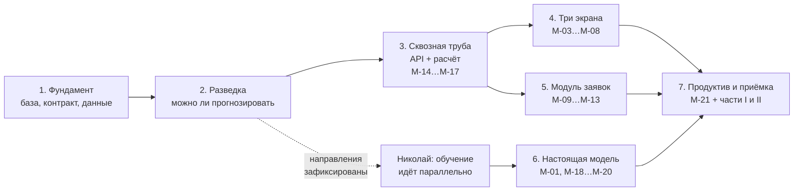

# План работ по вехам

Как мы доводим сервис от пустого репозитория до приёмки. Семь вех, каждая
заканчивается набором артефактов, которые можно открыть и проверить.

Опорные документы: постановка — `docs/task.md`, техническое задание заказчика —
`docs/tz-djkh.pdf`, архитектура — `docs/HLD.md`, приёмка — `docs/acceptance-test.md`.
План им не противоречит и ничего к ним не добавляет: он расставляет их содержимое
по порядку и называет результат каждого шага.

**ТЗ пришло 11.09.2026, когда план уже был написан.** Двадцать три работы, которые оно
добавило, собраны отдельным разделом в конце — «Что добавило ТЗ заказчика». Там же
перечислено, какие строки плана после этого стали неверными.

## Как читать план

У каждой вехи четыре блока, и они отвечают на четыре разных вопроса.

**Работы** — что делаем. В колонке «Что появляется» стоит конкретный артефакт:
путь к файлу, имя таблицы, метод API или элемент экрана. Формулировок вида
«проработать» и «обеспечить» в этой колонке нет: если из работы не рождается
предмет, который можно открыть, работа описана неверно и её надо переписать.

**Артефакты** — пять типов, и у каждого свой признак готовности:

| Тип | Признак готовности |
|---|---|
| Код | Лежит в репозитории, проходит свою самопроверку |
| Схема БД | Нумерованная миграция в `db/migrations/`, накатывается на пустую базу |
| Контракт | Файл в `contracts/`, есть пример запроса, пример проходит валидацию |
| Документ | Файл `.md` в `docs/`, содержит числа и дату замера, а не намерения |
| Элемент интерфейса | Виден в браузере, к нему ведёт клик из описанного места |

**Определение готовности** — состояние системы, при котором веха считается
сделанной. Проверяется глазами.

**Тесты закрытия** — команда и критерий. Проверяется без обсуждения: либо
цифра укладывается, либо нет.

## Этот файл живёт вместе с работой

**План не пишут один раз и не кладут на полку. Его ведут.**

Отметки в этом файле ставятся по ходу работы, а не задним числом перед защитой:

- `☐` — не сделано;
- `✓` — сделано и проверено, проверка прошла;
- `❌` — проверено и **не** прошло. Крестик не стирают и не заменяют галочкой
  молча: под таблицей вехи пишут строкой, что не сошлось и что с этим решили.

**Веха считается закрытой, когда в обоих её блоках — «Определение готовности»
и «Тесты закрытия» — не осталось ни одного `☐` и ни одного `❌`.** Одна
незакрытая клетка означает, что веха открыта, независимо от того, сколько
кода написано.

**Что менять в файле можно, а что нельзя.** Отметки `☐` → `✓` ставим свободно,
это и есть ведение плана. Формулировки критериев по ходу дела не смягчаем:
если критерий оказался невыполним, его не переписывают — про него пишут `❌`
и обсуждают вдвоём. План, подогнанный под факт, ничего не проверяет.

**Состав работ править можно и нужно.** Данные придут не такими, как мы ждём,
и часть строк окажется лишней или недостающей. Правка состава — нормальная
работа, но она делается до того, как веху начали закрывать, а не в тот момент,
когда критерий не сошёлся.

## Где какая веха сейчас

Таблицу обновляем при каждом закрытии вехи.

| Веха | Пунктов готовности | Тестов | Состояние | Дата закрытия |
|---|---|---|---|---|
| 1. Фундамент | 4 | 6 | ☐ не начата | |
| 2. Разведка | 4 | 6 | ⏳ в работе с 15.09.2026: 2.4 и 2.6 закрыты замером, 2.3 разблокирована находкой целевой переменной (`Неисправен`), 2.1 заблокирована отсутствием дат ввода в эксплуатацию | |
| 3. Сквозная труба | 3 | 7 | ☐ не начата | |
| 4. Три экрана | 4 | 7 | ☐ не начата | |
| 5. Заявки | 4 | 9 | ☐ не начата | |
| 6. Модель | 4 | 8 | ☐ не начата | |
| 7. Приёмка | 3 | 7 | ☐ не начата | |

Состояния: `☐ не начата`, `⏳ в работе`, `✓ закрыта`, `❌ провалена`.

## Правило ворот

**Веха закрыта, когда прошли её тесты, а не когда кончился код.** Пока тесты
вехи не прошли, следующую не начинаем. Исключение одно — работа Николая над
моделью, она идёт параллельно с вехи 1 и нашими воротами не связана.

Каждая веха закрывает конкретные строки программы минимум `М-01…М-21` из
`docs/acceptance-test.md`, часть 0. Двадцать одна строка разложена по вехам
без остатка и без пересечений: у каждой строки ровно один хозяин.

---

# Веха 1. Фундамент: база, контракт, данные

**Цель.** Чтобы через неделю никто не ждал друг друга. Николай получает формат
данных в первый день, а не на третьей неделе.

## Работы

| № | Работа | Что появляется | Кто |
|---|---|---|---|
| 1.1 | Завести репозиторий по структуре `docs/HLD.md` разд. 2 | Дерево папок, `deploy/docker-compose.yml`, `deploy/.env.example`, `deploy/nginx/nginx.conf` | Мирослава |
| 1.2 | Описать список признаков: имя, тип, единица измерения, окно агрегации, источник в базе | `contracts/features.v1.yaml` — 19 признаков из `docs/HLD.md` разд. 6.3 | Мирослава |
| 1.3 | Описать формат запроса и ответа `/predict` | `contracts/predict.v1.schema.json` — JSON Schema | Мирослава |
| 1.4 | Сделать примеры для проверки контракта без базы и без модели | `contracts/examples/predict.request.json` и `predict.response.json` | Мирослава |
| 1.5 | Написать правила изменения контракта: кто открывает PR, кто согласует, как нумеруются версии | `contracts/README.md` | Мирослава |
| 1.6 | Перевести четыре схемы из `code/` в нумерованные миграции | `db/migrations/001_events.sql` … `004_geo.sql` | Мирослава |
| 1.7 | Залить справочники в базу: типы событий, уставки, нормативы ТО, виды работ | `db/seed/*.sql` из `code/reglament_lifetimes.json` и `code/work_types.json`; `db/seed/setpoints.sql` пишем заново — схему таблицы берём из `code/setpoints_example.json`, а **числа из него брать нельзя**, это уставки Ново-Иркутской ТЭЦ (см. поле `_about` в файле). Пороги берём из Регламента и из самих данных: в журнале встречаются «В норме от +3 до +40», «Температура ниже 3ºC», «Температура выше 40ºC» | Мирослава |
| 1.8 | Довести загрузчик выгрузок СМВУ до продуктивного файла | `backend/app/ingest/load_smvu.py` на основе `code/load_smvu_xlsx.py` | Мирослава |
| 1.9 | Описать, что реально прислал заказчик: файлы, колонки, периоды, число строк, найденные дыры | `docs/data-inventory.md` | Мирослава |
| 1.10 | Поднять заглушку модели, отвечающую константой по контракту | `ml-stub/` — Dockerfile и один файл на FastAPI | Мирослава |
| 1.11 | Сделать проверку живости с номером применённой миграции | `GET /health` в `backend/app/api/health.py` | Мирослава |

## Определение готовности

- ☐ `docker compose down -v && docker compose up` на чистой машине поднимает
  четыре контейнера без ручных шагов.
- ☐ `GET /health` отвечает `200` и телом `{"status":"ok","migration":"004"}`.
- ☐ Выгрузка СМВУ залита, число строк в таблице событий совпадает с числом
  строк в исходном файле.
- ☐ Николай выполнил `curl` с файлом `contracts/examples/predict.request.json`
  и получил ответ заглушки.

## Тесты закрытия вехи

| Что проверяем | Как | Критерий | ✓ |
|---|---|---|---|
| Развёртывание с нуля | `docker compose down -v && docker compose up -d` | Все четыре контейнера в состоянии `healthy` | ☐ |
| Миграции | накатить на пустую базу, затем накатить повторно | Второй прогон завершается кодом 0 и не меняет схему | ☐ |
| Загрузка данных | `SELECT count(*) FROM ev.event` против числа строк в выгрузке | Числа совпадают | ☐ |
| Идемпотентность загрузки | запустить загрузчик дважды на одном файле | Счётчик строк не изменился, дублей нет | ☐ |
| Контракт | прогнать `contracts/examples/predict.request.json` через `predict.v1.schema.json` | Валидация проходит | ☐ |
| Контракт у Николая | `curl -d @contracts/examples/predict.request.json http://ml:8100/predict` | Ответ проходит валидацию по схеме ответа | ☐ |

**Закрывает строк приёмки:** ни одной напрямую. Это фундамент, без него
не считается ничего остального.

**Что может сорваться.** Выгрузка заказчика окажется не тем, что мы ждём:
другой набор колонок, другая кодировка, события без привязки к участку.
Поэтому загрузка данных стоит в первой вехе, а не в третьей, а `docs/data-inventory.md`
пишется до того, как мы на эти данные обопрёмся.

---

# Веха 2. Разведка: можно ли вообще прогнозировать

**Цель.** Ответить на три вопроса из `CLAUDE.md`, раздел «Чего мы пока
не знаем», и зафиксировать протоколом направления прогноза. Самая короткая
веха и самая важная.

## Работы

| № | Работа | Что появляется | Кто |
|---|---|---|---|
| 2.1 | ❌ **заблокирована 15.09.2026.** Посчитать критерий прогнозируемости `k` по каждому типу оборудования на реальном журнале ремонтов. Журнала ремонтов заказчик не прислал; `code/reliability_fit.py` требует наработок с цензурой, отказов и дат ввода в эксплуатацию — в выгрузке нет ни одного из трёх. Ждём ответа на В-1 | `analysis/k_by_equipment.py` и таблица `analysis/out/k_by_equipment.csv`: тип, число отказов, `beta`, `eta`, `k` | Мирослава |
| 2.2 | Договориться, что считаем моментом P — первым различимым признаком. Берём правила из `code/sensor_outlier_label.py` и `code/thermal_anomaly_rules.py`. На выгрузке из шести правил работают два: залипание `freeze_n` (на всех каналах) и тренд R4 (по своей истории). R1 молчит без уставок, R3 заблокировано отсутствием участка, R2 вырождается без уличной температуры | Раздел «Определение момента P» в `docs/protocol-directions.md`: перечень правил и порогов | Мирослава и Николай |
| 2.3 | ⏳ **разблокирована 15.09.2026, но с заменой момента F.** Журнала ремонтов нет, зато есть значение `Неисправен` в журнале СМВУ: 1 500 298 записей на 4 821 канале за все 90 месяцев. **Момент F — начало эпизода `Неисправен`** (эпизод, а не одиночная запись: канал 228571 мигает «Норма ↔ Неисправен» по 22 тысячи раз за год). Момент P — срабатывание правила из 2.2. В протокол пишем явно: меряем переход канала в состояние неисправности по журналу СМВУ, а не отказ оборудования по акту | `analysis/pf_interval.py` и `analysis/out/pf_interval.csv`: правило, тип датчика, медиана, нижний квартиль, число случаев, доля эпизодов, пойманных этим правилом | Мирослава |
| 2.4 | ✓ **сделано 15.09.2026.** Замерить реальную частоту событий СМВУ и оценить объём базы. Прошла все восемь годовых файлов: **313 546 016 строк за 7,5 лет**, 2 467 812 тревожных (0,79 %), 2025 год — 55,5 млн строк, это 7100 событий в час. Множителем «× 144» пользоваться не надо: пришли годовые файлы, а не месяц | Числа и разбор — `docs/day-one.md` пункты 2, 11, 12 и `docs/HLD.md` разд. 5.5 и 11.2. Отдельного `docs/data-research.md` не завожу: замеры легли туда, где принимаются решения | Мирослава |
| 2.5 | Свести три замера в один отчёт с выводами | `docs/data-research.md` | Мирослава |
| 2.6 | ✓ **сделано 15.09.2026: DuckDB нужна.** Решение принято на числе 313 546 016 строк — это тот объём, ради которого она и выбиралась. Заодно пересмотрен порог TimescaleDB: 300 млн строк из разд. 5.5 пройдены одной исторической выгрузкой, решение остаётся прежним, но основание у него теперь одно — лицензия TSL, а не объём | Правка `docs/HLD.md` разд. 5.5 и 11.2: решение и число, на котором оно принято | Мирослава |
| 2.7 | Выбрать направления прогноза из четырёх названных в постановке и подписать протокол | `docs/protocol-directions.md`: дата, направления поимённо, обоснование числами из 2.1 и 2.3, две подписи | Мирослава и Николай |

## Определение готовности

- ❌ Таблица `k` по типам оборудования с числом отказов в каждой выборке.
  **Не считается:** в выгрузке нет наработок, отказов и дат ввода в эксплуатацию.
- ❌ Медиана и нижний квартиль интервала P-F в часах.
  **Не считается:** момент F берётся из журнала ремонтов, журнала нет.
- ✓ Число строк событий и оценка объёма. **Сделано 15.09.2026:** 313 546 016 строк
  за 7,5 лет, оценка на будущее по 2025 году — 55,5 млн строк в год.
  Числа лежат в `docs/day-one.md` пункты 2, 11, 12 и `docs/HLD.md` разд. 5.5 и 11.2.
- ☐ `docs/protocol-directions.md` подписан, дата в нём раньше первого прогона
  с настоящей моделью.

## Тесты закрытия вехи

| Что проверяем | Как | Критерий | ✓ |
|---|---|---|---|
| Прогнозируемость | `python3 analysis/k_by_equipment.py` | По выбранному направлению `k ≥ 0,5` хотя бы на одном типе оборудования | ❌ не считается: нет наработок, отказов и дат ввода |
| Устойчивость `k` | колонка «число отказов» в той же таблице | Не меньше 10 отказов в выборке, иначе число случайно | ❌ отказов в выгрузке ноль |
| Достижимость горизонта | `python3 analysis/pf_interval.py` | Хотя бы одно правило даёт медиану P-F ≥ 24 ч при доле пойманных эпизодов не ниже 0,5 | ⏳ считается: момент F — начало эпизода `Неисправен` |
| Выбор правила | сравнить строки таблицы `pf_interval.csv` между собой | Правило, взятое за определение P, названо в протоколе вместе с его медианой и долей | ☐ |
| Объём базы | ~~замер на месячной выгрузке, умноженный на 144~~ **множитель не нужен, пришли годовые файлы: замер по всем восьми** | ~~вилка сузилась с 5 раз до полутора~~ **критерий был написан неверно: он допускал галочку при любом исходе. Правильный: названо фактическое число строк, названо, по какому периоду считается оценка на будущее, и сказано, попал ли факт в прежнюю вилку.** Факт: 313 546 016 строк за 7,5 лет, оценка на будущее по 2025 году (55,5 млн в год), **в прежнюю вилку 18–90 млн факт не попал — он вне её** | ✓ 15.09.2026 |
| Протокол | открыть `docs/protocol-directions.md` | Направления названы поимённо, есть дата и две подписи | ☐ |

**Три крестика выше не стираем.** Веха 2 в задуманном виде невыполнима не потому, что мы
её не сделали, а потому что у заказчика не запрошена целевая переменная: нет журнала
отказов и ремонтов, нет результата проверки сработки, нет дат ввода в эксплуатацию.
Пока не придёт ответ на В-1 (`docs/day-one.md`, список вопросов заказчику), считать
`k` и P-F нечем — ни одним скриптом, ни одной моделью.

**Но целевая переменная в данных всё-таки нашлась — 15.09.2026.** Значение `Неисправен`
в шестой колонке журнала: **1 500 298 записей на 4 821 канале, во всех 90 месяцах
выгрузки без пропусков**. Веха 2 переписывается под неё, и переписывать надо так:

- **целевое событие — эпизод, а не запись.** Канал 228571 за 2025 год дал `Норма`
  22 167 раз и `Неисправен` 22 156, он мигает между ними; одна запись это дребезг.
  Порог «сколько записей подряд считаем эпизодом» задаётся по типу датчика, потому что
  у теплового датчика так же дребезжит `Неопределен`;
- **`k` и Вейбулл всё равно не считаются** — для них нужны наработка от ввода
  в эксплуатацию и цензура, а дат ввода нет. Работы 2.1 и 2.3 остаются закрытыми;
- **зато P-F считается:** момент F — начало эпизода `Неисправен`, момент P — срабатывание
  правила. Это надо записать в протокол явно: мы меряем не «отказ оборудования по акту»,
  а «переход канала в состояние неисправности по журналу СМВУ».

**Две гипотезы проверены и отброшены, второй раз не проверять.** «Датчик перед смертью
чаще пропадает из опроса» — неверно: доля `Неопределен` в последние 30 суток 2,17 %
против фона 3,58 %, то есть падает. «Исчезнувший из журнала канал — это отказ» — неверно:
166 из 201 умершего канала (83 %) замолчали пачками по одной дате, 20 июля 2021 года
сразу 45 штук; это замена оборудования подрядчиком. Числа — `docs/day-one.md` пункт 1.

**Закрывает строк приёмки:** `М-02` — направления зафиксированы протоколом
до начала испытаний.

**P-F — не одно число, а семейство.** Чем строже правило, тем позже срабатывает
момент P и тем короче выходит интервал. На эталонной ручной разметке из
`code/sensor_outlier_label.py` это видно прямо: правило «только выход за физический
диапазон» ловит 38 % отказов, а «диапазон плюс скачок больше 5 °C за 10 минут» —
69 %, то есть почти вдвое больше и раньше по времени. Поэтому публикуем таблицу
«правило → медиана P-F → доля пойманных отказов», а одну цифру не публикуем.

**Момент P задаём правилом, а не моделью.** Соблазн взять за P момент, когда
оценка модели впервые перевалила порог, — это круг: веха 2 существует, чтобы
решить, стоит ли обучать модель, и определять P через модель значит измерять
модель моделью. Правила у нас уже написаны, поэтому расчёт наш, а не Николая.
От Николая нужно одно — согласовать набор правил, потому что этим же правилом
он потом будет размечать обучающую выборку. Разойдёмся в определении — пообещаем
заказчику горизонт по одному признаку, а обучим по другому.

**Развилка, а не формальность.** Если по всем типам оборудования `k` выйдет
около нуля, это значит, что отказы случайны относительно наработки. Тогда
прогноз по возрасту бесполезен, и строить его надо на телеметрии и событиях
СМВУ, а не на наработке. Решение принимаем здесь, на второй вехе, когда
переделка стоит два дня, а не на шестой, когда она стоит проект.

---

# Веха 3. Сквозная труба: расчёт и REST API

**Цель.** Данные проходят весь путь от базы до JSON-ответа. Модель на этой
вехе — заглушка, возвращающая константу. Смысл вехи не в качестве прогноза,
а в том, что труба собрана и нигде не течёт.

## Работы

| № | Работа | Что появляется | Кто |
|---|---|---|---|
| 3.1 | Хранилище результатов расчёта | Миграция `db/migrations/005_pred.sql`: таблица `pred.forecast` (`forecast_id`, `section_id`, `direction`, `risk`, `computed_at`, `horizon_h`, `run_id`) и `pred.run_log` (`run_id`, стадия, длительность, итог) | Мирослава |
| 3.2 | Восемь стадий расчёта по `docs/HLD.md` разд. 8 | `backend/app/worker/run.py` | Мирослава |
| 3.3 | Сборка вектора признаков по `contracts/features.v1.yaml` — самая дорогая стадия, 20 с из 41 | `backend/app/worker/features.py` | Мирослава |
| 3.4 | Вызов модели по контракту с разбором ошибок и таймаутом | `backend/app/mlclient/client.py` | Мирослава |
| 3.5 | Планировщик с блокировкой, чтобы два экземпляра не считали одно и то же | `backend/app/worker/scheduler.py` с `pg_try_advisory_lock(48217)` | Мирослава |
| 3.6 | Метод «текущие риски объектов» | `GET /api/risks` → список `{section_id, risk, level, computed_at}` | Мирослава |
| 3.7 | Метод «прогнозы за период» | `GET /api/forecasts?from=&to=&direction=` → список прогнозов с постраничным выводом | Мирослава |
| 3.8 | Метод «карточка объекта» | `GET /api/objects/{section_id}` → паспорт объекта, текущий риск, последние прогнозы | Мирослава |
| 3.9 | Метод «заявки» — пока пустой список, наполнится на вехе 5 | `GET /api/orders` | Мирослава |
| 3.10 | Описание API: методы, параметры, примеры ответов | `GET /docs` — OpenAPI, генерируется FastAPI; примеры заданы в коде через `response_model` | Мирослава |
| 3.11 | Набор curl-примеров для проверки руками и на приёмке | `contracts/examples/api/*.sh` — по одному файлу на метод | Мирослава |

## Определение готовности

- ☐ Один прогон расчёта проходит все восемь стадий и пишет в `pred.run_log`
  строку на каждую стадию с её длительностью.
- ☐ Четыре метода отвечают `200` и телом, проходящим валидацию по схеме
  из `/openapi.json`.
- ☐ Замена адреса `ml` в `deploy/.env` на настоящий контейнер Николая
  не требует правок нашего кода.

## Тесты закрытия вехи

| Что проверяем | Как | Критерий | ✓ |
|---|---|---|---|
| Прогон расчёта | запустить вручную, `SELECT * FROM pred.run_log WHERE run_id=…` | Восемь строк, у каждой длительность, итог `ok` | ☐ |
| Блокировка | запустить два экземпляра планировщика одновременно | Считает один; второй пишет в лог «занято» и выходит кодом 0 | ☐ |
| API | прогнать `contracts/examples/api/*.sh` | Все методы `200`, тело валидно по `/openapi.json` | ☐ |
| Описание API | открыть `/docs`, сверить пример ответа с фактическим | Совпадают дословно | ☐ |
| Подмена модели | поменять `ML_URL` в `deploy/.env`, перезапустить `api` | Работает без правок кода | ☐ |
| Пустой результат | запросить период, где прогнозов нет | Пустой список и код `200`, не `500` и не `404` | ☐ |
| Недоступная модель | остановить контейнер `ml`, запустить расчёт | Расчёт падает с понятной записью в `pred.run_log`, API продолжает отдавать прошлый результат | ☐ |

**Закрывает строк приёмки:** `М-14`, `М-15`, `М-16`, `М-17` — весь блок REST API.

**Почему API раньше интерфейса.** Экраны читают данные из API. Если сначала
сделать экраны, они будут читать выдуманные данные, и переделывать придётся
дважды. В обратном порядке такой переделки не возникает.

---

# Веха 4. Три экрана

**Цель.** Диспетчер открывает браузер и видит дашборд рисков, карту объектов
и журнал прогнозов. Постановка называет три экрана через запятую, и это
не стилистика: отсутствие любого означает, что продукт не сдан.

## Работы

| № | Работа | Что появляется | Кто |
|---|---|---|---|
| 4.1 | Каркас приложения: маршруты, меню, подсветка текущего раздела | `frontend/src/App.tsx`, `frontend/src/components/Nav.tsx` | Мирослава |
| 4.2 | Дашборд рисков по макету `dashboard/dashboard-mockup.html` | `frontend/src/screens/dashboard/` — плитки показателей, список объектов с уровнем риска | Мирослава |
| 4.3 | Карта объектов на Leaflet, уровень риска виден цветом и формой метки | `frontend/src/screens/map/` | Мирослава |
| 4.4 | Растровая подложка карты, чтобы не зависеть от внешнего тайл-сервера | `tiles/` — скрипт генерации и готовые тайлы | Мирослава |
| 4.5 | Журнал прогнозов с фильтром по дате, объекту и направлению и сортировкой | `frontend/src/screens/log/` | Мирослава |
| 4.6 | Карточка объекта, общая для дашборда и карты | `frontend/src/components/ObjectCard.tsx` — открывается кликом из обоих мест | Мирослава |
| 4.7 | Палитра в виде переменных CSS по `dashboard/color-palette.md` | `frontend/src/styles/tokens.css` | Мирослава |
| 4.8 | Профиль замера «АРМ-ОДС»: слабый процессор, медленная сеть | `frontend/lh-arm.js`, `frontend/lighthouserc.json` | Мирослава |
| 4.9 | Протокол замера фронта | `docs/frontend-budget.md`: вес сжатого JS, время первого экрана, дата замера, на каком железе | Мирослава |

## Определение готовности

- ☐ Три экрана открываются из меню, текущий раздел подсвечен.
- ☐ Клик по объекту на дашборде и клик по метке на карте открывают одну
  и ту же карточку `ObjectCard`.
- ☐ Сжатый JS укладывается в бюджет 150 КБ.
- ☐ Карта открывается на машине без WebGL2.

## Тесты закрытия вехи

| Что проверяем | Как | Критерий | ✓ |
|---|---|---|---|
| Вес сборки | `gzip -c frontend/dist/assets/*.js \| wc -c` | Сумма ≤ 153 600 байт | ☐ |
| Слабое железо | `npx lhci autorun --config=frontend/lighthouserc.json` | Пороги профиля «АРМ-ОДС» пройдены | ☐ |
| Без WebGL2 | отключить WebGL в браузере, открыть карту | Карта открывается и показывает объекты | ☐ |
| Навигация | дашборд → карта → журнал → дашборд | Переходы в обе стороны, текущий раздел подсвечен | ☐ |
| Единая карточка | клик на дашборде и клик на карте по одному объекту | Открывается одна и та же карточка с одинаковым содержимым | ☐ |
| Риск на карте | закрыть список, смотреть только на карту | Уровень риска различим по самой метке: цвет и форма | ☐ |
| Журнал | задать фильтр по дате и направлению | Список сузился, число строк совпадает с ответом `GET /api/forecasts` с теми же параметрами | ☐ |

**Закрывает строк приёмки:** `М-03`, `М-04`, `М-05`, `М-06`, `М-07`, `М-08` —
весь блок интерфейса.

**Про бюджет 150 КБ.** Это не эстетика. На рабочем месте диспетчера старая
машина и медленная сеть, и пустая заготовка Next.js заняла бы 107 КБ из 150
ещё до первой строки нашего кода. Поэтому Preact, поэтому Leaflet,
обоснование в `docs/HLD.md` разд. 4.

---

# Веха 5. Модуль автоматического формирования заявок

**Цель.** Заявка рождается сама, по результату расчёта, без нажатия кнопки
человеком. Постановка называет это отдельным модулем, и на приёмке будут
смотреть именно на автоматичность.

## Работы

| № | Работа | Что появляется | Кто |
|---|---|---|---|
| 5.1 | Связать заявку с прогнозом. Таблица `maint.notification` уже описана в `code/schema_assets.sql`, строка 600, и в ней уже есть `source_system`, `source_key`, `status`, `priority_id` — новую таблицу не заводим | Миграция `db/migrations/006_orders.sql`: в `maint.notification` добавляются колонки `forecast_id` (внешний ключ на `pred.forecast`, обязателен при `source_system='forecast'`) и `due_at` (срок выполнения). Автозаявка пишется как `notification_kind='WR'`, `source_system='forecast'` | Мирослава |
| 5.2 | Справочник видов работ, чтобы вид работ выбирался, а не вписывался текстом | `db/seed/work_types.sql` из `code/work_types.json` | Мирослава |
| 5.3 | Правило порождения заявки: при каком риске и какой критичности объекта, какой вид работ, какой срок | `backend/app/domain/order_rules.py` и документ `docs/order-rules.md` с порогами и примером расчёта на одном объекте | Мирослава |
| 5.4 | Защита от повторов: объект с устойчиво высоким риском не должен плодить заявки каждый прогон | Ограничение уникальности в миграции 5.1 плюс ветка «обновить существующую» в `order_rules.py` | Мирослава |
| 5.5 | Жизненный цикл заявки: разрешённые переходы статусов | `backend/app/domain/state_machine.py` на основе `code/toir_state_machine.py` | Мирослава |
| 5.6 | Ссылка из заявки на прогноз: **API отдаёт `forecast_id` в теле заявки** | `GET /api/orders/{notification_id}` возвращает поле `forecast_id` | Мирослава |
| 5.7 | Ссылка из прогноза на заявки: **API отдаёт список заявок, порождённых этим прогнозом** | `GET /api/forecasts/{forecast_id}` возвращает массив `order_ids` | Мирослава |
| 5.8 | Переход из заявки в прогноз на экране | В карточке заявки строка-ссылка «Прогноз от 14.09.2026 09:05» открывает карточку прогноза | Мирослава |
| 5.9 | Переход из прогноза в заявку на экране | В карточке прогноза блок «Заявки по этому прогнозу» со списком ссылок; если заявок нет, блок не рисуется | Мирослава |
| 5.10 | Экран списка заявок с фильтром по статусу и сроку | `frontend/src/screens/orders/` | Мирослава |

## Определение готовности

- ☐ Объект с риском выше порога порождает заявку без участия человека.
- ☐ В истории заявки первым шагом стоит расчёт с его `run_id`, а не пользователь.
- ☐ Плановый срок работ наступает раньше прогнозируемого отказа.
- ☐ Переход заявка → прогноз → заявка возвращает на ту же заявку.

## Тесты закрытия вехи

| Что проверяем | Как | Критерий | ✓ |
|---|---|---|---|
| Автоматичность | подать объект с высоким риском, запустить расчёт, интерфейс не трогать | Заявка появилась в `maint.notification` сама | ☐ |
| Происхождение | `SELECT source_system, forecast_id FROM maint.notification WHERE id=…` | `source_system='forecast'`, `forecast_id` заполнен | ☐ |
| Полнота полей | открыть любую автозаявку | Заполнены `func_location_id`, `subject`, `due_at`, `long_text` | ☐ |
| Вид работ из справочника | проверить внешний ключ на `ref.order_type` | Ссылается на строку `db/seed/work_types.sql`, свободного текста нет | ☐ |
| Превентивность | сравнить `due_at` с `computed_at + horizon_h` прогноза | Срок работ строго раньше прогнозируемого события | ☐ |
| Ссылка вперёд | `GET /api/orders/{id}` | В теле есть `forecast_id` | ☐ |
| Ссылка назад | `GET /api/forecasts/{forecast_id}` | В теле есть `order_ids`, и в нём лежит та же заявка | ☐ |
| Переходы на экране | заявка → прогноз → заявка | Вернулись на исходную заявку, идентификатор совпадает | ☐ |
| Без дублей | запустить расчёт дважды подряд по одному объекту | Вторая заявка не создана, у первой обновилось время | ☐ |

**Закрывает строк приёмки:** `М-09`, `М-10`, `М-11`, `М-12`, `М-13` — весь
блок заявок.

**Защита от повторов — наша строка, не из постановки.** Расчёт идёт регулярно,
и объект с устойчиво высоким риском попадёт под правило десятки раз за сутки.
Без ограничения уникальности список заявок за день превратится в мусор,
и на защите это заметят раньше, чем качество прогноза.

---

# Веха 6. Настоящая модель и четыре метрики

**Цель.** Заглушка заменяется обученной моделью Николая, четыре числа
из постановки берутся на отложенной выборке, и в карточке объекта появляется
причина прогноза, написанная по-русски.

## Работы

| № | Работа | Что появляется | Кто |
|---|---|---|---|
| 6.1 | Собрать образ модели по контракту | Образ `ml` и `Dockerfile` в репозитории Николая | Николай |
| 6.2 | Разрезать данные на обучение и проверку **по времени**, а не случайно | Скрипт подготовки выборки и описание разреза в отчёте 6.3 | Николай |
| 6.3 | Отчёт об обучении: алгоритм, признаки, гиперпараметры, метрики на обучении и на проверке | `docs/ml-training-report.md` | Николай |
| 6.4 | Вернуть вклады признаков вместе с прогнозом | Поле `contributions` в ответе `/predict`, новая версия `contracts/predict.v2.schema.json` | Николай и Мирослава |
| 6.5 | Хранить готовый текст объяснения рядом с прогнозом | Миграция `db/migrations/007_explain.sql`: колонка `pred.forecast.explanation_ru` типа `text` | Мирослава |
| 6.6 | Шаблоны фраз: по одной на каждый из 19 признаков | `db/seed/explain_templates.sql` — пары «признак → фраза», например `silent_sensor_share` → «три датчика из восьми молчат больше суток» | Мирослава |
| 6.7 | Собрать текст: взять три признака с наибольшим вкладом по модулю, подставить в шаблоны, записать в колонку 6.5 | `backend/app/domain/explain.py` | Мирослава |
| 6.8 | Отдать объяснение наружу | Поле `explanation_ru` в ответе `GET /api/objects/{section_id}` и `GET /api/forecasts/{id}` | Мирослава |
| 6.9 | Показать объяснение диспетчеру | Блок «Почему такой риск» в `ObjectCard.tsx`: три строки списком, под ними подпись «по данным на 14.09.2026 09:05» | Мирослава |
| 6.10 | Замерить четыре метрики методикой проекта | `docs/metrics-report.md`: значения, объём выборки, дата, команда запуска | Мирослава и Николай |

## Определение готовности

- ☐ Precision и Recall на отложенной выборке взяты с запасом: целимся
  в 0,75 и 0,55, а не в 0,70 и 0,50 впритык.
- ☐ Минимум упреждения по прогону с нулевым горизонтом не меньше 24 часов.
- ☐ В карточке объекта видны три строки причины, и они соответствуют трём
  наибольшим вкладам из ответа модели.
- ☐ Есть `docs/ml-training-report.md`, доказывающий, что это обученная модель,
  а не набор пороговых правил.

## Тесты закрытия вехи

| Что проверяем | Как | Критерий | ✓ |
|---|---|---|---|
| Precision | `evaluate_alerts()` из `code/predictive_metrics.py` на отложенной выборке | Строго больше 0,700 | ☐ |
| Recall | тот же прогон | Строго больше 0,500 | ☐ |
| Горизонт | отдельный прогон `evaluate_alerts(horizon_hours=0)` | Медиана и минимум упреждения ≥ 24 ч | ☐ |
| Честность выборки | открыть описание разреза в `docs/ml-training-report.md` | Разрез по времени: обучение раньше, проверка позже, дата разреза названа | ☐ |
| Это модель | открыть `docs/ml-training-report.md` | Названы алгоритм, признаки, гиперпараметры, метрики на обучении и на проверке | ☐ |
| Объяснение записано | `SELECT explanation_ru FROM pred.forecast WHERE forecast_id=…` | Поле не пустое, три предложения | ☐ |
| Объяснение верное | сверить текст с тремя наибольшими по модулю значениями `contributions` | Названы те же три признака, порядок совпадает | ☐ |
| Объяснение на экране | открыть карточку объекта | Блок «Почему такой риск» показывает те же три строки | ☐ |

**Закрывает строк приёмки:** `М-01`, `М-18`, `М-19`, `М-20`.

**Про строгое неравенство.** Постановка пишет «Precision > 0.7». Результат
ровно 0,700 закрывает формулировку «не ниже», но не закрывает «больше».
Разница в третьем знаке решает, сдан продукт или нет.

**Про разрез по времени.** Если перемешать события случайно, в обучающую
выборку попадут данные из будущего относительно проверочной, метрики
завысятся, и на реальных данных всё развалится. Разрез только по времени.

**Про формулировку объяснения.** Вклады TreeSHAP суммируются в логит,
а не в вероятность. Поэтому в тексте нельзя писать «этот признак дал
плюс 12 % риска» — такой фразы из вклада не следует. Пишем ранжирование:
«главная причина — молчащие датчики, затем возраст участка, затем частота
событий за месяц». Это ограничение на формулировку, а не на расчёт.

---

# Веха 7. Продуктивный объём, приёмка, поставка

**Цель.** Показать, что сервис работает не на демонстрационном наборе,
и пройти чек-лист приёмки построчно.

## Работы

| № | Работа | Что появляется | Кто |
|---|---|---|---|
| 7.1 | Развернуть стенд с полным объёмом данных за 12 лет | Работающий стенд и раздел «Стенд» в `docs/deploy.md`: железо, версии, объём базы | Мирослава |
| 7.2 | Замерить время полного расчёта по всем объектам, три прогона | `docs/load-test.md`: три замера, худший результат, число объектов, число строк, дата | Мирослава |
| 7.3 | Собрать перечень зависимостей с лицензиями по трём образам | `docs/sbom.md`: пакет, версия, лицензия, образ | Мирослава |
| 7.4 | Написать инструкцию развёртывания и проверить её на чистой машине | `docs/deploy.md` | Мирослава |
| 7.5 | Пройти часть 0 чек-листа — 21 строку | Отметки в `docs/acceptance-test.md`, часть 0 | Мирослава и Николай |
| 7.6 | Пройти части I и II — 27 строк | Отметки в `docs/acceptance-test.md`, части I и II | Мирослава и Николай |
| 7.7 | Зафиксировать версию поставки | Тег `v1.0` в репозитории и в репозитории Николая | Мирослава |

## Определение готовности

- ☐ Полный расчёт по всем объектам укладывается в 5 минут на продуктивном объёме.
- ☐ Все 48 обязательных строк приёмки отмечены ✓.
- ☐ В `docs/sbom.md` нет ни одной лицензии GPL, LGPL или AGPL.

## Тесты закрытия вехи

| Что проверяем | Как | Критерий | ✓ |
|---|---|---|---|
| Время расчёта | три замера полного прогона, берём худший | Меньше 300 с | ☐ |
| Не демонстрация | сверить число объектов и строк в замере с продуктивом | Совпадают, а не урезаны | ☐ |
| Часть 0 | пройти 21 строку | Ни одного ❌ | ☐ |
| Части I и II | пройти 27 строк | Ни одного ❌ | ☐ |
| Лицензии | проверить каждую строку `docs/sbom.md` | Ни одной GPL, LGPL, AGPL в образах `api`, `worker`, `nginx` | ☐ |
| Развёртывание | развернуть с нуля по `docs/deploy.md` на чистой машине | Поднялось без устных подсказок | ☐ |
| Восстановление | остановить базу на минуту, поднять обратно | Сервис восстановился сам, незавершённый расчёт помечен в `pred.run_log` как прерванный | ☐ |

**Закрывает строк приёмки:** `М-21` и полный проход частей 0, I и II.

**Про «не демонстрация».** В архиве прошлых проектов нашёлся случай, когда
подрядчик вывел нагрузочное тестирование из объёма испытаний одной фразой
в программе испытаний, и приёмка прошла на игрушечном объёме. Здесь мы это
закрываем отдельной строкой теста: замер засчитывается только на продуктивных
данных, и число строк в `docs/load-test.md` должно совпасть с числом строк
в базе.

---

# Все артефакты плана одним списком

Двадцать девять новых файлов, семь миграций, девять методов API.

## Контракты

| Файл | Веха |
|---|---|
| `contracts/features.v1.yaml` | 1 |
| `contracts/predict.v1.schema.json` | 1 |
| `contracts/predict.v2.schema.json` (добавляет вклады признаков) | 6 |
| `contracts/examples/predict.request.json`, `predict.response.json` | 1 |
| `contracts/examples/api/*.sh` | 3 |
| `contracts/README.md` | 1 |

## Миграции базы

| Файл | Что добавляет | Веха |
|---|---|---|
| `001_events.sql` … `004_geo.sql` | четыре схемы из `code/` | 1 |
| `005_pred.sql` | `pred.forecast`, `pred.run_log` | 3 |
| `006_orders.sql` | `maint.notification`: колонки `forecast_id` и `due_at` | 5 |
| `007_explain.sql` | `pred.forecast.explanation_ru` | 6 |

## Методы API

| Метод | Веха |
|---|---|
| `GET /health` | 1 |
| `GET /api/risks` | 3 |
| `GET /api/forecasts` | 3 |
| `GET /api/forecasts/{id}` (с `order_ids`) | 3, дополнен на 5 |
| `GET /api/objects/{section_id}` (с `explanation_ru`) | 3, дополнен на 6 |
| `GET /api/orders` | 3, наполнен на 5 |
| `GET /api/orders/{id}` (с `forecast_id`) | 5 |
| `GET /docs`, `GET /openapi.json` | 3 |

## Документы

| Файл | Что в нём | Веха |
|---|---|---|
| `docs/data-inventory.md` | что реально прислал заказчик: файлы, колонки, периоды, дыры | 1 |
| `docs/data-research.md` | `k`, интервал P-F, частота событий, объём базы | 2 |
| `docs/protocol-directions.md` | выбранные направления, дата, подписи | 2 |
| `docs/order-rules.md` | пороги порождения заявки и пример расчёта | 5 |
| `docs/frontend-budget.md` | вес сборки и время первого экрана на слабом железе | 4 |
| `docs/ml-training-report.md` | отчёт об обучении модели | 6 |
| `docs/metrics-report.md` | четыре метрики: значения, выборка, дата | 6 |
| `docs/load-test.md` | время расчёта на продуктивном объёме | 7 |
| `docs/sbom.md` | зависимости и лицензии по трём образам | 7 |
| `docs/deploy.md` | инструкция развёртывания и описание стенда | 7 |

---

# Что делает Николай параллельно

Модель — самая длинная по времени работа, и ждать ворот она не может.

| Пока идёт веха | Николай | Что от него появляется |
|---|---|---|
| 1 | Читает `contracts/features.v1.yaml`, поднимает заглушку `ml` | Работающий `curl` по контракту |
| 2 | Смотрит на `k` и P-F вместе с нами, соглашается с выбором направлений | Подпись в `docs/protocol-directions.md` |
| 3 | Собирает обучающую выборку, пробует первые модели | Черновые метрики в переписке |
| 4 | Обучение, подбор гиперпараметров, калибровка вероятностей | — |
| 5 | Вклады признаков, сборка образа | PR с `contracts/predict.v2.schema.json` |
| 6 | Передаёт образ, вместе берём метрики | Образ `ml`, `docs/ml-training-report.md` |
| 7 | Дежурит на замерах и на защите | — |

**Правка контракта — это PR, а не договорённость в переписке.** Если Николаю
нужен новый признак, он открывает PR в `contracts/`, мы реализуем SQL
и выпускаем следующую версию файла. Подробности — `docs/HLD.md` разд. 6.1.

---

# Соотношение трудоёмкости

Дат в плане нет: срок хакатона не зафиксирован в постановке. Вместо дат —
доли общего времени, это моя оценка, а не обязательство.

| Веха | Доля | Почему столько |
|---|---|---|
| 1. Фундамент | 15 % | Схемы БД и загрузчик уже написаны в `code/`, их надо довести, а не сочинить |
| 2. Разведка | 5 % | Считалка `code/reliability_fit.py` готова, работа идёт на данных, а не над кодом |
| 3. Сквозная труба | 25 % | Самая объёмная: восемь стадий расчёта, планировщик, девять методов |
| 4. Три экрана | 20 % | Макет и палитра готовы, делать надо работающий фронт |
| 5. Заявки | 15 % | Правило порождения, жизненный цикл, два экрана |
| 6. Модель | 10 % | На нашей стороне — подмена контейнера, объяснение и замер; основное у Николая идёт параллельно |
| 7. Приёмка | 10 % | Замеры, проход чек-листа, документы поставки |

**Резерв держим на вехе 3.** Если что-то поедет, поедет там: это единственная
веха, где мы одновременно трогаем базу, планировщик, границу с ML и API.

---

# Если времени не хватит

Порядок отказа от работ, от первого к последнему:

1. Часть III приёмки — 72 рекомендации, на приёмке не проверяются.
2. Часть II — 16 строк из Регламента. Обидно, но продукта не рушит.
3. Красота интерфейса: анимации, тёмная тема, тонкая настройка палитры.
4. Раздел 8 ТЗ целиком — расширенная аналитика, дообучение модели, черновики заявок,
   отчёты руководству. Заказчик сам пометил его как «по согласованию», значит
   без согласования мы его не делаем.
5. Второе и третье направление прогноза. Осторожно: постановка разрешает взять одно,
   а ТЗ разд. 6 требует сценарный анализ трёх типов — пожара, проникновения
   и подтопления. Два документа расходятся, и решать это надо со Славой и протоколом
   до испытаний (М-02), а не в последний день.

**Отказываться нельзя ни от одной из 21 строки части 0 и ни от одной строки части I.**
После прихода ТЗ в части I стало 64 строки, и там лежат вещи, которые выглядят как
инфраструктура, а на деле являются требованием заказчика: TLS 1.2, вход через службу
каталогов, ролевая модель, журнал действий, резервное копирование, перечень библиотек,
четыре ссылки на сдачу. Выбросить их нельзя — это не наше украшение, это ТЗ.

Отдельно про раздел 7 ТЗ: **продукт без перечня библиотек и без четырёх ссылок
на площадке не принят вообще**, как бы хорошо ни работал прогноз. Эти две работы
стоят час каждая, и забыть их в последний день — самый обидный способ не сдаться.

---

# Что добавило ТЗ заказчика

Раздел дописан 15.09.2026. ТЗ (`docs/tz-djkh.pdf`) пришло 11.09.2026, выгрузка —
09.09.2026, и обе новости меняют объём работ. Строки вех выше я не перенумеровывала:
новые работы стоят здесь списком с указанием, в какую веху каждая садится. Переносить
их в тело вех надо одной правкой, когда Слава утвердит порядок.

## Новые работы по вехам

| Веха | Работа | Что появляется | Строка приёмки |
|---|---|---|---|
| 1 | TLS не ниже 1.2 | в `deploy/nginx/nginx.conf` строки `ssl_protocols TLSv1.2 TLSv1.3;` и набор шифров без RC4 и 3DES | НФ-75 |
| 1 | загрузчик под настоящую выгрузку | `backend/app/ingest/smvu_csv.py`: разбор шести колонок `ид_события, ид_канала_данных, дата, время, тревожное, значение_датчика`, склейка даты со временем, оба написания булева (`f`/`t` в файлах 2019 года и `false`/`true` в примере 2026 года) | Ф-76, Ф-77 |
| 1 | справочники каналов и объектов | миграция с таблицами `smvu.channel` (11 494 строки) и `smvu.object_tree` (95 строк), загрузка обоих справочников до журнала | Ф-77, Ф-78 |
| 1 | автополучение реестра оборудования | `backend/app/ingest/load_equipment.py` читает реестр по адресу из `deploy/.env`, пишет в `asset.equipment`, строку прогона — в `load.batch` | Ф-84 |
| 2 | разбор тега на участок | `code/tag_to_section.py` с самопроверкой: раскладывает `15-11.1.131.2.` на префикс и сегменты, отчёт «по скольким из 11 494 каналов участок определён» | Ф-79, ОВ-45 |
| 2 | замер объёма по факту | раздел «Объём выгрузки» в `docs/data-inventory.md`: таблица «год → строк → байт» по восьми файлам, замером, а не множителем | НФ-33, ОВ-01 |
| 3 | вход через службу каталогов | `backend/app/auth/ldap.py`, simple bind по `LDAP_URI` и `LDAP_BASE_DN`; при недоступном каталоге вход по локальной записи | НФ-76 |
| 3 | ролевая модель | миграция с `ref.app_user`, `ref.role`, `ref.permission`, `ref.role_permission`; сид `db/seed/rbac.sql` на четыре роли: диспетчер, аналитик, инженер, администратор; зависимость `require(permission_code)` на каждом методе | Ф-66, НФ-43, НФ-44 |
| 3 | журнал действий пользователей | миграция с таблицей `audit.user_action`, прослойка на каждый запрос кроме проверки живости, метод `GET /api/audit` только администратору | НФ-77 |
| 3 | метеоданные | схема `ext` и таблица `ext.weather_hourly`, задача планировщика в :00, шесть признаков в `contracts/features.v2.yaml` | Ф-85, Ф-86 |
| 3 | геоданные в двух форматах | `?format=geojson` через `ST_AsGeoJSON` и `?format=wkt` через `ST_AsText`, примеры в `contracts/examples/` | Ф-81 |
| 3 | XML на выходе | `?format=xml` на трёх методах, сериализатор на `xml.etree.ElementTree`, схема `contracts/risks.v1.xsd` | Ф-80 |
| 3 | приём потока показаний | `POST /api/v1/ingest/readings`, до 5000 строк в запросе, путь до экрана не дольше 5 секунд | Ф-82, НФ-73 |
| 4 | панель уведомлений | таблица `pred.alert`, поток `GET /api/alerts/stream`, компонент полосы поверх трёх экранов с кнопкой «Принял», метод `POST /api/notifications/{id}/ack` | Ф-88, Ф-90 |
| 4 | справочник решений диспетчера | `db/seed/decisions.sql` на четыре кода из ТЗ: выезд бригады, направление бригады на проверку, мониторинг ситуации, ложное срабатывание; колонка `pred.feedback.decision_code`; в диалоге вердикта поле обязательно | Ф-92 |
| 4 | журнал технологических событий | таблица в карточке объекта по форме Приложения 2: пять колонок, фильтр и сортировка по каждой, диапазон дат, переключатель автообновления | Ф-89 |
| 4 | Яндекс.Браузер | строка в тестах закрытия: три экрана открыты в Chrome и в Яндекс.Браузере, версии записаны в протокол | НФ-81 |
| 5 | статусы из системы учёта заявок | `backend/app/ingest/order_status.py`, только чтение, раз в 5 минут; колонки `maint.notification.external_status` и `external_status_at`; строка «Статус во внешней системе» в карточке заявки | Ф-87, НФ-69 |
| 7 | резервное копирование и восстановление | `deploy/backup.sh` по расписанию, `ref.backup_log`, `docs/restore.md`; тест: поднять базу из вчерашней копии с секундомером, уложиться в 4 часа | НФ-39, НФ-78 |
| 7 | нагрузка на 20 пользователей | `deploy/k6/20-users.js` и раздел в `docs/load-test.md`: 20 сессий, 5 минут, отклик по 95-му перцентилю не хуже 2 секунд, ни одного кода 5xx | НФ-74 |
| 7 | перечень библиотек | `docs/libraries.md`, собирается командой, а не руками: четыре набора — `api`, `worker`, `nginx`, фронт, плюс перечень от Николая по образу `ml` | НФ-82 |
| 7 | сопроводительная документация | `docs/install.md`, `docs/build.md`, `docs/architecture.md`, `docs/data-processing.md` — четыре раздела, которые ТЗ разд. 14 называет поимённо | НФ-83, НФ-86 |
| 7 | презентация и сдача | `delivery/presentation.pptx` и `.pdf`; `docs/delivery.md` с четырьмя ссылками: репозиторий, презентация, прототип, документация | НФ-87, НФ-88 |

Двадцать три работы. Больше всего достаётся вехе 3 (семь работ) и вехе 7 (пять).

## Что от этого переполняется

**Веха 3 — самая пострадавшая.** Было одиннадцать работ и четверть общей трудоёмкости,
добавляется семь. Резерв, который мы держали именно здесь, съедается ещё до того, как
что-то пойдёт не так. Отложить аутентификацию на веху 7 нельзя: экраны вехи 4 читают
API, и если API станет закрытым после того, как фронт написан, фронт придётся
переписывать.

**Веха 4.** Панель уведомлений — не мелочь. Это поток SSE через nginx, звук, состояние
«принял» и жизнь поверх всех трёх экранов сразу. Плюс она давит на бюджет сжатого
JS в 153 600 байт, который и без неё был тесным.

**Веха 7.** Было семь работ на десятую часть времени, становится двенадцать. Пять новых
— это документы и замеры, и написать их в последний день нельзя.

Честного решения тут нет: объём вырос примерно на треть, а сто процентов времени
остались ста процентами. Резать придётся, и порядок отказа ниже я переписала.

## Что в плане стало неверным

| Где | Что не так |
|---|---|
| вводная, «опорные документы» | ТЗ в списке нет, а оно класса А наравне с постановкой |
| таблица «Где какая веха сейчас» | числа пунктов готовности и тестов по всем семи вехам меняются |
| «двадцать одна строка разложена по вехам без остатка» | строк обязательной приёмки теперь 101, а не 48 |
| работа 1.7 | «перевести **четыре** схемы из `code/` в миграции». Схем пять: `schema_assets`, `schema_geo`, `schema_permits`, `schema_events`, `schema_xref` |
| работа 1.8 | загрузчик написан под xlsx с колонками «тип события», «адрес», «результат проверки». Ни одной из трёх в выгрузке нет, файлы пришли в csv |
| тест закрытия вехи 1 | `SELECT count(*) FROM ev.event` — такой схемы не существует, таблица называется `smvu.event` |
| работа 2.4 | «замерить реальную частоту событий СМВУ» — частота показаний, а не событий: тревожных записей 0,12 % в примере за август 2026 и 0,58 % в файле за 2019 год |
| тест «Объём базы» | множитель 144 (12 лет × 12 месяцев) больше не нужен: файлы за 2019–2026 есть, объём меряется |
| работа 3.1 | заводит `pred.forecast` и `pred.run_log`, но `pred.run`, `pred.forecast` и `pred.forecast_current` уже описаны в `code/schema_events.sql`. Либо работа сводится к переносу готового, либо их забыли в работе 1.6 |
| блоки «закрывает весь блок» у вех 3, 4, 5 | ни один из трёх блоков приёмки больше не полон: к API добавились форматы и поток, к интерфейсу — уведомления, к заявкам — внешние статусы |
| работа 7.3 | «перечень зависимостей по трём образам» — наборов четыре, плюс образ Николая |
| тест «Восстановление» вехи 7 | «остановить базу на минуту, поднять обратно» проверяет перезапуск, а не восстановление. ТЗ разд. 11 требует восстановления из резервной копии за 4 часа — это другой тест, с `pg_restore` и секундомером |
