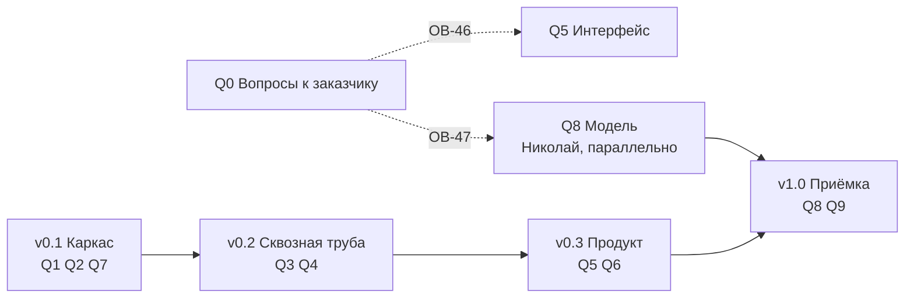

# План работ: десять блоков, четыре версии

Файл ведём по ходу работы, отметки ставим сразу. Перестроен 15.09.2026 из семи вех
в десять блоков — почему, написано ниже в разделе «Почему блоки, а не вехи».

## Как читать план

Работа нарезана по **двум измерениям**, и их нельзя путать.

**Блок отвечает на вопрос «что делаем».** Это часть системы: развёртывание, база,
расчёт, API, интерфейс, заявки, граница с ML, модель, приёмка. Граница блока совпадает
с каталогом в репозитории — открыв блок, видно, куда падает код. В трекере блок
становится эпиком, а каталог — полем «компонент».

**Версия отвечает на вопрос «когда».** Это временной срез: что должно работать
к концу каждого. В трекере версия становится Fix Version или спринтом.

Одна задача принадлежит ровно одному блоку и ровно одной версии. Раньше эти два
измерения лежали в одном списке — отсюда и брались вехи вроде «Фундамент» (это время)
рядом с «Три экрана» (это часть системы).

**У каждого блока две части, и путать их нельзя.** «Задачи» — работа, которую кто-то
делает и которая занимает время. «Готовность» — условия, при которых блок считается
закрытым; их никто не «делает», они либо выполняются, либо нет. Проверка вроде «экраны
открываются в Яндекс.Браузере» — это готовность, а не задача: на доске она висела бы
неделями в статусе «в работе», хотя работы там нет.

**Задачи.** В колонке «Что появляется» стоит конкретный артефакт: путь к файлу, имя
таблицы, метод API или элемент экрана. Формулировок вида «проработать» и «обеспечить»
в этой колонке нет: если из задачи не рождается предмет, который можно открыть, задача
описана неверно и её надо переписать.

**Артефакты** — пять типов, и у каждого свой признак готовности:

| Тип | Признак готовности |
|---|---|
| Код | Лежит в репозитории, проходит свою самопроверку |
| Схема БД | Нумерованная миграция в `db/migrations/`, накатывается на пустую базу |
| Контракт | Файл в `contracts/`, есть пример запроса, пример проходит валидацию |
| Документ | Файл `.md` в `docs/`, содержит числа и дату замера, а не намерения |
| Элемент интерфейса | Виден в браузере, к нему ведёт клик из описанного места |

**Знаки состояния:** `☐` не начата, `⏳` в работе, `✓` закрыта, `❌` провалена,
`✱` развилка пройдена и вариант выбран, `❗` то, что выбранным вариантом не закрывается.
Зачёркнутая задача отменена, причина написана рядом.

## Почему блоки, а не вехи

Прежние семь вех смешивали два разных вопроса. «Фундамент» и «Приёмка» — это время.
«Три экрана» и «Модуль заявок» — это части системы. Пока план читает человек, он держит
связь в голове; на доске задач такой список рассыпается.

Три причины перестроить:

1. **Переключение контекста — главная цена команды из двух человек.** Из 71 задачи
   70 на Мирославе. При разрезе по времени «написать загрузчик» и «нарисовать дашборд»
   лежат в одном эпике, потому что делаются на одной неделе. При разрезе по блокам
   в эпике «Данные» лежит всё про данные, и это то, чем занимаешься в один заход.
2. **Блок переживает сдвиг срока, веха — нет.** Веха «Три экрана» при переносе теряет
   смысл; блок «Интерфейс» остаётся собой.
3. **Требования ТЗ перестают теряться.** Двадцать три работы, добавленные ТЗ
   от 11.09.2026, полгода жили отдельным списком в конце файла с пометкой «перенести
   в тело вех, когда Слава утвердит порядок». Теперь они внутри блоков, каждая со своей
   строкой приёмки.

**Что при этом потеряно и чем возмещено.** Прежний план задавал порядок работ: сначала
API, потом экраны, потому что иначе экраны будут читать выдуманные данные. В блоках
этот порядок не виден. Он выражен двумя способами: версиями (таблица ниже) и явными
зависимостями в колонке задачи.

## Десять блоков

| Блок | Эпик | Каталог | Задач | Готовность | Состояние |
|---|---|---|---|---|---|
| `Q0` Вопросы к заказчику | MOS-1 | — | 6 | 3 | ⏳ три блокирующих плюс три источника, которых нет |
| `Q1` Развёртывание и эксплуатация | MOS-2 | `deploy/` | 7 | 4 | ⏳ 1.1 и 1.7 закрыты, 1.6 добавлена приёмкой стенда |
| `Q2` Данные: загрузка, справочники, разведка | MOS-3 | `db/`, `backend/app/ingest/`, `backend/app/archive/` | 12 | 4 | ⏳ разведка закрыта, справочники залиты, журнал не начат |
| `Q3` Расчётное ядро | MOS-4 | `worker/` | 7 | 4 | ☐ |
| `Q4` REST API и доступ | MOS-5 | `api/`, `auth/` | 10 | 5 | ☐ |
| `Q5` Интерфейс | MOS-6 | `frontend/` | 8 | 6 | ☐ |
| `Q6` Модуль заявок | MOS-7 | `domain/`, `screens/orders/` | 8 | 5 | ☐ |
| `Q7` Граница с ML и объяснимость | MOS-8 | `contracts/`, `mlclient/` | 10 | 4 | ☐ |
| `Q8` Модель | MOS-9 | репозиторий Николая | 1 | 4 | ☐ идёт параллельно с `v0.1` |
| `Q9` Приёмка и поставка | MOS-10 | `delivery/` и шесть файлов сдачи | 8 | 6 | ☐ |

**Семьдесят одна задача и сорок пять условий готовности. У каждой задачи ровно один
исполнитель:** 70 на Мирославе, 1 на Николае. Задач «на двоих» не осталось — там, где
работа делится, она разрезана надвое с зависимостью, а подпись второго человека стала
условием готовности, а не работой.

**Единица у Николая — это граница команды, а не перекос.** За контрактом его кухня:
мы не ставим ему задачи и не считаем его часы в своих сроках. Наше понимание его работы
лежит в блоке `Q8` описанием — как предложение с числами, которое он волен не принять.
Отсюда два следствия: **резать при нехватке времени надо из блоков Мирославы** (у него
резать нечего, его задача закрывает М-18, М-19 и М-20), и **его работа не ждёт нашей** —
ему нужны только выгрузка и контракт, две задачи первого дня.

### Колонка «После»

В таблице задач каждого блока есть колонка «После» с номерами задач, без которых эту
начинать бессмысленно. Это не украшение: на доске такая зависимость становится связью
`blocks` / `is blocked by`, и без неё работа делается дважды. Самый дорогой случай —
`Q4.1` (роли) перед всеми методами API: если писать методы раньше, проверку разрешений
придётся навешивать на девять готовых методов заново.

## Четыре версии

| Версия | Что работает к концу | Блоки |
|---|---|---|
| **v0.1 Каркас** | стенд поднимается на чистой машине, база принимает выгрузку, контракт описан, заглушка модели отвечает | `Q1`, `Q2`, `Q7` частично |
| **v0.2 Сквозная труба** | расчёт проходит восемь стадий с заглушкой, API отвечает по контракту и закрыт ролями | `Q3`, `Q4` |
| **v0.3 Продукт** | три экрана, заявки порождаются автоматически | `Q5`, `Q6` |
| **v1.0 Приёмка** | настоящая модель, четыре метрики, продуктивный объём, документы | `Q8`, `Q9`, остаток `Q7` |

## Правило ворот

**Версия закрыта, когда выполнены условия готовности её блоков, а не когда кончился код.** Пока тесты версии
не прошли, следующую не начинаем. Исключений два: блок `Q8` (работа Николая) идёт
параллельно с `v0.1` и нашими воротами не связан, и блок `Q0` (вопросы к заказчику)
не закрывается своими силами вовсе.

**Порядок внутри версии задают зависимости, а не номера задач.** Главная из них:
`Q4` перед `Q5` — экраны читают API, и если писать их раньше, они будут читать
выдуманные данные, а переделывать придётся дважды.

---

# Q0. Вопросы к заказчику

**Каталог:** —

**Цель.** Чтобы ни одна работа не встала молча. Каждый вопрос, от ответа на который зависит чужая
работа, живёт здесь строкой — с адресатом, датой отправки и тем, что встанет без ответа.

**Артефакт здесь — не письмо, а строка в журнале.** Письмо из трекера не открывается, и по нему не видно, отправлено оно или нет. Поэтому каждый вопрос ведётся строкой в `docs/questions-log.md`: номер ОВ, адресат, дата отправки, дата ответа, что ответили.

**Решено 15.09.2026 и вопросом не является:** заказчику не сообщаем, что его обезличивание половинчатое — в названиях каналов остались живые московские топонимы. Это единственный уцелевший мостик между справочниками, и обоими якорями связи мы обязаны ему. Пользуемся внутри, наружу не выносим; правило целиком — `docs/for-ml-team.md` разд. 12.

## Задачи

| № | Задача | Что появляется | После | Кто |
|---|---|---|---|---|
| 0.1 | ✓ **сделано 15.09.2026.** Собрать таблицу «префикс тега → предполагаемый объект» на все 32 строки, чтобы заказчику осталось подтвердить или поправить, а не разбираться с нуля. Три строки мы доказали данными (847 = Кси 5327; 885 и 890 = Дзета), ещё четыре вывели по возрастанию ид и по датам, когда площадки появились в журнале (914 и 915 = Мю 3828; 1044 и 1051 = Гамма 7), и у каждой из этих четырёх написали словами «проверить по данным нечем». Остальные 25 строк так и остались неизвестными. Топонимы из названий каналов мы проставили у 13 префиксов | `analysis/prefix_to_object.md`; строка ОВ-46 в `docs/questions-log.md` | — | Мирослава |
| 0.2 | **ОВ-46, блокирующий.** Отправить заказчику таблицу 0.1 и попросить подтвердить колонку «предполагаемый объект» | строка ОВ-46 в `docs/questions-log.md` с датой отправки и ответом; подтверждённая колонка в `analysis/prefix_to_object.md` | 0.1 | Мирослава |
| 0.3 | **ОВ-47, блокирующий.** Спросить, согласен ли заказчик считать отказом эпизод `Неисправен` длиннее часа, и есть ли у него журнал ОДС или система учёта заявок, по которым это определение можно сверить | строка ОВ-47 в `docs/questions-log.md`; ответ правит `docs/for-ml-team.md` разд. 1 и 5 | — | Мирослава |
| 0.4 | **Достижимость метрик, блокирующий с 15.09.2026. Формулировка смягчена 15.09.2026 после пересчёта Николая (MOS-14): слово «недостижимы» снято.** Числа ниже верны, но посчитаны по одному каналу, а мерить заказчик будет по инцидентам. На уровне инцидента картина другая: потолок полноты при оракуле 0,98, а не 0,59; лучшее правило даёт точность 0,356, а не 0,040. Для требуемой точности 0,7 не хватает подъёма вдвое, а не на порядок — и это ровно та работа, которую делает модель, непроверенная пока. Поэтому заказчику показываем разрыв и спрашиваем про единицу метрики, а не объявляем задачу невыполнимой. Прежняя причина ошибки та же, что в задаче `2.11`: раздел 10 `docs/for-ml-team.md` считал точность против 82 «пачек от пяти отказов», а не против всех инцидентов — одиночные, которых большинство, в знаменатель не вошли. Показать заказчику числа до испытаний: у 41 % отказов нет ни одной записи своего канала в окне от 8 суток до 24 часов перед событием, а у датчиков дыма таких отказов 60 %. Значит, даже если бы мы угадывали каждый отказ идеально, полнота не поднялась бы выше 0,59 по парку и 0,40 по датчикам дыма, а постановка требует 0,5. Ни одно из одиннадцати правил не дало точность выше 0,040, а постановка требует 0,7. Предложить заказчику выбрать: пересмотреть горизонт, разделить требования по типам оборудования или дать данные с бóльшей глубиной записи | строка в `docs/questions-log.md`; письмо с таблицей из `docs/for-ml-team.md` разд. 10; ответ правит М-18, М-19, М-20 | — | Мирослава |
| 0.5 | **Ф-81.** Спросить, чем заменить геометрию в GeoJSON и WKT, которой требует ТЗ разд. 7: координат в обезличенной выгрузке нет. Предложить три выхода: заказчик даёт геометрию коллекторов, даёт смещённую или снимает требование | строка Ф-81 в `docs/questions-log.md`; ответ решает судьбу задачи `Q4.8` | — | Мирослава |
| 0.6 | **Спросить про три источника, которых у нас нет.** По реестру оборудования (Ф-84) попросить адрес системы и доступ: вписать в `deploy/.env` нам сейчас нечего. По системе учёта заявок (Ф-87, НФ-69) спросить, есть ли она и дадут ли нам читать из неё статусы. По метеоданным (Ф-85, Ф-86) вопрос **снят 15.09.2026**: источник нашли сами, Open-Meteo без ключа, история за весь период скачана. Осталось только ОВ-49 — какой адрес разрешит служба безопасности и выпустят ли нас через межсетевой экран; это правило на экране, а не право ходить наружу, и разработку оно не держит | три строки в `docs/questions-log.md`; ответы решают судьбу задач `Q2.8`, `Q6.8` и `Q3.6` | — | Мирослава |
| 0.7 | **Запросить у заказчика выгрузку в xlsx либо закрыть Ф-76 оговоркой.** ТЗ разд. 7 требует принимать и CSV, и XLSX, а критерий Ф-76 — залить один набор двумя файлами и сверить числа. Заказчик прислал только csv: проверить нечем. Ветка чтения xlsx через `python_calamine` в загрузчике есть, но на настоящих данных не выполнялась ни разу. Хватит выгрузки за один месяц. Заодно спросить, останется ли csv постоянным форматом обмена: если да, `python_calamine` из образа можно убрать | строка в письме заказчику; после ответа — прогон обеих веток с числами либо оговорка в строке Ф-76 · приёмка: Ф-76 | — | Мирослава |

## Готовность

Условия закрытия блока. Их никто не «делает» — они либо выполняются, либо нет.
У каждого условия с числом есть задача, которая это число обеспечивает.

- ☐ Все шесть строк отправлены, у каждой в `docs/questions-log.md` стоит дата отправки.
- ☐ По каждому вопросу записан ответ или дата, когда идём за ним повторно.
- ☐ Задачи `Q2.8`, `Q3.6`, `Q4.8` и `Q6.8` не начаты без ответа — либо решение работать без него принято явно и записано в журнале.

---

# Q1. Развёртывание и эксплуатация

**Каталог:** `deploy/`

**Цель.** Система поднимается на чистой машине по инструкции, переживает перезапуск, держит
двадцать пользователей и восстанавливается из копии за четыре часа.

**Инструкция развёртывания пишется один раз, в `Q9`.** ТЗ разд. 14 называет поимённо `docs/install.md` и `docs/build.md` — комиссия откроет их, а не наш `deploy.md`. Отдельной задачи на `docs/deploy.md` здесь нет.

## Задачи

| № | Задача | Что появляется | После | Кто |
|---|---|---|---|---|
| 1.1 | ✓ **сделано 15.09.2026, коммит `097993e`.** Дерево из 17 каталогов заведено, стенд поднят: PostgreSQL 18.6 с PostGIS 3.6, nginx отдаёт 200 по HTTP/2, порт 80 даёт 301. **15.09.2026 дописали вход по новому виду адресов:** `listen [::]:80` и `listen [::]:443 ssl`. Без них nginx слушал только `0.0.0.0`, клиент с адреса `::1` получал `connection refused` при исправном сервере, и на этом же спотыкалась наша собственная проверка живости. Строка НФ-75 закрыта замером `sh deploy/check-tls.sh`, снятым по обоим видам адресов: nmap показывает TLSv1.2 и TLSv1.3 по три набора шифров, секций TLSv1.0 и TLSv1.1 нет вовсе. Из шести контейнеров HLD разд. 7.1 поднимаются два, остальные четыре ждут кода под профилем `app`. **Две ловушки, на которые мы напоролись:** том базы пришлось монтировать на `/var/lib/postgresql`, а не на `.../data` — в 18-й ветке `PGDATA` переехал, и старый путь оставил бы кластер в анонимном томе, а `deploy/backup.sh` из задачи 1.2 забирал бы ноль байт; и `openssl` без `-cipher DEFAULT@SECLEVEL=0` показывает отказ нашего клиента вместо отказа сервера, поэтому доказательством для НФ-75 служит `nmap`, а openssl идёт контролем. Завести репозиторий по структуре `docs/HLD.md` разд. 2 и поднять пустой стенд. Сразу же прописать в `deploy/nginx/nginx.conf` TLS не ниже 1.2: строку `ssl_protocols TLSv1.2 TLSv1.3` и набор шифров, где нет RC4 и 3DES | Дерево папок, `deploy/docker-compose.yml`, `deploy/.env.example`, `deploy/nginx/nginx.conf` · приёмка: НФ-75 | — | Мирослава |
| 1.2 | Настроить резервное копирование по расписанию и написать порядок восстановления. Таблицу-журнал копий не заводим: ни одна строка приёмки её не требует | `deploy/backup.sh` в cron, `docs/restore.md` · приёмка: НФ-39, НФ-78 | — | Мирослава |
| 1.3 | Написать нагрузочный сценарий на 20 одновременных пользователей | `deploy/k6/20-users.js` · приёмка: НФ-74 | 1.1 | Мирослава |
| 1.4 | Прогнать нагрузку и починить то, что вылезет: 20 сессий по 5 минут, отклик по 95-му перцентилю не хуже 2 секунд | раздел «Нагрузка» в `docs/load-test.md` · приёмка: НФ-74 | 1.3, Q4 | Мирослава |
| 1.5 | Собрать перечень всех библиотек с лицензиями. Перечень мы не переписываем руками, а получаем командами: `pip-licenses` по наборам `api` и `worker`, `npm ls` по фронту, а перечень по образу `ml` присылает Николай — его репозиторий мы не видим, а на приёмке отвечаем мы. Каждую библиотеку смотреть **в трёх местах, а не в одном:** поле лицензии на PyPI, список классификаторов и файл `LICENSE` в репозитории. У `scikit-survival` в поле стоит `GPL-3.0-or-later`, а классификаторы пусты — автоматическая проверка такую библиотеку пропустит (`docs/HLD.md` разд. 7.3) | `docs/libraries.md`, в нём колонки «пакет», «версия», «лицензия», «набор» и четыре набора: `api`, `worker`, `nginx`, фронт · приёмка: НФ-82 | — | Мирослава |
| 1.6 | Закрыть четыре замечания, найденных на независимой приёмке 1.1 (MOS-82). **Первое:** nginx слушает только IPv4 — `netstat -tln` в контейнере показывает `0.0.0.0:443` и ни одной строки с `::`, замер НФ-75 снят только по IPv4. ✓ **закрыто 15.09.2026:** обе строки стоят в `deploy/nginx/nginx.conf`, `netstat -tln` в контейнере показывает и `0.0.0.0:443`, и `:::443`, снаружи оба адреса отдают 200 по HTTP/2. Замер НФ-75 переснят по обоим видам адресов — `127.0.0.1` и `::1`, числа совпали. Скрипт `deploy/check-tls.sh` научился адресам нового вида: `nmap` он зовёт с `-6`, а адрес для `openssl` берёт в квадратные скобки. **Осталось три замечания из четырёх.** **Второе:** `pg_hba.conf` от initdb содержит `host all all 127.0.0.1/32 trust`, и внутри контейнера база пускает с любым паролем — по сети строго, но у получившего шелл полный доступ. **Третье:** заглушка `POSTGRES_PASSWORD=СМЕНИ-МЕНЯ` работает, поэтому забытый пароль больше не роняет базу громко — на сервере пароль надо генерировать. **Четвёртое:** ✓ **закрыто 15.09.2026.** Замер на сервере подтвердил: в таблице `f2b-table` одна цепочка на хуке `input` с единственным правилом `tcp dport 22`, а цепочки `DOCKER-*` своего хука не имеют и вызываются из `FORWARD` — то есть запрос к портам 80 и 443 fail2ban не видит вовсе. Закрыли не правилами сети, а `limit_req_zone` в `deploy/nginx/nginx.conf`: nginx видит каждый запрос независимо от того, чем заказчик рулит сетью. 30 запросов в секунду с всплеском до 60 — при 20 пользователях НФ-74, пришедших с одного адреса через общий шлюз, это полтора запроса на человека. Замер: 60 запросов разом прошли все, флуд из 400 дал 345 отказов с кодом 429. **Осталось два замечания из четырёх.** | строки `listen [::]:…` в `deploy/nginx/nginx.conf`, `limit_req_zone` там же, раздел «защита опубликованных портов» в `docs/server.md`, шаг про генерацию пароля в `docs/install.md` · приёмка: НФ-75, НФ-81 | 1.1 | Мирослава |
| 1.7 | ✓ **сделано 15.09.2026, MOS-85.** `backend/Dockerfile`, `backend/app/migrate.py` и `public.schema_migration`: в журнале 8 строк на 8 файлов, все восемь `sha256` сверены с `shasum` по диску, повторный прогон даёт «0 новых, 8 уже были» и код 0. Ловушка для всех: миграции попадают в образ через `COPY` при сборке, поэтому после правки `db/migrations/` образ надо пересобирать — иначе накат падает на расхождении хеша. Накат на пустую базу с нуля не проверен ни разу. **Собрать образ бэкенда и накат миграций.** `deploy/docker-compose.yml` объявляет три контейнера под профилем `app` — `migrate`, `api`, `worker`, — и все три собираются из `backend/Dockerfile`, которого нет: в `backend/` восемь пустых каталогов и ноль файлов `.py`. `migrate` при этом не «ещё один контейнер», а условие старта двух других — они ждут его через `condition: service_completed_successfully`, поэтому профиль `app` сейчас не поднимется вовсе, а не поднимется частично. Накат проверять двумя прогонами подряд: второй обязан не накатывать ничего повторно | `backend/Dockerfile`, `backend/app/migrate.py` (тридцать строк по HLD разд. 7.1), таблица `public.schema_migration` со списком накатанного и `sha256` каждого файла | 1.1 | Мирослава |
| 1.8 | ✓ **сделано 16.09.2026, MOS-90.** Стенд на сервере достроен: `db`, `nginx` и `ml` — все три `healthy`. Сертификат выпущен на месте, образ заглушки собран там же, самопроверка внутри образа прошла. **Пароль базы сменён:** он приехал на сервер копией с мака через rsync — файл стоит в `.gitignore`, но rsync идёт по файловой системе, а не по git. Смену проверила уловом: старый пароль теперь получает `password authentication failed`, новый пускает. **Протоколы TLS пересняты на продуктивном контуре** — прежние снимались на маке: TLSv1.2 и TLSv1.3 по три набора с оценкой A, TLSv1.0 и TLSv1.1 отклонены, HTTPS отдаёт 200 по HTTP/2 на обоих видах адресов, HTTP — 301. **Строка НФ-81 из этой задачи убрана:** она про браузеры, а не про TLS, и закрыть её нечем, пока нет интерфейса | оба протокола в `docs/`, три контейнера `healthy` на сервере · приёмка: НФ-75 | 2.5 | Мирослава |
| 1.9 | **Сделать резервное копирование базы и проверить восстановление.** В базе 55 ГБ и ни одной копии; сегодняшний план восстановления — залить заново, час в три потока. ТЗ разд. 9 требует восстановления не дольше четырёх часов. `docs/project-structure.md` перечисляет `deploy/backup.sh`, которого в репозитории нет. Решить, копируем ли все 55 ГБ или схему со справочниками и годом журнала, а глубину восстанавливаем из csv. **Восстановление проверить на деле:** поднять вторую базу из копии и сверить девять контрольных чисел командой `--check` | `deploy/backup.sh`; раздел «Резервные копии и восстановление» в `deploy/README.md` с замеренным временем · приёмка: НФ-34 | 1.8 | Мирослава |

## Готовность

Условия закрытия блока. Их никто не «делает» — они либо выполняются, либо нет.
У каждого условия с числом есть задача, которая это число обеспечивает.

- ⏳ Стенд поднят на чистой машине **по инструкции, а не по памяти**, и проверял её не тот, кто писал. **Половина условия выполнена 15.09.2026.** Проверял не автор: конфиги писала одна сессия, поднимал с нуля другой человек. Я удалил `deploy/.env` и `deploy/nginx/certs` — их нет в git, значит у нового человека их не будет — и поднял стенд заново, оба контейнера дошли до `healthy`. **Но инструкции в тот момент не существовало:** я нашёл недостающие шаги отладкой и уже из них написал `deploy/README.md`. Условие закроется, когда стенд поднимут по этому README, не заглядывая в конфиги. Три спотыкания, ради которых README и написан: никто не говорит скопировать `.env.example` в `.env` (база падает с `You must specify POSTGRES_PASSWORD to a non-empty value`), никто не говорит выпустить сертификат командой `sh make-cert.sh` (nginx падает с `cannot load certificate`), и `docker compose up -d` **возвращает код 0, даже когда обе службы упали** — проверять надо отдельно через `docker compose ps`.
- ✓ TLS: `nmap --script ssl-enum-ciphers` не показывает ни одного протокола ниже 1.2 и ни одного шифра из RC4 и 3DES. **Проверено 15.09.2026 на стенде, независимо от автора конфига.** nmap печатает секции TLSv1.2 и TLSv1.3 по три набора в каждой, `least strength: A`, секций TLSv1.0 и TLSv1.1 нет вовсе. Ни RC4, ни 3DES: раскрыл строку `ssl_ciphers` командой `openssl ciphers -v` — девять наборов, поиск по RC4, 3DES, DES-CBC, EXP, NULL, ADH, AECDH дал ноль совпадений. На продуктивном контуре замер не повторяли.
- ☐ Восстановление из вчерашней копии прогнано с секундомером и уложилось в 4 часа — это `pg_restore`, а не перезапуск контейнера.
- ☐ В `docs/libraries.md` ни одной GPL, LGPL или AGPL в образах `api`, `worker`, `nginx`.

---

# Q2. Данные: загрузка, справочники, разведка

**Каталог:** `db/`, `backend/app/ingest/`, `backend/app/archive/`

**Цель.** База принимает выгрузку заказчика целиком и не врёт о том, что приняла. Всё, что мы
знаем о данных, посчитано и записано числами.

## Задачи

| № | Задача | Что появляется | После | Кто |
|---|---|---|---|---|
| 2.1 | ✓ **сделано 15.09.2026, коммит `51adfb2`.** Пять файлов переехали из `code/` в `db/migrations/001_assets.sql` … `005_xref.sql`, 2702 строки, git записал переименованием. Схема накатана на пустую базу целиком: 9 схем, 91 таблица, 90 партиций `smvu.reading` за 2019-01 … 2026-06, 436 внешних ключей, 736 индексов. По дороге починена поломка в `001_assets.sql:862`: рекурсивное представление `asset.v_floc_path` ссылалось само на себя с именем схемы, и первая же миграция падала с «relation asset.v_floc_path does not exist». Ссылку на `ref.app_user` из `005_xref.sql` оставили комментарием — таблицу заводит `Q4.1`, двигать её ради пяти внешних ключей дороже. Перевести **пять** схем из `code/` в нумерованные миграции `001`…`005`: `assets`, `geo`, `permits`, `events`, `xref`. Накатывать строго в этом порядке, порядок проверяет `python3 code/check_schema.py`. **Осторожно:** `code/schema_xref.sql` ссылается на `ref.app_user`, а эту таблицу заводит `Q4.1` — либо мы двигаем `Q4.1` раньше, либо оставляем ссылку комментарием и пишем это решение прямо в миграции | `db/migrations/001_assets.sql` … `005_xref.sql` | — | Мирослава |
| 2.2 | ✓ **сделано 15.09.2026, MOS-23, миграция `013_setpoints.sql`.** В базе 8 уставок, 54 норматива ТО, 9 видов работ и 15 подвидов огневых. Пять порогов сверены с `docs/acceptance-test.md` разд. II.1, 54 норматива взяты целиком из `code/reglament_to_schedule.json`. Колонка `inclusive` разводит «выше 1 %» и «1,0 % и более» — одно число метана с разной строгостью, без неё НФ-58 и НФ-59 провалились бы на границе. `periodicity_days` сделан `numeric`: есть 3,5 суток («2 раза в неделю») и 0,0417 («каждый час»), `integer` их бы обнулил. **Задача начинается не с заливки, а с миграции — найдено 15.09.2026 на живой базе стенда.** Лить уставки некуда: таблиц `ref.setpoint` и `ref.norm_period` в схеме нет, в `ref` 21 таблица и ни одной под пороги. HLD разд. 5.4 обещал их в миграции `002_ref` вместе с `app_user` и `audit_log` — из пяти обещанных лежит одна, `feedback_reason`. Ближайшее, что есть, — `smvu.fault_rule`, но это правила распознавания неисправности, а не пороги среды: ни единицы измерения, ни направления сравнения. Номер миграции берём следующий свободный в `db/migrations/`, а не из этого плана: номера здесь розданы вперёд, и файла с меньшим номером может не существовать, когда наш уже накатан. Залить справочники данными: нормативы ТО, виды работ, уставки. Ради уставок 206 страниц регламента читать не надо: пять порогов части II дословно лежат в `docs/acceptance-test.md` разд. II.1 (вода 200 мм, температура 45 °C, кислород ниже 20 %, метан 1 %), ещё три мы берём из самого журнала — «В норме от +3 до +40», «ниже 3ºC», «выше 40ºC» | `db/seed/lifetimes.sql`, `db/seed/work_types.sql`, `db/seed/setpoints.sql` · приёмка: НФ-56…НФ-59 | 2.1 | Мирослава |
| 2.3 | ✓ **сделано 15.09.2026 загрузчиком, а не миграцией — MOS-24 закрыта 16.09.2026.** Отдельной миграции `014_smvu_ref.sql` не будет, и вот почему: справочники заказчика — это его данные, а не наша схема, и класть 11 485 строк INSERT в git значит возить копию выгрузки в репозитории. Заливает их `backend/app/ingest/smvu_csv.py` ключами `--objects` и `--channels`, первыми, до журнала — так требует внешний ключ. Замер на сервере 16.09.2026: `smvu.channel` 12 627 строк (11 485 из справочника плюс 1 142 заглушки, заведённые журналом), `smvu.object_tree` 95, `ref.object_xref` 3 173 участка. Битая ссылка корня на несуществующий объект 3831 обнулена: строк с `parent_id = 3831` ноль, корень один. Шаг заливки описан в `deploy/README.md` разделом «Залить выгрузку СМВУ» — туда же он попадёт из `docs/install.md` задачей 9.4. Залить справочники каналов и объектов **до** журнала | **Поправлено 15.09.2026: номер `006` занят файлом `006_explain_templates.sql`, миграции этой задачи закреплён номер `014_smvu_ref.sql` (012 и 013 отданы задачам 2.10 и 2.2). И строк не 12 627, а 11 485: 12 627 — это каналы, встретившиеся в журнале за 7,5 лет, из них 1 142 сняты и в справочник не попали.** Миграция `014_smvu_ref.sql` заливает `smvu.channel` (11 485 строк) и `smvu.object_tree` (95 строк) и по дороге обнуляет битую ссылку корня на 3831 · приёмка: Ф-77, Ф-78 | 2.1 | Мирослава |
| 2.4 | ✓ **сделано 15.09.2026, MOS-25.** Загрузчик `backend/app/ingest/smvu_csv.py` заливает всё: два справочника и журнал. **Общего staging на 313 млн строк нет** — он занял бы 40 ГБ сверх самих данных; чанк живёт по 500 тыс. строк в типизированной `load.smvu_chunk`, оттуда `INSERT ... SELECT` с `ON CONFLICT DO NOTHING`. Чанк в базе нужен не ради разбора типов, а ради дублей: `COPY` не умеет `ON CONFLICT`, а дубли в выгрузке есть. Разбор типов вернулся в Python, чтобы одна битая метка времени не уносила с собой 499 999 хороших строк. Отчёт о качестве — `load.batch` (принято, отброшено) и `load.error` (по строке на причину, а не на запись). **Умеет лить в несколько потоков:** `--slot` даёт каждому свою чанк-таблицу, три потока дали 83 тыс. строк/с против 25 тыс. в один. Команда `--check` сверяет залитое с контрольными числами | `backend/app/ingest/smvu_csv.py` · приёмка: Ф-59, Ф-76, Ф-77 | 2.3 | Мирослава |
| 2.5 | ✓ **сделано 15.09.2026, MOS-26. Залито 312 982 076 строк, отброшено 563 940 дублей и 1 повторный заголовок; сумма 313 546 016 сошлась с описью выгрузки до строки.** Сошлись и все восемь годовых чисел по отдельности. Дубли по паре (`ид_события`, время) реальны: 562 449 в файле за 2023 год и 1 491 в 2019-м, в остальных ноль. Повторный заголовок в файле за 2025 год нашёлся ровно один — прототип загрузчика на нём бы упал после двадцати пяти минут работы. Каналов-заглушек **1 142**, и это решает спор в наших же документах: `004_events.sql` обещает 1 143, остальные три файла — 1 142; пара чисел 12 627 − 1 142 = 11 485 была права. **База живёт на сервере, а не на машине разработчика** (см. `docs/server.md`): 55 ГБ при 119 ГБ диска. Шесть индексов построены после заливки за 9,2 минуты. Проверка `--check`: девять контрольных чисел, расхождений ноль | заполненная `smvu.reading`; отчёт о качестве в `load.batch` и `load.error` · приёмка: НФ-33, Ф-59 | 2.4 | Мирослава |
| 2.6 | ✓ **сделано 15.09.2026, MOS-27.** Разбор переехал в `backend/app/ingest/tag_to_section.py`, копии в `code/` не осталось. **Посчитано на заливке справочника, а не оценкой: из 11 485 каналов участок определился у 10 720 (93,3 %), участков вышло 3 173.** Оставшиеся 765 — датчики внутри диспетчерских пунктов, участка у них нет и быть не должно. Участки лежат в `ref.object_xref` со `smvu_key` вида «847:106». В комментариях `db/migrations/004_events.sql` и `005_xref.sql` остался прежний путь: правка накатанного файла сменила бы его sha256, и `app.migrate` упал бы — так он и задуман | `backend/app/ingest/tag_to_section.py` с самопроверкой · приёмка: Ф-79 | — | Мирослава |
| 2.7 | ✓ **сделано 15.09.2026, MOS-28, коммит `37142ed`.** Раздел «Выгрузка заказчика: опись» в `docs/day-one.md`, полный проход по 15,9 ГБ скриптом `analysis/inventory.py`. Семь утверждений описи пересчитаны независимым агентом другим инструментом (`wc`, `grep`, `cut`, без `awk`) — сошлись все: 313 546 016 настоящих записей при 313 546 017 строках данных, ноль строк не с шестью полями, 2 735 дней с записями из 2 738. Нашлись три пустых дня (задача 2.12) и повторный заголовок в файле 2025 года, портивший четыре счётчика сразу. Описать, что реально прислал заказчик: файлы, колонки, периоды, число строк замером, найденные дыры | раздел «Выгрузка заказчика» в `docs/day-one.md` — отдельный файл не заводим, замеры уже там · приёмка: ОВ-01 | — | Мирослава |
| 2.8 | ⏳ **заблокирована до ответа по Ф-84.** Забирать реестр оборудования автоматически: адреса системы у нас нет, спрашиваем задачей `Q0.6` | `backend/app/ingest/load_equipment.py` · приёмка: Ф-84 | 0.6 | Мирослава |
| 2.9 | ✓ **закрыто 15.09.2026: проверить, можно ли прогнозировать на этих данных.** Мы прошли шесть вопросов вехи, на три ответ получился отрицательный, и это её результат. Целевой переменной взяли эпизод `Неисправен` длиннее часа — таких эпизодов 10 416 за 7,5 лет. Частоту событий мы замерили: 313 546 016 строк, наша прежняя вилка 18–90 млн не подтвердилась. DuckDB нужна. Критерий `k` не считается: в выгрузке нет ни наработок, ни дат ввода в эксплуатацию. Горизонт 24 часа правилами не берётся — даже при идеальном угадывании полнота не поднимается выше 0,59 по парку и 0,40 по датчикам дыма. Отдельный `docs/data-research.md` не заводим: замеры лежат там, где мы принимаем решения | 12 пунктов с числами в `docs/day-one.md`; восемь счётных скриптов в `analysis/`; разд. 10 в `docs/for-ml-team.md` | — | Мирослава |
| 2.10 | ✓ **сделано 15.09.2026, MOS-83.** Партиций стало 109 вместо 91: 18 месячных за июль 2026 — декабрь 2027 плюс функция `smvu.ensure_partitions(месяцев)`. Проверено вставкой строки с `now()` — она легла в `smvu.reading_2026_09`, `reading_default` остался нулевым; границы соседних партиций сомкнуты без дыры и нахлёста. Два вызова `ensure_partitions(24)` подряд: первый досоздал восемь партиций 2028 года, второй не создал ничего. **Нарезать партиции `smvu.reading` вперёд.** Сейчас их 90, за январь 2019 … июнь 2026 — ровно под присланный архив. Живой поток из `3.7` приходит с сегодняшней меткой времени, ни в одну партицию не попадает и уходит в `smvu.reading_default`, а тот обязан быть пустым: пока он непуст, присоединение следующей партиции читает его целиком под `ACCESS EXCLUSIVE` и база встаёт на минуты. Автоматики нет — блок `pg_partman` в `004_events.sql:691-704` закомментирован. Проверять не числом партиций, а вставкой строки с `now()`: она обязана лечь в месячную партицию, а `smvu.reading_default` остаться нулевым | `db/migrations/012_partitions_ahead.sql`: партиции до конца 2027 и функция `smvu.ensure_partitions(месяцев)`, которую дёргает планировщик из `3.4` | 2.1 | Мирослава |
| 2.11 | ⏳ **пересчёт сделан 15.09.2026, задача не закрыта: MOS-86 ждёт двух цифр от Николая.** Николай пересчитал проверочное окно своим ключом и получил 176 инцидентов вместо наших 166. Причина: считали двумя разными кусками кода. Методика — `group_incidents()` в `code/predictive_metrics.py`, склейка строго внутри коллектора, и самопроверка там прямо запрещает сливать разные коллекторы. А число в документы попало из `analysis/clusters.py`, где обе оконные функции стояли без `PARTITION BY pfx` и склеивали отказы разных коллекторов, если старты разошлись меньше чем на 10 минут. Проверка направления ошибки: три отказа на трёх коллекторах со стартами через 4 минуты дают 3 инцидента по методике и 1 по разведке. Скрипт починен, у него появилась самопроверка на четырёх строках в памяти — прогнал её на старом запросе, она бы закричала. Число заменено в семи местах. **Осталось:** сколько из 176 инцидентов одиночные (стояло 113 при неверном ключе) — запрошено у Николая, parquet лежит на сервере | `analysis/clusters.py` с `PARTITION BY pfx` и самопроверкой; 176 вместо 166 в семи документах | — | Мирослава |
| 2.12 | **Исключить из обучения три пустых дня выгрузки (MOS-87).** Полный проход по восьми файлам 15.09.2026 нашёл дни, когда СМВУ не написала ни строки по всему парку: 6-11 апреля 2024 (тишина 275 299 секунд, 7 и 8 апреля пустые совсем; суточная норма по медиане 24 чистых дней апреля — 142 929 записей, за шесть суток ожидалось 857 574, записано 94 999, недостача 762 575 — это 89 %) и 1 июня 2026 (ровно календарные сутки, границы совпадают до секунды — похоже на не приехавший кусок выгрузки, а не на аварию). Признаки за сутки на этих днях считаются по пустому окну, а эпизод `Неисправен`, начавшийся раньше, тянется сквозь тишину. **Тот же вопрос на другой границе:** из 57 незакрытых эпизодов архива 51 упирается в конец выгрузки, а шесть — в снятие самого канала (он написал `Неисправен` и замолчал навсегда). Мерить такой эпизод «до конца данных» — получить отказ длиной в шесть лет | оба окна названы в `docs/for-ml-team.md`; решение по эпизодам, пересекающим тишину, записано | 2.7 | Мирослава |
| 2.13 | **Перестроить первичный ключ `smvu.reading`, вернуть около 7 ГБ.** Ключ весит 50 байт на строку вместо теоретических 24: выгрузка не отсортирована по времени, вставка режет страницу индекса пополам, половина остаётся пустой. Куча при этом растёт ровно, 84,7 байта. Индексы, построенные после заливки, этой болезнью не страдают — три вторичных заняли 14 ГБ и построились за 9,2 минуты. Делать только после 1.9: трогать первичный ключ на 55 ГБ без единой копии не стоит | `REINDEX INDEX CONCURRENTLY` по партициям; замер «было — стало» в `deploy/README.md` | 1.9 | Мирослава |
| 2.14 | **Разобрать 562 449 дублей в файле за 2023 год.** Первичный ключ отбросил 563 940 повторов пары (`ид_события`, время): 562 449 в 2023 году, 1 491 в 2019-м, ноль в остальных шести. Мы знаем, что повторяется ключ, и не знаем, повторяется ли строка целиком. Если значения расходятся, мы молча выбрали одну строку из двух, и это вопрос заказчику, а не наша чистка. Проверка на сервере: `sort … | uniq -d` против `cut -f1,3,4 … | uniq -d`, числа должны совпасть. Заодно посмотреть, ложатся ли повторы на один отрезок дат — похоже, кусок периода выгрузили дважды | абзац в `docs/day-one.md`; при расхождении значений — строка в вопросах заказчику | 2.5 | Мирослава |
| 2.15 | ✓ **сделано 16.09.2026, MOS-95. Справочники были на месте, а вот поведение оказалось обратным тому, чего требует Ф-78.** Первое из четырёх условий строки было выполнено с самого начала, и я этого не увидел: `smvu.sensor_kind` (19 строк, есть колонка `is_numeric`) и `smvu.system_kind` (6 строк) заведены в `004_events.sql` ещё 15.09.2026 — я искал их в схеме `ref` и завёл было дубликат, который пришлось снести. **Настоящая находка оказалась противоположной.** На `smvu.channel` висят внешние ключи `channel_sensor_kind_fkey` и `channel_system_kind_fkey`, и канал с типом «Выдуманная подсистема» база отвергает целиком: `ForeignKeyViolationError`. То есть такой канал терялся не молча, а с грохотом — и уносил с собой заливку, чего Ф-78 прямо запрещает. Теперь `load_channels` сверяет тип со справочником **до** вставки: незнакомый снимает в `NULL`, а факт пишет в `load.error` с `rule_code = 'FK_MISSING'`, именем типа и списком номеров каналов. Ключ остаётся на месте — опечатка по-прежнему не создаст седьмую систему. **Проверено на отдельной базе `moskollektor_f78`**, поднятой ради этого и снесённой после: два подмешанных канала легли в базу с `NULL` в типе, в отчёте две строки, пакет показывает «загружено 11 487, с замечанием 3», заливка не прервалась. Заодно там впервые прошёл **накат миграций с чистого листа** — восемь файлов на пустой базе, «8 новых, 0 уже были»; до этого `backend/app/migrate.py` честно писал, что это не проверено | сверка типов в `backend/app/ingest/smvu_csv.py`, причина «тип вне справочника» в `load.error` · приёмка: Ф-78 | 2.3 | Мирослава |
| 2.16 | **Построить эпизоды отказов: `smvu.fault_episode` пуста, и её никто не заполняет (MOS-96).** Таблица лежит в схеме с 15.09.2026 и содержит ноль строк; поиск по имени находит только DDL в `004_events.sql` и внешний ключ в `005_xref.sql`, ни одного скрипта. Стоит это двух признаков контракта из 22 — `fault_30d` и `neighbor_fault_7d` уходят в модель как `NULL`, и подменять их на `false` нельзя: пустая таблица не отличает «отказа не было» от «эпизоды не считались». Дороже другое: **эпизод «Неисправен» длиннее часа — наша целевая переменная**, их 10 416 за 7,5 лет, но число посчитано скриптом в `analysis/`, а в базу не сохранено. Пока таблица пуста, обучающую выборку средствами продукта не собрать, а на приёмке нечем показать, что мы называем отказом | `backend/app/ingest/fault_episodes.py` с самопроверкой; число эпизодов в базе сверено с 10 416 | 2.5 | Мирослава |

## Готовность

Условия закрытия блока. Их никто не «делает» — они либо выполняются, либо нет.
У каждого условия с числом есть задача, которая это число обеспечивает.

- ☐ Заливка прошла до конца: `SELECT count(*) FROM smvu.reading` равно 313 546 016, отброшена одна строка — повторный заголовок в `ext-journal-2025.csv`.
- ☐ Отчёт о качестве называет число отброшенных строк и причину по каждой; молча не теряется ничего.
- ☐ Справочники залиты **до** журнала: внешние ключи не отвергают ни одной строки.
- ☐ `docs/protocol-directions.md` подписан, дата в нём раньше первого прогона с настоящей моделью.

---

# Q3. Расчётное ядро

**Каталог:** `backend/app/worker/`

**Цель.** Расчёт проходит восемь стадий, укладывается в пять минут на продуктивном объёме
и не запускается дважды.

## Задачи

| № | Задача | Что появляется | После | Кто |
|---|---|---|---|---|
| 3.1 | ✓ **сделано 16.09.2026, MOS-31, миграция `007_pred_fix.sql`.** Три правки, и каждая закрывает дыру, найденную уловом. **Первая:** `pred.run.model_version` был `NOT NULL`, а по HLD разд. 8.2 строка прогона заводится **до** обращения к модели — пока колонка требовала значения, условие готовности блока «недоступная модель не роняет систему: расчёт падает с записью в `pred.run`» не выполнялось физически, записи бы просто не возникло. Проверено отказом: `INSERT INTO pred.run (status) VALUES ('running')` отвечал `NotNullViolationError`. **Вторая:** колонка `as_of` — момент среза. Выгрузка кончается 30.06.2026, а сегодня 16.09.2026: расчёт на `now()` выглядит как рабочий прогон, но даёт пустые окна по всем 22 признакам, и по журналу прогонов этого не видно. **Третья:** `objects_scored` — «посчитано N из M». Заодно выяснилось, что **вводная оркестратора здесь врала**: я написал, что внешних ключей на `ref.object_xref` не хватает, а их 122, включая `forecast_section_fk` и `forecast_current_section_fk` — комментарий «FK на ref.object_xref — в 005_xref.sql» я прочитал как незакрытое обещание, не проверив, выполнил ли его 005. Повторный накат: «0 новых, 10 уже были». **Сверить `pred.*` с тем, что нужно расчёту, и добить недостающее.** Таблицы `pred.run`, `pred.forecast` и `pred.forecast_current` уже лежат в `db/migrations/004_events.sql` — их перенесла задача `Q2.1` 15.09.2026, заводить заново нельзя | `db/migrations/007_pred_fix.sql` | 2.1 | Мирослава |
| 3.2 | **Стадий будет семь, а не восемь — решено 16.09.2026.** Шестая по HLD — «обновление `geo.object_risk` для раскраски карты», и выполнить её не на чем: колонка `geo_object_id` пуста у всех 3 173 строк `ref.object_xref` (замер 16.09.2026), связь участка с географическим объектом даёт ответ заказчика на ОВ-46, которого нет. Карта до тех пор раскрашивается по `section_id`. Это записано здесь, а не пропущено молча, чтобы на приёмке пропуск стадии не выглядел недоделкой. Написать прогон расчёта из восьми стадий по `docs/HLD.md` разд. 8: выбор объектов, окно чтения, сборка признаков, вызов модели, запись прогноза, свёртка, `NOTIFY forecast_ready`, журнал прогона | `backend/app/worker/run.py`, `publish.py` | 3.1, 7.5 | Мирослава |
| 3.3 | Собирать вектор признаков по `contracts/features.v1.yaml`. Это самая дорогая стадия расчёта: она забирает 20 секунд из 41 | `backend/app/worker/features.py` | 7.1 | Мирослава |
| 3.4 | Запускать расчёт по расписанию так, чтобы два экземпляра не считали одно и то же | `backend/app/worker/scheduler.py` с `pg_try_advisory_lock(48217)` | 3.2 | Мирослава |
| 3.5 | **Уложить полный расчёт в 300 секунд.** Снять профиль по стадиям и ускорить сборку признаков — она берёт 20 секунд из 41 и держит весь расчёт. Прогнать на стенде с полной выгрузкой три раза, худший прогон записать в протокол | раздел «Расчёт» в `docs/load-test.md`: три замера и профиль по стадиям · приёмка: М-21, НФ-72 | 3.2, 2.5 | Мирослава |
| 3.6 | ⏳ **в работе, MOS-36. Разблокирована 15.09.2026: запрета выходить наружу нет, есть требование.** `docs/tz-djkh.pdf` стр. 11, разд. 13 «Источники данных»: «Метеорологические службы… интеграция через открытые API»; ограничение «только чтение» на той же странице относится к внутренним системам заказчика. Источник — **Open-Meteo**: ключ не нужен, 10 000 вызовов в сутки бесплатно при наших 24, архив с 1940 года, данные ERA5 от ECMWF. Замер 15.09.2026: весь период 01.01.2019 — 30.06.2026 пришёл одним запросом за 2 секунды, 65 712 часов, 2,3 МБ, ни одного пропуска. Яндекс.Погода и Гисметео отпали — архив платный. **Архив забран** скриптом `code/load_weather.py` в `dataset/weather.csv`. **Задача сужена 15.09.2026: шесть погодных признаков в модель не идут.** Николай прогнал их против отказов — доля дней с отказом по всем бинам температуры, осадков и давления лежит в полосе 0,79–1,15 от базовой, в модели разница меньше шума по `seed`. Осадки проверить не на чем: датчиков затопления 26 из 11 485, и за четыре года ни один не был `Неисправен` дольше часа. Остаётся то, чего требует Ф-85 сам по себе: почасовой забор из планировщика `3.4` и показ времени последнего успешного обновления. Требование приёмки и польза для модели — разные вещи. Оговорка для протокола: бесплатный тариф некоммерческий, заказчику нужна подписка либо своя копия сервера (код открыт) | миграция `ext.weather_hourly`, `backend/app/ingest/weather.py`, шесть признаков в `contracts/features.v2.yaml` · приёмка: Ф-85 | 0.6 | Мирослава |
| 3.7 | Принимать поток показаний пачками до 5000 строк так, чтобы запись доходила от приёма до экрана диспетчера не дольше чем за 300 секунд | `POST /api/v1/ingest/readings` и `backend/app/ingest/readings.py` · приёмка: Ф-82, НФ-73 | 2.4 | Мирослава |

## Готовность

Условия закрытия блока. Их никто не «делает» — они либо выполняются, либо нет.
У каждого условия с числом есть задача, которая это число обеспечивает.

- ☐ Один прогон проходит все восемь стадий и пишет в `pred.run` строку на каждую с длительностью и итогом `ok`.
- ☐ Два экземпляра планировщика, запущенные одновременно, считают по одному: второй пишет «занято» и выходит кодом 0.
- ☐ Полный расчёт по всем объектам **меньше 300 секунд**, три прогона подряд, худший в протоколе.
- ☐ Недоступная модель не роняет систему: расчёт падает с записью в `pred.run`, API отдаёт прошлый результат.

---

# Q4. REST API и доступ

**Каталог:** `backend/app/api/`, `backend/app/auth/`

**Цель.** Девять методов отвечают по контракту, закрыты ролями и пишут, кто что запросил.

**Роли идут первыми, и это не вкусовщина.** `require(permission_code)` вешается на каждый метод. Если писать методы раньше, потом придётся возвращаться в каждый из девяти — раздел «Что добавило ТЗ» предупреждает об этом прямым текстом.

## Задачи

| № | Задача | Что появляется | После | Кто |
|---|---|---|---|---|
| 4.1 | Завести учётные записи и четыре роли — диспетчер, аналитик, инженер, администратор. Разрешение проверяет зависимость `require(permission_code)`, она висит на каждом методе. Трёх таблиц связи не делаем: роль стоит колонкой `role_code` в `ref.app_user`, а разрешения кладём сидом | `db/migrations/008_rbac.sql`, `db/seed/rbac.sql`, `backend/app/auth/deps.py` · приёмка: Ф-66, НФ-43, НФ-44 | — | Мирослава |
| 4.2 | Пускать в систему через службу каталогов: наш код делает simple bind по `LDAP_URI` и `LDAP_BASE_DN`, а если каталог не отвечает, пускает по локальной записи | `backend/app/auth/ldap.py` · приёмка: НФ-76 | 4.1 | Мирослава |
| 4.3 | Сделать проверку живости и три списочных метода: текущие риски, прогнозы за период, один прогноз | `GET /health`, `/api/risks`, `/api/forecasts`, `/api/forecasts/{id}` · приёмка: М-15, М-16 | 4.1 | Мирослава |
| 4.4 | Отдавать карточку объекта и ряд показаний датчика: паспорт, текущий риск, последние прогнозы, график показаний за период. Без ряда показаний диспетчеру не на что смотреть при проверке тревоги | `GET /api/objects/{section_id}` и `GET /api/objects/{section_id}/readings?from=&to=` · приёмка: М-08, Ф-91 | 3.1 | Мирослава |
| 4.5 | Отдавать поток уведомлений, принимать отметку «принял» и отдавать журнал событий по форме Приложения 2 | `GET /api/alerts/stream`, `POST /api/notifications/{id}/ack`, `GET /api/tech-events` · приёмка: Ф-88, Ф-89, Ф-90 | 3.1 | Мирослава |
| 4.6 | Отдавать список заявок и карточку заявки. Пока не сделан `Q6`, оба метода возвращают пустой список и код 200 | `GET /api/orders`, `GET /api/orders/{id}` · приёмка: М-16 | — | Мирослава |
| 4.7 | Отдавать XML, когда вызывающая система его просит: параметр `?format=xml` у трёх методов, сериализуем через `xml.etree.ElementTree`. Схему XSD не пишем: ТЗ её не требует | `?format=xml` у `GET /api/risks`, `GET /api/forecasts` и `GET /api/forecasts/{id}` · приёмка: Ф-80 | 4.3 | Мирослава |
| 4.8 | ⏳ **заблокирована до ответа по Ф-81.** Отдавать геоданные в GeoJSON и WKT: координат в выгрузке нет, спрашиваем задачей `Q0.5` | `?format=geojson` через `ST_AsGeoJSON` и `?format=wkt` через `ST_AsText` · приёмка: Ф-81 | 0.5 | Мирослава |
| 4.9 | Описать API и собрать примеры вызовов. `GET /docs` генерирует FastAPI сам — наша работа только сверить примеры с фактическими ответами | `GET /docs`, `/openapi.json`; `contracts/examples/api/examples.sh` одним файлом · приёмка: М-17 | 4.3, 4.4, 4.5, 4.6 | Мирослава |
| 4.10 | Писать журнал действий пользователей: промежуточный слой перехватывает каждый запрос кроме проверки живости и кладёт строку в `audit.user_action` | `db/migrations/009_audit.sql`, `GET /api/audit` только администратору · приёмка: НФ-77 | 4.1 | Мирослава |

## Готовность

Условия закрытия блока. Их никто не «делает» — они либо выполняются, либо нет.
У каждого условия с числом есть задача, которая это число обеспечивает.

- ☐ Все методы отвечают `200` и телом, проходящим валидацию по схеме из `/openapi.json`.
- ☐ Пустой результат — это `200` и пустой список, а не `404` и не `500`.
- ☐ Каждый метод закрыт разрешением: запрос без роли получает `403`, а не данные.
- ☐ В `audit.user_action` попал каждый запрос кроме проверки живости.
- ☐ Примеры в `/docs` совпадают с фактическими ответами.

---

# Q5. Интерфейс

**Каталог:** `frontend/`

**Цель.** Диспетчер открывает браузер и видит дашборд рисков, схему коллектора и журнал прогнозов.
Отсутствие любого из трёх означает, что продукт не сдан.

**Растровая подложка карты отменена 15.09.2026** вместе с решением по схеме коллектора: подкладывать не подо что. Возвращается, если заказчик отдаст геометрию по Ф-81.

**Профиль замера Lighthouse не заводим:** строки НФ-20 и НФ-24 лежат в части III, на приёмке не проверяются. Живая проверка веса — одна команда в «Готовности» выше.

## Задачи

| № | Задача | Что появляется | После | Кто |
|---|---|---|---|---|
| 5.1 | Собрать каркас приложения: развести три экрана по маршрутам, поставить меню, в котором текущий раздел подсвечен, взять цвета переменными CSS из `dashboard/color-palette.md`, шрифты и стили положить внутрь проекта — браузер не должен запросить ни одного файла за пределами контура | `frontend/src/App.tsx`, `Nav.tsx`, `styles/tokens.css`, `assets/fonts/` · приёмка: НФ-32 | — | Мирослава |
| 5.2 | Сделать дашборд рисков по макету `dashboard/dashboard-mockup.html`: диспетчер видит сверху плитки показателей, ниже список объектов, отсортированный по уровню риска, и по клику на строку открывает карточку объекта | `frontend/src/screens/dashboard/` — плитки показателей и список объектов по уровню риска, клик по строке открывает `ObjectCard.tsx` | 4.2 | Мирослава |
| 5.3 | ✱ **Нарисовать схему коллектора по оси пикетов, а не карту Москвы** — решено 15.09.2026. Причина: координат в выгрузке нет — пикет говорит, сколько метров от начала коллектора, но не говорит широту и долготу (ОВ-53), — и канал не связан с объектом (ОВ-46, связано 12,7 % каналов). Диспетчер видит горизонтальную ось пикетов, на ней метки участков на своём расстоянии от начала, а уровень риска различает по цвету и по форме метки; клик по метке открывает ту же карточку объекта, что и дашборд. Рисуем обычным SVG, ни Leaflet, ни подложка не нужны. **Это решение мы сможем откатить,** но не одним вызовом, как здесь было написано раньше. `geo.network_edge` сегодня пуста и заполниться не может: она ссылается на `geo.geo_object`, а там `geom` объявлен `NOT NULL`. Пикет лежит в `smvu.channel.picket`, в ключе `ref.object_xref.smvu_key` («847:106») и в `asset.func_location.picket_from/picket_to`. Когда заказчик отдаст линии коллекторов, мы зальём 30 коллекторов в `geo.geo_object`, переведём пикеты в метры через `linear_metres()` из `backend/app/ingest/tag_to_section.py`, вырежем отрезки участков через `ST_LineSubstring` (не `ST_LineInterpolatePoint`: участок — линия, а не точка) и проставим `ref.object_xref.geo_object_id`. Это заливка реестра, а не пересчёт колонки. Зато `section_id` не меняется, и история на 313 млн строк остаётся на месте. Разбор — `docs/HLD.md` разд. 4.1. PostGIS в сборке остаётся. **Задача ждёт работ 0.2 и 0.5:** пока нет ответа на ОВ-46, метки некуда ставить, а строку Ф-81 схемой по пикетам мы не сдадим | `frontend/src/screens/map/` — SVG-ось пикетов с метками участков, клик по метке открывает `ObjectCard.tsx` | 4.2 | Мирослава |
| 5.4 | Сделать журнал прогнозов: диспетчер видит таблицу прогнозов, отбирает строки по дате, объекту и направлению, сортирует по любой колонке, а кликом по строке открывает карточку объекта | `frontend/src/screens/log/` — таблица прогнозов с фильтрами по дате, объекту и направлению | 4.2 | Мирослава |
| 5.5 | Сделать карточку объекта, которую открывают и дашборд, и схема: диспетчер видит в ней паспорт объекта, уровень риска, последние прогнозы и график показаний датчика | `frontend/src/components/ObjectCard.tsx` · приёмка: М-08, Ф-91 | 4.3 | Мирослава |
| 5.6 | Показать полосу уведомлений поверх всех трёх экранов: диспетчер видит в ней новое срабатывание, жмёт «Принял», полоса гаснет, а фронт отправляет `POST /api/notifications/{id}/ack` | `frontend/src/components/AlertBar.tsx` · приёмка: Ф-88, Ф-90 | 4.5 | Мирослава |
| 5.7 | Показать таблицу технологических событий внутри карточки объекта: пять колонок по форме Приложения 2, диспетчер отбирает и сортирует по каждой из них, задаёт диапазон дат, а новые события таблица подтягивает сама, без кнопки «обновить» | `frontend/src/components/TechEventsTable.tsx` · приёмка: Ф-89 | 4.5, 5.5 | Мирослава |
| 5.8 | Сделать диалог вердикта: диспетчер выбирает в поле «решение диспетчера» один из четырёх кодов справочника — выезд бригады, направление на проверку, мониторинг ситуации, ложное срабатывание, — и пока он не выбрал, кнопка сохранения не срабатывает | `frontend/src/components/VerdictDialog.tsx`; `db/seed/decisions.sql` · приёмка: Ф-92 | 5.5 | Мирослава |

## Готовность

Условия закрытия блока. Их никто не «делает» — они либо выполняются, либо нет.
У каждого условия с числом есть задача, которая это число обеспечивает.

- ☐ Три экрана открываются и работают **в Chrome и в Яндекс.Браузере**, версии обоих в протоколе · приёмка: НФ-81.
- ☐ Сжатый JS не больше 153 600 байт: `gzip -c frontend/dist/assets/*.js | wc -c`.
- ☐ Клик по объекту на дашборде и клик по метке на схеме открывают одну карточку с одинаковым содержимым.
- ☐ Уровень риска различим по самой метке — цветом **и** формой.
- ☐ Браузер не делает ни одного запроса наружу: ни к CDN, ни к Google Fonts.
- ☐ Навигация замкнута: дашборд → схема → журнал → дашборд, текущий раздел подсвечен.

---

# Q6. Модуль заявок

**Каталог:** `backend/app/domain/`, `frontend/src/screens/orders/`

**Цель.** Прогноз сам порождает заявку на превентивное обслуживание, и из заявки видно, какой
именно прогноз её породил.

**Справочник видов работ здесь не заводится** — его кладёт `Q2.2` вместе с остальными сидами, из того же `code/work_types.json`.

## Задачи

| № | Задача | Что появляется | После | Кто |
|---|---|---|---|---|
| 6.1 | Связать заявку с прогнозом: колонки `forecast_id` и `due_at` в `maint.notification`, внешний ключ на `pred.forecast` | `db/migrations/010_orders.sql` · приёмка: М-12 | 3.1 | Мирослава |
| 6.2 | Описать правило, по которому расчёт создаёт заявку: при каком уровне риска и какой критичности объекта он её заводит, какой вид работ подставляет и на какой срок её ставит | `backend/app/domain/order_rules.py` и `docs/order-rules.md` с примером расчёта · приёмка: М-10, М-11 | 6.1 | Мирослава |
| 6.3 | Не плодить заявки на один объект: `ON CONFLICT DO NOTHING` по уникальному индексу (объект, сутки) | ограничение в миграции `010_orders.sql` | 6.1 | Мирослава |
| 6.4 | Перенести автомат состояний заявки из `code/toir_state_machine.py` как есть | `backend/app/domain/state_machine.py` | 6.2 | Мирослава |
| 6.5 | Связать заявку и прогноз в обе стороны через API: заявка отдаёт `forecast_id`, прогноз отдаёт массив `order_ids` | `GET /api/orders/{id}` и `GET /api/forecasts/{id}` · приёмка: М-12 | 6.2, 4.6 | Мирослава |
| 6.6 | Сделать так, чтобы диспетчер попадал из заявки в прогноз и обратно одним кликом | строка-ссылка «Прогноз от 14.09.2026 09:05» в карточке заявки и блок «Заявки по этому прогнозу» в карточке прогноза · приёмка: М-12 | 6.5, 6.7 | Мирослава |
| 6.7 | Сделать экран заявок: диспетчер видит таблицу заявок и по клику на строку открывает карточку заявки. Фильтры по статусу и сроку лежат в части III, мы их не делаем | `frontend/src/screens/orders/` — таблица заявок и карточка заявки | 6.5 | Мирослава |
| 6.8 | ⏳ **заблокирована до ответа по Ф-87.** Читать статусы заявок из системы учёта заказчика и класть их в колонки `external_status` и `external_status_at`: есть ли у заказчика такая система и пустит ли он нас в неё, мы пока не знаем и спрашиваем задачей `Q0.6` | `backend/app/ingest/order_status.py`, колонки `external_status` и `external_status_at` · приёмка: Ф-87, НФ-69 | 0.6 | Мирослава |

## Готовность

Условия закрытия блока. Их никто не «делает» — они либо выполняются, либо нет.
У каждого условия с числом есть задача, которая это число обеспечивает.

- ☐ Заявка появляется **сама**: объект с риском выше порога, расчёт запущен, интерфейс не тронут — заявка в списке, первым шагом в истории стоит расчёт · приёмка: М-10.
- ☐ В автозаявке заполнены все семь полей, ноль пустых ячеек на выгрузке из 50 заявок · приёмка: М-11, Ф-44.
- ☐ Заявка **превентивная**: плановый срок работ раньше прогнозируемого события · приёмка: М-13.
- ☐ Повторы не плодятся: объект с устойчиво высоким риском за сутки даёт одну заявку.
- ☐ Переход из заявки в прогноз и обратно приводит на ту же заявку.

---

# Q7. Граница с ML и объяснимость

**Каталог:** `contracts/`, `backend/app/mlclient/`

**Цель.** Контракт описан так, что модель заменяется без правок нашего кода, а диспетчер видит
причину прогноза по-русски.

**Вклады признаков от модели (`contributions`) не берём.** Это строка Ф-08 части III, на приёмке не проверяется, и она означала бы вторую версию контракта посреди обучения — работу Николаю. Три признака для объяснения выбираем сами, по отклонению от нормы: Ф-73 требует назвать состояние, вызвавшее рекомендацию, и отклонение его называет.

## Задачи

| № | Задача | Что появляется | После | Кто |
|---|---|---|---|---|
| 7.1 | ✓ **сделано 15.09.2026, MOS-64.** В `contracts/features.v1.yaml` **22 признака в версии 1**, а не 19, плюс 10 отложенных в блоке `not_in_v1`. Схема `/predict` требует ровно те же 22 имени и в том же порядке — сверено 15.09.2026, порядок сам является контрактом. Описать признаки: у каждого мы называем имя, тип, единицу измерения, окно агрегации и ту таблицу с колонкой, откуда его читаем | `contracts/features.v1.yaml` — 19 признаков из `docs/HLD.md` разд. 6.3 | — | Мирослава |
| 7.2 | ✓ **сделано 15.09.2026.** Один файл на оба сообщения: `$defs.PredictRequest` и `$defs.PredictResponse`, корень — `oneOf` по ним. Порядок 22 имён задан через `const`, а не через `items`+`enum`: порядок сам является контрактом, и переставленные колонки падают здесь же, а не на стороне Николая. Значения `number|null`, `null` означает «признака нет». `additionalProperties: false` на обоих объектах — он же ловит возврат отменённого блока `factors`. Приёмка прогнана движком `jsonschema 4.26.0`: два примера принимаются, восемь заведомо неверных случаев отклоняются. **Пакета `jsonschema` в проекте не было ни в одном окружении** — поставил в `~/.venv/mk`, лицензия MIT. **Ловушка для `7.4`:** через корневой `oneOf` движок печатает дамп всего документа вместо имени поля; для разбора ошибки надо брать ветку `#/$defs/PredictResponse` напрямую, тогда сообщение читается как `predictions[0].probability[0]: 1.4 is greater than the maximum of 1`. Описать формат запроса и ответа `/predict` и приложить примеры, проверяемые без базы и без модели | `contracts/predict.v1.schema.json`; `contracts/examples/predict.request.json` и `predict.response.json` | 7.1 | Мирослава |
| 7.3 | ✓ **сделано 15.09.2026, MOS-66.** Образ `moskollektor/ml-stub:latest`, 252 МБ. Методов два, оба из контракта: `POST /predict` и `GET /model` с `feature_schema: "feat.v1"`. **Отвечает не константой, как было написано в задаче:** вероятность — воспроизводимое число от `section_id`, скошенное к нулю кубом (половина участков ниже 0,125). От константы не проверить ни сортировку по риску на дашборде, ни пороги светофора. В каждом ответе `degraded: true` — пока флаг стоит, заглушку не выдать за прогноз. Главная польза не в ответе, а в придирчивости к запросу: переставленные признаки, 21 колонка вместо 22 и несовпадение числа строк `values` с числом участков дают 422 с именем поля, а не молча неверные вероятности. Замер на всём парке 3 173 участка: 22 мс, ответ 40,7 КБ. В стенде поднимается и зеленеет по проверке живости `/model` | `ml-stub/` — Dockerfile, `app.py`, `requirements.txt`; сервис `ml` в `deploy/docker-compose.yml` · приёмка: М-01 частично | 7.2 | Мирослава |
| 7.4 | ✓ **сделано 16.09.2026, MOS-67.** `backend/app/mlclient/client.py` без новой зависимости: `urllib` из стандартной библиотеки, потому что ни `httpx`, ни `requests` в `docs/HLD.md` разд. 7.1.2 не значатся, а ставить библиотеку в поставку городской организации ради одного `POST` в час не за что. **Два отказа разведены, и это главное решение файла:** `ModelRejected` — модель отвергла наш запрос (4xx), повтор бессмыслен, второй раз придёт тот же отказ и расчёт потеряет три секунды из бюджета; `ModelUnavailable` — сеть, таймаут, 5xx или ответ не по контракту, здесь один повтор через три секунды, дальше запасной путь. Самопроверка поднимает свой HTTP-сервер и проходит девять случаев, среди них три молчаливых: вероятностей пришло меньше, чем участков; порядок участков переставлен; ответ на чужой `run_id`. Длины двух полей схема не сравнивает — это сказано в самом контракте, поэтому их сверяет клиент. **Улов на живой заглушке:** все 3 173 участка за 204 мс, ответ 41,8 КБ, 3 173 вероятности; переставленные признаки заглушка отвергла кодом 422 со словами «ждали 22 имени в порядке features.v1.yaml, состав тот же, порядок другой». Вызывать модель по контракту: клиент ставит таймаут и разбирает ошибку, которую вернула модель | `backend/app/mlclient/client.py` | 7.2 | Мирослава |
| 7.5 | ✓ **сделано 16.09.2026, MOS-68, миграция `011_explain.sql`.** Колонка `pred.forecast.explanation_ru` типа `text` плюс ограничение `forecast_explanation_not_blank`: `CHECK (explanation_ru <> '')`. Пустая строка и `NULL` здесь значат разное, и ограничение эту разницу держит: `NULL` — «объяснение ещё не собрано», пустая строка — молчаливая потеря текста, её база отвергает. Проверено четырьмя случаями с откатом, в `pred.run` и `pred.forecast` по-прежнему ноль строк. **В `pred.forecast_current` колонку не дублировали:** карточка возьмёт текст соединением по ключу (`run_id`, `section_id`, `direction`), иначе две копии разойдутся в тот день, когда задача 7.7 пересоберёт объяснение. Хранить готовый текст объяснения в той же строке, где лежит прогноз | `db/migrations/011_explain.sql`: колонка `pred.forecast.explanation_ru` | 3.1 | Мирослава |
| 7.6 | ✓ **сделано 15.09.2026.** Шаблонов вышло десять, а не семь. «Темп записей» из этой строки — это два признака контракта, `rate_ratio_7d` (фон за 8 недель) и `rate_ratio_year` (фон за год), и у каждого своя пара `.up`/`.down`: фраза с одним числом на оба направления требует скобки-пояснения «меньше 1 — реже, больше 1 — чаще», а диспетчер читает между вызовами и скобку разбирать не будет. Таблицы под шаблоны в схеме не было — задача обещала только сид, поэтому первым шагом написана миграция `db/migrations/006_explain_templates.sql` с `ref.explain_template`. Две фразы намеренно мягче остальных: залипание за 2025 год совпало с «Неисправен» пять раз из 1 435, поэтому фраза просит проверить канал, а не объявляет отказ; доля «Неопределен» есть у 10 817 каналов из 11 483, поэтому фраза сравнивает канал с его же нормой, а не подаёт как редкость. В шапке миграции описан формат подстановки по типам и два края, на которых `1/ratio` ломается: при нулевом отношении это деление на ноль, а при 0,003 выходит «в 333 раза реже» — обработать их обязана задача `7.7`. Написать шаблоны фраз на семь признаков, которые дали сигнал: отказ соседа по префиксу, `bad7`, дребезг, отказ за 30 дней, залипание, доля `Неопределен`, темп записей. Все девятнадцать не нужны: в тройку самых отклонившихся от нормы признаков остальные не попадут | `db/seed/explain_templates.sql` — пары «признак → фраза» | 7.1 | Мирослава |
| 7.7 | Собрать текст объяснения и отдать его наружу: бэкенд берёт три признака, сильнее всего отклонившихся от своей нормы, подставляет их в шаблоны, пишет текст в ту же строку, где лежит прогноз, и отдаёт его в ответе API | `backend/app/domain/explain.py`; поле `explanation_ru` в `GET /api/objects/{section_id}` · приёмка: Ф-73 | 7.5, 7.6 | Мирослава |
| 7.8 | Показать в карточке объекта, почему риск такой: диспетчер читает блок «Почему такой риск» из трёх строк, каждая про один признак, сильнее всего отклонившийся от нормы этого канала | блок «Почему такой риск» в `frontend/src/components/ObjectCard.tsx`; текст берётся из поля `explanation_ru` ответа API, на фронте не собирается · приёмка: Ф-73 | 7.7, 5.5 | Мирослава |
| 7.9 | **Помечать прогноз классом инцидента.** ТЗ разд. 6 требует разбирать три сценария поимённо — пожар, проникновение, подтопление — и ставить прогнозу тот, по которому он сработал. Строка Ф-70 называет класс инцидента четвёртым атрибутом прогноза, а значения мы берём из справочника | `db/seed/incident_class.sql` на три кода; колонка `pred.forecast.incident_class`; поле в `GET /api/forecasts/{id}`; значок сценария в журнале прогнозов · приёмка: Ф-70, Ф-71 | 3.1 | Мирослава |
| 7.10 | **Считать и показывать признак «допуск на участок запрещён».** Уставки уже лежат в базе, но сейчас их никто не читает. Сборка признаков сверяет последние показания с уставками и складывает в колонку **все** сработавшие причины, а не одну первую | функция в `worker/run.py`; колонка `pred.forecast.access_blocked_reasons` типа `text[]`; красная плашка в карточке объекта · приёмка: НФ-56…НФ-60 | 2.2, 3.2 | Мирослава |
| 7.11 | **Дописать в контракт, как девять признаков канала сворачиваются в строку участка (MOS-97).** `contracts/features.v1.yaml` описывает девять признаков со `scope: channel`, но не говорит, как они превращаются в одно число на участок, — а `/predict` принимает одну строку на участок, и каналов у участка в среднем три-четыре. Расчёт сегодня берёт «худший канал»: максимум по частоте переключений и паузам, минимум по темпу записей. Правило разумное, но это решение одной стороны. Свернёт Николай иначе — модель обучится на одних числах, а работать будет на других, и **не поймает этого ни одна проверка:** имена те же, порядок тот же, длины совпадают, схема довольна. Правку `contracts/` делает Николай, наше дело — написать ему наше правило и попросить подтвердить либо назвать своё | блок `aggregation` у девяти признаков в контракте; письмо Николаю | 7.1 | Мирослава |

## Готовность

Условия закрытия блока. Их никто не «делает» — они либо выполняются, либо нет.
У каждого условия с числом есть задача, которая это число обеспечивает.

- ☐ Контракт проверяется без базы и без модели: примеры проходят валидацию по схеме.
- ☐ Подмена заглушки на образ Николая — правка одной строки в `deploy/.env`, без правок кода.
- ☐ Объяснение читается вслух как фраза диспетчера: три строки, каждая называет признак, значение и направление.
- ☐ Признак, которого нет в `contracts/features.v1.yaml`, в объяснение попасть не может.

---

# Q8. Модель

**Каталог:** репозиторий Николая `moskollektor-ml/`

**Цель.** Заглушка заменяется обученной моделью, четыре числа из постановки берутся
на отложенной выборке.

**В этом блоке одна задача, и так задумано.** Граница команды проходит по контракту:
всё, что за ним, — кухня Николая. Мы не ставим ему задачи и не считаем его работу
в своих сроках. Дробить её на нашей доске значило бы делать вид, что мы ей управляем.

**Что нам нужно от него обязательно — три вещи, остальное на его усмотрение:**

1. **Контрольные числа сошлись** до того, как начнётся обучение. Блок 0
   в `docs/for-ml-team.md`: 313 546 016 строк, 11 485 каналов в справочнике
   и 12 627 в журнале за 7,5 лет, 1 500 298 записей
   `Неисправен`, 10 416 эпизодов длиннее часа. Разошлось в разы — останавливаемся
   и разбираемся, а не учим модель на других данных.
2. **Выборка разрезана по времени**, а не случайно. Случайный разрез на временных
   данных даёт модели подглядеть будущее, и метрики выйдут завышенными.
3. **Метрики померены нашей методикой** — `evaluate_alerts()` из
   `code/predictive_metrics.py`, со склейкой в инциденты и отдельным прогоном
   для упреждения. Иначе его числа и наши не сравнятся, и на приёмке спорить будет
   не о чем и нечем.

## Задачи

| № | Задача | Что появляется | После | Кто |
|---|---|---|---|---|
| 8.1 | Заменить заглушку обученной моделью: обучение, инференс по контракту и отчёт Николай ведёт в своём репозитории и состав работы определяет сам, а ниже мы перечислили то, что уже проверили у себя — брать это или нет, решает он | образ `ml` и `Dockerfile` в репозитории Николая; `docs/ml-training-report.md` | — | Николай |

## Что мы предлагаем — Николаю решать, что из этого брать

Собрано из `docs/for-ml-team.md` и замеров 15.09.2026. Это не список работ, а то,
что мы уже проверили и что может сэкономить ему время. Каждый пункт с числом,
чтобы можно было спорить по существу.

**По данным.**

- Обучающую выборку строить **без склейки в инциденты**. Склейка нужна только при
  замере качества; для обучения пачка из 75 каналов даёт 75 примеров, а не один.
- Осторожно с границей смены парка в апреле 2022: до и после — разные наборы каналов.
  Строить выборку через неё можно, но в отчёте это надо назвать.
- Проверочное окно — апрель–июнь 2026: 587 эпизодов на 347 каналах, после склейки
  176 инцидентов (исправлено 15.09.2026 с 166, задача `2.11`). Плюс 51 эпизод,
  не закрывшийся до конца данных.

**По признакам.** Из одиннадцати правил, которые мы прогнали, сигнал показали семь.
По убыванию полезности: отказ соседа по префиксу за 7 дней (полнота 0,375), число
`Неисправен` по префиксу за 7 дней — `bad7` (на уровне шлейфа даёт полноту 0,524),
дребезг самого канала за 7 дней, факт отказа этого канала за 30 дней, залипание
значения, доля `Неопределен`, отношение темпа записей к своей норме.

**По тому, что мы посчитали и в чём можем ошибаться.**

- **Потолок полноты при оракуле — 0,59 по парку и 0,40 по датчикам дыма** при
  требовании постановки 0,5. Причина: у 41 % отказов нет ни одной записи своего канала
  в окне от 8 суток до 24 часов перед событием, у дыма таких 60 %. Если модель покажет
  больше — значит мы считали не то, и это важно узнать.
- **Разные модели по типам датчика** могут дать больше, чем одна на весь парк: записи
  за неделю до отказа есть у 82 % отказов газа и фазы против 40 % у дыма. Одна модель
  будет тянуть дым вниз.
- **Порог отсечения** стоит показать кривой «порог → Precision, Recall», а не одним
  числом: нам надо видеть, чем заплачено за Precision 0,7.

**По инференсу.** Бюджет — 1,2 мс на объект. Ограничения приёмки: не более 5 минут
на весь парк (постановка) и не более 5 минут на один объект (ТЗ разд. 9). Замер
на железе стенда, не на ноутбуке.

**Чего мы не делали и не проверяли.** Обучаемую модель на этих признаках — все
одиннадцать наших правил пороговые, мы их писали нарочно примитивными, чтобы не
получилось круга: решать, стоит ли учить модель, с помощью модели. Комбинация
признаков моделью — единственное, что мы не закрыли, и это его работа.

## Готовность

Условия закрытия блока. Их никто не «делает» — они либо выполняются, либо нет.

- ☐ Контрольные числа из блока 0 `docs/for-ml-team.md` сошлись **до** обучения.
- ☐ Выборка разрезана по времени, а не случайно, и разрез описан в отчёте.
- ☐ Метрики померены нашей методикой — `evaluate_alerts()` со склейкой в инциденты и отдельным прогоном для упреждения.
- ☐ Отчёт `docs/ml-training-report.md` сдан: алгоритм, признаки, гиперпараметры, метрики, потолок, матрица ошибок.

---

# Q9. Приёмка и поставка

**Каталог:** `delivery/` плюс шесть файлов сдачи в `docs/`

**Цель.** Сто одна обязательная строка пройдена, документы собраны, версия зафиксирована.

**Метрики могут не взяться, и это известно заранее.** Задача `Q0.4` несёт заказчику числа: потолок полноты при оракуле — 0,59 по парку и **0,40 по датчикам дыма при требовании 0,5**. Если ответа нет, а модель не добирает, на приёмке это выяснится впервые — худший из возможных вариантов.

## Задачи

| № | Задача | Что появляется | После | Кто |
|---|---|---|---|---|
| 9.1 | Замерить четыре метрики методикой проекта: Precision, Recall, горизонт и время расчёта. `evaluate_alerts()` склеивает срабатывания в инциденты, а упреждение мы меряем отдельным прогоном | `docs/metrics-report.md`: значения, объём выборки, дата, матрица ошибок · приёмка: М-18, М-19, М-20 | 8.1, 3.5 | Мирослава |
| 9.2 | **Прогнать часть 0 и исправить провалившееся.** Эти 21 строка — буквально постановка заказчика, поэтому мы закрываем все и ни одной непройденной не оставляем | отметки в `docs/acceptance-test.md` часть 0; список исправлений с датами · приёмка: М-01…М-21 | 9.1 | Мирослава |
| 9.3 | **Прогнать части I и II — 80 строк**, не 27: после ТЗ в части I стало 64 строки, в части II их 16. По каждой непройденной мы называем причину и решение заказчика | отметки в `docs/acceptance-test.md` части I и II | 9.2 | Мирослава |
| 9.4 | Написать две инструкции: `docs/install.md` рассказывает, как развернуть стенд с нуля, `docs/build.md` рассказывает, как собрать образы. **Сюда переехали два замечания из задачи 1.6 (MOS-82), найденные приёмкой стенда 15.09.2026, — оба лечатся строкой в инструкции, а не кодом.** Первое: `pg_hba.conf` от initdb содержит `host all all 127.0.0.1/32 trust`, и внутри контейнера база пускает с любым паролем — проверено, зашли с паролем `неверный`. Наружу дыры нет, но на приёмке по Регламенту про доступ к базе спросят, и нужен либо абзац «Доступ к базе» с обоснованием, либо замена метода на `scram-sha-256`. Второе: заглушка `POSTGRES_PASSWORD=СМЕНИ-МЕНЯ` в `deploy/.env.example` рабочая, и забытый пароль больше не роняет базу громко — в инструкции нужна строка, что пароль генерируется командой `openssl rand -hex 16`, а заглушка на сервере не остаётся. **Черновик уже есть:** `deploy/README.md` написан по итогам подъёма стенда с нуля, в нём три обязательных шага и предупреждение про `docker compose up -d`, который возвращает код 0, даже когда обе службы упали. Сервера, сети, портов наружу и резервных копий в нём нет — это дописывается здесь | `docs/install.md` и `docs/build.md` · приёмка: НФ-83 | — | Мирослава |
| 9.5 | Написать `docs/architecture.md` и `docs/data-processing.md`: архитектуру мы сводим из `docs/HLD.md` разд. 2, 3, 7, а обработку данных берём из разд. 5, 6, 8, 9.5 | `docs/architecture.md` и `docs/data-processing.md` · приёмка: НФ-83, НФ-86 | — | Мирослава |
| 9.6 | Собрать презентацию по шаблону организаторов: слайды 7–11 обязательны в их дизайне | `delivery/presentation.pptx` и `.pdf` · приёмка: НФ-87 | — | Мирослава |
| 9.7 | Собрать страницу сдачи с четырьмя ссылками: репозиторий, презентация, прототип, документация. Работы здесь на час, но без этой страницы жюри не откроет ни один наш файл | `docs/delivery.md`; тег `v1.0` в обоих репозиториях · приёмка: НФ-88 | 9.6 | Мирослава |
| 9.8 | ✓ **сделано 15.09.2026, MOS-84.** `docs/HLD.md` разд. 5.4 переписан на фактический каталог миграций (двенадцать выдуманных имён заменены восемью настоящими, 144 партиции — на 90), разд. 11.14 помечен «✓ починено» с выверенными ссылками на строки, `dashboard/dashboard.md` переписан под колонки `smvu.reading` и `smvu.channel`. `docs/day-one.md` привела в порядок сессия, которая вела 2.7: три строки таблицы «Что обновить после замеров» описывали давно закрытую работу и не были зачёркнуты. Счётчиков суточной свёртки оказалось четыре, а не три — `alarms_fire`, `alarms_gas`, `alarms_security`, `alarms_flood`. **Привести `docs/HLD.md`, `docs/day-one.md` и `dashboard/dashboard.md` к фактической схеме базы.** Разд. 5.4 HLD обещает двенадцать миграций `001_extensions` … `012_seed_refs`, в каталоге лежат пять с другими именами, а план держит третью нумерацию — верны каталог и план. Разд. 11.1 описывает как открытые три поломки, которые уже закрыты (`section_id NOT NULL`, партиция за 2014 год, «модели данных нет в миграциях»), и ссылается на номера строк, которых там больше нет; абзацы не удалять, а пометить «✓ починено 15.09.2026» — они объясняют, почему схема такая. В `dashboard/dashboard.md` три запроса читают удалённые таблицы: строки 128 и 401 `FROM smvu.event`, строка 177 `FROM smvu.sensor`. В `docs/day-one.md` строки 1020–1022 той же болезни: таблица «что обещает схема — чего нет в данных» держит незачёркнутыми три пункта, которые закрыты — пять колонок и таблиц объявлены отсутствующими, а они есть; счётчики названы старыми именами; ключ участка назван `smvu_address`, а он `smvu_key` | правки в `docs/HLD.md` разд. 5.4 и 11.1 и в `dashboard/dashboard.md` | 2.1 | Мирослава |
| 9.9 | **MOS-88. Свести число участков к одному по всем документам.** Сейчас рядом живут два: 3173 — фактический замер по тегам выгрузки от 15.09.2026, и 4125 — старое расчётное допущение 825 км ÷ 200 м. Вводная `docs/HLD.md` говорит, что верно 3173, но 4125 осталось примерно в десяти местах того же файла: бюджеты ответа API (разд. 8.4), размеры схем `feat`, `pred`, `geo`, `ref.object_xref` (разд. 5), матрица объяснений 4125 × 19 (разд. 9). В `docs/acceptance-test.md` строка НФ-16 требует `objects_total=4125`, а соседняя НФ-22 — 3173 участка: на приёмке две строки одного листа потребуют разного. Пройти оба файла, оставить 3173, а 4125 сохранить одним упоминанием во вводной как отброшенное допущение | правки в `docs/HLD.md` и `docs/acceptance-test.md`; в НФ-16 стоит 3173 | — | Мирослава |
| 9.10 | ⏳ **MOS-89, ждёт решения Славы.** Строка приёмки М-05 требует «объекты показаны на карте **с привязкой к местности**», и по этой формулировке схема коллектора на SVG программу минимум не закрывает. В источнике строки, `docs/task.md`, написано только «карта объектов» — привязку к местности дописали мы сами. Либо привести М-05 к источнику и оставить требование координат в Ф-81, где оно действительно из ТЗ заказчика, либо оставить как есть и признать М-05 непройденной до ответа по ОВ-53 | строка М-05 в `docs/acceptance-test.md` | 0.5 | Мирослава |

## Готовность

Условия закрытия блока. Их никто не «делает» — они либо выполняются, либо нет.
У каждого условия с числом есть задача, которая это число обеспечивает.

- ☐ **Precision строго больше 0,700 и Recall строго больше 0,500**, инциденты склеены, матрица ошибок приложена · приёмка: М-18, М-19.
- ☐ **Медиана упреждения не ниже 24 часов при доле поздних не выше 20 %**, прогон с нулевым горизонтом, гистограмма приложена · приёмка: М-20.
- ☐ Все 21 строка части 0 отмечены пройденными; ни одной дыры.
- ☐ Части I и II отмечены; по каждой невыполненной названа причина и решение заказчика.
- ☐ `docker pull ml:<тег>` воспроизводит прогноз, показанный на приёмке.
- ☐ Четыре ссылки на площадке работают; тег `v1.0` стоит в обоих репозиториях.

---

# Все артефакты одним списком

Двадцать девять новых файлов, семь миграций, девять методов API.

## Контракты

| Файл | Блок |
|---|---|
| `contracts/features.v1.yaml` | `Q7` |
| `contracts/features.v2.yaml` (добавляет шесть признаков погоды) | `Q3` |
| `contracts/predict.v1.schema.json` | `Q7` |
| `contracts/predict.v2.schema.json` (добавляет вклады признаков) | `Q7` |
| `contracts/examples/predict.request.json`, `predict.response.json` | `Q7` |
| `contracts/examples/api/*.sh` | `Q4` |
| `contracts/README.md` | `Q7` |

## Миграции базы

Нумерация сквозная, и это важнее, чем кажется: три задачи в прежней редакции писали
в один и тот же `005`, затирая друг друга. **Номер новой миграции берётся не «следующим
свободным в каталоге», а из этой таблицы.** 15.09.2026 два тикета дали исполнителям
противоположные правила — один велел брать следующий свободный (это был бы `007`),
другой `012`, потому что до `011` номера розданы задачам, которые ещё не сделаны.
Два агента взяли бы один номер.

| Файл | Что добавляет | Блок |
|---|---|---|
| `001_assets.sql` … `005_xref.sql` | пять схем из `code/` | `Q2.1` |
| `006_explain_templates.sql` | `ref.explain_template`, десять шаблонов фраз | `Q7.6` |
| `007_pred_fix.sql` | добивает `pred.*` до того, что нужно расчёту | `Q3.1` |
| `008_rbac.sql` | `ref.app_user` с `role_code`, сид разрешений | `Q4.1` |
| `009_audit.sql` | `audit.user_action` | `Q4.10` |
| `010_orders.sql` | `maint.notification`: `forecast_id`, `due_at`, уникальность | `Q6.1` |
| `011_explain.sql` | `pred.forecast.explanation_ru` | `Q7.5` |
| `012_partitions_ahead.sql` | партиции до конца 2027, `smvu.ensure_partitions()` | `Q2.10` |
| `013_setpoints.sql` | `ref.setpoint`, `ref.norm_period` | `Q2.2` |
| `014_smvu_ref.sql` | `smvu.channel`, `smvu.object_tree` | `Q2.3` |

**Повторный накат: считает журнал, а не файл. Решено 15.09.2026.** Миграцию пишем
обычным `CREATE TABLE`, без `IF NOT EXISTS`: накатить её дважды не должен модуль
наката — он держит список применённого в `public.schema_migration` и пропускает то,
что уже там. Так написаны `006_explain_templates.sql` и `013_setpoints.sql`.

Исключение ровно одно, и оно не про вкус: `012_partitions_ahead.sql` весь на
`CREATE TABLE IF NOT EXISTS`, потому что те же партиции создаёт ещё и функция
`smvu.ensure_partitions()` по расписанию. Файл и функция делают одну работу, и
столкнуться они обязаны молча.

Откуда это правило взялось. 15.09.2026 модуль наката попробовал применить
`013_setpoints.sql` и получил `relation "setpoint" already exists`: таблицу перед
этим накатили руками, в обход журнала. Лечится записью в `public.schema_migration`,
а не переписыванием файла на `IF NOT EXISTS` — иначе миграция, встретив таблицу
с другим набором колонок, промолчит и разойдётся со схемой навсегда.

## Методы API

| Метод | Блок |
|---|---|
| `GET /health` | `Q4` |
| `GET /api/risks` (+ `?format=xml`) | `Q4` |
| `GET /api/forecasts`, `GET /api/forecasts/{id}` | `Q4`, дополнен в `Q6` |
| `GET /api/objects/{section_id}` | `Q4`, дополнен в `Q7` |
| `GET /api/orders`, `GET /api/orders/{id}` | `Q4`, наполнен в `Q6` |
| `GET /api/geo/sections` (`?format=geojson|wkt`) | `Q4` |
| `POST /api/v1/ingest/readings` | `Q3` |
| `GET /api/alerts/stream`, `POST /api/notifications/{id}/ack` | `Q5` |
| `GET /api/audit` | `Q4` |
| `GET /docs`, `GET /openapi.json` | `Q4` |

## Документы

| Файл | Что в нём | Блок |
|---|---|---|
| ~~`docs/data-inventory.md`~~ | отдельный файл не заводим: замеры лежат в `docs/day-one.md`, разделом «Выгрузка заказчика» | `Q2.7` |

| `docs/protocol-directions.md` | выбранные направления, дата, подписи | `Q2` |
| `docs/order-rules.md` | пороги порождения заявки и пример расчёта | `Q6` |
| `docs/ml-training-report.md` | алгоритм, признаки, гиперпараметры, метрики | `Q8` |
| `docs/metrics-report.md` | четыре числа приёмки, объём выборки, дата, матрица ошибок | `Q9.1` |

| `docs/frontend-budget.md` | вес сжатого JS, время первого экрана, железо | `Q5` |
| `docs/load-test.md` | три прогона расчёта, нагрузка 20 пользователей | `Q3`, `Q1` |
| `docs/libraries.md` | перечень всех библиотек с лицензиями по четырём наборам плюс образ Николая; собирается командой | `Q1` |
| `docs/restore.md` | восстановление из копии с секундомером | `Q1` |
| `docs/install.md`, `docs/build.md`, `docs/architecture.md`, `docs/data-processing.md` | четыре раздела, которые ТЗ разд. 14 называет поимённо | `Q9` |
| `docs/delivery.md` | четыре ссылки на сдачу | `Q9` |

---

# Что добавило ТЗ заказчика

ТЗ (`docs/tz-djkh.pdf`) пришло 11.09.2026, выгрузка — 09.09.2026. Двадцать три работы,
которые оно добавило, **больше не лежат отдельным списком** — 15.09.2026 они разнесены
по блокам, каждая со своей строкой приёмки. Ниже — только то, что из этого следует
для объёма.

**Обязательных строк приёмки стало 101 вместо 48.** Это главное изменение: часть I
выросла с 11 строк до 64. Отказаться нельзя ни от одной строки части 0 и ни от одной
строки части I — там лежат вещи, которые выглядят как инфраструктура, а на деле
являются требованием заказчика: TLS 1.2, вход через службу каталогов, ролевая модель,
журнал действий, резервное копирование, перечень библиотек, четыре ссылки на сдачу.

**Больше всего выросли блоки `Q4` и `Q1`.** В API добавились аутентификация, роли,
журнал действий и два формата выдачи; в развёртывание — TLS, резервное копирование
и нагрузочный прогон. Отложить аутентификацию «на потом» нельзя: экраны блока `Q5`
читают API, и если API станет закрытым после того, как фронт написан, фронт придётся
переписывать.

**Отдельно про раздел 7 ТЗ:** продукт без перечня библиотек и без четырёх ссылок
на площадке не принят вообще, как бы хорошо ни работал прогноз. Эти две работы стоят
час каждая, и забыть их в последний день — самый обидный способ не сдаться.

---

# Что в плане было неверным и исправлено

| Где | Что было не так | Когда исправлено |
|---|---|---|
| опорные документы | ТЗ в списке не было, а оно класса А наравне с постановкой | 15.09.2026 |
| «21 строка разложена по вехам без остатка» | строк обязательной приёмки 101, а не 48 | 15.09.2026 |
| перевод схем в миграции | «перевести **четыре** схемы из `code/`». Схем пять: `assets`, `geo`, `permits`, `events`, `xref` | 15.09.2026 |
| загрузчик | был написан под xlsx с колонками «тип события», «адрес», «результат проверки». Ни одной из трёх в выгрузке нет, файлы пришли в csv | 15.09.2026, `backend/app/ingest/smvu_csv.py` |
| тест закрытия фундамента | было `SELECT count(*) FROM ev.event`, схемы `ev` не существует. **Поправка от 15.09.2026: `smvu.event` тоже нет** — я назвала её по памяти, а `grep` по `db/migrations/` даёт ноль вхождений. Журнал показаний лежит в `smvu.reading`, и заливка это подтвердила: 312 982 076 строк | 15.09.2026 |
| «замерить реальную частоту событий СМВУ» | это частота показаний, а не событий: тревожных записей 0,79 % из 313 546 016 | 15.09.2026 |
| тест «Объём базы» | множитель 144 не нужен: пришли годовые файлы, объём померен по всем восьми | 15.09.2026 |
| критерий «вилка сузилась с 5 раз до полутора» | допускал галочку при любом исходе. Правильный критерий: названо фактическое число строк и сказано, попал ли факт в прежнюю вилку. Не попал — 313 млн против вилки 18–90 млн | 15.09.2026 |
| хранилище результатов расчёта | заводило `pred.forecast` и `pred.run_log`, но `pred.run`, `pred.forecast` и `pred.forecast_current` уже описаны в `db/migrations/004_events.sql` | **открыто:** либо задача сводится к переносу готового, либо таблицы забыты в миграциях блока `Q2` |
| «закрывает весь блок приёмки» у API, интерфейса и заявок | ни один из трёх больше не полон: к API добавились форматы и поток, к интерфейсу — уведомления, к заявкам — внешние статусы | 15.09.2026 |
| перечень зависимостей | «по трём образам» — наборов четыре, плюс образ Николая | 15.09.2026 |
| тест «Восстановление» | «остановить базу на минуту, поднять обратно» проверяет перезапуск, а не восстановление. ТЗ разд. 11 требует восстановления из резервной копии за 4 часа — это другой тест, с `pg_restore` и секундомером | 15.09.2026 |

---

# Что нашли два разбора 15.09.2026

План критиковали два независимых разбора: первый искал, что можно **не делать**,
второй — что нарезано **неверно**. Оба сошлись на трёх вещах, и это оказались самые
дорогие ошибки.

**Дубль по совпадающему артефакту.** Задачи «залить справочники» и «справочник видов
работ» стояли в разных блоках и писали один файл `db/seed/work_types.sql` из одного
источника. Названия не совпадали ни одним словом — выдал путь к файлу. Это третий
такой случай за день, поэтому правило: **дубли ищем по колонке «Что появляется»,
а не по названиям.**

**Задача заводила то, что уже написано.** Прежняя `3.1` создавала `pred.forecast`
и `pred.run_log`, хотя `pred.run`, `pred.forecast` и `pred.forecast_current` написаны
в `db/migrations/004_events.sql` — задача `Q2.1` перенесла их туда 15.09.2026.
Заодно выяснилось, что
имена разные: в схеме `pred.run`, в задаче `pred.run_log`. Сейчас задача сведена
к сверке и добивке недостающего.

**Три коллизии имён миграций.** `005_pred.sql` ложился поверх `005_xref.sql`, и то же
у двух других. Нумерация пересобрана сквозной, таблица выше.

**Число, которое врало.** «Пройти части I и II — 27 строк» — их 80: часть I выросла
до 64 после прихода ТЗ, часть II — 16. Счёт остался от редакции до 11.09.2026.

## Три дыры, найденные обратной проверкой

Первый разбор прогнал **каждую из 101 обязательной строки** через поиск по плану
и посмотрел, где номер не встречается ни разу. Это проверка от приёмки к плану,
обратная обычной, и она ловит не лишнее, а пропущенное.

| Что было не закрыто | Чем закрыто теперь |
|---|---|
| Ф-70, Ф-71: справочник классов инцидента и пометка прогноза сценарием — пожар, проникновение, подтопление | задача `Q7.9` |
| Ф-91: ряд показаний датчика в карточке — диспетчер проверяет тревогу, а смотреть не на что | задачи `Q4.4` и `Q5.5` |
| НФ-56…НФ-60: признак «допуск на участок запрещён». Уставки клались в базу и там лежали: ни расчёта, ни показа | задача `Q7.10` |

Последняя дыра была самой обидной: из шестнадцати строк части II план трогал одну.
Это самая дешёвая часть приёмки — пороги уже выписаны дословно в чек-листе,
читать 206 страниц Регламента для них не надо.

## Что выброшено и почему

| Что | Почему |
|---|---|
| `docs/deploy.md` отдельной задачей | дубль: ТЗ разд. 14 называет поимённо `install.md` и `build.md`, их пишет `Q9` |
| палитра отдельной задачей | сорок минут работы и часть III; влита в каркас фронта `Q5.1` |
| профиль замера Lighthouse, `frontend-budget.md` | НФ-20 и НФ-24 — часть III; живая проверка веса осталась условием готовности |
| `contracts/README.md` с регламентом изменения контракта | ни одной строки приёмки; двое договорятся в переписке быстрее |
| вклады признаков от модели, `predict.v2.schema.json` | Ф-08 — часть III, и это работа Николаю посреди обучения. Три признака для объяснения выбираем сами, по отклонению от нормы |
| XSD-схема для XML | Ф-80 требует «ответ в JSON и в XML», про схему там нет ни слова |
| три таблицы связи в ролевой модели | для четырёх ролей хватает `role_code` в `ref.app_user` |
| таблица-журнал резервных копий | НФ-78 требует расписания, НФ-39 — восстановления за 4 часа; журнала не требует никто |
| фильтры на экране заявок | часть III |
| двенадцать шаблонов фраз из девятнадцати | в тройку вклада попадут только семь признаков, давших сигнал |

**Четыре задачи помечены как заблокированные до ответа заказчика,** а не выброшены:
реестр оборудования (Ф-84), геоданные (Ф-81), статусы из системы учёта (Ф-87),
метеоданные (Ф-85). Во всех четырёх случаях источника данных у нас нет — вопросы
собраны в задаче `Q0.6`.

---

# Порядок отказа, если время кончается

Резать придётся: объём после ТЗ вырос примерно на треть, а сто процентов времени
остались ста процентами. Порядок отказа — снизу вверх.

1. **Часть III чек-листа целиком.** Рекомендации, на приёмке не проверяются.
2. **Экран списка заявок** (`Q6`). Заявки порождаются и видны через API; отдельный
   экран — удобство, а не требование части 0.
3. **Второе и третье направление прогноза.** Осторожно: постановка разрешает взять
   одно, а ТЗ разд. 6 требует сценарный анализ трёх типов — пожара, проникновения
   и подтопления. Два документа расходятся, и решать это надо со Славой и протоколом
   до испытаний, а не в последний день.
4. **Журнал технологических событий** (`Q5`). Строка Ф-89, часть I — резать только
   по согласованию с заказчиком.

**Отказываться нельзя** ни от одной из 21 строки части 0 и ни от одной строки части I.

---

---

# Что уже проверено и чем кончилось

Проверки, пройденные до 15.09.2026. **Крестики не стираем — они и есть результат работы:**
узнать на шестой день, что горизонт не берётся, дешевле, чем на приёмке. Остальные
проверки живут в разделах «Готовность» своих блоков.

| Что проверяли | Как | Критерий | Итог |
|---|---|---|---|
| Что проверяем | Как | Критерий | ✓ |
| Что проверяем | Как | Критерий | ✓ |
| Прогнозируемость | `python3 analysis/k_by_equipment.py` | По выбранному направлению `k ≥ 0,5` хотя бы на одном типе оборудования | ❌ **посчитано 15.09.2026: `k` отрицательный по всем шести типам** (от −0,344 у газового до −0,523 у датчика дыма). Наработка между эпизодами `Неисправен` не описывается Вейбуллом |
| Устойчивость `k` | колонка «число отказов» в той же таблице | Не меньше 10 отказов в выборке, иначе число случайно | ✓ событий хватает с запасом: от 45 у датчика температуры до 27 446 у вентилятора. Проблема не в размере выборки, а в том, что `k` отрицательный |
| Достижимость горизонта | `python3 analysis/pf_interval.py` | Хотя бы одно правило даёт медиану P-F ≥ 24 ч при доле пойманных эпизодов не ниже 0,5 | ❌ **замерено 15.09.2026 на одиннадцати правилах: не даёт, и это потолок данных, а не подбор порогов.** Выборка — 1 811 отказов на 759 каналах за 01.01.2025–30.06.2026. Лучшая полнота 0,375 у правила «отказ соседа по префиксу за 7 дней», куплена миллионом предупреждений (152 ложных на тысячу объекто-дней). Лучшая точность 0,040 у залипания значения — до 0,7 не дотягивает ничто **на порядок и больше**. Причина структурная: **у 41 % отказов нет ни одной записи своего канала в окне от 8 суток до 24 часов перед отказом**, у датчика дыма (46 % всех отказов) таких 60 %. Датчик дыма пишет только смену состояния и между сменами молчит неделями. **Потолок полноты при оракуле — 0,59 по парку и 0,40 по дыму.** Полные таблицы — `docs/for-ml-team.md` разд. 10 |
| Объём базы | ~~замер на месячной выгрузке, умноженный на 144~~ **множитель не нужен, пришли годовые файлы: замер по всем восьми** | ~~вилка сузилась с 5 раз до полутора~~ **критерий был написан неверно: он допускал галочку при любом исходе. Правильный: названо фактическое число строк, названо, по какому периоду считается оценка на будущее, и сказано, попал ли факт в прежнюю вилку.** Факт: 313 546 016 строк за 7,5 лет, оценка на будущее по 2025 году (55,5 млн в год), **в прежнюю вилку 18–90 млн факт не попал — он вне её** | ✓ 15.09.2026 |
| Что проверяем | Как | Критерий | ✓ |
| Что проверяем | Как | Критерий | ✓ |
| Что проверяем | Как | Критерий | ✓ |
| Что проверяем | Как | Критерий | ✓ |
| Что проверяем | Как | Критерий | ✓ |
| Что проверяем | Как | Критерий | ✓ |
| Что проверяем | Как | Критерий | ✓ |
| Часть 0 | пройти 21 строку | Ни одного ❌ | ☐ |
| Части I и II | пройти 27 строк | Ни одного ❌ | ☐ |
