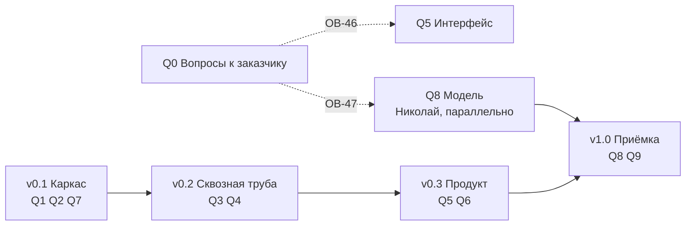

# План работ: десять блоков, четыре версии

Файл ведём по ходу работы, отметки ставим сразу. Перестроен 15.09.2026 из семи вех
в десять блоков — почему, написано ниже в разделе «Почему блоки, а не вехи».

## Как читать план

Работа нарезана по **двум измерениям**, и их нельзя путать.

**Блок отвечает на вопрос «что делаем».** Это часть системы: развёртывание, база,
расчёт, API, интерфейс, заявки, граница с ML, модель, приёмка. Граница блока совпадает
с каталогом в репозитории — открыв блок, видно, куда падает код. В трекере блок
становится эпиком, а каталог — полем «компонент».

**Версия отвечает на вопрос «когда».** Это временной срез: что должно работать
к концу каждого. В трекере версия становится Fix Version или спринтом.

Одна задача принадлежит ровно одному блоку и ровно одной версии. Раньше эти два
измерения лежали в одном списке — отсюда и брались вехи вроде «Фундамент» (это время)
рядом с «Три экрана» (это часть системы).

**У каждого блока две части, и путать их нельзя.** «Задачи» — работа, которую кто-то
делает и которая занимает время. «Готовность» — условия, при которых блок считается
закрытым; их никто не «делает», они либо выполняются, либо нет. Проверка вроде «экраны
открываются в Яндекс.Браузере» — это готовность, а не задача: на доске она висела бы
неделями в статусе «в работе», хотя работы там нет.

**Задачи.** В колонке «Что появляется» стоит конкретный артефакт: путь к файлу, имя
таблицы, метод API или элемент экрана. Формулировок вида «проработать» и «обеспечить»
в этой колонке нет: если из задачи не рождается предмет, который можно открыть, задача
описана неверно и её надо переписать.

**Артефакты** — пять типов, и у каждого свой признак готовности:

| Тип | Признак готовности |
|---|---|
| Код | Лежит в репозитории, проходит свою самопроверку |
| Схема БД | Нумерованная миграция в `db/migrations/`, накатывается на пустую базу |
| Контракт | Файл в `contracts/`, есть пример запроса, пример проходит валидацию |
| Документ | Файл `.md` в `docs/`, содержит числа и дату замера, а не намерения |
| Элемент интерфейса | Виден в браузере, к нему ведёт клик из описанного места |

**Знаки состояния:** `☐` не начата, `⏳` в работе, `✓` закрыта, `❌` провалена,
`✱` развилка пройдена и вариант выбран, `❗` то, что выбранным вариантом не закрывается.
Зачёркнутая задача отменена, причина написана рядом.

## Почему блоки, а не вехи

Прежние семь вех смешивали два разных вопроса. «Фундамент» и «Приёмка» — это время.
«Три экрана» и «Модуль заявок» — это части системы. Пока план читает человек, он держит
связь в голове; на доске задач такой список рассыпается.

Три причины перестроить:

1. **Переключение контекста — главная цена команды из двух человек.** Из 73 задач
   67 на Мирославе. При разрезе по времени «написать загрузчик» и «нарисовать дашборд»
   лежат в одном эпике, потому что делаются на одной неделе. При разрезе по блокам
   в эпике «Данные» лежит всё про данные, и это то, чем занимаешься в один заход.
2. **Блок переживает сдвиг срока, веха — нет.** Веха «Три экрана» при переносе теряет
   смысл; блок «Интерфейс» остаётся собой.
3. **Требования ТЗ перестают теряться.** Двадцать три работы, добавленные ТЗ
   от 11.09.2026, полгода жили отдельным списком в конце файла с пометкой «перенести
   в тело вех, когда Слава утвердит порядок». Теперь они внутри блоков, каждая со своей
   строкой приёмки.

**Что при этом потеряно и чем возмещено.** Прежний план задавал порядок работ: сначала
API, потом экраны, потому что иначе экраны будут читать выдуманные данные. В блоках
этот порядок не виден. Он выражен двумя способами: версиями (таблица ниже) и явными
зависимостями в колонке задачи.

## Десять блоков

| Блок | Каталог | Задач | Готовность | Состояние |
|---|---|---|---|---|
| `Q0` Вопросы к заказчику | — | 6 | 3 | ⏳ три блокирующих, идёт параллельно всему |
| `Q1` Развёртывание и эксплуатация | `deploy/` | 7 | 5 | ☐ |
| `Q2` Данные: загрузка, справочники, разведка | `db/`, `ingest/`, `archive/` | 10 | 5 | ⏳ разведка закрыта, загрузка не начата |
| `Q3` Расчётное ядро | `worker/` | 6 | 5 | ☐ |
| `Q4` REST API и доступ | `api/`, `auth/` | 8 | 6 | ☐ |
| `Q5` Интерфейс | `frontend/` | 10 | 6 | ☐ |
| `Q6` Модуль заявок | `domain/`, `screens/orders/` | 9 | 5 | ☐ |
| `Q7` Граница с ML и объяснимость | `contracts/`, `mlclient/` | 10 | 4 | ☐ |
| `Q8` Модель | репозиторий Николая | 1 | 4 | ☐ идёт параллельно с `v0.1` |
| `Q9` Приёмка и поставка | `docs/`, `delivery/` | 6 | 6 | ☐ |

**Семьдесят три задачи и сорок девять условий готовности.** Задач стало меньше
на девятнадцать, и ни одна работа при этом не пропала — вот куда они делись:

| Что было | Куда ушло |
|---|---|
| проверки: браузеры, замер расчёта, восстановление из копии, нагрузка, вес JS | в «Готовность» своих блоков |
| две задачи про загрузчик — прототип в `code/` и продукт в `ingest/` | одна: прототип переезжает в продукт |
| две задачи, писавшие в один `docs/data-inventory.md` | одна |
| шесть закрытых задач разведки | одна закрытая, с результатом и ссылкой на `docs/day-one.md` |
| пять методов API по задаче на каждый | одна: методы чтения однотипны |
| пары «две стороны одного»: ссылки в API, переходы на экране, сборка и отдача текста | по одной задаче на пару |
| профиль замера фронта и протокол замера | одна |

Семьдесят три задачи: **67 на Мирославе, 5 совместных, 1 на Николае.**

**Последнее число не ошибка и не перекос, а граница команды.** Работа Николая стоит
одной задачей потому, что за контрактом его кухня: мы не ставим ему задачи и не считаем
его часы в своих сроках. Наше понимание его работы лежит в блоке `Q8` описанием —
как предложение с числами, которое он волен не принять.

Из этого следуют две вещи, важные при любом решении о сроках.

**Резать надо из блоков Мирославы.** У Николая резать нечего: его единственная задача
закрывает строки М-18, М-19 и М-20, то есть саму постановку заказчика.

**Его работа не ждёт нашей.** Задачи в `Q1`…`Q7` сцеплены последовательно: база перед
расчётом, API перед экранами. Николаю нужны только выгрузка и контракт — `Q7.1`
и `Q7.2`, две задачи первого дня. Дальше он идёт параллельно, и блок `Q8` нашими
воротами не связан.

## Четыре версии

| Версия | Что работает к концу | Блоки |
|---|---|---|
| **v0.1 Каркас** | стенд поднимается на чистой машине, база принимает выгрузку, контракт описан, заглушка модели отвечает | `Q1`, `Q2`, `Q7` частично |
| **v0.2 Сквозная труба** | расчёт проходит восемь стадий с заглушкой, API отвечает по контракту и закрыт ролями | `Q3`, `Q4` |
| **v0.3 Продукт** | три экрана, заявки порождаются автоматически | `Q5`, `Q6` |
| **v1.0 Приёмка** | настоящая модель, четыре метрики, продуктивный объём, документы | `Q8`, `Q9`, остаток `Q7` |

## Правило ворот

**Версия закрыта, когда выполнены условия готовности её блоков, а не когда кончился код.** Пока тесты версии
не прошли, следующую не начинаем. Исключений два: блок `Q8` (работа Николая) идёт
параллельно с `v0.1` и нашими воротами не связан, и блок `Q0` (вопросы к заказчику)
не закрывается своими силами вовсе.

**Порядок внутри версии задают зависимости, а не номера задач.** Главная из них:
`Q4` перед `Q5` — экраны читают API, и если писать их раньше, они будут читать
выдуманные данные, а переделывать придётся дважды.

---

# Q0. Вопросы к заказчику

**Каталог:** —

**Цель.** Чтобы ни одна работа не встала молча. Каждый вопрос, от ответа на который зависит чужая
работа, живёт здесь отдельной строкой — с адресатом и с тем, что встанет без ответа.

## Задачи

| № | Задача | Что появляется | Кто |
|---|---|---|---|
| 0.1 | ✓ **сделано 15.09.2026.** Собрать таблицу «префикс тега → предполагаемый объект» на все 32 строки, чтобы заказчику осталось подтвердить или поправить, а не разбираться с нуля. Счёт по основаниям: **доказано 3 строки** (847 = Кси 5327; 885 и 890 = Дзета), **выведено 4** по порядку ид и дат рождения площадок (914 и 915 = Мю 3828; 1044 и 1051 = Гамма 7), у каждой словами стоит «проверить по данным нечем», **неизвестно 25**. Топонимы из названий каналов проставлены у 13 префиксов | `analysis/prefix_to_object.md` | Мирослава |
| 0.2 | **ОВ-46, блокирующий.** Отправить заказчику таблицу 0.1 и попросить подтвердить колонку «предполагаемый объект» | письмо; ответ ложится в `analysis/prefix_to_object.md` колонкой «подтверждено заказчиком» | Мирослава |
| 0.3 | **ОВ-47, блокирующий.** Спросить, согласен ли заказчик считать отказом эпизод `Неисправен` длиннее часа, и есть ли у него журнал ОДС или система учёта заявок, по которым это определение можно сверить | письмо; ответ правит `docs/for-ml-team.md` разд. 1 и 5 | Мирослава |
| 0.4 | **Достижимость метрик, блокирующий с 15.09.2026.** Показать заказчику числа до испытаний: у 41 % отказов нет ни одной записи своего канала в окне от 8 суток до 24 часов перед событием, у датчиков дыма таких 60 %. Потолок полноты при оракуле — 0,59 по парку и **0,40 по дыму при требовании 0,5**. Точность ни одного из одиннадцати правил не выше 0,040 при требовании 0,7. Предложить на выбор: пересмотреть горизонт, разделить требования по типам оборудования, или дать данные с бóльшей глубиной записи | письмо с таблицей из `docs/for-ml-team.md` разд. 10; ответ правит М-18, М-19, М-20 в `docs/acceptance-test.md` | Мирослава |
| 0.5 | **Ф-81.** Спросить, чем заменить геометрию в GeoJSON и WKT, которой требует ТЗ разд. 7: координат в обезличенной выгрузке нет. Три варианта — дать геометрию коллекторов, дать смещённую, снять требование | письмо; ответ правит работу 4.3 и строку Ф-81 | Мирослава |
| 0.6 | ~~Сообщить заказчику, что его обезличивание половинчатое~~ **решено 15.09.2026: не сообщаем.** В названиях каналов остались живые московские топонимы, и это единственный уцелевший мостик между двумя справочниками — обоими нашими якорями мы обязаны ему. Пользуемся внутри, наружу не выносим. Работа превращается в правило: на приёмке, в презентации, в интерфейсе и в письмах объект называется так, как его назвал заказчик — «объект Кси», а не «Коммунарка» | правило записано в `docs/for-ml-team.md` разд. 12; колонка топонимов в `analysis/prefix_to_object.md` помечена внутренней | Мирослава |

## Готовность

Проверяется перед закрытием блока. Это не задачи — их никто не «делает»,
они либо выполняются, либо нет.

- ☐ Все пять писем отправлены, у каждого стоит дата отправки.
- ☐ По каждому вопросу записан ответ или дата, когда идём за ним повторно.
- ☐ Ни одна задача из `Q5` и `Q8` не начата раньше, чем получен ответ на её блокер, либо решение работать без ответа принято явно и записано здесь.

---

# Q1. Развёртывание и эксплуатация

**Каталог:** `deploy/`

**Цель.** Система поднимается на чистой машине по инструкции, переживает перезапуск, держит
двадцать пользователей и восстанавливается из копии за четыре часа.

## Задачи

| № | Задача | Что появляется | Кто |
|---|---|---|---|
| 1.1 | Завести репозиторий по структуре `docs/HLD.md` разд. 2 | Дерево папок, `deploy/docker-compose.yml`, `deploy/.env.example`, `deploy/nginx/nginx.conf` | Мирослава |
| 1.2 | Закрыть стенд TLS не ниже 1.2 | в `deploy/nginx/nginx.conf` строки `ssl_protocols TLSv1.2 TLSv1.3;` и набор шифров без RC4 и 3DES · приёмка: НФ-75 | Мирослава |
| 1.3 | Настроить резервное копирование по расписанию и написать порядок восстановления | `deploy/backup.sh`, таблица `ref.backup_log`, `docs/restore.md` · приёмка: НФ-39, НФ-78 | Мирослава |
| 1.4 | Написать нагрузочный сценарий на 20 одновременных пользователей | `deploy/k6/20-users.js` · приёмка: НФ-74 | Мирослава |
| 1.5 | Развернуть стенд с полным объёмом данных за 12 лет | Работающий стенд и раздел «Стенд» в `docs/deploy.md`: железо, версии, объём базы | Мирослава |
| 1.6 | Написать инструкцию развёртывания | `docs/deploy.md` | Мирослава |
| 1.7 | Собрать перечень всех библиотек с лицензиями. Собирается **командой, а не руками**: `pip-licenses` по наборам `api` и `worker`, `npm ls` по фронту, плюс перечень от Николая по образу `ml` — его репозиторий мы не видим, а отвечаем за приёмку мы. **Проверять три места, а не одно:** поле лицензии на PyPI, список классификаторов и файл `LICENSE` в репозитории. У `scikit-survival` лицензия `GPL-3.0-or-later` стоит в поле, а классификаторы пусты — автоматическая проверка такую библиотеку пропустит (`docs/HLD.md` разд. 7.3) | `docs/libraries.md`: пакет, версия, лицензия, набор. Четыре набора — `api`, `worker`, `nginx`, фронт · приёмка: НФ-82 | Мирослава |

## Готовность

Проверяется перед закрытием блока. Это не задачи — их никто не «делает»,
они либо выполняются, либо нет.

- ☐ Стенд поднят на чистой машине **по инструкции, а не по памяти**, и человек, который её проверял, — не тот, кто писал.
- ☐ TLS: `nmap --script ssl-enum-ciphers` не показывает ни одного протокола ниже 1.2 и ни одного шифра из RC4 и 3DES.
- ☐ Восстановление из вчерашней копии прогнано с секундомером и уложилось в 4 часа — это `pg_restore`, а не перезапуск контейнера.
- ☐ Нагрузка: 20 сессий по 5 минут, отклик по 95-му перцентилю не хуже 2 секунд, ни одного кода 5xx.
- ☐ В `docs/libraries.md` ни одной GPL, LGPL или AGPL в образах `api`, `worker`, `nginx`.

---

# Q2. Данные: загрузка, справочники, разведка

**Каталог:** `db/`, `backend/app/ingest/`, `backend/app/archive/`

**Цель.** База принимает выгрузку заказчика целиком и не врёт о том, что приняла. Всё, что мы
знаем о данных, посчитано и записано числами.

## Задачи

| № | Задача | Что появляется | Кто |
|---|---|---|---|
| 2.1 | Перевести **пять** схем из `code/` в нумерованные миграции: `assets`, `geo`, `permits`, `events`, `xref`. Порядок обязателен, проверка — `python3 code/check_schema.py` | `db/migrations/001_events.sql` … `005_xref.sql` | Мирослава |
| 2.2 | Залить готовые справочники: нормативы ТО и виды работ — они уже есть файлами, работа механическая | `db/seed/lifetimes.sql` из `code/reglament_lifetimes.json`, `db/seed/work_types.sql` из `code/work_types.json` | Мирослава |
| 2.3 | **Собрать уставки заново — это отдельная работа на дни, а не пункт списка.** Схему таблицы берём из `code/setpoints_example.json`, а **числа из него брать нельзя**: это уставки Ново-Иркутской ТЭЦ, см. поле `_about` в файле. Пороги вычитываем из Регламента (206 страниц) и достаём из самих данных: в журнале встречаются «В норме от +3 до +40», «Температура ниже 3ºC», «Температура выше 40ºC». Готовность — каждый порог в файле имеет источник: пункт Регламента или строка журнала | `db/seed/setpoints.sql` | Мирослава |
| 2.4 | Довести загрузчик до продуктивного: шесть реальных колонок, оба написания булева (`f`/`t` и `false`/`true`), staging весь в `text`, повторный заголовок в теле файла уходит в отчёт о качестве, а не роняет `COPY`. Прототип `code/load_smvu.py` переезжает в продукт | `backend/app/ingest/smvu_csv.py` · приёмка: Ф-76, Ф-77 | Мирослава |
| 2.5 | Залить справочники каналов и объектов до журнала | миграция с таблицами `smvu.channel` (11 494 строки) и `smvu.object_tree` (95 строк), загрузка обоих справочников до журнала · приёмка: Ф-77, Ф-78 | Мирослава |
| 2.6 | Забирать реестр оборудования автоматически | `backend/app/ingest/load_equipment.py` читает реестр по адресу из `deploy/.env`, пишет в `asset.equipment`, строку прогона — в `load.batch` · приёмка: Ф-84 | Мирослава |
| 2.7 | Описать, что реально прислал заказчик: файлы, колонки, периоды, число строк замером, найденные дыры | `docs/data-inventory.md`, включая раздел «Объём выгрузки»: таблица «год → строк → байт» по восьми файлам · приёмка: НФ-33, ОВ-01 | Мирослава |
| 2.8 | Разобрать тег на участок | `code/tag_to_section.py` с самопроверкой: раскладывает `15-11.1.131.2.` на префикс и сегменты, отчёт «по скольким из 11 494 каналов участок определён» · приёмка: Ф-79, ОВ-45 | Мирослава |
| 2.9 | ✓ **закрыта 15.09.2026. Разведка выгрузки: можно ли вообще прогнозировать.** Шесть вопросов вехи, три ответа отрицательные, и это её результат. Целевая переменная найдена — эпизод `Неисправен` длиннее часа, 10 416 за 7,5 лет. Частота событий замерена — 313 546 016 строк, вилка 18–90 млн не подтвердилась. DuckDB нужна. Критерий `k` не считается: нет наработок и дат ввода. Горизонт 24 часа правилами не берётся: потолок полноты 0,59 по парку и 0,40 по дыму. Отдельный `docs/data-research.md` не заводим — замеры лежат там, где принимаются решения | `docs/day-one.md` 12 пунктов с числами; `analysis/` восемь счётных скриптов; `docs/for-ml-team.md` разд. 10 | Мирослава |
| 2.10 | Выбрать направления прогноза из четырёх названных в постановке и подписать протокол | `docs/protocol-directions.md`: дата, направления поимённо, обоснование числами из 2.1 и 2.3, две подписи | Мирослава и Николай |

## Готовность

Проверяется перед закрытием блока. Это не задачи — их никто не «делает»,
они либо выполняются, либо нет.

- ☐ Заливка всех восьми файлов прошла до конца: `SELECT count(*) FROM smvu.event` равно 313 546 016, отброшенных строк ноль кроме одной — повторного заголовка в `ext-journal-2025.csv`.
- ☐ Отчёт о качестве загрузки называет число отброшенных строк и причину по каждой; молча не теряется ничего.
- ☐ Справочники залиты **до** журнала: 12 627 каналов и 95 объектов, внешние ключи журнала не отвергают ни одной строки.
- ☐ Разбор тега покрывает парк: в отчёте `tag_to_section.py` названо, по скольким каналам из 12 627 участок определён.
- ☐ `docs/protocol-directions.md` подписан, дата в нём раньше первого прогона с настоящей моделью.

---

# Q3. Расчётное ядро

**Каталог:** `backend/app/worker/`

**Цель.** Расчёт проходит восемь стадий, укладывается в пять минут на продуктивном объёме
и не запускается дважды.

## Задачи

| № | Задача | Что появляется | Кто |
|---|---|---|---|
| 3.1 | Хранилище результатов расчёта | Миграция `db/migrations/005_pred.sql`: таблица `pred.forecast` (`forecast_id`, `section_id`, `direction`, `risk`, `computed_at`, `horizon_h`, `run_id`) и `pred.run_log` (`run_id`, стадия, длительность, итог) | Мирослава |
| 3.2 | Восемь стадий расчёта по `docs/HLD.md` разд. 8 | `backend/app/worker/run.py` | Мирослава |
| 3.3 | Сборка вектора признаков по `contracts/features.v1.yaml` — самая дорогая стадия, 20 с из 41 | `backend/app/worker/features.py` | Мирослава |
| 3.4 | Планировщик с блокировкой, чтобы два экземпляра не считали одно и то же | `backend/app/worker/scheduler.py` с `pg_try_advisory_lock(48217)` | Мирослава |
| 3.5 | Забирать метеоданные и добавить шесть признаков погоды | схема `ext` и таблица `ext.weather_hourly`, задача планировщика в :00, шесть признаков в `contracts/features.v2.yaml` · приёмка: Ф-85, Ф-86 | Мирослава |
| 3.6 | Принимать поток показаний пачками до 5000 строк | `POST /api/v1/ingest/readings`, до 5000 строк в запросе, путь до экрана не дольше 5 секунд · приёмка: Ф-82, НФ-73 | Мирослава |

## Готовность

Проверяется перед закрытием блока. Это не задачи — их никто не «делает»,
они либо выполняются, либо нет.

- ☐ Один прогон проходит все восемь стадий и пишет в `pred.run_log` строку на каждую с её длительностью и итогом `ok`.
- ☐ Два экземпляра планировщика, запущенные одновременно, считают по одному: второй пишет «занято» и выходит кодом 0.
- ☐ **Время полного расчёта по всем объектам меньше 300 секунд**, три прогона подряд, худший результат идёт в протокол. Замер на стенде с полной выгрузкой, не на ноутбуке (`docs/load-test.md`) · приёмка: М-21, НФ-72.
- ☐ Задержка потока: от записи, отданной СМВУ, до её видимости расчёту не больше 300 секунд · приёмка: НФ-73.
- ☐ Недоступная модель не роняет систему: расчёт падает с понятной записью в `pred.run_log`, API продолжает отдавать прошлый результат.

---

# Q4. REST API и доступ

**Каталог:** `backend/app/api/`, `backend/app/auth/`

**Цель.** Девять методов отвечают по контракту, закрыты ролями и пишут, кто что запросил.

## Задачи

| № | Задача | Что появляется | Кто |
|---|---|---|---|
| 4.1 | Сделать проверку живости с номером применённой миграции | `GET /health` в `backend/app/api/health.py` | Мирослава |
| 4.2 | Пять методов чтения: текущие риски объектов, прогнозы за период, один прогноз, карточка объекта, заявки. Заявки до `Q6` отдают пустой список и код 200 | `GET /api/risks`, `/api/forecasts`, `/api/forecasts/{id}`, `/api/objects/{section_id}`, `/api/orders` · приёмка: М-15, М-16 | Мирослава |
| 4.3 | Описание API и набор curl-примеров: по одному файлу на метод, примеры совпадают с фактическими ответами | `GET /docs` и `/openapi.json` (OpenAPI от FastAPI); `contracts/examples/api/*.sh` · приёмка: М-17 | Мирослава |
| 4.4 | Сделать вход через службу каталогов | `backend/app/auth/ldap.py`, simple bind по `LDAP_URI` и `LDAP_BASE_DN`; при недоступном каталоге вход по локальной записи · приёмка: НФ-76 | Мирослава |
| 4.5 | Завести ролевую модель на четыре роли | миграция с `ref.app_user`, `ref.role`, `ref.permission`, `ref.role_permission`; сид `db/seed/rbac.sql` на четыре роли: диспетчер, аналитик, инженер, администратор; зависимость `require(permission_code)` на каждом методе · приёмка: Ф-66, НФ-43, НФ-44 | Мирослава |
| 4.6 | Завести журнал действий пользователей | миграция с таблицей `audit.user_action`, прослойка на каждый запрос кроме проверки живости, метод `GET /api/audit` только администратору · приёмка: НФ-77 | Мирослава |
| 4.7 | Отдавать геоданные в GeoJSON и WKT | `?format=geojson` через `ST_AsGeoJSON` и `?format=wkt` через `ST_AsText`, примеры в `contracts/examples/` · приёмка: Ф-81 | Мирослава |
| 4.8 | Отдавать XML на трёх методах | `?format=xml` на трёх методах, сериализатор на `xml.etree.ElementTree`, схема `contracts/risks.v1.xsd` · приёмка: Ф-80 | Мирослава |

## Готовность

Проверяется перед закрытием блока. Это не задачи — их никто не «делает»,
они либо выполняются, либо нет.

- ☐ Все методы отвечают `200` и телом, проходящим валидацию по схеме из `/openapi.json`.
- ☐ Пустой результат — это `200` и пустой список, а не `404` и не `500`.
- ☐ Примеры в `/docs` совпадают с фактическими ответами дословно.
- ☐ Каждый метод закрыт разрешением: запрос без роли получает `403`, а не данные.
- ☐ В `audit.user_action` попал каждый запрос кроме проверки живости; `GET /api/audit` доступен только администратору.
- ☐ Замена адреса модели в `deploy/.env` на контейнер Николая не требует правок нашего кода.

---

# Q5. Интерфейс

**Каталог:** `frontend/`

**Цель.** Диспетчер открывает браузер и видит дашборд рисков, схему коллектора и журнал прогнозов.
Отсутствие любого из трёх означает, что продукт не сдан.

**Работа «растровая подложка карты» отменена 15.09.2026** вместе с решением по экрану `5.3`: схеме коллектора подложка не нужна, там ось пикетов, а не местность. Возвращается в план, если заказчик отдаст геометрию по ОВ-53 — тогда же возвращаются 284 МБ тайлов в образ.

## Задачи

| № | Задача | Что появляется | Кто |
|---|---|---|---|
| 5.1 | Каркас приложения: маршруты, меню, подсветка текущего раздела | `frontend/src/App.tsx`, `frontend/src/components/Nav.tsx` | Мирослава |
| 5.2 | Дашборд рисков по макету `dashboard/dashboard-mockup.html` | `frontend/src/screens/dashboard/` — плитки показателей, список объектов с уровнем риска | Мирослава |
| 5.3 | ✱ **решено Мирославой 15.09.2026: делаем схему коллектора, а не карту Москвы.** Причина: координат в выгрузке нет — пикет говорит, сколько метров от начала коллектора, но не говорит широту и долготу (ОВ-53), — и канал не связан с объектом (ОВ-46, связано 12,7 % каналов). Экран: горизонтальная ось пикетов, метки на ней по расстоянию, уровень риска виден цветом и формой метки. Обычный SVG, ни Leaflet, ни подложка не нужны. **Решение обратимое, и это его главное свойство.** Пикет — это линейная привязка, полноценная ГИС-модель: колонки `picket_from` и `picket_to` в `geo.network_edge` уже стоят рядом с геометрией, а не вместо неё. Когда заказчик отдаст линии коллекторов, пикеты станут координатами одним вызовом `ST_LineInterpolatePoint(geom, пикет / длина)`, без миграции данных. PostGIS в сборке остаётся. **Зависит от работ 0.2 и 0.5:** без ответа на ОВ-46 метки некуда ставить, а строка Ф-81 схемой по пикетам не сдаётся | `frontend/src/screens/map/` | Мирослава |
| 5.4 | Журнал прогнозов с фильтром по дате, объекту и направлению и сортировкой | `frontend/src/screens/log/` | Мирослава |
| 5.5 | Карточка объекта, общая для дашборда и карты | `frontend/src/components/ObjectCard.tsx` — открывается кликом из обоих мест | Мирослава |
| 5.6 | Палитра в виде переменных CSS по `dashboard/color-palette.md` | `frontend/src/styles/tokens.css` | Мирослава |
| 5.7 | Сделать панель уведомлений поверх трёх экранов | таблица `pred.alert`, поток `GET /api/alerts/stream`, компонент полосы поверх трёх экранов с кнопкой «Принял», метод `POST /api/notifications/{id}/ack` · приёмка: Ф-88, Ф-90 | Мирослава |
| 5.8 | Завести справочник решений диспетчера | `db/seed/decisions.sql` на четыре кода из ТЗ: выезд бригады, направление бригады на проверку, мониторинг ситуации, ложное срабатывание; колонка `pred.feedback.decision_code`; в диалоге вердикта поле обязательно · приёмка: Ф-92 | Мирослава |
| 5.9 | Показать журнал технологических событий по форме Приложения 2 | таблица в карточке объекта по форме Приложения 2: пять колонок, фильтр и сортировка по каждой, диапазон дат, переключатель автообновления · приёмка: Ф-89 | Мирослава |
| 5.10 | Замерить фронт на профиле «АРМ-ОДС»: слабый процессор, медленная сеть | `frontend/lh-arm.js`, `frontend/lighthouserc.json` и `docs/frontend-budget.md`: вес сжатого JS, время первого экрана, дата замера, на каком железе | Мирослава |

## Готовность

Проверяется перед закрытием блока. Это не задачи — их никто не «делает»,
они либо выполняются, либо нет.

- ☐ Три экрана открываются и работают **в Chrome и в Яндекс.Браузере**, версии обоих записаны в протокол · приёмка: НФ-81.
- ☐ Сжатый JS не больше 153 600 байт: `gzip -c frontend/dist/assets/*.js | wc -c`.
- ☐ Клик по объекту на дашборде и клик по метке на схеме открывают одну и ту же карточку `ObjectCard` с одинаковым содержимым.
- ☐ Уровень риска различим по самой метке — цветом **и** формой, а не только цветом · приёмка: НФ-48.
- ☐ Браузер не делает ни одного запроса за пределы контура: ни к CDN, ни к Google Fonts · приёмка: НФ-32.
- ☐ Навигация замкнута: дашборд → схема → журнал → дашборд, текущий раздел подсвечен.

---

# Q6. Модуль заявок

**Каталог:** `backend/app/domain/`, `frontend/src/screens/orders/`

**Цель.** Прогноз сам порождает заявку на превентивное обслуживание, и из заявки видно, какой
именно прогноз её породил.

## Задачи

| № | Задача | Что появляется | Кто |
|---|---|---|---|
| 6.1 | Связать заявку с прогнозом. Таблица `maint.notification` уже описана в `code/schema_assets.sql`, строка 600, и в ней уже есть `source_system`, `source_key`, `status`, `priority_id` — новую таблицу не заводим | Миграция `db/migrations/006_orders.sql`: в `maint.notification` добавляются колонки `forecast_id` (внешний ключ на `pred.forecast`, обязателен при `source_system='forecast'`) и `due_at` (срок выполнения). Автозаявка пишется как `notification_kind='WR'`, `source_system='forecast'` | Мирослава |
| 6.2 | Справочник видов работ, чтобы вид работ выбирался, а не вписывался текстом | `db/seed/work_types.sql` из `code/work_types.json` | Мирослава |
| 6.3 | Правило порождения заявки: при каком риске и какой критичности объекта, какой вид работ, какой срок | `backend/app/domain/order_rules.py` и документ `docs/order-rules.md` с порогами и примером расчёта на одном объекте | Мирослава |
| 6.4 | Защита от повторов: объект с устойчиво высоким риском не должен плодить заявки каждый прогон | Ограничение уникальности в миграции 5.1 плюс ветка «обновить существующую» в `order_rules.py` | Мирослава |
| 6.5 | Жизненный цикл заявки: разрешённые переходы статусов | `backend/app/domain/state_machine.py` на основе `code/toir_state_machine.py` | Мирослава |
| 6.6 | Двусторонняя связь заявки и прогноза в API: заявка отдаёт `forecast_id`, прогноз отдаёт массив `order_ids` | `GET /api/orders/{id}` и `GET /api/forecasts/{id}` · приёмка: М-12 | Мирослава |
| 6.7 | Двусторонний переход заявка ↔ прогноз на экране | Строка-ссылка «Прогноз от 14.09.2026 09:05» в карточке заявки и блок «Заявки по этому прогнозу» в карточке прогноза | Мирослава |
| 6.8 | Экран списка заявок с фильтром по статусу и сроку | `frontend/src/screens/orders/` | Мирослава |
| 6.9 | Читать статусы из системы учёта заявок | `backend/app/ingest/order_status.py`, только чтение, раз в 5 минут; колонки `maint.notification.external_status` и `external_status_at`; строка «Статус во внешней системе» в карточке заявки · приёмка: Ф-87, НФ-69 | Мирослава |

## Готовность

Проверяется перед закрытием блока. Это не задачи — их никто не «делает»,
они либо выполняются, либо нет.

- ☐ Заявка появляется **сама**: объект с риском выше порога, расчёт запущен, интерфейс не тронут — заявка в списке, и первым шагом в её истории стоит расчёт, а не человек · приёмка: М-10.
- ☐ В автозаявке заполнены все семь полей: объект, участок и район, вид работ из справочника, приоритет, «устранить не позже», обоснование со ссылкой на прогноз, автор — расчёт. Ноль пустых ячеек на выгрузке из 50 заявок · приёмка: М-11, Ф-44.
- ☐ Заявка **превентивная**: плановый срок работ раньше прогнозируемого события · приёмка: М-13.
- ☐ Повторы не плодятся: объект с устойчиво высоким риском за сутки даёт одну заявку, а не по одной на каждый прогноз.
- ☐ Переход из заявки в прогноз и обратно приводит на ту же заявку, а не на список.

---

# Q7. Граница с ML и объяснимость

**Каталог:** `contracts/`, `backend/app/mlclient/`

**Цель.** Контракт описан так, что модель заменяется без правок нашего кода, а диспетчер видит
причину прогноза по-русски.

## Задачи

| № | Задача | Что появляется | Кто |
|---|---|---|---|
| 7.1 | Описать список признаков: имя, тип, единица измерения, окно агрегации, источник в базе | `contracts/features.v1.yaml` — 19 признаков из `docs/HLD.md` разд. 6.3 | Мирослава |
| 7.2 | Описать формат запроса и ответа `/predict` и приложить примеры, проверяемые без базы и без модели | `contracts/predict.v1.schema.json`; `contracts/examples/predict.request.json` и `predict.response.json` | Мирослава |
| 7.3 | Написать правила изменения контракта: кто открывает PR, кто согласует, как нумеруются версии | `contracts/README.md` | Мирослава |
| 7.4 | Поднять заглушку модели, отвечающую константой по контракту | `ml-stub/` — Dockerfile и один файл на FastAPI | Мирослава |
| 7.5 | Вызов модели по контракту с разбором ошибок и таймаутом | `backend/app/mlclient/client.py` | Мирослава |
| 7.6 | Вернуть вклады признаков вместе с прогнозом | Поле `contributions` в ответе `/predict`, новая версия `contracts/predict.v2.schema.json` | Николай и Мирослава |
| 7.7 | Хранить готовый текст объяснения рядом с прогнозом | Миграция `db/migrations/007_explain.sql`: колонка `pred.forecast.explanation_ru` типа `text` | Мирослава |
| 7.8 | Шаблоны фраз: по одной на каждый из 19 признаков | `db/seed/explain_templates.sql` — пары «признак → фраза», например `silent_sensor_share` → «три датчика из восьми молчат больше суток» | Мирослава |
| 7.9 | Собрать текст объяснения и отдать его наружу: три признака с наибольшим вкладом по модулю подставляются в шаблоны, текст пишется рядом с прогнозом и приходит в ответе API | `backend/app/domain/explain.py`; поле `explanation_ru` в `GET /api/objects/{section_id}` | Мирослава |
| 7.10 | Показать объяснение диспетчеру | Блок «Почему такой риск» в `ObjectCard.tsx`: три строки списком, под ними подпись «по данным на 14.09.2026 09:05» | Мирослава |

## Готовность

Проверяется перед закрытием блока. Это не задачи — их никто не «делает»,
они либо выполняются, либо нет.

- ☐ Контракт проверяется без базы и без модели: примеры из `contracts/examples/` проходят валидацию по схеме.
- ☐ Заглушка отвечает по контракту, и подмена её на образ Николая — это правка одной строки в `deploy/.env`.
- ☐ Объяснение читается вслух как фраза диспетчера, а не как список полей: три строки, каждая называет признак, его значение и направление вклада.
- ☐ Признак, которого нет в `contracts/features.v1.yaml`, не может попасть в объяснение — имена сверяются, а не совпадают случайно.

---

# Q8. Модель

**Каталог:** репозиторий Николая `moskollektor-ml/`

**Цель.** Заглушка заменяется обученной моделью, четыре числа из постановки берутся
на отложенной выборке.

**В этом блоке одна задача, и так задумано.** Граница команды проходит по контракту:
всё, что за ним, — кухня Николая. Мы не ставим ему задачи и не считаем его работу
в своих сроках. Дробить её на нашей доске значило бы делать вид, что мы ей управляем.

**Что нам нужно от него обязательно — три вещи, остальное на его усмотрение:**

1. **Контрольные числа сошлись** до того, как начнётся обучение. Блок 0
   в `docs/for-ml-team.md`: 313 546 016 строк, 12 627 каналов, 1 500 298 записей
   `Неисправен`, 10 416 эпизодов длиннее часа. Разошлось в разы — останавливаемся
   и разбираемся, а не учим модель на других данных.
2. **Выборка разрезана по времени**, а не случайно. Случайный разрез на временных
   данных даёт модели подглядеть будущее, и метрики выйдут завышенными.
3. **Метрики померены нашей методикой** — `evaluate_alerts()` из
   `code/predictive_metrics.py`, со склейкой в инциденты и отдельным прогоном
   для упреждения. Иначе его числа и наши не сравнятся, и на приёмке спорить будет
   не о чем и нечем.

## Задачи

| № | Задача | Что появляется | Кто |
|---|---|---|---|
| 8.1 | Заменить заглушку обученной моделью: обучение, инференс по контракту, отчёт. Состав работы Николай определяет сам — ниже наши предложения, не поручения | образ `ml` и `Dockerfile` в репозитории Николая; `docs/ml-training-report.md` | Николай |

## Что мы предлагаем — Николаю решать, что из этого брать

Собрано из `docs/for-ml-team.md` и замеров 15.09.2026. Это не список работ, а то,
что мы уже проверили и что может сэкономить ему время. Каждый пункт с числом,
чтобы можно было спорить по существу.

**По данным.**

- Обучающую выборку строить **без склейки в инциденты**. Склейка нужна только при
  замере качества; для обучения пачка из 75 каналов даёт 75 примеров, а не один.
- Осторожно с границей смены парка в апреле 2022: до и после — разные наборы каналов.
  Строить выборку через неё можно, но в отчёте это надо назвать.
- Проверочное окно — апрель–июнь 2026: 587 эпизодов на 347 каналах, после склейки
  166 инцидентов. Плюс 51 эпизод, не закрывшийся до конца данных.

**По признакам.** Из одиннадцати правил, которые мы прогнали, сигнал показали семь.
По убыванию полезности: отказ соседа по префиксу за 7 дней (полнота 0,375), число
`Неисправен` по префиксу за 7 дней — `bad7` (на уровне шлейфа даёт полноту 0,524),
дребезг самого канала за 7 дней, факт отказа этого канала за 30 дней, залипание
значения, доля `Неопределен`, отношение темпа записей к своей норме.

**По тому, что мы посчитали и в чём можем ошибаться.**

- **Потолок полноты при оракуле — 0,59 по парку и 0,40 по датчикам дыма** при
  требовании постановки 0,5. Причина: у 41 % отказов нет ни одной записи своего канала
  в окне от 8 суток до 24 часов перед событием, у дыма таких 60 %. Если модель покажет
  больше — значит мы считали не то, и это важно узнать.
- **Разные модели по типам датчика** могут дать больше, чем одна на весь парк: записи
  за неделю до отказа есть у 82 % отказов газа и фазы против 40 % у дыма. Одна модель
  будет тянуть дым вниз.
- **Порог отсечения** стоит показать кривой «порог → Precision, Recall», а не одним
  числом: нам надо видеть, чем заплачено за Precision 0,7.

**По инференсу.** Бюджет — 1,2 мс на объект. Ограничения приёмки: не более 5 минут
на весь парк (постановка) и не более 5 минут на один объект (ТЗ разд. 9). Замер
на железе стенда, не на ноутбуке.

**Чего мы не делали и не проверяли.** Обучаемую модель на этих признаках — все
одиннадцать наших правил пороговые, мы их писали нарочно примитивными, чтобы не
получилось круга: решать, стоит ли учить модель, с помощью модели. Комбинация
признаков моделью — единственное, что мы не закрыли, и это его работа.

## Где ещё живёт стык с моделью

Две работы, которые касаются нашего кода, стоят в наших блоках, а не здесь:
`Q7.7` — вклады признаков в ответе `/predict`, без них не собирается объяснение
прогноза; `Q9.6` — замер четырёх метрик нашей методикой. Обе совместные.

## Готовность

Проверяется перед закрытием блока. Это не задачи — их никто не «делает»,
они либо выполняются, либо нет.

- ☐ Контрольные числа из блока 0 `docs/for-ml-team.md` сошлись **до** обучения.
- ☐ Выборка разрезана по времени, а не случайно, и разрез описан в отчёте.
- ☐ Метрики померены нашей методикой — `evaluate_alerts()` со склейкой в инциденты и отдельным прогоном для упреждения.
- ☐ `docker pull ml:<тег>` воспроизводит тот же прогноз, что был на приёмке.

---

# Q9. Приёмка и поставка

**Каталог:** `docs/`, `delivery/`

**Цель.** Сто одна обязательная строка пройдена, документы собраны, версия зафиксирована.

## Задачи

| № | Задача | Что появляется | Кто |
|---|---|---|---|
| 9.1 | Замерить четыре метрики методикой проекта: Precision, Recall, горизонт, время расчёта. Со склейкой в инциденты и отдельным прогоном для упреждения | `docs/metrics-report.md`: значения, объём выборки, дата, матрица ошибок | Мирослава и Николай |
| 9.2 | Пройти часть 0 чек-листа — 21 строку | Отметки в `docs/acceptance-test.md`, часть 0 | Мирослава и Николай |
| 9.3 | Пройти части I и II — 27 строк | Отметки в `docs/acceptance-test.md`, части I и II | Мирослава и Николай |
| 9.4 | Написать четыре раздела документации, названные в ТЗ поимённо | `docs/install.md`, `docs/build.md`, `docs/architecture.md`, `docs/data-processing.md` — четыре раздела, которые ТЗ разд. 14 называет поимённо · приёмка: НФ-83, НФ-86 | Мирослава |
| 9.5 | Собрать презентацию и страницу сдачи с четырьмя ссылками | `delivery/presentation.pptx` и `.pdf`; `docs/delivery.md` с четырьмя ссылками: репозиторий, презентация, прототип, документация · приёмка: НФ-87, НФ-88 | Мирослава |
| 9.6 | Зафиксировать версию поставки | Тег `v1.0` в репозитории и в репозитории Николая | Мирослава |

## Готовность

Проверяется перед закрытием блока. Это не задачи — их никто не «делает»,
они либо выполняются, либо нет.

- ☐ **Precision строго больше 0,700 и Recall строго больше 0,500** на отложенной выборке, инциденты склеены, матрица ошибок приложена · приёмка: М-18, М-19.
- ☐ **Медиана упреждения не ниже 24 часов при доле поздних не выше 20 %**, прогон с нулевым горизонтом, гистограмма приложена · приёмка: М-20.
- ☐ Все 21 строка части 0 отмечены пройденными; ни одной дыры.
- ☐ Части I и II отмечены; по каждой невыполненной строке названа причина и решение заказчика.
- ☐ Четыре ссылки на площадке работают: репозиторий, презентация, прототип, документация · приёмка: НФ-87, НФ-88.
- ☐ Тег `v1.0` стоит в обоих репозиториях и указывает на то, что показывали на приёмке.

---

# Все артефакты одним списком

Двадцать девять новых файлов, семь миграций, девять методов API.

## Контракты

| Файл | Блок |
|---|---|
| `contracts/features.v1.yaml` | `Q7` |
| `contracts/features.v2.yaml` (добавляет шесть признаков погоды) | `Q3` |
| `contracts/predict.v1.schema.json` | `Q7` |
| `contracts/predict.v2.schema.json` (добавляет вклады признаков) | `Q7` |
| `contracts/examples/predict.request.json`, `predict.response.json` | `Q7` |
| `contracts/examples/api/*.sh` | `Q4` |
| `contracts/risks.v1.xsd` | `Q4` |
| `contracts/README.md` | `Q7` |

## Миграции базы

| Файл | Что добавляет | Блок |
|---|---|---|
| `001_events.sql` … `005_xref.sql` | пять схем из `code/` | `Q2` |
| `006_pred.sql` | `pred.forecast`, `pred.run_log` | `Q3` |
| `007_orders.sql` | `maint.notification`: колонки `forecast_id` и `due_at` | `Q6` |
| `008_rbac.sql` | `ref.app_user`, `ref.role`, `ref.permission`, `ref.role_permission` | `Q4` |
| `009_audit.sql` | `audit.user_action` | `Q4` |
| `010_weather.sql` | схема `ext`, таблица `ext.weather_hourly` | `Q3` |
| `011_explain.sql` | `pred.forecast.explanation_ru` | `Q7` |

## Методы API

| Метод | Блок |
|---|---|
| `GET /health` | `Q4` |
| `GET /api/risks` (+ `?format=xml`) | `Q4` |
| `GET /api/forecasts`, `GET /api/forecasts/{id}` | `Q4`, дополнен в `Q6` |
| `GET /api/objects/{section_id}` | `Q4`, дополнен в `Q7` |
| `GET /api/orders`, `GET /api/orders/{id}` | `Q4`, наполнен в `Q6` |
| `GET /api/geo/sections` (`?format=geojson|wkt`) | `Q4` |
| `POST /api/v1/ingest/readings` | `Q3` |
| `GET /api/alerts/stream`, `POST /api/notifications/{id}/ack` | `Q5` |
| `GET /api/audit` | `Q4` |
| `GET /docs`, `GET /openapi.json` | `Q4` |

## Документы

| Файл | Что в нём | Блок |
|---|---|---|
| `docs/data-inventory.md` | что реально прислал заказчик: файлы, колонки, периоды, дыры, объём замером | `Q2` |
| `docs/protocol-directions.md` | выбранные направления, дата, подписи | `Q2` |
| `docs/order-rules.md` | пороги порождения заявки и пример расчёта | `Q6` |
| `docs/ml-training-report.md` | алгоритм, признаки, гиперпараметры, метрики | `Q8` |
| `docs/metrics-report.md` | четыре числа приёмки, объём выборки, дата | `Q8` |
| `docs/frontend-budget.md` | вес сжатого JS, время первого экрана, железо | `Q5` |
| `docs/load-test.md` | три прогона расчёта, нагрузка 20 пользователей | `Q3`, `Q1` |
| `docs/libraries.md` | перечень всех библиотек с лицензиями по четырём наборам плюс образ Николая; собирается командой | `Q1` |
| `docs/restore.md` | восстановление из копии с секундомером | `Q1` |
| `docs/install.md`, `docs/build.md`, `docs/architecture.md`, `docs/data-processing.md` | четыре раздела, которые ТЗ разд. 14 называет поимённо | `Q9` |
| `docs/delivery.md` | четыре ссылки на сдачу | `Q9` |

---

# Что добавило ТЗ заказчика

ТЗ (`docs/tz-djkh.pdf`) пришло 11.09.2026, выгрузка — 09.09.2026. Двадцать три работы,
которые оно добавило, **больше не лежат отдельным списком** — 15.09.2026 они разнесены
по блокам, каждая со своей строкой приёмки. Ниже — только то, что из этого следует
для объёма.

**Обязательных строк приёмки стало 101 вместо 48.** Это главное изменение: часть I
выросла с 11 строк до 64. Отказаться нельзя ни от одной строки части 0 и ни от одной
строки части I — там лежат вещи, которые выглядят как инфраструктура, а на деле
являются требованием заказчика: TLS 1.2, вход через службу каталогов, ролевая модель,
журнал действий, резервное копирование, перечень библиотек, четыре ссылки на сдачу.

**Больше всего выросли блоки `Q4` и `Q1`.** В API добавились аутентификация, роли,
журнал действий и два формата выдачи; в развёртывание — TLS, резервное копирование
и нагрузочный прогон. Отложить аутентификацию «на потом» нельзя: экраны блока `Q5`
читают API, и если API станет закрытым после того, как фронт написан, фронт придётся
переписывать.

**Отдельно про раздел 7 ТЗ:** продукт без перечня библиотек и без четырёх ссылок
на площадке не принят вообще, как бы хорошо ни работал прогноз. Эти две работы стоят
час каждая, и забыть их в последний день — самый обидный способ не сдаться.

---

# Что в плане было неверным и исправлено

| Где | Что было не так | Когда исправлено |
|---|---|---|
| опорные документы | ТЗ в списке не было, а оно класса А наравне с постановкой | 15.09.2026 |
| «21 строка разложена по вехам без остатка» | строк обязательной приёмки 101, а не 48 | 15.09.2026 |
| перевод схем в миграции | «перевести **четыре** схемы из `code/`». Схем пять: `assets`, `geo`, `permits`, `events`, `xref` | 15.09.2026 |
| загрузчик | был написан под xlsx с колонками «тип события», «адрес», «результат проверки». Ни одной из трёх в выгрузке нет, файлы пришли в csv | 15.09.2026, `code/load_smvu.py` |
| тест закрытия фундамента | было `SELECT count(*) FROM ev.event`, схемы `ev` не существует. Таблица называется `smvu.event` | 15.09.2026 |
| «замерить реальную частоту событий СМВУ» | это частота показаний, а не событий: тревожных записей 0,79 % из 313 546 016 | 15.09.2026 |
| тест «Объём базы» | множитель 144 не нужен: пришли годовые файлы, объём померен по всем восьми | 15.09.2026 |
| критерий «вилка сузилась с 5 раз до полутора» | допускал галочку при любом исходе. Правильный критерий: названо фактическое число строк и сказано, попал ли факт в прежнюю вилку. Не попал — 313 млн против вилки 18–90 млн | 15.09.2026 |
| хранилище результатов расчёта | заводило `pred.forecast` и `pred.run_log`, но `pred.run`, `pred.forecast` и `pred.forecast_current` уже описаны в `code/schema_events.sql` | **открыто:** либо задача сводится к переносу готового, либо таблицы забыты в миграциях блока `Q2` |
| «закрывает весь блок приёмки» у API, интерфейса и заявок | ни один из трёх больше не полон: к API добавились форматы и поток, к интерфейсу — уведомления, к заявкам — внешние статусы | 15.09.2026 |
| перечень зависимостей | «по трём образам» — наборов четыре, плюс образ Николая | 15.09.2026 |
| тест «Восстановление» | «остановить базу на минуту, поднять обратно» проверяет перезапуск, а не восстановление. ТЗ разд. 11 требует восстановления из резервной копии за 4 часа — это другой тест, с `pg_restore` и секундомером | 15.09.2026 |

---

# Порядок отказа, если время кончается

Резать придётся: объём после ТЗ вырос примерно на треть, а сто процентов времени
остались ста процентами. Порядок отказа — снизу вверх.

1. **Часть III чек-листа целиком.** Рекомендации, на приёмке не проверяются.
2. **Экран списка заявок** (`Q6`). Заявки порождаются и видны через API; отдельный
   экран — удобство, а не требование части 0.
3. **Второе и третье направление прогноза.** Осторожно: постановка разрешает взять
   одно, а ТЗ разд. 6 требует сценарный анализ трёх типов — пожара, проникновения
   и подтопления. Два документа расходятся, и решать это надо со Славой и протоколом
   до испытаний, а не в последний день.
4. **Журнал технологических событий** (`Q5`). Строка Ф-89, часть I — резать только
   по согласованию с заказчиком.

**Отказываться нельзя** ни от одной из 21 строки части 0 и ни от одной строки части I.

---

---

# Что уже проверено и чем кончилось

Проверки, пройденные до 15.09.2026. **Крестики не стираем — они и есть результат работы:**
узнать на шестой день, что горизонт не берётся, дешевле, чем на приёмке. Остальные
проверки живут в разделах «Готовность» своих блоков.

| Что проверяли | Как | Критерий | Итог |
|---|---|---|---|
| Что проверяем | Как | Критерий | ✓ |
| Что проверяем | Как | Критерий | ✓ |
| Прогнозируемость | `python3 analysis/k_by_equipment.py` | По выбранному направлению `k ≥ 0,5` хотя бы на одном типе оборудования | ❌ **посчитано 15.09.2026: `k` отрицательный по всем шести типам** (от −0,344 у газового до −0,523 у датчика дыма). Наработка между эпизодами `Неисправен` не описывается Вейбуллом |
| Устойчивость `k` | колонка «число отказов» в той же таблице | Не меньше 10 отказов в выборке, иначе число случайно | ✓ событий хватает с запасом: от 45 у датчика температуры до 27 446 у вентилятора. Проблема не в размере выборки, а в том, что `k` отрицательный |
| Достижимость горизонта | `python3 analysis/pf_interval.py` | Хотя бы одно правило даёт медиану P-F ≥ 24 ч при доле пойманных эпизодов не ниже 0,5 | ❌ **замерено 15.09.2026 на одиннадцати правилах: не даёт, и это потолок данных, а не подбор порогов.** Выборка — 1 811 отказов на 759 каналах за 01.01.2025–30.06.2026. Лучшая полнота 0,375 у правила «отказ соседа по префиксу за 7 дней», куплена миллионом предупреждений (152 ложных на тысячу объекто-дней). Лучшая точность 0,040 у залипания значения — до 0,7 не дотягивает ничто **на порядок и больше**. Причина структурная: **у 41 % отказов нет ни одной записи своего канала в окне от 8 суток до 24 часов перед отказом**, у датчика дыма (46 % всех отказов) таких 60 %. Датчик дыма пишет только смену состояния и между сменами молчит неделями. **Потолок полноты при оракуле — 0,59 по парку и 0,40 по дыму.** Полные таблицы — `docs/for-ml-team.md` разд. 10 |
| Объём базы | ~~замер на месячной выгрузке, умноженный на 144~~ **множитель не нужен, пришли годовые файлы: замер по всем восьми** | ~~вилка сузилась с 5 раз до полутора~~ **критерий был написан неверно: он допускал галочку при любом исходе. Правильный: названо фактическое число строк, названо, по какому периоду считается оценка на будущее, и сказано, попал ли факт в прежнюю вилку.** Факт: 313 546 016 строк за 7,5 лет, оценка на будущее по 2025 году (55,5 млн в год), **в прежнюю вилку 18–90 млн факт не попал — он вне её** | ✓ 15.09.2026 |
| Что проверяем | Как | Критерий | ✓ |
| Что проверяем | Как | Критерий | ✓ |
| Что проверяем | Как | Критерий | ✓ |
| Что проверяем | Как | Критерий | ✓ |
| Что проверяем | Как | Критерий | ✓ |
| Что проверяем | Как | Критерий | ✓ |
| Что проверяем | Как | Критерий | ✓ |
| Часть 0 | пройти 21 строку | Ни одного ❌ | ☐ |
| Части I и II | пройти 27 строк | Ни одного ❌ | ☐ |
