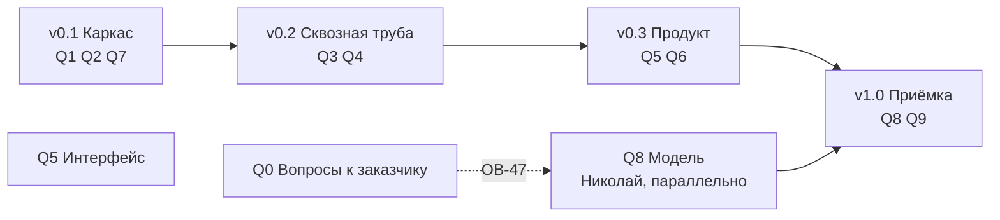

# План работ: десять блоков, четыре версии

Файл ведём по ходу работы, отметки ставим сразу. Перестроен 15.09.2026 из семи вех
в десять блоков — почему, написано ниже в разделе «Почему блоки, а не вехи».

## Как читать план

Работа нарезана по **двум измерениям**, и их нельзя путать.

**Блок отвечает на вопрос «что делаем».** Это часть системы: развёртывание, база,
расчёт, API, интерфейс, заявки, граница с ML, модель, приёмка. Граница блока совпадает
с каталогом в репозитории — открыв блок, видно, куда падает код. В трекере блок
становится эпиком, а каталог — полем «компонент».

**Версия отвечает на вопрос «когда».** Это временной срез: что должно работать
к концу каждого. В трекере версия становится Fix Version или спринтом.

Одна задача принадлежит ровно одному блоку и ровно одной версии. Раньше эти два
измерения лежали в одном списке — отсюда и брались вехи вроде «Фундамент» (это время)
рядом с «Три экрана» (это часть системы).

**У каждого блока две части, и путать их нельзя.** «Задачи» — работа, которую кто-то
делает и которая занимает время. «Готовность» — условия, при которых блок считается
закрытым; их никто не «делает», они либо выполняются, либо нет. Проверка вроде «экраны
открываются в Яндекс.Браузере» — это готовность, а не задача: на доске она висела бы
неделями в статусе «в работе», хотя работы там нет.

**Задачи.** В колонке «Что появляется» стоит конкретный артефакт: путь к файлу, имя
таблицы, метод API или элемент экрана. Формулировок вида «проработать» и «обеспечить»
в этой колонке нет: если из задачи не рождается предмет, который можно открыть, задача
описана неверно и её надо переписать.

**Артефакты** — пять типов, и у каждого свой признак готовности:

| Тип | Признак готовности |
|---|---|
| Код | Лежит в репозитории, проходит свою самопроверку |
| Схема БД | Нумерованная миграция в `db/migrations/`, накатывается на пустую базу |
| Контракт | Файл в `contracts/`, есть пример запроса, пример проходит валидацию |
| Документ | Файл `.md` в `docs/`, содержит числа и дату замера, а не намерения |
| Элемент интерфейса | Виден в браузере, к нему ведёт клик из описанного места |

**Знаки состояния:** `☐` не начата, `⏳` в работе, `✓` закрыта, `❌` провалена,
`✱` развилка пройдена и вариант выбран, `❗` то, что выбранным вариантом не закрывается.
Зачёркнутая задача отменена, причина написана рядом.

## Почему блоки, а не вехи

Прежние семь вех смешивали два разных вопроса. «Фундамент» и «Приёмка» — это время.
«Три экрана» и «Модуль заявок» — это части системы. Пока план читает человек, он держит
связь в голове; на доске задач такой список рассыпается.

Три причины перестроить:

1. **Переключение контекста — главная цена команды из двух человек.** Из 71 задачи
   70 на Мирославе. При разрезе по времени «написать загрузчик» и «нарисовать дашборд»
   лежат в одном эпике, потому что делаются на одной неделе. При разрезе по блокам
   в эпике «Данные» лежит всё про данные, и это то, чем занимаешься в один заход.
2. **Блок переживает сдвиг срока, веха — нет.** Веха «Три экрана» при переносе теряет
   смысл; блок «Интерфейс» остаётся собой.
3. **Требования ТЗ перестают теряться.** Двадцать три работы, добавленные ТЗ
   от 11.09.2026, полгода жили отдельным списком в конце файла с пометкой «перенести
   в тело вех, когда Слава утвердит порядок». Теперь они внутри блоков, каждая со своей
   строкой приёмки.

**Что при этом потеряно и чем возмещено.** Прежний план задавал порядок работ: сначала
API, потом экраны, потому что иначе экраны будут читать выдуманные данные. В блоках
этот порядок не виден. Он выражен двумя способами: версиями (таблица ниже) и явными
зависимостями в колонке задачи.

## Десять блоков

| Блок | Эпик | Каталог | Задач | Готовность | Состояние |
|---|---|---|---|---|---|
| `Q0` Вопросы к заказчику | MOS-1 | — | 8 | 3 | ⏳ семь из восьми закрыты: 0.1 и 0.2 нашими силами, 0.5 (Ф-81) и 0.6 (Ф-84, Ф-87) — ответами на встрече 17.09.2026, 0.3, 0.4 и 0.7 — письменными ответами 19.09.2026. Остаются 0.3 (половина ОВ-47), 0.4, 0.7 и 0.8 |
| `Q1` Развёртывание и эксплуатация | MOS-2 | `deploy/` | 13 | 4 | ⏳ 1.1, 1.7 и 1.8 закрыты, в 1.6 осталось два замечания из четырёх, 1.10 (демо-стенд наружу) добавлена 17.09.2026 |
| `Q2` Данные: загрузка, справочники, разведка | MOS-3 | `db/`, `backend/app/ingest/`, `backend/app/archive/` | 21 | 4 | ⏳ разведка закрыта, справочники залиты, журнал не начат |
| `Q3` Расчётное ядро | MOS-4 | `worker/` | 14 | 6 | ☐ |
| `Q4` REST API и доступ | MOS-5 | `api/`, `auth/` | 15 | 5 | ⏳ 4.1, 4.3, 4.4, 4.6, 4.9 и 4.10 закрыты; 4.11 (роли по именам заказчика) и 4.12 (пороги и горизонт в админке) добавлены 17.09.2026 |
| `Q5` Интерфейс | MOS-6 | `frontend/` | 22 | 6 | ⏳ 5.1, 5.2, 5.4, 5.5 закрыты, 5.3 наполовину (цвет риска ждёт MOS-32), 5.6–5.9 не начаты, 5.10 (экран настроек) добавлена 17.09.2026. **Блок вырос вдвое 19.09.2026:** 5.12–5.14 из письменных ответов заказчика (фильтры карты, обновление раз в минуту, журнал действий), 5.15–5.21 из анализа фронта соседней сессией на боевом стенде, 5.22 — схема под графику заказчика, у которой раньше не было строки в плане |
| `Q6` Модуль заявок | MOS-7 | `domain/`, `screens/orders/` | 9 | 5 | ☐ 6.8 перестала ждать заказчика и стала моком, 6.9 (квитирование) добавлена 17.09.2026 |
| `Q7` Граница с ML и объяснимость | MOS-8 | `contracts/`, `mlclient/` | 11 | 4 | ☐ |
| `Q8` Модель | MOS-9 | репозиторий Николая | 1 | 4 | ☐ идёт параллельно с `v0.1` |
| `Q9` Приёмка и поставка | MOS-10 | `delivery/` и шесть файлов сдачи | 17 | 6 | ☐ 9.8 закрыта, 9.10 снята ответом заказчика; 9.11 (видеозапись) и 9.12 (пояснительная записка) добавлены 17.09.2026; 9.13 (сборка пакета сдачи и проверка распаковкой) добавлена 19.09.2026 — заказчик написал, что разворачивать решение будут эксперты у себя; 9.14 (прогон команд, записанных в документах) добавлена 21.09.2026 — число в тексте протокола разошлось с выводом команды под ним на 3 087 записей |

**Девяносто семь задач и сорок пять условий готовности. У каждой задачи ровно один
исполнитель:** 96 на Мирославе, 1 на Николае. Задач «на двоих» не осталось — там, где
работа делится, она разрезана надвое с зависимостью, а подпись второго человека стала
условием готовности, а не работой. **Число задач я считаю по таблице выше, а не помню:**
71 стояла здесь с 15.09.2026 и отстала от таблицы на девятнадцать строк ещё
до сегодняшних семи.

**Единица у Николая — это граница команды, а не перекос.** За контрактом его кухня:
мы не ставим ему задачи и не считаем его часы в своих сроках. Наше понимание его работы
лежит в блоке `Q8` описанием — как предложение с числами, которое он волен не принять.
Отсюда два следствия: **резать при нехватке времени надо из блоков Мирославы** (у него
резать нечего, его задача закрывает М-18, М-19 и М-20), и **его работа не ждёт нашей** —
ему нужны только выгрузка и контракт, две задачи первого дня.

### Колонка «После»

В таблице задач каждого блока есть колонка «После» с номерами задач, без которых эту
начинать бессмысленно. Это не украшение: на доске такая зависимость становится связью
`blocks` / `is blocked by`, и без неё работа делается дважды. Самый дорогой случай —
`Q4.1` (роли) перед всеми методами API: если писать методы раньше, проверку разрешений
придётся навешивать на девять готовых методов заново.

## Четыре версии

| Версия | Что работает к концу | Блоки |
|---|---|---|
| **v0.1 Каркас** | стенд поднимается на чистой машине, база принимает выгрузку, контракт описан, заглушка модели отвечает | `Q1`, `Q2`, `Q7` частично |
| **v0.2 Сквозная труба** | расчёт проходит восемь стадий с заглушкой, API отвечает по контракту и закрыт ролями | `Q3`, `Q4` |
| **v0.3 Продукт** | три экрана, заявки порождаются автоматически | `Q5`, `Q6` |
| **v1.0 Приёмка** | настоящая модель, четыре метрики, продуктивный объём, документы | `Q8`, `Q9`, остаток `Q7` |

## Правило ворот

**Версия закрыта, когда выполнены условия готовности её блоков, а не когда кончился код.** Пока тесты версии
не прошли, следующую не начинаем. Исключений два: блок `Q8` (работа Николая) идёт
параллельно с `v0.1` и нашими воротами не связан, и блок `Q0` (вопросы к заказчику)
не закрывается своими силами вовсе.

**Порядок внутри версии задают зависимости, а не номера задач.** Главная из них:
`Q4` перед `Q5` — экраны читают API, и если писать их раньше, они будут читать
выдуманные данные, а переделывать придётся дважды.

**Порядок проверки на защите переставил очередь — 17.09.2026.** Ментор описал, в каком
порядке комиссия смотрит работу [00:48:00]: сначала распаковывается пакет и проверяется,
что документация в полном составе («не в полном, печально, уже как бы минус балл»), потом
заказчик узнаёт в решении своё ТЗ, потом — отдельным пунктом — обязательные требования
и **распределённые роли**, потом проходит ли целевой сценарий, и только потом интерфейс,
который понятен без инструкции. Метрики модели идут после всего этого списка, а не перед ним.

Отсюда две работы поднимаются выше работы над моделью, и я переставляю их не молча.
**Первая — `Q9.4`, две инструкции `docs/install.md` и `docs/build.md`.** Она не начата
и лежит в версии `v1.0`, а открывают её первой: комиссия распаковывает пакет раньше,
чем запускает расчёт, и неполный комплект документов стоит балла до того, как кто-то
посмотрит на Precision. **Вторая — `Q4.11`, роли под имена заказчика.** Он назвал четыре
роли сам и письменно, поэтому на приёмке будет искать именно их. Обе делаем внутри `v0.3`,
до блока `Q8` и до задачи `Q9.1`.

Что при этом не двигается: `Q9.1` (замер четырёх метрик) по-прежнему ждёт модели Николая,
и обогнать его нечем. Я переставила то, что в моей власти, а не всю очередь.

И отдельно про даты коммитов: «залили вот этот вот документ чуть позже срока… это влияет,
это все видно. И, к сожалению, это как бы больше минус карме» [01:00:00]. Эксперты смотрят
время коммитов внутри репозитория, а не только время отправки ссылки, — значит документы
пишутся по ходу работы, а не в последний вечер.

---

# Q0. Вопросы к заказчику

**Каталог:** —

**Цель.** Чтобы ни одна работа не встала молча. Каждый вопрос, от ответа на который зависит чужая
работа, живёт здесь строкой — с адресатом, датой отправки и тем, что встанет без ответа.

**Артефакт здесь — не письмо, а строка в журнале.** Письмо из трекера не открывается, и по нему не видно, отправлено оно или нет. Поэтому каждый вопрос ведётся строкой в `docs/questions-log.md`: номер ОВ, адресат, дата отправки, дата ответа, что ответили.

**Решено 15.09.2026 и вопросом не является:** заказчику не сообщаем, что его обезличивание половинчатое — в названиях каналов остались живые московские топонимы. Это единственный уцелевший мостик между справочниками, и обоими якорями связи мы обязаны ему. Пользуемся внутри, наружу не выносим; правило целиком — `docs/for-ml-team.md` разд. 12.

## Задачи

| № | Задача | Что появляется | После | Кто |
|---|---|---|---|---|
| 0.1 | ✓ **сделано 15.09.2026.** Собрать таблицу «префикс тега → предполагаемый объект» на все 32 строки, чтобы заказчику осталось подтвердить или поправить, а не разбираться с нуля. Три строки мы доказали данными (847 = Кси 5327; 885 и 890 = Дзета), ещё четыре вывели по возрастанию ид и по датам, когда площадки появились в журнале (914 и 915 = Мю 3828; 1044 и 1051 = Гамма 7), и у каждой из этих четырёх написали словами «проверить по данным нечем». Остальные 25 строк так и остались неизвестными. Топонимы из названий каналов мы проставили у 13 префиксов | `analysis/prefix_to_object.md`; строка ОВ-46 в `docs/questions-log.md` | — | Мирослава |
| 0.2 | ✓ **снята 16.09.2026, MOS-12: заказчик ответил раньше, чем мы спросили.** Письмо про 32 строки отправлять не надо — он прислал справочник каналов заново, с колонкой `ид_объект` у всех 11 485 каналов. Что сделано вместо письма: колонка `smvu.channel.object_id` (миграция 018), загрузчик берёт шестую колонку и дозаполняет уже залитую базу, на стенде проставлено 11 485 из 11 485. Гипотезу из 0.1 факт не подтвердил: префиксов 32, коллекторов 16, два префикса ведут к разным коллекторам — по ней 26 каналов получили бы чужой объект | `smvu.channel.object_id`; `db/migrations/018_channel_object.sql`; отметка в `analysis/prefix_to_object.md` | 0.1 | Мирослава |
| 0.3 | ✓ **закрыто письменным ответом заказчика 19.09.2026: сверять не с чем, письмо не отправляем.** Журнала ОДС мы не получим — «Журнал решений с отметками о ложных срабатываниях выгружен не будет, так как эти данные субъективны и зависят от человеческого фактора» (`docs/meetings/2026-09-19-ответы-заказчика.md`, сводный 6), а определение отказа заказчик отдал нам целиком: «Разделение отказов, ложных срабатываний и отсутствия данных - задача участников» (сводный 1). Порог в час, склейка в инциденты и формулировка «мы предсказываем потерю связи с каналом» едут в пояснительную записку как наше решение с обоснованием. Прежняя формулировка задачи: **ОВ-47, блокирующий.** Спросить, согласен ли заказчик считать отказом эпизод `Неисправен` длиннее часа, и есть ли у него журнал ОДС или система учёта заявок, по которым это определение можно сверить | строка ОВ-47 в `docs/questions-log.md`; ответ правит `docs/for-ml-team.md` разд. 1 и 5 | — | Мирослава |
| 0.4 | ✓ **закрыто письменным ответом заказчика 19.09.2026: он ответил на все три варианта сразу.** Пороги и горизонт — «плановые (по умолчанию), а не жесткие требования… их можно снизить, обязательно обосновав это в описании MVP» (`docs/meetings/2026-09-19-ответы-заказчика.md`, сводный 2), данных большей глубины не будет — «Догрузка данных не планируется. Предоставленный набор данных является полным и окончательным» (сводный 15). Письмо не отправляем, числа переезжают в пояснительную записку, задача 9.12. Прежняя формулировка: **Достижимость метрик, блокирующий с 15.09.2026. Формулировка смягчена 15.09.2026 после пересчёта Николая (MOS-14): слово «недостижимы» снято.** Числа ниже верны, но посчитаны по одному каналу, а мерить заказчик будет по инцидентам. На уровне инцидента картина другая: потолок полноты при оракуле 0,98, а не 0,59; лучшее правило даёт точность 0,356, а не 0,040. Для требуемой точности 0,7 не хватает подъёма вдвое, а не на порядок — и это ровно та работа, которую делает модель, непроверенная пока. Поэтому заказчику показываем разрыв и спрашиваем про единицу метрики, а не объявляем задачу невыполнимой. Прежняя причина ошибки та же, что в задаче `2.11`: раздел 10 `docs/for-ml-team.md` считал точность против 82 «пачек от пяти отказов», а не против всех инцидентов — одиночные, которых большинство, в знаменатель не вошли. Показать заказчику числа до испытаний: у 41 % отказов нет ни одной записи своего канала в окне от 8 суток до 24 часов перед событием, а у датчиков дыма таких отказов 60 %. Значит, даже если бы мы угадывали каждый отказ идеально, полнота не поднялась бы выше 0,59 по парку и 0,40 по датчикам дыма, а постановка требует 0,5. Ни одно из одиннадцати правил не дало точность выше 0,040, а постановка требует 0,7. Предложить заказчику выбрать: пересмотреть горизонт, разделить требования по типам оборудования или дать данные с бóльшей глубиной записи | строка в `docs/questions-log.md`; письмо с таблицей из `docs/for-ml-team.md` разд. 10; ответ правит М-18, М-19, М-20 | — | Мирослава |
| 0.5 | ✓ **закрыто 17.09.2026 на встрече с экспертами, Ф-81.** Письмо не отправляем: заказчик ответил раньше и разрешил нарисовать геометрию самим — «Для синтетических макетов разумеется можно сгенерировать геометрию объектов. Коллекторы имеют основное тело, и боковые галереи. Достаточно осевых MultiLineString». Настоящих координат не будет и дальше: «Координаты отсутствуют из-за ряда ограничений», а по удалённым датчикам они потеряны совсем. Из трёх выходов, которые мы собирались предложить, заказчик выбрал четвёртый — рисуем сами и называем это синтетикой. Что из этого вышло: задача `Q4.8` разблокирована, задача `Q9.10` снята | ответ в строке Ф-81 `docs/questions-log.md`; разбор с цитатами — `docs/meetings/2026-09-17-эксперты.md` разд. 2 | — | Мирослава |
| 0.6 | ✓ **закрыто 17.09.2026: заказчик ответил по всем трём источникам, и все три ответа отрицательные.** Реестра оборудования (Ф-84) отдельным файлом не будет — «Нет, они несут второстепенную роль, датчики ставятся исходя из множества факторов», и сам предмет он сузил: «мы ее сузили только до датчиков» [01:18:00]. Система учёта заявок (Ф-87, НФ-69) живёт в самописном хелпдеске на Django, и читать из неё мы не будем: «напрямую системы до сих пор не интегрированы и не будут интегрированы» [00:24:00], письменно — «для синтетических макетов достаточно симуляции». Метеоданные (Ф-85, Ф-86) сняты ещё 15.09.2026: Open-Meteo без ключа, архив скачан. Что из этого вышло: задача `Q2.8` свелась к оговорке, задача `Q6.8` стала моком. Осталась одна строка — ОВ-49, какой адрес выпустит наружу служба безопасности; разработку она не держит | три ответа в `docs/questions-log.md`; переписаны задачи `Q2.8` и `Q6.8` | — | Мирослава |
| 0.7 | **Письмо отменено ответом заказчика 19.09.2026:** «Догрузка данных не планируется. Предоставленный набор данных является полным и окончательным» (`docs/meetings/2026-09-19-ответы-заказчика.md`, сводный 15) — xlsx не пришлют. Ф-76 закрываем своими руками: берём месяц журнала из csv, сохраняем в xlsx, льём обе ветки загрузчика и сверяем число принятых строк. Прежняя формулировка: **Запросить у заказчика выгрузку в xlsx либо закрыть Ф-76 оговоркой.** ТЗ разд. 7 требует принимать и CSV, и XLSX, а критерий Ф-76 — залить один набор двумя файлами и сверить числа. Заказчик прислал только csv: проверить нечем. Ветка чтения xlsx через `python_calamine` в загрузчике есть, но на настоящих данных не выполнялась ни разу. Хватит выгрузки за один месяц. Заодно спросить, останется ли csv постоянным форматом обмена: если да, `python_calamine` из образа можно убрать | строка в письме заказчику; после ответа — прогон обеих веток с числами либо оговорка в строке Ф-76 · приёмка: Ф-76 | — | Мирослава |
| 0.8 | **Спросить про два дня, когда коллектор замолчал и не вернулся (MOS-98).** 27.04.2026 на коллекторе 1051 перестали передавать 362 канала, вернулся один; 12.03.2026 на коллекторе 884 замолчали 483 канала, вернулось 49. Спрашиваем про эти два случая, а не про все десять: остальные восемь мы проверили сами — там каналы и раньше молчали столько же и возвращались. От ответа зависит, считать ли такое молчание отказом при обучении | строка ОВ в `docs/questions-log.md`; раздел «Массовое молчание коллекторов» в `docs/for-ml-team.md` | 2.5 | Мирослава |

## Готовность

Условия закрытия блока. Их никто не «делает» — они либо выполняются, либо нет.
У каждого условия с числом есть задача, которая это число обеспечивает.

- ☐ Осталась одна строка — 0.8 (два дня, когда коллекторы замолчали и не вернулись): она отправлена, и в `docs/questions-log.md` стоит дата отправки. Строки 0.3, 0.4 и 0.7 закрылись письменными ответами заказчика 19.09.2026, отправлять их не надо — разбор в `docs/meetings/2026-09-19-ответы-заказчика.md`.
  Остальные четыре закрылись без нашего письма: 0.1 и 0.2 нашими силами 15 и 16.09.2026, 0.5 и 0.6 — ответами заказчика на встрече с экспертами 17.09.2026.
- ☐ По каждому вопросу записан ответ или дата, когда идём за ним повторно.
- ✓ Ни одна из четырёх задач, ждавших ответа, больше не ждёт. `Q3.6` разблокирована 15.09.2026, `Q4.8` и `Q6.8` — 17.09.2026, `Q2.8` переписана под ответ «реестра не будет». Решение по каждой записано в её строке плана.

---

# Q1. Развёртывание и эксплуатация

**Каталог:** `deploy/`

**Цель.** Система поднимается на чистой машине по инструкции, переживает перезапуск, держит
двадцать пользователей и восстанавливается из копии за четыре часа.

**Инструкция развёртывания пишется один раз, в `Q9`.** ТЗ разд. 14 называет поимённо `docs/install.md` и `docs/build.md` — комиссия откроет их, а не наш `deploy.md`. Отдельной задачи на `docs/deploy.md` здесь нет.

**Что у заказчика стоит на самом деле — из доклада на форуме 17.09.2026; ОВ-02 закрылся
сам, без нашего письма.** Два центра обработки данных в разных округах Москвы собраны
в один катастрофоустойчивый кластер, система хранения — 48 Тб, вычисления — на блейд-серверах,
связь — 150 км волоконно-оптических линий, проложенных по самим коллекторам, основное кольцо
из 25 коммутаторов, из них 5 дублируются. Слайд 4 доклада,
`docs/meetings/img-forum/17-25-телеком-инфраструктура.png`. Наши 55 ГБ базы и один сервер
в такой контур влезают с запасом, поэтому про характеристики сервера мы больше не спрашиваем.

## Задачи

| № | Задача | Что появляется | После | Кто |
|---|---|---|---|---|
| 1.1 | ✓ **сделано 15.09.2026, коммит `097993e`.** Дерево из 17 каталогов заведено, стенд поднят: PostgreSQL 18.6 с PostGIS 3.6, nginx отдаёт 200 по HTTP/2, порт 80 даёт 301. **15.09.2026 дописали вход по новому виду адресов:** `listen [::]:80` и `listen [::]:443 ssl`. Без них nginx слушал только `0.0.0.0`, клиент с адреса `::1` получал `connection refused` при исправном сервере, и на этом же спотыкалась наша собственная проверка живости. Строка НФ-75 закрыта замером `sh deploy/check-tls.sh`, снятым по обоим видам адресов: nmap показывает TLSv1.2 и TLSv1.3 по три набора шифров, секций TLSv1.0 и TLSv1.1 нет вовсе. Из шести контейнеров HLD разд. 7.1 поднимаются два, остальные четыре ждут кода под профилем `app`. **Две ловушки, на которые мы напоролись:** том базы пришлось монтировать на `/var/lib/postgresql`, а не на `.../data` — в 18-й ветке `PGDATA` переехал, и старый путь оставил бы кластер в анонимном томе, а `deploy/backup.sh` из задачи 1.2 забирал бы ноль байт; и `openssl` без `-cipher DEFAULT@SECLEVEL=0` показывает отказ нашего клиента вместо отказа сервера, поэтому доказательством для НФ-75 служит `nmap`, а openssl идёт контролем. Завести репозиторий по структуре `docs/HLD.md` разд. 2 и поднять пустой стенд. Сразу же прописать в `deploy/nginx/nginx.conf` TLS не ниже 1.2: строку `ssl_protocols TLSv1.2 TLSv1.3` и набор шифров, где нет RC4 и 3DES | Дерево папок, `deploy/docker-compose.yml`, `deploy/.env.example`, `deploy/nginx/nginx.conf` · приёмка: НФ-75 | — | Мирослава |
| 1.2 | Настроить резервное копирование по расписанию и написать порядок восстановления. Таблицу-журнал копий не заводим: ни одна строка приёмки её не требует | `deploy/backup.sh` в cron, `docs/restore.md` · приёмка: НФ-39, НФ-78 | — | Мирослава |
| 1.3 | Написать нагрузочный сценарий на 20 одновременных пользователей | `deploy/k6/20-users.js` · приёмка: НФ-74 | 1.1 | Мирослава |
| 1.4 | Прогнать нагрузку и починить то, что вылезет: 20 сессий по 5 минут, отклик по 95-му перцентилю не хуже 2 секунд | раздел «Нагрузка» в `docs/load-test.md` · приёмка: НФ-74 | 1.3, Q4 | Мирослава |
| 1.5 | ✓ **сделано 18.09.2026, MOS-21.** `docs/libraries.md` — 117 пакетов (`api`/`worker` 16, `nginx` 1, фронт 100), GPL/LGPL/AGPL/UNKNOWN нет. `code/check_licenses.py` сверяет перечень со сборкой (пропажа/лишнее/расхождение версии) и красит запрещённые лицензии; `--image` читает метаданные внутри готового образа, а не `.venv` разработчика — на приёмке считается сборка. Фронтовая половина (`node_modules`) навсегда «наполовину»: минифицированный `dist/` не хранит метаданных пакета, реально в бандл едут только `preact` и `preact-router`. Строки в `delivery/check-all.sh` под НФ-82. Собрать перечень всех библиотек с лицензиями. Перечень мы не переписываем руками, а получаем командами: `pip-licenses` по наборам `api` и `worker`, `npm ls` по фронту, а перечень по образу `ml` присылает Николай — его репозиторий мы не видим, а на приёмке отвечаем мы. Каждую библиотеку смотреть **в трёх местах, а не в одном:** поле лицензии на PyPI, список классификаторов и файл `LICENSE` в репозитории. У `scikit-survival` в поле стоит `GPL-3.0-or-later`, а классификаторы пусты — автоматическая проверка такую библиотеку пропустит (`docs/HLD.md` разд. 7.3) | `docs/libraries.md`, в нём колонки «пакет», «версия», «лицензия», «набор» и четыре набора: `api`, `worker`, `nginx`, фронт · приёмка: НФ-82 | — | Мирослава |
| 1.6 | Закрыть четыре замечания, найденных на независимой приёмке 1.1 (MOS-82). **Первое:** nginx слушает только IPv4 — `netstat -tln` в контейнере показывает `0.0.0.0:443` и ни одной строки с `::`, замер НФ-75 снят только по IPv4. ✓ **закрыто 15.09.2026:** обе строки стоят в `deploy/nginx/nginx.conf`, `netstat -tln` в контейнере показывает и `0.0.0.0:443`, и `:::443`, снаружи оба адреса отдают 200 по HTTP/2. Замер НФ-75 переснят по обоим видам адресов — `127.0.0.1` и `::1`, числа совпали. Скрипт `deploy/check-tls.sh` научился адресам нового вида: `nmap` он зовёт с `-6`, а адрес для `openssl` берёт в квадратные скобки. **Осталось три замечания из четырёх.** **Второе:** `pg_hba.conf` от initdb содержит `host all all 127.0.0.1/32 trust`, и внутри контейнера база пускает с любым паролем — по сети строго, но у получившего шелл полный доступ. **Третье:** заглушка `POSTGRES_PASSWORD=СМЕНИ-МЕНЯ` работает, поэтому забытый пароль больше не роняет базу громко — на сервере пароль надо генерировать. **Четвёртое:** ✓ **закрыто 15.09.2026.** Замер на сервере подтвердил: в таблице `f2b-table` одна цепочка на хуке `input` с единственным правилом `tcp dport 22`, а цепочки `DOCKER-*` своего хука не имеют и вызываются из `FORWARD` — то есть запрос к портам 80 и 443 fail2ban не видит вовсе. Закрыли не правилами сети, а `limit_req_zone` в `deploy/nginx/nginx.conf`: nginx видит каждый запрос независимо от того, чем заказчик рулит сетью. 30 запросов в секунду с всплеском до 60 — при 20 пользователях НФ-74, пришедших с одного адреса через общий шлюз, это полтора запроса на человека. Замер: 60 запросов разом прошли все, флуд из 400 дал 345 отказов с кодом 429. **Осталось два замечания из четырёх.** | строки `listen [::]:…` в `deploy/nginx/nginx.conf`, `limit_req_zone` там же, раздел «защита опубликованных портов» в `docs/server.md`, шаг про генерацию пароля в `docs/install.md` · приёмка: НФ-75, НФ-81 | 1.1 | Мирослава |
| 1.7 | ✓ **сделано 15.09.2026, MOS-85.** `backend/Dockerfile`, `backend/app/migrate.py` и `public.schema_migration`: в журнале 8 строк на 8 файлов, все восемь `sha256` сверены с `shasum` по диску, повторный прогон даёт «0 новых, 8 уже были» и код 0. Ловушка для всех: миграции попадают в образ через `COPY` при сборке, поэтому после правки `db/migrations/` образ надо пересобирать — иначе накат падает на расхождении хеша. Накат на пустую базу с нуля не проверен ни разу. **Собрать образ бэкенда и накат миграций.** `deploy/docker-compose.yml` объявляет три контейнера под профилем `app` — `migrate`, `api`, `worker`, — и все три собираются из `backend/Dockerfile`, которого нет: в `backend/` восемь пустых каталогов и ноль файлов `.py`. `migrate` при этом не «ещё один контейнер», а условие старта двух других — они ждут его через `condition: service_completed_successfully`, поэтому профиль `app` сейчас не поднимется вовсе, а не поднимется частично. Накат проверять двумя прогонами подряд: второй обязан не накатывать ничего повторно | `backend/Dockerfile`, `backend/app/migrate.py` (тридцать строк по HLD разд. 7.1), таблица `public.schema_migration` со списком накатанного и `sha256` каждого файла | 1.1 | Мирослава |
| 1.8 | ✓ **сделано 16.09.2026, MOS-90.** Стенд на сервере достроен: `db`, `nginx` и `ml` — все три `healthy`. Сертификат выпущен на месте, образ заглушки собран там же, самопроверка внутри образа прошла. **Пароль базы сменён:** он приехал на сервер копией с мака через rsync — файл стоит в `.gitignore`, но rsync идёт по файловой системе, а не по git. Смену проверила уловом: старый пароль теперь получает `password authentication failed`, новый пускает. **Протоколы TLS пересняты на продуктивном контуре** — прежние снимались на маке: TLSv1.2 и TLSv1.3 по три набора с оценкой A, TLSv1.0 и TLSv1.1 отклонены, HTTPS отдаёт 200 по HTTP/2 на обоих видах адресов, HTTP — 301. **Строка НФ-81 из этой задачи убрана:** она про браузеры, а не про TLS, и закрыть её нечем, пока нет интерфейса | оба протокола в `docs/`, три контейнера `healthy` на сервере · приёмка: НФ-75 | 2.5 | Мирослава |
| 1.9 | **Сделать резервное копирование базы и проверить восстановление.** В базе 55 ГБ и ни одной копии; сегодняшний план восстановления — залить заново, час в три потока. ТЗ разд. 9 требует восстановления не дольше четырёх часов. `docs/project-structure.md` перечисляет `deploy/backup.sh`, которого в репозитории нет. Решить, копируем ли все 55 ГБ или схему со справочниками и годом журнала, а глубину восстанавливаем из csv. **Восстановление проверить на деле:** поднять вторую базу из копии и сверить девять контрольных чисел командой `--check` | `deploy/backup.sh`; раздел «Резервные копии и восстановление» в `deploy/README.md` с замеренным временем · приёмка: НФ-39 | 1.8 | Мирослава |
| 1.10 | **Появилась 17.09.2026: поднять демо-стенд, открытый снаружи, и держать его до защиты.** Ментор форума сказал дважды: «настоятельно рекомендую снять видео, приложить какой-нибудь тестовый стенд, демо где-нибудь в открытом источнике… это повысит шанс того, что если вдруг мы почему-то… не смогли развернуть» [00:36:00]. Вычислительных ресурсов организаторы не дают и разворачивают наш пакет у себя сами — если у них не соберётся, единственным доказательством работы останется наш адрес. Отдельного стека не заводим: демо поднимается тем же `deploy/docker-compose.yml`, меняются доменное имя, сертификат и четыре демонстрационные учётки, пароли которых мы пишем открытым текстом. Ограничение в 30 запросов в секунду с всплеском до 60 уже стоит в `deploy/nginx/nginx.conf` из задачи 1.6, наружу смотрит тот же nginx. Демо-база — копия боевой, а не она сама | `deploy/demo.env.example` (доменное имя и четыре учётки), раздел «Демо-стенд» в `deploy/README.md` с адресом, логинами и датой последнего обновления, строка со ссылкой в `docs/delivery.md` | 1.8, 5.5 | Мирослава |
| 1.11 | **Появилась 17.09.2026 вечером: заглушка nginx и приложение живут в одном каталоге, и любой разворот дерева стирает приложение.** `deploy/docker-compose.yml:54` монтирует `./nginx/html`, и по тому же пути в git лежит `deploy/nginx/html/index.html` — страница «Стенд поднят» из задачи 1.1. Собранный фронт `rsync` кладёт туда же, поэтому `git archive`, `git checkout deploy/`, чистый клон и разворот по `docs/install.md` молча возвращают заглушку, а код ответа остаётся 200 — `try_files` отдаёт её на любой маршрут. 17.09.2026 это случилось: оркестратор велел разворачивать контекст сборки командой `git archive … deploy …`, и на стенде пропали все экраны разом; поймала проверяющая сессия содержимым, не кодом. Делаем две вещи: nginx отдаёт приложение из отдельного каталога `./nginx/app`, а `./nginx/html` остаётся заглушкой для пустого стенда; в `delivery/check-all.sh` встаёт строка «М-03 стенд отдаёт приложение» — `curl` корня и `grep -c "Стенд поднят"` = 0 при `grep -c "index-"` = 1 | `deploy/docker-compose.yml`, `deploy/nginx/nginx.conf`, строка в `delivery/check-all.sh`, абзац в `deploy/README.md` и `docs/install.md` · приёмка: М-03, М-04, М-06 | 1.1 | Мирослава |
| 1.12 | **Появилась 18.09.2026: сиды из `db/seed/` накатом не занимаются, и права в базе отстают от git (MOS-119).** `deploy/README.md` говорит прямо: «сиды из db/seed/ накатом не занимаются, их отдельно» — руками. 18.09 это выстрелило: 01 пришлось руками положить на стенд `db/seed/rbac.sql` с новыми правами `settings.read` и `settings.write`, иначе admin получал 403 на `GET /api/settings`. Проверки «права в git против прав в базе» нет, расхождение видно только когда кто-то упрётся в 403 на живом прогоне. Сделать: контейнер `migrate` после миграций накатывает сиды идемпотентно (`insert … on conflict do update`), а в `delivery/check-all.sh` появляется строка, которая сравнивает набор пар (роль, право) из `db/seed/rbac.sql` с `ref.role_permission` на стенде — расхождение красное. Нашла 58 на проверке Q4.12 | `deploy/migrate.sh` (или точка входа образа `migrate`), `db/seed/*.sql` идемпотентные, строка в `delivery/check-all.sh`, правка `deploy/README.md` · приёмка: НФ-43, НФ-44 | 1.11, 4.12 | Мирослава |
| 1.13 | **Сделано 21.09.2026, MOS-120.** Проверки едут в образ `api`: в `.dockerignore` вместо `code/` стоит `code/*` с двумя исключениями — `!code/check_*.py` и `!code/predictive_metrics.py`, в `backend/Dockerfile` добавлена строка `COPY code ./code`. Прототипы и разведочные скрипты остались снаружи. Порядок запуска на приёмке записан в `docs/install.md` разд. 8: пять команд вида `docker compose exec api python code/check_metrics.py`, запуск внутри контейнера, потому что `DATABASE_URL` задан там. Две проверки в контейнере не работают намеренно — `check_licenses.py` и `check_model_and_objects.py` читают `docs/`, которые в образ не едут; их запускают из распакованного пакета поставки. **Уточнение 21.09.2026 (MOS-138, нашли 28 и 58): формулировка выше была неточной ещё до этой строки.** `code/` на сервер раскладывали один раз, под саму задачу 1.13, и с тех пор не обновляли — на 21.09.2026 в образе лежало 9 файлов из 14 положенных, `check_licenses.py` и `check_model_and_objects.py` в их числе не было вовсе, а не «лежали и не работали». «Отсутствует» и «лежит и намеренно падает» — разные сообщения об ошибке для комиссии. Починка — `docs/server.md`, код на сервер теперь кладётся `git archive origin/master`, не `rsync` рабочего дерева. После починки оба файла в образе есть, и ведут себя ровно так, как написано в начале абзаца: падают, потому что `docs/libraries.md` для сверки в образ по-прежнему не входит. **Появилась 18.09.2026: приёмочные проверки `code/check_*.py` не попадают в образ (MOS-120).** Dockerfile не копирует `code/` ни в один образ, поэтому `delivery/check-all.sh`, `code/check_metrics.py`, `code/check_licenses.py` и `code/check_lock.py` гоняются из рабочего дерева разработчика, а не из поставки. На приёмке у заказчика дерева не будет — доказывать Precision, Recall, время расчёта и блокировку планировщика будет нечем, кроме нашего ноутбука. Решить в начале работы: либо `code/check_*.py` и `delivery/check-all.sh` едут в образ `api` и запускаются `docker compose run --rm api bash delivery/check-all.sh`, либо в сводке `docs/acceptance-test.md` честно написано, что проверки запускает разработчик из репозитория, с командой. Первое лучше: заказчик принимает по документам, но верит запуску. Нашла 58, зафиксировала 01 | `backend/Dockerfile`, `delivery/check-all.sh`, `docs/acceptance-test.md` раздел «Сводка» · приёмка: НФ-72, М-18…М-21 | 1.12 | Мирослава |

## Готовность

Условия закрытия блока. Их никто не «делает» — они либо выполняются, либо нет.
У каждого условия с числом есть задача, которая это число обеспечивает.

- ⏳ Стенд поднят на чистой машине **по инструкции, а не по памяти**, и проверял её не тот, кто писал. **Половина условия выполнена 15.09.2026.** Проверял не автор: конфиги писала одна сессия, поднимал с нуля другой человек. Я удалил `deploy/.env` и `deploy/nginx/certs` — их нет в git, значит у нового человека их не будет — и поднял стенд заново, оба контейнера дошли до `healthy`. **Но инструкции в тот момент не существовало:** я нашёл недостающие шаги отладкой и уже из них написал `deploy/README.md`. Условие закроется, когда стенд поднимут по этому README, не заглядывая в конфиги. Три спотыкания, ради которых README и написан: никто не говорит скопировать `.env.example` в `.env` (база падает с `You must specify POSTGRES_PASSWORD to a non-empty value`), никто не говорит выпустить сертификат командой `sh make-cert.sh` (nginx падает с `cannot load certificate`), и `docker compose up -d` **возвращает код 0, даже когда обе службы упали** — проверять надо отдельно через `docker compose ps`.
- ✓ TLS: `nmap --script ssl-enum-ciphers` не показывает ни одного протокола ниже 1.2 и ни одного шифра из RC4 и 3DES. **Проверено 15.09.2026 на стенде, независимо от автора конфига.** nmap печатает секции TLSv1.2 и TLSv1.3 по три набора в каждой, `least strength: A`, секций TLSv1.0 и TLSv1.1 нет вовсе. Ни RC4, ни 3DES: раскрыл строку `ssl_ciphers` командой `openssl ciphers -v` — девять наборов, поиск по RC4, 3DES, DES-CBC, EXP, NULL, ADH, AECDH дал ноль совпадений. На продуктивном контуре замер не повторяли.
- ☐ Восстановление из вчерашней копии прогнано с секундомером и уложилось в 4 часа — это `pg_restore`, а не перезапуск контейнера.
- ☐ В `docs/libraries.md` ни одной GPL, LGPL или AGPL в образах `api`, `worker`, `nginx`.

---

# Q2. Данные: загрузка, справочники, разведка

**Каталог:** `db/`, `backend/app/ingest/`, `backend/app/archive/`

**Цель.** База принимает выгрузку заказчика целиком и не врёт о том, что приняла. Всё, что мы
знаем о данных, посчитано и записано числами.

## Задачи

| № | Задача | Что появляется | После | Кто |
|---|---|---|---|---|
| 2.1 | ✓ **сделано 15.09.2026, коммит `51adfb2`.** Пять файлов переехали из `code/` в `db/migrations/001_assets.sql` … `005_xref.sql`, 2702 строки, git записал переименованием. Схема накатана на пустую базу целиком: 9 схем, 91 таблица, 90 партиций `smvu.reading` за 2019-01 … 2026-06, 436 внешних ключей, 736 индексов. По дороге починена поломка в `001_assets.sql:862`: рекурсивное представление `asset.v_floc_path` ссылалось само на себя с именем схемы, и первая же миграция падала с «relation asset.v_floc_path does not exist». Ссылку на `ref.app_user` из `005_xref.sql` оставили комментарием — таблицу заводит `Q4.1`, двигать её ради пяти внешних ключей дороже. Перевести **пять** схем из `code/` в нумерованные миграции `001`…`005`: `assets`, `geo`, `permits`, `events`, `xref`. Накатывать строго в этом порядке, порядок проверяет `python3 code/check_schema.py`. **Осторожно:** `code/schema_xref.sql` ссылается на `ref.app_user`, а эту таблицу заводит `Q4.1` — либо мы двигаем `Q4.1` раньше, либо оставляем ссылку комментарием и пишем это решение прямо в миграции | `db/migrations/001_assets.sql` … `005_xref.sql` | — | Мирослава |
| 2.2 | ✓ **сделано 15.09.2026, MOS-23, миграция `013_setpoints.sql`.** В базе 8 уставок, 54 норматива ТО, 9 видов работ и 15 подвидов огневых. Пять порогов сверены с `docs/acceptance-test.md` разд. II.1, 54 норматива взяты целиком из `code/reglament_to_schedule.json`. Колонка `inclusive` разводит «выше 1 %» и «1,0 % и более» — одно число метана с разной строгостью, без неё НФ-58 и НФ-59 провалились бы на границе. `periodicity_days` сделан `numeric`: есть 3,5 суток («2 раза в неделю») и 0,0417 («каждый час»), `integer` их бы обнулил. **Задача начинается не с заливки, а с миграции — найдено 15.09.2026 на живой базе стенда.** Лить уставки некуда: таблиц `ref.setpoint` и `ref.norm_period` в схеме нет, в `ref` 21 таблица и ни одной под пороги. HLD разд. 5.4 обещал их в миграции `002_ref` вместе с `app_user` и `audit_log` — из пяти обещанных лежит одна, `feedback_reason`. Ближайшее, что есть, — `smvu.fault_rule`, но это правила распознавания неисправности, а не пороги среды: ни единицы измерения, ни направления сравнения. Номер миграции берём следующий свободный в `db/migrations/`, а не из этого плана: номера здесь розданы вперёд, и файла с меньшим номером может не существовать, когда наш уже накатан. Залить справочники данными: нормативы ТО, виды работ, уставки. Ради уставок 206 страниц регламента читать не надо: пять порогов части II дословно лежат в `docs/acceptance-test.md` разд. II.1 (вода 200 мм, температура 45 °C, кислород ниже 20 %, метан 1 %), ещё три мы берём из самого журнала — «В норме от +3 до +40», «ниже 3ºC», «выше 40ºC» | `db/seed/lifetimes.sql`, `db/seed/work_types.sql`, `db/seed/setpoints.sql` · приёмка: НФ-56…НФ-59 | 2.1 | Мирослава |
| 2.3 | ✓ **сделано 15.09.2026 загрузчиком, а не миграцией — MOS-24 закрыта 16.09.2026.** Отдельной миграции `014_smvu_ref.sql` не будет, и вот почему: справочники заказчика — это его данные, а не наша схема, и класть 11 485 строк INSERT в git значит возить копию выгрузки в репозитории. Заливает их `backend/app/ingest/smvu_csv.py` ключами `--objects` и `--channels`, первыми, до журнала — так требует внешний ключ. Замер на сервере 16.09.2026: `smvu.channel` 12 627 строк (11 485 из справочника плюс 1 142 заглушки, заведённые журналом), `smvu.object_tree` 95, `ref.object_xref` 3 173 участка. Битая ссылка корня на несуществующий объект 3831 обнулена: строк с `parent_id = 3831` ноль, корень один. Шаг заливки описан в `deploy/README.md` разделом «Залить выгрузку СМВУ» — туда же он попадёт из `docs/install.md` задачей 9.4. Залить справочники каналов и объектов **до** журнала | **Поправлено 15.09.2026: номер `006` занят файлом `006_explain_templates.sql`, миграции этой задачи закреплён номер `014_smvu_ref.sql` (012 и 013 отданы задачам 2.10 и 2.2). И строк не 12 627, а 11 485: 12 627 — это каналы, встретившиеся в журнале за 7,5 лет, из них 1 142 сняты и в справочник не попали.** Миграция `014_smvu_ref.sql` заливает `smvu.channel` (11 485 строк) и `smvu.object_tree` (95 строк) и по дороге обнуляет битую ссылку корня на 3831 · приёмка: Ф-77, Ф-78 | 2.1 | Мирослава |
| 2.4 | ✓ **сделано 15.09.2026, MOS-25.** Загрузчик `backend/app/ingest/smvu_csv.py` заливает всё: два справочника и журнал. **Общего staging на 313 млн строк нет** — он занял бы 40 ГБ сверх самих данных; чанк живёт по 500 тыс. строк в типизированной `load.smvu_chunk`, оттуда `INSERT ... SELECT` с `ON CONFLICT DO NOTHING`. Чанк в базе нужен не ради разбора типов, а ради дублей: `COPY` не умеет `ON CONFLICT`, а дубли в выгрузке есть. Разбор типов вернулся в Python, чтобы одна битая метка времени не уносила с собой 499 999 хороших строк. Отчёт о качестве — `load.batch` (принято, отброшено) и `load.error` (по строке на причину, а не на запись). **Умеет лить в несколько потоков:** `--slot` даёт каждому свою чанк-таблицу, три потока дали 83 тыс. строк/с против 25 тыс. в один. Команда `--check` сверяет залитое с контрольными числами | `backend/app/ingest/smvu_csv.py` · приёмка: Ф-59, Ф-76, Ф-77 | 2.3 | Мирослава |
| 2.5 | ✓ **сделано 15.09.2026, MOS-26. Залито 312 982 076 строк, отброшено 563 940 дублей и 1 повторный заголовок; сумма 313 546 016 сошлась с описью выгрузки до строки.** Сошлись и все восемь годовых чисел по отдельности. Дубли по паре (`ид_события`, время) реальны: 562 449 в файле за 2023 год и 1 491 в 2019-м, в остальных ноль. Повторный заголовок в файле за 2025 год нашёлся ровно один — прототип загрузчика на нём бы упал после двадцати пяти минут работы. Каналов-заглушек **1 142**, и это решает спор в наших же документах: `004_events.sql` обещает 1 143, остальные три файла — 1 142; пара чисел 12 627 − 1 142 = 11 485 была права. **База живёт на сервере, а не на машине разработчика** (см. `docs/server.md`): 55 ГБ при 119 ГБ диска. Шесть индексов построены после заливки за 9,2 минуты. Проверка `--check`: девять контрольных чисел, расхождений ноль | заполненная `smvu.reading`; отчёт о качестве в `load.batch` и `load.error` · приёмка: НФ-33, Ф-59 | 2.4 | Мирослава |
| 2.6 | ✓ **сделано 15.09.2026, MOS-27.** Разбор переехал в `backend/app/ingest/tag_to_section.py`, копии в `code/` не осталось. **Посчитано на заливке справочника, а не оценкой: из 11 485 каналов участок определился у 10 720 (93,3 %), участков вышло 3 173.** Оставшиеся 765 — датчики внутри диспетчерских пунктов, участка у них нет и быть не должно. Участки лежат в `ref.object_xref` со `smvu_key` вида «847:106». В комментариях `db/migrations/004_events.sql` и `005_xref.sql` остался прежний путь: правка накатанного файла сменила бы его sha256, и `app.migrate` упал бы — так он и задуман | `backend/app/ingest/tag_to_section.py` с самопроверкой · приёмка: Ф-79 | — | Мирослава |
| 2.7 | ✓ **сделано 15.09.2026, MOS-28, коммит `37142ed`.** Раздел «Выгрузка заказчика: опись» в `docs/day-one.md`, полный проход по 15,9 ГБ скриптом `analysis/inventory.py`. Семь утверждений описи пересчитаны независимым агентом другим инструментом (`wc`, `grep`, `cut`, без `awk`) — сошлись все: 313 546 016 настоящих записей при 313 546 017 строках данных, ноль строк не с шестью полями, 2 735 дней с записями из 2 738. Нашлись три пустых дня (задача 2.12) и повторный заголовок в файле 2025 года, портивший четыре счётчика сразу. Описать, что реально прислал заказчик: файлы, колонки, периоды, число строк замером, найденные дыры | раздел «Выгрузка заказчика» в `docs/day-one.md` — отдельный файл не заводим, замеры уже там · приёмка: ОВ-01 | — | Мирослава |
| 2.8 | ✱ **развилка пройдена 17.09.2026 ответом по Ф-84: загрузчика не будет, потому что читать неоткуда.** Заказчик ответил «Нет, они несут второстепенную роль, датчики ставятся исходя из множества факторов» и сузил предмет до датчиков [01:18:00]. Внешней системы, адрес которой мы собирались вписать в `deploy/.env`, не существует, поэтому `backend/app/ingest/load_equipment.py` мы не пишем вовсе. Реестр датчиков у нас уже залит — это `smvu.channel`, 12 627 строк с типом прибора и типом инженерной системы; `GET /api/objects/{section_id}` отдаёт их полями `system_kind` и `sensor_kind`, `ObjectCard.tsx` показывает. Колонка `ref.object_xref.inventory_no` останется пустой навсегда, и оговорку об этом надо поставить в строку Ф-84 — строку правит сессия, ведущая `docs/acceptance-test.md`, я в тот файл не пишу | отменённый `backend/app/ingest/load_equipment.py`; оговорка в строке Ф-84 `docs/acceptance-test.md` · приёмка: Ф-84 | — | Мирослава |
| 2.9 | ✓ **закрыто 15.09.2026: проверить, можно ли прогнозировать на этих данных.** Мы прошли шесть вопросов вехи, на три ответ получился отрицательный, и это её результат. Целевой переменной взяли эпизод `Неисправен` длиннее часа — таких эпизодов 10 416 за 7,5 лет. Частоту событий мы замерили: 313 546 016 строк, наша прежняя вилка 18–90 млн не подтвердилась. DuckDB нужна. Критерий `k` не считается: в выгрузке нет ни наработок, ни дат ввода в эксплуатацию. Горизонт 24 часа правилами не берётся — даже при идеальном угадывании полнота не поднимается выше 0,59 по парку и 0,40 по датчикам дыма. Отдельный `docs/data-research.md` не заводим: замеры лежат там, где мы принимаем решения | 12 пунктов с числами в `docs/day-one.md`; восемь счётных скриптов в `analysis/`; разд. 10 в `docs/for-ml-team.md` | — | Мирослава |
| 2.10 | ✓ **сделано 15.09.2026, MOS-83.** Партиций стало 109 вместо 91: 18 месячных за июль 2026 — декабрь 2027 плюс функция `smvu.ensure_partitions(месяцев)`. Проверено вставкой строки с `now()` — она легла в `smvu.reading_2026_09`, `reading_default` остался нулевым; границы соседних партиций сомкнуты без дыры и нахлёста. Два вызова `ensure_partitions(24)` подряд: первый досоздал восемь партиций 2028 года, второй не создал ничего. **Нарезать партиции `smvu.reading` вперёд.** Сейчас их 90, за январь 2019 … июнь 2026 — ровно под присланный архив. Живой поток из `3.7` приходит с сегодняшней меткой времени, ни в одну партицию не попадает и уходит в `smvu.reading_default`, а тот обязан быть пустым: пока он непуст, присоединение следующей партиции читает его целиком под `ACCESS EXCLUSIVE` и база встаёт на минуты. Автоматики нет — блок `pg_partman` в `004_events.sql:691-704` закомментирован. Проверять не числом партиций, а вставкой строки с `now()`: она обязана лечь в месячную партицию, а `smvu.reading_default` остаться нулевым | `db/migrations/012_partitions_ahead.sql`: партиции до конца 2027 и функция `smvu.ensure_partitions(месяцев)`, которую дёргает планировщик из `3.4` | 2.1 | Мирослава |
| 2.11 | ✓ **сделано, MOS-86.** Закрыто 17.09.2026 проверкой обеих приёмочных команд задачи: `PARTITION BY pfx` стоит в обеих оконных функциях `analysis/clusters.py` (строки 19 и 21), самопроверка у скрипта есть, а `grep "166 инцидент"` по всем `*.md` не находит ничего. **Остаток «сколько из 176 одиночные» отпал сам:** 17.09.2026 задача `Q3.9` пересчитала окно новым ключом и получила те же 176 — раз общее число не сдвинулось, не сдвинулось и число одиночных, и ждать цифр от Николая больше не надо. Пересчёт сделан 15.09.2026. Николай пересчитал проверочное окно своим ключом и получил 176 инцидентов вместо наших 166. Причина: считали двумя разными кусками кода. Методика — `group_incidents()` в `code/predictive_metrics.py`, склейка строго внутри коллектора, и самопроверка там прямо запрещает сливать разные коллекторы. А число в документы попало из `analysis/clusters.py`, где обе оконные функции стояли без `PARTITION BY pfx` и склеивали отказы разных коллекторов, если старты разошлись меньше чем на 10 минут. Проверка направления ошибки: три отказа на трёх коллекторах со стартами через 4 минуты дают 3 инцидента по методике и 1 по разведке. Скрипт починен, у него появилась самопроверка на четырёх строках в памяти — прогнал её на старом запросе, она бы закричала. Число заменено в семи местах. **Осталось:** сколько из 176 инцидентов одиночные (стояло 113 при неверном ключе) — запрошено у Николая, parquet лежит на сервере | `analysis/clusters.py` с `PARTITION BY pfx` и самопроверкой; 176 вместо 166 в семи документах | — | Мирослава |
| 2.12 | **Исключить из обучения три пустых дня выгрузки (MOS-87).** Полный проход по восьми файлам 15.09.2026 нашёл дни, когда СМВУ не написала ни строки по всему парку: 6-11 апреля 2024 (тишина 275 299 секунд, 7 и 8 апреля пустые совсем; суточная норма по медиане 24 чистых дней апреля — 142 929 записей, за шесть суток ожидалось 857 574, записано 94 999, недостача 762 575 — это 89 %) и 1 июня 2026 (ровно календарные сутки, границы совпадают до секунды — похоже на не приехавший кусок выгрузки, а не на аварию). Признаки за сутки на этих днях считаются по пустому окну, а эпизод `Неисправен`, начавшийся раньше, тянется сквозь тишину. **Тот же вопрос на другой границе:** из 57 незакрытых эпизодов архива 51 упирается в конец выгрузки, а шесть — в снятие самого канала (он написал `Неисправен` и замолчал навсегда). Мерить такой эпизод «до конца данных» — получить отказ длиной в шесть лет **Третье окно назвал сам заказчик — весь 2021 год.** Письменно 19.09.2026: «Всплеск тревог в 2021 году вызван переходом на новую версию системы мониторинга - сотрудники не могли полноценно работать в двух системах одновременно, и тревоги не снимались с охраны во время профилактики. Этот период рекомендуется исключить из анализа» (`docs/meetings/2026-09-19-ответы-заказчика.md`, сводный 4). Это 53,7 млн строк и 1 199 639 тревожных записей — почти половина всех тревог архива, и 3 177 эпизодов «Неисправен» длиннее часа из 10 416. Кладём границы окна строкой в `smvu.data_outage` с причиной `vendor_migration` и называем его в `docs/for-ml-team.md`: выбрасывать его или нет, решает Николай, но знать про него он обязан до обучения. | оба окна названы в `docs/for-ml-team.md`; решение по эпизодам, пересекающим тишину, записано | 2.7 | Мирослава |
| 2.13 | **Перестроить первичный ключ `smvu.reading`, вернуть около 7 ГБ.** Ключ весит 50 байт на строку вместо теоретических 24: выгрузка не отсортирована по времени, вставка режет страницу индекса пополам, половина остаётся пустой. Куча при этом растёт ровно, 84,7 байта. Индексы, построенные после заливки, этой болезнью не страдают — три вторичных заняли 14 ГБ и построились за 9,2 минуты. Делать только после 1.9: трогать первичный ключ на 55 ГБ без единой копии не стоит | `REINDEX INDEX CONCURRENTLY` по партициям; замер «было — стало» в `deploy/README.md` | 1.9 | Мирослава |
| 2.14 | **Разобрать 562 449 дублей в файле за 2023 год.** Первичный ключ отбросил 563 940 повторов пары (`ид_события`, время): 562 449 в 2023 году, 1 491 в 2019-м, ноль в остальных шести. Мы знаем, что повторяется ключ, и не знаем, повторяется ли строка целиком. Если значения расходятся, мы молча выбрали одну строку из двух, и это вопрос заказчику, а не наша чистка. Проверка на сервере: `sort … | uniq -d` против `cut -f1,3,4 … | uniq -d`, числа должны совпасть. Заодно посмотреть, ложатся ли повторы на один отрезок дат — похоже, кусок периода выгрузили дважды | абзац в `docs/day-one.md`; при расхождении значений — строка в вопросах заказчику | 2.5 | Мирослава |
| 2.15 | ✓ **сделано 16.09.2026, MOS-95. Справочники были на месте, а вот поведение оказалось обратным тому, чего требует Ф-78.** Первое из четырёх условий строки было выполнено с самого начала, и я этого не увидел: `smvu.sensor_kind` (19 строк, есть колонка `is_numeric`) и `smvu.system_kind` (6 строк) заведены в `004_events.sql` ещё 15.09.2026 — я искал их в схеме `ref` и завёл было дубликат, который пришлось снести. **Настоящая находка оказалась противоположной.** На `smvu.channel` висят внешние ключи `channel_sensor_kind_fkey` и `channel_system_kind_fkey`, и канал с типом «Выдуманная подсистема» база отвергает целиком: `ForeignKeyViolationError`. То есть такой канал терялся не молча, а с грохотом — и уносил с собой заливку, чего Ф-78 прямо запрещает. Теперь `load_channels` сверяет тип со справочником **до** вставки: незнакомый снимает в `NULL`, а факт пишет в `load.error` с `rule_code = 'FK_MISSING'`, именем типа и списком номеров каналов. Ключ остаётся на месте — опечатка по-прежнему не создаст седьмую систему. **Проверено на отдельной базе `moskollektor_f78`**, поднятой ради этого и снесённой после: два подмешанных канала легли в базу с `NULL` в типе, в отчёте две строки, пакет показывает «загружено 11 487, с замечанием 3», заливка не прервалась. Заодно там впервые прошёл **накат миграций с чистого листа** — восемь файлов на пустой базе, «8 новых, 0 уже были»; до этого `backend/app/migrate.py` честно писал, что это не проверено | сверка типов в `backend/app/ingest/smvu_csv.py`, причина «тип вне справочника» в `load.error` · приёмка: Ф-78 | 2.3 | Мирослава |
| 2.16 | ✓ **сделано 16.09.2026, MOS-96, миграция `017_fault_episodes.sql`.** В `smvu.fault_episode` 25 440 эпизодов на 3 146 каналах, построены за 634 секунды. **Сверка с эталоном сошлась: 10 419 против 10 416** по эталонному определению; шесть лет из восьми совпали точно, три расходящихся эпизода разобраны поимённо (каналы 228401, 115264, 212734 — внутри эпизода «Неисправен» есть «Неопределен», и правило схемы считает его продолжением отказа, а `analysis/episodes.py` закрывает эпизод на нём). Незакрытых ровно **57**, как и называет строка 2.12. **Главная находка не в числах:** 1 142 канала-заглушки не имеют `sensor_kind`, соединение с `smvu.fault_rule` не даёт для них ни одной строки, и они выпадали из построения целиком — 274 из них пишут «Неисправен». Это давало недобор 280 эпизодов во всех годах сразу; чинится веткой правила для каналов без типа: значение, означающее отказ у каждого из 19 типов, означает отказ и у канала неизвестного типа. Миграция 017 добавила `smvu.data_outage` (два окна тишины выгрузки, границы измерены по базе, а не переписаны из документа), `fault_episode.spans_outage` и `fault_episode.fault_value`. **Построить эпизоды отказов: `smvu.fault_episode` пуста, и её никто не заполняет (MOS-96).** Таблица лежит в схеме с 15.09.2026 и содержит ноль строк; поиск по имени находит только DDL в `004_events.sql` и внешний ключ в `005_xref.sql`, ни одного скрипта. Стоит это двух признаков контракта из 22 — `fault_30d` и `neighbor_fault_7d` уходят в модель как `NULL`, и подменять их на `false` нельзя: пустая таблица не отличает «отказа не было» от «эпизоды не считались». Дороже другое: **эпизод «Неисправен» длиннее часа — наша целевая переменная**, их 10 416 за 7,5 лет, но число посчитано скриптом в `analysis/`, а в базу не сохранено. Пока таблица пуста, обучающую выборку средствами продукта не собрать, а на приёмке нечем показать, что мы называем отказом | `backend/app/ingest/fault_episodes.py` с самопроверкой; число эпизодов в базе сверено с 10 416 | 2.5 | Мирослава |
| 2.17 | ✓ **сделано 16.09.2026, MOS-100.** Принять новую выгрузку справочника каналов от 15.09.2026: в ней шестая колонка `ид_объект`, заполненная у всех 11 485 каналов. Миграция 018 завела `smvu.channel.object_id`, загрузчик читает шестую колонку и, если справочник уже залит, дозаполняет её у существующих строк вместо перезаливки — 313 млн показаний ссылаются на `smvu.channel`, перезалить справочник значит уронить их внешним ключом. На стенде проставлено 11 485 из 11 485, 1 142 заглушки остались без объекта, узлов дерева 78. Старый справочник лежит рядом как `справочник_каналов_датчиков-09-09.csv` | `db/migrations/018_channel_object.sql`; `объект()` и `дозаполнить_объекты()` в `backend/app/ingest/smvu_csv.py` · приёмка: Ф-77, Ф-79 | 2.4 | Мирослава |
| 2.18 | ✓ **сделано 17.09.2026, MOS-114.** Решили в пользу проверки, а не миграции: проверка 5 в `check_schema.py` теперь накапливает объявленные схемы по возрастанию номера миграции, а не смотрит только в текущий файл — `smvu` из `004_events.sql` засчитывается и для `017_fault_episodes.sql`. `smvu.data_outage` добавлена в словарь `DANGLING_OK` с причиной. Строка «порядок миграций» в `delivery/check-all.sh` была СБОЙ, стала OK. Убрать два ложных срабатывания `check_schema.py` на миграции 017 (MOS-114). 17.09.2026 сводный прогон `delivery/check-all.sh` красный, и обе претензии — шум, а не дефекты: схема `smvu` создаётся в `004_events.sql`, а у `smvu.data_outage` нет внешних ключей осознанно — окна тишины выгрузки ни на что не ссылаются. Падающая всегда проверка не отличает исправное от сломанного, и её перестают запускать. Развилку закрыть в задаче, а не обойти: либо дописать `CREATE SCHEMA IF NOT EXISTS smvu` в 017 и разобраться с накатанным на стенде файлом (`sha256` разойдётся, накат упадёт), либо признать правило избыточным и научить проверку видеть схему, объявленную в более ранней миграции. Решение записать в шапку `code/check_schema.py` | `code/check_schema.py`, возможно `db/migrations/017_fault_episodes.sql` | 2.16 | Мирослава |
| 2.19 | ✓ **сделано 17.09.2026, MOS-115.** Реестр залит частями 1 и 2 миграции `db/migrations/010_orders.sql`: строки в семь справочников и 3 205 технических мест — 1 предприятие, 1 район, 30 коллекторов и 3 173 участка по 10 метров, коды выведены из `ref.object_xref.smvu_key` детерминированно. Пара чисел на стенде сошлась: участков в `object_xref` 3 173, из них без места 0; её же проверяет самопроверка `python -m app.domain.order_rules` при заданной `DATABASE_URL`. Накат идемпотентный, но на ЧИСТОЙ базе часть 2 вставит ноль строк — миграции идут до заливки выгрузки, и файл надо прогнать руками ещё раз; расхождение той же пары чисел это и показывает. **Появилась 17.09.2026 из Q6: заявку некуда вставить, реестра ТОиР в базе нет.** У `maint.notification` стоит `CHECK (func_location_id IS NOT NULL OR equipment_id IS NOT NULL)`, а `asset.func_location` и `asset.equipment` пусты — 0 строк, и у 0 из 3 173 участков в `ref.object_xref` заполнен `func_location_id`; пусты и справочники `ref.floc_type`, `ref.floc_structure`, `ref.district`, `ref.criticality`, `ref.order_type`, `ref.activity_type`, `ref.priority`, `ref.work_center`. Заказчик реестра не даст (ОВ-28, Ф-84 закрыты 17.09.2026), поэтому заливаем синтетический: по несколько строк в семь справочников и 3 173 строки `asset.func_location` одним `INSERT … SELECT` из `ref.object_xref` с простановкой `func_location_id`, код объекта выведен из ключа участка, накат идемпотентный. Заодно разобрать, почему Q2.2 положила девять видов работ в `permit.permit_work_type`, а М-11 проверяет их через `maint.work_order` → `ref.order_type`. Принимаем парой чисел: `func_location` = 3 173 и `object_xref` без `NULL` в `func_location_id` = 0, повторный накат не меняет ни одно из них | часть «реестр ТОиР» в `db/migrations/010_orders.sql`; пометка «реестр синтетический» в `docs/HLD.md` разд. 5.4, `docs/for-ml-team.md`, `docs/project-structure.md` · приёмка: М-09…М-13 | 2.3 | Мирослава |
| 2.20 | ✓ **сделано 17.09.2026, MOS-116.** Разбор в `code/check_schema.py` перестал зависеть от переносов строк: `CREATE TABLE nowhere.t (…)` в одну строку, в три и вразнобой дают одинаково 101 таблицу и две находки, а до правки однострочная запись давала 98 таблиц и ноль находок — таблицу не видел вовсе (`RE_TABLE` требовал `)` в начале строки; та же мина была у `ALTER … FOREIGN KEY`). Проверка 2 снята как дубль проверки 5: на схеме `nowhere` было три находки, стало две. Формула precision/recall из tp/fp/fn — в одном месте, `precision_recall()` в `code/predictive_metrics.py:92`, зовут её и `verdict()`, и `check_metrics.py` | `code/check_schema.py`, `code/predictive_metrics.py`, `code/check_metrics.py` · приёмка: М-18, М-19 | 2.18 | Мирослава |
| 2.21 | **Появилась 21.09.2026, MOS-133.** Правило отказа `smvu.fault_rule` (`db/migrations/004_events.sql:344-349`) объявляет «Неопределен» отказом у «Теплового датчика» и «Датчика температуры», и под этой строкой нет ни одного замера: коммит `d0fd476` внёс её без комментария. Держит она 14 964 эпизода из 25 440, то есть 59 % таблицы `smvu.fault_episode`. Замер 21.09.2026 по сырому `smvu.reading` за 01.07.2025–30.06.2026 её опровергает: серий «Неопределен» 82 971, медиана длины одна запись, 94,22 % серий закрываются «Нормой», а парный счёт внутри канала (655 каналов) даёт после «Неопределен» риск отказа за сутки 3,33 % против 9,09 % после обычной записи — то есть НИЖЕ. У двух внесённых типов парный эффект нулевой, 0 каналов из 10; единственный тип с эффектом — газовый датчик, 138 каналов из 150, и он в правило не внесён, но там медиана упреждения 40 секунд, то есть это часть того же события. Отдельно проверены три значения словаря `EXT` Николая: вносить стоит «Много неисправных устройств» (8 821 запись на 47 каналах, парное закрывающее «Устройства на объекте исправны», флаг `тревожное` у 8 787 из 8 821, 50 эпизодов длиннее часа в окне, инцидентов станет 198 вместо 176), а «Не определено» и «Батарея неисправна» не дают ни одного эпизода длиннее часа. **До гейта моделей 22.09 не трогаем:** правка стоит 6–8 часов плюс пересборка `smvu.fault_episode` из 313 546 016 строк и переобучение у Николая. Число 176 не поедет, пока словарь не расширен: эталонный запрос `code/check_metrics.py:351` берёт только `fault_value = 'Неисправен'` | `db/migrations/004_events.sql`, `backend/app/ingest/fault_episodes.py`, `code/check_metrics.py`, `backend/app/worker/features.py`, `contracts/features.v1.yaml` · приёмка: М-18, М-19, НФ-07 | 2.19 | Мирослава |

## Готовность

Условия закрытия блока. Их никто не «делает» — они либо выполняются, либо нет.
У каждого условия с числом есть задача, которая это число обеспечивает.

- ☐ Заливка прошла до конца: `SELECT count(*) FROM smvu.reading` равно 313 546 016, отброшена одна строка — повторный заголовок в `ext-journal-2025.csv`.
- ☐ Отчёт о качестве называет число отброшенных строк и причину по каждой; молча не теряется ничего.
- ☐ Справочники залиты **до** журнала: внешние ключи не отвергают ни одной строки.
- ☐ `docs/protocol-directions.md` подписан, дата в нём раньше первого прогона с настоящей моделью.

---

# Q3. Расчётное ядро

**Каталог:** `backend/app/worker/`

**Цель.** Расчёт проходит восемь стадий, укладывается в пять минут на продуктивном объёме
и не запускается дважды.

## Задачи

| № | Задача | Что появляется | После | Кто |
|---|---|---|---|---|
| 3.1 | ✓ **сделано 16.09.2026, MOS-31, миграция `007_pred_fix.sql`.** Три правки, и каждая закрывает дыру, найденную уловом. **Первая:** `pred.run.model_version` был `NOT NULL`, а по HLD разд. 8.2 строка прогона заводится **до** обращения к модели — пока колонка требовала значения, условие готовности блока «недоступная модель не роняет систему: расчёт падает с записью в `pred.run`» не выполнялось физически, записи бы просто не возникло. Проверено отказом: `INSERT INTO pred.run (status) VALUES ('running')` отвечал `NotNullViolationError`. **Вторая:** колонка `as_of` — момент среза. Выгрузка кончается 30.06.2026, а сегодня 16.09.2026: расчёт на `now()` выглядит как рабочий прогон, но даёт пустые окна по всем 22 признакам, и по журналу прогонов этого не видно. **Третья:** `objects_scored` — «посчитано N из M». Заодно выяснилось, что **вводная оркестратора здесь врала**: я написал, что внешних ключей на `ref.object_xref` не хватает, а их 122, включая `forecast_section_fk` и `forecast_current_section_fk` — комментарий «FK на ref.object_xref — в 005_xref.sql» я прочитал как незакрытое обещание, не проверив, выполнил ли его 005. Повторный накат: «0 новых, 10 уже были». **Сверить `pred.*` с тем, что нужно расчёту, и добить недостающее.** Таблицы `pred.run`, `pred.forecast` и `pred.forecast_current` уже лежат в `db/migrations/004_events.sql` — их перенесла задача `Q2.1` 15.09.2026, заводить заново нельзя | `db/migrations/007_pred_fix.sql` | 2.1 | Мирослава |
| 3.2 | ✓ **сделано 16.09.2026, MOS-32. Боевой прогон: 56,4 секунды на 3 173 участках при нормативе 300.** Разбивка по стадиям записана в `pred.run`: чтение 4,6 с, свёртка 2,9 с, **признаки 48,1 с — 85 % бюджета**, инференс 0,12 с, объяснение 0,06 с, запись 0,67 с. Стадия `NOTIFY` доказана уловом, а не кодом: отдельное соединение подписалось на канал `forecast_ready` и поймало ровно одно уведомление с телом `7`, совпавшим с `run_id`. **Первый прогон занял 114 секунд, и виновата оказалась не та стадия, на которую все думали:** один `max(read_time)` без ограничения по времени обходил все 109 партиций и стоил 62,6 секунды — дороже сборки всех 22 признаков по парку; с окном в 90 суток тот же ответ приходит за 4,4 с. **Условие «недоступная модель не роняет систему» доказано случайно, но честно:** посреди работы отвалился туннель к заглушке, прогон записался как `degraded` с текстом ошибки, система устояла, прошлый прогноз не стёрся. Блокировка `pg_try_advisory_lock(48217)` живёт здесь, а не в планировщике: в `docker-compose.yml` у `worker` стоит `command: python -m app.worker.run`, то есть прогон и есть точка входа, и две копии контейнера без неё считали бы одно и то же. **Стадий семь, а не восемь — решено 16.09.2026.** Шестая по HLD — «обновление `geo.object_risk` для раскраски карты», и выполнить её не на чем: колонка `geo_object_id` пуста у всех 3 173 строк `ref.object_xref` (замер 16.09.2026), связь участка с географическим объектом даёт ответ заказчика на ОВ-46, которого нет. Карта до тех пор раскрашивается по `section_id`. Это записано здесь, а не пропущено молча, чтобы на приёмке пропуск стадии не выглядел недоделкой. Написать прогон расчёта из восьми стадий по `docs/HLD.md` разд. 8: выбор объектов, окно чтения, сборка признаков, вызов модели, запись прогноза, свёртка, `NOTIFY forecast_ready`, журнал прогона | `backend/app/worker/run.py`, `publish.py` | 3.1, 7.5 | Мирослава |
| 3.3 | Собирать вектор признаков по `contracts/features.v1.yaml`. Это самая дорогая стадия расчёта: она забирает 20 секунд из 41 | `backend/app/worker/features.py` | 7.1 | Мирослава |
| 3.4 | ✓ **сделано 17.09.2026, MOS-34.** Написан `backend/app/worker/scheduler.py`: два задания APScheduler — полный расчёт (`run.прогон()`) каждые `SCHEDULER_INTERVAL_MIN` минут (по умолчанию 60) и отдельно свёртка (`feat.refresh_section_daily`) каждые `SCHEDULER_REFRESH_INTERVAL_MIN` (по умолчанию 5) — второе закрывает архитектурный блок НФ-73. Блокировка `pg_try_advisory_lock(48217)` не продублирована: она осталась в `run.прогон()` (решение 3.2), планировщик её вызывает и читает статус. `docker-compose.yml`: точка входа `worker` — `python -u app.worker.scheduler`, `restart: unless-stopped` (процесс демон, а не один прогон). Самопроверка `python -m app.worker.scheduler --selfcheck` (нужна база, не модель) прогнана и локально, и в контейнере на стенде: конкуренция двух сессий, снятие явным `unlock`, снятие после обрыва соединения без `unlock` — все три ✓. На стенде первый тик свёртки уже прошёл: «свёртка: обновила 0 строк» (данных после 30.06.2026 нет, это ожидаемо). **Найдено проверяющей сессией 17.09.2026: selfcheck брал боевой ключ 48217 и падал, если в этот момент шёл настоящий часовой прогон и законно держал его.** Красная строка без дефекта — своя константа `БЛОКИРОВКА_SELFCHECK = 48218` устраняет зависимость от того, идёт ли расчёт; проверено повторно: боевой ключ занят имитацией прогона, `--selfcheck` всё равно проходит кодом 0 | `backend/app/worker/scheduler.py` | 3.2 | Мирослава |
| 3.5 | ✓ **сделано 17.09.2026, MOS-35. Расчёт был 56,4 с, стал 32,6.** Три прогона подряд на стенде по всем 3 173 участкам: 32,5 / 32,7 / 32,6 с при нормативе 300, худший — прогон 56. Один объект (НФ-72) — прогон 58, 12,8 с. **Профиль по стадиям снят не на глаз:** я добавил в стадию сборки признаков хронометр по запросам, он кладёт разбивку в диагностику ключом `мс_запросов`. Без него «стадия тормозит» это жалоба, а не находка. **Дорогих запросов оказалось два, а не один, как считала задача 3.8:** счётчики по каналу 25,7 с и интервалы между записями 22,4 с, вместе 99 % стадии. Первый вылечила задача 3.8, второй переписан на одну группировку вместо двух — он группировал 4,6 млн строк по каналу, потом соединялся обратно с тем же CTE и группировал второй раз ради счёта интервалов длиннее p95; выигрыш 3,4 с, 15 %. Стадия целиком 48,5 → 24,3 с. Расчёт читает 6 951 874 строки, это 2,2 % журнала из 312 982 076. **Два решения приняты числом, а не на глаз, и оба — «не делать»:** сортировка в запросе интервалов уходила на диск (`external merge Disk: 183 888 kB`), при `work_mem` 512 МБ она стала `quicksort Memory: 395 762 kB`, а время не изменилось вовсе — 15,77 с против 15,81, значит настройки сервера трогать не надо; индекс `(channel_id, read_time, journal_id)` убрал бы сортировку, но это индекс по 313 млн строк ради 19 секунд при нормативе 300. **Инференс занимает 66 мс из 32 707** — 0,2 % расчёта, оптимизировать модель бессмысленно. Уложить полный расчёт в 300 секунд. Снять профиль по стадиям и ускорить сборку признаков. Прогнать на стенде с полной выгрузкой три раза, худший прогон записать в протокол | `docs/load-test.md` раздел «Расчёт», `code/check_runtime.py`, хронометр в `backend/app/worker/features.py` · приёмка: М-21, НФ-72 | 3.2, 2.5 | Мирослава |
| 3.6 | ⏳ **в работе, MOS-36. Разблокирована 15.09.2026: запрета выходить наружу нет, есть требование.** `docs/tz-djkh.pdf` стр. 11, разд. 13 «Источники данных»: «Метеорологические службы… интеграция через открытые API»; ограничение «только чтение» на той же странице относится к внутренним системам заказчика. Источник — **Open-Meteo**: ключ не нужен, 10 000 вызовов в сутки бесплатно при наших 24, архив с 1940 года, данные ERA5 от ECMWF. Замер 15.09.2026: весь период 01.01.2019 — 30.06.2026 пришёл одним запросом за 2 секунды, 65 712 часов, 2,3 МБ, ни одного пропуска. Яндекс.Погода и Гисметео отпали — архив платный. **Архив забран** скриптом `code/load_weather.py` в `dataset/weather.csv`. **Задача сужена 15.09.2026: шесть погодных признаков в модель не идут.** Николай прогнал их против отказов — доля дней с отказом по всем бинам температуры, осадков и давления лежит в полосе 0,79–1,15 от базовой, в модели разница меньше шума по `seed`. Осадки проверить не на чем: датчиков затопления 26 из 11 485, и за четыре года ни один не был `Неисправен` дольше часа. Остаётся то, чего требует Ф-85 сам по себе: почасовой забор из планировщика `3.4` и показ времени последнего успешного обновления. Требование приёмки и польза для модели — разные вещи. Оговорка для протокола: бесплатный тариф некоммерческий, заказчику нужна подписка либо своя копия сервера (код открыт) | миграция `ext.weather_hourly`, `backend/app/ingest/weather.py`, шесть признаков в `contracts/features.v2.yaml` · приёмка: Ф-85 | 0.6 | Мирослава |
| 3.7 | Принимать поток показаний пачками до 5000 строк так, чтобы запись доходила от приёма до экрана диспетчера не дольше чем за 300 секунд | `POST /api/ingest/readings` и `backend/app/ingest/readings.py` · приёмка: Ф-82, НФ-73 | 2.4 | Мирослава |
| 3.8 | ✓ **сделано 17.09.2026, MOS-99. Строки в плане не было — задача жила только в Jira, завожу её здесь.** Суточная свёртка по каналу `feat.channel_daily`, миграция `db/migrations/022_channel_daily.sql`: одна строка на канал и сутки, колонки `readings_total`, `fault_total`, `undefined_total` и точное `last_read`. Счётчики по каналу за 7 суток, 8 недель и год читали 60 096 602 строки журнала, стали читать 652 384 строки свёртки — в 92 раза меньше, запрос 25 668 → 4 192 мс. **Номер 022, а не 019:** номера 019, 020 и 021 розданы вперёд в разделе «Миграции базы» задачам `Q4.11`, `Q4.12` и `Q4.8`. **Свёртку догоняет сама сборка признаков** перед тем, как её прочитать — `освежить_канальную_свёртку()`; первый прогон после миграции догоняет год целиком за 41 секунду, дальше хватает двух суток и 768 мс. Отдельного тика в планировщике она не требует. **Точность не пострадала, и это проверено попарно:** окна признаков считаются от момента среза, а свёртка сложена по суткам, поэтому запрос берёт из свёртки целые сутки, а пять граничных суток дочитывает из журнала теми же условиями по времени; сверка вектора признаков до и после дала «сравнено клеток 69806 = 3173 участков × 22 признаков, расхождений 0», и таких сверок две — отдельно после свёртки и отдельно после правки интервалов. Проверяющая сессия добавила к этому пару чисел, которой у меня не было: различных пар «канал-сутки» в журнале за ноябрь 2025 — 51 646, строк в свёртке — 51 646, ни одной пропавшей | `db/migrations/022_channel_daily.sql`, чтение свёртки в `backend/app/worker/features.py` · приёмка: М-21, НФ-72 | 3.3 | Мирослава |
| 3.9 | ✓ **сделано 17.09.2026, MOS-103. Строки в плане не было — задача жила только в Jira, завожу её здесь.** Ключ склейки инцидентов был неверен: мы принимали за коллектор префикс тега до дефиса, а префиксов 32 против 16 коллекторов в дереве, и два префикса ведут к РАЗНЫМ коллекторам — 798 к объектам Зита и Бета, 163 к Каппе и ПС объекту Ро. Заказчик 17.09.2026 сказал про тег прямо: «его можно игнорировать, он избыточный». Ключ теперь даёт `collector_key()` в `code/predictive_metrics.py` по словарю «канал → узел дерева», а не разбор строки. **Главное: число инцидентов от этого не изменилось — 176 обоими ключами, помесячно 92 / 48 / 36.** Задача предсказывала, что оно упадёт; направление рассуждения верное, вывод нет. Склейка требует двух условий сразу — один ключ И разрыв меньше 10 минут, — а минимальный разрыв между эпизодами разных префиксов одного коллектора на всём окне равен 4 суткам 21 часу (объект Мю, префиксы 914 и 915). Склеивать было нечего. Изменилась приписка инцидентов к коллекторам: групп 13 вместо 18, суммы сходятся ровно. **Числа приёмки М-18 и М-19 менять не надо, менять надо одну формулировку про ключ; интервал Уилсона тоже прежний — n остался 176, половина 0,067.** Самопроверка падает на старом ключе: проверяющая сессия подменила `collector_key` на разбор тега, и она упала на нужном утверждении. Две ловушки записаны в код числами: у канала без узла ключ СВОЙ, иначе все 1 142 заглушки склеились бы в один инцидент (в окне таких эпизодов 0, по журналу 283); участок может висеть на двух коллекторах — такой ровно один из 3 173, участок 1490 «798:0». Пересчитать инциденты ключом «узел дерева объектов» вместо префикса тега | `collector_key()` в `code/predictive_metrics.py`, оба запроса в `code/check_metrics.py`, раздел 3 `docs/for-ml-team.md` · приёмка: М-18, М-19, М-20 | 3.8 | Мирослава |
| 3.10 | ✓ **сделано 21.09.2026, MOS-139. Строку завёл сам, задачи в трекере не было.** Планировщик запускал расчёт `IntervalTrigger`ом без `start_date`: первый запуск отсчитывался от старта службы, а не от круглого часа, и контейнер, поднятый в 09:37, считал в 10:37. При выкладке 21.09.2026 `moskollektor-worker-1` пересоздали, слот потерялся, а фраза «планировщик считает в 37 минут» в нашем же протоколе перестала быть верной. Слоты выровнены по полуночи: `IntervalTrigger(minutes=N, start_date=следующий_слот(N))`, расчёт в начале часа, свёртка в 00, 05, 10. Не `CronTrigger(minute=0)`: он требует, чтобы интервал делил час нацело, и на `SCHEDULER_INTERVAL_MIN=7` понадобилась бы вторая ветка кода. **Пропуск расчёта не был виден ничем** — строки в `pred.run` нет, журнал контейнера живёт до пересоздания, НФ-41 закрывает только прерванный расчёт. Третья проверка в `code/check_runtime.py` меряет разрыв между соседними стартами и возраст последнего прогона; вторая величина важнее, потому что у остановившегося планировщика разрывов ещё нет. Запас задан абсолютным числом, 5 минут: доля в четверть интервала молчала на возрасте 68 минут, когда слот уже был потерян. Проверка покраснела на живом стенде сразу и останется красной, пока новый `scheduler.py` не в поставке | `backend/app/worker/scheduler.py`, `code/check_runtime.py`, строка «М-21, НФ-72, НФ-91» в `delivery/check-all.sh` · приёмка: НФ-91 | 3.4 | Мирослава |
| 3.11 | **Появилась 21.09.2026 (MOS-142), решение Славы.** Проверяющая сессия прошла экраны браузером и нашла не дефект кода, а дефект того, что мы покажем: дашборд помечает «свежий» у всех 3 173 участков, карточка честно пишет «Датчики этого участка молчат 83 суток подряд», факторы пусты у всех прогнозов сегодняшнего прогона. Причина — выгрузка кончается 30.06.2026, а планировщик считал на текущую дату, и признаки брались из окна, где пусто 83 дня. **Пара чисел, которой это доказано (я повторил её своим запросом к базе стенда):** прогон 147 со срезом 21.09.2026 — факторы пусты у 3 173 из 3 173; прогон 57 со срезом 30.06.2026 — у 7 из 3 173. Считаем прогноз на край выгрузки и называем эту дату на всех трёх экранах. Срез берётся запросом `SELECT ((max(day) + 1)::timestamp - interval '1 second')::timestamptz FROM feat.channel_daily` — 4,7 мс, приведение к поясу делает база, а не Python: три часа на границе суток это другой день. Константы нет намеренно: записанная дата устареет в тот же день, когда заказчик пришлёт хоть одну строку. Если свёртка пуста, срез остаётся текущим моментом, но в журнал печатается строка об этом — молчаливый откат к `now()` вернул бы ту же беду. **Побочное следствие принято сознательно:** пока выгрузка не пополняется, каждый час считается один и тот же срез, 24 одинаковых прогона в сутки по 32,7 с. Альтернатива — считать только при сдвиге края — заставила бы НФ-91 краснеть на законных пропусках, и лишний прогон дешевле проверки, которая перестала ловить | `backend/app/worker/scheduler.py`, `frontend/src/screens/`, абзац в `docs/explanatory-note.md` · приёмка: М-04, М-06, М-08, НФ-91 | 3.10 | Мирослава |
| 3.12 | ✓ **сделано 21.09.2026, MOS-141. Строку завёл сам; номер 3.11 уступил задаче MOS-142, оркестратор занял его тем же часом.** Свёртка `feat.refresh_section_daily` не оставляла в базе следа: `тик_свёртка` звал функцию и печатал строку в журнал контейнера, который живёт до пересоздания. Пропуск свёртки не видела ни одна проверка, а задержку нельзя было померить запросом — в `feat.section_daily` тринадцать колонок и ни одной временнóй, кроме `day`, а `day` это дата показания, не время расчёта. Миграция `023_refresh_run.sql` заводит `feat.refresh_run`: `started_at`, `finished_at`, `rows_updated`, `status`. **Не колонка `refreshed_at` в самой свёртке:** колонка отвечает «когда обновилась эта строка», а спрашиваем мы «когда свёртка работала и не пропустила ли слот» — прогон, не обновивший ни одной строки, колонкой не виден вовсе. Строка заводится до вызова функции и закрывается после, при падении пишется `status='failed'`. Четвёртая проверка в `code/check_runtime.py` меряет падения, возраст последней свёртки, пропуски слотов и медиану длительности; пять исходов предъявлены на заглушке базы в `--demo`, потому что на стенде миграция ещё не накатана — руками её накатывать нельзя, строки в `schema_migration` не появится и следующая выкладка упадёт. **НФ-73 это не закрывает:** при часовом расчёте показание из :06 ждёт 3 540 с при нормативе 300, журнал нужен, чтобы будущая починка была проверяема числом. `feat.channel_daily` проверена — у неё дыры нет, её догоняет сама сборка признаков | `db/migrations/023_refresh_run.sql`, `backend/app/worker/scheduler.py`, `code/check_runtime.py`, `code/check_schema.py`; документы — `docs/HLD.md` разд. 5.4, `docs/project-structure.md`, `docs/for-ml-team.md` · приёмка: НФ-73 (измеритель) | 3.10 | Мирослава |
| 3.13 | **Появилась 21.09.2026 (MOS-147). Делать до 3.14, иначе смена интервала упрёт нас в объём через двое суток.** Журнал прогнозов растёт линейно от частоты расчёта: 3 173 строки на прогон, при часовом интервале 76 152 строки в сутки, при четырёхминутном — 1 142 280 в сутки и 8 млн за неделю. Пишем не каждый расчёт, а **изменение плюс безусловный «пульс»** — это отчёт по исключению из OPC UA часть 11 (`ExceptionDeviation` рядом с `MaxTimeInterval`) и COV из BACnet, а не наша выдумка. Свойств обязательно два: порог сам по себе молча теряет всплески — инженеры Aramco (arXiv:2510.26868) померили 35 % пропущенных кратковременных аномалий при агрессивном сжатии, а всплеск вероятности перед отказом это и есть наш Recall. **Swinging door не берём:** он обещает восстановить точку интерполяцией, а на приёмке надо предъявить, что система показывала диспетчеру в момент T. **Срок хранения не берём:** он уничтожает окно приёмки апрель–июнь 2026. **Триггером служит класс риска, а не `risk_rank`:** ранг у нас сквозное место от 1 до 3 173, и на живой модели дрожание в четвёртом знаке переставляет соседей — «ранг сменился» было бы верно почти для всех почти всегда. На класс же вешается гистерезис ISA-18.2 (поднимать выше порога + 0,02, снимать ниже порога − 0,02) и минимальное время удержания. **Полный журнал сохраняют прогоны с `pred.run.full_log`** — обратные расчёты для замера метрик; признак на прогоне, а не окно дат в настройках, потому что окно приёмки не константа. **Мёртвую зону сегодня подобрать не по чему:** заглушка выдаёт одно и то же число на участок (проверено парами прогонов: 55 и 56, 54 и 53 — max |Δp| = 0,000000 на всех 3 173 участках), распределение изменений станет известно на весах Николая. Поэтому это настройка с умолчанием 0,02, а не константа | `db/migrations/026_forecast_write_policy.sql`, `backend/app/worker/publish.py`, `backend/app/worker/run.py`, `backend/app/api/routes.py` (поле `write_reason` и оговорка про пропуск), `code/check_write_policy.py`, строка в `delivery/check-all.sh`; документы — `docs/HLD.md` разд. 3.4 и 5.4, `docs/for-ml-team.md`, `docs/project-structure.md` · приёмка: М-06, М-18, М-19 | 3.2 | Мирослава |
| 3.14 | ✓ **сделано 21.09.2026, MOS-146.** Интервал 4 минуты стоит в `deploy/.env.example`, в умолчании `docker-compose.yml` и в `scheduler.py`; слоты по-прежнему считаются от полуночи, то есть расчёт идёт в 00, 04, 08 минут. **Главное в задаче — не интервал, а ловушка в проверке:** `ЗАПАС_МИН = 5` в `code/check_runtime.py` при интервале 4 минуты становится больше самого интервала, то есть покрывает целый пропущенный слот, и строка НФ-91 осталась бы зелёной на остановившемся планировщике. Запас снижен до 1 минуты — это замер, а не прикидка: промежутки между стартами прогонов 140…147 дали 3599,935…3600,068 с, дрожание семь сотых секунды, а прогон 149 стартовал в 12:00:00,099969. Плюс сторож `запас_ослеплён()`: запас обязан быть строго меньше интервала, иначе проверка падает с текстом «проверка ослеплена», а не молчит. НФ-73 закрывается арифметикой: 240 с ожидания плюс 33,4 с расчёта = 273 с против норматива 300, запас 27 секунд держится, пока расчёт укладывается в 60 с. **Появилась 21.09.2026 (MOS-146), после 3.13.** Интервал полного расчёта — 4 минуты вместо часа. Требование ТЗ разд. 9: «задержка обработки потоковых данных не более 300 секунд», а часовой интервал его нарушает — показание, пришедшее в 11:01, попадает в расчёт в 12:00, то есть ждёт 3 540 секунд при нормативе 300. Слава решила 21.09.2026: пять минут это край, делаем меньше. Запас по времени есть: полный расчёт идёт 33,4 с (прогон 149 от 21.09.2026), при интервале 4 минуты занятость воркера 13,6 %. **Задержку надо ещё и научиться мерить:** НФ-73 сегодня не проверяется ничем, потому что в `feat.section_daily` нет ни одной временнóй колонки, кроме `day`, а `day` — дата показания, не время расчёта; измеритель появился в 3.12 (`feat.refresh_run`), и строку НФ-73 закрывает пара чисел «когда пришло показание — когда оно попало в расчёт» | `backend/app/worker/scheduler.py`, `deploy/.env` (`SCHEDULER_INTERVAL_MIN`), `code/check_runtime.py` (запас слота под новый интервал); документы — `docs/HLD.md` разд. 8.2, `docs/server.md` · приёмка: НФ-73, НФ-91 | 3.13 | Мирослава |

## Готовность

Условия закрытия блока. Их никто не «делает» — они либо выполняются, либо нет.
У каждого условия с числом есть задача, которая это число обеспечивает.

- ☐ Один прогон проходит все восемь стадий и пишет в `pred.run` строку на каждую с длительностью и итогом `ok`.
- ☐ Два экземпляра планировщика, запущенные одновременно, считают по одному: второй пишет «занято» и выходит кодом 0.
- ☐ Полный расчёт по всем объектам **меньше 300 секунд**, три прогона подряд, худший в протоколе.
- ☐ Недоступная модель не роняет систему: расчёт падает с записью в `pred.run`, API отдаёт прошлый результат.

---

# Q4. REST API и доступ

**Каталог:** `backend/app/api/`, `backend/app/auth/`

**Цель.** Девять методов отвечают по контракту, закрыты ролями и пишут, кто что запросил.

**Роли идут первыми, и это не вкусовщина.** `require(permission_code)` вешается на каждый метод. Если писать методы раньше, потом придётся возвращаться в каждый из девяти — раздел «Что добавило ТЗ» предупреждает об этом прямым текстом. **17.09.2026 роли пришлось переделывать заново, задачей 4.11:** заказчик назвал свои четыре роли поимённо и письменно, и наши `dispatcher, analyst, engineer, admin` с ними не совпали ни составом, ни правами.

## Задачи

| № | Задача | Что появляется | После | Кто |
|---|---|---|---|---|
| 4.1 | ✓ **сделано 16.09.2026, MOS-38.** `db/migrations/008_rbac.sql`, `db/seed/rbac.sql`, `backend/app/auth/deps.py`. В базе 4 учётки и 13 разрешений на четыре роли. **Пять внешних ключей, оставленных комментарием в `005_xref.sql`, возвращены** — не правкой накатанного файла, а `ALTER TABLE` в новой миграции. По дороге нашлось, что `created_by` живёт не в `maint.work_order` (такой колонки там нет вовсе), а в `maint.notification`. Разрешения проверены на живом соединении, а не подстановкой: диспетчер получает 401 при неизвестном логине, проходит на `risks.read` и получает 403 на `audit.read`, администратор проходит. **Вход по заголовку `X-User-Login` без пароля — сознательное упрощение с потолком, названным в шапке файла:** его заменит задача 4.2, а `get_current_user` — тот шов, который она поменяет, не задев остальные методы. До 4.2 API нельзя публиковать наружу: любой, кто знает слово `dispatcher1`, получит права диспетчера. Завести учётные записи и четыре роли — диспетчер, аналитик, инженер, администратор. Разрешение проверяет зависимость `require(permission_code)`, она висит на каждом методе. Трёх таблиц связи не делаем: роль стоит колонкой `role_code` в `ref.app_user`, а разрешения кладём сидом | `db/migrations/008_rbac.sql`, `db/seed/rbac.sql`, `backend/app/auth/deps.py` · приёмка: Ф-66, НФ-43, НФ-44 | — | Мирослава |
| 4.2 | **ОВ-54 закрыт 17.09.2026: тестового контура каталога заказчик не даст** — «вы у себя разворачиваете в любом виде тест dev» [00:36:00]. Значит каталог поднимаем свой: контейнер `ldap` с OpenLDAP в `deploy/docker-compose.yml` под профилем `app` и дерево из четырёх учёток под роли задачи 4.11 в `deploy/ldap/bootstrap.ldif`. Пускать в систему через службу каталогов: наш код делает simple bind по `LDAP_URI` и `LDAP_BASE_DN`, а если каталог не отвечает, пускает по локальной записи. **Новый контейнер — это правка `deploy/docker-compose.yml`, `docs/server.md` и `docs/HLD.md` разд. 7.1 тем же коммитом**, иначе состав контейнеров разойдётся с документом | `backend/app/auth/ldap.py`, контейнер `ldap` в `deploy/docker-compose.yml`, `deploy/ldap/bootstrap.ldif` · приёмка: НФ-76 | 4.1 | Мирослава |
| 4.3 | ✓ **сделано 16.09.2026, MOS-40.** `backend/app/api/main.py` и `routes.py`, плюс общий пул в `backend/app/db.py` и кодек `jsonb` — без него `pred.forecast.factors` уходил бы клиенту JSON-строкой внутри JSON. Приёмщик поднял процесс сам: `/health` 200, `/api/risks` без заголовка 401, с диспетчером 200, `/api/forecasts` 200, `/api/forecasts/1` 404, `/docs` 200. **После боевого расчёта те же методы отдали настоящие данные:** `/api/risks` — 3 173 объекта, 456 КБ, первый `section_id 2477` с `probability` 0,9991 и `risk_rank` 1. Этим закрыты строки М-14 и М-15. Сделать проверку живости и три списочных метода: текущие риски, прогнозы за период, один прогноз | `GET /health`, `/api/risks`, `/api/forecasts`, `/api/forecasts/{id}` · приёмка: М-15, М-16 | 4.1 | Мирослава |
| 4.4 | ✓ **сделано 16.09.2026, MOS-41.** `backend/app/api/objects.py` — `GET /api/objects/{section_id}` (паспорт, каналы, текущий риск с `explanation_ru`, последние 10 прогнозов, `last_reading_at`) и `GET /api/objects/{section_id}/readings?from=&to=`. `from`/`to` обязательны и типа `date`, а не `datetime`: `smvu.reading` партиционирована помесячно на 109 партиций, `EXPLAIN ANALYZE` до кода подтвердил Index Scan по одной партиции при заданной границе. **По пути нашли и починили тот же класс бага в уже закрытой строке 4.3:** `to` сравнивался как `timestamptz <= 'ГГГГ-ММ-ДД 00:00'` и вычёркивал весь названный день целиком — `GET /api/forecasts?from=to=сегодня` при полной базе отвечал пустым списком. Обе границы теперь включительны, проверено числом строк, а не кодом ответа: `from=to=2025-10-13` даёт 34 строки, сошлось с прямым SQL. `last_reading_at` берётся из `smvu.reading` напрямую, не из `feat.section_daily` — окно свёртки (2025-07-01…2026-06-30) обрезало бы семь участков со старыми показаниями до `null`. **Ф-91 (ссылка на камеру) не строим:** `docs/HLD.md` разд. 11.6 уже закрыл этот шаг ТЗ чекбоксом `verified_externally` (задача 5.8) — решение принято раньше, здесь не переигрывается. Отдавать карточку объекта и ряд показаний датчика: паспорт, текущий риск, последние прогнозы, график показаний за период. Без ряда показаний диспетчеру не на что смотреть при проверке тревоги | `GET /api/objects/{section_id}` и `GET /api/objects/{section_id}/readings?from=&to=` · приёмка: М-08, Ф-91 | 3.1 | Мирослава |
| 4.5 | Отдавать поток уведомлений, принимать отметку «принял» и отдавать журнал событий по форме Приложения 2 **Состав журнала заказчик назвал письменно 19.09.2026:** на вопрос «Какие события вообще должны попадать в журнал» ответ «Любые тревожные» (`docs/meetings/2026-09-19-ответы-заказчика.md`, ответ 21). Значит отбор строк для журнала технологических событий — это `is_alarm = true`, а не подмножество по типу датчика. | `GET /api/alerts/stream`, `POST /api/notifications/{id}/ack`, `GET /api/tech-events` · приёмка: Ф-88, Ф-89, Ф-90 | 3.1 | Мирослава |
| 4.6 | ✓ **сделано 16.09.2026, MOS-43.** `backend/app/api/orders.py`: оба метода отвечают 200 с пустым списком, как требует тикет дословно. `GET /api/orders/{id}` тоже отдаёт `[]`, а не объект — **форма временная, и это записано ponytail-комментарием в самом коде**: задача 6.5 заменит её объектом, и клиент, написанный под массив, сломается осознанно, а не внезапно. Отдавать список заявок и карточку заявки. Пока не сделан `Q6`, оба метода возвращают пустой список и код 200 | `GET /api/orders`, `GET /api/orders/{id}` · приёмка: М-16 | — | Мирослава |
| 4.7 | Отдавать XML, когда вызывающая система его просит: параметр `?format=xml` у трёх методов, сериализуем через `xml.etree.ElementTree`. Схему XSD не пишем: ТЗ её не требует | `?format=xml` у `GET /api/risks`, `GET /api/forecasts` и `GET /api/forecasts/{id}` · приёмка: Ф-80 | 4.3 | Мирослава |
| 4.8 | **Разблокирована 17.09.2026 ответом по Ф-81: геометрию заказчик разрешил нарисовать самим** — «Достаточно осевых MultiLineString». Работа делится надвое, и первая половина не API, а заливка. Сначала ось: на каждый из 16 коллекторов одна `MultiLineString` в `geo.geo_object` — основное тело плюс боковые галереи, как назвал их заказчик, — а длина берётся из пикетов его участков, пикет равен 10 метрам, пересчёт делает `linear_metres()` в `backend/app/ingest/tag_to_section.py`. Два места, на которых миграция упадёт, если про них забыть: `geo.geo_object.geom` объявлен `geometry(Geometry, 4326)`, то есть широта и долгота, а не метры, и триггер `geo_object_check_geom_type` сверяет тип с `geo.object_kind.geom_type` — нужен код вида объекта с `MultiLineString`. Потом каждому участку режем его отрезок через `ST_LineSubstring` и проставляем `ref.object_xref.geo_object_id`. Только после этого `?format=geojson` через `ST_AsGeoJSON` и `?format=wkt` через `ST_AsText` отдают не пустоту. **Нарисованное должно быть видно как нарисованное:** рядом с геометрией ответ несёт поле `"geometry_source": "synthetic"`, иначе приёмка примет синтетику за съёмку | `db/migrations/021_synthetic_geometry.sql`: 16 осевых `MultiLineString` в `geo.geo_object`, `geo_object_id` у 3 173 строк `ref.object_xref`; `GET /api/geo/sections` с `?format=geojson` и `?format=wkt` — метод уже записан в списке артефактов, нового не заводим · приёмка: Ф-81 | 4.4 | Мирослава |
| 4.9 | ✓ **сделано 16.09.2026, MOS-46.** `contracts/examples/api/examples.sh` — **исполняемая сверка, а не текст с примерами**: скрипт зовёт каждый опубликованный метод, сравнивает код ответа с ожидаемым и выходит с кодом 1 при расхождении. Приёмщик прогнал сам: одиннадцать проверок, код возврата 0. Текстовые примеры расходятся с кодом молча — здесь расхождение находит машина, а не комиссия. Скрипт уже доказал это делом: поймал 500 на всех методах, когда моргнул туннель к базе. Закрывает М-17. Описать API и собрать примеры вызовов. `GET /docs` генерирует FastAPI сам — наша работа только сверить примеры с фактическими ответами | `GET /docs`, `/openapi.json`; `contracts/examples/api/examples.sh` одним файлом · приёмка: М-17 | 4.3, 4.4, 4.5, 4.6 | Мирослава |
| 4.10 | ✓ **сделано 16.09.2026, MOS-47.** `db/migrations/009_audit.sql`, `backend/app/api/audit.py`, промежуточный слой в `main.py`. Проверено уловом на пустой таблице: пять запросов дали пять строк, и в них легли **отказы наравне с успехами** — 403 диспетчеру на чужой метод, 401 без опознанного логина с пустым `user_id`. `/health` не пишется ни разу, это единственное исключение. Администратор, читающий журнал, записывает и сам этот запрос. Писать журнал действий пользователей: промежуточный слой перехватывает каждый запрос кроме проверки живости и кладёт строку в `audit.user_action` | `db/migrations/009_audit.sql`, `GET /api/audit` только администратору · приёмка: НФ-77 | 4.1 | Мирослава |
| 4.11 | **Появилась 17.09.2026: роли названы поимённо, и наши с ними не совпадают.** Письменный ответ заказчика: «роли "диспетчер" подразделения эксплуатации видит дерево своего района, "диспетчер ОДС" центральной диспетчерской видит всё, "техник" видит только один комплекс, "администратор" ИС. Также группы созданы для комплексов коллекторов, для области видимости. Роли складываются». В ТЗ поимённого перечня ролей нет — значит единственный источник имён теперь эта встреча, и на приёмке эксперт будет искать свои четыре роли, потому что назвал их сам. Что у нас сейчас: `db/migrations/008_rbac.sql` держит `dispatcher, analyst, engineer, admin`, `db/seed/rbac.sql` даёт первым трём один и тот же набор из четырёх разрешений, а области видимости нет вовсе — любая учётка видит все 3 173 участка. Меняю три вещи. **Имена:** коды становятся `dispatcher`, `ods_dispatcher`, `technician`, `admin`. **Сложение:** роли складываются, поэтому колонка `role_code` из `ref.app_user` переезжает в таблицу `ref.user_role`, у человека их может быть несколько, а разрешения объединяются. **Область видимости:** таблица `ref.user_scope` с парой (логин, узел `smvu.object_tree`); у `technician` там ровно один узел, у `dispatcher` — узлы его района, а пустой набор строк у `ods_dispatcher` означает «видит всё». `require()` в `backend/app/auth/deps.py` собирает разрешения по всем ролям пользователя, а `GET /api/risks`, `GET /api/forecasts` и `GET /api/objects/{section_id}` подрезают выдачу областью видимости. Числа для сверки из доклада: 178 диспетчерских пунктов, 7 районных и 1 объединённая диспетчерская, слайд 3 `docs/meetings/img-forum/15-10-сводные-данные-парка.png`. **Проверять уловом, а не статусом:** техник с одним узлом обязан получить 403 на чужой участок и строго меньше 3 173 строк в списке рисков — равенство 3 173 означает, что область видимости не работает **Подрезка касается и заявок с журналом.** На вопрос «Должны ли разные диспетчеры видеть общие заявки и журнал или только собственные» заказчик ответил «нет» (`docs/meetings/2026-09-19-ответы-заказчика.md`, ответ 15), поэтому область видимости вешается ещё на `GET /api/orders`, `GET /api/orders/{id}` и `GET /api/tech-events`. Проверка уловом: диспетчер соседнего района получает 403 на чужую заявку и строго меньше строк в списке. **Экрана управления учётными записями не делаем:** «Несущественно, учетные записи ведутся вне ИС, в каталоге AD» (ответ 16). | `db/migrations/019_roles_scope.sql` с `ref.user_role` и `ref.user_scope`, переписанный `db/seed/rbac.sql` на четыре роли заказчика, правка `backend/app/auth/deps.py`, подрезка выдачи в `backend/app/api/routes.py` и `objects.py` · приёмка: Ф-66, НФ-43, НФ-44 | 4.1 | Мирослава |
| 4.12 | ✓ **сделано 18.09.2026, MOS-110.** **Появилась 17.09.2026: пороги и горизонт меняет администратор, не пересобирая образ.** Заказчик сказал это дважды, как о само собой разумеющемся: «у администратора есть возможность их поправить» [00:12:00] и «это то, что задается в системе, там, в админке». Сегодня горизонт зашит константой `ГОРИЗОНТ_Ч = 24` в `backend/app/worker/run.py:56`, а порогов Precision и Recall в коде нет вовсе — они живут только в документах, и поменять их можно только пересборкой образа. Завожу таблицу `ref.app_setting` (ключ, значение, единица, кто и когда поменял) и четыре строки сида: `forecast_horizon_h` = 24 часа, `precision_min` = 0,7, `recall_min` = 0,5 и `risk_threshold_high` — вероятность, выше которой участок красный. `GET /api/settings` отдаёт все четыре, `PUT /api/settings/{key}` принимает новое значение только у администратора и кладёт в `audit.user_action` старое значение рядом с новым. Расчёт читает горизонт из таблицы, а константа остаётся значением по умолчанию на случай пустой таблицы — это три строки правки в `run.py`, больше блок `Q3` я не трогаю | `db/migrations/020_app_setting.sql` (четыре строки сида внутри миграции, как в `002`, `004`, `010`; отдельного `db/seed/app_setting.sql` нет — поправлено 18.09.2026 по факту), `backend/app/api/settings.py` с `GET /api/settings` и `PUT /api/settings/{key}`, чтение `forecast_horizon_h` в `backend/app/worker/run.py` | 4.10, 4.11 | Мирослава |
| 4.13 | **Появилась 18.09.2026: журнал прогнозов кладёт интерфейс (MOS-117).** `GET /api/forecasts` без параметров отдаёт весь журнал — 196 727 прогнозов, 36 МБ за 10,9 с, а экран рисует все 196 727 строк (323 МБ кучи), после чего клик по меню не укладывается в 5 с; М-06 закрывали 16.09 на 12 692 прогнозах. Постраничность: `limit` (умолчание 200, потолок 1000) и `offset` или курсор по `forecast_id`, в ответе `total` и `items`, как у `GET /api/orders`; экран журнала читает страницами, умолчание — последние сутки. Нашла 76 при проходе стенда браузером; 58 добавила: `?limit=10`, `?limit=10&offset=0` и `?page=1&per_page=10` дают один и тот же ответ в 36 022 622 байта, параметры игнорируются молча; тот же потолок у `GET /api/orders` (128 заявок, растут с каждым прогоном) — чинить обе ручки одной правкой | `backend/app/api/routes.py`, `backend/app/api/orders.py`, `frontend/src/screens/log/`, пример в `contracts/examples/api/examples.sh`, поле в `docs/HLD.md` разд. 3.4, строка «ответ меньше 1 МБ» в `delivery/check-all.sh` · приёмка: М-06, М-07, НФ-74 | 4.3, 5.4 | Мирослава |
| 4.14 | ✓ **сделано 21.09.2026, MOS-118.** Миграция `025_forecast_current_as_of.sql` переименовала колонку `pred.forecast_current.computed_at` в `as_of`; `GET /api/risks` отдаёт `as_of`, `GET /api/forecasts` — обе даты рядом (`as_of` уже был в соединении с `pred.run`, лишнего чтения нет), `GET /api/objects/{id}` — `as_of` у текущего риска и `computed_at` у прогнозов. Не вторая колонка рядом со старой: старое имя осталось бы читаемым, и клиент продолжил бы получать дату — только не ту, и молча. **Расхождения на стенде ещё нет:** прогон 147 дал `as_of` 06:37:35.905103 против `started_at` 06:37:35.905229, разница 124 микросекунды, потому что в контейнере воркер до MOS-142. После первой пересборки образа те же две даты разойдутся на 83 суток — срез уедет на 30.06.2026. Фронт правил тем же коммитом (шесть мест в трёх файлах): без этого `ObjectCard.tsx` остался бы с подписью «Данные по состоянию на …» над полем, которого в ответе нет. Проверка — `code/check_frontend.py`: `ПОЛЯ_РИСКА` требует `as_of`, и возврат к старому имени красит строку М-15. **Третье место того же дефекта не трогал:** `run.py:232` кладёт срез данных в поле `computed_at` контракта модели (`contracts/predict.v1.schema.json`) — это граница с Николаем, вынесено в MOS-145, в `backend/app/mlclient/client.py` стоит комментарий про действительный смысл поля. **Появилась 18.09.2026: одно имя `computed_at` значит в двух методах разное (MOS-118).** `GET /api/risks` берёт `computed_at` из `pred.forecast_current.computed_at`, куда `backend/app/worker/publish.py:73` кладёт `as_of` — срез данных; `GET /api/forecasts` отдаёт `r.started_at AS computed_at` — время расчёта. Фронт уже держит два противоположных комментария: `screens/dashboard/types.ts:6` «момент среза данных», `screens/log/types.ts:7` «pred.run.started_at». Следующий экран перепутает их снова. Переименовать колонку `pred.forecast_current.computed_at` в `as_of` миграцией и поле ответа `GET /api/risks` вместе с типом на дашборде; заодно поправить подпись авторства в комментариях `OrderCard.tsx` и `routes.py` — расхождение дат нашла 76, не оркестратор. Нашла 76 на проверке a13293e | `db/migrations/025_forecast_current_as_of.sql`, `backend/app/worker/publish.py`, `backend/app/api/routes.py`, `backend/app/api/objects.py`, `backend/app/mlclient/client.py`, `frontend/src/screens/dashboard/types.ts` и `index.tsx`, `frontend/src/components/ObjectCard.tsx`, `code/check_frontend.py`; документы — `docs/HLD.md` разд. 3.4 и 5.4, `docs/project-structure.md`, строка М-15 в `docs/acceptance-test.md` · приёмка: М-06, Ф-33 | 4.13 | Мирослава |
| 4.15 | **Появилась 21.09.2026 (MOS-135), нашла проверяющая сессия, я подтвердил своим запросом.** Строка НФ-77 требует пройти сценарий из десяти действий и **выгрузить журнал за это время**, а `GET /api/audit` (`backend/app/api/audit.py:17`) не принимает ни `from`, ни `to`, ни `limit`, ни `offset` — ни одного параметра, и несёт жёсткий `ORDER BY a.occurred_at DESC LIMIT 500`. Улов: запрос `?limit=10&from=2026-09-21` со стенда вернул 500 записей, параметры отброшены молча; свежая запись 21.09 07:35, старшая 18.09 06:30. В `audit.user_action` 1 340 записей, 400 из них за последний час — строку пишет промежуточный слой на каждый запрос к API, и наши же проверки его кормят: один прогон `examples.sh` это 36 записей. Значит окно в 500 записей — 75 минут, а таблица начинается 16.09 05:06, то есть двое суток журнала через API недоступны и клиент об этом не узнаёт. Комиссия пройдёт десять действий, попросит прогнать `delivery/check-all.sh` — и её действия вымоет из выдачи. Чинить так же, как прогнозы и заявки в 4.13: `from`/`to`, `limit`/`offset`, ответ `{total, items}`; заодно уйдёт расхождение форм — сейчас из трёх списочных методов два отдают объект, а аудит голый массив. **✓ Сделано 21.09.2026.** `from`/`to` сделаны `datetime`, а не `date` — сценарий меряет минуты, не сутки. `total` считается отдельным `COUNT(*)`, не оконной функцией — тот же урок, что и у заявок в этой же строке 4.13. Проверено на боевом стенде: окно в 5 минут вернуло данные, `limit=5` соблюдён, `total` не обнуляется за последней страницей | `backend/app/api/audit.py`, пример в `contracts/examples/api/examples.sh`, строка в `docs/HLD.md` разд. 3.4 · приёмка: НФ-77 | 4.13 | Мирослава |

## Готовность

Условия закрытия блока. Их никто не «делает» — они либо выполняются, либо нет.
У каждого условия с числом есть задача, которая это число обеспечивает.

- ☐ Все методы отвечают `200` и телом, проходящим валидацию по схеме из `/openapi.json`.
- ☐ Пустой результат — это `200` и пустой список, а не `404` и не `500`.
- ☐ Каждый метод закрыт разрешением: запрос без роли получает `403`, а не данные.
- ☐ В `audit.user_action` попал каждый запрос кроме проверки живости.
- ☐ Примеры в `/docs` совпадают с фактическими ответами.

---

# Q5. Интерфейс

**Каталог:** `frontend/`

**Цель.** Диспетчер открывает браузер и видит дашборд рисков, схему коллектора и журнал прогнозов.
Отсутствие любого из трёх означает, что продукт не сдан.

**Растровая подложка карты отменена 15.09.2026** вместе с решением по схеме коллектора: подкладывать не подо что. **17.09.2026 отмена стала окончательной.** Заказчик разрешил условную схему прямым текстом — «Можете условную схему нарисовать» [00:42:00] — и там же сказал, что настоящих координат не даст: «Координаты отсутствуют из-за ряда ограничений», а по снятым датчикам они потеряны совсем. Геометрия, которую теперь рисует задача `Q4.8`, синтетическая: на карту Москвы она не ляжет, потому что и не должна.

**Профиль замера Lighthouse не заводим:** строки НФ-20 и НФ-24 лежат в части III, на приёмке не проверяются. Живая проверка веса — одна команда в «Готовности» выше.

## Задачи

| № | Задача | Что появляется | После | Кто |
|---|---|---|---|---|
| 5.1 | ✓ **сделано 16.09.2026, MOS-48.** Vite + Preact + TypeScript + Tailwind, три маршрута, меню с подсветкой текущего раздела. **Бюджет: 8 221 байт сжатого JS из 153 600, это 5,3 %** — замер `gzip -c frontend/dist/assets/*.js | wc -c`. Контур замкнут: поиск по `frontend/src` на googleapis, gstatic, cdn, unpkg и jsdelivr не дал ни одного совпадения, а DevTools показал все шесть запросов на localhost. **Шрифтов три файла, а не десять:** Google отдаёт Lexend и Source Sans 3 одним вариативным файлом на все начертания 400–700. И у Lexend **кириллицы нет вовсе** — русский текст браузер берёт вторым шрифтом стека, Source Sans 3; это записано комментарием в коде, иначе забудется за неделю. **Подпись раздела держится за строку приёмки, а не за макет:** в меню «Карта объектов», как дословно требует М-05 с проверкой «открыть раздел из главного меню», а заголовок внутри экрана — «Схема коллектора по пикетам». Разойдись подпись с постановкой, мы отдали бы М-05 дважды: спор о «привязке к местности» там уже идёт (MOS-89), и вторую половину подарили бы бесплатно. **Не проверено:** Яндекс.Браузер — его нет ни у автора, ни у приёмщика, проверка за Славой. Собрать каркас приложения: развести три экрана по маршрутам, поставить меню, в котором текущий раздел подсвечен, взять цвета переменными CSS из `dashboard/color-palette.md`, шрифты и стили положить внутрь проекта — браузер не должен запросить ни одного файла за пределами контура | `frontend/src/App.tsx`, `Nav.tsx`, `styles/tokens.css`, `assets/fonts/` · приёмка: НФ-32 | — | Мирослава |
| 5.2 | ✓ **сделано 16.09.2026, MOS-49.** Четыре плитки (участков в расчёте, устаревших расчётов, данные по состоянию на, горизонт прогноза) и список из 3 173 объектов, отсортированный по `risk_rank` из `GET /api/risks` (боевой прогон, не заглушка). **Цвет и форма метки по уровню риска не сделаны:** порог `probability → critical/high/medium/low` нигде не зафиксирован, а сегодняшние вероятности — от заглушки модели, подгонять порог под них значило бы переделывать дважды, когда придёт настоящая модель. Клик по строке ведёт на `/objects/:sectionId` (задача 5.5). Проверено вживую на стенде: 3 173 строки рендерятся и кликаются без задержки. Сделать дашборд рисков по макету `dashboard/dashboard-mockup.html`: диспетчер видит сверху плитки показателей, ниже список объектов, отсортированный по уровню риска, и по клику на строку открывает карточку объекта | `frontend/src/screens/dashboard/` — плитки показателей и список объектов по уровню риска, клик по строке открывает `ObjectCard.tsx` | 4.2 | Мирослава |
| 5.3 | ⏳ **первая половина сделана 16.09.2026, MOS-50.** Ось пикетов с меткой на каждый из 3 173 участков, выбор коллектора из 30, клик по метке открывает панель с `section_id`, `smvu_key`, пикетом и метрами от начала. Данные — статикой: `frontend/public/data/sections.json`, 220 КБ, в бандл не входит. Проверено на самом населённом коллекторе 257 — 267 меток, схема не слипается. **Цвет и форма метки по уровню риска ждут задачи 3.2** — на момент работы прогнозов в базе не было. **Задача была заблокирована по ошибке:** в тикете в поле «После» стояли Q0.2 и Q0.5 с доводом «пока нет ответа на ОВ-46, метки некуда ставить», но ОВ-46 про связь префикса с объектом диспетчера, а метка на оси — это участок из `ref.object_xref`, который в базе лежит с 15.09.2026. Ф-81 из того же поля — про GeoJSON в ответах API, это задача 4.8. Два разных предмета попали в одну строку зависимостей. ✱ **Нарисовать схему коллектора по оси пикетов, а не карту Москвы** — решено 15.09.2026. Причина: координат в выгрузке нет — пикет говорит, сколько метров от начала коллектора, но не говорит широту и долготу (ОВ-53), — и канал не связан с объектом (ОВ-46, связано 12,7 % каналов). Диспетчер видит горизонтальную ось пикетов, на ней метки участков на своём расстоянии от начала, а уровень риска различает по цвету и по форме метки; клик по метке открывает ту же карточку объекта, что и дашборд. Рисуем обычным SVG, ни Leaflet, ни подложка не нужны. **Это решение мы сможем откатить,** но не одним вызовом, как здесь было написано раньше. `geo.network_edge` сегодня пуста и заполниться не может: она ссылается на `geo.geo_object`, а там `geom` объявлен `NOT NULL`. Пикет лежит в `smvu.channel.picket`, в ключе `ref.object_xref.smvu_key` («847:106») и в `asset.func_location.picket_from/picket_to`. Когда заказчик отдаст линии коллекторов, мы зальём 30 коллекторов в `geo.geo_object`, переведём пикеты в метры через `linear_metres()` из `backend/app/ingest/tag_to_section.py`, вырежем отрезки участков через `ST_LineSubstring` (не `ST_LineInterpolatePoint`: участок — линия, а не точка) и проставим `ref.object_xref.geo_object_id`. Это заливка реестра, а не пересчёт колонки. Зато `section_id` не меняется, и история на 313 млн строк остаётся на месте. Разбор — `docs/HLD.md` разд. 4.1. PostGIS в сборке остаётся. **Задача ждёт работы 0.5, а не 0.2:** ОВ-46 закрылся 16.09.2026 сам — заказчик прислал колонку `ид_объект`, и теперь у каждого канала есть узел дерева, 16 коллекторов и 78 узлов под ними. Из этого на экране появляется дерево объектов диспетчера рядом с осью пикетов (новая задача 5.9). **Строка Ф-81 закрылась 17.09.2026:** настоящих координат заказчик не дал и не даст, но разрешил сгенерировать геометрию самим — «Достаточно осевых MultiLineString». Ось рисует задача `Q4.8`, схема по пикетам на экране от этого не меняется **Масштабирование оси вынесено отдельной строкой 5.15** (требование заказчика «Главное - обеспечить возможность масштабирования и визуализации данных»): работа заметная, и держать её припиской к этой задаче нельзя. | `frontend/src/screens/map/` — SVG-ось пикетов с метками участков, клик по метке открывает `ObjectCard.tsx` | 4.4 | Мирослава |
| 5.4 | ✓ **сделано 16.09.2026, MOS-51.** Таблица прогнозов с отбором по дате, объекту и направлению, сортировка кликом по любой из пяти колонок. **Колонок пять, а не девять:** девятиколоночная форма Ф-33 лежит в части III и с заказчиком не согласована, поэтому взяты поля, которые реально есть в `pred.forecast` — время, объект, направление, вероятность, горизонт. Пустой ответ показывает «Прогнозов за период нет», а не крутит спиннер: на приёмке пустое состояние увидят раньше заполненного. Сделать журнал прогнозов: диспетчер видит таблицу прогнозов, отбирает строки по дате, объекту и направлению, сортирует по любой колонке, а кликом по строке открывает карточку объекта | `frontend/src/screens/log/` — таблица прогнозов с фильтрами по дате, объекту и направлению | 4.2 | Мирослава |
| 5.5 | ✓ **сделано 16.09.2026, MOS-52.** Карточка на маршруте `/objects/:sectionId`, открывают дашборд, схема и журнал по клику на строку/метку. Паспорт — каналы участка; риск — с явной подписью, что `current_risk.computed_at` это момент среза выгрузки, а `recent_forecasts[].computed_at` это время расчёта, два разных смысла в одном ответе; блок «Почему такой риск» построчно по `\n`, не рисуется вовсе при `explanation_ru: null`; инвентарный номер не показывается, если `null` (Ф-84 не отвечен, а не забыт). **График показаний (Ф-91) — частично**, приёмка отметила это в строке Ф-91: ряд показаний есть, ссылки на камеры нет и не будет (`docs/HLD.md` разд. 11.6, взамен чекбокс в задаче 5.8). Канал числовой (линия), если доля записей с `value_num` в окне больше половины, иначе лента состояний по `value_text` с цветом по `is_alarm` — это настройка прибора, не диагноз, поэтому цвет служебный, а не шкала риска; линия рвётся на пропуске записей без числа, не тянется через них. Окно дат по умолчанию — `last_reading_at` (добавлено в API отдельно, коммит `3416cba`) минус 6 суток, а не «сегодня минус 7»: у 1 722 участков из 3 166 (54,4 %) окно от сегодняшней даты было бы пустым. Проверено на объекте 1282 (три канала с данными за 24–30.06) и объекте 1 (окно 05–11.06 подобралось само и совпало день в день с текстом объяснения риска «молчат 97 суток»). Сделать карточку объекта, которую открывают и дашборд, и схема: диспетчер видит в ней паспорт объекта, уровень риска, последние прогнозы и график показаний датчика | `frontend/src/components/ObjectCard.tsx` · приёмка: М-08, Ф-91 | 4.3 | Мирослава |
| 5.6 | Показать полосу уведомлений поверх всех трёх экранов: диспетчер видит в ней новое срабатывание, жмёт «Принял», полоса гаснет, а фронт отправляет `POST /api/notifications/{id}/ack` | `frontend/src/components/AlertBar.tsx` · приёмка: Ф-88, Ф-90 | 4.5 | Мирослава |
| 5.7 | Показать таблицу технологических событий внутри карточки объекта: пять колонок по форме Приложения 2, диспетчер отбирает и сортирует по каждой из них, задаёт диапазон дат, а новые события таблица подтягивает сама, без кнопки «обновить» | `frontend/src/components/TechEventsTable.tsx` · приёмка: Ф-89 | 4.5, 5.5 | Мирослава |
| 5.8 | Сделать диалог вердикта: диспетчер выбирает в поле «решение диспетчера» один из четырёх кодов справочника — выезд бригады, направление на проверку, мониторинг ситуации, ложное срабатывание, — и пока он не выбрал, кнопка сохранения не срабатывает | `frontend/src/components/VerdictDialog.tsx`; `db/seed/decisions.sql` · приёмка: Ф-92 | 5.5 | Мирослава |
| 5.9 | **Появилась 16.09.2026 из ответа заказчика по ОВ-46, MOS-101.** Показать на экране «Карта объектов» дерево объектов диспетчера слева от оси пикетов: 16 коллекторов, под каждым его узлы (ПС, ОС, ДУ, ДП, шкафы ОПС), у узла число каналов. Клик по узлу оставляет на оси только метки его участков, клик по коллектору — все его метки. В карточку объекта добавить строку «объект диспетчера: <узел> → <коллектор>»: эти имена диспетчер знает наизусть, а `section_id` ему ничего не говорит. Осторожно с одним местом: у 564 участков из 3 173 каналы висят на разных узлах, поэтому в карточке показываем все узлы участка, а не первый попавшийся | `GET /api/objects/tree` в `backend/app/api/objects.py`; `frontend/src/screens/map/ObjectTree.tsx`; строка в `ObjectCard.tsx` · приёмка: М-05, Ф-28 | 5.3 | Мирослава |
| 5.10 | **Появилась 17.09.2026 вместе с задачей 4.12.** Показать администратору экран «Настройки»: четыре поля — горизонт прогноза в часах, порог Precision, порог Recall и порог красного уровня риска. Значения приходят из `GET /api/settings`, кнопка «Сохранить» шлёт `PUT /api/settings/{key}`, а под каждым полем видно, кто и когда менял его в прошлый раз. Пункт меню видят только учётки с ролью `admin`: у диспетчера, техника и диспетчера ОДС его нет, а прямой заход по адресу упирается в 403 от API — прятать пункт меню недостаточно | `frontend/src/screens/settings/` — форма из четырёх полей и строка «изменил <логин>, <дата>»; пункт «Настройки» в `frontend/src/Nav.tsx` | 4.11, 4.12 | Мирослава |
| 5.11 | **Появилась 18.09.2026: даты в интерфейсе показываются в поясе браузера, а не по Москве (MOS-121).** `frontend/src/lib/format.ts:6` собирает строку из `getDate()` и `getHours()` — местное время машины, где открыт браузер. У нас совпало, потому что узлы стоят в Europe/Moscow; комиссия с ноутбука в другом поясе увидит другие часы у всех дат сразу — срез данных, время расчёта, срок заявки. Строка М-12 задаёт формат «14.09.2026 09:05» как московский. Задать `timeZone: 'Europe/Moscow'` через `Intl.DateTimeFormat` в одном месте — функция одна, зовут её все экраны; самопроверка: `2026-06-29T20:59:59+00:00` даёт «29.06.2026 23:59» при `TZ=UTC` и `TZ=Asia/Vladivostok`. Нашла 76 на проверке a13293e | `frontend/src/lib/format.ts`, оговорка в строке М-12 `docs/acceptance-test.md` · приёмка: М-12, Ф-33 | 5.4 | Мирослава |
| 5.12 | **Появилась 19.09.2026 из письменных ответов заказчика (MOS-122).** **Фильтры на экране карты по уровню риска, типу объекта и району.** Заказчик ответил «да» на прямой вопрос «Нужны ли фильтры карты по риску, типу объекта, району?» (`docs/meetings/2026-09-19-ответы-заказчика.md`, ответ 18), в сводном 11 уточнил — «Фильтры - базовые». Сегодня на экране есть выбор коллектора из 30 и дерево объектов, фильтра по уровню риска нет нигде, а именно он делает экран рабочим: диспетчеру нужны красные метки, а не все 3 173 участка. Проверка связывает два числа: включили фильтр «критический» — число объектов на схеме совпало с `count(*)` по базе с тем же условием | `frontend/src/screens/map/MapFilters.tsx`, три выпадающих списка над осью пикетов; приёмка Ф-93 | 5.3, 5.9 | Мирослава |
| 5.13 | **Появилась 19.09.2026 из письменных ответов заказчика (MOS-123).** **Обновление экранов без перезагрузки, не реже раза в минуту.** Число назвал заказчик: «Если существует сложность онлайн реализации, то максимальный интервал - 1 минута» (`docs/meetings/2026-09-19-ответы-заказчика.md`, ответ 22). Оно строже нашей НФ-73 (300 секунд) и относится к экрану, а не к приёму потока. Сейчас интервал не назван нигде: журнал «подтягивает события сам», дашборд и схема не обновляются вовсе | `frontend/src/lib/poll.ts` — один опрос на приложение раз в 60 секунд, от него перерисовываются дашборд, журнал и полоса уведомлений; в шапке видно время последнего обновления; приёмка НФ-89 | 5.2, 5.6 | Мирослава |
| 5.14 | **Появилась 19.09.2026 из письменных ответов заказчика (MOS-124).** **Экран «Журнал действий» для администратора.** Заказчик ответил «да» на вопрос «Нужен ли журнал действий пользователей: кто создал заявку, изменил решение или удалил аккаунт?» (`docs/meetings/2026-09-19-ответы-заказчика.md`, ответ 17). Задача 4.10 сделала таблицу `audit.user_action` и метод `GET /api/audit`, но открыть журнал администратору негде — экрана нет. Это ровно тот случай, когда связь в базе есть, а через экран не отдаётся | `frontend/src/screens/audit/` — таблица из пяти колонок (время, логин, метод, путь, код ответа) с отбором по дате и логину; приёмка НФ-77, Ф-53 | 4.10, 5.10 | Мирослава |
| 5.15 | ✓ **сделано 21.09.2026, MOS-126.** Масштаб оси пикетов: колесо мыши и кнопки «приблизить»/«отдалить» сужают и расширяют видимый диапазон пикетов, кнопки «◀ левее»/«правее ▶» двигают его вбок, кнопка «вся ось» возвращает точно [0, maxPicket]. Арифметика окна вынесена в `viewport.ts`, самопроверка в `viewport.selfcheck.ts` — 11 случаев, включая вырожденную ось (`maxPicket = 0`, нашла проверяющая: `zoomView` делила 0/0 и отдавала NaN) и самый короткий реальный коллектор (8 пикетов, участки 888 и 889). Проверено на живом стенде через меню, не по адресу строки: пара участков 410/411 на коллекторе 15 стояла в 7,4 SVG-единицы друг от друга (8,68 px при диаметре метки 10 — слипается), после приближения разъехалась до 251 SVG-единицы (17,36 px), кликается по отдельности и ведёт на карточку. По базе `ref.object_xref` дублей `(коллектор, пикет)` нет ни на одном из 30 коллекторов — 3 173 участка, значит зум способен разлепить любую пару, не только эту | `frontend/src/screens/map/index.tsx`, `viewport.ts`, `viewport.selfcheck.ts` · приёмка: М-05 | 5.3 | Мирослава |
| 5.16 | **Появилась 19.09.2026 из анализа фронта (MOS-127).** Дашборд показывает уровень риска цветной плашкой и словом, пороги берёт из `GET /api/settings`; из строк уходят три колонки-повтора, горизонт остаётся в плитке. В ответе `/api/risks` `computed_at` уникален один на 3173 строки, `is_stale` везде false, а выше порога 0,9 стоят 108 участков (3,4 %), выше 0,5 — 654 (20,6 %) | `frontend/src/screens/dashboard/index.tsx`, `styles/tokens.css` · приёмка: М-04 | 5.2, 4.12 | Мирослава |
| 5.17 | **Появилась 19.09.2026 из анализа фронта (MOS-128).** Строки таблиц открываются с клавиатуры, заголовки сортировки объявляют направление через `aria-sort`. Сейчас на дашборде 4 фокусируемых элемента (пункты меню) при 3173 строках, доступных с клавиатуры 0 — переход висит на `<tr onClick>`. **Часть III**, на приёмке не спросят: беру по согласованию со Славой | `frontend/src/screens/*/index.tsx`, `components/ObjectCard.tsx` · приёмка: НФ-50, часть III | 5.2, 5.4 | Мирослава |
| 5.18 | **Появилась 19.09.2026 из анализа фронта (MOS-129).** Экран называет край данных и отставание среза, а не «состояние на сегодня». `run.py:167` ставит `as_of = datetime.now()`, `publish.py:73` кладёт это в `computed_at`, и плитка подписывает сегодняшнюю дату как «конец выгрузки заказчика». На карточке 2477 рядом стоят «на 19.09.2026» и «последняя запись 22.04.2026» — разрыв 150 суток. Три времени на экране (край данных, срез расчёта, момент обновления из 5.13) разводятся тремя подписями | `frontend/src/screens/dashboard/index.tsx`, `components/ObjectCard.tsx`, поле в `backend/app/api/routes.py` · приёмка: М-04, М-15 | 4.14, 5.13 | Мирослава |
| 5.19 | **Появилась 19.09.2026 из анализа фронта (MOS-130).** Экран заявок отмечает просрочку словом и числом дней, переводит статусы на русский, сортирует по сроку и приоритету, называет срез прогноза. Сейчас из 160 заявок 128 (80 %) со сроком 30.06.2026 — 81 день назад, и выглядят они как свежие; статус печатается кодом `OPEN`. Ложится поверх Ф-94: список сначала подрезается по области видимости роли | `frontend/src/screens/orders/index.tsx`, `types.ts` · приёмка: М-09, М-11, М-13, Ф-94 | 6.7 | Мирослава |
| 5.20 | **Появилась 19.09.2026 из анализа фронта (MOS-131).** Лента состояний и числовой ряд в карточке получают ось времени с делениями, числовой ряд — подписи минимума и максимума; при одной-двух записях в окне вместо ленты стоит фраза с числом записей. Сейчас на участке 2477 лента занимает 102,7 единицы из 1000 (10 % ширины) и не несёт ни одной подписи времени | `frontend/src/components/ObjectCard.tsx`, функции `StateRibbon` и `NumericLine` · приёмка: Ф-91 | 5.5, 4.4 | Мирослава |
| 5.21 | **Появилась 19.09.2026 из анализа фронта (MOS-132).** Уборка фронта одним заходом: `errorMessage` вместо `String(e)` в четырёх файлах (иначе диспетчер читает «Error: 500 Internal Server Error»), маршрут по умолчанию вместо пустой страницы на опечатку в адресе, заголовок вкладки по разделу, шрифт Lexend вон — 39,68 КБ без кириллицы рисуют только цифры в четырёх плитках, это 38 % веса страницы за вычетом кода | `frontend/src/App.tsx`, `styles/tokens.css`, `assets/fonts/`, четыре экрана · приёмка: НФ-32 | 5.1 | Мирослава |
| 5.22 | **Схема объектов под графику заказчика: значок с номером и цвет состояния (MOS-106).** Задача заведена 17.09.2026 по кадрам рабочего места СМВУ 2.0, но строки в плане под неё не было, а номер стоял занятый — Q5.11 принадлежит задаче про даты в поясе браузера (MOS-121). Перебит на 5.22 19.09.2026. Значок пикета у заказчика — рамка с номером внутри и отдельный квадратик состояния рядом, цвета сняты с его экрана пипеткой. У нас `<circle r={5}>` нейтральной заливки, номер живёт только во всплывающей подсказке, которой на настенном экране диспетчерской не существует | `frontend/src/screens/map/index.tsx` и группа заливок в `tokens.css`; правило плотности: если значки не помещаются, ось показывает чипы без номеров · приёмка М-05 | 5.3 | Мирослава |

## Готовность

Условия закрытия блока. Их никто не «делает» — они либо выполняются, либо нет.
У каждого условия с числом есть задача, которая это число обеспечивает.

- ☐ Три экрана открываются и работают **в Chrome и в Яндекс.Браузере**, версии обоих в протоколе · приёмка: НФ-81. **В Chrome проверено 16.09.2026 на стенде, Яндекс.Браузер — нет, его нет ни у автора, ни у приёмщика.**
- ✓ Сжатый JS не больше 153 600 байт: `gzip -c frontend/dist/assets/*.js | wc -c`. **12 643 байта, 8,2 % от бюджета, проверено 16.09.2026 после MOS-52.**
- ✓ Клик по объекту на дашборде и клик по метке на схеме открывают одну карточку с одинаковым содержимым. **Оба ведут на `/objects/:sectionId` (MOS-52), проверено 16.09.2026.**
- ☐ Уровень риска различим по самой метке — цветом **и** формой. **Не сделано нигде (дашборд, схема): порог `probability → критичность` не зафиксирован, подгонять под числа заглушки модели не стали — решение осталось задачей на потом, привязанной к MOS-32/настоящей модели.**
- ✓ Браузер не делает ни одного запроса наружу: ни к CDN, ни к Google Fonts. **Проверено DevTools на всех пяти экранах (три раздела меню, схема, карточка объекта) 16.09.2026.**
- ✓ Навигация замкнута: дашборд → схема → журнал → дашборд, текущий раздел подсвечен. **Проверено 16.09.2026, включая жёсткий reload на /map без 404.**

---

# Q6. Модуль заявок

**Каталог:** `backend/app/domain/`, `frontend/src/screens/orders/`

**Цель.** Прогноз сам порождает заявку на превентивное обслуживание, и из заявки видно, какой
именно прогноз её породил.

**Справочник видов работ здесь не заводится** — его кладёт `Q2.2` вместе с остальными сидами, из того же `code/work_types.json`.

## Задачи

| № | Задача | Что появляется | После | Кто |
|---|---|---|---|---|
| 6.1 | ✓ **сделано 17.09.2026, MOS-56.** Заводить оказалось нечего: `forecast_id` и `due_at` лежат в `maint.notification` с `001_assets.sql` (строки 632 и 639), ключ `notif_forecast_fk` — в `005_xref.sql:119`, индекс `ix_notif_forecast` — в `001_assets.sql:641`. Задача закрылась проверкой, а не правкой схемы. Настоящая дыра нашлась рядом и стала задачей `2.19`: заявку нельзя было вставить физически, потому что реестр объектов ТОиР пуст. Связать заявку с прогнозом: колонки `forecast_id` и `due_at` в `maint.notification`, внешний ключ на `pred.forecast` | `db/migrations/010_orders.sql` · приёмка: М-12 | 3.1 | Мирослава |
| 6.2 | ✓ **сделано 17.09.2026, MOS-57.** Правило в `backend/app/domain/order_rules.py`, зовёт его седьмая стадия расчёта в `backend/app/worker/run.py`. Критичность участка беру из системы его каналов (`smvu.channel.system_kind`): класс `A` пожарная и газовая охрана — 2 861 участок, `B` охранная подсистема и диспетчерский контроль — 291, `C` остальное — 21. Пороги вероятности по классам 0,97 / 0,98 / 0,99 выбраны по распределению прогона 52: медиана 0,125, p90 0,728, p99 0,969. Один прогон даёт 32 заявки на 3 173 участка, 1,0 % парка; при пороге 0,9 вышло бы 108, при 0,75 — 290. Срок работ ставится раньше отказа на 12, 8 или 4 часа по классу, но не больше половины горизонта — иначе при горизонте 6 часов заявка родилась бы просроченной. **На каждую заявку модуль заводит и строку `maint.work_order`:** вид работ обязан браться из справочника, а ссылаются на `ref.order_type` и `ref.activity_type` колонки заказа, и без заказа М-11 вид работ не засчитывает. **Оговорка для приёмки:** все 32 заявки попали в класс `A`, пороги `B` и `C` на живых данных не сработали ни разу. Разбор с примером на участке 889:1 — `docs/order-rules.md`. Описать правило, по которому расчёт создаёт заявку: при каком уровне риска и какой критичности объекта он её заводит, какой вид работ подставляет и на какой срок её ставит | `backend/app/domain/order_rules.py` и `docs/order-rules.md` с примером расчёта · приёмка: М-10, М-11 | 6.1 | Мирослава |
| 6.3 | ✓ **сделано 17.09.2026, MOS-58.** Уникальный индекс `uq_notif_forecast_daily` в `db/migrations/010_orders.sql`: `coalesce(func_location_id, 0)`, `coalesce(equipment_id, 0)` и `timezone('Europe/Moscow', reported_at)::date`, частичный по `source_system = 'forecast'` — ручных заявок правило не касается. **Сутки московские, а не UTC:** в UTC граница приходится на 03:00 по Москве, то есть на середину ночной смены, и два прогона одной смены дали бы две заявки. **Выражение обязано быть `IMMUTABLE`:** `reported_at::date` зависит от параметра `TimeZone` сеанса и в индекс не проходит, а `timezone('Europe/Moscow', …)` получает зону явным аргументом и проходит — проверено накатом на стенде. `coalesce` вокруг обоих ключей объекта потому, что `NULL` в уникальном индексе не сталкивается ни с чем. Улов: два прогона одного среза подряд дали «заведено 32, повторов 0» и «заведено 0, повторов 32». Не плодить заявки на один объект: `ON CONFLICT DO NOTHING` по уникальному индексу (объект, сутки) | ограничение в миграции `010_orders.sql` | 6.1 | Мирослава |
| 6.4 | ✓ **сделано 17.09.2026, MOS-59.** ✱ **развилка пройдена 17.09.2026: «как есть» не переносится.** Прототип `code/toir_state_machine.py` — модель SAP с двумя параллельными статусами на объект (системный и пользовательский, 5+6 кодов у уведомления, 5+4 у заказа, кириллицей), а в схеме у `maint.notification` и `maint.work_order` одно поле `status` с `CHECK` на 4 и 6 английских значений (`001_assets.sql:625` и `:689`), и ни один код не совпадает. HLD модель SAP не фиксирует, правило заявок 6.2 пишет умолчания `OPEN` и `CREATED`. Поэтому автомат пишем под статусы из `CHECK`: два словаря переходов, одна функция `transition(kind, old, new)` с `ValueError` на запрещённом, таблица соответствия «SAP-код → наш статус» в docstring; самопроверка читает наборы из `CHECK` в миграции и утверждает совпадение — 4 и 6 с обеих сторон | `backend/app/domain/state_machine.py` | 6.2 | Мирослава |
| 6.5 | ✓ **сделано 18.09.2026, MOS-60.** `GET /api/orders` отдаёт `total`/`items` (128 = 128 в базе), `GET /api/orders/{id}` — `forecast_id`, `GET /api/forecasts/{id}` — `order_ids`; круговая сверка в `examples.sh` 22 из 22. Связать заявку и прогноз в обе стороны через API: заявка отдаёт `forecast_id`, прогноз отдаёт массив `order_ids` | `GET /api/orders/{id}` и `GET /api/forecasts/{id}` · приёмка: М-12 | 6.2, 4.6 | Мирослава |
| 6.6 | ✓ **сделано 18.09.2026, MOS-61.** На стенде кликами: `/orders/79` → `/forecasts/134901` → «Заявка №79» → `/orders/79`, консоль без ошибок (76). Сделать так, чтобы диспетчер попадал из заявки в прогноз и обратно одним кликом | строка-ссылка «Прогноз от 14.09.2026 09:05» в карточке заявки и блок «Заявки по этому прогнозу» в карточке прогноза · приёмка: М-12 | 6.5, 6.7 | Мирослава |
| 6.7 | ✓ **сделано 18.09.2026, MOS-62.** Раздел «Заявки» из меню, таблица и карточка; сценарий проверки формы ответа — ошибка вместо ложного «заявок нет». Сделать экран заявок: диспетчер видит таблицу заявок и по клику на строку открывает карточку заявки. Фильтры по статусу и сроку лежат в части III, мы их не делаем | `frontend/src/screens/orders/` — таблица заявок и карточка заявки | 6.5 | Мирослава |
| 6.8 | **Разблокирована 17.09.2026 и превращена в мок: интеграции не будет никогда.** Заказчик сказал это дважды — «напрямую системы до сих пор не интегрированы и не будут интегрированы» [00:24:00], а письменно предложил «для синтетических макетов достаточно симуляции». Его заявки живут в самописном хелпдеске на Django, наружу он их не отдаёт. Читать неоткуда, поэтому `backend/app/ingest/order_status.py` берёт статусы не из чужого API, а из файла `contracts/examples/orders/external_status.json`: разбор тот же, запись в `external_status` и `external_status_at` та же, подменяется один источник. Переменная `ORDER_SYSTEM_URL` в `deploy/.env.example` остаётся пустой — заполнят адрес, код пойдёт в сеть; не заполнят, читает файл. На приёмке по Ф-87 и НФ-69 показываем мок и называем его моком, а не интеграцией **Данные мока должны выглядеть как настоящие** — заказчик сказал это прямо: «При создании эмуляции следует использовать данные, которые выглядят адекватно и правдоподобно, а не просто случайные числа» (`docs/meetings/2026-09-19-ответы-заказчика.md`, сводный 9). Статусы идут по циклу заявки, с датами и исполнителями, а не случайным набором; приёмка Ф-96. | `backend/app/ingest/order_status.py`, `contracts/examples/orders/external_status.json`, колонки `external_status` и `external_status_at` в миграции `010_orders.sql` · приёмка: Ф-87, НФ-69 | 6.1 | Мирослава |
| 6.9 | **Появилась 17.09.2026 из доклада на форуме: квитирование.** Это термин самого заказчика, и он объяснил его так: «пока человек не отработает событие, оно, соответственно, не пропадет у него из оперативного журнала». На слайде 6 (`docs/meetings/img-forum/19-10-рабочее-место-диспетчера.png`) он назван одной из трёх новых функций СМВУ 2.0 — «Квитирование – оперативная обработка поступающих сигналов с возможностью расстановки приоритетов и ролей пользователей». У нас такого понятия нет ни в модуле заявок, ни на экране: полоса уведомлений из задачи 5.6 гаснет по кнопке «Принял», и событие исчезает без следа. Завожу две колонки `acked_by` и `acked_at` в `maint.notification` — приоритет там уже есть колонкой `priority_id` на `ref.priority`, новой таблицы не надо. `POST /api/notifications/{id}/ack` из задачи 4.5 пишет в них логин и время, а не просто прячет строку. На экране заявок появляется вкладка «Неквитированные»: строка висит в ней, пока `acked_at` пуст, и уходит, когда диспетчер её отработал. Полоса 5.6 при этом гаснет по-прежнему — гаснет полоса, а не событие | колонки `acked_by` и `acked_at` в `db/migrations/024_ack.sql`, вкладка «Неквитированные» в `frontend/src/screens/orders/`, параметр `?acked=false` у `GET /api/notifications` | 4.5, 6.7 | Мирослава |

## Готовность

Условия закрытия блока. Их никто не «делает» — они либо выполняются, либо нет.
У каждого условия с числом есть задача, которая это число обеспечивает.

- ☑ **17.09.2026:** заявка появляется **сама**. Прогон 52 на стенде завёл 32 заявки на 3 173 участка, интерфейс никто не трогал · приёмка: М-10.
- ☑ **17.09.2026:** в автозаявке заполнены все поля. На 64 заявках `code/check_orders.py` даёт «объект у 64, срок у 64, обоснование у 64, вид работ из справочника у 64» · приёмка: М-11, Ф-44.
- ☑ **17.09.2026:** заявка **превентивная**. У всех 64 заявок срок раньше прогнозируемого отказа, запас 12,0 ч · приёмка: М-13.
- ☑ **17.09.2026:** повторы не плодятся. Два прогона одного среза подряд: «заведено 32, повторов 0», затем «заведено 0, повторов 32».
- ☐ Переход из заявки в прогноз и обратно приводит на ту же заявку.

---

# Q7. Граница с ML и объяснимость

**Каталог:** `contracts/`, `backend/app/mlclient/`

**Цель.** Контракт описан так, что модель заменяется без правок нашего кода, а диспетчер видит
причину прогноза по-русски.

**Вклады признаков от модели (`contributions`) не берём.** Это строка Ф-08 части III, на приёмке не проверяется, и она означала бы вторую версию контракта посреди обучения — работу Николаю. Три признака для объяснения выбираем сами, по отклонению от нормы: Ф-73 требует назвать состояние, вызвавшее рекомендацию, и отклонение его называет.

## Задачи

| № | Задача | Что появляется | После | Кто |
|---|---|---|---|---|
| 7.1 | ✓ **сделано 15.09.2026, MOS-64.** В `contracts/features.v1.yaml` **22 признака в версии 1**, а не 19, плюс 10 отложенных в блоке `not_in_v1`. Схема `/predict` требует ровно те же 22 имени и в том же порядке — сверено 15.09.2026, порядок сам является контрактом. Описать признаки: у каждого мы называем имя, тип, единицу измерения, окно агрегации и ту таблицу с колонкой, откуда его читаем | `contracts/features.v1.yaml` — 22 признака в версии 1 и 10 отложенных в блоке `not_in_v1` (число 19 из первой редакции `docs/HLD.md` разд. 6.3 устарело 15.09.2026) | — | Мирослава |
| 7.2 | ✓ **сделано 15.09.2026.** Один файл на оба сообщения: `$defs.PredictRequest` и `$defs.PredictResponse`, корень — `oneOf` по ним. Порядок 22 имён задан через `const`, а не через `items`+`enum`: порядок сам является контрактом, и переставленные колонки падают здесь же, а не на стороне Николая. Значения `number|null`, `null` означает «признака нет». `additionalProperties: false` на обоих объектах — он же ловит возврат отменённого блока `factors`. Приёмка прогнана движком `jsonschema 4.26.0`: два примера принимаются, восемь заведомо неверных случаев отклоняются. **Пакета `jsonschema` в проекте не было ни в одном окружении** — поставил в `~/.venv/mk`, лицензия MIT. **Ловушка для `7.4`:** через корневой `oneOf` движок печатает дамп всего документа вместо имени поля; для разбора ошибки надо брать ветку `#/$defs/PredictResponse` напрямую, тогда сообщение читается как `predictions[0].probability[0]: 1.4 is greater than the maximum of 1`. Описать формат запроса и ответа `/predict` и приложить примеры, проверяемые без базы и без модели | `contracts/predict.v1.schema.json`; `contracts/examples/predict.request.json` и `predict.response.json` | 7.1 | Мирослава |
| 7.3 | ✓ **сделано 15.09.2026, MOS-66.** Образ `moskollektor/ml-stub:latest`, 252 МБ. Методов два, оба из контракта: `POST /predict` и `GET /model` с `feature_schema: "feat.v1"`. **Отвечает не константой, как было написано в задаче:** вероятность — воспроизводимое число от `section_id`, скошенное к нулю кубом (половина участков ниже 0,125). От константы не проверить ни сортировку по риску на дашборде, ни пороги светофора. В каждом ответе `degraded: true` — пока флаг стоит, заглушку не выдать за прогноз. Главная польза не в ответе, а в придирчивости к запросу: переставленные признаки, 21 колонка вместо 22 и несовпадение числа строк `values` с числом участков дают 422 с именем поля, а не молча неверные вероятности. Замер на всём парке 3 173 участка: 22 мс, ответ 40,7 КБ. В стенде поднимается и зеленеет по проверке живости `/model` | `ml-stub/` — Dockerfile, `app.py`, `requirements.txt`; сервис `ml` в `deploy/docker-compose.yml` · приёмка: М-01 частично | 7.2 | Мирослава |
| 7.4 | ✓ **сделано 16.09.2026, MOS-67.** `backend/app/mlclient/client.py` без новой зависимости: `urllib` из стандартной библиотеки, потому что ни `httpx`, ни `requests` в `docs/HLD.md` разд. 7.1.2 не значатся, а ставить библиотеку в поставку городской организации ради одного `POST` в час не за что. **Два отказа разведены, и это главное решение файла:** `ModelRejected` — модель отвергла наш запрос (4xx), повтор бессмыслен, второй раз придёт тот же отказ и расчёт потеряет три секунды из бюджета; `ModelUnavailable` — сеть, таймаут, 5xx или ответ не по контракту, здесь один повтор через три секунды, дальше запасной путь. Самопроверка поднимает свой HTTP-сервер и проходит девять случаев, среди них три молчаливых: вероятностей пришло меньше, чем участков; порядок участков переставлен; ответ на чужой `run_id`. Длины двух полей схема не сравнивает — это сказано в самом контракте, поэтому их сверяет клиент. **Улов на живой заглушке:** все 3 173 участка за 204 мс, ответ 41,8 КБ, 3 173 вероятности; переставленные признаки заглушка отвергла кодом 422 со словами «ждали 22 имени в порядке features.v1.yaml, состав тот же, порядок другой». Вызывать модель по контракту: клиент ставит таймаут и разбирает ошибку, которую вернула модель | `backend/app/mlclient/client.py` | 7.2 | Мирослава |
| 7.5 | ✓ **сделано 16.09.2026, MOS-68, миграция `011_explain.sql`.** Колонка `pred.forecast.explanation_ru` типа `text` плюс ограничение `forecast_explanation_not_blank`: `CHECK (explanation_ru <> '')`. Пустая строка и `NULL` здесь значат разное, и ограничение эту разницу держит: `NULL` — «объяснение ещё не собрано», пустая строка — молчаливая потеря текста, её база отвергает. Проверено четырьмя случаями с откатом, в `pred.run` и `pred.forecast` по-прежнему ноль строк. **В `pred.forecast_current` колонку не дублировали:** карточка возьмёт текст соединением по ключу (`run_id`, `section_id`, `direction`), иначе две копии разойдутся в тот день, когда задача 7.7 пересоберёт объяснение. Хранить готовый текст объяснения в той же строке, где лежит прогноз | `db/migrations/011_explain.sql`: колонка `pred.forecast.explanation_ru` | 3.1 | Мирослава |
| 7.6 | ✓ **сделано 15.09.2026.** Шаблонов вышло десять, а не семь. «Темп записей» из этой строки — это два признака контракта, `rate_ratio_7d` (фон за 8 недель) и `rate_ratio_year` (фон за год), и у каждого своя пара `.up`/`.down`: фраза с одним числом на оба направления требует скобки-пояснения «меньше 1 — реже, больше 1 — чаще», а диспетчер читает между вызовами и скобку разбирать не будет. Таблицы под шаблоны в схеме не было — задача обещала только сид, поэтому первым шагом написана миграция `db/migrations/006_explain_templates.sql` с `ref.explain_template`. Две фразы намеренно мягче остальных: залипание за 2025 год совпало с «Неисправен» пять раз из 1 435, поэтому фраза просит проверить канал, а не объявляет отказ; доля «Неопределен» есть у 10 817 каналов из 11 483, поэтому фраза сравнивает канал с его же нормой, а не подаёт как редкость. В шапке миграции описан формат подстановки по типам и два края, на которых `1/ratio` ломается: при нулевом отношении это деление на ноль, а при 0,003 выходит «в 333 раза реже» — обработать их обязана задача `7.7`. Написать шаблоны фраз на семь признаков, которые дали сигнал: отказ соседа по префиксу, `bad7`, дребезг, отказ за 30 дней, залипание, доля `Неопределен`, темп записей. Все девятнадцать не нужны: в тройку самых отклонившихся от нормы признаков остальные не попадут | `db/seed/explain_templates.sql` — пары «признак → фраза» | 7.1 | Мирослава |
| 7.7 | ✓ **сделано 16.09.2026, MOS-70. Текст есть у всех 3 173 участков**, прогон 14, 57,8 с. Три фразы получили 1 205 участков, две — 1 763, одну — 205, без текста не остался никто. Участок 564 с риском 0,78 говорит: «Датчики этого участка молчат 484 суток подряд. Пока они молчат, судить о состоянии участка не по чему — это и есть причина риска». **Решение, принятое по ходу: в объяснение идут отклонения только в опасную сторону** — объяснять риск тем, что записей «Неисправен» стало меньше, значит объяснять опасность хорошей новостью. У `rate_ratio_7d` и `rate_ratio_year` опасны при этом **обе** стороны: рост темпа — это не выздоровевший датчик, а дребезг. **По дороге нашлась дыра, из-за которой семь участков оставались без объяснения:** проверка покрытия свёртки считала `count(DISTINCT day)` по всему набору сразу, и участок, которого в свёртке нет вовсе, ехал дальше молча. Это были ровно те семь, что молчат 484 суток — признак «сколько молчит» пропадал у тех, кто молчит дольше всех. Починено досчётом по журналу; новая проверка связывает два числа («нет показаний за год ⇒ дней с последней записи больше 365») и предъявлена уловом: автор вернул старое поведение и убедился, что проверка падает. Собрать текст объяснения и отдать его наружу: бэкенд берёт три признака, сильнее всего отклонившихся от своей нормы, подставляет их в шаблоны, пишет текст в ту же строку, где лежит прогноз, и отдаёт его в ответе API | `backend/app/domain/explain.py`; поле `explanation_ru` в `GET /api/objects/{section_id}` · приёмка: Ф-73 | 7.5, 7.6 | Мирослава |
| 7.8 | Показать в карточке объекта, почему риск такой: диспетчер читает блок «Почему такой риск» из трёх строк, каждая про один признак, сильнее всего отклонившийся от нормы этого канала | блок «Почему такой риск» в `frontend/src/components/ObjectCard.tsx`; текст берётся из поля `explanation_ru` ответа API, на фронте не собирается · приёмка: Ф-73 | 7.7, 5.5 | Мирослава |
| 7.9 | **Помечать прогноз классом инцидента.** ТЗ разд. 6 требует разбирать три сценария поимённо — пожар, проникновение, подтопление — и ставить прогнозу тот, по которому он сработал. Строка Ф-70 называет класс инцидента четвёртым атрибутом прогноза, а значения мы берём из справочника. **17.09.2026 у подтопления нашёлся готовый признак — и он не наш.** В докладе на форуме заказчик сказал, чем сам меряет паводок: «Мы мониторим с помощью специального API, мы мониторим уровень воды в Москва-реке благодаря Мосводоканалу. Они нам передают несколько показателей с точек водозабора». Доступа к этому API у нас нет и просить его поздно, но на защите мы говорим прямо: признак «уровень воды в Москва-реке» — первый кандидат в `contracts/features.v2.yaml` по направлению «подтопление», источник у заказчика уже подключён, и подключение к нему это строка в `deploy/.env`, а не новая работа | `db/seed/incident_class.sql` на три кода; колонка `pred.forecast.incident_class`; поле в `GET /api/forecasts/{id}`; значок сценария в журнале прогнозов; строка про уровень воды в блоке отложенных признаков `contracts/features.v2.yaml` · приёмка: Ф-70, Ф-71 | 3.1 | Мирослава |
| 7.10 | **Считать и показывать признак «допуск на участок запрещён».** Уставки уже лежат в базе, но сейчас их никто не читает. Сборка признаков сверяет последние показания с уставками и складывает в колонку **все** сработавшие причины, а не одну первую | функция в `worker/run.py`; колонка `pred.forecast.access_blocked_reasons` типа `text[]`; красная плашка в карточке объекта · приёмка: НФ-56…НФ-60 | 2.2, 3.2 | Мирослава |
| 7.11 | **Дописать в контракт, как девять признаков канала сворачиваются в строку участка (MOS-97).** `contracts/features.v1.yaml` описывает девять признаков со `scope: channel`, но не говорит, как они превращаются в одно число на участок, — а `/predict` принимает одну строку на участок, и каналов у участка в среднем три-четыре. Расчёт сегодня берёт «худший канал»: максимум по частоте переключений и паузам, минимум по темпу записей. Правило разумное, но это решение одной стороны. Свернёт Николай иначе — модель обучится на одних числах, а работать будет на других, и **не поймает этого ни одна проверка:** имена те же, порядок тот же, длины совпадают, схема довольна. Правку `contracts/` делает Николай, наше дело — написать ему наше правило и попросить подтвердить либо назвать своё | блок `aggregation` у девяти признаков в контракте; письмо Николаю | 7.1 | Мирослава |

## Готовность

Условия закрытия блока. Их никто не «делает» — они либо выполняются, либо нет.
У каждого условия с числом есть задача, которая это число обеспечивает.

- ☐ Контракт проверяется без базы и без модели: примеры проходят валидацию по схеме.
- ☐ Подмена заглушки на образ Николая — правка одной строки в `deploy/.env`, без правок кода.
- ☐ Объяснение читается вслух как фраза диспетчера: три строки, каждая называет признак, значение и направление.
- ☐ Признак, которого нет в `contracts/features.v1.yaml`, в объяснение попасть не может.

---

# Q8. Модель

**Каталог:** репозиторий Николая `moskollektor-ml/`

**Цель.** Заглушка заменяется обученной моделью, четыре числа из постановки берутся
на отложенной выборке.

**В этом блоке одна задача, и так задумано.** Граница команды проходит по контракту:
всё, что за ним, — кухня Николая. Мы не ставим ему задачи и не считаем его работу
в своих сроках. Дробить её на нашей доске значило бы делать вид, что мы ей управляем.

**Что нам нужно от него обязательно — три вещи, остальное на его усмотрение:**

1. **Контрольные числа сошлись** до того, как начнётся обучение. Блок 0
   в `docs/for-ml-team.md`: 313 546 016 строк, 11 485 каналов в справочнике
   и 12 627 в журнале за 7,5 лет, 1 500 298 записей
   `Неисправен`, 10 416 эпизодов длиннее часа. Разошлось в разы — останавливаемся
   и разбираемся, а не учим модель на других данных.
2. **Выборка разрезана по времени**, а не случайно. Случайный разрез на временных
   данных даёт модели подглядеть будущее, и метрики выйдут завышенными.
3. **Метрики померены нашей методикой** — `evaluate_alerts()` из
   `code/predictive_metrics.py`, со склейкой в инциденты и отдельным прогоном
   для упреждения. Иначе его числа и наши не сравнятся, и на приёмке спорить будет
   не о чем и нечем.

## Задачи

| № | Задача | Что появляется | После | Кто |
|---|---|---|---|---|
| 8.1 | Заменить заглушку обученной моделью: обучение, инференс по контракту и отчёт Николай ведёт в своём репозитории и состав работы определяет сам, а ниже мы перечислили то, что уже проверили у себя — брать это или нет, решает он | образ `ml` и `Dockerfile` в репозитории Николая; `docs/ml-training-report.md` | — | Николай |

## Что мы предлагаем — Николаю решать, что из этого брать

Собрано из `docs/for-ml-team.md` и замеров 15.09.2026. Это не список работ, а то,
что мы уже проверили и что может сэкономить ему время. Каждый пункт с числом,
чтобы можно было спорить по существу.

**По данным.**

- Обучающую выборку строить **без склейки в инциденты**. Склейка нужна только при
  замере качества; для обучения пачка из 75 каналов даёт 75 примеров, а не один.
- Осторожно с границей смены парка в апреле 2022: до и после — разные наборы каналов.
  Строить выборку через неё можно, но в отчёте это надо назвать.
- Проверочное окно — апрель–июнь 2026: 587 эпизодов на 347 каналах, после склейки
  176 инцидентов (исправлено 15.09.2026 с 166, задача `2.11`). Плюс 51 эпизод,
  не закрывшийся до конца данных.

**По признакам.** Из одиннадцати правил, которые мы прогнали, сигнал показали семь.
По убыванию полезности: отказ соседа по префиксу за 7 дней (полнота 0,375), число
`Неисправен` по префиксу за 7 дней — `bad7` (на уровне шлейфа даёт полноту 0,524),
дребезг самого канала за 7 дней, факт отказа этого канала за 30 дней, залипание
значения, доля `Неопределен`, отношение темпа записей к своей норме.

**По тому, что мы посчитали и в чём можем ошибаться.**

- **Потолок полноты при оракуле — 0,59 по парку и 0,40 по датчикам дыма** при
  требовании постановки 0,5. Причина: у 41 % отказов нет ни одной записи своего канала
  в окне от 8 суток до 24 часов перед событием, у дыма таких 60 %. Если модель покажет
  больше — значит мы считали не то, и это важно узнать.
- **Разные модели по типам датчика** могут дать больше, чем одна на весь парк: записи
  за неделю до отказа есть у 82 % отказов газа и фазы против 40 % у дыма. Одна модель
  будет тянуть дым вниз.
- **Порог отсечения** стоит показать кривой «порог → Precision, Recall», а не одним
  числом: нам надо видеть, чем заплачено за Precision 0,7.

**По инференсу.** Бюджет — 1,2 мс на объект. Ограничения приёмки: не более 5 минут
на весь парк (постановка) и не более 5 минут на один объект (ТЗ разд. 9). Замер
на железе стенда, не на ноутбуке.

**Чего мы не делали и не проверяли.** Обучаемую модель на этих признаках — все
одиннадцать наших правил пороговые, мы их писали нарочно примитивными, чтобы не
получилось круга: решать, стоит ли учить модель, с помощью модели. Комбинация
признаков моделью — единственное, что мы не закрыли, и это его работа.

## Готовность

Условия закрытия блока. Их никто не «делает» — они либо выполняются, либо нет.

- ☐ Контрольные числа из блока 0 `docs/for-ml-team.md` сошлись **до** обучения.
- ☐ Выборка разрезана по времени, а не случайно, и разрез описан в отчёте.
- ☐ Метрики померены нашей методикой — `evaluate_alerts()` со склейкой в инциденты и отдельным прогоном для упреждения.
- ☐ Отчёт `docs/ml-training-report.md` сдан: алгоритм, признаки, гиперпараметры, метрики, потолок, матрица ошибок. **Пять пунктов из шести закрыты 21.09.2026 (MOS-143):** алгоритм, 42 признака, гиперпараметры с номерами строк, метрики парами с методикой у каждой и матрица ошибок TP 93 / FP 62 / FN 83. **Не закрыт потолок** — предельный Recall по признакам одного канала. ML-команда считала его для старой модели (0,59 по парку, 0,40 по датчикам дыма), а для v3 такого замера нет ни у неё, ни у нас. Галочку не ставим: пять из шести это не шесть, и отчёт без потолка на приёмке защищать нечем — именно потолком мы объясняем, почему выше 0,600 не вышло.

---

# Q9. Приёмка и поставка

**Каталог:** `delivery/` плюс шесть файлов сдачи в `docs/`

**Цель.** Сто одна обязательная строка пройдена, документы собраны, версия зафиксирована.

**Метрики могут не взяться, и это известно заранее.** Задача `Q0.4` несёт заказчику числа: потолок полноты при оракуле — 0,59 по парку и **0,40 по датчикам дыма при требовании 0,5**. Если ответа нет, а модель не добирает, на приёмке это выяснится впервые — худший из возможных вариантов.

## Задачи

| № | Задача | Что появляется | После | Кто |
|---|---|---|---|---|
| 9.1 | ✓ **сделано 21.09.2026, MOS-75.** `docs/metrics-report.md`: Precision 0,600 и Recall 0,528 на окне 01.04–30.06.2026 (91 сутки, 587 закрытых эпизодов «Неисправен» длиннее часа, 176 инцидентов, 166 предупреждений), матрица TP 93 / FP 62 / FN 83, интервал Уилсона 0,521…0,674 и 0,455…0,601; упреждение по М-20а — медиана 12,1 ч, доля не меньше суток 38,8 %, гистограмма из восьми корзин на 116 попаданиях; три раздела обоснования, которых требует М-18. Числа стережёт `code/check_metrics_report.py` (строка в `delivery/check-all.sh` под М-19, М-20а и М-18 наполовину): пересчитывает метрики из доказательств и сверяет двадцать ячеек отчёта. Второй счёт от базы — `docs/proof/2026-09-21-metrics/recount/`, 665 эпизодов против 665 строк выгрузки. Замерить четыре метрики методикой проекта: Precision, Recall, горизонт и время расчёта. `evaluate_alerts()` склеивает срабатывания в инциденты, а упреждение мы меряем отдельным прогоном | `docs/metrics-report.md`: значения, объём выборки, дата, матрица ошибок · приёмка: М-18, М-19, М-20 | 8.1, 3.5 | Мирослава |
| 9.2 | **Прогнать часть 0 и исправить провалившееся.** Эти 21 строка — буквально постановка заказчика, поэтому мы закрываем все и ни одной непройденной не оставляем | отметки в `docs/acceptance-test.md` часть 0; список исправлений с датами · приёмка: М-01…М-21 | 9.1 | Мирослава |
| 9.3 | **Прогнать части I и II — 80 строк**, не 27: после ТЗ в части I стало 64 строки, в части II их 16. По каждой непройденной мы называем причину и решение заказчика | отметки в `docs/acceptance-test.md` части I и II | 9.2 | Мирослава |
| 9.4 | Написать две инструкции: `docs/install.md` рассказывает, как развернуть стенд с нуля, `docs/build.md` рассказывает, как собрать образы. **Сюда переехали два замечания из задачи 1.6 (MOS-82), найденные приёмкой стенда 15.09.2026, — оба лечатся строкой в инструкции, а не кодом.** Первое: `pg_hba.conf` от initdb содержит `host all all 127.0.0.1/32 trust`, и внутри контейнера база пускает с любым паролем — проверено, зашли с паролем `неверный`. Наружу дыры нет, но на приёмке по Регламенту про доступ к базе спросят, и нужен либо абзац «Доступ к базе» с обоснованием, либо замена метода на `scram-sha-256`. Второе: заглушка `POSTGRES_PASSWORD=СМЕНИ-МЕНЯ` в `deploy/.env.example` рабочая, и забытый пароль больше не роняет базу громко — в инструкции нужна строка, что пароль генерируется командой `openssl rand -hex 16`, а заглушка на сервере не остаётся. **Черновик уже есть:** `deploy/README.md` написан по итогам подъёма стенда с нуля, в нём три обязательных шага и предупреждение про `docker compose up -d`, который возвращает код 0, даже когда обе службы упали. Сервера, сети, портов наружу и резервных копий в нём нет — это дописывается здесь | `docs/install.md` и `docs/build.md` · приёмка: НФ-83 | — | Мирослава |
| 9.5 | Написать `docs/architecture.md` и `docs/data-processing.md`: архитектуру мы сводим из `docs/HLD.md` разд. 2, 3, 7, а обработку данных берём из разд. 5, 6, 8, 9.5 | `docs/architecture.md` и `docs/data-processing.md` · приёмка: НФ-83, НФ-86 | — | Мирослава |
| 9.6 | Собрать презентацию по шаблону организаторов: слайды 7–11 обязательны в их дизайне | `delivery/presentation.pptx` и `.pdf` · приёмка: НФ-87 | — | Мирослава |
| 9.7 | **Ссылок стало шесть, а не четыре — 17.09.2026.** Собрать страницу сдачи: репозиторий, презентация, прототип, документация и две новые строки — адрес демо-стенда из задачи `Q1.10` и видеозапись из задачи `Q9.11`. Работы здесь на час, но без этой страницы жюри не откроет ни один наш файл | `docs/delivery.md`; тег `v1.0` в обоих репозиториях · приёмка: НФ-88 | 9.6 | Мирослава |
| 9.8 | ✓ **сделано 15.09.2026, MOS-84.** `docs/HLD.md` разд. 5.4 переписан на фактический каталог миграций (двенадцать выдуманных имён заменены восемью настоящими, 144 партиции — на 90), разд. 11.14 помечен «✓ починено» с выверенными ссылками на строки, `dashboard/dashboard.md` переписан под колонки `smvu.reading` и `smvu.channel`. `docs/day-one.md` привела в порядок сессия, которая вела 2.7: три строки таблицы «Что обновить после замеров» описывали давно закрытую работу и не были зачёркнуты. Счётчиков суточной свёртки оказалось четыре, а не три — `alarms_fire`, `alarms_gas`, `alarms_security`, `alarms_flood`. **Привести `docs/HLD.md`, `docs/day-one.md` и `dashboard/dashboard.md` к фактической схеме базы.** Разд. 5.4 HLD обещает двенадцать миграций `001_extensions` … `012_seed_refs`, в каталоге лежат пять с другими именами, а план держит третью нумерацию — верны каталог и план. Разд. 11.1 описывает как открытые три поломки, которые уже закрыты (`section_id NOT NULL`, партиция за 2014 год, «модели данных нет в миграциях»), и ссылается на номера строк, которых там больше нет; абзацы не удалять, а пометить «✓ починено 15.09.2026» — они объясняют, почему схема такая. В `dashboard/dashboard.md` три запроса читают удалённые таблицы: строки 128 и 401 `FROM smvu.event`, строка 177 `FROM smvu.sensor`. В `docs/day-one.md` строки 1020–1022 той же болезни: таблица «что обещает схема — чего нет в данных» держит незачёркнутыми три пункта, которые закрыты — пять колонок и таблиц объявлены отсутствующими, а они есть; счётчики названы старыми именами; ключ участка назван `smvu_address`, а он `smvu_key` | правки в `docs/HLD.md` разд. 5.4 и 11.1 и в `dashboard/dashboard.md` | 2.1 | Мирослава |
| 9.9 | ✓ **сделано 17.09.2026, MOS-88.** Пикет заказчика в тот же день оказался 10-метровым, а не 100-метровым, и старое сравнение «3173 — тот же порядок, что 4125» развалилось: 3173 участка стали покрывать 31,7 км, а не 317. Правку пришлось расширить на `docs/day-one.md` и `docs/toir-libs-verdict.md`, которых не было в исходной постановке задачи; числа времени в бенчмарках (1,2 мс / 7,1 мс / 507 мс) не трогали — это измеренные значения, только пометили, на каком счёте объектов их мерили. **MOS-88. Свести число участков к одному по всем документам.** Сейчас рядом живут два: 3173 — фактический замер по тегам выгрузки от 15.09.2026, и 4125 — старое расчётное допущение 825 км ÷ 200 м. Вводная `docs/HLD.md` говорит, что верно 3173, но 4125 осталось примерно в десяти местах того же файла: бюджеты ответа API (разд. 8.4), размеры схем `feat`, `pred`, `geo`, `ref.object_xref` (разд. 5), матрица объяснений 4125 × 19 (разд. 9). В `docs/acceptance-test.md` строка НФ-16 требует `objects_total=4125`, а соседняя НФ-22 — 3173 участка: на приёмке две строки одного листа потребуют разного. Пройти оба файла, оставить 3173, а 4125 сохранить одним упоминанием во вводной как отброшенное допущение | правки в `docs/HLD.md`, `docs/day-one.md`, `docs/toir-libs-verdict.md`, `docs/acceptance-test.md` (строки НФ-16 и ОВ-45); в НФ-16 стоит 3173 | — | Мирослава |
| 9.10 | ✱ **развилка пройдена 17.09.2026, и вариант выбрал сам заказчик.** Он разрешил условную схему прямым текстом: «вы можете сделать именно схематичные, не зависящие от геокоординат, например, схемы объектов… Можете условную схему нарисовать» [00:42:00]. Спор «с привязкой к местности или без» закончен: схема коллектора на SVG программу минимум закрывает. Требование координат остаётся там, где оно действительно из ТЗ, — в строке Ф-81, и его закрывает синтетическая геометрия задачи `Q4.8`. Работы осталось на одну строку: привести М-05 к формулировке источника `docs/task.md` («карта объектов») и убрать дописанное нами «с привязкой к местности». Строку правит сессия, ведущая `docs/acceptance-test.md`, — я в тот файл не пишу | строка М-05 в `docs/acceptance-test.md` в формулировке источника | 0.5 | Мирослава |
| 9.11 | **Появилась 17.09.2026: снять видеозапись работы решения.** Ментор форума повторил это дважды: «настоятельно рекомендую снять видео, приложить какой-нибудь тестовый стенд, демо где-нибудь в открытом источнике… это повысит шанс того, что если вдруг мы почему-то… не смогли развернуть» [00:36:00] и «ваша видеопрезентация тоже может сыграть довольно существенную роль» [00:15:00]. Снимаю один проход целевого сценария на живом стенде, без монтажа того, чего в продукте нет: вход диспетчера, дашборд с 3 173 участками, карточка объекта с блоком «Почему такой риск», схема коллектора по пикетам, заявка, которую породил расчёт, и отметка «Принял». Длина до пяти минут, звук — голос, а не подписи | `delivery/demo.mp4` и ссылка на него пятой строкой в `docs/delivery.md` | 9.4, 1.10 | Мирослава |
| 9.12 | **Каркас написан 21.09.2026, `docs/explanatory-note.md`, 168 строк — шесть разделов из шести, но два не закрыты.** Не закрыт раздел 2 в части метрик: числа 0,600 / 0,528 замерены на модели ML-команды от 20.09.2026, порог отсечения под наше окно 24…168 часов не переподбирался, поэтому это нижняя оценка — раздел обновляется после пересчёта. Не закрыт раздел 6: список невыполненных требований ТЗ заполняется перед сдачей, когда приёмочный лист пройден целиком (строка приёмки НФ-90). Что уже стоит с числами: определение отказа и почему `Неопределен` в него не входит (1 113 769 серий, закрытие «Нормой» 99,22 %, 7 762 канала без единого отказа), единица инцидента и почему коллектор, а не префикс, обоснование горизонта 30 суток и верхней границы окна в 168 часов (166 предупреждений на 15 объектах за 91 сутки, новое раз в 8 суток), три причины недобора точности, выброшенные данные и пара чисел 1 500 298 / 1 500 193. Ссылки ведут в `docs/proof/2026-09-21-metrics/`, где лежат исходники замеров. **Появилась 17.09.2026: пояснительная записка. Без неё число ниже порога не принимается.** Заказчик разрешил ставить свои значения, но платно: «в описании вашего MVP вы даете указание на то, почему такие значения вы указали» [00:12:00] и «объясняйте их там где-нибудь в пояснительной записке, еще где-то в презентации, почему вы выбрали вот эти значения» [00:57:00]. Такого файла у нас нет вовсе. Пишу в нём четыре вещи, и каждую с числом. Первое: какое значение мы поставили и какое требует постановка. Второе: чем измерено — `evaluate_alerts()` со склейкой срабатываний в инциденты, объём выборки, дата прогона. Третье: почему выше не вышло — потолок полноты при оракуле 0,59 по парку и 0,40 по датчикам дыма, а у 41 % отказов нет ни одной записи своего канала в окне от 8 суток до 24 часов перед событием. Четвёртое: половина доверительного интервала Уилсона на 176 инцидентах — около 0,068, то есть замеренные 0,70 могут оказаться настоящими 0,63, и запас 0,75 и 0,55 это плата за ширину интервала. Пишется после замера 9.1, а не до: без замеренного числа объяснять нечего **Пятое: какой горизонт мы поставили и почему.** Заказчик разрешил уйти от 24 часов теми же словами, что и от порогов: «команды могут использовать свои значения (например, 1, 6 или 24 часа), если обоснуют их выбор в пояснительной записке» (`docs/meetings/2026-09-19-ответы-заказчика.md`, сводный 17). Шестое: список требований ТЗ, которые мы не выполнили, с причиной по каждому — «допустимо при условии, что команда четко объяснит причину» (сводный 8), приёмка НФ-90. | `docs/explanatory-note.md`; ссылка на него в `docs/delivery.md` и отдельный слайд в `delivery/presentation.pptx` | 9.1 | Мирослава |
| 9.13 | **Появилась 19.09.2026 из письменных ответов заказчика (MOS-125).** **Пакет сдачи и проверка его распаковкой на чистой машине.** Заказчик описал формат сдачи дословно: «Формат сдачи - это пакет, который можно распаковать и запустить, с обязательной инструкцией по развертыванию» (`docs/meetings/2026-09-19-ответы-заказчика.md`, сводный 18), и разворачивать будет не он сам, а эксперты — «организаторы будут разворачивать на своих мощностях для оценки» (сводный 10). В плане есть инструкции (9.4) и проверки в образе (1.13), самой сборки пакета нет ни строкой. Демо-стенд при этом не обязателен, но рекомендован как страховка | `delivery/pack.sh` собирает архив (исходники, команды сборки образов, `db/`, `deploy/`, `docs/install.md`, `docs/build.md`); раздел «Пакет сдачи» в `docs/delivery.md` с размером архива и временем подъёма. Проверка: распаковать архив в пустой каталог на сервере и поднять стенд, не заглядывая в репозиторий; приёмка НФ-88, НФ-83 | 9.4, 1.13 | Мирослава |
| 9.14 | **Появилась 21.09.2026 из живого случая (MOS-134).** В `docs/protocol-directions.md` стояло число «за май 2026 датчики движения дали 266 180 записей `Обнаружено движение`», а команда, записанная в разделе 5 того же документа, давала 269 267. Ошибки в числе не было: 266 180 считается с фильтром по виду датчика, фильтр назван в тексте словами и отсутствовал в команде; разницу дают 3 087 записей от вида «КД Дверь», раскладку я проверил своим запросом к базе стенда — 266 180 + 3 087 = 269 267. Нашла проверяющая сессия тем, что ВЫПОЛНИЛА записанную команду вместо того, чтобы прочитать текст; потом автор протокола проверил класс целиком и нашёл ещё две группы чисел без команды — 1 996 настоящих каналов и 119 заглушек, и разбивку эпизодов по восьми годам. Сломанных мест было три, найдено сначала одно. На приёмке заказчик прогоняет то, что написано: получив 269 267 против наших 266 180, он перепроверяет весь документ заново. Скрипт по образцу `code/check_plan.py`: вытащить команды из блоков кода документа, прогнать, сверить вывод с числом в тексте рядом | `code/check_doc_commands.py`, строка в `delivery/check-all.sh` · приёмка: М-02 и все строки, чьи числа записаны командой | 9.2 | Мирослава |
| 9.15 | ✓ **сделано 21.09.2026, MOS-136.** Метрики нашей методикой при упреждении не меньше суток — **0,600 / 0,528**, те же числа, что в М-18 и М-19, и это не совпадение: нижняя граница окна засчитывания у нас и есть 24 часа (`evaluate_alerts(..., horizon_hours=24, max_lead_hours=168)`), поэтому требование «упреждение ≥ 24 ч» вшито в основной прогон. **Появилась 21.09.2026:** в строке М-20а стояла пара 0,882 / 0,676, подписанная как наш замер, а посчитана она была ML-командой на своём ключе (префикс тега) и своём окне (0…720 ч) — медианы линеек расходятся вдвое, 22,6 ч против наших 12,1 ч. Разница разложена по шагам, каждый меняет ровно один параметр: её протокол 0,861 / 0,841 → требование ≥ 24 ч 0,793 / 0,676 → наш ключ 0,822 / 0,682 → наша граница окна 0,600 / 0,528. Два вывода на защиту: наш ключ метрики поднимает, а не роняет (префиксы 163 и 798 ведут к разным коллекторам, склейка по префиксу считала одну аварию вместо двух), а вся просадка с 0,822 до 0,600 приходится на верхнюю границу окна — неделю вместо месяца, и защищать надо это решение, а не модель. Пару 0,882 / 0,676 не предъявляем: её Recall 115 из 170 воспроизводится, а Precision нашей функцией не считается — ML-команда меряет точность по предупреждениям тела выборки | раздел «Откуда берётся разница с парой ML-команды» в `docs/metrics-report.md`, строка «Наш ключ, окно 24…720 | 0,822 / 0,682», сверка ячейкой в `code/check_metrics_report.py`, прогон четырёх линеек в `docs/proof/2026-09-21-metrics/recount/recount.py` · приёмка: М-20а | 9.1 | Мирослава |
| 9.16 | ✓ **сделано 21.09.2026, MOS-137.** Раздел 3.4 `docs/HLD.md` описывал REST API двенадцатью методами, и не существовало ни одного: приёмщик открывал документ, чтобы узнать, чем закрывается М-15, читал `GET /forecast/current` и получал 404. Теперь раздел открывается таблицей живых методов — тринадцать маршрутов, у каждого код ответа, полученный вызовом стенда под учётками `dispatcher1` и `admin1`. Отменённый план вынесен в конец раздела: у пяти методов есть наследник под другим путём, у семи нет ничего. Строки приёмки из него убраны — М-04, М-05 и М-06 закрываются экранами, М-21 временем полного расчёта, а не HTTP-методом. Правило курсорной пагинации привязано к объёму: на наших 425 183 строках смещение 400 000 стоит 449 мс против 136 мс при нулевом, а не 8 секунд, как было написано для 50 млн строк. Пять правил раздела подписаны тем, что из них сделано: колонок вместо массива нет, ETag нет, brotli нет, `ensure_ascii=False` работает. **Сверх задачи:** префикс `/api/v1` убран из шестнадцати мест файла, в том числе из трёх, врущих тем же способом, — `/api/v1/openapi.json` при настоящем пути `/openapi.json` в корне (М-17), `/api/v1/health` с обещанием отдавать коннект к базе, время расчёта, статус контейнера `ml` и место на томах при настоящем пути `/health`, отдающем `{"status": "ok"}` и больше ничего, и `POST /api/v1/ingest/smvu` со статусом «готово» в разд. 11.7, хотя HTTP-метода приёма выгрузки нет вовсе. | `docs/HLD.md` разд. 3.4: таблица живых методов и блок из пятнадцати вызовов curl, который вытаскивается из файла и запускается целиком · приёмка: М-14, М-15, М-16 и М-17 теперь указывают на существующие методы | 4.15 | Мирослава |
| 9.17 | ✓ **сделано 21.09.2026, MOS-143. Задача заведена постфактум:** работу раздали прямо из приёмочного листа, минуя доску. **Протокол направления прогноза (М-02):** `docs/protocol-directions.md`, 388 строк — направление «Отказ датчика» (`sensor_failure`) зафиксировано до испытаний, и три вещи, которых заказчик потребовал 19.09.2026 за право взять одно направление, стоят разделами: обоснование, демонстрация, способ проверки. Тринадцать команд раздела 5 прогнаны дословно из файла, а не набраны заново: `1500193|4821` записей `Неисправен`, `11485` живых каналов и `1142` заглушки, `10419|2115` эпизодов длиннее часа, `15934|4336` сработок дыма при 4337 дымовых датчиках, `266180` и `19285` сработок движения и дверей за май 2026. Отказ от трёх других направлений обоснован не отсутствием сигналов, а отсутствием разметки: сработок в избытке, отличить настоящую от ложной нечем, и заказчик написал, что журнала решений не выгрузит. **Отчёт об обучении (М-01):** `docs/ml-training-report.md`, 404 строки — модель `autoresearch/sep20v3`, ансамбль пяти бустеров на каждый из трёх горизонтов, 42 признака (26 + 13 + 3, состав вычислен из кода и сверен с числом из лога), окна обучения с номерами строк источника, метрики парами с методикой у каждой: 0,600 / 0,528 нашей приёмочной и 0,861 / 0,841 методикой ML-команды, разница разложена по одному условию за шаг. **Раздел 8 называет то, чего нет:** весов, экспорта из v3 в коде, каталога `models/current` — из-за чего падает `Dockerfile:38` ML-команды, — и на стенде стоит заглушка `moskollektor/ml-stub:latest`. **Доказательства положены в репозиторий,** `docs/proof/2026-09-21-model-v3/`: выписки из файлов ML-команды с теми же номерами строк, sha256 семи источников и бандла, логи прогона. Сам бандл лежит на сервере, `/srv/moskollektor-hakaton-data/ml-bundle/` | `docs/protocol-directions.md`, `docs/ml-training-report.md`, `docs/proof/2026-09-21-model-v3/` · приёмка: М-02 закрыта, М-01 ждёт весов | 9.2 | Мирослава |

## Готовность

Условия закрытия блока. Их никто не «делает» — они либо выполняются, либо нет.
У каждого условия с числом есть задача, которая это число обеспечивает.

- ☐ **Precision строго больше 0,700 и Recall строго больше 0,500**, инциденты склеены, матрица ошибок приложена · приёмка: М-18, М-19.
- ☐ **Медиана упреждения не ниже 24 часов при доле поздних не выше 20 %**, прогон с нулевым горизонтом, гистограмма приложена · приёмка: М-20.
- ☐ Все 21 строка части 0 отмечены пройденными; ни одной дыры.
- ☐ Части I и II отмечены; по каждой невыполненной названа причина и решение заказчика.
- ☐ `docker pull ml:<тег>` воспроизводит прогноз, показанный на приёмке.
- ☐ Четыре ссылки на площадке работают; тег `v1.0` стоит в обоих репозиториях.

---

# Все артефакты одним списком

**Счёт беру из таблиц ниже, а не из этой строки** — она успела соврать дважды. На 17.09.2026:
22 файла миграций (16 накатано, `010` и `014` розданы задачам, `019`—`022` расписаны
под работы от 17.09.2026), 12 строк в таблице методов API, 12 документов сдачи.

## Контракты

| Файл | Блок |
|---|---|
| `contracts/features.v1.yaml` | `Q7` |
| `contracts/features.v2.yaml` (добавляет шесть признаков погоды) | `Q3` |
| `contracts/predict.v1.schema.json` | `Q7` |
| `contracts/predict.v2.schema.json` (добавляет вклады признаков) | `Q7` |
| `contracts/examples/predict.request.json`, `predict.response.json` | `Q7` |
| `contracts/examples/api/*.sh` | `Q4` |
| `contracts/README.md` | `Q7` |

## Миграции базы

Нумерация сквозная, и это важнее, чем кажется: три задачи в прежней редакции писали
в один и тот же `005`, затирая друг друга. **Номер новой миграции берётся не «следующим
свободным в каталоге», а из этой таблицы.** 15.09.2026 два тикета дали исполнителям
противоположные правила — один велел брать следующий свободный (это был бы `007`),
другой `012`, потому что до `011` номера розданы задачам, которые ещё не сделаны.
Два агента взяли бы один номер.

| Файл | Что добавляет | Блок |
|---|---|---|
| `001_assets.sql` … `005_xref.sql` | пять схем из `code/`: активы и заявки ТОиР (001), геосхема карты объектов (002), реестр нарядов-допусков (003), события СМВУ с телеметрией, признаками и прогнозами (004), перекодировка участка и ключи между схемами (005). **Про `003_permits.sql` надо знать отдельно:** в нём стоит `UNIQUE NULLS NOT DISTINCT`, а эта конструкция появилась только в 15-й ветке PostgreSQL — на 12-й, которую называет ТЗ, наша схема не накатится вовсе. Ловушку закрываем словами, а не правкой миграции: в инструкции по развёртыванию пишем «PostgreSQL 15 и выше», разбор — в `CLAUDE.md` и строке приёмки НФ-80. *Строки развёрнуты 21.09.2026: проверяющая сессия искала `002_geo.sql` и `003_permits.sql` по именам и не нашла — запись диапазоном их прячет, хотя формально они описаны* | `Q2.1` |
| `006_explain_templates.sql` | `ref.explain_template`, десять шаблонов фраз | `Q7.6` |
| `007_pred_fix.sql` | добивает `pred.*` до того, что нужно расчёту | `Q3.1` |
| `008_rbac.sql` | `ref.app_user` с `role_code`, сид разрешений | `Q4.1` |
| `009_audit.sql` | `audit.user_action` | `Q4.10` |
| `010_orders.sql` | справочники ТОиР, синтетический реестр объектов (3 205 техместа из `ref.object_xref`), уникальный индекс «объект + московские сутки». Колонок `forecast_id` и `due_at` тут нет: они лежат в `001_assets.sql` с самого начала | `Q2.19`, `Q6.3` |
| `011_explain.sql` | `pred.forecast.explanation_ru` | `Q7.5` |
| `012_partitions_ahead.sql` | партиции до конца 2027, `smvu.ensure_partitions()` | `Q2.10` |
| `013_setpoints.sql` | `ref.setpoint`, `ref.norm_period` | `Q2.2` |
| `022_channel_daily.sql` | `feat.channel_daily` и `feat.refresh_channel_daily()` — суточная свёртка по каналу | `Q3.8` |
| ~~`014_smvu_ref.sql`~~ | отменена 15.09.2026: справочники заказчика заливает `backend/app/ingest/smvu_csv.py`, а не миграция. Номер остаётся занятым, чтобы его никто не переиспользовал | `Q2.3` |
| `015_explain_templates_fix.sql` | правит шаблоны фраз объяснения | `Q7.6` |
| `016_explain_wording_fix.sql` | правит формулировки тех же шаблонов | `Q7.6` |
| `017_fault_episodes.sql` | `smvu.fault_episode`, `smvu.data_outage` | `Q2.16` |
| `018_channel_object.sql` | `smvu.channel.object_id` — узел дерева у каждого канала | `Q0.2` |
| `019_roles_scope.sql` | `ref.user_role` и `ref.user_scope`: четыре роли заказчика и область видимости | `Q4.11` |
| `020_app_setting.sql` | `ref.app_setting`: горизонт и три порога, которые меняет администратор | `Q4.12` |
| `021_synthetic_geometry.sql` | 16 осевых `MultiLineString` в `geo.geo_object`, `geo_object_id` у участков | `Q4.8` |
| `024_ack.sql` | `maint.notification`: `acked_by` и `acked_at` — квитирование. *Был `022_ack.sql` до 21.09.2026: номер 022 стоял в этой таблице дважды — за накатанной `022_channel_daily.sql` и за этой, ещё не написанной. Нашла сессия 01, когда брала номер под `023_refresh_run.sql`. Кто взялся бы за Q6.9, создал бы файл с занятым номером* | `Q6.9` |
| `027_forecast_legacy_reason.sql` | Пятое значение `write_reason` — `legacy`. Миграция 026 положила всем старым строкам журнала значение по умолчанию `change`, то есть 431 529 строк из 434 702 на стенде объявили себя изменениями, хотя писались безусловно. Граница берётся из `applied_at` миграции 026 в `public.schema_migration`, а не из номера прогона: номер свой в каждой среде | `Q3.13` |
| `026_forecast_write_policy.sql` | `pred.forecast.write_reason`, `pred.run.full_log` и четыре колонки состояния в `pred.forecast_current`: журнал пишет изменение плюс пульс, а не каждый расчёт. Плюс четыре строки в `ref.app_setting` — мёртвая зона, пульс, гистерезис класса и время удержания | `Q3.13` |
| `025_forecast_current_as_of.sql` | `pred.forecast_current.computed_at` → `as_of`. Колонка хранит срез данных, а под именем `computed_at` API отдавал время расчёта в соседнем методе: одно имя, две величины. Имя `computed_at` остаётся за `pred.run.started_at` | `Q4.14` |
| `023_refresh_run.sql` | `feat.refresh_run` — журнал прогонов свёртки: когда шла, сколько строк обновила, чем кончилась. Без него пропуск свёртки не виден ничем, а задержку нельзя померить запросом: в `feat.section_daily` нет ни одной временнóй колонки, кроме `day`, а `day` — дата показания, не время расчёта | `Q3.4` |

**Повторный накат: считает журнал, а не файл. Решено 15.09.2026.** Миграцию пишем
обычным `CREATE TABLE`, без `IF NOT EXISTS`: накатить её дважды не должен модуль
наката — он держит список применённого в `public.schema_migration` и пропускает то,
что уже там. Так написаны `006_explain_templates.sql` и `013_setpoints.sql`.

Исключение ровно одно, и оно не про вкус: `012_partitions_ahead.sql` весь на
`CREATE TABLE IF NOT EXISTS`, потому что те же партиции создаёт ещё и функция
`smvu.ensure_partitions()` по расписанию. Файл и функция делают одну работу, и
столкнуться они обязаны молча.

Откуда это правило взялось. 15.09.2026 модуль наката попробовал применить
`013_setpoints.sql` и получил `relation "setpoint" already exists`: таблицу перед
этим накатили руками, в обход журнала. Лечится записью в `public.schema_migration`,
а не переписыванием файла на `IF NOT EXISTS` — иначе миграция, встретив таблицу
с другим набором колонок, промолчит и разойдётся со схемой навсегда.

## Методы API

| Метод | Блок |
|---|---|
| `GET /health` | `Q4` |
| `GET /api/risks` (+ `?format=xml`) | `Q4` |
| `GET /api/forecasts`, `GET /api/forecasts/{id}` | `Q4`, дополнен в `Q6` |
| `GET /api/objects/{section_id}` | `Q4`, дополнен в `Q7` |
| `GET /api/orders`, `GET /api/orders/{id}` | `Q4`, наполнен в `Q6` |
| `GET /api/geo/sections` (`?format=geojson|wkt`) | `Q4` |
| `POST /api/ingest/readings` | `Q3` |
| `GET /api/alerts/stream`, `POST /api/notifications/{id}/ack` | `Q5` |
| `GET /api/audit` | `Q4` |
| `GET /api/settings`, `PUT /api/settings/{key}` | `Q4.12` |
| `GET /api/notifications` (`?acked=false`) | `Q6.9` |
| `GET /docs`, `GET /openapi.json` | `Q4` |

## Документы

| Файл | Что в нём | Блок |
|---|---|---|
| ~~`docs/data-inventory.md`~~ | отдельный файл не заводим: замеры лежат в `docs/day-one.md`, разделом «Выгрузка заказчика» | `Q2.7` |

| `docs/protocol-directions.md` | выбранные направления, дата, подписи | `Q2` |
| `docs/order-rules.md` | пороги порождения заявки и пример расчёта | `Q6` |
| `docs/ml-training-report.md` | алгоритм, признаки, гиперпараметры, метрики | `Q8` |
| `docs/metrics-report.md` | четыре числа приёмки, объём выборки, дата, матрица ошибок | `Q9.1` |

| `docs/frontend-budget.md` | вес сжатого JS, время первого экрана, железо | `Q5` |
| `docs/load-test.md` | три прогона расчёта, нагрузка 20 пользователей | `Q3`, `Q1` |
| `docs/libraries.md` | перечень всех библиотек с лицензиями по четырём наборам плюс образ Николая; собирается командой | `Q1` |
| `docs/restore.md` | восстановление из копии с секундомером | `Q1` |
| `docs/install.md`, `docs/build.md`, `docs/architecture.md`, `docs/data-processing.md` | четыре раздела, которые ТЗ разд. 14 называет поимённо | `Q9` |
| `docs/explanatory-note.md` | почему поставлены такие пороги и горизонт: замер, выборка, потолок данных, ширина доверительного интервала | `Q9.12` |
| `docs/delivery.md` | шесть ссылок на сдачу: репозиторий, презентация, прототип, документация, демо-стенд, видеозапись | `Q9` |

---

# Что добавило ТЗ заказчика

ТЗ (`docs/tz-djkh.pdf`) пришло 11.09.2026, выгрузка — 09.09.2026. Двадцать три работы,
которые оно добавило, **больше не лежат отдельным списком** — 15.09.2026 они разнесены
по блокам, каждая со своей строкой приёмки. Ниже — только то, что из этого следует
для объёма.

**Обязательных строк приёмки стало 101 вместо 48.** Это главное изменение: часть I
выросла с 11 строк до 64. Отказаться нельзя ни от одной строки части 0 и ни от одной
строки части I — там лежат вещи, которые выглядят как инфраструктура, а на деле
являются требованием заказчика: TLS 1.2, вход через службу каталогов, ролевая модель,
журнал действий, резервное копирование, перечень библиотек, четыре ссылки на сдачу.

**Больше всего выросли блоки `Q4` и `Q1`.** В API добавились аутентификация, роли,
журнал действий и два формата выдачи; в развёртывание — TLS, резервное копирование
и нагрузочный прогон. Отложить аутентификацию «на потом» нельзя: экраны блока `Q5`
читают API, и если API станет закрытым после того, как фронт написан, фронт придётся
переписывать.

**Отдельно про раздел 7 ТЗ:** продукт без перечня библиотек и без четырёх ссылок
на площадке не принят вообще, как бы хорошо ни работал прогноз. Эти две работы стоят
час каждая, и забыть их в последний день — самый обидный способ не сдаться.

---

# Что в плане было неверным и исправлено

| Где | Что было не так | Когда исправлено |
|---|---|---|
| опорные документы | ТЗ в списке не было, а оно класса А наравне с постановкой | 15.09.2026 |
| «21 строка разложена по вехам без остатка» | строк обязательной приёмки 101, а не 48 | 15.09.2026 |
| перевод схем в миграции | «перевести **четыре** схемы из `code/`». Схем пять: `assets`, `geo`, `permits`, `events`, `xref` | 15.09.2026 |
| загрузчик | был написан под xlsx с колонками «тип события», «адрес», «результат проверки». Ни одной из трёх в выгрузке нет, файлы пришли в csv | 15.09.2026, `backend/app/ingest/smvu_csv.py` |
| тест закрытия фундамента | было `SELECT count(*) FROM ev.event`, схемы `ev` не существует. **Поправка от 15.09.2026: `smvu.event` тоже нет** — я назвала её по памяти, а `grep` по `db/migrations/` даёт ноль вхождений. Журнал показаний лежит в `smvu.reading`, и заливка это подтвердила: 312 982 076 строк | 15.09.2026 |
| «замерить реальную частоту событий СМВУ» | это частота показаний, а не событий: тревожных записей 0,79 % из 313 546 016 | 15.09.2026 |
| тест «Объём базы» | множитель 144 не нужен: пришли годовые файлы, объём померен по всем восьми | 15.09.2026 |
| критерий «вилка сузилась с 5 раз до полутора» | допускал галочку при любом исходе. Правильный критерий: названо фактическое число строк и сказано, попал ли факт в прежнюю вилку. Не попал — 313 млн против вилки 18–90 млн | 15.09.2026 |
| хранилище результатов расчёта | заводило `pred.forecast` и `pred.run_log`, но `pred.run`, `pred.forecast` и `pred.forecast_current` уже описаны в `db/migrations/004_events.sql` | **открыто:** либо задача сводится к переносу готового, либо таблицы забыты в миграциях блока `Q2` |
| «закрывает весь блок приёмки» у API, интерфейса и заявок | ни один из трёх больше не полон: к API добавились форматы и поток, к интерфейсу — уведомления, к заявкам — внешние статусы | 15.09.2026 |
| перечень зависимостей | «по трём образам» — наборов четыре, плюс образ Николая | 15.09.2026 |
| тест «Восстановление» | «остановить базу на минуту, поднять обратно» проверяет перезапуск, а не восстановление. ТЗ разд. 11 требует восстановления из резервной копии за 4 часа — это другой тест, с `pg_restore` и секундомером | 15.09.2026 |

---

# Что нашли два разбора 15.09.2026

План критиковали два независимых разбора: первый искал, что можно **не делать**,
второй — что нарезано **неверно**. Оба сошлись на трёх вещах, и это оказались самые
дорогие ошибки.

**Дубль по совпадающему артефакту.** Задачи «залить справочники» и «справочник видов
работ» стояли в разных блоках и писали один файл `db/seed/work_types.sql` из одного
источника. Названия не совпадали ни одним словом — выдал путь к файлу. Это третий
такой случай за день, поэтому правило: **дубли ищем по колонке «Что появляется»,
а не по названиям.**

**Задача заводила то, что уже написано.** Прежняя `3.1` создавала `pred.forecast`
и `pred.run_log`, хотя `pred.run`, `pred.forecast` и `pred.forecast_current` написаны
в `db/migrations/004_events.sql` — задача `Q2.1` перенесла их туда 15.09.2026.
Заодно выяснилось, что
имена разные: в схеме `pred.run`, в задаче `pred.run_log`. Сейчас задача сведена
к сверке и добивке недостающего.

**Три коллизии имён миграций.** `005_pred.sql` ложился поверх `005_xref.sql`, и то же
у двух других. Нумерация пересобрана сквозной, таблица выше.

**Число, которое врало.** «Пройти части I и II — 27 строк» — их 80: часть I выросла
до 64 после прихода ТЗ, часть II — 16. Счёт остался от редакции до 11.09.2026.

## Три дыры, найденные обратной проверкой

Первый разбор прогнал **каждую из 101 обязательной строки** через поиск по плану
и посмотрел, где номер не встречается ни разу. Это проверка от приёмки к плану,
обратная обычной, и она ловит не лишнее, а пропущенное.

| Что было не закрыто | Чем закрыто теперь |
|---|---|
| Ф-70, Ф-71: справочник классов инцидента и пометка прогноза сценарием — пожар, проникновение, подтопление | задача `Q7.9` |
| Ф-91: ряд показаний датчика в карточке — диспетчер проверяет тревогу, а смотреть не на что | задачи `Q4.4` и `Q5.5` |
| НФ-56…НФ-60: признак «допуск на участок запрещён». Уставки клались в базу и там лежали: ни расчёта, ни показа | задача `Q7.10` |

Последняя дыра была самой обидной: из шестнадцати строк части II план трогал одну.
Это самая дешёвая часть приёмки — пороги уже выписаны дословно в чек-листе,
читать 206 страниц Регламента для них не надо.

## Что выброшено и почему

| Что | Почему |
|---|---|
| `docs/deploy.md` отдельной задачей | дубль: ТЗ разд. 14 называет поимённо `install.md` и `build.md`, их пишет `Q9` |
| палитра отдельной задачей | сорок минут работы и часть III; влита в каркас фронта `Q5.1` |
| профиль замера Lighthouse, `frontend-budget.md` | НФ-20 и НФ-24 — часть III; живая проверка веса осталась условием готовности |
| `contracts/README.md` с регламентом изменения контракта | ни одной строки приёмки; двое договорятся в переписке быстрее |
| вклады признаков от модели, `predict.v2.schema.json` | Ф-08 — часть III, и это работа Николаю посреди обучения. Три признака для объяснения выбираем сами, по отклонению от нормы |
| XSD-схема для XML | Ф-80 требует «ответ в JSON и в XML», про схему там нет ни слова |
| три таблицы связи в ролевой модели | для четырёх ролей хватает `role_code` в `ref.app_user` |
| таблица-журнал резервных копий | НФ-78 требует расписания, НФ-39 — восстановления за 4 часа; журнала не требует никто |
| фильтры на экране заявок | часть III |
| двенадцать шаблонов фраз из девятнадцати | в тройку вклада попадут только семь признаков, давших сигнал |

**Четыре задачи, помеченные здесь как заблокированные до ответа заказчика, разблокированы**
— все четыре к 17.09.2026. Метеоданные (Ф-85) — 15.09.2026, источник мы нашли сами;
геоданные (Ф-81), реестр оборудования (Ф-84) и статусы из системы учёта (Ф-87) —
17.09.2026 ответами заказчика на встрече с экспертами. Ни одна из четырёх не выброшена:
`Q4.8` рисует геометрию сама, `Q2.8` свелась к оговорке в строке Ф-84, `Q6.8` стала
моком, `Q3.6` идёт в работе. Вопросы жили в задачах `Q0.5` и `Q0.6`, обе закрыты.

---

# Порядок отказа, если время кончается

Резать придётся: объём после ТЗ вырос примерно на треть, а сто процентов времени
остались ста процентами. Порядок отказа — снизу вверх.

1. **Часть III чек-листа целиком.** Рекомендации, на приёмке не проверяются.
2. **Экран списка заявок** (`Q6`). Заявки порождаются и видны через API; отдельный
   экран — удобство, а не требование части 0. **Оговорка появилась 17.09.2026:** на этом же
   экране живёт вкладка «Неквитированные» из задачи `Q6.9`, а квитирование заказчик
   назвал своим термином в докладе. Режем экран — переносим вкладку в полосу
   уведомлений `AlertBar.tsx`, а не выбрасываем её вместе с экраном.
3. **Второе и третье направление прогноза.** Осторожно: постановка разрешает взять
   одно, а ТЗ разд. 6 требует сценарный анализ трёх типов — пожара, проникновения
   и подтопления. Два документа расходятся, и решать это надо со Славой и протоколом
   до испытаний, а не в последний день.
4. **Журнал технологических событий** (`Q5`). Строка Ф-89, часть I — резать только
   по согласованию с заказчиком.

**Отказываться нельзя** ни от одной из 21 строки части 0 и ни от одной строки части I.

**С 17.09.2026 к запрету добавились три работы,** и все три не из чек-листа, а из того,
как нас будут смотреть. Инструкции `docs/install.md` и `docs/build.md` (`Q9.4`) комиссия
открывает первым делом, и неполный комплект документов стоит балла раньше, чем кто-то
посмотрит на метрики. Роли под имена заказчика (`Q4.11`) он назвал сам и будет искать
именно их. Видеозапись (`Q9.11`) и демо-стенд (`Q1.10`) — страховка на случай, когда
организаторы не развернут наш пакет у себя: вычислительных ресурсов они не дают
и разворачивают сами.

**Пять работ заказчик снял сам 17.09.2026 — резать их не придётся, их больше нет.**
Мобильное приложение и адаптивность под планшеты — «мы мобильку убираем» [01:18:00].
Блокировку карточки за диспетчером — «не критично… ничего страшного» [00:39:00].
Эскалации со звуком и повторными оповещениями — «указано один раз. Окей, достаточно…
не сильно увлекайтесь» [00:36:00]. Настоящую интеграцию с системой учёта заявок — задача
`Q6.8` стала моком. Реестр люков и вентшахт — он тоже закрывается моком. Разбор с цитатами
и таймкодами — `docs/meetings/2026-09-17-эксперты.md` разд. 5.

---

---

# Что уже проверено и чем кончилось

Проверки, пройденные до 15.09.2026. **Крестики не стираем — они и есть результат работы:**
узнать на шестой день, что горизонт не берётся, дешевле, чем на приёмке. Остальные
проверки живут в разделах «Готовность» своих блоков.

| Что проверяли | Как | Критерий | Итог |
|---|---|---|---|
| Что проверяем | Как | Критерий | ✓ |
| Что проверяем | Как | Критерий | ✓ |
| Прогнозируемость | `python3 analysis/k_by_equipment.py` | По выбранному направлению `k ≥ 0,5` хотя бы на одном типе оборудования | ❌ **посчитано 15.09.2026: `k` отрицательный по всем шести типам** (от −0,344 у газового до −0,523 у датчика дыма). Наработка между эпизодами `Неисправен` не описывается Вейбуллом |
| Устойчивость `k` | колонка «число отказов» в той же таблице | Не меньше 10 отказов в выборке, иначе число случайно | ✓ событий хватает с запасом: от 45 у датчика температуры до 27 446 у вентилятора. Проблема не в размере выборки, а в том, что `k` отрицательный |
| Достижимость горизонта | `python3 analysis/pf_interval.py` | Хотя бы одно правило даёт медиану P-F ≥ 24 ч при доле пойманных эпизодов не ниже 0,5 | ❌ **замерено 15.09.2026 на одиннадцати правилах: не даёт, и это потолок данных, а не подбор порогов.** Выборка — 1 811 отказов на 759 каналах за 01.01.2025–30.06.2026. Лучшая полнота 0,375 у правила «отказ соседа по префиксу за 7 дней», куплена миллионом предупреждений (152 ложных на тысячу объекто-дней). Лучшая точность 0,040 у залипания значения — до 0,7 не дотягивает ничто **на порядок и больше**. Причина структурная: **у 41 % отказов нет ни одной записи своего канала в окне от 8 суток до 24 часов перед отказом**, у датчика дыма (46 % всех отказов) таких 60 %. Датчик дыма пишет только смену состояния и между сменами молчит неделями. **Потолок полноты при оракуле — 0,59 по парку и 0,40 по дыму.** Полные таблицы — `docs/for-ml-team.md` разд. 10 |
| Объём базы | ~~замер на месячной выгрузке, умноженный на 144~~ **множитель не нужен, пришли годовые файлы: замер по всем восьми** | ~~вилка сузилась с 5 раз до полутора~~ **критерий был написан неверно: он допускал галочку при любом исходе. Правильный: названо фактическое число строк, названо, по какому периоду считается оценка на будущее, и сказано, попал ли факт в прежнюю вилку.** Факт: 313 546 016 строк за 7,5 лет, оценка на будущее по 2025 году (55,5 млн в год), **в прежнюю вилку 18–90 млн факт не попал — он вне её** | ✓ 15.09.2026 |
| Что проверяем | Как | Критерий | ✓ |
| Что проверяем | Как | Критерий | ✓ |
| Что проверяем | Как | Критерий | ✓ |
| Что проверяем | Как | Критерий | ✓ |
| Что проверяем | Как | Критерий | ✓ |
| Что проверяем | Как | Критерий | ✓ |
| Что проверяем | Как | Критерий | ✓ |
| Часть 0 | пройти 21 строку | Ни одного ❌ | ☐ |
| Части I и II | пройти 27 строк | Ни одного ❌ | ☐ |
