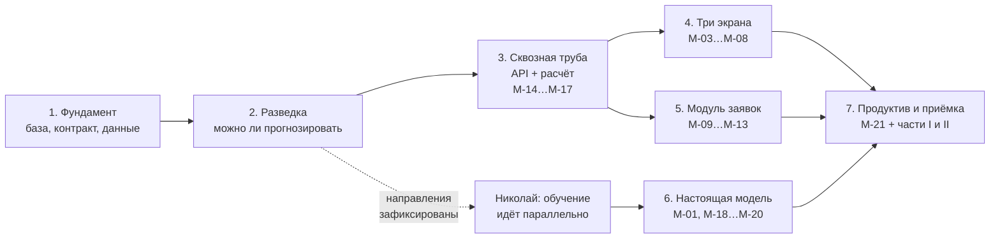

# План работ по вехам

Как мы доводим сервис от пустого репозитория до приёмки. Семь вех, каждая
заканчивается тем, что можно показать и проверить.

Опорные документы: постановка — `docs/task.md`, архитектура — `docs/HLD.md`,
приёмка — `docs/acceptance-test.md`. План им не противоречит и ничего к ним
не добавляет: он только расставляет их содержимое по порядку.

## Правило ворот

**Веха закрыта, когда прошли её тесты, а не когда кончился код.** Пока тесты
вехи не прошли, следующую не начинаем. Исключение одно — работа Николая над
моделью, она идёт параллельно с вехи 1 и своими воротами не связана.

Каждая веха закрывает конкретные строки программы минимум `М-01…М-21` из
`docs/acceptance-test.md`, часть 0. Двадцать одна строка разложена по вехам
без остатка и без пересечений: у каждой строки ровно один хозяин.

---

# Веха 1. Фундамент: база, контракт, данные

**Цель.** Чтобы через неделю никто не ждал друг друга. Николай должен получить
формат данных в первый день, а не на третьей неделе.

## Что делаем

1. Создаём репозиторий по структуре из `docs/HLD.md` разд. 2. Пустые папки
   с `README.md`, но настоящий `docker-compose.yml`.
2. Пишем `contracts/features.v1.yaml` и `contracts/predict.v1.schema.json` —
   это первое, что попадает в репозиторий, потому что это граница с Николаем.
3. Накатываем четыре схемы из `code/`: `schema_events.sql`, `schema_assets.sql`,
   `schema_permits.sql`, `schema_geo.sql` — переводим их в нумерованные миграции
   `db/migrations/`.
4. Доводим `code/load_smvu_xlsx.py` до состояния «грузит выгрузку заказчика целиком».
5. Поднимаем четыре контейнера: `db`, `api`, `nginx`, `ml`-заглушка.

## Определение готовности

- `docker compose down -v && docker compose up` на чистой машине поднимает сервис
  без ручных шагов.
- `GET /health` отвечает `200` и показывает версию применённой миграции.
- Выгрузка СМВУ залита, число строк в базе совпадает с числом строк в исходнике.
- Николай выполнил `curl` по примеру из `contracts/` и получил ответ заглушки.

## Тесты закрытия вехи

| Что проверяем | Как | Критерий |
|---|---|---|
| Развёртывание с нуля | `docker compose down -v && docker compose up -d` | Все контейнеры в состоянии `healthy` |
| Миграции | накатить на пустую базу, затем накатить повторно | Второй прогон не падает и ничего не меняет |
| Загрузка данных | `SELECT count(*)` против `wc -l` исходника | Числа совпадают |
| Идемпотентность загрузки | запустить загрузчик дважды на одном файле | Дублей нет, счётчик тот же |
| Контракт | прогнать пример запроса из `docs/HLD.md` разд. 6.3 через JSON Schema | Валидация проходит |

**Закрывает строк приёмки:** ни одной напрямую. Это фундамент, без него не считается
ничего остальное.

**Что может сорваться.** Выгрузка заказчика окажется не тем, что мы ждём: другой
набор колонок, другая кодировка, события без привязки к участку. Поэтому загрузка
данных стоит в первой вехе, а не в третьей — узнать об этом надо сразу.

---

# Веха 2. Разведка: можно ли вообще прогнозировать

**Цель.** Ответить на три вопроса из `CLAUDE.md`, раздел «Чего мы пока не знаем»,
и зафиксировать протоколом направления прогноза. Это самая короткая веха
и самая важная.

## Что делаем

1. Считаем критерий прогнозируемости `k` по каждому типу оборудования скриптом
   `code/reliability_fit.py` — на реальных данных, не на демонстрационных.
2. Считаем интервал P-F: сколько времени проходит от первого отклонения
   до отказа.
3. Считаем реальную частоту событий СМВУ — закрываем вилку в 50 раз
   (18 или 90 млн строк за 12 лет) и решаем, нужна ли DuckDB.
4. Выбираем направления прогноза из четырёх, названных в постановке,
   и подписываем протокол.

## Определение готовности

- Таблица `k` по типам оборудования с числом отказов в каждой выборке.
- Медиана и нижний квартиль интервала P-F в часах.
- Число строк событий за месяц и оценка на 12 лет.
- Протокол с названными направлениями и подписями обоих.

## Тесты закрытия вехи

| Что проверяем | Как | Критерий |
|---|---|---|
| Прогнозируемость | `code/reliability_fit.py` по журналу ремонтов | По выбранному направлению `k ≥ 0,5` хотя бы на одном типе оборудования |
| Достижимость горизонта | распределение интервала P-F | Медиана ≥ 24 ч, иначе горизонт из постановки недостижим |
| Объём базы | замер на месячной выгрузке × 144 | Прогноз размера диска с точностью до двух раз |
| Протокол | документ с датой и подписями | Направления названы поимённо, дата раньше первого прогона |

**Закрывает строк приёмки:** `М-02` — направления зафиксированы протоколом
до начала испытаний.

**Развилка, а не формальность.** Если по всем типам оборудования `k` выйдет
около нуля, это значит, что отказы случайны относительно наработки. Тогда
прогноз по возрасту бесполезен, и строить его надо на телеметрии и событиях
СМВУ, а не на наработке. Решение принимаем здесь, на второй вехе, когда
переделка стоит два дня, а не на шестой, когда она стоит проект.

---

# Веха 3. Сквозная труба: расчёт и REST API

**Цель.** Данные проходят весь путь от базы до JSON-ответа. Модель на этой
вехе — заглушка, которая возвращает константу. Смысл вехи не в качестве
прогноза, а в том, что труба собрана и нигде не течёт.

## Что делаем

1. Восемь стадий расчёта по `docs/HLD.md` разд. 8: чтение, свёртка, сборка
   признаков, вызов `ml`, запись прогноза, объяснение, метрики, журнал прогона.
2. Планировщик APScheduler с блокировкой `pg_try_advisory_lock(48217)` —
   чтобы два экземпляра не считали одно и то же.
3. Четыре метода REST API: риски, прогнозы за период, заявки, карточка объекта.
4. OpenAPI-описание, которое FastAPI генерирует сам.

## Определение готовности

- Один прогон расчёта проходит все восемь стадий и пишет строку в журнал
  с длительностью каждой стадии.
- Четыре метода отвечают `200` и JSON по схеме.
- Замена адреса `ml` в `.env` на настоящий контейнер Николая не требует
  правок нашего кода.

## Тесты закрытия вехи

| Что проверяем | Как | Критерий |
|---|---|---|
| Прогон расчёта | запустить вручную, посмотреть журнал | Восемь стадий, у каждой длительность, итог записан |
| Блокировка | запустить два экземпляра одновременно | Считает один, второй пишет в лог «занято» и выходит |
| API | `curl` по четырём методам | Код `200`, тело проходит валидацию по схеме |
| Описание API | открыть `/docs`, сверить пример с фактическим ответом | Совпадают дословно |
| Подмена модели | поменять адрес в `.env`, перезапустить | Работает без правок кода |
| Пустые данные | запросить период, где прогнозов нет | Пустой список и код `200`, а не `500` |

**Закрывает строк приёмки:** `М-14`, `М-15`, `М-16`, `М-17` — весь блок REST API.

**Почему API раньше интерфейса.** Экраны читают данные из API. Если сначала
сделать экраны, они будут читать выдуманные данные, и переделывать придётся
дважды. Обратный порядок таких переделок не создаёт.

---

# Веха 4. Три экрана

**Цель.** Диспетчер открывает браузер и видит дашборд рисков, карту объектов
и журнал прогнозов. Постановка называет три экрана через запятую, и это
не стилистика: отсутствие любого означает, что продукт не сдан.

## Что делаем

1. Дашборд рисков по макету `dashboard/dashboard-mockup.html` и палитре
   `dashboard/color-palette.md`.
2. Карта объектов на Leaflet с растровой подложкой из `tiles/`.
3. Журнал прогнозов с фильтром и сортировкой.
4. Общее меню и карточка объекта, куда ведут и дашборд, и карта.

## Определение готовности

- Три экрана открываются из меню, текущий раздел подсвечен.
- Клик по объекту на дашборде и на карте открывает одну и ту же карточку.
- Сжатый JS укладывается в бюджет 150 КБ.
- Карта открывается на машине без WebGL2.

## Тесты закрытия вехи

| Что проверяем | Как | Критерий |
|---|---|---|
| Вес сборки | `gzip -c dist/assets/*.js \| wc -c` | Сумма ≤ 150 КБ |
| Слабое железо | профиль «АРМ-ОДС», `frontend/lh-arm.js` | Первый экран отрисован за приемлемое время на замедленном процессоре |
| Без WebGL2 | отключить WebGL в браузере, открыть карту | Карта открывается и показывает объекты |
| Навигация | дашборд → карта → журнал → дашборд | Переходы в обе стороны, подсветка раздела |
| Карточка объекта | клик на дашборде и клик на карте | Открывается одна и та же карточка с прогнозом |
| Риск на карте | посмотреть карту без списка | Уровень риска различим на самой карте |

**Закрывает строк приёмки:** `М-03`, `М-04`, `М-05`, `М-06`, `М-07`, `М-08` —
весь блок интерфейса.

**Про бюджет 150 КБ.** Это не эстетика. На рабочем месте диспетчера старая
машина и медленная сеть, и заготовка Next.js заняла бы 107 КБ из 150 ещё
до первой строки нашего кода. Поэтому Preact, поэтому Leaflet,
и обоснование лежит в `docs/HLD.md` разд. 4.

---

# Веха 5. Модуль автоматического формирования заявок

**Цель.** Заявка рождается сама, по результату расчёта, без нажатия кнопки
человеком. Постановка называет это отдельным модулем, и на приёмке будут
смотреть именно на автоматичность.

## Что делаем

1. Правило порождения заявки: какой уровень риска и какая критичность объекта
   запускают автозаявку.
2. Заполнение четырёх полей: объект, вид работ из справочника, срок, обоснование.
3. Жизненный цикл заявки по `code/toir_state_machine.py`.
4. Двусторонние переходы заявка ↔ прогноз.

## Определение готовности

- Объект с риском выше порога порождает заявку без участия человека.
- В истории заявки первым шагом стоит расчёт, а не пользователь.
- Плановый срок работ наступает раньше прогнозируемого отказа.

## Тесты закрытия вехи

| Что проверяем | Как | Критерий |
|---|---|---|
| Автоматичность | подать объект с высоким риском, запустить расчёт, интерфейс не трогать | Заявка появилась сама |
| Происхождение | открыть историю заявки | Первый шаг — расчёт, указан его идентификатор |
| Полнота | открыть любую автозаявку | Заполнены объект, вид работ, срок, обоснование |
| Вид работ | посмотреть поле | Выбран из справочника, не вписан текстом |
| Превентивность | сравнить срок заявки с горизонтом прогноза | Срок работ раньше прогнозируемого события |
| Переходы | заявка → прогноз → заявка | Работают в обе стороны |
| Без дублей | запустить расчёт дважды подряд по одному объекту | Вторая заявка не создаётся, обновляется первая |

**Закрывает строк приёмки:** `М-09`, `М-10`, `М-11`, `М-12`, `М-13` — весь
блок заявок.

**Проверка без дублей — наша, а не из постановки.** Расчёт идёт регулярно,
и объект с устойчиво высоким риском попадёт под правило десятки раз подряд.
Без защиты от повторов список заявок за сутки превратится в мусор, и на защите
это увидят раньше, чем качество прогноза.

---

# Веха 6. Настоящая модель и четыре метрики

**Цель.** Заглушка заменяется обученной моделью Николая, и четыре числа
из постановки берутся на отложенной выборке.

## Что делаем

1. Заменяем контейнер `ml` на настоящий.
2. Готовим отложенную выборку — **по времени, а не случайно**.
3. Замеряем метрики методикой `code/predictive_metrics.py`.
4. Собираем отчёт об обучении: алгоритм, признаки, гиперпараметры, кривые.
5. Делаем объяснение прогноза на русском языке в карточке объекта.

## Определение готовности

- Precision и Recall на отложенной выборке взяты с запасом: целимся
  в 0,75 и 0,55, а не в 0,70 и 0,50.
- Минимум упреждения по прогонам с нулевым горизонтом не меньше 24 часов.
- Есть отчёт об обучении, доказывающий, что это модель, а не пороговые правила.

## Тесты закрытия вехи

| Что проверяем | Как | Критерий |
|---|---|---|
| Precision | `evaluate_alerts()` на отложенной выборке | Строго больше 0,700 |
| Recall | тот же прогон | Строго больше 0,500 |
| Горизонт | отдельный прогон `evaluate_alerts(horizon_hours=0)` | Медиана и минимум упреждения ≥ 24 ч |
| Честность выборки | посмотреть, как разрезали данные | Разрез по времени: обучение раньше, проверка позже |
| Это модель | открыть отчёт об обучении | Назван алгоритм, признаки, метрики на обучении и проверке |
| Объяснение | открыть карточку объекта | Причина прогноза написана по-русски и соответствует вкладам признаков |

**Закрывает строк приёмки:** `М-01`, `М-18`, `М-19`, `М-20`.

**Про строгое неравенство.** Постановка пишет «Precision > 0.7». Результат
ровно 0,700 закрывает формулировку «не ниже», но не закрывает «больше».
Разница в третьем знаке решает, сдан продукт или нет.

**Про разрез по времени.** Если перемешать события случайно, в обучающую
выборку попадут данные из будущего относительно проверочной, метрики
завысятся, и на реальных данных всё развалится. Разрез только по времени.

---

# Веха 7. Продуктивный объём, приёмка, поставка

**Цель.** Показать, что сервис работает не на демонстрационном наборе,
и пройти чек-лист приёмки построчно.

## Что делаем

1. Разворачиваем стенд с полным объёмом данных.
2. Замеряем время полного расчёта по всем объектам.
3. Проходим часть 0 (21 строка), затем часть I (11) и часть II (16).
4. Собираем перечень зависимостей с лицензиями.
5. Пишем инструкцию по развёртыванию и проверяем её на чистой машине.

## Определение готовности

- Полный расчёт по всем объектам укладывается в 5 минут на продуктивном объёме.
- Все 48 обязательных строк приёмки отмечены ✓.
- В перечне зависимостей нет ни одной лицензии GPL, LGPL или AGPL.

## Тесты закрытия вехи

| Что проверяем | Как | Критерий |
|---|---|---|
| Время расчёта | три замера полного прогона, берём худший | Меньше 300 с на продуктивном объёме |
| Не демо | сверить число объектов и строк в замере с продуктивом | Совпадают, а не урезаны |
| Часть 0 | пройти 21 строку | Ни одного ❌ |
| Части I и II | пройти 27 строк | Ни одного ❌ |
| Лицензии | `pip list` + проверка каждой лицензии | Ни одной GPL, LGPL, AGPL в образах `api`, `worker`, `nginx` |
| Развёртывание | развернуть с нуля по инструкции на чистой машине | Поднялось без устных подсказок |
| Восстановление | остановить базу на минуту, поднять обратно | Сервис восстановился сам, расчёт не потерялся |

**Закрывает строк приёмки:** `М-21` и полный проход частей 0, I и II.

**Про «не демо».** В архиве прошлых проектов нашёлся случай, когда подрядчик
вывел нагрузочное тестирование из объёма испытаний одной фразой в программе
испытаний, и приёмка прошла на игрушечном объёме. Здесь мы это закрываем
отдельной строкой: замер засчитывается только на продуктивных данных.

---

# Что делает Николай параллельно

Модель — самая длинная по времени работа, и ждать ворот она не может.

| Пока идёт веха | Николай |
|---|---|
| 1 | Читает контракт `contracts/features.v1.yaml`, поднимает заглушку `ml`, отвечающую константой |
| 2 | Участвует в разведке: смотрит на `k` и P-F вместе с нами, соглашается с выбором направлений |
| 3 | Собирает обучающую выборку, пробует первые модели на признаках из контракта |
| 4 | Обучение, подбор гиперпараметров, калибровка вероятностей |
| 5 | Вклады признаков, отчёт об обучении, сборка образа `ml` |
| 6 | Передаёт образ, вместе берём метрики |
| 7 | Дежурит на замерах и на защите |

**Правка контракта — это PR, а не договорённость в переписке.** Если Николаю
нужен новый признак, он открывает PR в `contracts/`, мы реализуем SQL
и выпускаем следующую версию файла. Подробности — `docs/HLD.md` разд. 6.1.

---

# Соотношение трудоёмкости

Дат в плане нет: срок хакатона не зафиксирован в постановке. Вместо дат —
доли общего времени, это моя оценка, а не обязательство.

| Веха | Доля | Почему столько |
|---|---|---|
| 1. Фундамент | 15 % | Схемы БД и загрузчик уже написаны в `code/`, их надо довести, а не сочинить |
| 2. Разведка | 5 % | Считалка готова, работа — на данных, а не над кодом |
| 3. Сквозная труба | 25 % | Самая объёмная: восемь стадий расчёта, планировщик, четыре метода |
| 4. Три экрана | 20 % | Макет и палитра готовы, делать надо работающий фронт |
| 5. Заявки | 15 % | Автомат правил и жизненный цикл |
| 6. Модель | 10 % | На нашей стороне — подмена контейнера и замер; основное у Николая идёт параллельно |
| 7. Приёмка | 10 % | Замеры, проход чек-листа, документы |

**Резерв держим на вехе 3.** Если что-то поедет, поедет там: это единственная
веха, где мы одновременно трогаем базу, планировщик, границу с ML и API.

---

# Если времени не хватит

Порядок отказа от работ, от первого к последнему:

1. Часть III приёмки — 82 рекомендации, на приёмке не проверяются.
2. Часть II — 16 строк из Регламента. Обидно, но продукта не рушит.
3. Красота интерфейса: анимации, тёмная тема, тонкая настройка палитры.
4. Второе и третье направление прогноза — постановка разрешает взять одно.

**Отказываться нельзя ни от одной из 21 строки части 0.** Продукт без REST API
или без карты объектов не сдан, каким бы хорошим ни был прогноз.
