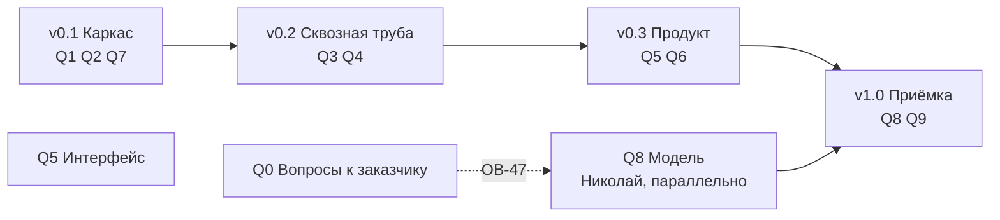

# План работ: десять блоков, четыре версии

Файл ведём по ходу работы, отметки ставим сразу. Перестроен 15.09.2026 из семи вех
в десять блоков — почему, написано ниже в разделе «Почему блоки, а не вехи».

## Как читать план

Работа нарезана по **двум измерениям**, и их нельзя путать.

**Блок отвечает на вопрос «что делаем».** Это часть системы: развёртывание, база,
расчёт, API, интерфейс, заявки, граница с ML, модель, приёмка. Граница блока совпадает
с каталогом в репозитории — открыв блок, видно, куда падает код. В трекере блок
становится эпиком, а каталог — полем «компонент».

**Версия отвечает на вопрос «когда».** Это временной срез: что должно работать
к концу каждого. В трекере версия становится Fix Version или спринтом.

Одна задача принадлежит ровно одному блоку и ровно одной версии. Раньше эти два
измерения лежали в одном списке — отсюда и брались вехи вроде «Фундамент» (это время)
рядом с «Три экрана» (это часть системы).

**У каждого блока две части, и путать их нельзя.** «Задачи» — работа, которую кто-то
делает и которая занимает время. «Готовность» — условия, при которых блок считается
закрытым; их никто не «делает», они либо выполняются, либо нет. Проверка вроде «экраны
открываются в Яндекс.Браузере» — это готовность, а не задача: на доске она висела бы
неделями в статусе «в работе», хотя работы там нет.

**Задачи.** В колонке «Что появляется» стоит конкретный артефакт: путь к файлу, имя
таблицы, метод API или элемент экрана. Формулировок вида «проработать» и «обеспечить»
в этой колонке нет: если из задачи не рождается предмет, который можно открыть, задача
описана неверно и её надо переписать.

**Артефакты** — пять типов, и у каждого свой признак готовности:

| Тип | Признак готовности |
|---|---|
| Код | Лежит в репозитории, проходит свою самопроверку |
| Схема БД | Нумерованная миграция в `db/migrations/`, накатывается на пустую базу |
| Контракт | Файл в `contracts/`, есть пример запроса, пример проходит валидацию |
| Документ | Файл `.md` в `docs/`, содержит числа и дату замера, а не намерения |
| Элемент интерфейса | Виден в браузере, к нему ведёт клик из описанного места |

**Знаки состояния:** `☐` не начата, `⏳` в работе, `✓` закрыта, `❌` провалена,
`✱` развилка пройдена и вариант выбран, `❗` то, что выбранным вариантом не закрывается.
Зачёркнутая задача отменена, причина написана рядом.

## Почему блоки, а не вехи

Прежние семь вех смешивали два разных вопроса. «Фундамент» и «Приёмка» — это время.
«Три экрана» и «Модуль заявок» — это части системы. Пока план читает человек, он держит
связь в голове; на доске задач такой список рассыпается.

Три причины перестроить:

1. **Переключение контекста — главная цена команды из двух человек.** Из 71 задачи
   70 на Мирославе. При разрезе по времени «написать загрузчик» и «нарисовать дашборд»
   лежат в одном эпике, потому что делаются на одной неделе. При разрезе по блокам
   в эпике «Данные» лежит всё про данные, и это то, чем занимаешься в один заход.
2. **Блок переживает сдвиг срока, веха — нет.** Веха «Три экрана» при переносе теряет
   смысл; блок «Интерфейс» остаётся собой.
3. **Требования ТЗ перестают теряться.** Двадцать три работы, добавленные ТЗ
   от 11.09.2026, полгода жили отдельным списком в конце файла с пометкой «перенести
   в тело вех, когда Слава утвердит порядок». Теперь они внутри блоков, каждая со своей
   строкой приёмки.

**Что при этом потеряно и чем возмещено.** Прежний план задавал порядок работ: сначала
API, потом экраны, потому что иначе экраны будут читать выдуманные данные. В блоках
этот порядок не виден. Он выражен двумя способами: версиями (таблица ниже) и явными
зависимостями в колонке задачи.

## Десять блоков

| Блок | Эпик | Каталог | Задач | Готовность | Состояние |
|---|---|---|---|---|---|
| `Q0` Вопросы к заказчику | MOS-1 | — | 9 | 3 | ⏳ семь из восьми закрыты: 0.1 и 0.2 нашими силами, 0.5 (Ф-81) и 0.6 (Ф-84, Ф-87) — ответами на встрече 17.09.2026, 0.3, 0.4 и 0.7 — письменными ответами 19.09.2026. Остаются 0.3 (половина ОВ-47), 0.4, 0.7 и 0.8 |
| `Q1` Развёртывание и эксплуатация | MOS-2 | `deploy/` | 18 | 4 | ✓ **все 18 задач закрыты 28.09.2026: 1.2, 1.4, 1.6, 1.11, 1.18 — по замеру на стенде, 1.9 и 1.10 — без замера по решению Славы (второго диска не будет)**, до него они в работе и проверены по TDD в песочнице на живых контейнерах: 1.2, 1.3, 1.4, 1.6, 1.9, 1.10, 1.11, 1.18 закрыты в этот день. Нагрузка нашла и починила три поломки `api` и nginx (1.4). На стенде остаются замеры, которые из облака не снять: учения восстановления (1.9), прогон нагрузки (1.4), подъём демо (1.10) — команды в `docs/restore.md`, `docs/load-test.md`, `deploy/README.md`. **Учения и демо ждут второго диска:** на стенде свободно 33 ГБ (замер 28.09.2026), учения просят 61 ГБ, демо 55 ГБ. Условия готовности 1 и 3 ждут этих замеров |
| `Q2` Данные: загрузка, справочники, разведка | MOS-3 | `db/`, `backend/app/ingest/`, `backend/app/archive/` | 25 | 4 | ✓ журнал залит, условия готовности выполнены 23.09.2026; 2.13 не делаем (решение 23.09.2026), 2.25 закрыта 25.09.2026 (MOS-220) — открытых задач в блоке не осталось |
| `Q3` Расчётное ядро | MOS-4 | `worker/` | 26 | 6 | ☐ |
| `Q4` REST API и доступ | MOS-5 | `api/`, `auth/` | 19 | 5 | ✓ 19 из 19 сделаны и слиты в master к 24.09.2026; последняя — 4.19, блокировка пользователя из интерфейса (MOS-226) |
| `Q5` Интерфейс | MOS-6 | `frontend/` | 40 | 6 | ⏳ 5.1, 5.2, 5.4, 5.5 закрыты, 5.3 сделана 23.09.2026 вместе с 5.30 (форма значка риска), 5.34 закрыта 26.09.2026 (MOS-178), 5.36–5.37 найдены при её проверке, 5.6–5.9, 5.13, 5.14 и 5.39 закрыты 27.09.2026, 5.10 (экран настроек) добавлена 17.09.2026. **Блок вырос вдвое 19.09.2026:** 5.12–5.14 из письменных ответов заказчика (фильтры карты, обновление раз в минуту, журнал действий), 5.15–5.21 из анализа фронта соседней сессией на боевом стенде, 5.22 — схема под графику заказчика, у которой раньше не было строки в плане |
| `Q6` Модуль заявок | MOS-7 | `domain/`, `screens/orders/` | 14 | 5 | ☐ 6.8 перестала ждать заказчика и стала моком, 6.9 (квитирование) добавлена 17.09.2026 |
| `Q7` Граница с ML и объяснимость | MOS-8 | `contracts/`, `mlclient/` | 14 | 9 | ☐ |
| `Q8` Модель | MOS-9 | репозиторий Николая | 4 | 4 | ☐ идёт параллельно с `v0.1` |
| `Q9` Приёмка и поставка | MOS-10 | `delivery/` и шесть файлов сдачи | 32 | 6 | ☐ 9.8 закрыта, 9.10 снята ответом заказчика, 9.21 закрыта 26.09.2026 (MOS-176); 9.11 (видеозапись) и 9.12 (пояснительная записка) добавлены 17.09.2026; 9.13 (сборка пакета сдачи и проверка распаковкой) добавлена 19.09.2026 — заказчик написал, что разворачивать решение будут эксперты у себя; 9.14 (прогон команд, записанных в документах) добавлена 21.09.2026 — число в тексте протокола разошлось с выводом команды под ним на 3 087 записей; 9.29 (MOS-239, контракт openapi и эмулятор погоды) и 9.30 (MOS-240, снимки review) добавлены 27.09.2026 |

**Сколько задач и условий готовности — считает таблица выше, колонки «Задач» и «Готовность»; задачи сверяет `code/check_plan.py`. У каждой задачи ровно один исполнитель;** на Николае — 2.23, 8.1, 8.2 и 8.3, остальные на Мирославе. Задач «на двоих» не осталось — там, где
работа делится, она разрезана надвое с зависимостью, а подпись второго человека стала
условием готовности, а не работой. **Число задач я считаю по таблице выше, а не помню:** 21.09.2026 здесь стояло
97 при 132 строках в таблицах — счётчик отстал на тридцать пять задач и врал
неделю, потому что каждая сессия дописывала строку и не трогала шапку.

**Единица у Николая — это граница команды, а не перекос.** За контрактом его кухня:
мы не ставим ему задачи и не считаем его часы в своих сроках. Наше понимание его работы
лежит в блоке `Q8` описанием — как предложение с числами, которое он волен не принять.
Отсюда два следствия: **резать при нехватке времени надо из блоков Мирославы** (у него
резать нечего, его задача закрывает М-18, М-19 и М-20), и **его работа не ждёт нашей** —
ему нужны только выгрузка и контракт, две задачи первого дня.

### Колонка «После»

В таблице задач каждого блока есть колонка «После» с номерами задач, без которых эту
начинать бессмысленно. Это не украшение: на доске такая зависимость становится связью
`blocks` / `is blocked by`, и без неё работа делается дважды. Самый дорогой случай —
`Q4.1` (роли) перед всеми методами API: если писать методы раньше, проверку разрешений
придётся навешивать на девять готовых методов заново.

## Четыре версии

| Версия | Что работает к концу | Блоки |
|---|---|---|
| **v0.1 Каркас** | стенд поднимается на чистой машине, база принимает выгрузку, контракт описан, заглушка модели отвечает | `Q1`, `Q2`, `Q7` частично |
| **v0.2 Сквозная труба** | расчёт проходит восемь стадий с заглушкой, API отвечает по контракту и закрыт ролями | `Q3`, `Q4` |
| **v0.3 Продукт** | три экрана, заявки порождаются автоматически | `Q5`, `Q6` |
| **v1.0 Приёмка** | настоящая модель, четыре метрики, продуктивный объём, документы | `Q8`, `Q9`, остаток `Q7` |

## Правило ворот

**Версия закрыта, когда выполнены условия готовности её блоков, а не когда кончился код.** Пока тесты версии
не прошли, следующую не начинаем. Исключений два: блок `Q8` (работа Николая) идёт
параллельно с `v0.1` и нашими воротами не связан, и блок `Q0` (вопросы к заказчику)
не закрывается своими силами вовсе.

**Порядок внутри версии задают зависимости, а не номера задач.** Главная из них:
`Q4` перед `Q5` — экраны читают API, и если писать их раньше, они будут читать
выдуманные данные, а переделывать придётся дважды.

**Порядок проверки на защите переставил очередь — 17.09.2026.** Ментор описал, в каком
порядке комиссия смотрит работу [00:48:00]: сначала распаковывается пакет и проверяется,
что документация в полном составе («не в полном, печально, уже как бы минус балл»), потом
заказчик узнаёт в решении своё ТЗ, потом — отдельным пунктом — обязательные требования
и **распределённые роли**, потом проходит ли целевой сценарий, и только потом интерфейс,
который понятен без инструкции. Метрики модели идут после всего этого списка, а не перед ним.

Отсюда две работы поднимаются выше работы над моделью, и я переставляю их не молча.
**Первая — `Q9.4`, две инструкции `docs/install.md` и `docs/build.md`.** Она не начата
и лежит в версии `v1.0`, а открывают её первой: комиссия распаковывает пакет раньше,
чем запускает расчёт, и неполный комплект документов стоит балла до того, как кто-то
посмотрит на Precision. **Вторая — `Q4.11`, роли под имена заказчика.** Он назвал четыре
роли сам и письменно, поэтому на приёмке будет искать именно их. Обе делаем внутри `v0.3`,
до блока `Q8` и до задачи `Q9.1`.

Что при этом не двигается: `Q9.1` (замер четырёх метрик) по-прежнему ждёт модели Николая,
и обогнать его нечем. Я переставила то, что в моей власти, а не всю очередь.

И отдельно про даты коммитов: «залили вот этот вот документ чуть позже срока… это влияет,
это все видно. И, к сожалению, это как бы больше минус карме» [01:00:00]. Эксперты смотрят
время коммитов внутри репозитория, а не только время отправки ссылки, — значит документы
пишутся по ходу работы, а не в последний вечер.

---

# Q0. Вопросы к заказчику

**Каталог:** —

**Цель.** Чтобы ни одна работа не встала молча. Каждый вопрос, от ответа на который зависит чужая
работа, живёт здесь строкой — с адресатом, датой отправки и тем, что встанет без ответа.

**Артефакт здесь — не письмо, а строка в журнале.** Письмо из трекера не открывается, и по нему не видно, отправлено оно или нет. Поэтому каждый вопрос ведётся строкой в `docs/questions-log.md`: номер ОВ, адресат, дата отправки, дата ответа, что ответили.

**Решено 15.09.2026 и вопросом не является:** заказчику не сообщаем, что его обезличивание половинчатое — в названиях каналов остались живые московские топонимы. Это единственный уцелевший мостик между справочниками, и обоими якорями связи мы обязаны ему. Пользуемся внутри, наружу не выносим; правило целиком — `docs/for-ml-team.md` разд. 12.

## Задачи

| № | Задача | Что появляется | После | Кто |
|---|---|---|---|---|
| 0.1 | ✓ **сделано 15.09.2026.** Собрать таблицу «префикс тега → предполагаемый объект» на все 32 строки, чтобы заказчику осталось подтвердить или поправить, а не разбираться с нуля. Три строки мы доказали данными (847 = Кси 5327; 885 и 890 = Дзета), ещё четыре вывели по возрастанию ид и по датам, когда площадки появились в журнале (914 и 915 = Мю 3828; 1044 и 1051 = Гамма 7), и у каждой из этих четырёх написали словами «проверить по данным нечем». Остальные 25 строк так и остались неизвестными. Топонимы из названий каналов мы проставили у 13 префиксов | `analysis/prefix_to_object.md`; строка ОВ-46 в `docs/questions-log.md` | — | Мирослава |
| 0.2 | ✓ **снята 16.09.2026, MOS-12: заказчик ответил раньше, чем мы спросили.** Письмо про 32 строки отправлять не надо — он прислал справочник каналов заново, с колонкой `ид_объект` у всех 11 485 каналов. Что сделано вместо письма: колонка `smvu.channel.object_id` (миграция 018), загрузчик берёт шестую колонку и дозаполняет уже залитую базу, на стенде проставлено 11 485 из 11 485. Гипотезу из 0.1 факт не подтвердил: префиксов 32, коллекторов 16, два префикса ведут к разным коллекторам — по ней 26 каналов получили бы чужой объект | `smvu.channel.object_id`; `db/migrations/018_channel_object.sql`; отметка в `analysis/prefix_to_object.md` | 0.1 | Мирослава |
| 0.3 | ✓ **закрыто письменным ответом заказчика 19.09.2026: сверять не с чем, письмо не отправляем.** Журнала ОДС мы не получим — «Журнал решений с отметками о ложных срабатываниях выгружен не будет, так как эти данные субъективны и зависят от человеческого фактора» (`docs/meetings/2026-09-19-ответы-заказчика.md`, сводный 6), а определение отказа заказчик отдал нам целиком: «Разделение отказов, ложных срабатываний и отсутствия данных - задача участников» (сводный 1). Порог в час, склейка в инциденты и формулировка «мы предсказываем потерю связи с каналом» едут в пояснительную записку как наше решение с обоснованием. Прежняя формулировка задачи: **ОВ-47, блокирующий.** Спросить, согласен ли заказчик считать отказом эпизод `Неисправен` длиннее часа, и есть ли у него журнал ОДС или система учёта заявок, по которым это определение можно сверить | строка ОВ-47 в `docs/questions-log.md`; ответ правит `docs/for-ml-team.md` разд. 1 и 5 | — | Мирослава |
| 0.4 | ✓ **закрыто письменным ответом заказчика 19.09.2026: он ответил на все три варианта сразу.** Пороги и горизонт — «плановые (по умолчанию), а не жесткие требования… их можно снизить, обязательно обосновав это в описании MVP» (`docs/meetings/2026-09-19-ответы-заказчика.md`, сводный 2), данных большей глубины не будет — «Догрузка данных не планируется. Предоставленный набор данных является полным и окончательным» (сводный 15). Письмо не отправляем, числа переезжают в пояснительную записку, задача 9.12. Прежняя формулировка: **Достижимость метрик, блокирующий с 15.09.2026. Формулировка смягчена 15.09.2026 после пересчёта Николая (MOS-14): слово «недостижимы» снято.** Числа ниже верны, но посчитаны по одному каналу, а мерить заказчик будет по инцидентам. На уровне инцидента картина другая: потолок полноты при оракуле 0,98, а не 0,59; лучшее правило даёт точность 0,356, а не 0,040. Для требуемой точности 0,7 не хватает подъёма вдвое, а не на порядок — и это ровно та работа, которую делает модель, непроверенная пока. Поэтому заказчику показываем разрыв и спрашиваем про единицу метрики, а не объявляем задачу невыполнимой. Прежняя причина ошибки та же, что в задаче `2.11`: раздел 10 `docs/for-ml-team.md` считал точность против 82 «пачек от пяти отказов», а не против всех инцидентов — одиночные, которых большинство, в знаменатель не вошли. Показать заказчику числа до испытаний: у 41 % отказов нет ни одной записи своего канала в окне от 8 суток до 24 часов перед событием, а у датчиков дыма таких отказов 60 %. Значит, даже если бы мы угадывали каждый отказ идеально, полнота не поднялась бы выше 0,59 по парку и 0,40 по датчикам дыма, а постановка требует 0,5. Ни одно из одиннадцати правил не дало точность выше 0,040, а постановка требует 0,7. Предложить заказчику выбрать: пересмотреть горизонт, разделить требования по типам оборудования или дать данные с бóльшей глубиной записи | строка в `docs/questions-log.md`; письмо с таблицей из `docs/for-ml-team.md` разд. 10; ответ правит М-18, М-19, М-20 | — | Мирослава |
| 0.5 | ✓ **закрыто 17.09.2026 на встрече с экспертами, Ф-81.** Письмо не отправляем: заказчик ответил раньше и разрешил нарисовать геометрию самим — «Для синтетических макетов разумеется можно сгенерировать геометрию объектов. Коллекторы имеют основное тело, и боковые галереи. Достаточно осевых MultiLineString». Настоящих координат не будет и дальше: «Координаты отсутствуют из-за ряда ограничений», а по удалённым датчикам они потеряны совсем. Из трёх выходов, которые мы собирались предложить, заказчик выбрал четвёртый — рисуем сами и называем это синтетикой. Что из этого вышло: задача `Q4.8` разблокирована, задача `Q9.10` снята | ответ в строке Ф-81 `docs/questions-log.md`; разбор с цитатами — `docs/meetings/2026-09-17-эксперты.md` разд. 2 | — | Мирослава |
| 0.6 | ✓ **закрыто 17.09.2026: заказчик ответил по всем трём источникам, и все три ответа отрицательные.** Реестра оборудования (Ф-84) отдельным файлом не будет — «Нет, они несут второстепенную роль, датчики ставятся исходя из множества факторов», и сам предмет он сузил: «мы ее сузили только до датчиков» [01:18:00]. Система учёта заявок (Ф-87, НФ-69) живёт в самописном хелпдеске на Django, и читать из неё мы не будем: «напрямую системы до сих пор не интегрированы и не будут интегрированы» [00:24:00], письменно — «для синтетических макетов достаточно симуляции». Метеоданные (Ф-85, Ф-86) сняты ещё 15.09.2026: Open-Meteo без ключа, архив скачан. Что из этого вышло: задача `Q2.8` свелась к оговорке, задача `Q6.8` стала моком. Осталась одна строка — ОВ-49, какой адрес выпустит наружу служба безопасности; разработку она не держит | три ответа в `docs/questions-log.md`; переписаны задачи `Q2.8` и `Q6.8` | — | Мирослава |
| 0.7 | **Письмо отменено ответом заказчика 19.09.2026:** «Догрузка данных не планируется. Предоставленный набор данных является полным и окончательным» (`docs/meetings/2026-09-19-ответы-заказчика.md`, сводный 15) — xlsx не пришлют. Ф-76 закрываем своими руками: берём месяц журнала из csv, сохраняем в xlsx, льём обе ветки загрузчика и сверяем число принятых строк. Прежняя формулировка: **Запросить у заказчика выгрузку в xlsx либо закрыть Ф-76 оговоркой.** ТЗ разд. 7 требует принимать и CSV, и XLSX, а критерий Ф-76 — залить один набор двумя файлами и сверить числа. Заказчик прислал только csv: проверить нечем. Ветка чтения xlsx через `python_calamine` в загрузчике есть, но на настоящих данных не выполнялась ни разу. Хватит выгрузки за один месяц. Заодно спросить, останется ли csv постоянным форматом обмена: если да, `python_calamine` из образа можно убрать | строка в письме заказчику; после ответа — прогон обеих веток с числами либо оговорка в строке Ф-76 · приёмка: Ф-76 | — | Мирослава |
| 0.8 | **Спросить про два дня, когда коллектор замолчал и не вернулся (MOS-98).** 27.04.2026 на префиксе 1051 (коллектор «объект Гамма») перестали передавать 362 канала, вернулся один; 12.03.2026 на префиксе 884 (коллектор «объект Каппа») замолчали 483 канала, вернулось 49. Спрашиваем про эти два случая, а не про все десять: остальные восемь мы проверили сами — там каналы и раньше молчали столько же и возвращались. От ответа зависит, считать ли такое молчание отказом при обучении | строка ОВ в `docs/questions-log.md`; раздел «Массовое молчание коллекторов» в `docs/for-ml-team.md` | 2.5 | Мирослава |
| 0.9 | **Появилась 21.09.2026 (MOS-152), нашлась побочно при разборе весов для MOS-150.** Одиннадцать газовых датчиков молчат больше года, а по флагам числятся исправными (`is_active = t`, `is_stub = f`). Шесть из них стоят подряд на коллекторе 217, пикеты 734…840, и замолчали в один день — 03.03.2025, за четыре месяца до начала расчётного окна (свёртка `feat.section_daily` покрывает 01.07.2025 — 30.06.2026), поэтому в расчёт они не входят вовсе и ни одна наша проверка их не видит. По всему парку каналов, молчащих дольше года, 17 из 12 627 живых: 11 в газовой охране (2,1 % от её 529 каналов) и 6 в диспетчерском контроле; у пожарной охраны с её 5 701 каналом молчащих нет ни одного. Загазованность — та беда, ради которой эти датчики и стоят, в коллекторах работают люди. Спросить заказчика: демонтированы, выведены из эксплуатации или стоят и не работают. Показать молчание отдельным состоянием на карточке участка — не «исправен» и не «неисправен», порог из `ref.app_setting`. Годится в пояснительную записку как пример работы сверх постановки | вопрос заказчику; строка состояния в карточке участка `frontend/src/`, замер в `delivery/check-all.sh`, абзац в `docs/explanatory-note.md` · приёмка: прямой строки нет, подпирает М-05 | 2.16 | Мирослава |

## Готовность

Условия закрытия блока. Их никто не «делает» — они либо выполняются, либо нет.
У каждого условия с числом есть задача, которая это число обеспечивает.

- ☐ Осталась одна строка — 0.8 (два дня, когда коллекторы замолчали и не вернулись): она отправлена, и в `docs/questions-log.md` стоит дата отправки. Строки 0.3, 0.4 и 0.7 закрылись письменными ответами заказчика 19.09.2026, отправлять их не надо — разбор в `docs/meetings/2026-09-19-ответы-заказчика.md`.
  Остальные четыре закрылись без нашего письма: 0.1 и 0.2 нашими силами 15 и 16.09.2026, 0.5 и 0.6 — ответами заказчика на встрече с экспертами 17.09.2026.
- ☐ По каждому вопросу записан ответ или дата, когда идём за ним повторно.
- ✓ Ни одна из четырёх задач, ждавших ответа, больше не ждёт. `Q3.6` разблокирована 15.09.2026, `Q4.8` и `Q6.8` — 17.09.2026, `Q2.8` переписана под ответ «реестра не будет». Решение по каждой записано в её строке плана.

---

# Q1. Развёртывание и эксплуатация

**Каталог:** `deploy/`

**Цель.** Система поднимается на чистой машине по инструкции, переживает перезапуск, держит
двадцать пользователей и восстанавливается из копии за четыре часа.

**Инструкция развёртывания пишется один раз, в `Q9`.** ТЗ разд. 14 называет поимённо `docs/install.md` и `docs/build.md` — комиссия откроет их, а не наш `deploy.md`. Отдельной задачи на `docs/deploy.md` здесь нет.

**Что у заказчика стоит на самом деле — из доклада на форуме 17.09.2026; ОВ-02 закрылся
сам, без нашего письма.** Два центра обработки данных в разных округах Москвы собраны
в один катастрофоустойчивый кластер, система хранения — 48 Тб, вычисления — на блейд-серверах,
связь — 150 км волоконно-оптических линий, проложенных по самим коллекторам, основное кольцо
из 25 коммутаторов, из них 5 дублируются. Слайд 4 доклада,
`docs/meetings/img-forum/17-25-телеком-инфраструктура.png`. Наши 55 ГБ базы и один сервер
в такой контур влезают с запасом, поэтому про характеристики сервера мы больше не спрашиваем.

## Задачи

| № | Задача | Что появляется | После | Кто |
|---|---|---|---|---|
| 1.1 | ✓ **сделано 15.09.2026, коммит `097993e`.** Дерево из 17 каталогов заведено, стенд поднят: PostgreSQL 18.6 с PostGIS 3.6, nginx отдаёт 200 по HTTP/2, порт 80 даёт 301. **15.09.2026 дописали вход по новому виду адресов:** `listen [::]:80` и `listen [::]:443 ssl`. Без них nginx слушал только `0.0.0.0`, клиент с адреса `::1` получал `connection refused` при исправном сервере, и на этом же спотыкалась наша собственная проверка живости. Строка НФ-75 закрыта замером `sh deploy/check-tls.sh`, снятым по обоим видам адресов: nmap показывает TLSv1.2 и TLSv1.3 по три набора шифров, секций TLSv1.0 и TLSv1.1 нет вовсе. Из шести контейнеров HLD разд. 7.1 поднимаются два, остальные четыре ждут кода под профилем `app`. **Две ловушки, на которые мы напоролись:** том базы пришлось монтировать на `/var/lib/postgresql`, а не на `.../data` — в 18-й ветке `PGDATA` переехал, и старый путь оставил бы кластер в анонимном томе, а `deploy/backup.sh` из задачи 1.2 забирал бы ноль байт; и `openssl` без `-cipher DEFAULT@SECLEVEL=0` показывает отказ нашего клиента вместо отказа сервера, поэтому доказательством для НФ-75 служит `nmap`, а openssl идёт контролем. Завести репозиторий по структуре `docs/HLD.md` разд. 2 и поднять пустой стенд. Сразу же прописать в `deploy/nginx/nginx.conf` TLS не ниже 1.2: строку `ssl_protocols TLSv1.2 TLSv1.3` и набор шифров, где нет RC4 и 3DES | Дерево папок, `deploy/docker-compose.yml`, `deploy/.env.example`, `deploy/nginx/nginx.conf` · приёмка: НФ-75 | — | Мирослава |
| 1.2 | ✓ **закрыто 28.09.2026 по замеру на стенде; MOS-18.** Решение Славы 28.09.2026: копирование, настроенное и проверенное на стенде в выключенном виде, считаем сделанным. На стенде после выкладки c6f3cf8: `backup` в статусе Up, в `/backups/backup.log` строка `копии выключены: BACKUP_ENABLED=0 в deploy/.env`, `check-backup.sh` — `ВЫКЛ`. Включается `BACKUP_ENABLED=1` и `BACKUP_DIR` на втором диске (`docs/restore.md`, «Включить и выключить копии»); семь суток копий для НФ-78 отсчитываются от включения. Копии снимает контейнер `backup` (`deploy/docker-compose.yml`, образ тот же, что у `db`): `deploy/backup.sh --loop` ждёт `BACKUP_AT` (02:00 по Москве) и снимает физическую копию кластера `pg_basebackup` — tar, zstd на стороне сервера, манифест, сразу `pg_verifybackup`; **Выключатель `BACKUP_ENABLED` и каталог `BACKUP_DIR` (28.09.2026):** всё настроено, при 0 база не пишет архив, `backup` не снимает копий и пишет «копии выключены», `check-backup.sh` отвечает `ВЫКЛ`; на стенде 0 до второго диска (`docs/restore.md`, «Включить и выключить копии»; TDD: до правки с 0 сегмент ушёл в архив и ручная копия снялась, после — 42 сегмента остались 42, отказ с кодом 1). Хранит `BACKUP_KEEP` = 1 последнюю: больше на 33 ГБ свободного места стенда не помещается (`docs/restore.md`, «Сколько хранить»). Копию, которая не помещается, не начинает: прошлая копия плюс 10 % и 2 ГБ больше свободного — `СБОЙ … места нет`; TDD 28.09.2026 на томе в 700 МБ — до правки `pg_basebackup` забил том до конца, после — отказ сразу. **Не cron, как было написано ниже, а служба compose:** комиссия разворачивает наш пакет у себя, и копии должны пойти от `docker compose up -d`, без шага «поставить crontab» на чужой машине. Журнал — строки в `/backups/backup.log` с `запуск=schedule|manual`, таблицы нет. Порядок восстановления — `docs/restore.md`. Проверка `deploy/check-backup.sh`, строка «резервные копии» в `delivery/check-all.sh`. Последнюю копию проверка ищет по всему журналу, а не в семи строках хвоста: 27.09.2026 пять учений подряд вытолкнули строку копии, и проверка писала «нет ни одной удачной копии» при копии четырёхчасовой давности — красный до правки, зелёный после. **TDD в песочнице:** красный до правки — «archive_mode = off», «в /backups/backup.log нет ни одной удачной копии»; зелёный — копия по расписанию `ok 20260927T183000 размер=480M сек=23 запуск=schedule` на базе 2,3 ГБ, старшая копия удалена сама. Настроить резервное копирование по расписанию и написать порядок восстановления. Таблицу-журнал копий не заводим: ни одна строка приёмки её не требует | `deploy/backup.sh` в cron, `docs/restore.md` · приёмка: НФ-39, НФ-78 | — | Мирослава |
| 1.3 | ✓ **сделано 27.09.2026, MOS-19.** `deploy/load/20-users.mjs` на Node 22 без зависимостей, а не `deploy/k6/20-users.js`: у k6 лицензия AGPL-3.0, а перечень инструментов у нас спросят (HLD 7.3). 20 сессий стартуют разом с одного адреса, каждая открывает главный экран тремя волнами, как браузер, держит поток `/api/alerts/stream`, раз в 15 с делает действие по кругу из восьми экранов и раз в минуту обновляет дашборд; итог — таблица по методам и пять порогов, код 1 при нарушении. Вход — заголовком или паролем (`PASSWORD=`) для стенда с `AUTH_TRUST_HEADER=0`. Написать нагрузочный сценарий на 20 одновременных пользователей | `deploy/load/20-users.mjs` · приёмка: НФ-74 | 1.1 | Мирослава |
| 1.4 | ✓ **закрыто 28.09.2026 по замеру на стенде; MOS-20.** `deploy/load/20-users.mjs` против https://moskollektor.mbogatyreva.ru, полная база, 20 сессий × 300 с, код 0: главный экран худший 2 628 мс (порог 3 000), API p80 623 мс, p95 1 237 мс (порог 2 000), ошибок 0, потоков уведомлений 20 из 20. Находка — `/api/forecasts` p50 3,1 с, p95 4,9 с (`docs/load-test.md`, «Прогон на стенде»). Прежде: **код готов и проверен в песочнице 27.09.2026; MOS-20; прогон на стенде — за Славой.** Прогон в песочнице на данных размером со стенд (3 173 участка, 63 460 прогнозов) нашёл три поломки, и все три починены. **429:** открытие дашборда — 9 запросов, 20 открытий разом — около 180, а лимит nginx пропускал 60; лимит снят со статики, всплеск к `/api/` — 120, флуд из 400 запросов по-прежнему режется (215 отказов). **504 по минуте:** запрос держит соединение `get_conn` до отправки ответа, а журнал действий брал второе из того же пула раньше — 10 запросов разом ждали вечно; журнал пишет через свой пул на 2 соединения (`get_audit_pool`). **`too many clients already`:** одновременные первые запросы к свежему `api` заводили по пулу каждый; замок в `get_pool()`, тест `code/tests/test_db_pool.py` — красный «заведено пулов: 30», зелёный — один. Зелёный прогон 20 × 300 с: худшее открытие экрана 1 769 мс, 80-й перцентиль API 200 мс, 95-й — 784 мс по 840 запросам, ошибок 0, потоков 20 из 20. Прогнать нагрузку и починить то, что вылезет: 20 сессий по 5 минут, отклик по 95-му перцентилю не хуже 2 секунд | раздел «Нагрузка» в `docs/load-test.md` · приёмка: НФ-74 | 1.3, Q4 | Мирослава |
| 1.5 | ✓ **сделано 18.09.2026, MOS-21.** `docs/libraries.md` — 117 пакетов (`api`/`worker` 16, `nginx` 1, фронт 100), GPL/LGPL/AGPL/UNKNOWN нет. `code/check_licenses.py` сверяет перечень со сборкой (пропажа/лишнее/расхождение версии) и красит запрещённые лицензии; `--image` читает метаданные внутри готового образа, а не `.venv` разработчика — на приёмке считается сборка. Фронтовая половина (`node_modules`) навсегда «наполовину»: минифицированный `dist/` не хранит метаданных пакета, реально в бандл едут только `preact` и `preact-router`. Строки в `delivery/check-all.sh` под НФ-82. Собрать перечень всех библиотек с лицензиями. Перечень мы не переписываем руками, а получаем командами: `pip-licenses` по наборам `api` и `worker`, `npm ls` по фронту, а перечень по образу `ml` присылает Николай — его репозиторий мы не видим, а на приёмке отвечаем мы. Каждую библиотеку смотреть **в трёх местах, а не в одном:** поле лицензии на PyPI, список классификаторов и файл `LICENSE` в репозитории. У `scikit-survival` в поле стоит `GPL-3.0-or-later`, а классификаторы пусты — автоматическая проверка такую библиотеку пропустит (`docs/HLD.md` разд. 7.3) | `docs/libraries.md`, в нём колонки «пакет», «версия», «лицензия», «набор» и четыре набора: `api`, `worker`, `nginx`, фронт · приёмка: НФ-82 | — | Мирослава |
| 1.6 | ✓ **закрыто 28.09.2026 по замеру на стенде; MOS-82.** `deploy/check-db-access.sh` из c6f3cf8 против стенда, код 0, семь OK из семи: образец `.env` без `POSTGRES_PASSWORD` и без `AUTH_SECRET` compose не поднимает; неверный пароль изнутри контейнера отклонён и на 127.0.0.1, и на ::1; пароль базы 32 знака, `AUTH_SECRET` 64 знака, не заглушки; верный пароль пускает. **Замечание проверки закрыто:** `deploy/check-db-access.sh` с `API_CONTAINER` ловит заглушку `AUTH_SECRET` у живого `api` — до правки на контейнере с `СМЕНИ-МЕНЯ` проверка молчала и отвечала кодом 0, после — «AUTH_SECRET в контейнере не сгенерирован: 19 заглушка», короткий ключ из 5 знаков — тоже СБОЙ, сгенерированный — «знаков 64, не заглушка». MOS-82: закрыты оставшиеся два замечания.** **Второе:** база читает правила доступа из `deploy/db/pg_hba.conf` (строка `hba_file` в `deploy/docker-compose.yml`) — по сокету без пароля, по любому адресу, включая `127.0.0.1` и `::1` внутри контейнера, только `scram-sha-256`; через `hba_file`, а не файлом в PGDATA, чтобы правило приехало из git и на кластер, заведённый раньше. **Третье:** в `deploy/.env.example` `POSTGRES_PASSWORD` и `AUTH_SECRET` пустые, compose с пустым паролем стенд не поднимает и называет переменную; `deploy/deploy.sh` перед накатом зовёт `docker compose up -d --wait db`, иначе новое правило на стенд не доехало бы. Проверка `deploy/check-db-access.sh`, строка «доступ к базе: пароль и pg_hba» в `delivery/check-all.sh`. **TDD на живом `postgis/postgis:18-3.6`:** красный на старой раскладке — «compose поднимает стенд без своего POSTGRES_PASSWORD: код 0», то же про `AUTH_SECRET`, «127.0.0.1 в контейнере: неверный пароль пустил: 1»; зелёный на двух кластерах — старом, заведённом initdb с `trust`, и свежем: неверный пароль получает `password authentication failed`, верный пускает, `pg_hba_file_rules` показывает четыре наших правила, контейнер `migrate` накатил все миграции и 5 сидов по сети с паролем; улов — контейнер с паролем `СМЕНИ-МЕНЯ` даёт «пароль базы в контейнере не сгенерирован». На стенде проверка запускается с `DB_CONTAINER` и `DOCKER_HOST` (`docs/server.md`, раздел «Защита опубликованных портов и базы»); `::1` в песочнице без IPv6 печатает ПРОПУСК. Закрыть четыре замечания, найденных на независимой приёмке 1.1 (MOS-82). **Первое:** nginx слушает только IPv4 — `netstat -tln` в контейнере показывает `0.0.0.0:443` и ни одной строки с `::`, замер НФ-75 снят только по IPv4. ✓ **закрыто 15.09.2026:** обе строки стоят в `deploy/nginx/nginx.conf`, `netstat -tln` в контейнере показывает и `0.0.0.0:443`, и `:::443`, снаружи оба адреса отдают 200 по HTTP/2. Замер НФ-75 переснят по обоим видам адресов — `127.0.0.1` и `::1`, числа совпали. Скрипт `deploy/check-tls.sh` научился адресам нового вида: `nmap` он зовёт с `-6`, а адрес для `openssl` берёт в квадратные скобки. **Осталось три замечания из четырёх.** **Второе:** `pg_hba.conf` от initdb содержит `host all all 127.0.0.1/32 trust`, и внутри контейнера база пускает с любым паролем — по сети строго, но у получившего шелл полный доступ. **Третье:** заглушка `POSTGRES_PASSWORD=СМЕНИ-МЕНЯ` работает, поэтому забытый пароль больше не роняет базу громко — на сервере пароль надо генерировать. **Четвёртое:** ✓ **закрыто 15.09.2026.** Замер на сервере подтвердил: в таблице `f2b-table` одна цепочка на хуке `input` с единственным правилом `tcp dport 22`, а цепочки `DOCKER-*` своего хука не имеют и вызываются из `FORWARD` — то есть запрос к портам 80 и 443 fail2ban не видит вовсе. Закрыли не правилами сети, а `limit_req_zone` в `deploy/nginx/nginx.conf`: nginx видит каждый запрос независимо от того, чем заказчик рулит сетью. 30 запросов в секунду с всплеском до 60 — при 20 пользователях НФ-74, пришедших с одного адреса через общий шлюз, это полтора запроса на человека. Замер: 60 запросов разом прошли все, флуд из 400 дал 345 отказов с кодом 429. **Осталось два замечания из четырёх.** | строки `listen [::]:…` в `deploy/nginx/nginx.conf`, `limit_req_zone` там же, раздел «защита опубликованных портов» в `docs/server.md`, шаг про генерацию пароля в `docs/install.md` · приёмка: НФ-75, НФ-81 | 1.1 | Мирослава |
| 1.7 | ✓ **сделано 15.09.2026, MOS-85.** `backend/Dockerfile`, `backend/app/migrate.py` и `public.schema_migration`: в журнале 8 строк на 8 файлов, все восемь `sha256` сверены с `shasum` по диску, повторный прогон даёт «0 новых, 8 уже были» и код 0. Ловушка для всех: миграции попадают в образ через `COPY` при сборке, поэтому после правки `db/migrations/` образ надо пересобирать — иначе накат падает на расхождении хеша. Накат на пустую базу с нуля не проверен ни разу. **Собрать образ бэкенда и накат миграций.** `deploy/docker-compose.yml` объявляет три контейнера под профилем `app` — `migrate`, `api`, `worker`, — и все три собираются из `backend/Dockerfile`, которого нет: в `backend/` восемь пустых каталогов и ноль файлов `.py`. `migrate` при этом не «ещё один контейнер», а условие старта двух других — они ждут его через `condition: service_completed_successfully`, поэтому профиль `app` сейчас не поднимется вовсе, а не поднимется частично. Накат проверять двумя прогонами подряд: второй обязан не накатывать ничего повторно | `backend/Dockerfile`, `backend/app/migrate.py` (тридцать строк по HLD разд. 7.1), таблица `public.schema_migration` со списком накатанного и `sha256` каждого файла | 1.1 | Мирослава |
| 1.8 | ✓ **сделано 16.09.2026, MOS-90.** Стенд на сервере достроен: `db`, `nginx` и `ml` — все три `healthy`. Сертификат выпущен на месте, образ заглушки собран там же, самопроверка внутри образа прошла. **Пароль базы сменён:** он приехал на сервер копией с мака через rsync — файл стоит в `.gitignore`, но rsync идёт по файловой системе, а не по git. Смену проверила уловом: старый пароль теперь получает `password authentication failed`, новый пускает. **Протоколы TLS пересняты на продуктивном контуре** — прежние снимались на маке: TLSv1.2 и TLSv1.3 по три набора с оценкой A, TLSv1.0 и TLSv1.1 отклонены, HTTPS отдаёт 200 по HTTP/2 на обоих видах адресов, HTTP — 301. **Строка НФ-81 из этой задачи убрана:** она про браузеры, а не про TLS, и закрыть её нечем, пока нет интерфейса | оба протокола в `docs/`, три контейнера `healthy` на сервере · приёмка: НФ-75 | 2.5 | Мирослава |
| 1.9 | ✓ **закрыто 28.09.2026 без замера на стенде, решение Славы: второго диска не будет; MOS-91.** Учения проверены в песочнице (14–25 с, 110 таблиц без расхождений, пропавший сегмент ловится), на стенде не проводились: нужно 61 ГБ, свободно 33 ГБ. Полный объём проверяют эксперты на своём стенде одной командой; текст для записки и защиты — `docs/restore.md`, «Что говорим заказчику про НФ-39». **Место замерено 28.09.2026: на стенде свободно 33 ГБ, а учения просят 61 ГБ** — рядом с живой базой они не помещаются; на стенде учения идут только на втором диске от 80 ГБ (`BACKUP_DIR`, учения ложатся в его `drill`), до него строка НФ-39 ждёт (`docs/restore.md`, «Место на диске»). **Замечания проверки закрыты:** учения проверяют место до разворота (база плюс 10 %, `DRILL_DIR` на томе в 1 ГБ — отказ, код 1) и умеют разворачиваться на отдельный том; отпечаток живой базы снимается прямо перед выгоном сегмента; порядок учений — остановить `worker` и `emulator-smvu`, учения, запустить их обратно (под нагрузкой без остановки вышло «РАСХОЖДЕНИЕ» ровно на минуту записи). Место на стенде не замерено: нужен `df -h /var/lib/docker`, решение — `docs/restore.md`, «Место на диске». MOS-91; замер на стенде — за Славой.** Решено копировать все 55 ГБ физической копией, а не схему с годом журнала: копия базы 2,3 ГБ весит 480 МБ, на стенде ожидаем около 11 ГБ, а восстановление глубины из csv заняло бы час заливки плюс 9 минут индексов. Учения — `docker compose exec backup sh /backup.sh --drill`: последняя копия плюс архив разворачиваются рядом на порту 5499, отпечаток (число строк в каждой таблице) сверяется с живой базой, итог строкой в журнал. **Проверено в песочнице:** 23 с, 110 таблиц, расхождений 0, 50 000 строк, записанных после копии, доехали через архив; улов — из архива удалён сегмент, «smvu.reading 20051000 против 20050000», код 1; испорченная копия — «учения СБОЙ … копия не разворачивается». **Учения нашли дефект, которого не видно чтением:** после восстановления на момент `recovery_target_time` оставался в `postgresql.auto.conf`, уезжал в каждую следующую копию, и следующее восстановление падало «recovery ended before configured recovery target was reached»; разворот теперь стирает прежние настройки восстановления. Девять контрольных чисел `--check` — шаг 5 `docs/restore.md` для стенда: в песочнице выгрузки заказчика нет. **Решение Славы 23.09.2026: делаем в самом конце работ, перед сдачей, а не сейчас.** **Сделать резервное копирование базы и проверить восстановление.** В базе 55 ГБ и ни одной копии; сегодняшний план восстановления — залить заново, час в три потока. ТЗ разд. 9 требует восстановления не дольше четырёх часов. `docs/project-structure.md` перечисляет `deploy/backup.sh`, которого в репозитории нет. Решить, копируем ли все 55 ГБ или схему со справочниками и годом журнала, а глубину восстанавливаем из csv. **Восстановление проверить на деле:** поднять вторую базу из копии и сверить девять контрольных чисел командой `--check` | `deploy/backup.sh`; раздел «Резервные копии и восстановление» в `deploy/README.md` с замеренным временем · приёмка: НФ-39 | 1.8 | Мирослава |
| 1.10 | ✓ **закрыто 28.09.2026 без подъёма на сервере, решение Славы; MOS-109.** Демо требует 55 ГБ, на сервере свободно 33 ГБ, второго диска не будет. Демо не обязательно — заказчик 19.09.2026: «Хостинг прототипа (демо-стенд) не является обязательным». Код и порядок в пакете, проверены в песочнице (`check-demo.sh` 8 OK из 8); статус — `deploy/README.md`, «Демо-стенд». **Место замерено 28.09.2026: демо просит 55 ГБ под копию базы, а на стенде свободно 33 ГБ** — на этом сервере демо не поднимается, нужен второй диск или другая машина. **Замечание проверки закрыто:** порт 8080 демо уводил на `https://$host/`, то есть на основной стенд; теперь адрес редиректа берёт внешний порт https из `HTTPS_PORT` через шаблон `deploy/nginx/templates/https-redirect.conf.template` — демо 8080 → `https://…:8443/map`, основной 80 → `https://…:443/map`. MOS-109; поднять на сервере — за Славой.** Демо — второй проект compose `moskollektor-demo` из того же `deploy/docker-compose.yml`: порты и каталог сертификата стали переменными (`HTTP_PORT`, `HTTPS_PORT`, `DB_PORT`, `CERTS_DIR`), демо берёт 8080, 8443 и 5433. Вход только по паролю (`AUTH_TRUST_HEADER=0`): заголовок, которому доверяет наш стенд, на открытом демо сделал бы администратором любого. База — последняя ночная копия основной через `backup.sh --restore`. Сертификат — Let's Encrypt на `135-106-216-101.sslip.io` (`deploy/demo-cert.sh`, проверка по порту 80 основного nginx через `location /.well-known/acme-challenge/`), поэтому ни домена, ни `/etc/hosts`, ни предупреждения браузера. Проверка `deploy/check-demo.sh` глазами комиссии, восемь условий. **TDD в песочнице:** красный против нашего стенда — самоподписанный сертификат, 0 подсказок учёток, заголовок пускает; зелёный на демо-проекте — восемь OK из восьми (сертификат от учебного удостоверяющего центра: Let's Encrypt песочнице недоступен), путь проверки Let's Encrypt на порту 80 отдаёт файл, нагрузочный сценарий с входом по паролю — ноль ошибок. `docs/delivery.md` заведён с одной строкой — демо-стенд. **Появилась 17.09.2026: поднять демо-стенд, открытый снаружи, и держать его до защиты.** Ментор форума сказал дважды: «настоятельно рекомендую снять видео, приложить какой-нибудь тестовый стенд, демо где-нибудь в открытом источнике… это повысит шанс того, что если вдруг мы почему-то… не смогли развернуть» [00:36:00]. Вычислительных ресурсов организаторы не дают и разворачивают наш пакет у себя сами — если у них не соберётся, единственным доказательством работы останется наш адрес. Отдельного стека не заводим: демо поднимается тем же `deploy/docker-compose.yml`, меняются доменное имя, сертификат и четыре демонстрационные учётки, пароли которых мы пишем открытым текстом. Ограничение в 30 запросов в секунду с всплеском до 60 уже стоит в `deploy/nginx/nginx.conf` из задачи 1.6, наружу смотрит тот же nginx. Демо-база — копия боевой, а не она сама | `deploy/demo.env.example` (доменное имя и четыре учётки), раздел «Демо-стенд» в `deploy/README.md` с адресом, логинами и датой последнего обновления, строка со ссылкой в `docs/delivery.md` | 1.8, 5.5 | Мирослава |
| 1.11 | ✓ **закрыто 28.09.2026 по замеру на стенде; MOS-246.** После выкладки c6f3cf8 главная https://moskollektor.mbogatyreva.ru/ отдаёт приложение: заголовок «Риски коллекторов ОДС», строки «Стенд поднят» в ответе 0. nginx отдаёт приложение из `/usr/share/nginx/app`, куда `deploy/docker-compose.yml` монтирует `./nginx/app` (каталог в `.gitignore`, его заполняет `deploy/deploy.sh`), а заглушку «Стенд поднят» из `./nginx/html` — только пока `app` пуст, через именованную локацию `@stub`. Корень `/` вынесен в `location = /`: иначе `try_files $uri` принял бы его за каталог, и пустой `app` дал бы 403. Строка-заплатка в `deploy.sh` убрана, `version.txt` теперь пишется в `app`, а перед перезапуском стоит `docker compose up -d nginx` — `restart` новый том не подхватил бы. **Проверено на живом nginx по TDD** (локально, в песочнице без IPv6, поэтому в тестовой копии сняты две строки `listen [::]`): красный — старая раскладка, выкладка фронта в `html` и `git reset --hard` дают «строк с бандлом index- 0 (нужно ≥1), строк заглушки 1 (нужно 0)»; зелёный — новая раскладка в четырёх состояниях: пустой `app` → корень отдаёт заглушку, nginx `healthy`; после выкладки → OK, `/map` 200 `text/html`, бандл `application/javascript`, `version.txt` на месте; после `git reset --hard` → OK; заглушка, подложенная в `app` руками, → проверка красная. Строка «М-03 стенд отдаёт приложение» стоит в `delivery/check-all.sh` под `BASE_URL`. На стенде задачу закрывает первая выкладка из master; один раз около минуты там будет видна заглушка (`docs/server.md`). **Задача MOS-246 заведена 27.09.2026: с этого дня пуш в master выкладывает стенд, `deploy/deploy.sh` делает `git reset --hard` и обходит ловушку одной строкой-заплаткой — возвращает фронт из `frontend/dist`.** **Появилась 17.09.2026 вечером: заглушка nginx и приложение живут в одном каталоге, и любой разворот дерева стирает приложение.** `deploy/docker-compose.yml:54` монтирует `./nginx/html`, и по тому же пути в git лежит `deploy/nginx/html/index.html` — страница «Стенд поднят» из задачи 1.1. Собранный фронт `rsync` кладёт туда же, поэтому `git archive`, `git checkout deploy/`, чистый клон и разворот по `docs/install.md` молча возвращают заглушку, а код ответа остаётся 200 — `try_files` отдаёт её на любой маршрут. 17.09.2026 это случилось: оркестратор велел разворачивать контекст сборки командой `git archive … deploy …`, и на стенде пропали все экраны разом; поймала проверяющая сессия содержимым, не кодом. Делаем две вещи: nginx отдаёт приложение из отдельного каталога `./nginx/app`, а `./nginx/html` остаётся заглушкой для пустого стенда; в `delivery/check-all.sh` встаёт строка «М-03 стенд отдаёт приложение» — `curl` корня и `grep -c "Стенд поднят"` = 0 при `grep -c "index-"` = 1 | `deploy/docker-compose.yml`, `deploy/nginx/nginx.conf`, строка в `delivery/check-all.sh`, абзац в `deploy/README.md` и `docs/install.md` · приёмка: М-03, М-04, М-06 | 1.1 | Мирослава |
| 1.12 | ✓ **сделано 26.09.2026, MOS-119.** Контейнер `migrate` после миграций накатывает сиды из `db/seed/*.sql` — заново на каждом прогоне, каждый файл в своей транзакции (`backend/app/migrate.py`, `_seeds`; `backend/Dockerfile` получил `COPY db/seed ./db/seed`, до этого в образе сидов не было вовсе и `db/seed/explain_templates.sql` оттуда не находился — см. строку 9.18). Идемпотентность держат сами сиды: вставки написаны `INSERT … ON CONFLICT`. **Две находки вскрылись прогоном на чистой базе, и обе ломали бы накат.** **Первая — сиды упираются во внешний ключ и не давали бы поднять стенд:** `ref.user_scope` и `ref.ldap_role_map` ссылаются на `smvu.object_tree`, а дерево приходит выгрузкой заказчика, а не миграцией. На чистой базе вставка падала по FK, `migrate` выходил с ошибкой ДО загрузки выгрузки, а `api` и `worker` ждут его через `condition: service_completed_successfully` и не поднялись бы вовсе — выгрузку же льют через контейнер `api`, то есть установка упёрлась бы в себя. Теперь строки с `object_id` кладутся только по уже известным объектам, а недостающее доносит следующий прогон сида: `ref.ldap_role_map` должно быть 5 строк (на чистой базе 4), `ref.user_scope` — 4 (на чистой базе 0). **Вторая — сид по шаблонам объяснения отстал от миграций, и перезаливка откатила бы их правку:** в `db/seed/explain_templates.sql` стояли `bad7` и `chatter_7d` с фразой «в {value} раза чаще», а `015_explain_templates_fix.sql` переименовала их в `bad7.up`/`chatter_7d.up` и завела `.down`, и `016_explain_wording_fix.sql` 16.09.2026 вычистила слово после `{value}` («в 333 раза раза реже»). Накат сида после миграций вернул бы на стенд и старые имена, и слово — вопреки самопроверке той же 016, которая за это отвечает. Сид приведён к канону `backend/app/domain/explain.py` (словарь `ШАБЛОНЫ`), в нём же убраны два переименованных имени; `code/check_explain_templates.py` — «шаблонов: 12, все ключи есть в contracts/features.v1.yaml». **Проверено на живой базе, а не рассуждением:** `postgis/postgis:18-3.6`, 40 миграций с нуля, четыре прогона `migrate` подряд — счётчики всех десяти таблиц сидов между прогонами не изменились, `ref.role_permission` = 31 = 19 из сида + 12 из `045`. Улов снят там же: убрал пару из сида и не накатил — «лишняя в базе: admin → settings.write», код 1; добавил пару и не накатил — «недостающая в базе: technician → audit.read (на этом праве метод отвечает 403)», код 1; накатил — зелёная. **Одно исключение с обоснованием:** вставка учётных записей в `ref.app_user` обновляет только `full_name` и не трогает `password_hash` и `auth_source` — `backend/app/api/auth.py:142` при первом входе через каталог ставит `auth_source='ldap'` и `password_hash=NULL`, и перезаливка с `DO UPDATE` вернула бы ldap-учётке `local` и демо-хеш, то есть сняла бы вход по каталогу и подменила пароль; `is_active` перезаливка тоже не трогает, блокировка из интерфейса (MOS-226) её переживает. Проверка `code/check_seed_rbac.py` и строка «права ролей» в `delivery/check-all.sh` сверяют набор пар (роль, право) с `ref.role_permission` стенда в обе стороны: недостающая пара — это 403 на методе, лишняя — урезанный сид. **Ожидаемый набор берётся из двух слоёв git, а не из одного сида:** сид держит 19 пар, `045_notification_ack.sql` добавляет к ним ещё 12 (правило «ПРАВА — МИГРАЦИЕЙ, А НЕ СИДОМ»), всего 31, и сверка с одним сидом краснела бы на исправной базе. **Улов снят самопроверкой `code/check_seed_rbac.py --demo`, тремя поломками подряд:** недостающая пара («на этом праве метод отвечает 403»), лишняя пара и приёмочный случай — пару убрали из сида и не накатали, в базе она осталась; все три красные, добрый набор зелёный. Прогон без базы печатает «в git 31 пара, нарушений разбора 0». Разбор намеренно узкий и краснеет жалобой на всякой вставке или удалении в `ref.role_permission`, которых он не понял, — молча пропущенная строка сделала бы проверку зелёной на базе, которую она обязана краснеть. Сиды перестали накатываться руками: `deploy/README.md` переведён на контейнер, ручная команда осталась обходом для одного файла, туда же добавлен `db/seed/` в rsync-список выкладки. Счётчик каталога `code/` в `docs/project-structure.md` пересчитан с 54 на 55 — свой `check_seed_rbac.py` его добавил, а считает `code/check_structure.py` (MOS-176) по `git ls-tree`. **Появилась 18.09.2026: сиды из `db/seed/` накатом не занимаются, и права в базе отстают от git.** `deploy/README.md` говорил прямо: «сиды из db/seed/ накатом не занимаются, их отдельно» — руками. 18.09 это выстрелило: 01 пришлось руками положить на стенд `db/seed/rbac.sql` с новыми правами `settings.read` и `settings.write`, иначе admin получал 403 на `GET /api/settings`. Проверки «права в git против прав в базе» не было, расхождение было видно только когда кто-то упирался в 403 на живом прогоне. Нашла 58 на проверке Q4.12 | `backend/app/migrate.py`, `backend/Dockerfile`, `db/seed/*.sql`, `code/check_seed_rbac.py`, строка «права ролей» в `delivery/check-all.sh`, `deploy/README.md`, `docs/build.md`, `docs/HLD.md` 7.1 и 7.5, `docs/project-structure.md`, `docs/acceptance-test.md` НФ-43 и НФ-44 · приёмка: НФ-43, НФ-44 | 1.11, 4.12 | Мирослава |
| 1.13 | **Сделано 21.09.2026, MOS-120.** Проверки едут в образ `api`: в `.dockerignore` вместо `code/` стоит `code/*` с двумя исключениями — `!code/check_*.py` и `!code/predictive_metrics.py`, в `backend/Dockerfile` добавлена строка `COPY code ./code`. Прототипы и разведочные скрипты остались снаружи. Порядок запуска на приёмке записан в `docs/install.md` разд. 8: пять команд вида `docker compose exec api python code/check_metrics.py`, запуск внутри контейнера, потому что `DATABASE_URL` задан там. Две проверки в контейнере не работают намеренно — `check_licenses.py` и `check_model_and_objects.py` читают `docs/`, которые в образ не едут; их запускают из распакованного пакета поставки. **Уточнение 21.09.2026 (MOS-138, нашли 28 и 58): формулировка выше была неточной ещё до этой строки.** `code/` на сервер раскладывали один раз, под саму задачу 1.13, и с тех пор не обновляли — на 21.09.2026 в образе лежало 9 файлов из 14 положенных, `check_licenses.py` и `check_model_and_objects.py` в их числе не было вовсе, а не «лежали и не работали». «Отсутствует» и «лежит и намеренно падает» — разные сообщения об ошибке для комиссии. Починка — `docs/server.md`, код на сервер теперь кладётся `git archive origin/master`, не `rsync` рабочего дерева. После починки оба файла в образе есть, и ведут себя ровно так, как написано в начале абзаца: падают, потому что `docs/libraries.md` для сверки в образ по-прежнему не входит. **Появилась 18.09.2026: приёмочные проверки `code/check_*.py` не попадают в образ (MOS-120).** Dockerfile не копирует `code/` ни в один образ, поэтому `delivery/check-all.sh`, `code/check_metrics.py`, `code/check_licenses.py` и `code/check_lock.py` гоняются из рабочего дерева разработчика, а не из поставки. На приёмке у заказчика дерева не будет — доказывать Precision, Recall, время расчёта и блокировку планировщика будет нечем, кроме нашего ноутбука. Решить в начале работы: либо `code/check_*.py` и `delivery/check-all.sh` едут в образ `api` и запускаются `docker compose run --rm api bash delivery/check-all.sh`, либо в сводке `docs/acceptance-test.md` честно написано, что проверки запускает разработчик из репозитория, с командой. Первое лучше: заказчик принимает по документам, но верит запуску. Нашла 58, зафиксировала 01 | `backend/Dockerfile`, `delivery/check-all.sh`, `docs/acceptance-test.md` раздел «Сводка» · приёмка: НФ-72, М-18…М-21 | 1.12 | Мирослава |
| 1.14 | ✓ **сделано 21.09.2026, MOS-140.** Одиннадцать из семнадцати библиотек `api`/`worker` не были закреплены точной версией в `backend/requirements.txt` (закреплены были только шесть) — нашла проверяющая сессия по `idna`: у неё .venv разработчика показывал 3.19, а образ `moskollektor-api:latest` — 3.20, оба источника лицензий были зелёные, но по разным числам. Причина — транзитивная зависимость `anyio` не закреплена, и pip у каждого собирался в своё время. Закрепила все шестнадцать (`pip`/`nginx` не считаются) явными `==` в `requirements.txt`. Само закрепление ничего не доказывает, если никто не проверяет его регулярно: написала `code/check_dependency_pins.py` — гоняет `pip install --dry-run --ignore-installed --report` внутри уже собранного образа и сравнивает план свежей установки с тем, что реально стоит; ловит расхождение раньше следующей пересборки, а не после неё. Проверила на двух подменах, не на одной (`idna`, `anyio`) — обе поймались словом в слово. Строка в `delivery/check-all.sh`, блок «стенд», под НФ-82 | `backend/requirements.txt`, `code/check_dependency_pins.py`, строка в `delivery/check-all.sh` · приёмка: НФ-82 | 1.5 | Мирослава |
| 1.15 | ✓ **сделано 22.09.2026, MOS-160, и в тот же день проверено выстрелом.** Поломка случилась раньше правки: слияние принесло `contracts/failure.v3.json`, выложила я `backend db code` по инструкции `docs/server.md`, `docker build` прошёл молча, а `python code/check_metrics.py --selfcheck` внутри образа упал `FileNotFoundError: /app/contracts/failure.v3.json`. Теперь список один и он четырёхкаталожный — `backend db code contracts`, — стоит в `docs/server.md` и `docs/workflow.md`. Сверяет их `code/check_deploy_set.py`: берёт первый элемент каждого `COPY` из `backend/Dockerfile` и ищет его в команде `git archive`; краснеет и называет каталог. Улов показан подменой — убрала `contracts` из команды, проверка сказала «Dockerfile копирует «contracts/», а команда выкладки его не везёт» и вернула код 1; вернула — зелёная. В `delivery/check-all.sh` строка стоит под НФ-80 и НФ-83, прогон целиком: успешно 18, упало 0. **Появилась 21.09.2026 при работе над MOS-158, задача MOS-160.** `backend/Dockerfile` копирует в образ четыре каталога — `backend/app`, `db/migrations`, `contracts`, `code`, — а три документа называют три разных набора того, что едет на стенд перед сборкой: `docs/server.md:160` даёт `git archive origin/master backend db code` (нет `contracts`), `docs/workflow.md:177` даёт `backend db contracts deploy/...` (нет `code`), `deploy/README.md:254` — пять `rsync` из рабочего дерева. **Потеря молчаливая:** если каталог на стенде уже есть со вчерашним содержимым, `docker build` не падает, а кладёт в образ устаревшее. Без `contracts` уедет вчерашний `features.v1.yaml`, по которому воркер собирает вектор; без `code` из образа исчезнут проверки приёмки. Вторая половина найдена прогоном на копии каталога стенда: `git archive ... \ | `code/check_deploy_set.py`, `delivery/check-all.sh`; документы — `docs/server.md` (команда и четвёртая ловушка), `docs/workflow.md` · приёмка: НФ-80, НФ-83 | одна команда выкладки в `docs/workflow.md`, ссылки на неё в `docs/server.md` и `deploy/README.md`; проверка, сверяющая список `COPY` в `Dockerfile` со списком каталогов в команде, строка в `delivery/check-all.sh` · приёмка: НФ-80 | 1.5 | Мирослава |
| 1.16 | ✓ **сделано 22.09.2026, MOS-165.** Пакет не ставился с нуля, а именно так нас принимают: «Формат сдачи - это пакет, который можно распаковать и запустить». Накат на пустой базе доезжал до `028_section_weight.sql` и вставал на `029_ml_readonly.sql` — её самопроверка сравнивает число коллекторов с литералом 16, а на пустом справочнике их ноль. Дальше хуже: `migrate` выходит кодом 1, а `api` и `worker` ждут его через `condition: service_completed_successfully`, то есть `docker compose --profile app up -d` на чистой машине не поднимал ни одного из двух. Правка — четыре строки в `029`: пустой справочник пропускает три проверки вслух, через `RAISE NOTICE`, и накат идёт дальше. Доказано на живом движке, обе стороны: пустая база с правкой — «готово: 27 новых, 0 уже были», код 0; база с 15 коллекторами вместо 16 — прежняя ошибка «коллекторов должно быть 16, а вышло 15», то есть защита не стала украшением. **Цена правки на стенде:** у накатанного файла сменился sha256, и `backend/app/migrate.py:63` роняет накат на расхождении; строку журнала `public.schema_migration` пришлось поправить одной командой, и это записано в `docs/server.md`. У заказчика такого шага нет — у него журнал пустой | `db/migrations/029_ml_readonly.sql`, `deploy/README.md` (порядок установки в два захода), `docs/server.md` · приёмка: НФ-80, НФ-83 | 1.5 | Мирослава |
| 1.17 | ✓ **сделано 23.09.2026, MOS-222.** `/dev/shm` контейнера `db` — 64 МБ по докеровскому умолчанию, параллельный план падал `could not resize shared memory segment`. Нашлось на живом инциденте — сессия 50 проверяла журнал технологических событий двумя тяжёлыми запросами по `smvu.reading` за июнь 2026, Postgres выбрал параллельный план на 3 участника, и посторонний запрос на том же стенде упал. Считать размер надо не от `shared_buffers` — на стенде `SHOW shared_memory_type` = `mmap` (умолчание с PG12), основной пул `/dev/shm` не пользуется вовсе. Расходует `/dev/shm` `dynamic_shared_memory_type = posix` — общая память параллельных воркеров, бюджет `work_mem × hash_mem_multiplier` на каждого участника, включая лидера. Поставлено `shm_size: 1024m` в `deploy/docker-compose.yml` — оценка на 8 параллельных участников с запасом против самого инцидента (384 МБ), не жёсткий предел. **Приёмка на стенде 23.09.2026, окно 19:29–19:33:** `df -h /dev/shm` в контейнере — `1.0G`; `GET /api/risks` отвечает 200 сразу после пересоздания `db`, без перезапуска `api` (пул `asyncpg` переподключился сам); прогон `worker` 19:32 — `run_id 1014, status=done`, 6/6 стадий, 3,6 с; двойной запрос-джойн `smvu.reading`×`smvu.channel` за июнь (5 141 395 строк) с `max_parallel_workers_per_gather=3` параллельно в двух сессиях — обе 0,92 с, без ошибки. **Оговорка:** план этого двойного запроса — `Gather Merge`, не `Parallel Hash` — сценарий самого инцидента (`could not resize shared memory segment` именно на parallel hash join) он не повторяет дословно; доказательство размера — сам `df -h`, а не совпадение плана запроса. Разбор — `docs/HLD.md` разд. 7.1, `docs/server.md` | `deploy/docker-compose.yml`, `docs/server.md`, `docs/HLD.md` разд. 7.1 · приёмка: НФ-74 | 1.5 | Мирослава |
| 1.18 | ✓ **закрыто 28.09.2026 по замеру на стенде; MOS-227.** Решение Славы 28.09.2026 — как у 1.2: настроено и проверено на стенде в выключенном виде. На стенде: `archive_mode=on`, `archive_command` — `archive-wal.sh`, у `db` `BACKUP_ENABLED=0`; после `pg_switch_wal()` `pg_stat_archiver` — `2|0`: скрипт вызван дважды, оба раза успех, `/backups/wal` не заведён, база сегменты у себя не копит. Суточный замер журнала на стенде (`wal-rate.sh 60`) — после включения на втором диске. У `db` в `deploy/docker-compose.yml`: `archive_mode=on`, `archive_timeout=900`, `archive_command` сжимает сегмент zstd в `/backups/wal` через `.tmp` и `mv`; архив старше самой старой копии чистит `pg_archivecleanup`. Восстановление на момент — `backup --restore latest <момент>`: `restore_command`, `recovery_target_time`, `recovery.signal`. **Проверено на деле:** после копии записаны 700 строк, отмечен момент, записаны ещё 300; кластер стёрт, развёрнут на момент — 700 на месте, 300 нет, 34 с от остановки до `pg_is_in_recovery() = f`, база ушла на линию времени 2. Потеря — не больше 15 минут против часа НФ-39. **Срок хранения — по замеру, а не константой (проверка ветки 27.09.2026):** `deploy/wal-rate.sh` за час под нагрузкой, повторяющей запись стенда, насчитал 173 МБ журнала и 10 сегментов, в архиве 26 МБ; на сутки — 4,2 ГБ журнала и 641 МБ архива, 6 % копии стенда. Срок хранения ограничивают копии: `(K+1) × копия + K × архив ≤ 0,8 × место` на замеренных 28.09.2026 33 ГБ свободного места стенда даёт `BACKUP_KEEP=1`: две копии в пике — 34 ГБ, больше всего свободного диска; число уточнит `wal-rate.sh` на стенде через сутки, когда будет настоящая копия (`docs/restore.md`, «Сколько хранить»). `archive_command` вынесен в `deploy/archive-wal.sh`: сегмент, уже лежащий в архиве с тем же содержимым (`cmp`), — код 0, а не вечный отказ архива. HLD 9.2 и 11.10 переписаны. **Появилась 24.09.2026, MOS-227, вынесена из 1.9.** Полная копия раз в сутки даёт потерю до суток, а НФ-39 требует не больше часа. Архив WAL: `archive_mode = on`, `archive_timeout = 900`, `archive_command` в том `backups` (HLD 11.10); восстановление на момент времени по `restore_command` и `recovery.signal`; проверить на деле — запись, сделанная после суточной копии, восстанавливается. Хранение архива — по замеру размера сегментов за сутки | строки в `deploy/docker-compose.yml`, раздел README «Резервные копии и восстановление» с замеренной потерей, правка HLD 11.10 · приёмка: НФ-39 | 1.9 | Мирослава |

## Готовность

Условия закрытия блока. Их никто не «делает» — они либо выполняются, либо нет.
У каждого условия с числом есть задача, которая это число обеспечивает.

- ⏳ Стенд поднят на чистой машине **по инструкции, а не по памяти**, и проверял её не тот, кто писал. **Половина условия выполнена 15.09.2026.** Проверял не автор: конфиги писала одна сессия, поднимал с нуля другой человек. Я удалил `deploy/.env` и `deploy/nginx/certs` — их нет в git, значит у нового человека их не будет — и поднял стенд заново, оба контейнера дошли до `healthy`. **Но инструкции в тот момент не существовало:** я нашёл недостающие шаги отладкой и уже из них написал `deploy/README.md`. Условие закроется, когда стенд поднимут по этому README, не заглядывая в конфиги. Три спотыкания, ради которых README и написан: никто не говорит скопировать `.env.example` в `.env` (база падает с `You must specify POSTGRES_PASSWORD to a non-empty value`), никто не говорит выпустить сертификат командой `sh make-cert.sh` (nginx падает с `cannot load certificate`), и `docker compose up -d` **возвращает код 0, даже когда обе службы упали** — проверять надо отдельно через `docker compose ps`.
- ✓ TLS: `nmap --script ssl-enum-ciphers` не показывает ни одного протокола ниже 1.2 и ни одного шифра из RC4 и 3DES. **Проверено 15.09.2026 на стенде, независимо от автора конфига.** nmap печатает секции TLSv1.2 и TLSv1.3 по три набора в каждой, `least strength: A`, секций TLSv1.0 и TLSv1.1 нет вовсе. Ни RC4, ни 3DES: раскрыл строку `ssl_ciphers` командой `openssl ciphers -v` — девять наборов, поиск по RC4, 3DES, DES-CBC, EXP, NULL, ADH, AECDH дал ноль совпадений. На продуктивном контуре замер не повторяли.
- ⏳ Восстановление из вчерашней копии прогнано с секундомером и уложилось в 4 часа — это развёрнутая копия, а не перезапуск контейнера. **Слово «pg_restore» 27.09.2026 заменено:** копия физическая (`docs/restore.md`), и разворачивает её `backup.sh --restore`. В песочнице на 2,3 ГБ — 34 с; на стенде условие закрывает строка `учения ok … сек=…` в журнале копий после `docker compose exec backup sh /backup.sh --drill`.
- ☐ В `docs/libraries.md` ни одной GPL, LGPL или AGPL в образах `api`, `worker`, `nginx`.

---

# Q2. Данные: загрузка, справочники, разведка

**Каталог:** `db/`, `backend/app/ingest/`, `backend/app/archive/`

**Цель.** База принимает выгрузку заказчика целиком и не врёт о том, что приняла. Всё, что мы
знаем о данных, посчитано и записано числами.

## Задачи

| № | Задача | Что появляется | После | Кто |
|---|---|---|---|---|
| 2.1 | ✓ **сделано 15.09.2026, коммит `51adfb2`.** Пять файлов переехали из `code/` в `db/migrations/001_assets.sql` … `005_xref.sql`, 2702 строки, git записал переименованием. Схема накатана на пустую базу целиком: 9 схем, 91 таблица, 90 партиций `smvu.reading` за 2019-01 … 2026-06, 436 внешних ключей, 736 индексов. По дороге починена поломка в `001_assets.sql:862`: рекурсивное представление `asset.v_floc_path` ссылалось само на себя с именем схемы, и первая же миграция падала с «relation asset.v_floc_path does not exist». Ссылку на `ref.app_user` из `005_xref.sql` оставили комментарием — таблицу заводит `Q4.1`, двигать её ради пяти внешних ключей дороже. Перевести **пять** схем из `code/` в нумерованные миграции `001`…`005`: `assets`, `geo`, `permits`, `events`, `xref`. Накатывать строго в этом порядке, порядок проверяет `python3 code/check_schema.py`. **Осторожно:** `code/schema_xref.sql` ссылается на `ref.app_user`, а эту таблицу заводит `Q4.1` — либо мы двигаем `Q4.1` раньше, либо оставляем ссылку комментарием и пишем это решение прямо в миграции | `db/migrations/001_assets.sql` … `005_xref.sql` | — | Мирослава |
| 2.2 | ✓ **сделано 15.09.2026, MOS-23, миграция `013_setpoints.sql`.** В базе 8 уставок, 54 норматива ТО, 9 видов работ и 15 подвидов огневых. Пять порогов сверены с `docs/acceptance-test.md` разд. II.1, 54 норматива взяты целиком из `code/reglament_to_schedule.json`. Колонка `inclusive` разводит «выше 1 %» и «1,0 % и более» — одно число метана с разной строгостью, без неё НФ-58 и НФ-59 провалились бы на границе. `periodicity_days` сделан `numeric`: есть 3,5 суток («2 раза в неделю») и 0,0417 («каждый час»), `integer` их бы обнулил. **Задача начинается не с заливки, а с миграции — найдено 15.09.2026 на живой базе стенда.** Лить уставки некуда: таблиц `ref.setpoint` и `ref.norm_period` в схеме нет, в `ref` 21 таблица и ни одной под пороги. HLD разд. 5.4 обещал их в миграции `002_ref` вместе с `app_user` и `audit_log` — из пяти обещанных лежит одна, `feedback_reason`. Ближайшее, что есть, — `smvu.fault_rule`, но это правила распознавания неисправности, а не пороги среды: ни единицы измерения, ни направления сравнения. Номер миграции берём следующий свободный в `db/migrations/`, а не из этого плана: номера здесь розданы вперёд, и файла с меньшим номером может не существовать, когда наш уже накатан. Залить справочники данными: нормативы ТО, виды работ, уставки. Ради уставок 206 страниц регламента читать не надо: пять порогов части II дословно лежат в `docs/acceptance-test.md` разд. II.1 (вода 200 мм, температура 45 °C, кислород ниже 20 %, метан 1 %), ещё три мы берём из самого журнала — «В норме от +3 до +40», «ниже 3ºC», «выше 40ºC» | `db/seed/lifetimes.sql`, `db/seed/work_types.sql`, `db/seed/setpoints.sql` · приёмка: НФ-56…НФ-59 | 2.1 | Мирослава |
| 2.3 | ✓ **сделано 15.09.2026 загрузчиком, а не миграцией — MOS-24 закрыта 16.09.2026.** Отдельной миграции `014_smvu_ref.sql` не будет, и вот почему: справочники заказчика — это его данные, а не наша схема, и класть 11 485 строк INSERT в git значит возить копию выгрузки в репозитории. Заливает их `backend/app/ingest/smvu_csv.py` ключами `--objects` и `--channels`, первыми, до журнала — так требует внешний ключ. Замер на сервере 16.09.2026: `smvu.channel` 12 627 строк (11 485 из справочника плюс 1 142 заглушки, заведённые журналом), `smvu.object_tree` 95, `ref.object_xref` 3 173 участка. Битая ссылка корня на несуществующий объект 3831 обнулена: строк с `parent_id = 3831` ноль, корень один. Шаг заливки описан в `deploy/README.md` разделом «Залить выгрузку СМВУ» — туда же он попадёт из `docs/install.md` задачей 9.4. Залить справочники каналов и объектов **до** журнала | **Поправлено 15.09.2026: номер `006` занят файлом `006_explain_templates.sql`, миграции этой задачи закреплён номер `014_smvu_ref.sql` (012 и 013 отданы задачам 2.10 и 2.2). И строк не 12 627, а 11 485: 12 627 — это каналы, встретившиеся в журнале за 7,5 лет, из них 1 142 сняты и в справочник не попали.** Миграция `014_smvu_ref.sql` заливает `smvu.channel` (11 485 строк) и `smvu.object_tree` (95 строк) и по дороге обнуляет битую ссылку корня на 3831 · приёмка: Ф-77, Ф-78 | 2.1 | Мирослава |
| 2.4 | ✓ **сделано 15.09.2026, MOS-25.** Загрузчик `backend/app/ingest/smvu_csv.py` заливает всё: два справочника и журнал. **Общего staging на 313 млн строк нет** — он занял бы 40 ГБ сверх самих данных; чанк живёт по 500 тыс. строк в типизированной `load.smvu_chunk`, оттуда `INSERT ... SELECT` с `ON CONFLICT DO NOTHING`. Чанк в базе нужен не ради разбора типов, а ради дублей: `COPY` не умеет `ON CONFLICT`, а дубли в выгрузке есть. Разбор типов вернулся в Python, чтобы одна битая метка времени не уносила с собой 499 999 хороших строк. Отчёт о качестве — `load.batch` (принято, отброшено) и `load.error` (по строке на причину, а не на запись). **Умеет лить в несколько потоков:** `--slot` даёт каждому свою чанк-таблицу, три потока дали 83 тыс. строк/с против 25 тыс. в один. Команда `--check` сверяет залитое с контрольными числами | `backend/app/ingest/smvu_csv.py` · приёмка: Ф-59, Ф-76, Ф-77 | 2.3 | Мирослава |
| 2.5 | ✓ **сделано 15.09.2026, MOS-26. Залито 312 982 076 строк, отброшено 563 940 дублей и 1 повторный заголовок; сумма 313 546 016 сошлась с описью выгрузки до строки.** Сошлись и все восемь годовых чисел по отдельности. Дубли по паре (`ид_события`, время) реальны: 562 449 в файле за 2023 год и 1 491 в 2019-м, в остальных ноль. Повторный заголовок в файле за 2025 год нашёлся ровно один — прототип загрузчика на нём бы упал после двадцати пяти минут работы. Каналов-заглушек **1 142**, и это решает спор в наших же документах: `004_events.sql` обещает 1 143, остальные три файла — 1 142; пара чисел 12 627 − 1 142 = 11 485 была права. **База живёт на сервере, а не на машине разработчика** (см. `docs/server.md`): 55 ГБ при 119 ГБ диска. Шесть индексов построены после заливки за 9,2 минуты. Проверка `--check`: девять контрольных чисел, расхождений ноль | заполненная `smvu.reading`; отчёт о качестве в `load.batch` и `load.error` · приёмка: НФ-33, Ф-59 | 2.4 | Мирослава |
| 2.6 | ✓ **сделано 15.09.2026, MOS-27.** Разбор переехал в `backend/app/ingest/tag_to_section.py`, копии в `code/` не осталось. **Посчитано на заливке справочника, а не оценкой: из 11 485 каналов участок определился у 10 720 (93,3 %), участков вышло 3 173.** Оставшиеся 765 — датчики внутри диспетчерских пунктов (741 на объектах `controlHouse`, 24 на `guardObject`), участка у них нет и быть не должно. Участки лежат в `ref.object_xref` со `smvu_key` вида «847:106». В комментариях `db/migrations/004_events.sql` и `005_xref.sql` остался прежний путь: правка накатанного файла сменила бы его sha256, и `app.migrate` упал бы — так он и задуман | `backend/app/ingest/tag_to_section.py` с самопроверкой · приёмка: Ф-79 | — | Мирослава |
| 2.7 | ✓ **сделано 15.09.2026, MOS-28, коммит `37142ed`.** Раздел «Выгрузка заказчика: опись» в `docs/day-one.md`, полный проход по 15,9 ГБ скриптом `analysis/inventory.py`. Семь утверждений описи пересчитаны независимым агентом другим инструментом (`wc`, `grep`, `cut`, без `awk`) — сошлись все: 313 546 016 настоящих записей при 313 546 017 строках данных, ноль строк не с шестью полями, 2 735 дней с записями из 2 738. Нашлись три пустых дня (задача 2.12) и повторный заголовок в файле 2025 года, портивший четыре счётчика сразу. Описать, что реально прислал заказчик: файлы, колонки, периоды, число строк замером, найденные дыры | раздел «Выгрузка заказчика» в `docs/day-one.md` — отдельный файл не заводим, замеры уже там · приёмка: ОВ-01 | — | Мирослава |
| 2.8 | ✱ **развилка пройдена 17.09.2026 ответом по Ф-84: загрузчика не будет, потому что читать неоткуда.** Заказчик ответил «Нет, они несут второстепенную роль, датчики ставятся исходя из множества факторов» и сузил предмет до датчиков [01:18:00]. Внешней системы, адрес которой мы собирались вписать в `deploy/.env`, не существует, поэтому `backend/app/ingest/load_equipment.py` мы не пишем вовсе. Реестр датчиков у нас уже залит — это `smvu.channel`, 12 627 строк с типом прибора и типом инженерной системы; `GET /api/objects/{section_id}` отдаёт их полями `system_kind` и `sensor_kind`, `ObjectCard.tsx` показывает. Колонка `ref.object_xref.inventory_no` останется пустой навсегда, и оговорку об этом надо поставить в строку Ф-84 — строку правит сессия, ведущая `docs/acceptance-test.md`, я в тот файл не пишу | отменённый `backend/app/ingest/load_equipment.py`; оговорка в строке Ф-84 `docs/acceptance-test.md` · приёмка: Ф-84 | — | Мирослава |
| 2.9 | ✓ **закрыто 15.09.2026: проверить, можно ли прогнозировать на этих данных.** Мы прошли шесть вопросов вехи, на три ответ получился отрицательный, и это её результат. Целевой переменной взяли эпизод `Неисправен` длиннее часа — таких эпизодов 10 416 за 7,5 лет. Частоту событий мы замерили: 313 546 016 строк, наша прежняя вилка 18–90 млн не подтвердилась. DuckDB нужна. Критерий `k` не считается: в выгрузке нет ни наработок, ни дат ввода в эксплуатацию. Горизонт 24 часа правилами не берётся — даже при идеальном угадывании полнота не поднимается выше 0,59 по парку и 0,40 по датчикам дыма. Отдельный `docs/data-research.md` не заводим: замеры лежат там, где мы принимаем решения | 12 пунктов с числами в `docs/day-one.md`; восемь счётных скриптов в `analysis/`; разд. 10 в `docs/for-ml-team.md` | — | Мирослава |
| 2.10 | ✓ **сделано 15.09.2026, MOS-83.** Партиций стало 109 вместо 91: 18 месячных за июль 2026 — декабрь 2027 плюс функция `smvu.ensure_partitions(месяцев)`. Проверено вставкой строки с `now()` — она легла в `smvu.reading_2026_09`, `reading_default` остался нулевым; границы соседних партиций сомкнуты без дыры и нахлёста. Два вызова `ensure_partitions(24)` подряд: первый досоздал восемь партиций 2028 года, второй не создал ничего. **Нарезать партиции `smvu.reading` вперёд.** Сейчас их 90, за январь 2019 … июнь 2026 — ровно под присланный архив. Живой поток из `3.7` приходит с сегодняшней меткой времени, ни в одну партицию не попадает и уходит в `smvu.reading_default`, а тот обязан быть пустым: пока он непуст, присоединение следующей партиции читает его целиком под `ACCESS EXCLUSIVE` и база встаёт на минуты. Автоматики нет — блок `pg_partman` в `004_events.sql:691-704` закомментирован. Проверять не числом партиций, а вставкой строки с `now()`: она обязана лечь в месячную партицию, а `smvu.reading_default` остаться нулевым | `db/migrations/012_partitions_ahead.sql`: партиции до конца 2027 и функция `smvu.ensure_partitions(месяцев)`, которую дёргает планировщик из `3.4` | 2.1 | Мирослава |
| 2.11 | ✓ **сделано, MOS-86.** Закрыто 17.09.2026 проверкой обеих приёмочных команд задачи: `PARTITION BY pfx` стоит в обеих оконных функциях `analysis/clusters.py` (строки 19 и 21), самопроверка у скрипта есть, а `grep "166 инцидент"` по всем `*.md` не находит ничего. **Остаток «сколько из 176 одиночные» отпал сам:** 17.09.2026 задача `Q3.9` пересчитала окно новым ключом и получила те же 176 — раз общее число не сдвинулось, не сдвинулось и число одиночных, и ждать цифр от Николая больше не надо. Пересчёт сделан 15.09.2026. Николай пересчитал проверочное окно своим ключом и получил 176 инцидентов вместо наших 166. Причина: считали двумя разными кусками кода. Методика — `group_incidents()` в `code/predictive_metrics.py`, склейка строго внутри коллектора, и самопроверка там прямо запрещает сливать разные коллекторы. А число в документы попало из `analysis/clusters.py`, где обе оконные функции стояли без `PARTITION BY pfx` и склеивали отказы разных коллекторов, если старты разошлись меньше чем на 10 минут. Проверка направления ошибки: три отказа на трёх коллекторах со стартами через 4 минуты дают 3 инцидента по методике и 1 по разведке. Скрипт починен, у него появилась самопроверка на четырёх строках в памяти — прогнал её на старом запросе, она бы закричала. Число заменено в семи местах. **Осталось:** сколько из 176 инцидентов одиночные (стояло 113 при неверном ключе) — запрошено у Николая, parquet лежит на сервере | `analysis/clusters.py` с `PARTITION BY pfx` и самопроверкой; 176 вместо 166 в семи документах | — | Мирослава |
| 2.12 | ✓ **сделано 23.09.2026 миграцией `040_data_outage_reason.sql`, `47213a6..e2d8949`, выложено на стенд.** Окно 2021 года легло третьей строкой `smvu.data_outage` с `reason = 'vendor_migration'`; оба построителя ставят `spans_outage` только по `export_gap`, поэтому пометки у лежащих эпизодов не изменились — 11 в `smvu.fault_episode` и 12 в `smvu.model_failure_episode` до и после. Число 3 177 ниже посчитано по старому эталону; по метке D5 окно задевает 3 566 эпизодов из 12 139, по экранной таблице 4 750 из 25 440, все длиннее часа. Незакрытых по D5 58, по экранной таблице 57: 51 открылись одной пачкой 13.06.2026 05:25, остальные — последняя запись снятого канала; это цензурированные наблюдения с `ended_at IS NULL`, разбор в `docs/for-ml-team.md` разд. 2. **Исключить из обучения три пустых дня выгрузки (MOS-87).** Полный проход по восьми файлам 15.09.2026 нашёл дни, когда СМВУ не написала ни строки по всему парку: 6-11 апреля 2024 (тишина 275 299 секунд, 7 и 8 апреля пустые совсем; суточная норма по медиане 24 чистых дней апреля — 142 929 записей, за шесть суток ожидалось 857 574, записано 94 999, недостача 762 575 — это 89 %) и 1 июня 2026 (ровно календарные сутки, границы совпадают до секунды — похоже на не приехавший кусок выгрузки, а не на аварию). Признаки за сутки на этих днях считаются по пустому окну, а эпизод `Неисправен`, начавшийся раньше, тянется сквозь тишину. **Тот же вопрос на другой границе:** из 57 незакрытых эпизодов архива 51 упирается в конец выгрузки, а шесть — в снятие самого канала (он написал `Неисправен` и замолчал навсегда). Мерить такой эпизод «до конца данных» — получить отказ длиной в шесть лет **Третье окно назвал сам заказчик — весь 2021 год.** Письменно 19.09.2026: «Всплеск тревог в 2021 году вызван переходом на новую версию системы мониторинга - сотрудники не могли полноценно работать в двух системах одновременно, и тревоги не снимались с охраны во время профилактики. Этот период рекомендуется исключить из анализа» (`docs/meetings/2026-09-19-ответы-заказчика.md`, сводный 4). Это 53,7 млн строк и 1 199 639 тревожных записей — почти половина всех тревог архива, и 3 177 эпизодов «Неисправен» длиннее часа из 10 416. Кладём границы окна строкой в `smvu.data_outage` с причиной `vendor_migration` и называем его в `docs/for-ml-team.md`: выбрасывать его или нет, решает Николай, но знать про него он обязан до обучения. | оба окна названы в `docs/for-ml-team.md`; решение по эпизодам, пересекающим тишину, записано | 2.7 | Мирослава |
| 2.13 | ~~**Перестроить первичный ключ `smvu.reading`, вернуть около 7 ГБ.**~~ **Отменена 23.09.2026 решением Славы, MOS-92 закрыта.** Задача давала только место на диске, и оно не нужно: первичный ключ `smvu.reading` по всем партициям весит 13 ГБ (замер 23.09.2026), перестройка вернула бы около половины, а на стенде свободно 32 ГБ из 119 при базе 56 ГБ. Ключ больше не раздуется: заказчик 19.09.2026 написал «Догрузка данных не планируется. Предоставленный набор данных является полным и окончательным», новых вставок в таблицу не будет. Скорости прогноза перестройка не прибавляет — узкое место расчёта свёртка, а не чтение показаний. Строки приёмки у задачи нет. Резервная копия (1.9, MOS-91) от этого решения не зависит и нужна сама — под восстановление после сбоя не дольше 4 часов. Исходная постановка: Ключ весит 50 байт на строку вместо теоретических 24: выгрузка не отсортирована по времени, вставка режет страницу индекса пополам, половина остаётся пустой. Куча при этом растёт ровно, 84,7 байта. Индексы, построенные после заливки, этой болезнью не страдают — три вторичных заняли 14 ГБ и построились за 9,2 минуты. Делать только после 1.9: трогать первичный ключ на 55 ГБ без единой копии не стоит | ~~`REINDEX INDEX CONCURRENTLY` по партициям; замер «было — стало» в `deploy/README.md`~~ — не появится | 1.9 | Мирослава |
| 2.14 | ✓ **сделано 23.09.2026: строка повторяется целиком, значения не расходятся.** Повторов ключа и повторов строки целиком поровну: 562 449 в 2023 году, 1 491 в 2019-м; пар с одинаковым ключом и разным содержимым ноль. В 2023 году с 25.11.2023 12:45:18 по 29.11.2023 20:55:47 файл повторяет кусок выгрузки два раза подряд (562 448 повторов), плюс одна пара 24.11.2023 20:47:42 в тех же кусках файла, в 2019-м повторы лежат внутри 05.07.2019. Вопроса заказчику нет, разбор в `docs/day-one.md` после счёта 563 940. **Разобрать 562 449 дублей в файле за 2023 год.** Первичный ключ отбросил 563 940 повторов пары (`ид_события`, время): 562 449 в 2023 году, 1 491 в 2019-м, ноль в остальных шести. Мы знаем, что повторяется ключ, и не знаем, повторяется ли строка целиком. Если значения расходятся, мы молча выбрали одну строку из двух, и это вопрос заказчику, а не наша чистка. Проверка на сервере: `sort … \| uniq -d` против `cut -f1,3,4 … \| uniq -d`, числа должны совпасть. Заодно посмотреть, ложатся ли повторы на один отрезок дат — похоже, кусок периода выгрузили дважды | абзац в `docs/day-one.md`; при расхождении значений — строка в вопросах заказчику | 2.5 | Мирослава |
| 2.15 | ✓ **сделано 16.09.2026, MOS-95. Справочники были на месте, а вот поведение оказалось обратным тому, чего требует Ф-78.** Первое из четырёх условий строки было выполнено с самого начала, и я этого не увидел: `smvu.sensor_kind` (19 строк, есть колонка `is_numeric`) и `smvu.system_kind` (6 строк) заведены в `004_events.sql` ещё 15.09.2026 — я искал их в схеме `ref` и завёл было дубликат, который пришлось снести. **Настоящая находка оказалась противоположной.** На `smvu.channel` висят внешние ключи `channel_sensor_kind_fkey` и `channel_system_kind_fkey`, и канал с типом «Выдуманная подсистема» база отвергает целиком: `ForeignKeyViolationError`. То есть такой канал терялся не молча, а с грохотом — и уносил с собой заливку, чего Ф-78 прямо запрещает. Теперь `load_channels` сверяет тип со справочником **до** вставки: незнакомый снимает в `NULL`, а факт пишет в `load.error` с `rule_code = 'FK_MISSING'`, именем типа и списком номеров каналов. Ключ остаётся на месте — опечатка по-прежнему не создаст седьмую систему. **Проверено на отдельной базе `moskollektor_f78`**, поднятой ради этого и снесённой после: два подмешанных канала легли в базу с `NULL` в типе, в отчёте две строки, пакет показывает «загружено 11 487, с замечанием 3», заливка не прервалась. Заодно там впервые прошёл **накат миграций с чистого листа** — восемь файлов на пустой базе, «8 новых, 0 уже были»; до этого `backend/app/migrate.py` честно писал, что это не проверено | сверка типов в `backend/app/ingest/smvu_csv.py`, причина «тип вне справочника» в `load.error` · приёмка: Ф-78 | 2.3 | Мирослава |
| 2.16 | ✓ **сделано 16.09.2026, MOS-96, миграция `017_fault_episodes.sql`.** В `smvu.fault_episode` 25 440 эпизодов на 3 146 каналах, построены за 634 секунды. **Сверка с эталоном сошлась: 10 419 против 10 416** по эталонному определению; шесть лет из восьми совпали точно, три расходящихся эпизода разобраны поимённо (каналы 228401, 115264, 212734 — внутри эпизода «Неисправен» есть «Неопределен», и правило схемы считает его продолжением отказа, а `analysis/episodes.py` закрывает эпизод на нём). Незакрытых ровно **57**, как и называет строка 2.12. **Главная находка не в числах:** 1 142 канала-заглушки не имеют `sensor_kind`, соединение с `smvu.fault_rule` не даёт для них ни одной строки, и они выпадали из построения целиком — 274 из них пишут «Неисправен». Это давало недобор 280 эпизодов во всех годах сразу; чинится веткой правила для каналов без типа: значение, означающее отказ у каждого из 19 типов, означает отказ и у канала неизвестного типа. Миграция 017 добавила `smvu.data_outage` (два окна тишины выгрузки, границы измерены по базе, а не переписаны из документа), `fault_episode.spans_outage` и `fault_episode.fault_value`. **Построить эпизоды отказов: `smvu.fault_episode` пуста, и её никто не заполняет (MOS-96).** Таблица лежит в схеме с 15.09.2026 и содержит ноль строк; поиск по имени находит только DDL в `004_events.sql` и внешний ключ в `005_xref.sql`, ни одного скрипта. Стоит это двух признаков контракта из 22 — `fault_30d` и `neighbor_fault_7d` уходят в модель как `NULL`, и подменять их на `false` нельзя: пустая таблица не отличает «отказа не было» от «эпизоды не считались». Дороже другое: **эпизод «Неисправен» длиннее часа — наша целевая переменная**, их 10 416 за 7,5 лет, но число посчитано скриптом в `analysis/`, а в базу не сохранено. Пока таблица пуста, обучающую выборку средствами продукта не собрать, а на приёмке нечем показать, что мы называем отказом | `backend/app/ingest/fault_episodes.py` с самопроверкой; число эпизодов в базе сверено с 10 416 | 2.5 | Мирослава |
| 2.17 | ✓ **сделано 16.09.2026, MOS-100.** Принять новую выгрузку справочника каналов от 15.09.2026: в ней шестая колонка `ид_объект`, заполненная у всех 11 485 каналов. Миграция 018 завела `smvu.channel.object_id`, загрузчик читает шестую колонку и, если справочник уже залит, дозаполняет её у существующих строк вместо перезаливки — 313 млн показаний ссылаются на `smvu.channel`, перезалить справочник значит уронить их внешним ключом. На стенде проставлено 11 485 из 11 485, 1 142 заглушки остались без объекта, узлов дерева 78. Старый справочник лежит рядом как `справочник_каналов_датчиков-09-09.csv` | `db/migrations/018_channel_object.sql`; `объект()` и `дозаполнить_объекты()` в `backend/app/ingest/smvu_csv.py` · приёмка: Ф-77, Ф-79 | 2.4 | Мирослава |
| 2.18 | ✓ **сделано 17.09.2026, MOS-114.** Решили в пользу проверки, а не миграции: проверка 5 в `check_schema.py` теперь накапливает объявленные схемы по возрастанию номера миграции, а не смотрит только в текущий файл — `smvu` из `004_events.sql` засчитывается и для `017_fault_episodes.sql`. `smvu.data_outage` добавлена в словарь `DANGLING_OK` с причиной. Строка «порядок миграций» в `delivery/check-all.sh` была СБОЙ, стала OK. Убрать два ложных срабатывания `check_schema.py` на миграции 017 (MOS-114). 17.09.2026 сводный прогон `delivery/check-all.sh` красный, и обе претензии — шум, а не дефекты: схема `smvu` создаётся в `004_events.sql`, а у `smvu.data_outage` нет внешних ключей осознанно — окна тишины выгрузки ни на что не ссылаются. Падающая всегда проверка не отличает исправное от сломанного, и её перестают запускать. Развилку закрыть в задаче, а не обойти: либо дописать `CREATE SCHEMA IF NOT EXISTS smvu` в 017 и разобраться с накатанным на стенде файлом (`sha256` разойдётся, накат упадёт), либо признать правило избыточным и научить проверку видеть схему, объявленную в более ранней миграции. Решение записать в шапку `code/check_schema.py` | `code/check_schema.py`, возможно `db/migrations/017_fault_episodes.sql` | 2.16 | Мирослава |
| 2.19 | ✓ **сделано 17.09.2026, MOS-115.** Реестр залит частями 1 и 2 миграции `db/migrations/010_orders.sql`: строки в семь справочников и 3 205 технических мест — 1 предприятие, 1 район, 30 префиксов тега (коллекторов по дереву объектов 16) и 3 173 участка по 10 метров, коды выведены из `ref.object_xref.smvu_key` детерминированно. Пара чисел на стенде сошлась: участков в `object_xref` 3 173, из них без места 0; её же проверяет самопроверка `python -m app.domain.order_rules` при заданной `DATABASE_URL`. Накат идемпотентный, но на ЧИСТОЙ базе часть 2 вставит ноль строк — миграции идут до заливки выгрузки, и файл надо прогнать руками ещё раз; расхождение той же пары чисел это и показывает. **Появилась 17.09.2026 из Q6: заявку некуда вставить, реестра ТОиР в базе нет.** У `maint.notification` стоит `CHECK (func_location_id IS NOT NULL OR equipment_id IS NOT NULL)`, а `asset.func_location` и `asset.equipment` пусты — 0 строк, и у 0 из 3 173 участков в `ref.object_xref` заполнен `func_location_id`; пусты и справочники `ref.floc_type`, `ref.floc_structure`, `ref.district`, `ref.criticality`, `ref.order_type`, `ref.activity_type`, `ref.priority`, `ref.work_center`. Заказчик реестра не даст (ОВ-28, Ф-84 закрыты 17.09.2026), поэтому заливаем синтетический: по несколько строк в семь справочников и 3 173 строки `asset.func_location` одним `INSERT … SELECT` из `ref.object_xref` с простановкой `func_location_id`, код объекта выведен из ключа участка, накат идемпотентный. Заодно разобрать, почему Q2.2 положила девять видов работ в `permit.permit_work_type`, а М-11 проверяет их через `maint.work_order` → `ref.order_type`. Принимаем парой чисел: `func_location` = 3 173 и `object_xref` без `NULL` в `func_location_id` = 0, повторный накат не меняет ни одно из них | часть «реестр ТОиР» в `db/migrations/010_orders.sql`; пометка «реестр синтетический» в `docs/HLD.md` разд. 5.4, `docs/for-ml-team.md`, `docs/project-structure.md` · приёмка: М-09…М-13 | 2.3 | Мирослава |
| 2.20 | ✓ **сделано 17.09.2026, MOS-116.** Разбор в `code/check_schema.py` перестал зависеть от переносов строк: `CREATE TABLE nowhere.t (…)` в одну строку, в три и вразнобой дают одинаково 101 таблицу и две находки, а до правки однострочная запись давала 98 таблиц и ноль находок — таблицу не видел вовсе (`RE_TABLE` требовал `)` в начале строки; та же мина была у `ALTER … FOREIGN KEY`). Проверка 2 снята как дубль проверки 5: на схеме `nowhere` было три находки, стало две. Формула precision/recall из tp/fp/fn — в одном месте, `precision_recall()` в `code/predictive_metrics.py:92`, зовут её и `verdict()`, и `check_metrics.py` | `code/check_schema.py`, `code/predictive_metrics.py`, `code/check_metrics.py` · приёмка: М-18, М-19 | 2.18 | Мирослава |
| 2.21 | ✓ **сделано 21.09.2026 ML-командой, слито 22.09.2026 (PR #2).** Словарь расширили **не** правкой `smvu.fault_rule`, как предписывала эта строка, а отдельной парой таблиц: миграция `030_model_failure_value.sql` заводит `smvu.model_failure_value` (четыре значения из `contracts/failure.v3.json`) и `smvu.model_failure_episode`, построитель — `backend/app/ingest/model_failure_episodes.py`. Причина отказа от правки `004_events.sql` названа в шапке миграции: у `smvu.fault_episode` пять читателей — карточка участка, `028_section_weight.sql`, признаки `fault_30d` и `neighbor_fault_7d`, `code/check_spread.py` и сверка в построителе, — и ни один не фильтрует по `fault_value`; эпизод D5 перекрывает эпизод «Неисправен» того же канала по времени, и ограничение `EXCLUDE` отвергло бы вставку. `code/check_metrics.py` меряет М-18…М-20 на метке модели, узкая цель «Неисправен» со склейкой 10 минут печатается справочной строкой. **Эпизоды построены на стенде 22.09.2026,** прогон 26 минут: 12 139 эпизодов на 2 348 каналах — «Неисправен» 10 468, «Не определено» 784, «Много неисправных устройств» 713, «Батарея неисправна» 174. В окне приёмки 688 эпизодов и 169 инцидентов против 176 у узкой цели: эпизодов на 101 больше, а инцидентов на семь меньше, потому что склейка 60 минут слепляет то, что склейка 10 минут делила. Из 587 эпизодов узкой цели 586 совпали с эпизодами модели дословно; единственный расходящийся — канал 197031 «ББП ДП», у которого «Батарея неисправна» опередила «Неисправен» на 42 секунды, то есть это тот же отказ. Метрики не пересчитаны и сегодня пересчитать нечем: прогнозы в окне выдала заглушка `stub-0.1`, скрипт печатает ПРОПУСК. **Появилась 21.09.2026, MOS-133.** Правило отказа `smvu.fault_rule` (`db/migrations/004_events.sql:344-349`) объявляет «Неопределен» отказом у «Теплового датчика» и «Датчика температуры», и под этой строкой нет ни одного замера: коммит `d0fd476` внёс её без комментария. Держит она 14 964 эпизода из 25 440, то есть 59 % таблицы `smvu.fault_episode`. Замер 21.09.2026 по сырому `smvu.reading` за 01.07.2025–30.06.2026 её опровергает: серий «Неопределен» 82 971, медиана длины одна запись, 94,22 % серий закрываются «Нормой», а парный счёт внутри канала (655 каналов) даёт после «Неопределен» риск отказа за сутки 3,33 % против 9,09 % после обычной записи — то есть НИЖЕ. У двух внесённых типов парный эффект нулевой, 0 каналов из 10; единственный тип с эффектом — газовый датчик, 138 каналов из 150, и он в правило не внесён, но там медиана упреждения 40 секунд, то есть это часть того же события. Отдельно проверены три значения словаря `EXT` Николая: вносить стоит «Много неисправных устройств» (8 821 запись на 47 каналах, парное закрывающее «Устройства на объекте исправны», флаг `тревожное` у 8 787 из 8 821, 50 эпизодов длиннее часа в окне, инцидентов станет 198 вместо 176), а «Не определено» и «Батарея неисправна» не дают ни одного эпизода длиннее часа. **До гейта моделей 22.09 не трогаем:** правка стоит 6–8 часов плюс пересборка `smvu.fault_episode` из 313 546 016 строк и переобучение у Николая. Число 176 не поедет, пока словарь не расширен: эталонный запрос `code/check_metrics.py:351` берёт только `fault_value = 'Неисправен'` | `db/migrations/030_model_failure_value.sql`, `contracts/failure.v3.json`, `backend/app/ingest/model_failure_episodes.py`, `code/model_failure.py`, `code/check_metrics.py`, `.dockerignore` · приёмка: М-18, М-19, НФ-07 | 2.19 | Мирослава |
| 2.22 | **Появилась 21.09.2026 при работе над MOS-158, задача MOS-161.** Имя объекта у нас не ключ: `SELECT count(*), count(DISTINCT name) FROM smvu.object_tree` даёт 95 и 88, семь имён носят по два узла. Нашлось через расхождение на единицу — проверяющая насчитала 19 охранных объектов, я 20; оба числа были верны и отвечали на разные вопросы, «сколько имён» и «сколько узлов». **Шесть пар безобидны:** охранный объект висит под одноимённым коллектором, а каналов на втором уровне нет ни у одного (`018_channel_object.sql`). **Седьмая склеивает данные сейчас:** «объект Фита» — это узлы 20 (родитель «Бета», 244 канала) и 5129 (родитель «Зита», 81 канал), один уровень, один вид, разные коллекторы. Свод по имени сливает 325 каналов двух объектов в одну строку, и различить их нечем, кроме `object_id` или `parent_id`. Отсюда форма починки: группировка «по имени плюс уровню» закрыла бы шесть случаев из семи и оставила ровно тот, что врёт. И шесть безопасных пар безопасны только на этой выгрузке — справочник заказчик присылал заново уже дважды | ✓ **сделано 23.09.2026, MOS-161.** Обошла `backend/app/api/*.py` и `frontend/src/**` грепом на группировку/ключ/поиск объекта по имени (`GROUP BY … name`, `Map`/`dict`/`key`/`find` с `name`, буквальные «Фита»/«Зита»/«Бета») — не нашла ни одного места: карточка объекта (`objects.py`) не читает `smvu.object_tree` вовсе, идёт через `ref.object_xref` по `section_id`; во фронте всё держится на `collector_id`/`section_id`, `name` только подпись в JSX. Подпись «объект Фита (Бета)» на экране не ставим: сегодня ни один экран листовое имя `object_tree` не читает, скобкам негде появиться. Оркестратор нашла одно место за пределами обхода, в `code/`: `code/check_spread.py:103` сводил каналы участка 1490 по `t2.name`. Правка в одну строку — `t2.object_id` добавлен в `SELECT` и `GROUP BY` (было только `t2.name`). Самопроверка на стенде (SSH-туннель на порт БД, пароль из `deploy/.env` сервера) до и после правки дала одинаковый вывод — 6 из 6 зелёных, участок 1490 отдан «объект Зита» (13 активных каналов) против «объект Бета» (3): на текущей выгрузке поведение не изменилось, защита встала на будущую. **Черновое условие приёмки в этой строке было пустым:** `count(*) <> count(DISTINCT object_id)`, посчитанное на своде ПО ИМЕНИ, сверяет запрос сам с собой — оба числа дают 77, строка никогда не покраснеет. Верное условие сравнивает число строк свода с внешним знаменателем: узлов дерева с активными каналами в `smvu.channel` сегодня **78**, свод по `object_id` даёт **78** строк, свод по `name` — **77**. Строки в `delivery/check-all.sh` нет: ни API, ни экран узлы `object_tree` не сводят, мерить не на чем. Появится такой свод — число его строк сверяют с числом узлов с активными каналами (сегодня 78); свод по `name` даёт 77, и на нём проверка обязана покраснеть · приёмка: Ф-79 | 2.6 | Мирослава |
| 2.23 | ✓ **сделано 21.09.2026 ML-командой, слито 22.09.2026 (PR #3).** У 765 каналов из 11 485 в названии нет пикета «ПК», и загрузчик ставил им NULL сразу в трёх колонках: `picket`, `section_id` и `collector`. Первые два NULL верны — участка у канала нет, — а третий был потерей: коллектор даёт префикс тега, и тег есть у каждого канала. Миграция `031_channel_location_kind.sql` заводит `smvu.channel.location_kind` со значениями `section`, `zone`, `building`, `unknown`; правила разбора — `backend/app/ingest/tag_to_section.py`, функция `location_kind`, дозаполнение уже залитой базы — `backend/app/ingest/channel_place.py`. Замер на стенде 22.09.2026 после прогона `--channels`: коллектор стоит у 11 485 каналов из 11 485 (было 10 720), место — section 10 720, zone 44, building 717, unknown 4. Типы датчика и системы сверяются по нормализованному имени (`backend/app/ingest/kind_names.py`): регистр, «ё», лишний пробел и латинский двойник больше не делают из знакомого типа чужой; на выгрузке от 15.09.2026 это не меняет ни одного канала, все 11 485 типизированы и до, и после. **Одна оговорка едет дальше:** признак `neighbor_fault_7d` получил условие `AND c.section_id IS NOT NULL`, иначе отказы каналов зон и зданий стали бы «соседними» и вход `feat.v1` поехал бы молча. Цена условия померена на стенде: 686 эпизодов на 132 каналах, все 132 — `building`, у `zone` ни одного | `db/migrations/031_channel_location_kind.sql`, `backend/app/ingest/channel_place.py`, `backend/app/ingest/kind_names.py`, `backend/app/ingest/tag_to_section.py`, `backend/app/ingest/smvu_csv.py`, `backend/app/worker/features.py` · приёмка: Ф-78, Ф-79 | 2.6 | Николай |
| 2.24 | ✓ **сделано 23.09.2026: 75 — это цепочка эпизодов, а не каналы в одну секунду.** Эпизоды «Неисправен» длиннее часа, склеенные окном 10 минут без разбивки по коллектору, дают с 09:22:32 по 10:54:11 цепочку из 75 эпизодов на префиксах 257, 884 и 890 (коллекторы «объект Тау», «объект Каппа», «объект Зита»). Тот же счёт даёт 61 за 14.04 (префикс 1051, десять минут) и 41 за 23.04 (префиксы 1051 и 915, с 11:32:18 по 12:44:00). В одну секунду каналов было 9, 25 и 34. Примером пачки теперь служит 14.04.2026: с 07:06:35 по 07:16:31 на префиксе 1051 (коллектор «объект Гамма») открылся 61 эпизод, все закрыты и входят в 587, 25 каналов записали `Неисправен` в секунду 07:13:51. Пачка 13.06.2026 (53 эпизода на префиксе 257) примером не годится: 51 из 53 не закрылись и в 587 не входят. Поправлены `docs/day-one.md`, `docs/for-ml-team.md` (запрос в разд. 3, пометка «ВНИМАНИЕ» снята), `docs/explanatory-note.md`, разбор встречи 17.09, докстринг и самопроверка `code/predictive_metrics.py`, комментарий `code/check_metrics.py`. **Появилась 23.09.2026 (MOS-218), нашлась при проверке страницы о каналах.** `docs/day-one.md:642,1872` и `docs/for-ml-team.md:483` пишут: «04.06.2026 в 09:22:32 `Неисправен` записалось у 75 каналов сразу». Пересчёт не подтверждает: в `smvu.reading_2026_06` за 04.06.2026 максимум 9 каналов в одну секунду (22:58:12, линия 257), в `dataset/ext-journal-2026.csv` на 09:22:32 одна строка `Неисправен`. Найти, откуда 75 (другая дата, эпизоды вместо записей, окно шире секунды), пересчитать пачки 14.04 и 23.04 тем же запросом | исправленные числа в `docs/day-one.md` и `docs/for-ml-team.md`, пометка «ВНИМАНИЕ, 23.09.2026» в `for-ml-team.md` снята · приёмка: прямой строки нет, подпирает М-18, М-19 (склейка в инциденты) | — | Мирослава |
| 2.25 | ✓ **сделано 25.09.2026, MOS-220.** Переписаны пять мест, а не три из постановки: в `docs/for-ml-team.md` разд. 7-бис («Отдельно стоит префикс 257 (коллектор «объект Тау»)») и разд. 14 («префикс 1051 (коллектор «объект Гамма») 27.04.2026»), строка 0.8 этого файла — и ещё два, которые поймал сам приёмочный греп: строка 5.3 (префикс 257 был назван населённым коллектором) и дословная цитата старой формулировки в исходном тексте этой строки ниже — она перефразирована, иначе греп не дал бы нуля никогда. Проверка: `git grep -nE "коллектор[а-я]* (257\|884\|890\|1051\|915)" docs/` — ноль вхождений; положительный контроль — тот же шаблон на старой строке, поданной через `echo`, её находит. **Появилась 23.09.2026 при проверке MOS-218, задача MOS-220.** Числа 257, 884, 890, 1051, 915 — это префиксы тега (`smvu.channel.collector`), а коллектор дерева — узел второго уровня `smvu.object_tree`: 257 — «объект Тау», 884 — «объект Каппа», 890 — «объект Зита», 1051 — «объект Гамма», 915 — «объект Мю», у каждого префикса ровно один узел. Склейка инцидентов идёт по узлу дерева (`code/check_metrics.py:369`), поэтому префикс, названный коллектором, читатель ищет в дереве и не находит. MOS-218 поправила свои места, остались три: `docs/for-ml-team.md:873`, `:1509` и строка 0.8 этого файла | три строки вида «префикс 257 (коллектор «объект Тау»)»; `git grep -nE "коллектор[а-я]* (257\|884\|890\|1051\|915)" docs/` даёт ноль, а на подставленной старой строке — одно вхождение · приёмка: прямой строки нет | 2.24 | Мирослава |

## Готовность

Условия закрытия блока. Их никто не «делает» — они либо выполняются, либо нет.
У каждого условия с числом есть задача, которая это число обеспечивает.

- ✓ **выполнено, проверено 23.09.2026.** Заливка прошла до конца, но число в этом условии было неверным: в восьми файлах 313 546 016 строк, в `smvu.reading` легло 312 982 076 (замер на заливке 15.09.2026, 2.5). Разница 563 940 — повторы строки целиком, первичный ключ их отбросил, и потерь в этом нет: 562 449 в 2023 году и 1 491 в 2019-м, ни одной пары с разным содержимым (2.14, MOS-93). Сверх того отброшена одна строка — повторный заголовок в `ext-journal-2025.csv`.
- ✓ **выполнено** (2.5, 2.15). Отчёт о качестве называет число отброшенных строк и причину по каждой, канал с типом вне справочника пишется в `load.error` с `rule_code = 'FK_MISSING'`, а не роняет заливку.
- ✓ **выполнено** (2.3, 2.17). Справочники залиты **до** журнала: внешние ключи не отвергают ни одной строки.
- ✓ **выполнено, проверено 23.09.2026.** `docs/protocol-directions.md` составлен 21.09.2026 (9.17), первый прогон с настоящей моделью `lgbm-v3-bag-2026.09.21` в `pred.run` — 22.09.2026 10:34:11; до него 473 прогона заглушки `stub-0.1`.

---

# Q3. Расчётное ядро

**Каталог:** `backend/app/worker/`

**Цель.** Расчёт проходит восемь стадий, укладывается в пять минут на продуктивном объёме
и не запускается дважды.

## Задачи

| № | Задача | Что появляется | После | Кто |
|---|---|---|---|---|
| 3.1 | ✓ **сделано 16.09.2026, MOS-31, миграция `007_pred_fix.sql`.** Три правки, и каждая закрывает дыру, найденную уловом. **Первая:** `pred.run.model_version` был `NOT NULL`, а по HLD разд. 8.2 строка прогона заводится **до** обращения к модели — пока колонка требовала значения, условие готовности блока «недоступная модель не роняет систему: расчёт падает с записью в `pred.run`» не выполнялось физически, записи бы просто не возникло. Проверено отказом: `INSERT INTO pred.run (status) VALUES ('running')` отвечал `NotNullViolationError`. **Вторая:** колонка `as_of` — момент среза. Выгрузка кончается 30.06.2026, а сегодня 16.09.2026: расчёт на `now()` выглядит как рабочий прогон, но даёт пустые окна по всем 22 признакам, и по журналу прогонов этого не видно. **Третья:** `objects_scored` — «посчитано N из M». Заодно выяснилось, что **вводная оркестратора здесь врала**: я написал, что внешних ключей на `ref.object_xref` не хватает, а их 122, включая `forecast_section_fk` и `forecast_current_section_fk` — комментарий «FK на ref.object_xref — в 005_xref.sql» я прочитал как незакрытое обещание, не проверив, выполнил ли его 005. Повторный накат: «0 новых, 10 уже были». **Сверить `pred.*` с тем, что нужно расчёту, и добить недостающее.** Таблицы `pred.run`, `pred.forecast` и `pred.forecast_current` уже лежат в `db/migrations/004_events.sql` — их перенесла задача `Q2.1` 15.09.2026, заводить заново нельзя | `db/migrations/007_pred_fix.sql` | 2.1 | Мирослава |
| 3.2 | ✓ **сделано 16.09.2026, MOS-32. Боевой прогон: 56,4 секунды на 3 173 участках при нормативе 300.** Разбивка по стадиям записана в `pred.run`: чтение 4,6 с, свёртка 2,9 с, **признаки 48,1 с — 85 % бюджета**, инференс 0,12 с, объяснение 0,06 с, запись 0,67 с. Стадия `NOTIFY` доказана уловом, а не кодом: отдельное соединение подписалось на канал `forecast_ready` и поймало ровно одно уведомление с телом `7`, совпавшим с `run_id`. **Первый прогон занял 114 секунд, и виновата оказалась не та стадия, на которую все думали:** один `max(read_time)` без ограничения по времени обходил все 109 партиций и стоил 62,6 секунды — дороже сборки всех 22 признаков по парку; с окном в 90 суток тот же ответ приходит за 4,4 с. **Условие «недоступная модель не роняет систему» доказано случайно, но честно:** посреди работы отвалился туннель к заглушке, прогон записался как `degraded` с текстом ошибки, система устояла, прошлый прогноз не стёрся. Блокировка `pg_try_advisory_lock(48217)` живёт здесь, а не в планировщике: в `docker-compose.yml` у `worker` стоит `command: python -m app.worker.run`, то есть прогон и есть точка входа, и две копии контейнера без неё считали бы одно и то же. **Стадий семь, а не восемь — решено 16.09.2026.** Шестая по HLD — «обновление `geo.object_risk` для раскраски карты», и выполнить её не на чем: колонка `geo_object_id` пуста у всех 3 173 строк `ref.object_xref` (замер 16.09.2026), связь участка с географическим объектом даёт ответ заказчика на ОВ-46, которого нет. Карта до тех пор раскрашивается по `section_id`. Это записано здесь, а не пропущено молча, чтобы на приёмке пропуск стадии не выглядел недоделкой. Написать прогон расчёта из восьми стадий по `docs/HLD.md` разд. 8: выбор объектов, окно чтения, сборка признаков, вызов модели, запись прогноза, свёртка, `NOTIFY forecast_ready`, журнал прогона | `backend/app/worker/run.py`, `publish.py` | 3.1, 7.5 | Мирослава |
| 3.3 | Собирать вектор признаков по `contracts/features.v1.yaml`. Это самая дорогая стадия расчёта: она забирает 20 секунд из 41 | `backend/app/worker/features.py` | 7.1 | Мирослава |
| 3.4 | ✓ **сделано 17.09.2026, MOS-34.** Написан `backend/app/worker/scheduler.py`: два задания APScheduler — полный расчёт (`run.прогон()`) каждые `SCHEDULER_INTERVAL_MIN` минут (по умолчанию 60) и отдельно свёртка (`feat.refresh_section_daily`) каждые `SCHEDULER_REFRESH_INTERVAL_MIN` (по умолчанию 5) — второе закрывает архитектурный блок НФ-73. Блокировка `pg_try_advisory_lock(48217)` не продублирована: она осталась в `run.прогон()` (решение 3.2), планировщик её вызывает и читает статус. `docker-compose.yml`: точка входа `worker` — `python -u app.worker.scheduler`, `restart: unless-stopped` (процесс демон, а не один прогон). Самопроверка `python -m app.worker.scheduler --selfcheck` (нужна база, не модель) прогнана и локально, и в контейнере на стенде: конкуренция двух сессий, снятие явным `unlock`, снятие после обрыва соединения без `unlock` — все три ✓. На стенде первый тик свёртки уже прошёл: «свёртка: обновила 0 строк» (данных после 30.06.2026 нет, это ожидаемо). **Найдено проверяющей сессией 17.09.2026: selfcheck брал боевой ключ 48217 и падал, если в этот момент шёл настоящий часовой прогон и законно держал его.** Красная строка без дефекта — своя константа `БЛОКИРОВКА_SELFCHECK = 48218` устраняет зависимость от того, идёт ли расчёт; проверено повторно: боевой ключ занят имитацией прогона, `--selfcheck` всё равно проходит кодом 0 | `backend/app/worker/scheduler.py` | 3.2 | Мирослава |
| 3.5 | ✓ **сделано 17.09.2026, MOS-35. Расчёт был 56,4 с, стал 32,6.** Три прогона подряд на стенде по всем 3 173 участкам: 32,5 / 32,7 / 32,6 с при нормативе 300, худший — прогон 56. Один объект (НФ-72) — прогон 58, 12,8 с. **Профиль по стадиям снят не на глаз:** я добавил в стадию сборки признаков хронометр по запросам, он кладёт разбивку в диагностику ключом `мс_запросов`. Без него «стадия тормозит» это жалоба, а не находка. **Дорогих запросов оказалось два, а не один, как считала задача 3.8:** счётчики по каналу 25,7 с и интервалы между записями 22,4 с, вместе 99 % стадии. Первый вылечила задача 3.8, второй переписан на одну группировку вместо двух — он группировал 4,6 млн строк по каналу, потом соединялся обратно с тем же CTE и группировал второй раз ради счёта интервалов длиннее p95; выигрыш 3,4 с, 15 %. Стадия целиком 48,5 → 24,3 с. Расчёт читает 6 951 874 строки, это 2,2 % журнала из 312 982 076. **Два решения приняты числом, а не на глаз, и оба — «не делать»:** сортировка в запросе интервалов уходила на диск (`external merge Disk: 183 888 kB`), при `work_mem` 512 МБ она стала `quicksort Memory: 395 762 kB`, а время не изменилось вовсе — 15,77 с против 15,81, значит настройки сервера трогать не надо; индекс `(channel_id, read_time, journal_id)` убрал бы сортировку, но это индекс по 313 млн строк ради 19 секунд при нормативе 300. **Инференс занимает 66 мс из 32 707** — 0,2 % расчёта, оптимизировать модель бессмысленно. Уложить полный расчёт в 300 секунд. Снять профиль по стадиям и ускорить сборку признаков. Прогнать на стенде с полной выгрузкой три раза, худший прогон записать в протокол | `docs/load-test.md` раздел «Расчёт», `code/check_runtime.py`, хронометр в `backend/app/worker/features.py` · приёмка: М-21, НФ-72 | 3.2, 2.5 | Мирослава |
| 3.6 | ✓ **сделано 27.09.2026, MOS-36: на стенде b68122a, погода за сутки до среза в ext.weather_hourly, GET /api/weather отвечает.** Разблокирована 15.09.2026: запрета выходить наружу нет, есть требование.** `docs/tz-djkh.pdf` стр. 11, разд. 13 «Источники данных»: «Метеорологические службы… интеграция через открытые API»; ограничение «только чтение» на той же странице относится к внутренним системам заказчика. Источник — **Open-Meteo**: ключ не нужен, 10 000 вызовов в сутки бесплатно при наших 24, архив с 1940 года, данные ERA5 от ECMWF. Замер 15.09.2026: весь период 01.01.2019 — 30.06.2026 пришёл одним запросом за 2 секунды, 65 712 часов, 2,3 МБ, ни одного пропуска. Яндекс.Погода и Гисметео отпали — архив платный. **Архив забран** скриптом `code/load_weather.py` в `dataset/weather.csv`. **Задача сужена 15.09.2026: шесть погодных признаков в модель не идут.** Николай прогнал их против отказов — доля дней с отказом по всем бинам температуры, осадков и давления лежит в полосе 0,79–1,15 от базовой, в модели разница меньше шума по `seed`. Осадки проверить не на чем: датчиков затопления 26 из 11 485, и за четыре года ни один не был `Неисправен` дольше часа. Остаётся то, чего требует Ф-85 сам по себе: почасовой забор из планировщика `3.4` и показ времени последнего успешного обновления. Требование приёмки и польза для модели — разные вещи. Оговорка для протокола: бесплатный тариф некоммерческий, заказчику нужна подписка либо своя копия сервера (код открыт) **27.09.2026 (8191794): забор готов, на стенде нет.** Ходить наружу не нужно: ОВ-49 закрыт словами «симулировать любые API». Worker раз в час (`тик_погода`) забирает сутки до среза текущего прогноза из эмулятора Open-Meteo `/emu/open-meteo/v1/archive` на `api`, в эмуляторе настоящая погода ERA5, `backend/app/api/weather_moscow.csv.gz`. Пишет в `ext.weather_hourly` (048). `GET /api/weather` отдаёт четыре величины, `fetched_at` и `stale`. Живой Open-Meteo подключается через `WEATHER_URL`. Проверка — `code/check_weather.py`, на пустой базе. Осталось: выкладка на стенд и служебная страница источников (US-26, MOS-211). | миграция `ext.weather_hourly` (048), `backend/app/ingest/weather.py`, эмулятор и `GET /api/weather` в `backend/app/api/weather.py` · приёмка: Ф-85 | 0.6 | Мирослава |
| 3.7 | ✓ **сделано 27.09.2026, MOS-37: на стенде b68122a, emulator-smvu шлёт пачку раз в минуту, GET /api/sources: отставание СМВУ 51 с при норме 300.** НФ-73 не закрыта (см. ниже). Принимать поток показаний пачками до 5000 строк так, чтобы запись доходила от приёма до экрана диспетчера не дольше чем за 300 секунд **27.09.2026 (7fbb2af): приём и эмулятор готовы, на стенде нет.** `POST /api/ingest/readings` принимает от 1 до 5000 строк с токеном `INGEST_TOKEN`, пачка ложится в `load.batch` (tool='api') и в `smvu.reading`. Служба `emulator-smvu` раз в минуту шлёт архив на 364 дня назад с временем «сейчас». Миграция 049 заводит партиции 07.2026–06.2027. Проверка — `code/check_stream.py`. Свёртку `feat.channel_daily` приём не трогает, поэтому край данных остаётся 30.06, и НФ-73 (показание доходит до расчёта) остаётся открытой. Подписчика MQTT нет. | `POST /api/ingest/readings` (`backend/app/api/ingest.py`), `backend/app/ingest/readings.py`, эмулятор `backend/app/ingest/smvu_emulator.py`, миграция 049 · приёмка: Ф-82 | 2.4 | Мирослава |
| 3.8 | ✓ **сделано 17.09.2026, MOS-99. Строки в плане не было — задача жила только в Jira, завожу её здесь.** Суточная свёртка по каналу `feat.channel_daily`, миграция `db/migrations/022_channel_daily.sql`: одна строка на канал и сутки, колонки `readings_total`, `fault_total`, `undefined_total` и точное `last_read`. Счётчики по каналу за 7 суток, 8 недель и год читали 60 096 602 строки журнала, стали читать 652 384 строки свёртки — в 92 раза меньше, запрос 25 668 → 4 192 мс. **Номер 022, а не 019:** номера 019, 020 и 021 розданы вперёд в разделе «Миграции базы» задачам `Q4.11`, `Q4.12` и `Q4.8`. **Свёртку догоняет сама сборка признаков** перед тем, как её прочитать — `освежить_канальную_свёртку()`; первый прогон после миграции догоняет год целиком за 41 секунду, дальше хватает двух суток и 768 мс. Отдельного тика в планировщике она не требует. **Точность не пострадала, и это проверено попарно:** окна признаков считаются от момента среза, а свёртка сложена по суткам, поэтому запрос берёт из свёртки целые сутки, а пять граничных суток дочитывает из журнала теми же условиями по времени; сверка вектора признаков до и после дала «сравнено клеток 69806 = 3173 участков × 22 признаков, расхождений 0», и таких сверок две — отдельно после свёртки и отдельно после правки интервалов. Проверяющая сессия добавила к этому пару чисел, которой у меня не было: различных пар «канал-сутки» в журнале за ноябрь 2025 — 51 646, строк в свёртке — 51 646, ни одной пропавшей | `db/migrations/022_channel_daily.sql`, чтение свёртки в `backend/app/worker/features.py` · приёмка: М-21, НФ-72 | 3.3 | Мирослава |
| 3.9 | ✓ **сделано 17.09.2026, MOS-103. Строки в плане не было — задача жила только в Jira, завожу её здесь.** Ключ склейки инцидентов был неверен: мы принимали за коллектор префикс тега до дефиса, а префиксов 32 против 16 коллекторов в дереве, и два префикса ведут к РАЗНЫМ коллекторам — 798 к объектам Зита и Бета, 163 к Каппе и ПС объекту Ро. Заказчик 17.09.2026 сказал про тег прямо: «его можно игнорировать, он избыточный». Ключ теперь даёт `collector_key()` в `code/predictive_metrics.py` по словарю «канал → узел дерева», а не разбор строки. **Главное: число инцидентов от этого не изменилось — 176 обоими ключами, помесячно 92 / 48 / 36.** Задача предсказывала, что оно упадёт; направление рассуждения верное, вывод нет. Склейка требует двух условий сразу — один ключ И разрыв меньше 10 минут, — а минимальный разрыв между эпизодами разных префиксов одного коллектора на всём окне равен 4 суткам 21 часу (объект Мю, префиксы 914 и 915). Склеивать было нечего. Изменилась приписка инцидентов к коллекторам: групп 13 вместо 18, суммы сходятся ровно. **Числа приёмки М-18 и М-19 менять не надо, менять надо одну формулировку про ключ; интервал Уилсона тоже прежний — n остался 176, половина 0,067.** Самопроверка падает на старом ключе: проверяющая сессия подменила `collector_key` на разбор тега, и она упала на нужном утверждении. Две ловушки записаны в код числами: у канала без узла ключ СВОЙ, иначе все 1 142 заглушки склеились бы в один инцидент (в окне таких эпизодов 0, по журналу 283); участок может висеть на двух коллекторах — такой ровно один из 3 173, участок 1490 «798:0». Пересчитать инциденты ключом «узел дерева объектов» вместо префикса тега | `collector_key()` в `code/predictive_metrics.py`, оба запроса в `code/check_metrics.py`, раздел 3 `docs/for-ml-team.md` · приёмка: М-18, М-19, М-20 | 3.8 | Мирослава |
| 3.10 | ✓ **сделано 21.09.2026, MOS-139. Строку завёл сам, задачи в трекере не было.** Планировщик запускал расчёт `IntervalTrigger`ом без `start_date`: первый запуск отсчитывался от старта службы, а не от круглого часа, и контейнер, поднятый в 09:37, считал в 10:37. При выкладке 21.09.2026 `moskollektor-worker-1` пересоздали, слот потерялся, а фраза «планировщик считает в 37 минут» в нашем же протоколе перестала быть верной. Слоты выровнены по полуночи: `IntervalTrigger(minutes=N, start_date=следующий_слот(N))`, расчёт в начале часа, свёртка в 00, 05, 10. Не `CronTrigger(minute=0)`: он требует, чтобы интервал делил час нацело, и на `SCHEDULER_INTERVAL_MIN=7` понадобилась бы вторая ветка кода. **Пропуск расчёта не был виден ничем** — строки в `pred.run` нет, журнал контейнера живёт до пересоздания, НФ-41 закрывает только прерванный расчёт. Третья проверка в `code/check_runtime.py` меряет разрыв между соседними стартами и возраст последнего прогона; вторая величина важнее, потому что у остановившегося планировщика разрывов ещё нет. Запас задан абсолютным числом, 5 минут: доля в четверть интервала молчала на возрасте 68 минут, когда слот уже был потерян. Проверка покраснела на живом стенде сразу и останется красной, пока новый `scheduler.py` не в поставке | `backend/app/worker/scheduler.py`, `code/check_runtime.py`, строка «М-21, НФ-72, НФ-91» в `delivery/check-all.sh` · приёмка: НФ-91 | 3.4 | Мирослава |
| 3.11 | **Появилась 21.09.2026 (MOS-142), решение Славы.** Проверяющая сессия прошла экраны браузером и нашла не дефект кода, а дефект того, что мы покажем: дашборд помечает «свежий» у всех 3 173 участков, карточка честно пишет «Датчики этого участка молчат 83 суток подряд», факторы пусты у всех прогнозов сегодняшнего прогона. Причина — выгрузка кончается 30.06.2026, а планировщик считал на текущую дату, и признаки брались из окна, где пусто 83 дня. **Пара чисел, которой это доказано (я повторил её своим запросом к базе стенда):** прогон 147 со срезом 21.09.2026 — факторы пусты у 3 173 из 3 173; прогон 57 со срезом 30.06.2026 — у 7 из 3 173. Считаем прогноз на край выгрузки и называем эту дату на всех трёх экранах. Срез берётся запросом `SELECT ((max(day) + 1)::timestamp - interval '1 second')::timestamptz FROM feat.channel_daily` — 4,7 мс, приведение к поясу делает база, а не Python: три часа на границе суток это другой день. Константы нет намеренно: записанная дата устареет в тот же день, когда заказчик пришлёт хоть одну строку. Если свёртка пуста, срез остаётся текущим моментом, но в журнал печатается строка об этом — молчаливый откат к `now()` вернул бы ту же беду. **Побочное следствие принято сознательно:** пока выгрузка не пополняется, каждый час считается один и тот же срез, 24 одинаковых прогона в сутки по 32,7 с. Альтернатива — считать только при сдвиге края — заставила бы НФ-91 краснеть на законных пропусках, и лишний прогон дешевле проверки, которая перестала ловить | `backend/app/worker/scheduler.py`, `frontend/src/screens/`, абзац в `docs/explanatory-note.md` · приёмка: М-04, М-06, М-08, НФ-91 | 3.10 | Мирослава |
| 3.12 | ✓ **сделано 21.09.2026, MOS-141. Строку завёл сам; номер 3.11 уступил задаче MOS-142, оркестратор занял его тем же часом.** Свёртка `feat.refresh_section_daily` не оставляла в базе следа: `тик_свёртка` звал функцию и печатал строку в журнал контейнера, который живёт до пересоздания. Пропуск свёртки не видела ни одна проверка, а задержку нельзя было померить запросом — в `feat.section_daily` тринадцать колонок и ни одной временнóй, кроме `day`, а `day` это дата показания, не время расчёта. Миграция `023_refresh_run.sql` заводит `feat.refresh_run`: `started_at`, `finished_at`, `rows_updated`, `status`. **Не колонка `refreshed_at` в самой свёртке:** колонка отвечает «когда обновилась эта строка», а спрашиваем мы «когда свёртка работала и не пропустила ли слот» — прогон, не обновивший ни одной строки, колонкой не виден вовсе. Строка заводится до вызова функции и закрывается после, при падении пишется `status='failed'`. Четвёртая проверка в `code/check_runtime.py` меряет падения, возраст последней свёртки, пропуски слотов и медиану длительности; пять исходов предъявлены на заглушке базы в `--demo`, потому что на стенде миграция ещё не накатана — руками её накатывать нельзя, строки в `schema_migration` не появится и следующая выкладка упадёт. **НФ-73 это не закрывает:** при часовом расчёте показание из :06 ждёт 3 540 с при нормативе 300, журнал нужен, чтобы будущая починка была проверяема числом. `feat.channel_daily` проверена — у неё дыры нет, её догоняет сама сборка признаков | `db/migrations/023_refresh_run.sql`, `backend/app/worker/scheduler.py`, `code/check_runtime.py`, `code/check_schema.py`; документы — `docs/HLD.md` разд. 5.4, `docs/project-structure.md`, `docs/for-ml-team.md` · приёмка: НФ-73 (измеритель) | 3.10 | Мирослава |
| 3.13 | ✓ **сделано 21.09.2026, MOS-147.** Миграции `026_forecast_write_policy.sql` и `027_forecast_legacy_reason.sql`. Механизм проверен на стенде двумя прогонами подряд: первый записал 3 173 строки (причина `first`, сравнивать было не с чем), второй — ноль из 3 173 посчитанных. **Проверка `code/check_write_policy.py` честна про то, чего не доказывает:** при пульсе 60 минут фильтр не выбрасывает ни одного предупреждения — самый короткий повтор в ряду модели v3 63,97 минуты, — поэтому первая строка печатает «прорежено 0 из 166» и выдаёт ВНИМАНИЕ, а не OK (нашла 28). Развёртка по пульсу: 60 → 0 выброшенных и 0,600/0,528; 64 → 1 и 0,597/0,523; 90 → 9 и 0,603/0,500; 360 → 40 и 0,557/0,386; 43200 → 132 и 0,441/0,085. Метрика шевелится от первого же выброшенного, значит наш пульс безопасен не потому, что удачно выбран, а потому что ряд редкий — запас 3,97 минуты. **Миграция 027 появилась из самой выкладки:** `DEFAULT 'change'` в 026 положил всем старым строкам причину «изменение», то есть 431 529 строк из 434 702 объявили себя изменениями, хотя писались безусловно; пятое значение `legacy` это чинит, граница берётся из `applied_at` миграции 026. **Появилась 21.09.2026 (MOS-147). Делать до 3.14, иначе смена интервала упрёт нас в объём через двое суток.** Журнал прогнозов растёт линейно от частоты расчёта: 3 173 строки на прогон, при часовом интервале 76 152 строки в сутки, при четырёхминутном — 1 142 280 в сутки и 8 млн за неделю. Пишем не каждый расчёт, а **изменение плюс безусловный «пульс»** — это отчёт по исключению из OPC UA часть 11 (`ExceptionDeviation` рядом с `MaxTimeInterval`) и COV из BACnet, а не наша выдумка. Свойств обязательно два: порог сам по себе молча теряет всплески — инженеры Aramco (arXiv:2510.26868) померили 35 % пропущенных кратковременных аномалий при агрессивном сжатии, а всплеск вероятности перед отказом это и есть наш Recall. **Swinging door не берём:** он обещает восстановить точку интерполяцией, а на приёмке надо предъявить, что система показывала диспетчеру в момент T. **Срок хранения не берём:** он уничтожает окно приёмки апрель–июнь 2026. **Триггером служит класс риска, а не `risk_rank`:** ранг у нас сквозное место от 1 до 3 173, и на живой модели дрожание в четвёртом знаке переставляет соседей — «ранг сменился» было бы верно почти для всех почти всегда. На класс же вешается гистерезис ISA-18.2 (поднимать выше порога + 0,02, снимать ниже порога − 0,02) и минимальное время удержания. **Полный журнал сохраняют прогоны с `pred.run.full_log`** — обратные расчёты для замера метрик; признак на прогоне, а не окно дат в настройках, потому что окно приёмки не константа. **Мёртвую зону сегодня подобрать не по чему:** заглушка выдаёт одно и то же число на участок (проверено парами прогонов: 55 и 56, 54 и 53 — max \|Δp\| = 0,000000 на всех 3 173 участках), распределение изменений станет известно на весах Николая. Поэтому это настройка с умолчанием 0,02, а не константа | `db/migrations/026_forecast_write_policy.sql`, `backend/app/worker/publish.py`, `backend/app/worker/run.py`, `backend/app/api/routes.py` (поле `write_reason` и оговорка про пропуск), `code/check_write_policy.py`, строка в `delivery/check-all.sh`; документы — `docs/HLD.md` разд. 3.4 и 5.4, `docs/for-ml-team.md`, `docs/project-structure.md` · приёмка: М-06, М-18, М-19 | 3.2 | Мирослава |
| 3.14 | ✓ **сделано 21.09.2026, MOS-146.** Интервал 4 минуты стоит в `deploy/.env.example`, в умолчании `docker-compose.yml` и в `scheduler.py`; слоты по-прежнему считаются от полуночи, то есть расчёт идёт в 00, 04, 08 минут. **Главное в задаче — не интервал, а ловушка в проверке:** `ЗАПАС_МИН = 5` в `code/check_runtime.py` при интервале 4 минуты становится больше самого интервала, то есть покрывает целый пропущенный слот, и строка НФ-91 осталась бы зелёной на остановившемся планировщике. Запас снижен до 1 минуты — это замер, а не прикидка: промежутки между стартами прогонов 140…147 дали 3599,935…3600,068 с, дрожание семь сотых секунды, а прогон 149 стартовал в 12:00:00,099969. Плюс сторож `запас_ослеплён()`: запас обязан быть строго меньше интервала, иначе проверка падает с текстом «проверка ослеплена», а не молчит. НФ-73 закрывается арифметикой: 240 с ожидания плюс 33,4 с расчёта = 273 с против норматива 300, запас 27 секунд держится, пока расчёт укладывается в 60 с. **Выкладка нашла две ошибки, обе мои.** Первая: `тик_расчёт` звал расчёт без `full_log=False`, а умолчание выводится из того, назван ли срез явно — с MOS-142 планировщик называет край выгрузки, и каждый прогон по расписанию писал полный журнал (прогоны 152…154 — по 3 173 строки с причиной `full` вместо нуля), то есть MOS-147 не работала вовсе. Вторая: умолчание интервала разошлось между двумя процессами — в `scheduler.py` 4, в `code/check_runtime.py` осталось 60, и проверка в контейнере `api` (которому переменную не передают) считала интервал часовым при настоящем четырёхминутном. Обе починены, обе закрыты самопроверками: `тик_расчёт` проверяется текстом исходника, умолчания названы друг через друга. **Появилась 21.09.2026 (MOS-146), после 3.13.** Интервал полного расчёта — 4 минуты вместо часа. Требование ТЗ разд. 9: «задержка обработки потоковых данных не более 300 секунд», а часовой интервал его нарушает — показание, пришедшее в 11:01, попадает в расчёт в 12:00, то есть ждёт 3 540 секунд при нормативе 300. Слава решила 21.09.2026: пять минут это край, делаем меньше. Запас по времени есть: полный расчёт идёт 33,4 с (прогон 149 от 21.09.2026), при интервале 4 минуты занятость воркера 13,6 %. **Задержку надо ещё и научиться мерить:** НФ-73 сегодня не проверяется ничем, потому что в `feat.section_daily` нет ни одной временнóй колонки, кроме `day`, а `day` — дата показания, не время расчёта; измеритель появился в 3.12 (`feat.refresh_run`), и строку НФ-73 закрывает пара чисел «когда пришло показание — когда оно попало в расчёт» | `backend/app/worker/scheduler.py`, `deploy/.env` (`SCHEDULER_INTERVAL_MIN`), `code/check_runtime.py` (запас слота под новый интервал); документы — `docs/HLD.md` разд. 8.2, `docs/server.md` · приёмка: НФ-73, НФ-91 | 3.13 | Мирослава |
| 3.15 | **Появилась 21.09.2026 (MOS-149).** После смены интервала с часа на 4 минуты проверка НФ-91 на суточном окне врёт о причине: печатает 23 пропуска вместо одного. Причина в том, что окно в сутки захватывает разрывы, оставшиеся от прежнего часового интервала и от выкладок, и все они считаются пропусками нового четырёхминутного расписания. Число растёт само: к 14:43 того же дня стало 24 из 52, худший разрыв 121 минута между прогонами 147 и 148. Проверка, которая всегда красная, не отличает исправное от сломанного, и её перестают запускать | `code/check_runtime.py` · приёмка: НФ-91 | 3.14 | Мирослава |
| 3.16 | **Появилась 21.09.2026 (MOS-150), после ответа Николая в MOS-74.** Разнести вероятность объекта по пикетам весом из истории отказов. Модель v3 даёт одно предупреждение на объект, объектов 16 (узлы второго уровня `smvu.object_tree`), а экраны показывают 3 173 участка — множитель примерно 190, и без разнесения число объекта Мю ляжет на 521 одинаковую плитку. Спустить саму модель ниже нельзя, замер это показал: отказ случался хоть раз только на 1 354 участках из 3 173, на объект же приходится около 1 200 эпизодов. Поэтому вес берём из истории: доля отказов участка внутри объекта за обучающий период, участок без истории отдаёт `NULL`, а не ноль и не среднее. **Связь участка с деревом идёт только через канал**, прямой колонки нет: `smvu.channel` несёт и `object_id`, и `section_id`. Все 3 173 участка привязаны, 564 висят на нескольких узлах третьего уровня — это норма, узлы одного объекта; **участок 1490 (ключ `798:0`) висит на двух объектах сразу** — три канала уходят к объекту Бета, тринадцать к объекту Зита, похоже на стык коллекторов, и правило для него надо написать явно, иначе оно выберется само и молча | `backend/app/worker/publish.py`, новая миграция в `db/migrations/`, самопроверка в `code/` · приёмка: М-04, М-05 | 3.13, 3.11 | Мирослава |
| 3.17 | ✓ **сделано 22.09.2026, MOS-153, миграция `038_weight_on_d5.sql`, слито в master fd92acf, выложено на стенд 22.09.2026 в 20:56: `check_spread.py` 6 из 6, `check_card_weight.py` 2 из 2.** Одно определение отказа — D5 из `contracts/failure.v3.json`, одно место в базе — представление `smvu.model_failure_event`; на нём вес `pred.section_weight`, карточка участка и метрики М-18…М-20. В окне веса 3 675 эпизодов D5 на 679 участках вместо 10 726 экранных на 1 105, только вне окна 342. Карточка берёт отказы от начала окна до конца архива; её сверяет с весом `code/check_card_weight.py` (автор — проверяющая f2). **Не сделано по решению оркестратора 22.09.2026:** `backend/app/worker/features.py` (`ОТКАЗЫ_ПО_УЧАСТКУ`, `ОТКАЗЫ_ПО_КОЛЛЕКТОРУ`) остаётся на экранном определении и ключе из 30 префиксов — он жив только на пути заглушки, над запросами стоит `ponytail:`; построитель `fault_episodes.py` не тронут. **Как задача ставилась:** **Появилась 21.09.2026 (MOS-153), нашла проверяющая сессия, я подтвердил своими запросами.** В проекте живут три определения отказа сразу: признаки модели (`backend/app/worker/features.py:283`) считают все эпизоды подряд — без фильтра по `fault_value`, без `ended_at IS NOT NULL`, без исключения 2021 года; замер метрик (`code/check_metrics.py:351`) берёт только «Неисправен»; карточка объекта (`backend/app/api/objects.py:180`) считает широко, но без 2021 и только закрытые. На проверочном окне апрель–июнь 2026 это **919 событий против 583** — модель учится на одном счётчике, оценивается по другому. **Первопричина:** в `db/migrations/004_events.sql` две голые строки без обоснования кладут «Неопределен» в `smvu.fault_rule`, тогда как решение проекта (`docs/day-one.md`, вопрос 8) было считать его **продолжением** отказа ценой в три эпизода. Построитель вместо этого открывает им новый эпизод — вышло 14 964 вместо трёх, и проверка это показывает в одну строку: «Неопределен» после «Неисправен» встречается ровно **6** раз, после «Неопределен» — 13 926, первым у канала — 1 032. Выбрасывать значение целиком нельзя: пара «Неопределен → Норма» за секунду это самотест и её отсекает порог часа, а выживают настоящие обрывы (канал 197034 замолчал на 12,2 суток). **Два хвоста в том же файле:** комментарий над запросом утверждает «таблица пуста и её никто не строит», а в `smvu.fault_episode` 25 440 эпизодов; и `neighbor_fault_7d` группирует по `smvu.channel.collector` — 30 значений, то есть по префиксу тега, отменённому 17.09.2026 решением MOS-103, при 16 настоящих коллекторах в дереве | общая функция определения отказа, на которую ссылаются все три потребителя; `backend/app/ingest/fault_episodes.py`; пересчёт `smvu.fault_episode` · приёмка: М-18, М-19, М-02 | 3.9, 2.16 | Мирослава |
| 3.18 | ✓ **сделано 22.09.2026, MOS-159, слито в master 8531c15, выложено на стенд 22.09.2026 в 20:56 вместе с 038 (образы из fd92acf, `check_spread.py` 6 из 6).** Миграция `032_section_weight_window.sql`: окно `forecast_weight_window_from` = 20220401 и `forecast_weight_window_to` = 20260331 (дата числом ГГГГММДД — колонка `value` числовая), обе границы включительны, дата эпизода московская; `forecast_weight_exclude_year` удалена, её больше никто не читает. Границы читает одна функция `pred.weight_window()`, и через неё же считает карточка участка `GET /api/objects/{id}/channels` — счётчик карточки и вес участка теперь сходятся по определению. `PUT /api/settings/{key}` не пускает несуществующую дату и начало позже конца (тесты `backend/tests/test_settings_weight_window.py`). Накат проверен на пустом `postgis/postgis:18-3.6` двумя путями: 001…036 подряд и 001…036 без 032 с докатом 032 последней, как будет на стенде; границы окна проверены на моментах 2022-03-31 20:59:59 и 21:00:00 UTC. **Числа 10 726 / 1 105 / 278 проверены на стенде 22.09.2026 прогоном 032 в транзакции с откатом:** в представлении участков с отказами только вне окна 278, а не 284 из описания задачи — шесть участков (559, 564, 567, 570, 574, 579) не попали в `feat.section_daily`, и представление их не берёт; сумма весов объекта отклоняется от 1 не больше чем на 1e-18. **Открытый вопрос, не решённый нарочно:** вес считается по экранным `smvu.fault_episode`, а метка модели v3 — словарь D5 в `smvu.model_failure_episode` (миграция 030). MOS-133 оставил читателей `fault_episode` на месте; брать ли для веса эпизоды модели — решать с Николаем, не заодно со сменой периода. **Появилась 21.09.2026 после ответа Николая в MOS-74, задача MOS-159.** Вес участка мы считаем по одному набору отказов, а модель училась на другом, вдвое меньшем. Николай назвал свой период: 2022-04-01 … 2026-03-31 (`src/ml/config.py`, `DATE_START`) — и попросил брать для веса тот же. У нас стоит `forecast_weight_exclude_year = 2021`: выбрасывает один год и оставляет 2019, 2020 и январь–март 2022, которых у модели нет. Замер на стенде по `smvu.fault_episode` с условиями самого представления: всего эпизодов 24 414, без 2021 — 19 810, в окне модели — **10 726**; участков с отказами 1 389, 1 354 и **1 105** соответственно. Разнос от этого не ломается, доли по-прежнему дают в сумме единицу — но перестают отвечать на тот вопрос, который задаёт модель. **Второе следствие назвать вслух:** участков, у которых отказы есть, но все вне окна, станет 284 вместо нынешних 35, и для них «отказов не было» и «отказы вычеркнули» дают одинаковый ноль — колонку `excluded_cnt` сохранить и пересчитать на новое окно. **Новой миграцией, а не правкой `028`:** она накатана на стенд 21.09.2026 в 16:25, а `backend/app/migrate.py:63` сверяет sha256 накатанного файла и роняет старт `api` и `worker` при расхождении | `db/migrations/032_section_weight_window.sql` — настройки `forecast_weight_window_from` и `forecast_weight_window_to` вместо `forecast_weight_exclude_year`, пересозданное представление `pred.section_weight`; правка пояснения в `backend/app/api/objects.py:163`; раздел о периоде веса в `docs/for-ml-team.md` | 3.16 | Мирослава |
| 3.19 | **Появилась 21.09.2026, задача MOS-162.** Прогон `delivery/check-all.sh` на стенде: успешно 28, упало 1, пропущено 2. Падает НФ-91, и падает не время расчёта, а регулярность — пропущен 21 промежуток из 93 за сутки, худший разрыв 121 минута между прогонами 147 и 148 при заданном интервале 4 минуты; у свёртки 1 из 67, худший разрыв 15,0 минут при интервале 5. **Сам норматив при этом зелёный, и в этом ловушка:** худший расчёт 32,9 с при пороге 300 с, по одному объекту 12,8 с, то есть каждый отдельный прогон укладывается с десятикратным запасом, а ряд прогонов дырявый. Проверка, мерившая бы только длительность, была бы зелёной всё это время. На приёмке это бьёт по НФ-89 (обновление экрана не реже раза в минуту): за два часа разрыва экран показывает прежний прогноз, и ошибки при этом не видно — данные есть, они просто старые. Кандидаты по убыванию вероятности: `pg_try_advisory_lock` не отпущен и следующий тик уходит вхолостую; `coalesce`/`misfire_grace_time` APScheduler склеивают пропущенные запуски; контейнер перезапускался. Проверять по `pred.forecast_run`, разложив `started_at` по разрывам | причина, названная строкой кода; проверка, краснеющая на пропущенном слоте, а не на медленном расчёте, запас в минутах, а не в доле интервала · приёмка: НФ-91, НФ-89 | 3.4 | Мирослава |
| 3.20 | ✓ **сделано 22.09.2026, MOS-166.** Worker считает по выдаче модели v3, а не по своим 22 признакам. Раз в час `deploy/ml-score.sh` (cron, 7 минут каждого часа) запускает образ `moskollektor/ml-score:lgbm-v3-bag-2026.09.21b` на край данных и кладёт `score.json` в том `moskollektor_score`; worker раз в 4 минуты читает оттуда 42 признака и вероятности (`backend/app/worker/score_v3.py`, `run_v3.py`), переводит ключ модели мостом `pred.pfx_collector` (миграция 033, цена 26 каналов из 11 485), спрашивает у образа `ml` вклады признаков и пишет прогноз. **Замер на стенде, прогон 495: 8,9 с вместо 33,7 при нормативе 300** — сборка признаков, стоившая 48,3 с, ушла из worker совсем. Вероятность из файла совпала с ответом модели в ноль, значит образы `ml` и `ml-score` собраны из одних весов. Объяснение риска перевели на признаки v3 (миграция 034, 12 фраз): экран показывает «С позапрошлой аварии на этом коллекторе прошло 13 часов», проверено браузером, консоль чистая. Правило заявки вынесли в настройки и добавили отбор худших участков коллектора (миграция 035): 18 кандидатов вместо 2 167, все легли на пикеты с местами 1–3 по весу. **Осталось:** горизонт в настройке по-прежнему 24 при обученных 720 — ждём решения по `p_24h` в MOS-145; разнос вероятности остаётся выключенным, потому что деление уводит максимум парка до 0,076 | `backend/app/worker/score_v3.py`, `backend/app/worker/run_v3.py`, `backend/app/worker/run.py`, `backend/app/mlclient/client.py`, `backend/app/domain/explain.py`, `backend/app/domain/order_rules.py`, `db/migrations/033_pfx_collector.sql`, `db/migrations/034_explain_v3.sql`, `db/migrations/035_order_thresholds.sql`, `deploy/ml-score.sh`, `deploy/docker-compose.yml` · приёмка: М-01, М-10, М-13, Ф-73, М-21 | 3.4 | Мирослава |
| 3.21 | ✓ **сделано 22.09.2026, MOS-168: слито в aeace98 (e5bbc6b), test_run_limit зелёный, Jira закрыта.** **Появилась 22.09.2026, задача MOS-168.** Флаг `--limit` не действует на пути модели v3: `backend/app/worker/run.py:296` держит `if предел:` внутри ветки `else`, то есть только на старом пути со сборкой признаков, а ветка v3 этой строки не видит вовсе. Флаг принимается на строке 438 и доезжает параметром до `прогон()` (строка 175), где на пути v3 молча никуда не применяется. Причина у кода есть — файл score приходит сразу на весь парк, — но флаг об этом не говорит. Цена молчания: прогон 501 от 22.09.2026, запущенный с `--limit`, посчитал все 3 173 участка, записал 3 173 строки в журнал с причиной `full` и завёл 18 заявок. **Собственная справка на строке 39 обещает `--limit 50 --rollback` как быструю проверку без следов:** следов правда не будет, `--rollback` работает на обоих путях (строки 451–459), а вот пятидесяти не будет — считаются все 3 173, и проверка идёт 18,5 с вместо доли секунды. Выбрать одно из двух: срезать список участков до N на пути v3 после чтения score, либо ронять прогон с внятным отказом «модель v3 отдаёт весь парк, --limit не применим» и править строку справки | `python -m app.worker.run --limit 50` считает 50 участков и пишет 50 строк в `pred.forecast_log`, либо падает с названной ошибкой и ненулевым кодом возврата; молча считать 3 173 при просьбе о 50 перестаёт. Прогоны 500 и 501 от 22.09.2026 исключать по `run_id` при замере М-18 и М-19 | 3.20 | Мирослава |
| 3.22 | ✓ **сделано 26.09.2026, MOS-183: шаг при старте службы worker — `run.закрыть_оборванные()` из `scheduler._serve()` под той же блокировкой 48217 переводит все `running` в `failed` с причиной «оборван перезапуском» и временем окончания; под блокировкой живой расчёт задеть нельзя, поэтому закрываются все сироты разом. Прогон 669 от 22.09.2026 закроется на первом старте после выкладки.** **Появилась 22.09.2026, задача MOS-183, нашла e8.** Прогон, оборванный перезапуском worker, навсегда остаётся в `pred.run` со `status = 'running'`: на стенде так стоят прогоны 493 и 669 (669 оборван выкладкой MOS-180 в 20:36). Журнал прогонов показывает «идёт расчёт», которого нет (НФ-41). При старте worker под той же блокировкой `pg_try_advisory_lock(48217)` переводит все `running` в `failed` с причиной «оборван перезапуском» и временем окончания; под блокировкой шаг не может задеть настоящий идущий прогон | `backend/app/worker/scheduler.py` или `backend/app/worker/run.py` — шаг при старте; `code/check_runtime.py` краснеет на прогоне `running` старше интервала планировщика; после `docker restart moskollektor-worker-1` посреди прогона его строка получает `failed` и причину · приёмка: НФ-41, НФ-91 | 3.14 | Мирослава |
| 3.23 | ✓ **решено 28.09.2026, MOS-217 закрыта:** риск опускаем до датчика — ручная формула на стенде (эпик SL, MOS-248), обученная модель SL.10 (MOS-263); главный прогноз продукта — отказ датчика, задачу по коллектору больше не рассматриваем. Прежний текст ниже. **Появилась 23.09.2026 по решению Славы (MOS-217): подумать, решаем после autoresearch Николая.** Модель v3 выдаёт одно число на коллектор, `GET /api/risks` отдаёт 16 разных вероятностей на 3 173 участка, и «объект Кси» (0,8676 > 0,80) на схеме красный целиком, 303 участка из 303. Замер (`docs/for-ml-team.md`, раздел «Риск на коллектор не годится экрану»): на участке лучшее простое правило даёт 0,057 / 0,242, а порядок объезда по отказам за 365 суток ставит в первые 10 участков около 6 % коллектора и 22 % отказов. Варианты: (а) ранг внутри коллектора вместо умножения на вес из 3.16, красным только первые N; (б) предложение Николая, вопрос в MOS-74, комментарий 14543; (в) только подпись «риск посчитан на весь коллектор». Ждём, потому что autoresearch Николая может поменять уровень расчёта и сами числа | решение записано в этой строке; под выбранный вариант — строка реализации (`backend/app/worker/publish.py`, третье состояние в `frontend/src/screens/map/risk.ts`), одним заходом с 6.10 · приёмка: М-04, М-05 | 3.16, ответ Николая в MOS-74 | Мирослава |
| 3.24 | **Появилась 27.09.2026 после выкладки MOS-37 (MOS-236, нашла сессия e9).** Приём `POST /api/ingest/readings` пишет в `smvu.reading`, а `feat.channel_daily` сворачивает только прогон до своего среза, и срез равен её же `max(day)`. Поэтому поток до расчёта не доходит, и НФ-73 открыта. Пока включено проигрывание (`SCORE_V3_REPLAY=1`), край двигать нельзя. Модель v3 читает файлы Николая, а не базу, поэтому в прогноз модели поток не попадёт и после правки | правка `тик_свёртка` в `backend/app/worker/scheduler.py`, замер 20 показаний по методике НФ-73 · приёмка: НФ-73 | 3.7 | Мирослава |
| 3.25 | ✓ **27.09.2026, коммит 8774326 (диапазон 8684da8..8774326).** Появилась после выкладки MOS-36 (MOS-237, нашла сессия e9): задача `тик_погода` стояла на ровный час (`следующий_слот(60)`), и после пересоздания worker у «Метеоданных» на экране источников до часа висело «—». `тик_погода` регистрируется через `IntervalTrigger(minutes=60)` без `start_date` + `next_run_time=datetime.now()` в `scheduler.add_job()`, `_serve()` разбит на `_собрать_планировщик()` для самопроверки. Замер на стенде: worker пересоздан в 14:09:09, `GET /api/weather` отдал `fetched_at` 14:09:22 — 13 с, не до часа | `next_run_time=now` у задачи погоды в `_serve()`, `backend/app/worker/scheduler.py` · приёмка: Ф-85 | 3.6 | Мирослава |
| 3.26 | ✓ **27.09.2026, коммит 43803ce (диапазон c57654b..43803ce).** Появилась после выкладки MOS-237: тик погоды стоял раз в час, и неудачный забор (например, api ещё не поднялся после общего `docker compose up -d api worker`) откладывал следующую попытку на целый час — весь этот час «Метеоданные» висели «—». Тик зовётся раз в минуту, сама функция решает по `fetched_at` (`ПОГОДА_СВЕЖА_МИН=59`), нужен ли новый забор; при отказе следующая попытка не позже чем через минуту, журнал печатает «недоступен» только на первый отказ подряд. Замер на стенде: api и worker пересозданы одной командой, первая попытка упала (api ещё не слушал) — одна строка отказа в журнале, повтор через минуту дал `GET /api/weather` с `fetched_at` через 74 с после рестарта, `lag_s` 129 при нормативе 3600 | `ПОГОДА_СВЕЖА_МИН`, `_ПОГОДА_БЫЛ_ОТКАЗ` в `backend/app/worker/scheduler.py` · приёмка: Ф-85 | 3.25 | Мирослава |

## Готовность

Условия закрытия блока. Их никто не «делает» — они либо выполняются, либо нет.
У каждого условия с числом есть задача, которая это число обеспечивает.

- ☐ Один прогон проходит все восемь стадий и пишет в `pred.run` строку на каждую с длительностью и итогом `ok`.
- ☐ Два экземпляра планировщика, запущенные одновременно, считают по одному: второй пишет «занято» и выходит кодом 0.
- ☐ Полный расчёт по всем объектам **меньше 300 секунд**, три прогона подряд, худший в протоколе.
- ☐ Недоступная модель не роняет систему: расчёт падает с записью в `pred.run`, API отдаёт прошлый результат.

---

# Q4. REST API и доступ

**Каталог:** `backend/app/api/`, `backend/app/auth/`

**Цель.** Девять методов отвечают по контракту, закрыты ролями и пишут, кто что запросил.

**Роли идут первыми, и это не вкусовщина.** `require(permission_code)` вешается на каждый метод. Если писать методы раньше, потом придётся возвращаться в каждый из девяти — раздел «Что добавило ТЗ» предупреждает об этом прямым текстом. **17.09.2026 роли пришлось переделывать заново, задачей 4.11:** заказчик назвал свои четыре роли поимённо и письменно, и наши `dispatcher, analyst, engineer, admin` с ними не совпали ни составом, ни правами.

## Задачи

| № | Задача | Что появляется | После | Кто |
|---|---|---|---|---|
| 4.1 | ✓ **сделано 16.09.2026, MOS-38.** `db/migrations/008_rbac.sql`, `db/seed/rbac.sql`, `backend/app/auth/deps.py`. В базе 4 учётки и 13 разрешений на четыре роли. **Пять внешних ключей, оставленных комментарием в `005_xref.sql`, возвращены** — не правкой накатанного файла, а `ALTER TABLE` в новой миграции. По дороге нашлось, что `created_by` живёт не в `maint.work_order` (такой колонки там нет вовсе), а в `maint.notification`. Разрешения проверены на живом соединении, а не подстановкой: диспетчер получает 401 при неизвестном логине, проходит на `risks.read` и получает 403 на `audit.read`, администратор проходит. **Вход по заголовку `X-User-Login` без пароля — сознательное упрощение с потолком, названным в шапке файла:** его заменит задача 4.2, а `get_current_user` — тот шов, который она поменяет, не задев остальные методы. До 4.2 API нельзя публиковать наружу: любой, кто знает слово `dispatcher1`, получит права диспетчера. Завести учётные записи и четыре роли — диспетчер, аналитик, инженер, администратор. Разрешение проверяет зависимость `require(permission_code)`, она висит на каждом методе. Трёх таблиц связи не делаем: роль стоит колонкой `role_code` в `ref.app_user`, а разрешения кладём сидом | `db/migrations/008_rbac.sql`, `db/seed/rbac.sql`, `backend/app/auth/deps.py` · приёмка: Ф-66, НФ-43, НФ-44 | — | Мирослава |
| 4.2 | ✓ **сделано 24.09.2026, MOS-39, слито в master `c5ff4bd..eee1ef3`, выложено на стенд.** Вход — форма логин/пароль (`POST /api/auth/login`, кука `mk_session` с подписью HMAC, `Max-Age` 28800 у локальной записи и 3600 у записи каталога), через каталог — simple bind на `python-ldap`, группы ищутся на том же соединении и сопоставляются ролям и области видимости по `ref.ldap_role_map` (миграция `047_auth.sql`). Решения Славы 24.09.2026: четыре демо-учётки `dispatcher1`, `ods1`, `tech1`, `admin1` локальные, чтобы демо работало без каталога, и перечислены на странице входа при `AUTH_DEMO_HINTS=1`; вход по заголовку `X-User-Login` без пароля остаётся только при `AUTH_TRUST_HEADER=1` (на нашем стенде 1 ради 19 файлов проверок, в `deploy/.env.example` поставки 0). Каталог — контейнер `ldap` (OpenLDAP 2.6.10 на `debian:trixie-slim`) под профилем compose `ldap`, сам не поднимается; учётки `ldap_dispatcher1`, `ldap_ods1`, `ldap_tech1`, `ldap_admin1`, блокировка — `deploy/ldap/block-user.sh [--undo] <login>`. У администратора — экран «Служба каталогов» с кнопкой «Проверить соединение». Замер на стенде 24.09.2026: по куке `/api/risks` у `tech1` 79 строк, у `ods1` 3 173; `ldap_tech1` входит через каталог, после блокировки 401, после `--undo` снова 200, `password_hash` у него NULL (`code/check_auth.py`); подделка заголовка при `AUTH_TRUST_HEADER=0` → 401 (`code/check_trust_header.py`); E2E `frontend/e2e/us-24-login.spec.ts` 7 из 7 против стенда. **Стенд лежал несколько минут с 10:25:35 UTC:** новый api требовал `AUTH_SECRET`, а `deploy/docker-compose.yml` не передавал его в контейнер; исправлено шестью строками в `environment` сервиса `api`. Разбор, с которого начинали, — комментарий 14591 в MOS-39. **ОВ-54 закрыт 17.09.2026: тестового контура каталога заказчик не даст** — «вы у себя разворачиваете в любом виде тест dev» [00:36:00]. Значит каталог поднимаем свой: контейнер `ldap` с OpenLDAP в `deploy/docker-compose.yml` под профилем `app` и дерево из четырёх учёток под роли задачи 4.11 в `deploy/ldap/bootstrap.ldif`. Пускать в систему через службу каталогов: наш код делает simple bind по `LDAP_URI` и `LDAP_BASE_DN`, а если каталог не отвечает, пускает по локальной записи. **Новый контейнер — это правка `deploy/docker-compose.yml`, `docs/server.md` и `docs/HLD.md` разд. 7.1 тем же коммитом**, иначе состав контейнеров разойдётся с документом | `backend/app/auth/ldap.py`, контейнер `ldap` в `deploy/docker-compose.yml`, `deploy/ldap/bootstrap.ldif` · приёмка: НФ-76 | 4.1 | Мирослава |
| 4.3 | ✓ **сделано 16.09.2026, MOS-40.** `backend/app/api/main.py` и `routes.py`, плюс общий пул в `backend/app/db.py` и кодек `jsonb` — без него `pred.forecast.factors` уходил бы клиенту JSON-строкой внутри JSON. Приёмщик поднял процесс сам: `/health` 200, `/api/risks` без заголовка 401, с диспетчером 200, `/api/forecasts` 200, `/api/forecasts/1` 404, `/docs` 200. **После боевого расчёта те же методы отдали настоящие данные:** `/api/risks` — 3 173 объекта, 456 КБ, первый `section_id 2477` с `probability` 0,9991 и `risk_rank` 1. Этим закрыты строки М-14 и М-15. Сделать проверку живости и три списочных метода: текущие риски, прогнозы за период, один прогноз | `GET /health`, `/api/risks`, `/api/forecasts`, `/api/forecasts/{id}` · приёмка: М-15, М-16 | 4.1 | Мирослава |
| 4.4 | ✓ **сделано 16.09.2026, MOS-41.** `backend/app/api/objects.py` — `GET /api/objects/{section_id}` (паспорт, каналы, текущий риск с `explanation_ru`, последние 10 прогнозов, `last_reading_at`) и `GET /api/objects/{section_id}/readings?from=&to=`. `from`/`to` обязательны и типа `date`, а не `datetime`: `smvu.reading` партиционирована помесячно на 109 партиций, `EXPLAIN ANALYZE` до кода подтвердил Index Scan по одной партиции при заданной границе. **По пути нашли и починили тот же класс бага в уже закрытой строке 4.3:** `to` сравнивался как `timestamptz <= 'ГГГГ-ММ-ДД 00:00'` и вычёркивал весь названный день целиком — `GET /api/forecasts?from=to=сегодня` при полной базе отвечал пустым списком. Обе границы теперь включительны, проверено числом строк, а не кодом ответа: `from=to=2025-10-13` даёт 34 строки, сошлось с прямым SQL. `last_reading_at` берётся из `smvu.reading` напрямую, не из `feat.section_daily` — окно свёртки (2025-07-01…2026-06-30) обрезало бы семь участков со старыми показаниями до `null`. **Ф-91 (ссылка на камеру) не строим:** `docs/HLD.md` разд. 11.6 уже закрыл этот шаг ТЗ чекбоксом `verified_externally` (задача 5.8) — решение принято раньше, здесь не переигрывается. Отдавать карточку объекта и ряд показаний датчика: паспорт, текущий риск, последние прогнозы, график показаний за период. Без ряда показаний диспетчеру не на что смотреть при проверке тревоги | `GET /api/objects/{section_id}` и `GET /api/objects/{section_id}/readings?from=&to=` · приёмка: М-08, Ф-91 | 3.1 | Мирослава |
| 4.5 | ✓ **сделано 23.09.2026, MOS-42, слито `f6817b9..bf48a5f`, выложено на стенд.** `backend/app/api/notifications.py` (список с `?acked=`, `POST .../ack` идемпотентно через `UPDATE ... WHERE acked_at IS NULL`, SSE-поток с ручной проверкой прав вместо `Depends` — соединение из пула держится только на разбор входа, не на весь поток) и `backend/app/api/tech_events.py` (журнал по форме Приложения 2: все `is_alarm=true` плюс первая следующая «Норма» того же канала; потолок диапазона 31 сутки — без `SET LOCAL jit = off` JIT-компиляция плана на 109 партициях даёт 3930 из 4950 мс). Область видимости (MOS-107) — на всех четырёх методах. Живая проверка на стенде: `GET /api/notifications` — tech1 total 11, admin1 total 303; чужой `ack` → 403, повторный не перезаписывает первую отметку; SSE — пинг на 20-й секунде тишины, вставленная строка доходит до admin1 за один цикл опроса (≈5 с), tech1 её не видит вовсе; `GET /api/tech-events` за июнь у admin1 — total 95267. Миграция `db/migrations/045_notification_ack.sql` накатана. Отдавать поток уведомлений, принимать отметку «принял» и отдавать журнал событий по форме Приложения 2 **Состав журнала заказчик назвал письменно 19.09.2026:** на вопрос «Какие события вообще должны попадать в журнал» ответ «Любые тревожные» (`docs/meetings/2026-09-19-ответы-заказчика.md`, ответ 21). Значит отбор строк для журнала технологических событий — это `is_alarm = true`, а не подмножество по типу датчика. | `GET /api/notifications`, `GET /api/alerts/stream`, `POST /api/notifications/{id}/ack`, `GET /api/tech-events` · приёмка: Ф-88, Ф-89, Ф-90 | 3.1 | Мирослава |
| 4.6 | ✓ **сделано 16.09.2026, MOS-43.** `backend/app/api/orders.py`: оба метода отвечают 200 с пустым списком, как требует тикет дословно. `GET /api/orders/{id}` тоже отдаёт `[]`, а не объект — **форма временная, и это записано ponytail-комментарием в самом коде**: задача 6.5 заменит её объектом, и клиент, написанный под массив, сломается осознанно, а не внезапно. Отдавать список заявок и карточку заявки. Пока не сделан `Q6`, оба метода возвращают пустой список и код 200 | `GET /api/orders`, `GET /api/orders/{id}` · приёмка: М-16 | — | Мирослава |
| 4.7 | ✓ **сделано 23.09.2026, MOS-44.** `backend/app/api/main.py` (middleware `convert_to_xml`) и `backend/app/api/xml.py` на `xml.etree.ElementTree`. **Взято строже задуманного здесь:** приёмка Ф-80 проверяет заголовком `Accept`, а не только `?format=xml`, — сделаны оба способа; и XML отдают не три метода, а все GET-методы, которые отвечают JSON (middleware в одном месте дешевле правки в каждый метод), этим решением закрыт ОВ-52. Ошибки 401/403/404 при запросе XML тоже выходят в XML. Доказано сверкой листьев, а не кодом ответа: `code/check_xml_response.py` разбирает XML `ElementTree.fromstring` и сравнивает каждый лист со значением в JSON на `GET /api/risks` целиком, `GET /api/forecasts?limit=1000` (окно зафиксировано `to=вчера`) и `GET /api/objects/3146` (живой `null`) — замер на стенде 31 289 листьев, из них 1 null, 0 расхождений; поломку (пропущен `risk_rank`) проверка ловит: 4 173 расхождения из 27 039. По вердикту 59 добавлены вес (q) у `Accept` вместо подстроки и вырезание управляющих символов из текста перед сборкой XML. **Слито в master и выложено 23.09.2026:** диапазон коммитов `1d67bdd..18b7d1b`, выкладка образа `7566960` (a2, вместе с MOS-107). Живая проверка после выкладки — 31 289 листьев, из них 1 null, 0 расхождений; Accept по весу и `?format=xml` подтверждены повторным замером оркестратора. Отдавать XML, когда вызывающая система его просит. Схему XSD не пишем: ТЗ её не требует | `backend/app/api/main.py`, `backend/app/api/xml.py`, `code/check_xml_response.py` · приёмка: Ф-80 | 4.3 | Мирослава |
| 4.8 | ✓ **сделано 23.09.2026, MOS-45, слито `e68ffe2..9862c60`, выложено на стенд.** Миграция `046_synthetic_geometry.sql` накатана штатно, линии нарисовала команда `docker compose exec -T api sh -c 'python -m app.ingest.synthetic_geometry --dsn "$DATABASE_URL"'` за 0,5 с: 16 коллекторов `MULTILINESTRING` на 32 части, 3 173 участка из 3 173 с `geo_object_id`, длина участка отличается от 10 м по пикетам не больше чем на 0,0009 %. `GET /api/geo/sections?geometry=geojson|wkt`: у участка 1490 обе формы дают одни и те же две точки, `EPSG:4326`, `synthetic`; `ods1` получает 3 173 участка, `tech1` — 79, на 1490 — 403. Проверки — «геометрия GeoJSON = WKT» в `delivery/check-all.sh` и три строки в `examples.sh`. **Разблокирована 17.09.2026 ответом по Ф-81: геометрию заказчик разрешил нарисовать самим** — «Достаточно осевых MultiLineString». Работа делится надвое, и первая половина не API, а заливка. Сначала ось: на каждый из 16 коллекторов (**число исправлено 23.09.2026 обратно с 30 на 16, MOS-45: 30 — это префиксы тега, а коллектор — узел второго уровня дерева, как на схеме после строки 5.35 и в прогнозе по `УЧАСТКИ_КОЛЛЕКТОРА`. Префикс — одна часть `MultiLineString` своего коллектора; частей 32, а не 30, потому что префиксы 798 и 163 делят по два коллектора**) одна `MultiLineString` в `geo.geo_object` — основное тело плюс боковые галереи, как назвал их заказчик, — а длина берётся из пикетов его участков, пикет равен 10 метрам, пересчёт делает `linear_metres()` в `backend/app/ingest/tag_to_section.py`. Два места, на которых миграция упадёт, если про них забыть: `geo.geo_object.geom` объявлен `geometry(Geometry, 4326)`, то есть широта и долгота, а не метры, и триггер `geo_object_check_geom_type` сверяет тип с `geo.object_kind.geom_type` — нужен код вида объекта с `MultiLineString`. Потом каждому участку режем его отрезок через `ST_LineSubstring` и проставляем `ref.object_xref.geo_object_id`. Только после этого `?geometry=geojson` через `ST_AsGeoJSON` и `?geometry=wkt` через `ST_AsText` (параметр `geometry`, а не `format`: `?format=xml` занят MOS-44) отдают не пустоту. **Нарисованное должно быть видно как нарисованное:** рядом с геометрией ответ несёт поле `"geometry_source": "synthetic"`, иначе приёмка примет синтетику за съёмку | `db/migrations/046_synthetic_geometry.sql` — только вид `collector` с `MULTILINESTRING` (номер 021 устарел); сами линии рисует `backend/app/ingest/synthetic_geometry.py` на каждом проходе `--channels`, а не миграция: на чистой установке миграции идут до заливки. 16 осевых `MultiLineString` из 32 частей в `geo.geo_object`, `geo_object_id` у 3 173 строк `ref.object_xref`, строка «геометрия GeoJSON = WKT» в `delivery/check-all.sh`; `GET /api/geo/sections` с `?geometry=geojson` и `?geometry=wkt` — метод уже записан в списке артефактов, нового не заводим · приёмка: Ф-81 | 4.4 | Мирослава |
| 4.9 | ✓ **сделано 16.09.2026, MOS-46.** `contracts/examples/api/examples.sh` — **исполняемая сверка, а не текст с примерами**: скрипт зовёт каждый опубликованный метод, сравнивает код ответа с ожидаемым и выходит с кодом 1 при расхождении. Приёмщик прогнал сам: одиннадцать проверок, код возврата 0. Текстовые примеры расходятся с кодом молча — здесь расхождение находит машина, а не комиссия. Скрипт уже доказал это делом: поймал 500 на всех методах, когда моргнул туннель к базе. Закрывает М-17. Описать API и собрать примеры вызовов. `GET /docs` генерирует FastAPI сам — наша работа только сверить примеры с фактическими ответами | `GET /docs`, `/openapi.json`; `contracts/examples/api/examples.sh` одним файлом · приёмка: М-17 | 4.3, 4.4, 4.5, 4.6 | Мирослава |
| 4.10 | ✓ **сделано 16.09.2026, MOS-47.** `db/migrations/009_audit.sql`, `backend/app/api/audit.py`, промежуточный слой в `main.py`. Проверено уловом на пустой таблице: пять запросов дали пять строк, и в них легли **отказы наравне с успехами** — 403 диспетчеру на чужой метод, 401 без опознанного логина с пустым `user_id`. `/health` не пишется ни разу, это единственное исключение. Администратор, читающий журнал, записывает и сам этот запрос. Писать журнал действий пользователей: промежуточный слой перехватывает каждый запрос кроме проверки живости и кладёт строку в `audit.user_action` | `db/migrations/009_audit.sql`, `GET /api/audit` только администратору · приёмка: НФ-77 | 4.1 | Мирослава |
| 4.11 | ✓ **сделано 23.09.2026, MOS-107, слито `658b150..fd765fa`, выложено на стенд.** Миграция `044_roles_scope.sql` накатана штатно: роли в `ref.user_role`, область видимости в `ref.user_scope`, колонка `role_code` снята. На стенде `tech1` видит 79 участков, `tech2` 88 = 79 + 9, `dispatcher1` и `ods1` по 3 173; 403 на чужой участок, заявку, прогноз и `/api/settings` у диспетчера. Строка «область видимости» в `delivery/check-all.sh` краснеет при снятой подрезке — показано 59 поломкой в контейнере. **Регрессия и починка:** правило «403 раньше 404» отдало `dispatcher1` 403 вместо 404 на несуществующий id, и упали `examples.sh`, сводка части 0 и `code/check_card_weight.py` (он звал метод с `_user`); починено в `3e3b33e..7566960` — 404-примеры от `ods1`, карточки фронта читают 403 как «не найден или вне вашей области видимости». **Появилась 17.09.2026: роли названы поимённо, и наши с ними не совпадают.** Письменный ответ заказчика: «роли "диспетчер" подразделения эксплуатации видит дерево своего района, "диспетчер ОДС" центральной диспетчерской видит всё, "техник" видит только один комплекс, "администратор" ИС. Также группы созданы для комплексов коллекторов, для области видимости. Роли складываются». В ТЗ поимённого перечня ролей нет — значит единственный источник имён теперь эта встреча, и на приёмке эксперт будет искать свои четыре роли, потому что назвал их сам. Что у нас сейчас: `db/migrations/008_rbac.sql` держит `dispatcher, analyst, engineer, admin`, `db/seed/rbac.sql` даёт первым трём один и тот же набор из четырёх разрешений, а области видимости нет вовсе — любая учётка видит все 3 173 участка. Меняю три вещи. **Имена:** коды становятся `dispatcher`, `ods_dispatcher`, `technician`, `admin`. **Сложение:** роли складываются, поэтому колонка `role_code` из `ref.app_user` переезжает в таблицу `ref.user_role`, у человека их может быть несколько, а разрешения объединяются. **Область видимости:** таблица `ref.user_scope` с парой (логин, узел `smvu.object_tree`); у `technician` там ровно один узел, у `dispatcher` — узлы его района, а пустой набор строк у `ods_dispatcher` означает «видит всё». `require()` в `backend/app/auth/deps.py` собирает разрешения по всем ролям пользователя, а `GET /api/risks`, `GET /api/forecasts` и `GET /api/objects/{section_id}` подрезают выдачу областью видимости. Числа для сверки из доклада: 178 диспетчерских пунктов, 7 районных и 1 объединённая диспетчерская, слайд 3 `docs/meetings/img-forum/15-10-сводные-данные-парка.png`. **Проверять уловом, а не статусом:** техник с одним узлом обязан получить 403 на чужой участок и строго меньше 3 173 строк в списке рисков — равенство 3 173 означает, что область видимости не работает **Подрезка касается и заявок с журналом.** На вопрос «Должны ли разные диспетчеры видеть общие заявки и журнал или только собственные» заказчик ответил «нет» (`docs/meetings/2026-09-19-ответы-заказчика.md`, ответ 15), поэтому область видимости вешается ещё на `GET /api/orders`, `GET /api/orders/{id}` и `GET /api/tech-events`. Проверка уловом: диспетчер соседнего района получает 403 на чужую заявку и строго меньше строк в списке. **Экрана управления учётными записями не делаем:** «Несущественно, учетные записи ведутся вне ИС, в каталоге AD» (ответ 16). **24.09.2026 Слава решила иначе для половины строки Ф-66:** блокировку пользователя делаем из интерфейса, задача 4.19 (MOS-226); заводят пользователей и выдают роли по-прежнему в каталоге AD, по ответу 16. | `db/migrations/044_roles_scope.sql` с `ref.user_role` и `ref.user_scope` (номер 019 устарел: 019–021 ушли другим задачам, 041–043 заняты черновыми ветками), переписанный `db/seed/rbac.sql` на четыре роли заказчика, правка `backend/app/auth/deps.py`, подрезка выдачи в `backend/app/api/routes.py`, `objects.py` и `orders.py`, строка «область видимости» в `delivery/check-all.sh` · приёмка: Ф-66, НФ-43, НФ-44, Ф-94 | 4.1 | Мирослава |
| 4.12 | ✓ **сделано 18.09.2026, MOS-110.** **Появилась 17.09.2026: пороги и горизонт меняет администратор, не пересобирая образ.** Заказчик сказал это дважды, как о само собой разумеющемся: «у администратора есть возможность их поправить» [00:12:00] и «это то, что задается в системе, там, в админке». Сегодня горизонт зашит константой `ГОРИЗОНТ_Ч = 24` в `backend/app/worker/run.py:56`, а порогов Precision и Recall в коде нет вовсе — они живут только в документах, и поменять их можно только пересборкой образа. Завожу таблицу `ref.app_setting` (ключ, значение, единица, кто и когда поменял) и четыре строки сида: `forecast_horizon_h` = 24 часа, `precision_min` = 0,7, `recall_min` = 0,5 и `risk_threshold_high` — вероятность, выше которой участок красный. `GET /api/settings` отдаёт все четыре, `PUT /api/settings/{key}` принимает новое значение только у администратора и кладёт в `audit.user_action` старое значение рядом с новым. Расчёт читает горизонт из таблицы, а константа остаётся значением по умолчанию на случай пустой таблицы — это три строки правки в `run.py`, больше блок `Q3` я не трогаю | `db/migrations/020_app_setting.sql` (четыре строки сида внутри миграции, как в `002`, `004`, `010`; отдельного `db/seed/app_setting.sql` нет — поправлено 18.09.2026 по факту), `backend/app/api/settings.py` с `GET /api/settings` и `PUT /api/settings/{key}`, чтение `forecast_horizon_h` в `backend/app/worker/run.py` | 4.10, 4.11 | Мирослава |
| 4.13 | ✓ **Сделано 21.09.2026, MOS-117.** `backend/app/api/routes.py` и `orders.py` отвечают `limit`/`offset` (умолчание 200, потолок 1000), ответ `{total, items}`; экран журнала по умолчанию открывается на сегодняшнем дне и листается страницами. Проверено на боевом стенде: `?limit=10` — 10 записей вместо 425 183, `total` не зависит от offset (был дефект — обнулялся за последней страницей заявок, починили тем же заходом). Закрывает М-06 и М-16. **Появилась 18.09.2026: журнал прогнозов кладёт интерфейс (MOS-117).** `GET /api/forecasts` без параметров отдаёт весь журнал — 196 727 прогнозов, 36 МБ за 10,9 с, а экран рисует все 196 727 строк (323 МБ кучи), после чего клик по меню не укладывается в 5 с; М-06 закрывали 16.09 на 12 692 прогнозах. Постраничность: `limit` (умолчание 200, потолок 1000) и `offset` или курсор по `forecast_id`, в ответе `total` и `items`, как у `GET /api/orders`; экран журнала читает страницами, умолчание — последние сутки. Нашла 76 при проходе стенда браузером; 58 добавила: `?limit=10`, `?limit=10&offset=0` и `?page=1&per_page=10` дают один и тот же ответ в 36 022 622 байта, параметры игнорируются молча; тот же потолок у `GET /api/orders` (128 заявок, растут с каждым прогоном) — чинить обе ручки одной правкой | `backend/app/api/routes.py`, `backend/app/api/orders.py`, `frontend/src/screens/log/`, пример в `contracts/examples/api/examples.sh`, поле в `docs/HLD.md` разд. 3.4, строка «ответ меньше 1 МБ» в `delivery/check-all.sh` · приёмка: М-06, М-07, НФ-74 | 4.3, 5.4 | Мирослава |
| 4.14 | ✓ **сделано 21.09.2026, MOS-118.** Миграция `025_forecast_current_as_of.sql` переименовала колонку `pred.forecast_current.computed_at` в `as_of`; `GET /api/risks` отдаёт `as_of`, `GET /api/forecasts` — обе даты рядом (`as_of` уже был в соединении с `pred.run`, лишнего чтения нет), `GET /api/objects/{id}` — `as_of` у текущего риска и `computed_at` у прогнозов. Не вторая колонка рядом со старой: старое имя осталось бы читаемым, и клиент продолжил бы получать дату — только не ту, и молча. **Расхождения на стенде ещё нет:** прогон 147 дал `as_of` 06:37:35.905103 против `started_at` 06:37:35.905229, разница 124 микросекунды, потому что в контейнере воркер до MOS-142. После первой пересборки образа те же две даты разойдутся на 83 суток — срез уедет на 30.06.2026. Фронт правил тем же коммитом (шесть мест в трёх файлах): без этого `ObjectCard.tsx` остался бы с подписью «Данные по состоянию на …» над полем, которого в ответе нет. Проверка — `code/check_frontend.py`: `ПОЛЯ_РИСКА` требует `as_of`, и возврат к старому имени красит строку М-15. **Третье место того же дефекта не трогал:** `run.py:232` кладёт срез данных в поле `computed_at` контракта модели (`contracts/predict.v1.schema.json`) — это граница с Николаем, вынесено в MOS-145, в `backend/app/mlclient/client.py` стоит комментарий про действительный смысл поля. **Появилась 18.09.2026: одно имя `computed_at` значит в двух методах разное (MOS-118).** `GET /api/risks` берёт `computed_at` из `pred.forecast_current.computed_at`, куда `backend/app/worker/publish.py:73` кладёт `as_of` — срез данных; `GET /api/forecasts` отдаёт `r.started_at AS computed_at` — время расчёта. Фронт уже держит два противоположных комментария: `screens/dashboard/types.ts:6` «момент среза данных», `screens/log/types.ts:7` «pred.run.started_at». Следующий экран перепутает их снова. Переименовать колонку `pred.forecast_current.computed_at` в `as_of` миграцией и поле ответа `GET /api/risks` вместе с типом на дашборде; заодно поправить подпись авторства в комментариях `OrderCard.tsx` и `routes.py` — расхождение дат нашла 76, не оркестратор. Нашла 76 на проверке a13293e | `db/migrations/025_forecast_current_as_of.sql`, `backend/app/worker/publish.py`, `backend/app/api/routes.py`, `backend/app/api/objects.py`, `backend/app/mlclient/client.py`, `frontend/src/screens/dashboard/types.ts` и `index.tsx`, `frontend/src/components/ObjectCard.tsx`, `code/check_frontend.py`; документы — `docs/HLD.md` разд. 3.4 и 5.4, `docs/project-structure.md`, строка М-15 в `docs/acceptance-test.md` · приёмка: М-06, Ф-33 | 4.13 | Мирослава |
| 4.15 | ✓ **сделано 21.09.2026, MOS-135** (разбор ниже). **Появилась 21.09.2026 (MOS-135), нашла проверяющая сессия, я подтвердил своим запросом.** Строка НФ-77 требует пройти сценарий из десяти действий и **выгрузить журнал за это время**, а `GET /api/audit` (`backend/app/api/audit.py:17`) не принимает ни `from`, ни `to`, ни `limit`, ни `offset` — ни одного параметра, и несёт жёсткий `ORDER BY a.occurred_at DESC LIMIT 500`. Улов: запрос `?limit=10&from=2026-09-21` со стенда вернул 500 записей, параметры отброшены молча; свежая запись 21.09 07:35, старшая 18.09 06:30. В `audit.user_action` 1 340 записей, 400 из них за последний час — строку пишет промежуточный слой на каждый запрос к API, и наши же проверки его кормят: один прогон `examples.sh` это 36 записей. Значит окно в 500 записей — 75 минут, а таблица начинается 16.09 05:06, то есть двое суток журнала через API недоступны и клиент об этом не узнаёт. Комиссия пройдёт десять действий, попросит прогнать `delivery/check-all.sh` — и её действия вымоет из выдачи. Чинить так же, как прогнозы и заявки в 4.13: `from`/`to`, `limit`/`offset`, ответ `{total, items}`; заодно уйдёт расхождение форм — сейчас из трёх списочных методов два отдают объект, а аудит голый массив. **✓ Сделано 21.09.2026.** `from`/`to` сделаны `datetime`, а не `date` — сценарий меряет минуты, не сутки. `total` считается отдельным `COUNT(*)`, не оконной функцией — тот же урок, что и у заявок в этой же строке 4.13. Проверено на боевом стенде: окно в 5 минут вернуло данные, `limit=5` соблюдён, `total` не обнуляется за последней страницей | `backend/app/api/audit.py`, пример в `contracts/examples/api/examples.sh`, строка в `docs/HLD.md` разд. 3.4 · приёмка: НФ-77 | 4.13 | Мирослава |
| 4.16 | ✓ **сделано 23.09.2026, MOS-221, слито `5f78df8..744d818`, выложено на стенд.** Новый `backend/app/api/schemas.py` (261 строка) и `response_model=` у 11 GET-методов: `RiskItem`, `DataStatus`, `ForecastList`, `ForecastDetail`, `ObjectDetail`, `ObjectChannelList`, `ObjectReading`, `OrderList`, `OrderDetail`, `AuditList`, `SettingItem`; тела методов не менялись. Проверяющая `59` сверила ответы master и ветки на одной базе: из 7 229 ответов побайтно совпали 7 227, код ответа разошёлся у 0. Два расхождения были у `/api/settings`: модель превращала `60` в `60.0`, коммит `2ab54ba` (`JsonDecimal`) это закрыл. На стенде sha256 `/api/settings` у `admin1` — JSON `a9d1ba9e7690cc4d`, XML `1f2283fece27ce3c`, как до правки. `GET /api/geo/sections` получил модель в задаче 4.8, `GET /api/notifications` и `GET /api/tech-events` — в задаче 4.5, так что схема есть у 14 GET-методов из 15; у `/api/alerts/stream` вместо неё тип `text/event-stream`. **Появилась 23.09.2026:** `delivery/check-api-contract.py` нашёл, что в `/openapi.json` схема ответа пустая у 11 методов из 11, и первое условие готовности блока сверять было не с чем | `backend/app/api/schemas.py`, `response_model=` в `routes.py`, `objects.py`, `orders.py`, `settings.py`, `audit.py`; `docs/HLD.md` разд. 3.4 · приёмка: условие готовности 1 блока Q4 | 4.3, 4.4, 4.6 | Мирослава |
| 4.17 | ✓ **сделано 23.09.2026, MOS-223, слито `d13034e..d562c5f`.** Списки сортируются по уникальному ключу: заявки — `ORDER BY n.due_at, n.id, wo.id`, журнал действий — `ORDER BY a.occurred_at DESC, a.action_id DESC`, прогнозы — `r.started_at DESC, f.risk_rank, f.forecast_id`. Проверка — `code/check_stable_paging.py`: листает страницами (заявки и каналы по 10, журнал по 50, прогнозы по 1 000) и сверяет, что каждая запись пришла ровно один раз. На старом коде из 303 заявок уникальных пришло 253 при `limit=10` (при `limit=200` было 303 из 303 — дефект виден только на мелких страницах); на новом 303 из 303; прогнозов 5 000, журнала 2 547, каналов 100 — все без повторов. Журнал техсобытий добавлен в ту же проверку задачей 4.5. **Появилась 23.09.2026:** `ORDER BY due_at` без второго ключа отдавал заявки с одинаковым сроком каждый раз в своём порядке, и при листании одна заявка попадала на две страницы, а другая не попадала ни на одну | `backend/app/api/orders.py`, `backend/app/api/routes.py`, `code/check_stable_paging.py` · приёмка: М-06, М-16 | 4.13 | Мирослава |
| 4.18 | ✓ **сделано 23.09.2026, MOS-224, слито `d562c5f..e68ffe2`.** Пример `PUT /api/settings/forecast_horizon_h` в `contracts/examples/api/examples.sh` пишет то же значение, которое прочитал, одним вызовом; окна, в котором на стенде стоит чужой горизонт, больше нет. Горизонт на стенде я вернула на 24 ч в 19:14:09 тем же `PUT` (`audit.user_action`: `old` 30, `new` 24); в логе worker прогон 1025 пишет «горизонт 24 ч». **Появилась 23.09.2026:** два прогона `examples.sh`, запущенные параллельно, в 11:00:30 оставили на стенде горизонт 30 ч вместо 24: каждый ставил своё значение и возвращал прочитанное, а прочитал один из них уже чужое | `contracts/examples/api/examples.sh` · приёмка: М-17 | 4.9, 4.12 | Мирослава |
| 4.19 | ✓ **сделано 24.09.2026, MOS-226.** Решение Славы 24.09: строку Ф-66 закрываем кнопкой в интерфейсе, а не ссылкой на ответ 16. **Бэк слит `82082ab..95c1de4`, проверки 92 — `95c1de4..b77674a`, фронт — `b77674a..fea45a3`; бэк выложен на стенд** (хеш `auth.py` `c489b87b…` совпал в origin/master, образе и контейнере): `GET /api/auth/users` (`settings.read`, список по `login`) и `PATCH /api/auth/users/{login}` с телом `{is_active}` (`settings.write`; 404 на чужой логин, 400 на блокировку себя; `audit.user_action.details` несёт `old`/`new`). Миграции нет: `ref.app_user.is_active` есть с 008, вход отказывает заблокированному до пароля (`auth.py:154`), кука гаснет в `deps.py:65`. На стенде оркестратор прогнал десять шагов curl: admin1 блокирует tech2 → 200, вход tech2 401, старая кука 401, разблокировка 200, вход 200, dispatcher1 на список 403. У tech2 не было известного пароля (в сиде только хеш) — хеш перегенерирован, пароль лежит комментарием в `db/seed/rbac.sql`, сид накатан на стенд повторно, `is_active` и `auth_source` у восьми учёток не тронуты. Проверка 92: `code/check_block_user.py` и строка «блокировка пользователя администратором» в `delivery/check-all.sh`, краснеет при снятой проверке входа и при снятой проверке куки. Заводят пользователей по-прежнему в AD (ответ 16). | `backend/app/api/auth.py` (два метода), `UserItem` в `schemas.py`, экран `/admin/users` «Пользователи» (`frontend/src/screens/users/`), `frontend/e2e/us-30-block-user.spec.ts`, история US-30 в `docs/user-stories.md`, `docs/HLD.md` разд. 3.4 · приёмка: Ф-66 | 4.11, 4.2 | Мирослава |

## Готовность

Условия закрытия блока. Их никто не «делает» — они либо выполняются, либо нет.
У каждого условия с числом есть задача, которая это число обеспечивает.

- ✓ Все методы отвечают `200` и телом, проходящим валидацию по схеме из `/openapi.json`. **Зелёное 23.09.2026 после MOS-221 и MOS-42:** схема есть у 14 GET-методов из 15, у `/api/alerts/stream` тип `text/event-stream`, его тело проверка не читает и печатает об этом ВНИМАНИЕ. Проверяется `delivery/check-api-contract.py` (строка «контракт каждого GET из openapi» в `delivery/check-all.sh`) по каждому GET из живого `/openapi.json`; **на 23.09.2026 условие красное до MOS-221:** 200 отвечают все 11 методов, но схемы ответа в openapi нет ни у одного, сверять тело не с чем.
- ☐ Пустой результат — это `200` и пустой список, а не `404` и не `500`. Проверяется `delivery/check-api-contract.py`; на 23.09.2026 зелёное у 5 методов с фильтрами (прогнозы, заявки, журнал, показания, каналы), у 6 остальных фильтров нет — пустоту запросить нечем.
- ☐ Каждый метод закрыт разрешением: запрос без роли получает `403`, а не данные. Проверяется `delivery/check-api-contract.py`; на 23.09.2026 зелёное: все 11 методов без `X-User-Login` отвечают `401`. Отказ роли без нужного разрешения (`403`) она не проверяет — это делает строка «область видимости» (`dispatcher1` → `/api/settings`), и только на одном методе.
- ☐ В `audit.user_action` попал каждый запрос кроме проверки живости. Проверяется `delivery/check-api-contract.py`; на 23.09.2026 зелёное: все 27 вызовов прогона, включая 11 отказов `401`, нашлись в журнале, строк `/health` — ноль.
- ☐ Примеры в `/docs` совпадают с фактическими ответами.

---

# Q5. Интерфейс

**Каталог:** `frontend/`

**Цель.** Диспетчер открывает браузер и видит дашборд рисков, схему коллектора и журнал прогнозов.
Отсутствие любого из трёх означает, что продукт не сдан.

**Растровая подложка карты отменена 15.09.2026** вместе с решением по схеме коллектора: подкладывать не подо что. **17.09.2026 отмена стала окончательной.** Заказчик разрешил условную схему прямым текстом — «Можете условную схему нарисовать» [00:42:00] — и там же сказал, что настоящих координат не даст: «Координаты отсутствуют из-за ряда ограничений», а по снятым датчикам они потеряны совсем. Геометрия, которую теперь рисует задача `Q4.8`, синтетическая: на карту Москвы она не ляжет, потому что и не должна.

**Профиль замера Lighthouse не заводим:** строки НФ-20 и НФ-24 лежат в части III, на приёмке не проверяются. Живая проверка веса — одна команда в «Готовности» выше.

## Задачи

| № | Задача | Что появляется | После | Кто |
|---|---|---|---|---|
| 5.1 | ✓ **сделано 16.09.2026, MOS-48.** Vite + Preact + TypeScript + Tailwind, три маршрута, меню с подсветкой текущего раздела. **Бюджет: 8 221 байт сжатого JS из 153 600, это 5,3 %** — замер `gzip -c frontend/dist/assets/*.js \| wc -c`. Контур замкнут: поиск по `frontend/src` на googleapis, gstatic, cdn, unpkg и jsdelivr не дал ни одного совпадения, а DevTools показал все шесть запросов на localhost. **Шрифтов три файла, а не десять:** Google отдаёт Lexend и Source Sans 3 одним вариативным файлом на все начертания 400–700. И у Lexend **кириллицы нет вовсе** — русский текст браузер берёт вторым шрифтом стека, Source Sans 3; это записано комментарием в коде, иначе забудется за неделю. **Подпись раздела держится за строку приёмки, а не за макет:** в меню «Карта объектов», как дословно требует М-05 с проверкой «открыть раздел из главного меню», а заголовок внутри экрана — «Схема коллектора по пикетам». Разойдись подпись с постановкой, мы отдали бы М-05 дважды: спор о «привязке к местности» там уже идёт (MOS-89), и вторую половину подарили бы бесплатно. **Не проверено:** Яндекс.Браузер — его нет ни у автора, ни у приёмщика, проверка за Славой. Собрать каркас приложения: развести три экрана по маршрутам, поставить меню, в котором текущий раздел подсвечен, взять цвета переменными CSS из `dashboard/color-palette.md`, шрифты и стили положить внутрь проекта — браузер не должен запросить ни одного файла за пределами контура | `frontend/src/App.tsx`, `Nav.tsx`, `styles/tokens.css`, `assets/fonts/` · приёмка: НФ-32 | — | Мирослава |
| 5.2 | ✓ **сделано 16.09.2026, MOS-49.** Четыре плитки (участков в расчёте, устаревших расчётов, данные по состоянию на, горизонт прогноза) и список из 3 173 объектов, отсортированный по `risk_rank` из `GET /api/risks` (боевой прогон, не заглушка). **Цвет и форма метки по уровню риска не сделаны:** порог `probability → critical/high/medium/low` нигде не зафиксирован, а сегодняшние вероятности — от заглушки модели, подгонять порог под них значило бы переделывать дважды, когда придёт настоящая модель. Клик по строке ведёт на `/objects/:sectionId` (задача 5.5). Проверено вживую на стенде: 3 173 строки рендерятся и кликаются без задержки. Сделать дашборд рисков по макету `dashboard/dashboard-mockup.html`: диспетчер видит сверху плитки показателей, ниже список объектов, отсортированный по уровню риска, и по клику на строку открывает карточку объекта | `frontend/src/screens/dashboard/` — плитки показателей и список объектов по уровню риска, клик по строке открывает `ObjectCard.tsx` | 4.2 | Мирослава |
| 5.3 | ✓ **сделано 23.09.2026, MOS-50, коммит `6e29434`, выложено на стенд (бандл `index-BsUkzd_J.js`), на стенде приняла `4d`.** Вторая половина закрыта двумя задачами: цвет метки по `risk_class` — 5.22 (22.09.2026), форма — 5.30 (23.09.2026, разбор в её строке). Проверено MCP Playwright на локальной сборке против `/api` стенда: клик по треугольнику открывает `/objects/1785`, по кругу — `/objects/2658`, по чипу — `/objects/1495`, консоль пустая. Приняла проверяющая сессия `4d` со второго раза. **Первая половина сделана 16.09.2026.** Ось пикетов с меткой на каждый из 3 173 участков, выбор коллектора из 30, клик по метке открывает панель с `section_id`, `smvu_key`, пикетом и метрами от начала. Данные — статикой: `frontend/public/data/sections.json`, 220 КБ, в бандл не входит. Проверено на самом населённом префиксе 257 (коллектор «объект Тау») — 267 меток, схема не слипается. Цвет и форма метки по уровню риска тогда ждали задачи 3.2 — прогнозов в базе ещё не было. Коллекторов на схеме с 22.09.2026 не 30, а 16 — группы дерева заказчика (5.35). **Задача была заблокирована по ошибке:** в тикете в поле «После» стояли Q0.2 и Q0.5 с доводом «пока нет ответа на ОВ-46, метки некуда ставить», но ОВ-46 про связь префикса с объектом диспетчера, а метка на оси — это участок из `ref.object_xref`, который в базе лежит с 15.09.2026. Ф-81 из того же поля — про GeoJSON в ответах API, это задача 4.8. Два разных предмета попали в одну строку зависимостей. ✱ **Нарисовать схему коллектора по оси пикетов, а не карту Москвы** — решено 15.09.2026. Причина: координат в выгрузке нет — пикет говорит, сколько метров от начала коллектора, но не говорит широту и долготу (ОВ-53), — и канал не связан с объектом (ОВ-46, связано 12,7 % каналов). Диспетчер видит горизонтальную ось пикетов, на ней метки участков на своём расстоянии от начала, а уровень риска различает по цвету и по форме метки; клик по метке открывает ту же карточку объекта, что и дашборд. Рисуем обычным SVG, ни Leaflet, ни подложка не нужны. **Это решение мы сможем откатить,** но не одним вызовом, как здесь было написано раньше. `geo.network_edge` сегодня пуста и заполниться не может: она ссылается на `geo.geo_object`, а там `geom` объявлен `NOT NULL`. Пикет лежит в `smvu.channel.picket`, в ключе `ref.object_xref.smvu_key` («847:106») и в `asset.func_location.picket_from/picket_to`. Когда заказчик отдаст линии коллекторов, мы зальём 16 коллекторов в `geo.geo_object`, переведём пикеты в метры через `linear_metres()` из `backend/app/ingest/tag_to_section.py`, вырежем отрезки участков через `ST_LineSubstring` (не `ST_LineInterpolatePoint`: участок — линия, а не точка) и проставим `ref.object_xref.geo_object_id`. Это заливка реестра, а не пересчёт колонки. Зато `section_id` не меняется, и история на 313 млн строк остаётся на месте. Разбор — `docs/HLD.md` разд. 4.1. PostGIS в сборке остаётся. **Задача ждёт работы 0.5, а не 0.2:** ОВ-46 закрылся 16.09.2026 сам — заказчик прислал колонку `ид_объект`, и теперь у каждого канала есть узел дерева, 16 коллекторов и 78 узлов под ними. Из этого на экране появляется дерево объектов диспетчера рядом с осью пикетов (новая задача 5.9). **Строка Ф-81 закрылась 17.09.2026:** настоящих координат заказчик не дал и не даст, но разрешил сгенерировать геометрию самим — «Достаточно осевых MultiLineString». Ось рисует задача `Q4.8`, схема по пикетам на экране от этого не меняется **Масштабирование оси вынесено отдельной строкой 5.15** (требование заказчика «Главное - обеспечить возможность масштабирования и визуализации данных»): работа заметная, и держать её припиской к этой задаче нельзя. | `frontend/src/screens/map/` — SVG-ось пикетов с метками участков, клик по метке открывает `ObjectCard.tsx` | 4.4 | Мирослава |
| 5.4 | ✓ **сделано 16.09.2026, MOS-51.** Таблица прогнозов с отбором по дате, объекту и направлению, сортировка кликом по любой из пяти колонок. **Колонок пять, а не девять:** девятиколоночная форма Ф-33 лежит в части III и с заказчиком не согласована, поэтому взяты поля, которые реально есть в `pred.forecast` — время, объект, направление, вероятность, горизонт. Пустой ответ показывает «Прогнозов за период нет», а не крутит спиннер: на приёмке пустое состояние увидят раньше заполненного. Сделать журнал прогнозов: диспетчер видит таблицу прогнозов, отбирает строки по дате, объекту и направлению, сортирует по любой колонке, а кликом по строке открывает карточку объекта | `frontend/src/screens/log/` — таблица прогнозов с фильтрами по дате, объекту и направлению | 4.2 | Мирослава |
| 5.5 | ✓ **сделано 16.09.2026, MOS-52.** Карточка на маршруте `/objects/:sectionId`, открывают дашборд, схема и журнал по клику на строку/метку. Паспорт — каналы участка; риск — с явной подписью, что `current_risk.computed_at` это момент среза выгрузки, а `recent_forecasts[].computed_at` это время расчёта, два разных смысла в одном ответе; блок «Почему такой риск» построчно по `\n`, не рисуется вовсе при `explanation_ru: null`; инвентарный номер не показывается, если `null` (Ф-84 не отвечен, а не забыт). **График показаний (Ф-91) — частично**, приёмка отметила это в строке Ф-91: ряд показаний есть, ссылки на камеры нет и не будет (`docs/HLD.md` разд. 11.6, взамен чекбокс в задаче 5.8). Канал числовой (линия), если доля записей с `value_num` в окне больше половины, иначе лента состояний по `value_text` с цветом по `is_alarm` — это настройка прибора, не диагноз, поэтому цвет служебный, а не шкала риска; линия рвётся на пропуске записей без числа, не тянется через них. Окно дат по умолчанию — `last_reading_at` (добавлено в API отдельно, коммит `3416cba`) минус 6 суток, а не «сегодня минус 7»: у 1 722 участков из 3 166 (54,4 %) окно от сегодняшней даты было бы пустым. Проверено на объекте 1282 (три канала с данными за 24–30.06) и объекте 1 (окно 05–11.06 подобралось само и совпало день в день с текстом объяснения риска «молчат 97 суток»). Сделать карточку объекта, которую открывают и дашборд, и схема: диспетчер видит в ней паспорт объекта, уровень риска, последние прогнозы и график показаний датчика | `frontend/src/components/ObjectCard.tsx` · приёмка: М-08, Ф-91 | 4.3 | Мирослава |
| 5.6 | ✓ **сделано 27.09.2026, MOS-53, коммиты `9ca1e4d`, `e4d1e0c`, `605dc47`, выложено на стенд (бандл `index-X8kClzQk.js`, `notifications.py` три хеша `55fa49b9…`), принято оркестратором.** Показать полосу уведомлений поверх всех экранов, кроме входа: диспетчер видит в ней новое срабатывание с вероятностью, горизонтом и ссылкой на карточку участка, жмёт «Принял», и полоса гаснет. **«Принял» не квитирует (решение 27.09.2026, MOS-53):** гаснет полоса, а событие остаётся во вкладке «Неквитированные» до кнопки «Квитировать» (задача 6.9, US-04 сц. 5). Стартовую запись полоса берёт из `GET /api/notifications?acked=false`, новые — из потока `GET /api/alerts/stream` | `frontend/src/components/AlertBar.tsx` · приёмка: Ф-88, Ф-90 | 4.5 | Мирослава |
| 5.7 | ✓ **сделано 27.09.2026, MOS-54, коммиты `fac3f26`, `bf3d27a`, в master `5d1e3f2`, выложено на стенд (бандл `index-6BnQeLHY.js`, `tech_events.py` три хеша `5e48340b…`), принято оркестратором; E2E US-12 — 9 из 9 на стенде.** Журнал в двух местах одним компонентом `TechEventsTable.tsx`: в карточке участка — по `section_id` (новый параметр `GET /api/tech-events`: `object` ищет подстрокой, и 250 имён из 3 173 входят в чужое), и общий `/tech-events` из меню «Журнал событий». **US-12 сц. 3 закрыт датами, часы смены (20:00–08:00) не сделаны** — метод принимает даты, Ф-89 требует диапазон дат (решение оркестратора 27.09.2026). **US-12 сц. 5 (событие ОДС за 5 с, Ф-61) в задачу не входил.** Показать таблицу технологических событий внутри карточки объекта: пять колонок по форме Приложения 2, диспетчер отбирает и сортирует по каждой из них, задаёт диапазон дат, а новые события таблица подтягивает сама, без кнопки «обновить» | `frontend/src/components/TechEventsTable.tsx` · приёмка: Ф-89 | 4.5, 5.5 | Мирослава |
| 5.8 | ✓ **27.09.2026, MOS-55, коммиты 3f2fed8, ff93406, 4791b71, 3788aa9; на стенде с 722858f, E2E us-09 3 из 3.** Сделать диалог вердикта: диспетчер выбирает в поле «решение диспетчера» один из четырёх кодов справочника — выезд бригады, направление на проверку, мониторинг ситуации, ложное срабатывание, — и пока он не выбрал, кнопка сохранения не срабатывает | `frontend/src/components/VerdictDialog.tsx`; `db/migrations/052_dispatcher_decision.sql` · приёмка: Ф-92 | 5.5 | Мирослава |
| 5.9 | ✓ **27.09.2026, MOS-101, коммиты ba4b46e, d1bc827, db43ae4, 1bd73e6; на стенде с 1bd73e6 (index-BseBOgpI.js), us-05 4 из 4, check-map.mjs М-05 OK.** Замеры: 16 коллекторов, 67 узлов из 78 (11 ДП и шкафов ОПС без каналов на участках не показываем), 564 участка из 3 173 на нескольких узлах, 1490 — на двух коллекторах. **Регрессия и исправление:** дерево слева сузило ось, а viewBox оси был 1000 единиц на любую ширину — значки сжались, US-05 сц. 5 упал на стенде с 17 % до 6 % при пороге 10 % (0f3693d); исправлено масштабом 1,3 px на единицу чертежа (db43ae4, 1bd73e6), сц. 5 — 20 % на 1280 и 16 % на 1920. **Появилась 16.09.2026 из ответа заказчика по ОВ-46, MOS-101.** Показать на экране «Карта объектов» дерево объектов диспетчера слева от оси пикетов: 16 коллекторов, под каждым его узлы (ПС, ОС, ДУ, ДП, шкафы ОПС), у узла число каналов. Клик по узлу оставляет на оси только метки его участков, клик по коллектору — все его метки. В карточку объекта добавить строку «объект диспетчера: <узел> → <коллектор>»: эти имена диспетчер знает наизусть, а `section_id` ему ничего не говорит. Осторожно с одним местом: у 564 участков из 3 173 каналы висят на разных узлах, поэтому в карточке показываем все узлы участка, а не первый попавшийся | `GET /api/objects/tree` в `backend/app/api/objects.py`; `frontend/src/screens/map/ObjectTree.tsx`; строка в `ObjectCard.tsx` · приёмка: М-05, Ф-28 | 5.3 | Мирослава |
| 5.10 | ✓ **закрыто 28.09.2026, MOS-113:** экран `frontend/src/screens/settings/index.tsx` (коммит `0498023`, US-23), пункт меню в `Nav.tsx`; логин правившего пишется в журнал действий, на экране — время правки. **Появилась 17.09.2026 вместе с задачей 4.12.** Показать администратору экран «Настройки»: четыре поля — горизонт прогноза в часах, порог Precision, порог Recall и порог красного уровня риска. Значения приходят из `GET /api/settings`, кнопка «Сохранить» шлёт `PUT /api/settings/{key}`, а под каждым полем видно, кто и когда менял его в прошлый раз. Пункт меню видят только учётки с ролью `admin`: у диспетчера, техника и диспетчера ОДС его нет, а прямой заход по адресу упирается в 403 от API — прятать пункт меню недостаточно | `frontend/src/screens/settings/` — форма из четырёх полей и строка «изменил <логин>, <дата>»; пункт «Настройки» в `frontend/src/Nav.tsx` | 4.11, 4.12 | Мирослава |
| 5.11 | ✓ **сделано 27.09.2026, MOS-121: все даты фронта по Москве, в любом поясе браузера.** `frontend/src/lib/format.ts` собирает дату через `Intl.DateTimeFormat` с `timeZone: 'Europe/Moscow'`: `formatDateTime` (с секундами по флагу), `formatDate`, `formatTime`, `isoDateMoscow`. На них переведены 12 вызовов `toLocaleString`/`toLocaleDateString`/`toLocaleTimeString` без пояса в `ObjectCard.tsx`, `Nav.tsx` и на экранах `dashboard`, `log`, `audit`. Заодно два поля ввода: дата по умолчанию в журнале прогнозов берёт московские сутки, а время в отборе журнала действий читается как московское (`12:30` уходит на сервер как `09:30Z`, раньше во Владивостоке уходило бы `02:30Z`). Самопроверка `node frontend/src/lib/format.selfcheck.ts`: старый код при `TZ=UTC` давал «20:59», при `TZ=Asia/Vladivostok` — «30.06.2026 06:59», новый даёт «29.06.2026 23:59» в трёх поясах. **E2E `frontend/e2e/mos-121-moscow-time.spec.ts`**, браузер во Владивостоке, шесть проверок: дашборд, шапка «обновлено в», журнал прогнозов с датой фильтра, карточка объекта с лентой показаний, журнал действий с отбором по минуте. Красный и зелёный сняты на локальном стенде с подменённым API (из облака стенд закрыт прокси): сборка до правки — 5 упало из 6 (шапка отставала на 25 200 с, фильтр журнала вставал на 28.09 вместо 27.09), после правки — 6 из 6. **Против живого стенда тест не гонялся** — `cd frontend && npx playwright test mos-121` после выкладки. **Постановка задачи:** даты в интерфейсе показываются в поясе браузера, а не по Москве. `frontend/src/lib/format.ts:6` собирает строку из `getDate()` и `getHours()` — местное время машины, где открыт браузер. У нас совпало, потому что узлы стоят в Europe/Moscow; комиссия с ноутбука в другом поясе увидит другие часы у всех дат сразу — срез данных, время расчёта, срок заявки. Строка М-12 задаёт формат «14.09.2026 09:05» как московский. Задать `timeZone: 'Europe/Moscow'` через `Intl.DateTimeFormat` в одном месте — функция одна, зовут её все экраны; самопроверка: `2026-06-29T20:59:59+00:00` даёт «29.06.2026 23:59» при `TZ=UTC` и `TZ=Asia/Vladivostok`. Нашла 76 на проверке a13293e | `frontend/src/lib/format.ts`, оговорка в строке М-12 `docs/acceptance-test.md` · приёмка: М-12, Ф-33 | 5.4 | Мирослава |
| 5.12 | ✓ **сделано 22.09.2026, коммит `faba057`, выложено на стенд.** Фильтры карты по риску, виду объекта и району. Район — строка-факт, а не список: в `smvu.object_tree` ровно один корень `kind = district`, различать нечего. Проверено на стенде: коллектор 914, «Диспетчерский дом» — **3 из 455**, то есть фильтр режет, а не показывает всех. **Тип `kinds` сделан необязательным (`kinds?: ObjectKind[]`), и это корень, а не заплатка:** обязательный тип описывал не то, что приходит, и `?? []` в одном читателе оставил бы объявление неправдой. После правки из самопроверки сам собой отпал `as unknown as Section`. `sections.json` и `export_sections.py` уехали тем же коммитом — без них поле не доезжает до стенда. **Появилась 19.09.2026 из письменных ответов заказчика (MOS-122).** **Фильтры на экране карты по уровню риска, типу объекта и району.** Заказчик ответил «да» на прямой вопрос «Нужны ли фильтры карты по риску, типу объекта, району?» (`docs/meetings/2026-09-19-ответы-заказчика.md`, ответ 18), в сводном 11 уточнил — «Фильтры - базовые». Сегодня на экране есть выбор коллектора из 30 и дерево объектов, фильтра по уровню риска нет нигде, а именно он делает экран рабочим: диспетчеру нужны красные метки, а не все 3 173 участка. Проверка связывает два числа: включили фильтр «критический» — число объектов на схеме совпало с `count(*)` по базе с тем же условием | `frontend/src/screens/map/MapFilters.tsx`, три выпадающих списка над осью пикетов; приёмка Ф-93 | 5.3, 5.9 | Мирослава |
| 5.13 | ✓ **сделано 27.09.2026, MOS-123, коммиты `9ca1e4d`, `e4d1e0c`, `605dc47`, `94294d3`, выложено на стенд (бандл `index-X8kClzQk.js`), принято оркестратором; E2E US-02 и US-04 — 20 из 20 на стенде.** **Появилась 19.09.2026 из письменных ответов заказчика (MOS-123).** **Обновление экранов без перезагрузки, не реже раза в минуту.** Число назвал заказчик: «Если существует сложность онлайн реализации, то максимальный интервал - 1 минута» (`docs/meetings/2026-09-19-ответы-заказчика.md`, ответ 22). Оно строже нашей НФ-73 (300 секунд) и относится к экрану, а не к приёму потока | `frontend/src/lib/poll.ts` — один опрос на приложение раз в 60 секунд; от него перезапрашивают данные дашборд (`/api/risks`, `/api/data-status`), схема `/map` (`/api/risks`), журнал прогнозов (`/api/forecasts`) и вкладка «Заявки» на `/orders` (`/api/orders`). В шапке видно время последнего УДАЧНОГО ответа текущего экрана; на экране без опроса его нет. Полоса уведомлений от опроса не зависит, она слушает поток `GET /api/alerts/stream`; приёмка НФ-89 | 5.2, 5.6 | Мирослава |
| 5.14 | ✓ **сделано 27.09.2026, MOS-124, коммиты `335e3fc`, `37494cd`, в master `03248a6`, выложено на стенд (бандл `index-CEWaqaNQ.js`, `audit.py` три хеша `ae040846…`), принято оркестратором; E2E US-25 — 4 из 4 на стенде. Ф-53 этим экраном не закрыт: смену статуса заявки в журнал не пишет ни один маршрут.** **Появилась 19.09.2026 из письменных ответов заказчика (MOS-124).** **Экран «Журнал действий» для администратора.** Заказчик ответил «да» на вопрос «Нужен ли журнал действий пользователей: кто создал заявку, изменил решение или удалил аккаунт?» (`docs/meetings/2026-09-19-ответы-заказчика.md`, ответ 17). Задача 4.10 сделала таблицу `audit.user_action` и метод `GET /api/audit`, но открыть журнал администратору негде — экрана нет. Это ровно тот случай, когда связь в базе есть, а через экран не отдаётся | `frontend/src/screens/audit/` — таблица из пяти колонок (время, логин, метод, путь, код ответа) с отбором по дате и логину; приёмка НФ-77, Ф-53 | 4.10, 5.10 | Мирослава |
| 5.15 | ✓ **сделано 21.09.2026, MOS-126.** Масштаб оси пикетов: колесо мыши и кнопки «приблизить»/«отдалить» сужают и расширяют видимый диапазон пикетов, кнопки «◀ левее»/«правее ▶» двигают его вбок, кнопка «вся ось» возвращает точно [0, maxPicket]. Арифметика окна вынесена в `viewport.ts`, самопроверка в `viewport.selfcheck.ts` — 11 случаев, включая вырожденную ось (`maxPicket = 0`, нашла проверяющая: `zoomView` делила 0/0 и отдавала NaN) и самый короткий реальный коллектор (8 пикетов, участки 888 и 889). Проверено на живом стенде через меню, не по адресу строки: пара участков 410/411 на коллекторе 15 стояла в 7,4 SVG-единицы друг от друга (8,68 px при диаметре метки 10 — слипается), после приближения разъехалась до 251 SVG-единицы (17,36 px), кликается по отдельности и ведёт на карточку. По базе `ref.object_xref` дублей `(коллектор, пикет)` нет ни на одном из 16 коллекторов — 3 173 участка, значит зум способен разлепить любую пару, не только эту | `frontend/src/screens/map/index.tsx`, `viewport.ts`, `viewport.selfcheck.ts` · приёмка: М-05 | 5.3 | Мирослава |
| 5.16 | **Появилась 19.09.2026 из анализа фронта (MOS-127).** ✓ **сделано 22.09.2026, коммит `c20bd00`.** Дашборд показывает уровень риска цветной плашкой и словом, **слово и цвет берёт из поля `risk_class`, которое считает расчёт** (`screens/dashboard/rows.ts`, `словоРиска(cls)` и `цветРиска(cls)` — обе функции от класса, ни одна не знает ни вероятности, ни порога). **Указание «пороги берёт из `GET /api/settings`» снято 22.09.2026 и было моей ошибкой:** этот метод диспетчеру отвечает 403 (НФ-44, проверено curl: `dispatcher1` 403, `admin1` 200), а дашборд смотрит диспетчер — плашка осталась бы без порога и покрасила бы всех одинаково. Замер на выложенном бандле `index-KZRPrgCR.js`: слова плашки по одному вхождению каждое, `api/settings` ноль вхождений, «Момент среза» ноль, «Горизонт» одно — в плитке. Классы в базе: `high` 303, `normal` 2 870. Две ветки из четырёх на живых данных не рисуются никогда (`is_stale` false у всех, класс заполнен у всех), поэтому их сняли подменой двух полей в прокси: 300 «высокий» + 2 870 «низкий» + 3 «класса нет» = 3 173. Из строк уходят три колонки-повтора, из строк уходят три колонки-повтора, горизонт остаётся в плитке. В ответе `/api/risks` `computed_at` уникален один на 3173 строки, `is_stale` везде false, а выше порога 0,9 стоят 108 участков (3,4 %), выше 0,5 — 654 (20,6 %) | `frontend/src/screens/dashboard/index.tsx`, `styles/tokens.css` · приёмка: М-04 | 5.2, 4.12 | Мирослава |
| 5.17 | **Появилась 19.09.2026 из анализа фронта (MOS-128).** Строки таблиц открываются с клавиатуры, заголовки сортировки объявляют направление через `aria-sort`. Сейчас на дашборде 4 фокусируемых элемента (пункты меню) при 3173 строках, доступных с клавиатуры 0 — переход висит на `<tr onClick>`. **Часть III**, на приёмке не спросят: беру по согласованию со Славой | `frontend/src/screens/*/index.tsx`, `components/ObjectCard.tsx` · приёмка: НФ-50, часть III | 5.2, 5.4 | Мирослава |
| 5.18 | **Появилась 19.09.2026 из анализа фронта (MOS-129).** ✓ **сделано 22.09.2026, коммит `9557107`, выложено на стенд.** Плитка показывает три момента под тремя разными подписями и берёт их у `GET /api/data-status`: край выгрузки, конец выгрузки по всему парку, время расчёта. Четвёртая строка появляется только при разрыве среза с краем и красится предупреждающим цветом. **Разрыв проверен прогоном, а не рассуждением:** прогон 521 со срезом на час впереди края дал `lag_days` 0,0416667 и строка появилась, прогон 523 вернул срез на край, `lag_days` стал 0,0 и строка исчезла. Порог «считаем, что сошлись» переставлен с часа на минуту: час оказался ровно тем расстоянием, на котором стоит единственный достижимый случай, — разбор в `docs/workflow.md`. Экран называет край данных и отставание среза, а не «состояние на сегодня». `run.py:167` ставит `as_of = datetime.now()`, `publish.py:73` кладёт это в `computed_at`, и плитка подписывает сегодняшнюю дату как «конец выгрузки заказчика». На карточке 2477 рядом стоят «на 19.09.2026» и «последняя запись 22.04.2026» — разрыв 150 суток. Три времени на экране (край данных, срез расчёта, момент обновления из 5.13) разводятся тремя подписями | `frontend/src/screens/dashboard/index.tsx`, `components/ObjectCard.tsx`, поле в `backend/app/api/routes.py` · приёмка: М-04, М-15 | 4.14, 5.13 | Мирослава |
| 5.19 | ✓ **код 28.09.2026, на стенде — после выкладки.** Статус словом: `STATUS_LABEL` в `frontend/src/screens/orders/types.ts` (Открыта, В работе, Выполнена, Отменена) — в списке, в карточке и в истории заявки. Просрочка числом: «просрочено на 119 сут.» вместо одного слова. Внутри одного срока выше срочный приоритет: `ORDER BY n.due_at, p.code, n.id` в `backend/app/api/orders.py` — на стенде 13 заявок стояли ниже менее срочных. Сортировка по сроку и слово «просрочено» пришли раньше с US-18. Срез прогноза в строке списка не показываем: он есть в карточке заявки, а список узкий нарочно (`contracts/examples/orders/order-list.json`). E2E `frontend/e2e/mos-130-orders.spec.ts`: порядок красный на стенде до выкладки, экран зелёный на локальной сборке против API стенда; US-18 и US-19 там же 4 из 4. **Появилась 19.09.2026 из анализа фронта (MOS-130).** Экран заявок отмечает просрочку словом и числом дней, переводит статусы на русский, сортирует по сроку и приоритету, называет срез прогноза. Сейчас из 160 заявок 128 (80 %) со сроком 30.06.2026 — 81 день назад, и выглядят они как свежие; статус печатается кодом `OPEN`. Ложится поверх Ф-94: список сначала подрезается по области видимости роли | `frontend/src/screens/orders/index.tsx`, `types.ts` · приёмка: М-09, М-11, М-13, Ф-94 | 6.7 | Мирослава |
| 5.20 | ✓ **сделано 22.09.2026, коммит `3ee9aef`, выложено на стенд.** Ось времени у ленты показаний. Чинилось тремя заходами, и третий был про класс, а не про случай: гонку, при которой карточка показывала участок 426 под адресом `/objects/2157` со всеми числами, согласованными между собой, воспроизвести удалось 2 раза из 9 серий и только на паузе 20 мс. Вместо погони за окном поставлен флажок отмены на оба эффекта, включая ветку 404, и `Number.isFinite(winStart)` в `StateRibbon`. Проверка — сверка номера на экране с номером в адресе **после каждого перехода**, 72 перехода на семи паузах плюс 60 на самой опасной. **Появилась 19.09.2026 из анализа фронта (MOS-131).** Лента состояний и числовой ряд в карточке получают ось времени с делениями, числовой ряд — подписи минимума и максимума; при одной-двух записях в окне вместо ленты стоит фраза с числом записей. Сейчас на участке 2477 лента занимает 102,7 единицы из 1000 (10 % ширины) и не несёт ни одной подписи времени | `frontend/src/components/ObjectCard.tsx`, функции `StateRibbon` и `NumericLine` · приёмка: Ф-91 | 5.5, 4.4 | Мирослава |
| 5.21 | ✓ **сделано 22.09.2026, коммит `3ee9aef и 9106423`, выложено на стенд.** Уборка фронта. Lexend убран: шрифты похудели с 86 916 до 47 236 байт (45,7 %), страница целиком — на 37,8 %. `String(e)` не осталось нигде, кроме тела самой `errorMessage`. Пункт про дашборд уехал отдельным коммитом `9106423`, потому что файл правили двое. **Появилась 19.09.2026 из анализа фронта (MOS-132).** Уборка фронта одним заходом: `errorMessage` вместо `String(e)` в четырёх файлах (иначе диспетчер читает «Error: 500 Internal Server Error»), маршрут по умолчанию вместо пустой страницы на опечатку в адресе, заголовок вкладки по разделу, шрифт Lexend вон — 39,68 КБ без кириллицы рисуют только цифры в четырёх плитках, это 38 % веса страницы за вычетом кода | `frontend/src/App.tsx`, `styles/tokens.css`, `assets/fonts/`, четыре экрана · приёмка: НФ-32 | 5.1 | Мирослава |
| 5.22 | ✓ **сделано 22.09.2026, коммит `faba057`, выложено на стенд.** Значки на схеме красятся по `risk_class`. Цветовая коллизия `--border-strong` и `--risk-nodata-border` (оба `#7d8894` побайтно) разведена. Легенда — три обычные строки текста, слова те же, что во всплывающей подсказке, источник один (`riskLabel`). **Схема объектов под графику заказчика: значок с номером и цвет состояния (MOS-106).** Задача заведена 17.09.2026 по кадрам рабочего места СМВУ 2.0, но строки в плане под неё не было, а номер стоял занятый — Q5.11 принадлежит задаче про даты в поясе браузера (MOS-121). Перебит на 5.22 19.09.2026. Значок пикета у заказчика — рамка с номером внутри и отдельный квадратик состояния рядом, цвета сняты с его экрана пипеткой. У нас `<circle r={5}>` нейтральной заливки, номер живёт только во всплывающей подсказке, которой на настенном экране диспетчерской не существует | `frontend/src/screens/map/index.tsx` и группа заливок в `tokens.css`; правило плотности: если значки не помещаются, ось показывает чипы без номеров · приёмка М-05 | 5.3 | Мирослава |
| 5.23 | **Появилась 21.09.2026 (MOS-144), нашла проверяющая сессия.** Участок без единого показания получает риск 0,7797 и ранг 252 при пустых факторах — число берётся из формулы заглушки, а не из данных. Таких участков много: отказ за семь лет случался только на 1 354 из 3 173, остальные 1 819 молчат. Участок без истории обязан отдавать «прогноза нет», а не число из воздуха: диспетчер не отличит пустоту от низкого риска | `backend/app/worker/publish.py`, карточка участка во `frontend/src/` · приёмка: М-04, М-05 | 3.13 | Мирослава |
| 5.24 | ✓ **сделано 22.09.2026.** Плитка берёт край выгрузки из данных (`GET /api/data-status`, `app.db.КРАЙ_ДАННЫХ`), а не выводит его из `max(as_of)` по ответу `/api/risks`. Дефект воспроизведён на стенде и проверен повторно тем же сценарием: прогон со срезом 01.07.2026 при крае 30.06.2026 — до правки плитка показывала 01.07, после правки показывает 30.06, а срез виден отдельной колонкой «Момент среза». **Попутно сведены к одному определению четыре источника края:** планировщик, расчёт, дашборд и сама проверка приёмки, которая мерила край своим запросом и сошлась бы сама с собой при разошедшемся продукте. Ушло окно `90 days` в `run.прогон()` — оно считалось от среза, а не от `now()`, и с 28.09.2026 ручной прогон получал бы край `None` при живых данных. Замер: край по свёртке 0–1 мс на живом соединении против 60 964 мс по журналу, ответ тот же до секунды; стадия `ms_fetch` упала с 4 593–5 249 мс до 0–1 мс, прогон целиком с 8,1–8,7 с до 2,5–3,8 с. **Появилась 21.09.2026 (MOS-148).** Плитка «Данные по состоянию на» показывает срез последнего прогона, а обещает край выгрузки. Ручной запуск с другим `--as-of` ломает её молча: на экране появляется дата чужого прогона, и никто об этом не узнает | `frontend/src/screens/dashboard/`, метод сводки в `backend/app/api/` · приёмка: М-06 | 3.11 | Мирослава |
| 5.25 | **Появилась 21.09.2026 (MOS-151), после ответа Николая в MOS-74.** Карточка участка показывает его каналы: какой датчик сыплется, сколько раз отказывал, когда последний раз и сколько в среднем лежит. Ниже участка в данных есть ровно одна ступень — канал, и именно на нём записан отказ (`smvu.fault_episode.channel_id`), но на экранах его нет нигде. Прогнозировать на канале не надо и нельзя: событий там 6,8 на канал против 14,6 на участок, дробление ухудшает метрики — нужен факт из журнала, а не предсказание. Три числа считаются обычной арифметикой и объяснимы словами на защите. **Ради чего:** на участке `257:269` выходит восемь тепловых датчиков подряд с 42, 41, 39, 34 и 33 отказами и два канала с нулём — из такой таблицы диспетчер сразу читает «сыплется температурная линия», а не «где-то на пикете 269 беда». Каналов в парке 12 627, отказы записаны у 3 041, на участок приходится в среднем 3,4 канала, максимум 100 — значит метод нужен постраничный, с `total` отдельным `COUNT(*)` | `GET /api/sections/{id}/channels` в `backend/app/api/`, таблица в карточке участка `frontend/src/`, пример в `contracts/examples/api/examples.sh`, строка в `delivery/check-all.sh` · приёмка: М-05, подпирает М-04 | 5.5, 4.13 | Мирослава |
| 5.26 | **Появилась 22.09.2026 из разбора интерфейса заказчика (MOS-169).** **Решение Славы 22.09.2026: делаем, строку приёмки не заводим.** Требование не из постановки и не из ТЗ — оно из кадра рабочего места СМВУ 2.0, то есть наша инициатива. Заводить под него строку значило бы добавить себе обязательство там, где шестьдесят три обязательства из документов заказчика ещё открыты (часть I закрыта на 9 строк из 72, часть II — 0 из 16). Поэтому работу делаем и показываем на защите как сверх требований, а не как закрытую строку: не сделаем — ничего не провалим, сделаем — предъявим узнаваемость, которую диспетчер видит у себя каждый день. Шкала загазованности в карточке объекта: значение метана с двумя размеченными уставками, 0,75 и 1,5 % об. **Единственная работа из разбора, которая закрывает обязательную строку, а не усиливает сделанное** — Ф-30, часть II, норматив Регламента. Данные есть и уставку пересекают: газовых каналов 529 на 496 участках из 3 173, за 25–30.06.2026 они дали 925 618 числовых показаний от 0 до 1,91 % об.; за апрель–июнь выше 0,75 % об. поднималось 6 147 раз на 117 каналах, выше 1,5 % об. — 648 раз. Значит игла не будет вечно лежать на нуле. Нового метода не нужно, значения приходят `GET /api/objects/{id}/readings`. Вкладку «Среда» не делаем: слово из Ф-30 наше, вкладок в карточке нет вовсе, секция на той же странице проверку проходит так же. Про кислород (19,5 и 23,5 % об.) проверить до начала: нет датчиков — пишем это в описании MVP и закрываем строку по метану | секция в `frontend/src/components/ObjectCard.tsx` после «Отказов по каналам», шкала на каждый газовый канал участка; арифметика метки — отдельным файлом рядом с `ObjectCard.logic.ts` с самопроверкой на пять случаев · приёмка: Ф-30 | 5.5 | Мирослава |
| 5.27 | ✓ **сделано 22.09.2026, коммит `faba057`, выложено на стенд.** Легенда состояний под осью пикетов и на дашборде. **Появилась 22.09.2026 из разбора интерфейса заказчика (MOS-170).** Легенда состояний под осью пикетов и на дашборде: название рядом с цветом. Сейчас названия живут только в атрибуте `<title>`, то есть видны при наведении мышью, а диспетчерская смотрит на настенный экран. **Состояний пишем три, а не пять:** НФ-48 требует пять, но это наша собственная строка (`dashboard/color-palette.md` разд. 5), лежит в части III и на приёмке не проверяется, а сервер считает класс бинарно — `high`, `normal` и «класса нет» третьим. Легенда, где два пункта никогда не загораются, хуже отсутствующей. Строку НФ-48 под три состояния правит оркестратор вместе с приёмкой, исполнитель её не трогает. Цвета из готового `riskColors`, новых токенов нет | строка из трёх подписей с образцами цвета под осью на `/map` и над таблицей на `/dashboard`, слова в обоих местах совпадают дословно · приёмка: НФ-48, НФ-50 | 5.22, миграция 036 | Мирослава |
| 5.28 | ✓ **сделано 22.09.2026, коммит `3ee9aef`, выложено на стенд.** Имена каналов вместо номеров. Номер остался в колонке «Тег» — диспетчер сверяется по нему со своей системой; имя добавлено рядом, а не вместо. Проверено на 140 строках четырёх участков: пустых названий ноль, названий-которые-на-деле-номер ноль. **Появилась 22.09.2026 из разбора интерфейса заказчика (MOS-171).** Называем объекты так, как их называет диспетчер. **Главное, что нашла разведка: подписи на экране заказчика — это дословно наши имена каналов.** В базе лежит `ГАЗ Д34 ПК246`, `РО20 ПК827`, `ГРО3 ПК254 (ПК223-ПК254)`; на кадре СМВУ стоит `ГАЗ Д7 ПК18`, `РО1 ПК82 (ПК72-85)` — один формат. Узнаваемость не надо изобретать, мы её прячем. Две правки: `ObjectCard.tsx:256` печатает `{c.channel_id}` числом, хотя `name` уже приходит (`objects.py:209` его выбирает, интерфейс на строке 39 объявляет) и в соседней таблице того же файла на строке 220 уже показывается; и номер заявки первой колонкой на `/orders` — поле `id` есть в `OrderListItem`, на экране не показано ни разу, хотя по клику уходит в маршрут | имя канала вместо числа в таблице «Отказы по каналам»; колонка «№» первой на экране заявок · приёмка: усиливает Ф-91, Ф-53, НФ-71 | — | Мирослава |
| 5.29 | ✓ **сделано 22.09.2026, коммит `3ee9aef`, выложено на стенд.** Группировка каналов по системе и фигура рядом со словом. **Группу «без системы» решили не писать вовсе:** все 1 142 канала с пустым `system_kind` имеют `section_id IS NULL` и на карточку не попадают, это был бы мёртвый код. Восьмиугольник заменён полым квадратом: в размере 12×12 он расходился с кругом на **2 пикселя из 144**, стало 50. **Появилась 22.09.2026 из разбора интерфейса заказчика (MOS-172).** Каналы в карточке сгруппированы по системе, тип показан фигурой рядом со словом. Группировка нужна не всем: на участке в среднем 4 канала, но у 206 участков из 3 173 их больше десяти, у 57 больше двадцати, у участка 2204 — сто, и сейчас они идут одной плоской таблицей. Значения `system_kind`: Пожарная охрана 5 701, Диспетчерский контроль 2 364, Охранная 2 211, пусто 1 142, Температурная 600, Газовая 529, Диагностическая 80 — группу без значения называем словами, иначе десятая часть парка провалится в безымянный заголовок. **Фигуры измерены, а не оценены:** шесть базовых форм стоят 344 байта сжатого (0,22 % бюджета), двадцать рисованных пиктограмм — 3 006 байт, в 8,7 раза дороже. На схеме фигуры НЕ берём: там значок равен участку, а у 796 участков из 3 173 на одном пикете каналы разных систем, и одна фигура соврала бы. Фигура идёт вместе со словом, а не вместо: без подписи она не читается на чёрно-белой распечатке | группы с подзаголовками в обеих таблицах каналов `ObjectCard.tsx`; чистая функция группировки в `ObjectCard.logic.ts` рядом с `groupRepeatedForecasts`, с самопроверкой · приёмка: НФ-71 | — | Мирослава |
| 5.30 | ✓ **сделано 23.09.2026 внутри MOS-50, коммит `6e29434`, выложено на стенд; E2E зелёный против стенда, 15 пар из 15.** Высокий риск — закрашенный треугольник, низкий — пустой круг, «класса нет» — вертикальная черта (`riskShape` в `frontend/src/screens/map/risk.ts`, рисует один компонент `RiskMark` в `AxisLine.tsx` в трёх размерах: густой режим 6, чип 7, легенда 10). Пунктир для «класса нет» не взят: в палитре он у «нет связи с каналом». Горизонтальная черта отвергнута замером: на оси она ложилась на саму линию, силуэт выступал на 0 px из 18; чип вынесен над рамкой, на кромке он выступал на 0 px из 25. E2E `frontend/e2e/us-05-map.spec.ts`, сценарий US-05 сц. 5: печатает экран как ч/б (тёмная заливка чёрная, светлая белая, обводки чёрные) и сравнивает силуэты с допуском 1 px, порог 10 % площади. На стенде без правки красный ровно на паре «низкий / класса нет» — 0 px из 169 в легенде и 0 из 110 на оси; высокий от них отличался и раньше, на 18–21 %, так что фраза ниже «все три станут одним квадратиком» была верна только для этой пары. С правкой зелёный, самая близкая пара — легенда «низкий / класса нет», 24 px из 225 (11 %). **Появилась 22.09.2026, нашла `ff` по прямому вопросу (MOS-173).** Состояние риска на схеме различается только цветом: форма у всех трёх классов одна. Проверено по коду в четырёх местах — `map/index.tsx:250-263` густой режим `rect` 6×6, `:276-294` рамка-личность `rect` 20×20 с постоянной заливкой, `:295-303` чип `rect` 7×7, `:319-323` квадратик легенды 10×10; везде меняются только `fill` и `stroke`. Цифра на значке — номер пикета (`:288`), к риску отношения не имеет; штриховки нет нигде. Значит на чёрно-белой распечатке для комиссии 303 участка высокого риска и 2 870 обычных выглядят одинаково. **Наш собственный документ требует иного прямо:** `dashboard/color-palette.md:17-18` — «цвет нигде не работает один, у каждого состояния есть ещё значок своей формы и цифра приоритета», ссылка на ISA-18.2 п. 11.4.4.2 и WCAG 1.4.1; строки 326–329 называют штриховку и пунктирную обводку **основным** признаком «нет данных», а не украшением. Не путать с MOS-172: та про тип канала, эта про уровень риска. Штриховку 7×7 проверить замером, а не на глаз — может слиться | три состояния различимы на снимке экрана, переведённом в оттенки серого; проверка в `risk.selfcheck.ts` сверяет наборы признаков, а не заливки · приёмка: НФ-50 (часть III) | 5.22, 5.27 | Мирослава |
| 5.31 | ✓ **сделано 22.09.2026, MOS-174.** Проверка доступности таблиц против дерева доступности: `delivery/check-a11y.mjs`, 313 строк, зависимостей ноль — прокси к стенду, свой headless Chrome на временном профиле, настоящие нажатия через `Input.dispatchKeyEvent`, дерево через `Accessibility.getFullAXTree`. Свой браузер понадобился потому, что MCP `playwright` и MCP `chrome-devtools` держат профиль монопольно и второй сессии отвечают «Browser is already in use». **Понадобилась потому, что MOS-128 три захода чинила требование, которого в приёмочном листе не было:** греп по `клавиш|клавиат|скринрид|программа чтения|tabindex|aria-sort|диктор` давал ноль строк. Проверка клавиатурой при этом всё время была зелёной, а в дереве лежало другое — на журнале `columnheader` 0 против 5, на дашборде `table 1, row 1, cell 0, link 3173`: `role="button"` вытесняет `columnheader`, `role="link"` выводит строки из состава таблицы. **Улов «до/после»:** 10 сбоев на доправочной сборке, 1 после починки, погасло ровно починенное; ячейки сошлись арифметикой — 19 038 = 3173 × 6, 1000 = 200 × 5, 1200 = 200 × 6; оркестратор повторил прогон своей командой. Красной осталась одна строка — `columnheader` в журнале, это доделка MOS-128 в файле `screens/log/index.tsx:153`. Побочно записано комментарием в файл: первый прогон дал красное не от дефекта, а от `rm ENOTEMPTY` — Chrome дописывал профиль после остановки и ронял скрипт до печати вердикта; красная строка по неверной причине лжёт так же, как зелёная по неверной | `delivery/check-a11y.mjs` и строка в `delivery/check-all.sh` перед блоком TLS, три причины `ПРОПУСКа` порознь · приёмка: НФ-92 (часть III, заведена 22.09.2026 этой же работой) | 5.17 | Мирослава **Второй заход тем же днём, коммит `9e574bd`: проверка смотрела свою сборку, а не стенд.** Она читала `frontend/dist` с диска и брала со стенда только данные, то есть строку НФ-92 можно было закрыть зелёным прогоном на коде, которого заказчику не отдали. Режим `BUNDLE=stand` гонит через прокси и саму страницу; замер в ту же минуту: `BUNDLE=local` — «проблем нет», `BUNDLE=stand` — «сбоев 9». Строка в `check-all.sh` переведена на стендовый режим. **Отсюда: работа сделана, а строка приёмки НФ-92 ещё красная** — девять сбоев, все про обходную ссылку, закроется выкладкой MOS-128. Самый дешёвый способ её погасить — вернуть `BUNDLE=local`; если такое встретится в чьей-то правке, это не уборка, а отмена приёмки. |
| 5.32 | **Появилась 22.09.2026, нашла проверка `code/check_stale_fetch.py` при разборе MOS-131 (MOS-175).** Третье место одной болезни, два первых уже починены. `frontend/src/components/ForecastCard.tsx:34-46`, эффект по `[forecastId]`: `setData(null)`, дальше `fetch` и `.then((d) => d && setData(d))` без выключателя — ни флажка со сбросом в уборке эффекта, ни `AbortController`. Ответ по прошлому прогнозу может приехать позже ответа по новому и записать чужие данные. **Отказ молчит и согласован сам с собой:** прогноз одного участка под адресом другого, все числа на карточке сходятся, консоль пуста — ровно то, что поймали в карточке участка (адрес `/objects/2157`, на экране 426, окно 29.04–05.05, и оно действительно принадлежит 426). **Доказан класс, а не случай:** сам отказ не поймали — 36 переходов между четырьмя прогнозами на шести паузах дали ноль расхождений, а в карточке участка тот же отказ ловился 2 раза из 9 серий и только на паузе 20 мс. Починка — те же четыре строки, ветку 404 включить тоже: «не найдено» от прошлого прогноза так же затирает карточку следующего | `frontend/src/components/ForecastCard.tsx`; `python3 code/check_stale_fetch.py` печатает ноль эффектов без выключателя, строка в `delivery/check-all.sh` перестаёт быть красной и получает номер задачи вместо слов «задачи ещё нет» · подпирает Ф-91 и М-08 | 5.25 | Мирослава |
| 5.33 | ✓ **сделано 27.09.2026, MOS-177 (37708c3).** Полоска high берёт токен границы `--risk-critical-border`. Контраст против `--bg-app`, на котором строки лежат на деле (браузером): тёмная 1,07 → 4,41, светлая 9,00. `code/check_contrast.py` меряет полоску в трёх блоках темы, в check-all строка «НФ-51 наполовину». Исходная находка: Появилась 22.09.2026 при сдаче дел проверяющей сессии (MOS-177), я пересчитал все семь чисел своей формулой — сошлись. `screens/dashboard/rows.ts:58-62` красит полоску 3 px слева у строки: для `high` взят токен **заливки** `--risk-critical`, для `normal` — токен **границы** `--risk-low-border`. Разнобой видно глазами, цену — только в числах. **В тёмной теме полоска критического риска невидима: `#3a1310` против фона `#1b242e` даёт 1,05:1 при норме НФ-51 3:1.** `#3a1310` — тёмно-бордовая заливка, парная к тексту `--risk-critical-text`, штрихом по тёмному фону не видна вовсе. Светлая тема в порядке (6,75:1). Починка в строку: `--risk-critical-border`, тогда 3,95:1 в тёмной и 9,94:1 в светлой. Третья ветка `--border-subtle` даёт 1,44:1 и 1,38:1 — решать словами, а не замером: если она означает «уровень не назначен», незаметность уместна. **Не поймала ни одна проверка: замера контраста у нас нет ни одного**, `check-a11y.mjs` смотрит дерево доступности и цвета не меряет | `frontend/src/screens/dashboard/rows.ts`; плюс завести замер контраста обеих тем в прогон · приёмка: НФ-51 | 5.16 | Мирослава |
| 5.34 | ✓ **сделано 26.09.2026, MOS-178.** К моменту работы половина задачи уже лежала в дереве (незакоммиченная работа соседних сессий): проверка отбирала эффекты по `.then(`, а не по подстроке `fetch(`, знаменатель печатался всегда, журнал был под `AbortController`, случай «эффект зовёт обёртку» — в самопроверке. Открытыми оставались два эффекта заявок, проверка на них краснела: `orders/index.tsx` по `[offset]` и `orders/OrderCard.tsx` по `[orderId]` писали `setItems`/`setTotal`/`setData`/`setNotFound`/`setError` без выключателя. Оба закрыты тем же приёмом, что `ObjectCard.tsx`/`ForecastCard.tsx`: `let отменено = false`, сброс в уборке эффекта, проверка перед каждым `set*`, включая `.catch`. Прогон: `python3 code/check_stale_fetch.py` — «OK у всех 13 эффектов с запросом ответ выключается при уходе» (эффектов стало 13, а не 7: фронт вырос), `--selfcheck` — OK, `npm run typecheck` — чисто. **Улов снят двумя поломками в копии дерева:** флажок убран целиком из `orders/index.tsx` — «ответ не выключается»; флажок не спрашивают в ветке `.catch` `OrderCard.tsx` — «флажок `отменено` спрашивают не везде: без него пишут setError». **Появилась 22.09.2026 при сдаче дел сессии `49` (MOS-178), подтверждено моим прогоном.** `code/check_stale_fetch.py:87` отбирал эффекты буквальной подстрокой `"fetch(" in тело`, а журнал и заявки зовут обёртки `fetchForecasts(...)` и `fetchOrders(...)` из своего `api.ts` — подстроки там нет, после `fetch` идёт `F`. **Проверка видела пять эффектов из семи и печатала «OK у всех 5».** **Дефект выдал знаменатель:** строка печатает число эффектов, и именно оно позволило заметить несовпадение | `code/check_stale_fetch.py`, `screens/log/index.tsx`, `screens/orders/index.tsx`, `screens/orders/OrderCard.tsx`; проверка называет все эффекты с запросом и все защищены, случай «эффект зовёт обёртку» в самопроверке · подпирает Ф-91 | 5.32 | Мирослава |
| 5.35 | ✓ **сделано 22.09.2026, коммиты `f2a86fe`, `f4782f9`, слито `5725f42`, выложено на стенд.** Нашло ревью Codex 22.09.2026 (строка М-05, partial): `frontend/public/data/sections.json` группировал 3 173 участка по префиксу тега (30 значений, `smvu_key.split(":")`), а прогноз и `GET /api/objects/{id}` считают риск по 16 коллекторам дерева заказчика (`smvu.channel_collector`) — «коллектор» на схеме и в прогнозе были разными сущностями. `frontend/scripts/export_sections.py` берёт коллектор участка импортом запроса `УЧАСТКИ_КОЛЛЕКТОРА` из `backend/app/worker/run_v3.py:53-61` (не вторая копия правила большинства каналов), подпись группы — `collector_name` из того же дерева. **Второй заход:** у коллектора дерева бывает несколько префиксов тега сразу (у «объекта Зита» — пять: 798, 885, 888, 889, 890), и пикет 0 у каждого свой — общая ось накладывала участки друг на друга (нашла e8, 275 позиций, 575 участков из 3 173). Починка — новый компонент `frontend/src/screens/map/AxisLine.tsx`: одна линия оси на один префикс, свой масштаб и зум на линию, та же арифметика `viewport.ts`. Участок 1490 («798:0», 16 каналов на двух коллекторах — 13 на Зите, 3 на Бете) относится к коллектору большинства каналов, как и в прогнозе: риск на карточке 0,5643 совпадает с Зитой, а не Бетой (0,4437). Приёмка второго этапа: коллекторов 16, меток 3173, перекрытий 0, `sections.json` sha256 `daaa69db…`, бандл `index-1zqusZGm.js` | `frontend/scripts/export_sections.py`, `frontend/public/data/sections.json`, `frontend/src/screens/map/{types.ts,index.tsx,AxisLine.tsx,risk.ts}` · приёмка: М-05 (`delivery/check-map.mjs`, `code/check_model_and_objects.py`) | 5.3 | Мирослава |
| 5.36 | ✓ **сделано 27.09.2026, MOS-215 (c58eea1).** `isDense` в `risk.ts` меряет расстояние между соседними метками (< 24 ед. — густо), а не число меток. Старое правило на полной оси пропускало 7 линий внахлёст из 11 с номерами (798 Зиты, 854, 477). `risk.selfcheck.ts` — 17 случаев. Новый E2E «US-05 сц. 2: масштаб»: красный на стенде со старым бандлом, зелёный на новом. Исходная находка: **Появилась 23.09.2026 при проверке MOS-50, подтвердила проверяющая `4d` (MOS-215).** На разреженной линии рамки 20×20 с номером пикета налезают друг на друга: линия 798 коллектора 12 — рамки 55/56/57 и 64–69, коллектор 9 — рамка участка 2074 (854:175) лежит под рамкой с номером 177, их чипы-круги наезжают. Причина: `isDense` в `frontend/src/screens/map/risk.ts` считает число меток в окне (`visibleCount × 24 > innerWidth`), а не расстояние между соседями — 21 метка линии 798 проходит правило, хотя часть стоит через 1 пикет | правило плотности по расстоянию между соседними метками в `risk.ts` и случай линии 798 в `risk.selfcheck.ts` · приёмка М-05 | 5.30 | Мирослава |
| 5.37 | ✓ **сделано 27.09.2026, MOS-216 (6ce4e57).** Появился `frontend/e2e/tsconfig.json`: он наследует корневой и включает `e2e/` и `playwright.config.ts`, `npm run typecheck` теперь гоняет оба проекта, плюс строка в `delivery/check-all.sh`. Красный контроль: строка `y + 1 = 2` в `us-05-map.spec.ts`; старая команда вернула 0, новая вернула 1. Нашлись две настоящие ошибки типов: `тег.remove()` на `ElementHandle<Node>` в `us-05-map.spec.ts:161`, приведение к `Element` на выполнение не влияет; и `process` без объявления, он объявлен в `e2e/env.d.ts`, `@types/node` не ставили. Исходная находка: Появилась 23.09.2026 при проверке MOS-50 (MOS-216). `npx tsc -p tsconfig.json --noEmit` не проверяет `frontend/e2e/`: `include` в `frontend/tsconfig.json` — только `src` и `vite.config.ts`. Синтаксическую ошибку в `us-05-map.spec.ts` поймал сам прогон Playwright, а typecheck при этом отвечал «ок» | `frontend/e2e/tsconfig.json` или строка `include` в `frontend/tsconfig.json`, и `npm run typecheck` падает на ошибке в спецификации | 5.30 | Мирослава |
| 5.38 | ✓ **сделано 27.09.2026, MOS-243, коммит e43a3d0 (слияния 8cf3d52, 5c9e4ca, c9597be); на стенде с c9597be (index-DnphRLwH.js).** Один участок — одно имя на всех экранах (US-14): «Коллектор <префикс smvu_key>, пикет <пикет>», правило сервера из `db/migrations/010_orders.sql:155` слово в слово. До задачи дашборд собирал имя из `collector` файла `sections.json`, а там после MOS-181 номер коллектора дерева заказчика — расходились все 3 173 участка (2300: «Коллектор 15, пикет 730» на дашборде, «Коллектор 884, пикет 730» в заявке); журнал прогнозов показывал голый `section_id`, карточка — «Участок N», подсказка метки на схеме — сырой `smvu_key`. Самопроверка `rows.selfcheck.ts` теперь сверяет все 3 173 участка настоящего `sections.json` с правилом сервера: на старом коде 3 173 расхождения, exit 1 | `frontend/src/lib/format.ts` (`имяУчастка`); `frontend/src/screens/dashboard/rows.ts`, `screens/log/index.tsx`, `screens/map/AxisLine.tsx`, `screens/map/index.tsx`, `components/ObjectCard.tsx`; `frontend/e2e/us-14-one-name.spec.ts` · приёмка: НФ-71 (часть) | 5.16 | Мирослава |
| 5.39 | ✓ **сделано 27.09.2026, MOS-245, коммиты `f176d02`, `ee58ab5`, в master `3c765b8`, выложено на стенд (бандл `index-6BnQeLHY.js`), принято оркестратором; E2E US-04 сц. 7 — 3 из 3 на стенде.** **Появилась 27.09.2026 из отметки Ф-90:** критерий строки — «за локацией стоит переход на карту», а из уведомления вела ссылка только в карточку. Полоса уведомлений и карточка участка получили ссылку «на схеме» на `/map?section=<id>`; схема по параметру выбирает коллектор участка, приближает его линию к пикету, сбрасывает фильтры и обводит метку кольцом, над осью — «Выбран участок: Коллектор <префикс>, пикет <n>» | `frontend/src/screens/map/index.tsx` (параметр `section`), `frontend/src/screens/map/AxisLine.tsx` (проп `selected`), ссылки в `frontend/src/components/AlertBar.tsx` и `frontend/src/components/ObjectCard.tsx`, сц. 7 в `docs/user-stories.md` · приёмка: Ф-90 | 5.3, 5.6 | Мирослава |
| 5.40 | ✓ **код 28.09.2026, на стенде — после выкладки.** Выбрали обе цифры: `GET /api/notifications` и поток отдают ещё `current_probability` из `pred.forecast_current`, плашка пишет «вероятность 99 % на 21.09.2026 00:37, сейчас 88 %». Причина подтверждена запросом: уведомление 2725 — 0,987 от 20.09, карточка участка 2996 — 0,880 прогона 2690. E2E US-04 сц. 8 красный на стенде до выкладки. **Появилась 28.09.2026, MOS-247.** Плашка критического прогноза и карточка участка показывают разную вероятность: на стенде плашка пишет «Коллектор 1051, пикет 968 — 91 %», карточка `/objects/369` — 0.8169. По коду причина в том, что `backend/app/api/notifications.py` берёт вероятность из прогноза, поднявшего уведомление (`n.forecast_id`), а карточка — из последнего; запросом не проверено. Выбрать: показывать на плашке текущую вероятность или подписать старую датой прогноза | `backend/app/api/notifications.py`, `frontend/src/components/AlertBar.tsx`; при смене поля ответа — `docs/HLD.md` разд. 3.4 | — | Мирослава |
| 5.41 | **Появилась 28.09.2026 по решению Славы (MOS-265), вариант 1 из четырёх.** Главной становится схема пикетов, как рабочее место СМВУ 2.0 (`docs/meetings/img-forum/19-10-интерфейс-смву-крупно.png`): `/` и вход ведут на `/map`, схема открывается на коллекторе с наибольшим числом датчиков высокого риска (`top_collectors[0]` из `/api/sensor-risk/summary`) вместо `sections[0]`; сверху полоса-сводка, справа «Ждут квитирования»; ось участков под переключателем, потому что сейчас она красит 400 участков Гаммы из 400 против 6 датчиков из 1 081; на оси датчиков только «высокий» и «наблюдать», пикет в норме — серый штрих с «N в норме». `/dashboard` остаётся пунктом меню (М-04) | `frontend/src/App.tsx`, `screens/login/index.tsx`, `components/Nav.tsx`, `screens/map/index.tsx`, `screens/map/SensorDemo.tsx`, общий компонент сводки и журнала из `screens/dashboard/index.tsx`; E2E по `story-tdd`, `e2e/helpers/auth.ts` · приёмка: М-04, М-05, Ф-88, Ф-90, Ф-93, НФ-71, НФ-89 | 5.40, MOS-262 | ✓ **выложено 28.09.2026, `4dea3d8`:** на стенде `mos-265-home`, `us-03-menu`, `sensor-demo` — 5 passed без подмены бандла. Было в PR #74, ветка `mos-265-home-map`: главная — `/map`, полоса-сводка и «Ждут квитирования» из `frontend/src/components/Tiles.tsx`, ось участков за `?axis=sections`; `e2e/mos-265-home.spec.ts` 2 passed против API стенда со сборкой ветки, на стенде проверено после выкладки |

## Готовность

Условия закрытия блока. Их никто не «делает» — они либо выполняются, либо нет.
У каждого условия с числом есть задача, которая это число обеспечивает.

- ☐ Три экрана открываются и работают **в Chrome и в Яндекс.Браузере**, версии обоих в протоколе · приёмка: НФ-81. **В Chrome проверено 16.09.2026 на стенде, Яндекс.Браузер — нет, его нет ни у автора, ни у приёмщика.**
- ✓ Сжатый JS не больше 153 600 байт: `gzip -c frontend/dist/assets/*.js | wc -c`. **12 643 байта, 8,2 % от бюджета, проверено 16.09.2026 после MOS-52.**
- ✓ Клик по объекту на дашборде и клик по метке на схеме открывают одну карточку с одинаковым содержимым. **Оба ведут на `/objects/:sectionId` (MOS-52), проверено 16.09.2026.**
- ⏳ Уровень риска различим по самой метке — цветом **и** формой. **На схеме сделано и выложено 23.09.2026 (5.30). На дашборде у строки полоса цвета слева и слово риска (`screens/dashboard/index.tsx:112`, `:122`) — два признака из четырёх по `dashboard/color-palette.md` разд. 8.4, которых палитра считает достаточными; формы нет.** Раньше здесь стояло: «Не сделано нигде (дашборд, схема): порог `probability → критичность` не зафиксирован, подгонять под числа заглушки модели не стали — решение осталось задачей на потом, привязанной к MOS-32/настоящей модели.**
- ✓ Браузер не делает ни одного запроса наружу: ни к CDN, ни к Google Fonts. **Проверено DevTools на всех пяти экранах (три раздела меню, схема, карточка объекта) 16.09.2026.**
- ✓ Навигация замкнута: дашборд → схема → журнал → дашборд, текущий раздел подсвечен. **Проверено 16.09.2026, включая жёсткий reload на /map без 404.**

---

# Q6. Модуль заявок

**Каталог:** `backend/app/domain/`, `frontend/src/screens/orders/`

**Цель.** Прогноз сам порождает заявку на превентивное обслуживание, и из заявки видно, какой
именно прогноз её породил.

**Справочник видов работ здесь не заводится** — его кладёт `Q2.2` вместе с остальными сидами, из того же `code/work_types.json`.

## Задачи

| № | Задача | Что появляется | После | Кто |
|---|---|---|---|---|
| 6.1 | ✓ **сделано 17.09.2026, MOS-56.** Заводить оказалось нечего: `forecast_id` и `due_at` лежат в `maint.notification` с `001_assets.sql` (строки 632 и 639), ключ `notif_forecast_fk` — в `005_xref.sql:119`, индекс `ix_notif_forecast` — в `001_assets.sql:641`. Задача закрылась проверкой, а не правкой схемы. Настоящая дыра нашлась рядом и стала задачей `2.19`: заявку нельзя было вставить физически, потому что реестр объектов ТОиР пуст. Связать заявку с прогнозом: колонки `forecast_id` и `due_at` в `maint.notification`, внешний ключ на `pred.forecast` | `db/migrations/010_orders.sql` · приёмка: М-12 | 3.1 | Мирослава |
| 6.2 | ✓ **сделано 17.09.2026, MOS-57.** Правило в `backend/app/domain/order_rules.py`, зовёт его седьмая стадия расчёта в `backend/app/worker/run.py`. Критичность участка беру из системы его каналов (`smvu.channel.system_kind`): класс `A` пожарная и газовая охрана — 2 861 участок, `B` охранная подсистема и диспетчерский контроль — 291, `C` остальное — 21. Пороги вероятности по классам 0,97 / 0,98 / 0,99 выбраны по распределению прогона 52: медиана 0,125, p90 0,728, p99 0,969. Один прогон даёт 32 заявки на 3 173 участка, 1,0 % парка; при пороге 0,9 вышло бы 108, при 0,75 — 290. Срок работ ставится раньше отказа на 12, 8 или 4 часа по классу, но не больше половины горизонта — иначе при горизонте 6 часов заявка родилась бы просроченной. **На каждую заявку модуль заводит и строку `maint.work_order`:** вид работ обязан браться из справочника, а ссылаются на `ref.order_type` и `ref.activity_type` колонки заказа, и без заказа М-11 вид работ не засчитывает. **Оговорка для приёмки:** все 32 заявки попали в класс `A`, пороги `B` и `C` на живых данных не сработали ни разу. Разбор с примером на участке 889:1 — `docs/order-rules.md`. Описать правило, по которому расчёт создаёт заявку: при каком уровне риска и какой критичности объекта он её заводит, какой вид работ подставляет и на какой срок её ставит | `backend/app/domain/order_rules.py` и `docs/order-rules.md` с примером расчёта · приёмка: М-10, М-11 | 6.1 | Мирослава |
| 6.3 | ✓ **сделано 17.09.2026, MOS-58.** Уникальный индекс `uq_notif_forecast_daily` в `db/migrations/010_orders.sql`: `coalesce(func_location_id, 0)`, `coalesce(equipment_id, 0)` и `timezone('Europe/Moscow', reported_at)::date`, частичный по `source_system = 'forecast'` — ручных заявок правило не касается. **Сутки московские, а не UTC:** в UTC граница приходится на 03:00 по Москве, то есть на середину ночной смены, и два прогона одной смены дали бы две заявки. **Выражение обязано быть `IMMUTABLE`:** `reported_at::date` зависит от параметра `TimeZone` сеанса и в индекс не проходит, а `timezone('Europe/Moscow', …)` получает зону явным аргументом и проходит — проверено накатом на стенде. `coalesce` вокруг обоих ключей объекта потому, что `NULL` в уникальном индексе не сталкивается ни с чем. Улов: два прогона одного среза подряд дали «заведено 32, повторов 0» и «заведено 0, повторов 32». Не плодить заявки на один объект: `ON CONFLICT DO NOTHING` по уникальному индексу (объект, сутки) | ограничение в миграции `010_orders.sql` | 6.1 | Мирослава |
| 6.4 | ✓ **сделано 17.09.2026, MOS-59.** ✱ **развилка пройдена 17.09.2026: «как есть» не переносится.** Прототип `code/toir_state_machine.py` — модель SAP с двумя параллельными статусами на объект (системный и пользовательский, 5+6 кодов у уведомления, 5+4 у заказа, кириллицей), а в схеме у `maint.notification` и `maint.work_order` одно поле `status` с `CHECK` на 4 и 6 английских значений (`001_assets.sql:625` и `:689`), и ни один код не совпадает. HLD модель SAP не фиксирует, правило заявок 6.2 пишет умолчания `OPEN` и `CREATED`. Поэтому автомат пишем под статусы из `CHECK`: два словаря переходов, одна функция `transition(kind, old, new)` с `ValueError` на запрещённом, таблица соответствия «SAP-код → наш статус» в docstring; самопроверка читает наборы из `CHECK` в миграции и утверждает совпадение — 4 и 6 с обеих сторон | `backend/app/domain/state_machine.py` | 6.2 | Мирослава |
| 6.5 | ✓ **сделано 18.09.2026, MOS-60.** `GET /api/orders` отдаёт `total`/`items` (128 = 128 в базе), `GET /api/orders/{id}` — `forecast_id`, `GET /api/forecasts/{id}` — `order_ids`; круговая сверка в `examples.sh` 22 из 22. Связать заявку и прогноз в обе стороны через API: заявка отдаёт `forecast_id`, прогноз отдаёт массив `order_ids` | `GET /api/orders/{id}` и `GET /api/forecasts/{id}` · приёмка: М-12 | 6.2, 4.6 | Мирослава |
| 6.6 | ✓ **сделано 18.09.2026, MOS-61.** На стенде кликами: `/orders/79` → `/forecasts/134901` → «Заявка №79» → `/orders/79`, консоль без ошибок (76). Сделать так, чтобы диспетчер попадал из заявки в прогноз и обратно одним кликом | строка-ссылка «Прогноз от 14.09.2026 09:05» в карточке заявки и блок «Заявки по этому прогнозу» в карточке прогноза · приёмка: М-12 | 6.5, 6.7 | Мирослава |
| 6.7 | ✓ **сделано 18.09.2026, MOS-62.** Раздел «Заявки» из меню, таблица и карточка; сценарий проверки формы ответа — ошибка вместо ложного «заявок нет». Сделать экран заявок: диспетчер видит таблицу заявок и по клику на строку открывает карточку заявки. Фильтры по статусу и сроку лежат в части III, мы их не делаем | `frontend/src/screens/orders/` — таблица заявок и карточка заявки | 6.5 | Мирослава |
| 6.8 | ✓ **27.09.2026, коммиты c0452d8 (MOS-63) и 94f83a4 (фикс created_at). Разблокирована 17.09.2026: интеграции не будет никогда** — заказчик дважды сказал «напрямую системы до сих пор не интегрированы и не будут интегрированы», письменно — «для синтетических макетов достаточно симуляции». Вместо файла — живой эмулятор хелпдеска `GET /emu/helpdesk/v1/tickets` (`backend/app/api/helpdesk_emu.py`): статус детерминирован хешем `notification_no` и возрастом заявки, цикл принята → назначена бригада → в работе → выполнена, `contracts/examples/orders/external_status.json` — образец. `backend/app/ingest/order_status.py` опрашивает раз в `ORDER_STATUS_INTERVAL_MIN` (10) минут, пишет `external_status`, `external_status_at`, `external_assignee` (миграция `051_order_external_status.sql`) только при смене статуса. **Первая выкладка на стенде провалила Ф-87**: у всех 351 автозаявки статус вышел «выполнена» сразу — эмулятор считал цикл от `reported_at`, а у заявок с проигрыванием архива это архивное время (май-июнь 2026). Исправлено (94f83a4): цикл отсчитывается от `created_at` (когда заявка реально попала в нашу базу), срок `due_at − reported_at` сохранён, но отложен от `created_at`. Разовый откат данных стенда после фикса: 48 заявок, заведённых сегодня, вернулись с «выполнена» на «принята»/«назначена бригада»/«в работе» — это исправление ошибочных данных, руками стенд не трогали. Замер на стенде после фикса, `GROUP BY external_status`: принята — 2, назначена бригада — 27, в работе — 19, выполнена — 303 (расчёт проверяющей ~3/~26/~19/~303, карточка заявки 7495 проверена в браузере) | `backend/app/ingest/order_status.py`, `backend/app/api/helpdesk_emu.py`, `contracts/examples/orders/external_status.json`, миграция `051_order_external_status.sql` · приёмка: Ф-87, НФ-69, Ф-96 | 6.1 | Мирослава |
| 6.9 | **Появилась 17.09.2026 из доклада на форуме: квитирование.** Это термин самого заказчика, и он объяснил его так: «пока человек не отработает событие, оно, соответственно, не пропадет у него из оперативного журнала». На слайде 6 (`docs/meetings/img-forum/19-10-рабочее-место-диспетчера.png`) он назван одной из трёх новых функций СМВУ 2.0 — «Квитирование – оперативная обработка поступающих сигналов с возможностью расстановки приоритетов и ролей пользователей». У нас такого понятия нет ни в модуле заявок, ни на экране: полоса уведомлений из задачи 5.6 гаснет по кнопке «Принял», и событие исчезает без следа. Завожу две колонки `acked_by` и `acked_at` в `maint.notification` — приоритет там уже есть колонкой `priority_id` на `ref.priority`, новой таблицы не надо. `POST /api/notifications/{id}/ack` из задачи 4.5 пишет в них логин и время, а не просто прячет строку. На экране заявок появляется вкладка «Неквитированные»: строка висит в ней, пока `acked_at` пуст, и уходит, когда диспетчер её отработал. Полоса 5.6 при этом гаснет по-прежнему — гаснет полоса, а не событие **✓ наполовину, 23.09.2026, MOS-42.** Колонки, `POST /api/notifications/{id}/ack` (первая отметка не перезаписывается) и `GET /api/notifications?acked=` сделаны задачей 4.5. Вкладка «Неквитированные» на экране заявок (`frontend/src/screens/orders/index.tsx`) **✓ вторая половина, 27.09.2026, MOS-238 (ae87732).** Постраничная подгрузка GET /api/notifications?acked=false (на стенде 349 записей, лимит по умолчанию 200) и кнопка «Квитировать» → POST /api/notifications/{id}/ack; сц. 5 добавлен в US-04 (docs/user-stories.md). Находка проверяющей 0d: «Показать ещё» считал offset накопительно и терял ровно одну строку после квитирования на первой странице — правка setOffset(items.length) плюс дедуп по id | колонки `acked_by` и `acked_at` в `db/migrations/045_notification_ack.sql`, вкладка «Неквитированные» в `frontend/src/screens/orders/`, параметр `?acked=false` у `GET /api/notifications` | 4.5, 6.7 | Мирослава |
| 6.10 | **Код и тесты 27.09.2026, на стенде не проверено — не закрыта.** `order_rules.пороговый_отбор()` (прежний путь, порог к вероятности объекта, одна заявка на участок с наибольшей долей, `object_id` в заявке — миграция `057_notification_object.sql`), класс `high` по объекту в `publish.записать`. На стенде (путь модели v3, разнос выключен) правка меняет только класс `high` и только если включить разнос; заявки стенда она не трогает. Закрывать после проверки на стенде: `forecast_spread_enabled = 1` — ровно одна заявка на объект Мю, `check-all` по М-12 и М-16. **Постановка:** **Появилась 21.09.2026 (MOS-154), нашёл автор MOS-150 до выкладки.** `ПОРОГ` в `backend/app/domain/order_rules.py:47` — абсолютные 0,97 / 0,98 / 0,99, выбранные под распределение заглушки. После разноса вероятности по участкам (задача 3.16) вероятность участка это доля вероятности объекта, и потолок участка при `alpha = 1` равен **0,0278** у объекта Мю (521 участок, 1 455 отказов), **0,0260** у Тау (267 участков, 9 627 отказов) и **0,3051** у Сигмы (9 участков, 50 отказов). Даже наибольший втрое ниже самого низкого порога: ни одна заявка не заведётся никогда, класс `high` исчезнет, и всё это молча — без ошибки, с чистым журналом и ровной зеленью на дашборде. Уносит М-12 и М-16. **Пересчитать пороги нельзя**, потолок зависит от числа участков объекта, и единое абсолютное число на такой шкале смысла не имеет. Правило становится двухшаговым: порог применяется к вероятности **объекта**, а участок выбирается внутри объекта по наибольшей доле — заявка получает точный пикет и остаётся одна на событие. **Включать `forecast_spread_enabled` только одним заходом с этой правкой** | `backend/app/domain/order_rules.py`, заявка несёт `object_id` и `section_id`, обоснование называет оба числа раздельно · приёмка: М-12, М-16 | задача 3.16 | Мирослава |
| 6.11 | ✓ **сделано 27.09.2026, MOS-179.** Срок заявки считается от среза прогона, заметившего предупреждение, плюс часы реакции (c7c07db, 4e02827 от 22.09). 27.09 из М-13 в `code/check_orders.py` убрано условие «горизонт прогноза равен горизонту модели»: срок от горизонта не зависит, а 24 против 720 — дефект М-20, он остаётся на MOS-219. Самопроверка краснеет на старой формуле «срез + 720 ч». На стенде М-13 OK: 89 заявок, срок через 16,0 ч при медиане упреждения 16,3 ч. Шаг «перевести горизонт на 720» снят решением 23.09.2026. Исходная находка: Появилась 22.09.2026, задача MOS-179, нашло ревью Codex (М-13). Срок заявки считался от `as_of + horizon_h` как от момента отказа, а это конец окна риска: при горизонте 720 срок уезжал на 29,5 суток. Сделано в `aeace98` и на стенде: `due_at = reported_at + min(ref.priority.response_hours, ref.app_setting.order_preventive_cap_h)`, `reported_at` — срез прогона, нормативы 16 / 48 / 72 ч по табл. 10.2 и 12.4 Регламента, потолок 16 ч — медиана упреждения 16,7 ч; колонки `maint.notification.warning_opened_at` и `risk_window_end`; `forecast_horizon_h = 720`; поля API `deadline_hours`, `warning_opened_at`, `risk_window_end` вместо `predicted_failure_at` и `lead_hours`. **Не закрыта:** `contracts/examples/api/examples.sh` «возвращал» горизонт числом 24 и сбросил стенд с 720 на 24 (`audit.user_action` 7904 и 7906); правка ждёт решения Славы вернуть 720 и двух прогонов против стенда | `db/migrations/037_order_deadline.sql`, `backend/app/domain/order_rules.py`, `backend/app/api/orders.py`, `frontend/src/screens/orders/`, `contracts/examples/api/examples.sh`, `docs/order-rules.md` · приёмка: М-13, М-20 | 6.10 | Мирослава |
| 6.12 | ✓ **сделано 22.09.2026, MOS-180, принято 67.** Открытое предупреждение модели не становилось заявкой: кандидаты брались из строк журнала этого прогона, а мёртвая зона журнала пускала их раз в час — из прогонов 621…639 строки есть только у 633 (3 173 по пульсу); код PR #7 в прогоне с откатом дал 0 заявок в трёх прогонах подряд. Теперь ключ `warn:<префикс>:<открытие>:<участок>` и индекс `uq_notif_forecast_key` вместо суточного, участок плана пишется в журнал с `write_reason = 'warning'`, недостающий код справочника роняет стадию с именем кода. Первый живой прогон 670: 33 заявки (id 7419…7451) на 11 предупреждений, без заказа 0; повтор — 0, повторное открытие 847 в те же сутки — 3; заявки 6902, 6994, 7086 заведены рядом с заявками заглушки 12–14 тех же суток. М-10 OK у e8 и ab независимо, экран заявок прошла ab | `db/migrations/037_order_deadline.sql`, `backend/app/domain/order_rules.py`, `backend/app/worker/publish.py`, `backend/app/worker/run.py`, `backend/app/worker/run_v3.py`, `backend/app/worker/score_v3.py`, `backend/tests/test_orders_on_warning.py` · приёмка: М-10, М-11 | 6.10 | Мирослава |
| 6.13 | **Код и тесты 27.09.2026, на стенде не проверено — не закрыта.** `score_v3.открытия()` читает `alerts[]` позже `run_v3.нижняя_граница()`; `order_rules.по_снимкам()` поверх снимков `pred.warning_order_selection`: живая заявка на участке не даёт завести вторую (Ф-48), два открытия в одном прогоне — одна заявка с ключом позднего. Проверка М-10 сужена до тройки снимка и среза прогона. Закрывать после прогона worker с откатом на `/score/hist/2026-04-01.json` и `2026-04-02.json` на стенде (второй — только 645 и 915) и `check-all` по М-10. **Постановка:** **Появилась 22.09.2026, задача MOS-182.** Worker заводит заявку только на предупреждение, открытое в момент среза, и список всех открытий `alerts[]` в `score.json` не читает: открытие, закрытое между обновлениями файла, до бригады не доходит (в файле на 01.04.2026 так закрылись 1051 в 04:54:26 и 257 в 10:26:23). Заявка заводится на каждое открытие из `alerts[]` позже среза прошлого прогона, но не раньше `as_of − horizon_h`. Код начат в ветке `fix/mos182-alerts-openings`, не слит. **Развилка до кода:** два открытия одного префикса в одном прогоне ведут на одни участки, и план держит одно — (а) одна заявка на участок с ключом позднего открытия, ранние названы в тексте, или (б) заявка на каждое открытие со своим `notification_no` через миграцию (Jira, комментарий 14531) | `backend/app/worker/score_v3.py` (`открытия()`), `backend/app/worker/run_v3.py` (`нижняя_граница()`); прогон с откатом на `/score/hist/2026-04-01.json` и `2026-04-02.json`: второй заводит заявки только на 645 и 915 · приёмка: М-10 | 6.12 | Мирослава |
| 6.14 | ✓ **сделано 27.09.2026, MOS-184.** Миграция `050_warning_order_selection.sql` (PR #15, Николай) запоминает выбор участков при открытии предупреждения в `pred.warning_order_selection`, и пересчёт весов его больше не меняет; `053_mos184_duplicate_orders.sql` (PR #16) удалила заявки сверх трёх на предупреждение. На стенде `code/check_orders.py`: «вне 1…3: 0», без заявки 0 из 13. Сколько дублей удалила 053, не замерено (22.09 их было 11). **Появилась 22.09.2026, задача MOS-184, поймала проверка М-10 в `code/check_orders.py`.** На стенде 44 заявки `warn:` вместо 33: у шести из 11 открытых предупреждений по 4–6 заявок при `order_top_sections_per_object` = 3. Причина: участок входит в ключ `warn:<pfx>:<открытие>:<участок>`, а миграция 038 (MOS-153) пересчитала вес участков, и отбор худших по весу выбрал для тех же предупреждений другие участки — прежние заявки остались, новые завелись рядом. Число заявок на одно предупреждение не должно зависеть от пересчёта веса после открытия | правило ключа или отбора участков в `backend/app/domain/order_rules.py`; прогон на стенде · приёмка: строка М-10 `code/check_orders.py` — «заявок на предупреждение вне 1…3: 0» | 6.12 | Мирослава |

## Готовность

Условия закрытия блока. Их никто не «делает» — они либо выполняются, либо нет.
У каждого условия с числом есть задача, которая это число обеспечивает.

- ☑ **17.09.2026:** заявка появляется **сама**. Прогон 52 на стенде завёл 32 заявки на 3 173 участка, интерфейс никто не трогал · приёмка: М-10.
- ☑ **17.09.2026:** в автозаявке заполнены все поля. На 64 заявках `code/check_orders.py` даёт «объект у 64, срок у 64, обоснование у 64, вид работ из справочника у 64» · приёмка: М-11, Ф-44.
- ☑ **17.09.2026:** заявка **превентивная**. У всех 64 заявок срок раньше прогнозируемого отказа, запас 12,0 ч · приёмка: М-13.
- ☑ **17.09.2026:** повторы не плодятся. Два прогона одного среза подряд: «заведено 32, повторов 0», затем «заведено 0, повторов 32».
- ☐ Переход из заявки в прогноз и обратно приводит на ту же заявку.

---

# Q7. Граница с ML и объяснимость

**Каталог:** `contracts/`, `backend/app/mlclient/`

**Цель.** Контракт описан так, что модель заменяется без правок нашего кода, а диспетчер видит
причину прогноза по-русски.

**Вклады признаков от модели (`contributions`) не берём.** Это строка Ф-08 части III, на приёмке не проверяется, и она означала бы вторую версию контракта посреди обучения — работу Николаю. Три признака для объяснения выбираем сами, по отклонению от нормы: Ф-73 требует назвать состояние, вызвавшее рекомендацию, и отклонение его называет.

## Задачи

| № | Задача | Что появляется | После | Кто |
|---|---|---|---|---|
| 7.1 | ✓ **сделано 15.09.2026, MOS-64.** В `contracts/features.v1.yaml` **22 признака в версии 1**, а не 19, плюс 10 отложенных в блоке `not_in_v1`. Схема `/predict` требует ровно те же 22 имени и в том же порядке — сверено 15.09.2026, порядок сам является контрактом. Описать признаки: у каждого мы называем имя, тип, единицу измерения, окно агрегации и ту таблицу с колонкой, откуда его читаем | `contracts/features.v1.yaml` — 22 признака в версии 1 и 10 отложенных в блоке `not_in_v1` (число 19 из первой редакции `docs/HLD.md` разд. 6.3 устарело 15.09.2026) | — | Мирослава |
| 7.2 | ✓ **сделано 15.09.2026.** Один файл на оба сообщения: `$defs.PredictRequest` и `$defs.PredictResponse`, корень — `oneOf` по ним. Порядок 22 имён задан через `const`, а не через `items`+`enum`: порядок сам является контрактом, и переставленные колонки падают здесь же, а не на стороне Николая. Значения `number\|null`, `null` означает «признака нет». `additionalProperties: false` на обоих объектах — он же ловит возврат отменённого блока `factors`. Приёмка прогнана движком `jsonschema 4.26.0`: два примера принимаются, восемь заведомо неверных случаев отклоняются. **Пакета `jsonschema` в проекте не было ни в одном окружении** — поставил в `~/.venv/mk`, лицензия MIT. **Ловушка для `7.4`:** через корневой `oneOf` движок печатает дамп всего документа вместо имени поля; для разбора ошибки надо брать ветку `#/$defs/PredictResponse` напрямую, тогда сообщение читается как `predictions[0].probability[0]: 1.4 is greater than the maximum of 1`. Описать формат запроса и ответа `/predict` и приложить примеры, проверяемые без базы и без модели | `contracts/predict.v1.schema.json`; `contracts/examples/predict.request.json` и `predict.response.json` | 7.1 | Мирослава |
| 7.3 | ✓ **сделано 15.09.2026, MOS-66.** Образ `moskollektor/ml-stub:latest`, 252 МБ. Методов два, оба из контракта: `POST /predict` и `GET /model` с `feature_schema: "feat.v1"`. **Отвечает не константой, как было написано в задаче:** вероятность — воспроизводимое число от `section_id`, скошенное к нулю кубом (половина участков ниже 0,125). От константы не проверить ни сортировку по риску на дашборде, ни пороги светофора. В каждом ответе `degraded: true` — пока флаг стоит, заглушку не выдать за прогноз. Главная польза не в ответе, а в придирчивости к запросу: переставленные признаки, 21 колонка вместо 22 и несовпадение числа строк `values` с числом участков дают 422 с именем поля, а не молча неверные вероятности. Замер на всём парке 3 173 участка: 22 мс, ответ 40,7 КБ. В стенде поднимается и зеленеет по проверке живости `/model` | `ml-stub/` — Dockerfile, `app.py`, `requirements.txt`; сервис `ml` в `deploy/docker-compose.yml` · приёмка: М-01 частично | 7.2 | Мирослава |
| 7.4 | ✓ **сделано 16.09.2026, MOS-67.** `backend/app/mlclient/client.py` без новой зависимости: `urllib` из стандартной библиотеки, потому что ни `httpx`, ни `requests` в `docs/HLD.md` разд. 7.1.2 не значатся, а ставить библиотеку в поставку городской организации ради одного `POST` в час не за что. **Два отказа разведены, и это главное решение файла:** `ModelRejected` — модель отвергла наш запрос (4xx), повтор бессмыслен, второй раз придёт тот же отказ и расчёт потеряет три секунды из бюджета; `ModelUnavailable` — сеть, таймаут, 5xx или ответ не по контракту, здесь один повтор через три секунды, дальше запасной путь. Самопроверка поднимает свой HTTP-сервер и проходит девять случаев, среди них три молчаливых: вероятностей пришло меньше, чем участков; порядок участков переставлен; ответ на чужой `run_id`. Длины двух полей схема не сравнивает — это сказано в самом контракте, поэтому их сверяет клиент. **Улов на живой заглушке:** все 3 173 участка за 204 мс, ответ 41,8 КБ, 3 173 вероятности; переставленные признаки заглушка отвергла кодом 422 со словами «ждали 22 имени в порядке features.v1.yaml, состав тот же, порядок другой». Вызывать модель по контракту: клиент ставит таймаут и разбирает ошибку, которую вернула модель | `backend/app/mlclient/client.py` | 7.2 | Мирослава |
| 7.5 | ✓ **сделано 16.09.2026, MOS-68, миграция `011_explain.sql`.** Колонка `pred.forecast.explanation_ru` типа `text` плюс ограничение `forecast_explanation_not_blank`: `CHECK (explanation_ru <> '')`. Пустая строка и `NULL` здесь значат разное, и ограничение эту разницу держит: `NULL` — «объяснение ещё не собрано», пустая строка — молчаливая потеря текста, её база отвергает. Проверено четырьмя случаями с откатом, в `pred.run` и `pred.forecast` по-прежнему ноль строк. **В `pred.forecast_current` колонку не дублировали:** карточка возьмёт текст соединением по ключу (`run_id`, `section_id`, `direction`), иначе две копии разойдутся в тот день, когда задача 7.7 пересоберёт объяснение. Хранить готовый текст объяснения в той же строке, где лежит прогноз | `db/migrations/011_explain.sql`: колонка `pred.forecast.explanation_ru` | 3.1 | Мирослава |
| 7.6 | ✓ **сделано 15.09.2026.** Шаблонов вышло десять, а не семь. «Темп записей» из этой строки — это два признака контракта, `rate_ratio_7d` (фон за 8 недель) и `rate_ratio_year` (фон за год), и у каждого своя пара `.up`/`.down`: фраза с одним числом на оба направления требует скобки-пояснения «меньше 1 — реже, больше 1 — чаще», а диспетчер читает между вызовами и скобку разбирать не будет. Таблицы под шаблоны в схеме не было — задача обещала только сид, поэтому первым шагом написана миграция `db/migrations/006_explain_templates.sql` с `ref.explain_template`. Две фразы намеренно мягче остальных: залипание за 2025 год совпало с «Неисправен» пять раз из 1 435, поэтому фраза просит проверить канал, а не объявляет отказ; доля «Неопределен» есть у 10 817 каналов из 11 483, поэтому фраза сравнивает канал с его же нормой, а не подаёт как редкость. В шапке миграции описан формат подстановки по типам и два края, на которых `1/ratio` ломается: при нулевом отношении это деление на ноль, а при 0,003 выходит «в 333 раза реже» — обработать их обязана задача `7.7`. Написать шаблоны фраз на семь признаков, которые дали сигнал: отказ соседа по префиксу, `bad7`, дребезг, отказ за 30 дней, залипание, доля `Неопределен`, темп записей. Все девятнадцать не нужны: в тройку самых отклонившихся от нормы признаков остальные не попадут | `db/seed/explain_templates.sql` — пары «признак → фраза» | 7.1 | Мирослава |
| 7.7 | ✓ **сделано 16.09.2026, MOS-70. Текст есть у всех 3 173 участков**, прогон 14, 57,8 с. Три фразы получили 1 205 участков, две — 1 763, одну — 205, без текста не остался никто. Участок 564 с риском 0,78 говорит: «Датчики этого участка молчат 484 суток подряд. Пока они молчат, судить о состоянии участка не по чему — это и есть причина риска». **Решение, принятое по ходу: в объяснение идут отклонения только в опасную сторону** — объяснять риск тем, что записей «Неисправен» стало меньше, значит объяснять опасность хорошей новостью. У `rate_ratio_7d` и `rate_ratio_year` опасны при этом **обе** стороны: рост темпа — это не выздоровевший датчик, а дребезг. **По дороге нашлась дыра, из-за которой семь участков оставались без объяснения:** проверка покрытия свёртки считала `count(DISTINCT day)` по всему набору сразу, и участок, которого в свёртке нет вовсе, ехал дальше молча. Это были ровно те семь, что молчат 484 суток — признак «сколько молчит» пропадал у тех, кто молчит дольше всех. Починено досчётом по журналу; новая проверка связывает два числа («нет показаний за год ⇒ дней с последней записи больше 365») и предъявлена уловом: автор вернул старое поведение и убедился, что проверка падает. Собрать текст объяснения и отдать его наружу: бэкенд берёт три признака, сильнее всего отклонившихся от своей нормы, подставляет их в шаблоны, пишет текст в ту же строку, где лежит прогноз, и отдаёт его в ответе API | `backend/app/domain/explain.py`; поле `explanation_ru` в `GET /api/objects/{section_id}` · приёмка: Ф-73 | 7.5, 7.6 | Мирослава |
| 7.8 | ✓ **закрыто 28.09.2026, MOS-71:** блок «Почему такой риск» в `frontend/src/components/ObjectCard.tsx:357`, фразы из `explanation_ru`; строка Ф-73 ✓. Показать в карточке объекта, почему риск такой: диспетчер читает блок «Почему такой риск» из трёх строк, каждая про один признак, сильнее всего отклонившийся от нормы этого канала | блок «Почему такой риск» в `frontend/src/components/ObjectCard.tsx`; текст берётся из поля `explanation_ru` ответа API, на фронте не собирается · приёмка: Ф-73 | 7.7, 5.5 | Мирослава |
| 7.9 | **Помечать прогноз классом инцидента.** ТЗ разд. 6 требует разбирать три сценария поимённо — пожар, проникновение, подтопление — и ставить прогнозу тот, по которому он сработал. Строка Ф-70 называет класс инцидента четвёртым атрибутом прогноза, а значения мы берём из справочника. **17.09.2026 у подтопления нашёлся готовый признак — и он не наш.** В докладе на форуме заказчик сказал, чем сам меряет паводок: «Мы мониторим с помощью специального API, мы мониторим уровень воды в Москва-реке благодаря Мосводоканалу. Они нам передают несколько показателей с точек водозабора». Доступа к этому API у нас нет и просить его поздно, но на защите мы говорим прямо: признак «уровень воды в Москва-реке» — первый кандидат в `contracts/features.v2.yaml` по направлению «подтопление», источник у заказчика уже подключён, и подключение к нему это строка в `deploy/.env`, а не новая работа | `db/seed/incident_class.sql` на три кода; колонка `pred.forecast.incident_class`; поле в `GET /api/forecasts/{id}`; значок сценария в журнале прогнозов; строка про уровень воды в блоке отложенных признаков `contracts/features.v2.yaml` · приёмка: Ф-70, Ф-71 | 3.1 | Мирослава |
| 7.10 | **Считать и показывать признак «допуск на участок запрещён».** Уставки уже лежат в базе, но сейчас их никто не читает. Сборка признаков сверяет последние показания с уставками и складывает в колонку **все** сработавшие причины, а не одну первую | функция в `worker/run.py`; колонка `pred.forecast.access_blocked_reasons` типа `text[]`; красная плашка в карточке объекта · приёмка: НФ-56…НФ-60 | 2.2, 3.2 | Мирослава |
| 7.11 | ✗ **не делаем, 28.09.2026 (MOS-97 закрыта):** признаки `features.v1` в модель больше не идут, модель по коллектору не развиваем. **Дописать в контракт, как девять признаков канала сворачиваются в строку участка (MOS-97).** `contracts/features.v1.yaml` описывает девять признаков со `scope: channel`, но не говорит, как они превращаются в одно число на участок, — а `/predict` принимает одну строку на участок, и каналов у участка в среднем три-четыре. Расчёт сегодня берёт «худший канал»: максимум по частоте переключений и паузам, минимум по темпу записей. Правило разумное, но это решение одной стороны. Свернёт Николай иначе — модель обучится на одних числах, а работать будет на других, и **не поймает этого ни одна проверка:** имена те же, порядок тот же, длины совпадают, схема довольна. Правку `contracts/` делает Николай, наше дело — написать ему наше правило и попросить подтвердить либо назвать своё | блок `aggregation` у девяти признаков в контракте; письмо Николаю | 7.1 | Мирослава |
| 7.12 | ✗ **не делаем, 28.09.2026 (MOS-157 закрыта):** признаки v3 считает `ml-score`, модель по коллектору не развиваем. ⚠ **Предмет задачи изменился вечером 21.09.2026 поставкой MOS-145 — не начинать, пока не переписана.** Николай прислал второй образ, `ml-score`: он считает все 42 признака сам и отдаёт готовый `score.json`, а worker признаки не считает вовсе. Значит `contracts/features.v3.yaml` и перевод `backend/app/worker/features.py` на 42 признака отменяются, а вместо них появляется чтение `score.json` — 613 строк `features.py` уходят почти целиком. Прежний текст задачи ниже оставлен, чтобы было видно, от чего отказались. **Появилась 21.09.2026 после ответа Николая в MOS-74, задача MOS-157.** Наш расчёт и модель Николая ждут разных признаков, и узнаем мы это в первый же запрос к живой модели. `backend/app/worker/features.py` кладёт в вектор 22 числа — ровно те, что объявлены разделом `features` контракта `contracts/features.v1.yaml`; остальные десять имён контракта лежат ниже, в разделе `not_in_v1`, с причиной у каждого («журнала ремонтов заказчик не прислал», «дат ввода в эксплуатацию нет»), и не отправляются намеренно. Модель v3 берёт 42 других признака: 26 суточных по коллектору (`n_bad_*`, `n_undef_*`, `n_alarm_*`, `n_ch_bad_*`, `rate_*`, `n_dying_ch`) и 16 событийных и календарных (`ev_*`, `is_rearm`, `hour`, `dow`). Николай называет последствие прямо: «сервер вернёт отказ по схеме». **Сейчас это не видно потому, что живой модели у нас нет:** в контейнере `moskollektor-ml-1` стоит `moskollektor/ml-stub:latest`, заглушка проверяет число и порядок колонок по своему же контракту v1 и потому всегда довольна. Работа начинается после MOS-145, когда придёт поставка с `model_meta.json`: только поле `feature_names` в ней — источник, по которому можно сверять, а не пересказ переписки. Порядок работы: выписать три списка (совпало, модель просит и мы не считаем, шлём зря), завести `contracts/features.v3.yaml` рядом с v1, перевести сборку на новый набор с переключателем, оставив v1 живым, пока v3 не принята | `contracts/features.v3.yaml`, `backend/app/worker/features.py`, строка в `delivery/check-all.sh`, которая шлёт вектор живой модели и падает при коде 422; документы — `docs/HLD.md` разд. 6.3 · приёмка: М-01 | 7.3, 8.1 | Мирослава |
| 7.13 | ✓ **сделано 21.09.2026, MOS-158, коммит f59242e.** Файл `contracts/examples/section_xref.csv` — 10 721 строка: заголовок и 10 720 каналов на 3 173 участках, построчно сверен с базой. Выложен на стенд в `/srv/moskollektor/contracts/examples/`, читается учётной записью Николая, md5 на стенде и в `origin` совпал. Путь и три оговорки написаны ему комментарием 14502 в MOS-74. **Появилась 21.09.2026 после ответа Николая в MOS-74, задача MOS-158.** Николай не может спустить прогноз ниже коллектора, потому что у него нет привязки канала к участку: «Варианты 3–5 требуют привязки канала к участку (`ref.object_xref`). У меня её нет — только канал → объект». У нас она есть с 15.09.2026: `db/migrations/005_xref.sql` заводит `ref.object_xref` с ключом `section_id`, на неё ссылаются шесть таблиц, участков 3 173. Отдаём файлом, а не описанием. **Две оговорки едут вместе с файлом, иначе он соврёт:** ключ `smvu_key` вида «890:5» собран как «префикс тега : пикет», и префикс — тот самый, который мы отменили как ключ коллектора 17.09.2026 (MOS-103), потому что он ведёт к разным объектам; как имя участка он годится, как имя коллектора нет. И каналов без узла в дереве 1 142 из 12 627 — у них участок есть, а объекта нет, а Николай сводит канал к объекту | `contracts/examples/section_xref.csv` — колонки `channel_id`, `section_id`, `smvu_key`; абзац в `docs/for-ml-team.md` с числом строк и обеими оговорками | 2.3 | Мирослава |
| 7.14 | ✓ **сделано 21.09.2026, MOS-164** (появилась из поставки MOS-145). Ключ коллектора для модели Николая живёт в базе, а не в переписке и не в выгрузке. Представление `smvu.channel_collector` (миграция `db/migrations/029_ml_readonly.sql`) отдаёт канал → узел диспетчера → коллектор: на стенде 11 485 строк, 16 значений `collector_id`, 78 значений `node_id`, 3 173 значения `section_id`. **Зачем понадобилось:** поставка v3 от 21.09.2026 группирует каналы по префиксу тега, а мы отменили этот ключ 17.09.2026 (MOS-103). Опасно здесь не падение, а его отсутствие — я проверил все 32 префикса из `score.json` против `ref.object_xref`, и каждый попадает в существующий `section_id`: префикс «884» у модели коллектор, а `section_id` 884 у нас участок 360:246 на коллекторе 360; префикс «1044» — участок 418:328. Склейка напрямую не даёт ни 404, ни 422, она кладёт прогноз на чужой участок. **Переводной таблицы «префикс → коллектор» не существует:** префиксы 163 и 798 ведут к разным коллекторам каждый. Заодно роль `ml_ro` только на чтение схем `smvu` и `ref` — пароль в git не едет, строка подключения лежит на стенде в `/home/nikolay-hakaton/ml_ro.env` с правами 600. Права предъявлены срабатыванием, а не статусом: `UPDATE smvu.channel` вернул `permission denied for table channel`, `SELECT` из `pred.forecast` — отказ по схеме, а чтение журнала за 30.06.2026 дало 196 796 записей | `db/migrations/029_ml_readonly.sql`; раздел 11-бис `docs/for-ml-team.md`; раздел про `ml_ro` в `docs/server.md`; списки миграций в `docs/HLD.md` и в этом файле · приёмка: М-01 | 7.13 | Мирослава |

## Готовность

Условия закрытия блока. Их никто не «делает» — они либо выполняются, либо нет.
У каждого условия с числом есть задача, которая это число обеспечивает.

- ☐ Контракт проверяется без базы и без модели: примеры проходят валидацию по схеме.
- ☐ Подмена заглушки на образ Николая — правка одной строки в `deploy/.env`, без правок кода.
- ☐ Объяснение читается вслух как фраза диспетчера: три строки, каждая называет признак, значение и направление.
- ☐ Признак, которого нет в `contracts/features.v1.yaml`, в объяснение попасть не может.

---

# Q8. Модель

**Каталог:** репозиторий Николая `moskollektor-ml/`

**Цель.** Заглушка заменяется обученной моделью, четыре числа из постановки берутся
на отложенной выборке.

**В этом блоке одна задача, и так задумано.** Граница команды проходит по контракту:
всё, что за ним, — кухня Николая. Мы не ставим ему задачи и не считаем его работу
в своих сроках. Дробить её на нашей доске значило бы делать вид, что мы ей управляем.

**Что нам нужно от него обязательно — три вещи, остальное на его усмотрение:**

1. **Контрольные числа сошлись** до того, как начнётся обучение. Блок 0
   в `docs/for-ml-team.md`: 313 546 016 строк, 11 485 каналов в справочнике
   и 12 627 в журнале за 7,5 лет, 1 500 298 записей
   `Неисправен`, 10 416 эпизодов длиннее часа. Разошлось в разы — останавливаемся
   и разбираемся, а не учим модель на других данных.
2. **Выборка разрезана по времени**, а не случайно. Случайный разрез на временных
   данных даёт модели подглядеть будущее, и метрики выйдут завышенными.
3. **Метрики померены нашей методикой** — `evaluate_alerts()` из
   `code/predictive_metrics.py`, со склейкой в инциденты и отдельным прогоном
   для упреждения. Иначе его числа и наши не сравнятся, и на приёмке спорить будет
   не о чем и нечем.

## Задачи

| № | Задача | Что появляется | После | Кто |
|---|---|---|---|---|
| 8.1 | ✓ **закрыто 28.09.2026, MOS-74.** Модель v3 `lgbm-v3-bag-2026.09.21` работает на стенде с 21.09 (образы `ml` и `ml-score`), веса и хеши кода обучения в git — `ml-model/models/lgbm-v3-bag-2026.09.21/` (MOS-145, `dc6cdda`). Заменить заглушку обученной моделью: обучение, инференс по контракту и отчёт Николай ведёт в своём репозитории и состав работы определяет сам, а ниже мы перечислили то, что уже проверили у себя — брать это или нет, решает он | образ `ml` и `Dockerfile` в репозитории Николая; `docs/ml-training-report.md` | — | Николай |
| 8.2 | ✗ **не делаем, решение Славы 28.09.2026 (MOS-219 закрыта).** Главный прогноз продукта — отказ датчика (`docs/task.md:28`), задачу по коллектору больше не рассматриваем; М-18…М-20 берутся с модели до датчика (SL.10, MOS-263). Вместо переобучения v3 замерена как есть: на ближайшие 24 ч Precision 0,441, Recall 0,444 (`docs/proof/2026-09-28-horizon-24h/`). Прежний текст задачи ниже. **Появилась 23.09.2026 по решению Славы (MOS-219): горизонт 24 часа, 30 суток — дефект.** Модель v3 обучена на 720 ч (`model_meta.json`, `horizon_h = 720`), а экран и `GET /api/risks` подписывают её число как «за 24 часа»: настройку `forecast_horizon_h` модель не читает, при 24 и 720 вероятности совпадают до шестого знака (MOS-179, 14539). Переобучить на метку «отказ D5 в ближайшие 24 часа» и замерить Precision и Recall методикой `code/predictive_metrics.py` на окне апрель–июнь 2026 рядом с нынешними 0,643 / 0,544 на 30 сутках. После переобучения у нас: `docs/explanatory-note.md:94`, строка М-20 и разбор в `docs/acceptance-test.md` (строки 1021–1037), `contracts/examples/orders/order.json` (`horizon_h`) | `model_meta.json` с `horizon_h = 24`, образ `ml-score` с новой моделью; числа Precision/Recall на 24 ч в `docs/ml-training-report.md` · приёмка: М-18, М-19, М-20 | 8.1 | Николай |
| 8.3 | **С 28.09.2026 признаки идут в модель до датчика (SL.10, MOS-263), а не в v3 по коллектору:** граница метана, дни проверки газоанализаторов и отметки 01.01.1970 — свойства конкретного газового канала. **Появилась 23.09.2026 из новых данных заказчика (MOS-225).** 23.09.2026 заказчик прислал в чат `справочник_состояний.csv` и письменные ответы про `значение_датчика`: газ пишет процент объёма метана, порог тревоги 1 %, 5–15 % — область воспламенения, «остальные значения — неисправность»; `01.01.1970` он предложил считать неисправностью. Разбор — `docs/meetings/2026-09-23-справочник-состояний.md`, выжимка — `docs/for-ml-team.md` разд. 18. Три вещи в признаках: (1) верхняя граница достоверного показания метана — предлагаем 15 %, выше неё за 2025 год 532 строки (один канал 34–46 %, 530 строк, и две строки 327,68); (2) дни, когда 1 % превышают сразу около 40 каналов (12.05.2025, 14.05.2025, 30.10.2025), — проверка газоанализаторов или события; (3) отметки `01.01.1970` — состояние охраны 0/1, а не ошибка (40 121 из 40 135 и 40 140 из 40 154), в признаки ошибки и пропуска не входят. Определение отказа D5 и `smvu.fault_rule` не меняются. **Пункт (2) решён 25.09.2026:** дни-пачки — плановая проверка контрольным газом (~1,5 % об., рабочие дни 09:00–13:00, группы каналов повторяются), нашлось 35 таких дней за 2025–2026, они дают 40 % строк «Обнаружен газ» за 2025 год и 31 % за 2026; разбор и список дней — `analysis/to_ppr/exp_batches.md` и `exp_batches_days.csv`. В `docs/ml-training-report.md` решение пока не занесено — это остаток строки | граница метана и число отсечённых строк в коде признаков; список дней-пачек и решение по ним в `docs/ml-training-report.md` | — | Николай |
| 8.4 | **Появилась 25.09.2026: заказчик прислал графики ТО и ППР АКМ на 2026 год, и они нужны модели не как признаки, а как чистка метки.** Оба файла разобраны (`docs/meetings/2026-09-25-графики-то-ппр-акм.md`, выгрузки и парсеры в `analysis/to_ppr/`): график ТО и ТР — 24 объекта, 548 отметок плана по месяцам, дат нет; график ППР — 26 объектов, у каждого четыре даты (демонтаж → сдача в ОМ на ППР и поверку → вывоз → приёмка), окно работ 13–25 дней. Факта выполнения в обоих нет. **Привязка к нашим данным восстановлена по числу газоанализаторов** (13 из 16 коллекторов находят объект ППР в пределах одного датчика при случайных 6,9, p ≈ 0,001, `analysis/to_ppr/mapping.md`), один объект подтверждён тремя способами: «к-р Ясенево» = «объект Мю» = ППР «Объект 9». **Главное — доказана порча метки:** демонтаж 23.04.2026 дал «Неисправен» на 39 из 40 каналов Ясенево одной датой и тишину на шесть суток, а эпизод «Неисправен» длиннее часа — целевая переменная. Дальше: (1) запросить у заказчика словарь «Объект N → коллектор/теги» (наша раскладка прилагается), фактические даты работ и графики 2019–2025 — с ними `days_since_last_repair` выходит из `not_in_v1`; (2) пометить окна ППР и пересчитать метки D5 без плановых эпизодов, замер «до/после» методикой `code/predictive_metrics.py` рядом с baseline 0,643 / 0,544; (3) признак «коллектор в окне ППР» подавать в инференс 2026 года и в переобучение на 24 часа (8.2) | словарь привязки от заказчика; помеченные окна ППР в `smvu` / `maint.*`; замер «до/после» в `docs/ml-training-report.md`; список дней-пачек и признак «день проверки» · приёмка: М-18, М-19 (числа до/после рядом) | 2.16, 8.2 | Мирослава |
| 8.5 | **Появилась 28.09.2026, MOS-264.** (UPD вечер: М-18…М-20 остаются на коллекторе, модель датчика — детализация, PR #73.) Модель до датчика из PR облачной сессии (SL.10, MOS-263). Николай проверяет её как ML-специалист: утечку ответа из синтетики, непересечение окон (обучение 2022-04-01…2025-12-31, выбор горизонта 12/24/36/48 ч и порога на 1-м кв. 2026, итог на апреле–июне 2026), метку без окон ППР `match = sure`, повторяет замер командой из `metrics.md`; по возможности улучшает модель признаками из 8.3 | комментарий в MOS-264 с находками и повтором чисел; правки отдельным PR · приёмка: М-18, М-19, М-20 | 8.3, SL.10 | Николай |

## Что мы предлагаем — Николаю решать, что из этого брать

Собрано из `docs/for-ml-team.md` и замеров 15.09.2026. Это не список работ, а то,
что мы уже проверили и что может сэкономить ему время. Каждый пункт с числом,
чтобы можно было спорить по существу.

**По данным.**

- Обучающую выборку строить **без склейки в инциденты**. Склейка нужна только при
  замере качества; для обучения пачка 14.04.2026 на префиксе 1051 (коллектор «объект Гамма») даёт 61 пример, а не один.
- Осторожно с границей смены парка в апреле 2022: до и после — разные наборы каналов.
  Строить выборку через неё можно, но в отчёте это надо назвать.
- Проверочное окно — апрель–июнь 2026: 587 эпизодов на 347 каналах, после склейки
  176 инцидентов (исправлено 15.09.2026 с 166, задача `2.11`). Плюс 51 эпизод,
  не закрывшийся до конца данных.

**По признакам.** Из одиннадцати правил, которые мы прогнали, сигнал показали семь.
По убыванию полезности: отказ соседа по префиксу за 7 дней (полнота 0,375), число
`Неисправен` по префиксу за 7 дней — `bad7` (на уровне шлейфа даёт полноту 0,524),
дребезг самого канала за 7 дней, факт отказа этого канала за 30 дней, залипание
значения, доля `Неопределен`, отношение темпа записей к своей норме.

**По тому, что мы посчитали и в чём можем ошибаться.**

- **Потолок полноты при оракуле — 0,59 по парку и 0,40 по датчикам дыма** при
  требовании постановки 0,5. Причина: у 41 % отказов нет ни одной записи своего канала
  в окне от 8 суток до 24 часов перед событием, у дыма таких 60 %. Если модель покажет
  больше — значит мы считали не то, и это важно узнать.
- **Разные модели по типам датчика** могут дать больше, чем одна на весь парк: записи
  за неделю до отказа есть у 82 % отказов газа и фазы против 40 % у дыма. Одна модель
  будет тянуть дым вниз.
- **Порог отсечения** стоит показать кривой «порог → Precision, Recall», а не одним
  числом: нам надо видеть, чем заплачено за Precision 0,7.

**По инференсу.** Бюджет — 1,2 мс на объект. Ограничения приёмки: не более 5 минут
на весь парк (постановка) и не более 5 минут на один объект (ТЗ разд. 9). Замер
на железе стенда, не на ноутбуке.

**Чего мы не делали и не проверяли.** Обучаемую модель на этих признаках — все
одиннадцать наших правил пороговые, мы их писали нарочно примитивными, чтобы не
получилось круга: решать, стоит ли учить модель, с помощью модели. Комбинация
признаков моделью — единственное, что мы не закрыли, и это его работа.

## Готовность

Условия закрытия блока. Их никто не «делает» — они либо выполняются, либо нет.

- ☐ Контрольные числа из блока 0 `docs/for-ml-team.md` сошлись **до** обучения.
- ☐ Выборка разрезана по времени, а не случайно, и разрез описан в отчёте.
- ☐ Метрики померены нашей методикой — `evaluate_alerts()` со склейкой в инциденты и отдельным прогоном для упреждения.
- ☐ Отчёт `docs/ml-training-report.md` сдан: алгоритм, признаки, гиперпараметры, метрики, потолок, матрица ошибок. **Пять пунктов из шести закрыты 21.09.2026 (MOS-143):** алгоритм, 42 признака, гиперпараметры с номерами строк, метрики парами с методикой у каждой и матрица ошибок TP 93 / FP 62 / FN 83. **Не закрыт потолок** — предельный Recall по признакам одного канала. ML-команда считала его для старой модели (0,59 по парку, 0,40 по датчикам дыма), а для v3 такого замера нет ни у неё, ни у нас. Галочку не ставим: пять из шести это не шесть, и отчёт без потолка на приёмке защищать нечем — именно потолком мы объясняем, почему выше 0,600 не вышло.

---

# Q9. Приёмка и поставка

**Каталог:** `delivery/` плюс шесть файлов сдачи в `docs/`

**Цель.** Сто одна обязательная строка пройдена, документы собраны, версия зафиксирована.

**Метрики могут не взяться, и это известно заранее.** Задача `Q0.4` несёт заказчику числа: потолок полноты при оракуле — 0,59 по парку и **0,40 по датчикам дыма при требовании 0,5**. Если ответа нет, а модель не добирает, на приёмке это выяснится впервые — худший из возможных вариантов.

## Задачи

| № | Задача | Что появляется | После | Кто |
|---|---|---|---|---|
| 9.1 | ✓ **сделано 21.09.2026, MOS-75.** `docs/metrics-report.md`: Precision 0,600 и Recall 0,528 на окне 01.04–30.06.2026 (91 сутки, 587 закрытых эпизодов «Неисправен» длиннее часа, 176 инцидентов, 166 предупреждений), матрица TP 93 / FP 62 / FN 83, интервал Уилсона 0,521…0,674 и 0,455…0,601; упреждение по М-20а — медиана 12,1 ч, доля не меньше суток 38,8 %, гистограмма из восьми корзин на 116 попаданиях; три раздела обоснования, которых требует М-18. Числа стережёт `code/check_metrics_report.py` (строка в `delivery/check-all.sh` под М-19, М-20а и М-18 наполовину): пересчитывает метрики из доказательств и сверяет двадцать ячеек отчёта. Второй счёт от базы — `docs/proof/2026-09-21-metrics/recount/`, 665 эпизодов против 665 строк выгрузки. Замерить четыре метрики методикой проекта: Precision, Recall, горизонт и время расчёта. `evaluate_alerts()` склеивает срабатывания в инциденты, а упреждение мы меряем отдельным прогоном | `docs/metrics-report.md`: значения, объём выборки, дата, матрица ошибок · приёмка: М-18, М-19, М-20 | 8.1, 3.5 | Мирослава |
| 9.2 | **Прогнать часть 0 и исправить провалившееся.** Эти 21 строка — буквально постановка заказчика, поэтому мы закрываем все и ни одной непройденной не оставляем | отметки в `docs/acceptance-test.md` часть 0; список исправлений с датами · приёмка: М-01…М-21 | 9.1 | Мирослава |
| 9.3 | **Прогнать части I и II — 80 строк**, не 27: после ТЗ в части I стало 64 строки, в части II их 16. По каждой непройденной мы называем причину и решение заказчика | отметки в `docs/acceptance-test.md` части I и II | 9.2 | Мирослава |
| 9.4 | ✓ **закрыто 28.09.2026, MOS-78:** коммит `0f30bdd`, доступ к базе — `docs/install.md:127`, пароль через `openssl rand -hex 16` — `:159`. Написать две инструкции: `docs/install.md` рассказывает, как развернуть стенд с нуля, `docs/build.md` рассказывает, как собрать образы. **Сюда переехали два замечания из задачи 1.6 (MOS-82), найденные приёмкой стенда 15.09.2026, — оба лечатся строкой в инструкции, а не кодом.** Первое: `pg_hba.conf` от initdb содержит `host all all 127.0.0.1/32 trust`, и внутри контейнера база пускает с любым паролем — проверено, зашли с паролем `неверный`. Наружу дыры нет, но на приёмке по Регламенту про доступ к базе спросят, и нужен либо абзац «Доступ к базе» с обоснованием, либо замена метода на `scram-sha-256`. Второе: заглушка `POSTGRES_PASSWORD=СМЕНИ-МЕНЯ` в `deploy/.env.example` рабочая, и забытый пароль больше не роняет базу громко — в инструкции нужна строка, что пароль генерируется командой `openssl rand -hex 16`, а заглушка на сервере не остаётся. **Черновик уже есть:** `deploy/README.md` написан по итогам подъёма стенда с нуля, в нём три обязательных шага и предупреждение про `docker compose up -d`, который возвращает код 0, даже когда обе службы упали. Сервера, сети, портов наружу и резервных копий в нём нет — это дописывается здесь | `docs/install.md` и `docs/build.md` · приёмка: НФ-83 | — | Мирослава |
| 9.5 | ✓ **сделано 28.09.2026, MOS-79.** `docs/architecture.md` — 251 строка, `docs/data-processing.md` — 325; все четыре раздела НФ-83 названы в строке приёмки. Документы пишут так, как сделано в коде, а не в HLD: при сверке нашлось 13 мест, где `docs/HLD.md` отстал от кода (SSE опрашивает базу раз в 5 с, а не слушает `NOTIFY`; DuckDB, Parquet и ночных задач нет; запасного расчёта через `criticality.py` в продукте нет; схем базы 11, а не 9; методов 39, а не 28) — задача 9.32. Исходная постановка: написать `docs/architecture.md` и `docs/data-processing.md`: архитектуру мы сводим из `docs/HLD.md` разд. 2, 3, 7, а обработку данных берём из разд. 5, 6, 8, 9.5 | `docs/architecture.md` и `docs/data-processing.md` · приёмка: НФ-83, НФ-86 | — | Мирослава |
| 9.6 | **В работе с 28.09.2026, MOS-80, коммит `219c7cc`: 14 слайдов собраны, как править — `docs/final-presentation/README.md`.** Не закрыто: 4 пустых поля (специальность Николая, место работы или учёбы), фото, метрики на слайдах 10–11 после MOS-219. Собрать презентацию по шаблону организаторов: слайды 7–11 обязательны в их дизайне | `docs/final-presentation/presentation.pptx` и `.pdf` · приёмка: НФ-87 | — | Мирослава |
| 9.7 | **Ссылок стало шесть, а не четыре — 17.09.2026.** Собрать страницу сдачи: репозиторий, презентация, прототип, документация и две новые строки — адрес демо-стенда из задачи `Q1.10` и видеозапись из задачи `Q9.11`. Работы здесь на час, но без этой страницы жюри не откроет ни один наш файл | `docs/delivery.md`; тег `v1.0` в обоих репозиториях · приёмка: НФ-88 | 9.6 | Мирослава |
| 9.8 | ✓ **сделано 15.09.2026, MOS-84.** `docs/HLD.md` разд. 5.4 переписан на фактический каталог миграций (двенадцать выдуманных имён заменены восемью настоящими, 144 партиции — на 90), разд. 11.14 помечен «✓ починено» с выверенными ссылками на строки, `dashboard/dashboard.md` переписан под колонки `smvu.reading` и `smvu.channel`. `docs/day-one.md` привела в порядок сессия, которая вела 2.7: три строки таблицы «Что обновить после замеров» описывали давно закрытую работу и не были зачёркнуты. Счётчиков суточной свёртки оказалось четыре, а не три — `alarms_fire`, `alarms_gas`, `alarms_security`, `alarms_flood`. **Привести `docs/HLD.md`, `docs/day-one.md` и `dashboard/dashboard.md` к фактической схеме базы.** Разд. 5.4 HLD обещает двенадцать миграций `001_extensions` … `012_seed_refs`, в каталоге лежат пять с другими именами, а план держит третью нумерацию — верны каталог и план. Разд. 11.1 описывает как открытые три поломки, которые уже закрыты (`section_id NOT NULL`, партиция за 2014 год, «модели данных нет в миграциях»), и ссылается на номера строк, которых там больше нет; абзацы не удалять, а пометить «✓ починено 15.09.2026» — они объясняют, почему схема такая. В `dashboard/dashboard.md` три запроса читают удалённые таблицы: строки 128 и 401 `FROM smvu.event`, строка 177 `FROM smvu.sensor`. В `docs/day-one.md` строки 1020–1022 той же болезни: таблица «что обещает схема — чего нет в данных» держит незачёркнутыми три пункта, которые закрыты — пять колонок и таблиц объявлены отсутствующими, а они есть; счётчики названы старыми именами; ключ участка назван `smvu_address`, а он `smvu_key` | правки в `docs/HLD.md` разд. 5.4 и 11.1 и в `dashboard/dashboard.md` | 2.1 | Мирослава |
| 9.9 | ✓ **сделано 17.09.2026, MOS-88.** Пикет заказчика в тот же день оказался 10-метровым, а не 100-метровым, и старое сравнение «3173 — тот же порядок, что 4125» развалилось: 3173 участка стали покрывать 31,7 км, а не 317. Правку пришлось расширить на `docs/day-one.md` и `docs/toir-libs-verdict.md`, которых не было в исходной постановке задачи; числа времени в бенчмарках (1,2 мс / 7,1 мс / 507 мс) не трогали — это измеренные значения, только пометили, на каком счёте объектов их мерили. **MOS-88. Свести число участков к одному по всем документам.** Сейчас рядом живут два: 3173 — фактический замер по тегам выгрузки от 15.09.2026, и 4125 — старое расчётное допущение 825 км ÷ 200 м. Вводная `docs/HLD.md` говорит, что верно 3173, но 4125 осталось примерно в десяти местах того же файла: бюджеты ответа API (разд. 8.4), размеры схем `feat`, `pred`, `geo`, `ref.object_xref` (разд. 5), матрица объяснений 4125 × 19 (разд. 9). В `docs/acceptance-test.md` строка НФ-16 требует `objects_total=4125`, а соседняя НФ-22 — 3173 участка: на приёмке две строки одного листа потребуют разного. Пройти оба файла, оставить 3173, а 4125 сохранить одним упоминанием во вводной как отброшенное допущение | правки в `docs/HLD.md`, `docs/day-one.md`, `docs/toir-libs-verdict.md`, `docs/acceptance-test.md` (строки НФ-16 и ОВ-45); в НФ-16 стоит 3173 | — | Мирослава |
| 9.10 | ✱ **развилка пройдена 17.09.2026, и вариант выбрал сам заказчик.** Он разрешил условную схему прямым текстом: «вы можете сделать именно схематичные, не зависящие от геокоординат, например, схемы объектов… Можете условную схему нарисовать» [00:42:00]. Спор «с привязкой к местности или без» закончен: схема коллектора на SVG программу минимум закрывает. Требование координат остаётся там, где оно действительно из ТЗ, — в строке Ф-81, и его закрывает синтетическая геометрия задачи `Q4.8`. Работы осталось на одну строку: привести М-05 к формулировке источника `docs/task.md` («карта объектов») и убрать дописанное нами «с привязкой к местности». Строку правит сессия, ведущая `docs/acceptance-test.md`, — я в тот файл не пишу | строка М-05 в `docs/acceptance-test.md` в формулировке источника | 0.5 | Мирослава |
| 9.11 | **Появилась 17.09.2026: снять видеозапись работы решения.** Ментор форума повторил это дважды: «настоятельно рекомендую снять видео, приложить какой-нибудь тестовый стенд, демо где-нибудь в открытом источнике… это повысит шанс того, что если вдруг мы почему-то… не смогли развернуть» [00:36:00] и «ваша видеопрезентация тоже может сыграть довольно существенную роль» [00:15:00]. Снимаю один проход целевого сценария на живом стенде, без монтажа того, чего в продукте нет: вход диспетчера, дашборд с 3 173 участками, карточка объекта с блоком «Почему такой риск», схема коллектора по пикетам, заявка, которую породил расчёт, и отметка «Принял». Длина до пяти минут, звук — голос, а не подписи | `delivery/demo.mp4` и ссылка на него пятой строкой в `docs/delivery.md` | 9.4, 1.10 | Мирослава |
| 9.12 | **Каркас написан 21.09.2026, `docs/explanatory-note.md`, 168 строк — шесть разделов из шести, но два не закрыты.** Не закрыт раздел 2 в части метрик: числа 0,600 / 0,528 замерены на модели ML-команды от 20.09.2026, порог отсечения под наше окно 24…168 часов не переподбирался, поэтому это нижняя оценка — раздел обновляется после пересчёта. Не закрыт раздел 6: список невыполненных требований ТЗ заполняется перед сдачей, когда приёмочный лист пройден целиком (строка приёмки НФ-90). Что уже стоит с числами: определение отказа и почему `Неопределен` в него не входит (1 113 769 серий, закрытие «Нормой» 99,22 %, 7 762 канала без единого отказа), единица инцидента и почему коллектор, а не префикс, обоснование горизонта 30 суток и верхней границы окна в 168 часов (166 предупреждений на 15 объектах за 91 сутки, новое раз в 8 суток), три причины недобора точности, выброшенные данные и пара чисел 1 500 298 / 1 500 193. Ссылки ведут в `docs/proof/2026-09-21-metrics/`, где лежат исходники замеров. **Появилась 17.09.2026: пояснительная записка. Без неё число ниже порога не принимается.** Заказчик разрешил ставить свои значения, но платно: «в описании вашего MVP вы даете указание на то, почему такие значения вы указали» [00:12:00] и «объясняйте их там где-нибудь в пояснительной записке, еще где-то в презентации, почему вы выбрали вот эти значения» [00:57:00]. Такого файла у нас нет вовсе. Пишу в нём четыре вещи, и каждую с числом. Первое: какое значение мы поставили и какое требует постановка. Второе: чем измерено — `evaluate_alerts()` со склейкой срабатываний в инциденты, объём выборки, дата прогона. Третье: почему выше не вышло — потолок полноты при оракуле 0,59 по парку и 0,40 по датчикам дыма, а у 41 % отказов нет ни одной записи своего канала в окне от 8 суток до 24 часов перед событием. Четвёртое: половина доверительного интервала Уилсона на 176 инцидентах — около 0,068, то есть замеренные 0,70 могут оказаться настоящими 0,63, и запас 0,75 и 0,55 это плата за ширину интервала. Пишется после замера 9.1, а не до: без замеренного числа объяснять нечего **Пятое: какой горизонт мы поставили и почему.** Заказчик разрешил уйти от 24 часов теми же словами, что и от порогов: «команды могут использовать свои значения (например, 1, 6 или 24 часа), если обоснуют их выбор в пояснительной записке» (`docs/meetings/2026-09-19-ответы-заказчика.md`, сводный 17). Шестое: список требований ТЗ, которые мы не выполнили, с причиной по каждому — «допустимо при условии, что команда четко объяснит причину» (сводный 8), приёмка НФ-90. | `docs/explanatory-note.md`; ссылка на него в `docs/delivery.md` и отдельный слайд в `delivery/presentation.pptx` | 9.1 | Мирослава |
| 9.13 | ⏳ **Пакет собирается и проверен распаковкой — 28.09.2026; подъём на чистой машине не сделан.** `delivery/pack.sh --check`: архив `dist/moskollektor-06bab12.tar.gz` — 36 МБ, из `HEAD` через `git archive`, без `final-presentation/`, `.agents/`, `.claude/`; в пустом каталоге 15 обязательных файлов на месте, `check_schema.py` — «проблем нет», `docker compose config` со всеми профилями читается, пакетных проверок проходит 10 из 11 (`check_structure` требует `.git`). Раздел «Пакет сдачи» в `docs/delivery.md`. Осталось: поднять стенд из архива по `docs/install.md` на машине с Docker человеком, который решение не писал, и записать время подъёма. **Появилась 19.09.2026 из письменных ответов заказчика (MOS-125).** **Пакет сдачи и проверка его распаковкой на чистой машине.** Заказчик описал формат сдачи дословно: «Формат сдачи - это пакет, который можно распаковать и запустить, с обязательной инструкцией по развертыванию» (`docs/meetings/2026-09-19-ответы-заказчика.md`, сводный 18), и разворачивать будет не он сам, а эксперты — «организаторы будут разворачивать на своих мощностях для оценки» (сводный 10). В плане есть инструкции (9.4) и проверки в образе (1.13), самой сборки пакета нет ни строкой. Демо-стенд при этом не обязателен, но рекомендован как страховка | `delivery/pack.sh` собирает архив (исходники, команды сборки образов, `db/`, `deploy/`, `docs/install.md`, `docs/build.md`); раздел «Пакет сдачи» в `docs/delivery.md` с размером архива и временем подъёма. Проверка: распаковать архив в пустой каталог на сервере и поднять стенд, не заглядывая в репозиторий; приёмка НФ-88, НФ-83 | 9.4, 1.13 | Мирослава |
| 9.14 | **Появилась 21.09.2026 из живого случая (MOS-134).** В `docs/protocol-directions.md` стояло число «за май 2026 датчики движения дали 266 180 записей `Обнаружено движение`», а команда, записанная в разделе 5 того же документа, давала 269 267. Ошибки в числе не было: 266 180 считается с фильтром по виду датчика, фильтр назван в тексте словами и отсутствовал в команде; разницу дают 3 087 записей от вида «КД Дверь», раскладку я проверил своим запросом к базе стенда — 266 180 + 3 087 = 269 267. Нашла проверяющая сессия тем, что ВЫПОЛНИЛА записанную команду вместо того, чтобы прочитать текст; потом автор протокола проверил класс целиком и нашёл ещё две группы чисел без команды — 1 996 настоящих каналов и 119 заглушек, и разбивку эпизодов по восьми годам. Сломанных мест было три, найдено сначала одно. На приёмке заказчик прогоняет то, что написано: получив 269 267 против наших 266 180, он перепроверяет весь документ заново. Скрипт по образцу `code/check_plan.py`: вытащить команды из блоков кода документа, прогнать, сверить вывод с числом в тексте рядом | `code/check_doc_commands.py`, строка в `delivery/check-all.sh` · приёмка: М-02 и все строки, чьи числа записаны командой | 9.2 | Мирослава |
| 9.15 | ✓ **сделано 21.09.2026, MOS-136.** Метрики нашей методикой при упреждении не меньше суток — **0,600 / 0,528**, те же числа, что в М-18 и М-19, и это не совпадение: нижняя граница окна засчитывания у нас и есть 24 часа (`evaluate_alerts(..., horizon_hours=24, max_lead_hours=168)`), поэтому требование «упреждение ≥ 24 ч» вшито в основной прогон. **Появилась 21.09.2026:** в строке М-20а стояла пара 0,882 / 0,676, подписанная как наш замер, а посчитана она была ML-командой на своём ключе (префикс тега) и своём окне (0…720 ч) — медианы линеек расходятся вдвое, 22,6 ч против наших 12,1 ч. Разница разложена по шагам, каждый меняет ровно один параметр: её протокол 0,861 / 0,841 → требование ≥ 24 ч 0,793 / 0,676 → наш ключ 0,822 / 0,682 → наша граница окна 0,600 / 0,528. Два вывода на защиту: наш ключ метрики поднимает, а не роняет (префиксы 163 и 798 ведут к разным коллекторам, склейка по префиксу считала одну аварию вместо двух), а вся просадка с 0,822 до 0,600 приходится на верхнюю границу окна — неделю вместо месяца, и защищать надо это решение, а не модель. Пару 0,882 / 0,676 не предъявляем: её Recall 115 из 170 воспроизводится, а Precision нашей функцией не считается — ML-команда меряет точность по предупреждениям тела выборки | раздел «Откуда берётся разница с парой ML-команды» в `docs/metrics-report.md`, строка «Наш ключ, окно 24…720 \| 0,822 / 0,682», сверка ячейкой в `code/check_metrics_report.py`, прогон четырёх линеек в `docs/proof/2026-09-21-metrics/recount/recount.py` · приёмка: М-20а | 9.1 | Мирослава |
| 9.16 | ✓ **сделано 21.09.2026, MOS-137.** Раздел 3.4 `docs/HLD.md` описывал REST API двенадцатью методами, и не существовало ни одного: приёмщик открывал документ, чтобы узнать, чем закрывается М-15, читал `GET /forecast/current` и получал 404. Теперь раздел открывается таблицей живых методов — тринадцать маршрутов, у каждого код ответа, полученный вызовом стенда под учётками `dispatcher1` и `admin1`. Отменённый план вынесен в конец раздела: у пяти методов есть наследник под другим путём, у семи нет ничего. Строки приёмки из него убраны — М-04, М-05 и М-06 закрываются экранами, М-21 временем полного расчёта, а не HTTP-методом. Правило курсорной пагинации привязано к объёму: на наших 425 183 строках смещение 400 000 стоит 449 мс против 136 мс при нулевом, а не 8 секунд, как было написано для 50 млн строк. Пять правил раздела подписаны тем, что из них сделано: колонок вместо массива нет, ETag нет, brotli нет, `ensure_ascii=False` работает. **Сверх задачи:** префикс `/api/v1` убран из шестнадцати мест файла, в том числе из трёх, врущих тем же способом, — `/api/v1/openapi.json` при настоящем пути `/openapi.json` в корне (М-17), `/api/v1/health` с обещанием отдавать коннект к базе, время расчёта, статус контейнера `ml` и место на томах при настоящем пути `/health`, отдающем `{"status": "ok"}` и больше ничего, и `POST /api/v1/ingest/smvu` со статусом «готово» в разд. 11.7, хотя HTTP-метода приёма выгрузки нет вовсе. | `docs/HLD.md` разд. 3.4: таблица живых методов и блок из пятнадцати вызовов curl, который вытаскивается из файла и запускается целиком · приёмка: М-14, М-15, М-16 и М-17 теперь указывают на существующие методы | 4.15 | Мирослава |
| 9.17 | ✓ **сделано 21.09.2026, MOS-143. Задача заведена постфактум:** работу раздали прямо из приёмочного листа, минуя доску. **Протокол направления прогноза (М-02):** `docs/protocol-directions.md`, 388 строк — направление «Отказ датчика» (`sensor_failure`) зафиксировано до испытаний, и три вещи, которых заказчик потребовал 19.09.2026 за право взять одно направление, стоят разделами: обоснование, демонстрация, способ проверки. Тринадцать команд раздела 5 прогнаны дословно из файла, а не набраны заново: `1500193\|4821` записей `Неисправен`, `11485` живых каналов и `1142` заглушки, `10419\|2115` эпизодов длиннее часа, `15934\|4336` сработок дыма при 4337 дымовых датчиках, `266180` и `19285` сработок движения и дверей за май 2026. Отказ от трёх других направлений обоснован не отсутствием сигналов, а отсутствием разметки: сработок в избытке, отличить настоящую от ложной нечем, и заказчик написал, что журнала решений не выгрузит. **Отчёт об обучении (М-01):** `docs/ml-training-report.md`, 404 строки — модель `autoresearch/sep20v3`, ансамбль пяти бустеров на каждый из трёх горизонтов, 42 признака (26 + 13 + 3, состав вычислен из кода и сверен с числом из лога), окна обучения с номерами строк источника, метрики парами с методикой у каждой: 0,600 / 0,528 нашей приёмочной и 0,861 / 0,841 методикой ML-команды, разница разложена по одному условию за шаг. **Раздел 8 называет то, чего нет:** весов, экспорта из v3 в коде, каталога `models/current` — из-за чего падает `Dockerfile:38` ML-команды, — и на стенде стоит заглушка `moskollektor/ml-stub:latest`. **Доказательства положены в репозиторий,** `docs/proof/2026-09-21-model-v3/`: выписки из файлов ML-команды с теми же номерами строк, sha256 семи источников и бандла, логи прогона. Сам бандл лежит на сервере, `/srv/moskollektor-hakaton-data/ml-bundle/` | `docs/protocol-directions.md`, `docs/ml-training-report.md`, `docs/proof/2026-09-21-model-v3/` · приёмка: М-02 закрыта, М-01 ждёт весов | 9.2 | Мирослава |
| 9.18 | ✓ **сделано 28.09.2026 в коде, образ не пересобран — пересоберёт выкладка.** Проверок стало 38; в раскладке образа (те же каталоги, что копирует `backend/Dockerfile`, с учётом `.dockerignore`) до правки 21 из 38 падали трассировкой — 9 `ModuleNotFoundError: app`, остальные `FileNotFoundError` на `docs/` и `frontend/`, две `KeyError: DATABASE_URL`. Теперь: `ENV PYTHONPATH=/app` в `backend/Dockerfile`; 11 проверок, читающих файлы репозитория, `.dockerignore` в образ не пускает — их место пакет; `check_metrics_report` остался в образе как модуль для `check_orders` и без `docs/` отвечает словами; `check_card_weight` и `check_risk_deadzone` без базы пишут «СБОЙ: не задана DATABASE_URL» вместо `KeyError`. В раскладке образа 27 проверок, трассировок 0; **поправка той же даты после проверки ветки:** без `DATABASE_URL` скрипты выходили раньше, чем звали `curl`, `git` и `ssh`, а с ней шесть из 27 падали `FileNotFoundError` — в образе этих программ нет. `backend/Dockerfile` ставит `curl` (им ходят `check_minimum` через `examples.sh`, `check_api_paging`, `check_stable_paging`, `check_xml_response`), а `check_migration_hashes` (история git) и `check_trust_header` (ssh до сервера) ушли в список пакета: в образе 25, в пакете 13; **и третья поправка той же даты (`a1a46e7`, `c6a365b`):** пример из `install.md` `docker compose exec api python code/check_minimum.py` давал 4 СБОЯ на исправном продукте — у `api` нет `score.json` (М-10, М-13), `/data/sections.json` отдаёт nginx (М-05), в образе нет `docs/` (М-01) и `delivery/` (М-05 браузером). Теперь запуск из `worker` с `BASE_URL=https://nginx` и `SCORE_JSON=$SCORE_V3_PATH`, а М-01 и М-05 в образе — «РУЧНАЯ из пакета» (нет всего каталога — ручная, каталог есть, а файла нет — СБОЙ). На стенде: OK 15, вручную 3, открыто 3, сбоев 0; два списка — `docs/install.md` разд. 8. Сиды уже ехали в образ с MOS-119. Докера в облачной сессии нет, поэтому сборку образа не проверял — **Появилась 21.09.2026, задача MOS-156 — строку в плане завели 21.09.2026 вечером, задача в трекере была раньше.** Пять проверок из шестнадцати падают внутри образа, и все пять — на исправном коде. Проверяющая сессия прогнала все шестнадцать `code/check_*.py` в контейнере без монтирования тома, ровно как запустит комиссия. Причин три. **Первая — нет доказательств:** `check_metrics_report.py`, `check_plan.py` и `check_write_policy.py` читают из `docs/` то, что проверяют, а `/app/docs` в контейнере не существует: `docs/` стоит в `.dockerignore`. **Вторая — нет сидов:** `check_explain_templates.py` ищет `/app/db/seed/explain_templates.sql`, а `Dockerfile` копирует только `db/migrations`; в `db/seed/` лежат `explain_templates.sql`, `lifetimes.sql` и `rbac.sql`, и накатывать их по-прежнему некому — это отдельная старая дыра. **Третья — неверный рецепт запуска:** `check_lock.py` падает `ModuleNotFoundError: No module named 'app'`, потому что `sys.path[0]` это `/app/code`; с `PYTHONPATH=/app` тот же файл отвечает «ключ 48217 занят — прогон отказался считать». Комиссия, запустившая по нашей же инструкции, получит трассировку на работающем продукте. Молчание хуже обоих выходов: проверка, падающая у заказчика, выглядит как сломанный продукт | `backend/Dockerfile` (каталоги `docs/proof` и `db/seed`), `delivery/check-all.sh` и `docs/install.md` разд. 8 с `PYTHONPATH=/app` · приёмка: подпирает М-18…М-21, НФ-41, НФ-82, М-06 | 1.13 | Мирослава |
| 9.19 | ✓ **сделано 28.09.2026: 18 правок «30 коллекторов» и три про 765.** Где речь о коллекторе — стало «16 коллекторов», где о ключе участка или реестре мест — «30 префиксов тега» с пометкой, что коллекторов по дереву объектов 16. Правлены `README.md`, `code/payload_budget.py`, `analysis/to_ppr/ppr_inventory.md` (2), `docs/load-test.md`, `docs/day-one.md` (2), `docs/for-ml-team.md`, `docs/protocol-directions.md`, `docs/plan.md` (строки 2.19, 5.3, 5.15), `docs/acceptance-test.md` (М-05, ОВ-45), `docs/HLD.md` (2), `docs/smvu-data-map.html` (подпись схемы). 765 разложены на 741 `controlHouse` и 24 `guardObject` в трёх местах. Пять строк накатанных миграций и снимок сверки `docs/review/` не трогал: первое уронит старт по sha256, второе — история. **Появилась 21.09.2026 при работе над MOS-158, задача MOS-163.** По документам живёт фраза «3 173 участка на 30 коллекторах». Коллекторов 16: `count(DISTINCT split_part(smvu_key, ':', 1))` даёт 30 префиксов тега, а узлов второго уровня в `smvu.object_tree` 16. Префикс как ключ коллектора мы отменили 17.09.2026 (MOS-103), потому что один префикс ведёт к разным объектам — отменили, а имя осталось. **Мест двадцать, найдены поиском по всему `git ls-files`, а не по списку вероятных файлов:** я искал по девяти файлам и нашёл 12, проверяющая независимо 15, дерево целиком — 20. Пять строк в накатанных миграциях (`004_events.sql:93,395`, `005_xref.sql:47`, `010_orders.sql:128`, `018_channel_object.sql:36`) **не трогать**: `migrate.py:63` сверяет sha256, правка комментария уронит старт `api` и `worker`. Одна в коде — `code/payload_budget.py:9`, комментарий, в расчёте не участвует, но файл едет в образ. Четырнадцать в документах, и две из них предписывают работу, а не описывают сделанное: `docs/plan.md:279` («зальём 30 коллекторов») и `docs/acceptance-test.md:242` (Ф-79). Той же уборкой идут три места с фразой «765 — датчики диспетчерских пунктов» без деления на 741 `controlHouse` и 24 `guardObject` (`docs/acceptance-test.md:449`, `:1051`, `docs/plan.md:266`) — обе неточности стоят в одних и тех же строках | пятнадцать правок (одиннадцать про коллекторы, четыре про 765), в каждой названа своя единица; `docs/smvu-data-map.html:487` проверять открытием страницы, а не грепом · приёмка: Ф-79, ОВ-45 | 9.2 | Мирослава |
| 9.20 | ✗ **остаток не делаем, 28.09.2026 (MOS-167 закрыта):** М-18…М-20 берутся с модели до датчика (SL.10, MOS-263); пара по `pred.forecast` для v3 больше не нужна. **Сделано наполовину 22.09.2026, MOS-167.** Перемер на цели D5 бэктестом: Precision 0,643, Recall 0,544, TP 92 / FP 51 / FN 77, дублей 27, 169 инцидентов; разложение 0,600 / 0,528 → 0,664 / 0,510 (словарь, +22 инцидента) → 0,643 / 0,544 (склейка 60 минут, −29) — в `docs/metrics-report.md`, проверка `code/check_metrics_report.py` сверяет слагаемые «170 = 92 + 51 + 27». **Не сделано: пара из `pred.forecast`.** 55 прогонов модели (`run_id` 487…549) стоят на срезах 30.06.2026 23:59:59 и позже, раньше инцидентов окна прогнозов нет, `code/check_metrics.py` печатает ПРОПУСК; нужен исторический прогон воркера по 91 срезу окна с записью в `pred.forecast`. **Появилась 22.09.2026 после MOS-166, задача MOS-167.** До сегодняшнего дня эту работу нельзя было начать: на стенде все прогнозы выдавала заглушка `stub-0.1`, и `check_metrics.py` печатал ПРОПУСК вместо метрики. Теперь в `pred.forecast` 12 631 прогноз модели `lgbm-v3-bag-2026.09.21`, и мерить стало на чём. **Числа в документах посчитаны на другой цели:** замер 21.09.2026 дал 0,600 / 0,528 на узкой цели «Неисправен» со склейкой 10 минут и 176 инцидентах, а скрипт с 21.09 меряет на метке D5 со склейкой 60 минут, где инцидентов **169**. Знаменатель Recall упал на семь, и тот же результат даст число примерно на 4 % относительных выше — без улучшения прогноза. Прогнать замер на прогнозах модели, сравнить с прежней парой и разложить разницу; решить судьбу галочки М-19; обновить `docs/metrics-report.md`, который весь построен на узкой цели, и `docs/explanatory-note.md`. **Дополнение 22.09.2026, нашла проверяющая сессия, я повторил арифметикой: одиннадцать предупреждений не названы нигде.** Отчёт ставит рядом «166 предупреждений» и «TP 93 / FP 62», а 93 + 62 = 155, не 166. Это не дефект: `predictive_metrics.py:178` считает ложным только предупреждение, не привязанное ни к одному отказу, а внутри окна одного отказа зачёт получает самое позднее — остальные дубли, диспетчер видит один инцидент. Значит 166 − 62 = 104 привязанных, из них 93 зачтены, дублей 11. Precision 0,600 — это 93/155; эксперт, посчитавший 93/166, получит 0,560 и спросит, куда делись одиннадцать. Греп по слову «дубл» в `docs/metrics-report.md` даёт ноль попаданий, в выводе `check_metrics_report.py` числа 11 нет. Дописать строку про три слагаемых и ячейку на тождество «всего = TP + FP + дубли» — тем же заходом, что пересчёт: обе правки в одном файле. При пересчёте на D5 число дублей сменится, называть надо новое. **Закрыто тем же MOS-167:** в `docs/metrics-report.md` строка «Предупреждений на коллекторах = TP + FP + дубли» — 170 = 92 + 51 + 27 на цели D5, тождество сверяет `code/check_metrics_report.py`. **Оговорка:** прогнозы посчитаны с горизонтом 24 часа, модель обучена на 720, и пока решение по `p_24h` висит в MOS-145, мерить надо на объявленном горизонте и называть это в отчёте | `docs/metrics-report.md`, `docs/explanatory-note.md`, строка М-19 в `docs/acceptance-test.md` · приёмка: М-18, М-19, М-20а | 9.1 | Мирослава |
| 9.21 | ✓ **сделано 26.09.2026, MOS-176.** Способ счёта по истории файла (первый вариант `befe0a0`): считали разноспособно — `docs/` всё дерево (27 = рекурсивный счёт на тот коммит), `code/` не сошёлся ни с одним способом (30 против 28 в `HEAD` — похоже, с диска), `dataset/` точно с диска (в git его нет). Способ записан в сам документ одной строкой: число у каталога — число его файлов в git целиком, `git ls-tree -r --name-only HEAD`. Все числа пересчитаны этим способом: `.claude/` 2→12, `docs/` 28→109, `db/` 8→46, `contracts/` 7→10, `deploy/` 6→15, `code/` 32→54 (53 в `HEAD` плюс сам `check_structure.py` этой задачи — до коммита проверка краснеет ровно на нём, после коммита зелёная: прогнано во временном клоне), `analysis/` 11→41; `ml-stub`, `dashboard`, `diagrams` сошлись без правки; `dataset/` помечен «число про диск, проверкой не считается» — выгрузка в git не идёт. Заведён `code/check_structure.py`: печатает для каждого из 11 названных в документе каталогов пару «в документе / в git ls-tree», возвращает 1 при расхождении хотя бы в одном; **улов снят подменой числа в документе** (`analysis/` 41→40 — «РАЗОШЛОСЬ analysis/ — в документе 40, в git ls-tree 41»). Строка «счётчики каталогов» добавлена в `delivery/check-all.sh` в раздел «документы» рядом с `check_plan.py`. **Появилась 22.09.2026, нашла проверяющая сессия (MOS-176).** Число у каталога никого не останавливает, поэтому стареет молча — в тот день `code/` отстал на десять файлов, а документ идёт заказчику в составе поставки | `docs/project-structure.md`, `code/check_structure.py`, строка в `delivery/check-all.sh`; улов снят подменой числа в документе · приёмка: подпирает НФ-82 и состав поставки | 9.1 | Мирослава |
| 9.22 | **Сделано 25.09.2026, MOS-228.** `code/check_ingest.py` (e92014f) независимо проверен и слит в master: зелёный прогон на свежеподнятой пустой базе — 10 из 10 OK за 5,4 с; пять красных поломок воспроизведены — снята ветка отчёта о чужих типах (`load.error` пуст → Ф-78 краснеет), снята нормализация сверки («KД AB» записан как None → Ф-78 краснеет), заглушка сделана живой (`is_active=true` → Ф-79 краснеет), коллектор взят из сегмента тега вместо префикса (участок «11:28» вместо «15:28» → Ф-79 краснеет в трёх строках), база непустая (проверка отказывает). Три правки `delivery/check-all.sh`: новая строка «загрузчик СМВУ: самопроверки и справочник» (Ф-77, Ф-78, Ф-79) — без базы, а при отсутствии dataset/ в отчёт идёт честный ПРОПУСК; метка «НФ-48 наполовину» дописана к строке «цвет риска и плотность» (риск.selfcheck.ts сверяет три подписи легенды из одного riskLabel); метка НФ-11 дописана к строке «время расчёта» — замер MOS-35 закрыл ту строку тем же журналом pred.run, что читает check_runtime.py. Ф-59 и НФ-33 записаны закрытыми разовым замером 15.09.2026 с датой записи. Числа Ф-79 пересчитаны по выгрузке 15.09 (md5 77ef193d), вторым счётом независимо от проверки: физических строк 11 517 = 1 + 11 485 + 31, записей с переводом строки 27, участок у 10 721, причина у 764 (zone, unknown). **Появилась 24.09.2026, нашла проверяющая сессия c8 (MOS-228).** Из 32 закрытых строк приёмки семь не имеют строки в `delivery/check-all.sh`: Ф-59, Ф-77, Ф-78, Ф-79, НФ-33 — загрузка выгрузки, закрыты разовой заливкой, у `backend/app/ingest/smvu_csv.py` самопроверки нет; НФ-11 и НФ-48 проверяются (`check_runtime.py`, `risk.selfcheck.ts`), но подписаны другими строками. Готов `code/check_ingest.py` в ветке `review/mos226-front` (e92014f): 10 из 10 на пустой базе, краснеет на пяти поломках, никем кроме автора не проверен, в master не слит. Числа в строке Ф-79 устарели (справочник 15.09: участок у 10 721 канала, не 10 720) — пересчитать вторым счётом до правки | `code/check_ingest.py` в master, три правки меток в `delivery/check-all.sh`, две строки приёмки с датой разового замера · приёмка: Ф-77, Ф-78, Ф-79, НФ-11, НФ-48 | 9.2 | Мирослава |
| 9.23 | ✓ **сделано 26.09.2026, MOS-229.** Список невыполненных обязательных требований с причиной по каждому: заказчик 19.09.2026 разрешил сдать невыполненное, «при условии, что команда четко объяснит причину» (сводный 8). По одной строке на каждую незакрытую строку частей 0 и I, причина — нет данных, противоречие в ТЗ или не успели, словами | `docs/unmet-requirements.md`, `code/check_unmet.py`, строка «НФ-90» в `delivery/check-all.sh` · приёмка: НФ-90 | 9.22 | Мирослава |
| 9.24 | ✓ **сделано 28.09.2026, MOS-230: Ф-74 проверяется тестом целиком, 2 из 2 зелёные на стенде.** Отдельный `code/check_no_control.py`, как предлагала задача, не заводили: половину про API уже делал E2E US-29 (MOS-214), второй список пишущих методов разошёлся бы с первым. Сценарий 1 на 28.09 был красным — метод `POST /api/forecasts/{forecast_id}/outcome` (US-10) появился после теста; вписан с таблицей `pred.forecast_outcome`, пишущих методов 12 из 42. Сценарий 2 новый — экраны: читает выложенный бандл и находит 8 пишущих вызовов, все из списка, внешних адресов 0, подписей пульта 0. Убрал из списка `PUT /api/settings/{key}` — оба сценария красные | `frontend/e2e/us-29-read-only.spec.ts` сц. 1 и 2; сценарий 2 в `docs/user-stories.md` US-29; отметка Ф-74 в `docs/acceptance-test.md` · приёмка: Ф-74 | — | Мирослава |
| 9.25 | ✓ **сделано 26.09.2026, MOS-231.** ТЗ разд. 11 требует «PostgreSQL 12 и выше», а схема не накатится ниже 15-й: `UNIQUE NULLS NOT DISTINCT` в `db/migrations/003_permits.sql:226` появился в 15-й ветке. Ловушка закрывается словами, не правкой миграции: `docs/install.md:22` говорит «Минимальная версия PostgreSQL — 15, а не 12». `code/check_pg_version.py` проверяет три вещи: подстрока «Минимальная версия PostgreSQL — 15» на месте (нет — СБОЙ), конструкция `UNIQUE NULLS NOT DISTINCT` жива в коде хотя бы одной миграции, комментарий после `--` не считается (нет в коде — ВНИМАНИЕ «причины нет», код 0: минимум можно снизить), и `SHOW server_version_num` ≥ 150000 через asyncpg, если задан `DATABASE_URL` (нет переменной — строка «ВНИМАНИЕ: ПРОПУСК проверки В — нет DATABASE_URL», код 0). Улов снят `--selftest`: «— 15 и выше» даёт OK, «12» — СБОЙ, комментарий с голым `NULLS NOT DISTINCT` и комментарий, где вся фраза `UNIQUE NULLS NOT DISTINCT` стоит только после `--`, — ВНИМАНИЕ | `code/check_pg_version.py`, строка в `delivery/check-all.sh` · приёмка: НФ-80 | 9.2 | Мирослава |
| 9.26 | ✓ **сделано 26.09.2026, MOS-232 (Ф-75 наполовину).** Сервис не закрывает инцидент сам — вердикт по прогнозу ставит человек (`docs/acceptance-test.md:492`). Заведён `code/check_no_auto_verdict.py`: проверка А читает каждый `.py` в `backend/app/worker/` через `rglob` (включая подкаталоги), выкидывает строки-комментарии на `#` с сохранением номеров строк и ищет по всему тексту с `re.IGNORECASE | re.DOTALL` двумя регулярками — `INSERT`/`UPDATE` по `pred.feedback` и запись через `copy_records_to_table("feedback")`; при находке печатает файл, строку и фрагмент, при N=0 — СБОЙ (нечего проверить — это не «тихо»). Проверка Б ходит в базу через asyncpg по образцу `code/check_auth.py` (без `psql`) одним запросом: `count(*)` строк `pred.feedback` и `count(*) FILTER` вердиктов, чей `decided_by` не имеет роли `dispatcher`/`ods_dispatcher` в `ref.user_role`. Без роли — СБОЙ «вердикт от учётки без роли диспетчера или диспетчера ОДС»; строк 0 — ВНИМАНИЕ «вердиктов в базе нет, проверять нечего»; без `DATABASE_URL` — ВНИМАНИЕ «ПРОПУСК проверки Б» и код 0. `--selftest` во временном каталоге гоняет семь образцов: находка INSERT, чистый UPDATE не по feedback, пустой каталог, INSERT в две строки подряд, запись через `copy_records_to_table`, вставка только в комментарии, файл в подкаталоге. Оба прогона зелёные: основной печатает «файлов просмотрено 7» плюс ВНИМАНИЕ про DATABASE_URL, selftest — «семь образцов дали семь ожидаемых ответов» Строка `run "Ф-75 наполовину"` добавлена в `delivery/check-all.sh` в раздел «схема и миграции» рядом с `check_schema.py`. Проверка не доказывает, что человек поставил вердикт, — она ловит автозакрытие, вторая половина Ф-75 остаётся открытой до первых живых вердиктов | `code/check_no_auto_verdict.py`, строка в `delivery/check-all.sh` · приёмка: Ф-75 наполовину | 9.2 | Мирослава |
| 9.27 | ✓ **27.09.2026, MOS-233 (0739c26).** Счётчик `docs/` в `docs/project-structure.md` поправлен раньше, в fe4ebc0 (110 → 117) — 27.09 `code/check_structure.py` уже был зелёным по обеим строкам. `code/check_licenses.py --only backend` красил 7 пакетов «в сборке без строки в `docs/libraries.md`» и 7 «в перечне без пакета в сборке»: проверка читала весь `.venv` разработчика вместе с pytest из `requirements-dev.txt` (29 пакетов) вместо `backend/requirements.txt`, который реально ставит образ (24). Пересборка `.venv` закрыла часть расхождения (устаревшие версии argon2-cffi, cffi…), оставшиеся 5 (Pygments, iniconfig, packaging, pluggy, pytest — все из `requirements-dev.txt`, «в образ не идёт») закрыла правка `собрать_backend()`: сверка с `backend/requirements.txt` вместо ручного списка `НЕ_В_ОБРАЗЕ`. `docs/libraries.md` не правился — документ был верным | `docs/project-structure.md` с числом 117 у `docs/`, `docs/libraries.md` в согласии со сборкой · обе строки `check-all.sh` зелёные · приёмка: НФ-82 | 9.2 | Мирослава |
| 9.28 | ✓ **сделано 27.09.2026, MOS-234 (13bd996).** Сводка части 0 оставалась без вердикта: `code/check_minimum.py` падал с `UnicodeDecodeError` на выводе `contracts/examples/api/examples.sh`. 27.09 `run()` читает вывод с `errors="replace"`, на стенде сводка печатает все 21 вердикт: OK 16, ручная 1, открыто 4, сбой 0. Из `ОТКРЫТЫЕ` убраны М-05 (MOS-181) и М-10 (MOS-180): обе задачи готовы, строки в OK | `code/check_minimum.py` · приёмка: часть 0, М-01…М-21 | 9.2 | Мирослава |
| 9.29 | ✓ **сделано 27.09.2026, MOS-239.** Строка check-all «контракт каждого GET из openapi» (НФ-43, НФ-77) покраснела после MOS-36: FastAPI положил в openapi эмулятор погоды `/emu/open-meteo/v1/archive`, а проверке нечего было подставить в обязательный `start_date`. Подставить даты мало: nginx (`deploy/nginx/nginx.conf`) отдаёт наружу только `/api/`, `/openapi.json`, `/docs` и `/health`, и по BASE_URL на `/emu/…` стенд отвечает 200 с HTML фронта; у эмулятора нет входа (он изображает открытый Open-Meteo) и пустая схема ответа. Worker ходит к нему внутри сети, на `http://api:8000`. Теперь `delivery/check-api-contract.py` пропускает пути с явным префиксом `/emu/` и печатает их строкой ВНИМАНИЕ; любой другой непроксированный путь падает громко — подложенный `/metrics-mos239` дал «без X-User-Login ответ 200» и «тело не JSON». Контракт эмулятора проверяет `code/check_weather.py`, он встал в check-all строкой Ф-85 под своей переменной `EMPTY_DATABASE_URL`: скрипт работает только на пустой базе, на базе стенда он откажется. Три поломки эмулятора (значения +1, ключ `hourly` → `data`, окно на сутки раньше) роняют её. Заодно в `_selfcheck` `code/check_licenses.py` три assert к фильтру MOS-233: fastapi в `requirements.txt` есть, pytest нет, pytest из `.venv` в сборку не попадает. Полный check-all на стенде: успешно 50, упала 1 (НФ-16 «одно число участков», известная), пропущено 16, все по настройкам | `delivery/check-api-contract.py`, `delivery/check-all.sh`, `code/check_licenses.py` · приёмка: НФ-43, НФ-77, Ф-85, НФ-82 | 9.27 | Мирослава |
| 9.30 | ✓ **сделано 27.09.2026, MOS-240.** Строка НФ-16 «одно число участков» (`delivery/check-all.sh`, `odno_chislo_uchastkov`) падала на единственном совпадении — `docs/review/jira_pr_review_20260923.md:126`, названии задачи MOS-88 из снимка сверки на 23.09.2026, где по имени стоит отброшенное 17.09.2026 допущение о числе участков. Снимки задним числом не правим, поэтому каталог `review` исключён из проверки так же, как `meetings` и `books`. Проверено дважды: строка зелёная на текущем дереве и краснеет на подложенном в `docs/plan.md` номере того же отброшенного допущения (подложила через `cp`, вернула тем же способом, `git stash` не трогала) | `delivery/check-all.sh` строка `--exclude-dir=review` · приёмка: НФ-16 | 9.2 | Мирослава |
| 9.31 | ✓ **сделано 28.09.2026, MOS-242.** `code/check_schema.py` сверял типы ключей только у `ADD CONSTRAINT … REFERENCES`, а ключ внутри `ADD COLUMN x bigint REFERENCES …` не видел вовсе: таких в миграциях три — `018_channel_object.sql` (`smvu.channel.object_id`), `045_notification_ack.sql` (`maint.notification.acked_by`), `057_notification_object.sql` (`maint.notification.object_id`). Теперь `add_columns()` режет ALTER на клаузы и берёт каждую `ADD COLUMN`, а не только первую, так что вторая колонка получает свой тип, а не «?». На текущих 113 таблицах все три ключа сходятся по типам — «проблем нет». Самопроверка: `text → bigint` ловится, `bigint → bigint` проходит; уберёшь правило — самопроверка падает (проверено) | `code/check_schema.py`: `add_columns()`, блок MOS-242 в `_selfcheck()` · приёмка: строка схемы в `delivery/check-all.sh` | 9.18 | Мирослава |
| 9.32 | **Появилась 28.09.2026 при работе над 9.5 (MOS-79), задача MOS-259.** `docs/HLD.md` отстал от кода в 13 местах, и комиссия прочтёт HLD, на который ссылаются `docs/architecture.md` и `docs/data-processing.md`. Главные: разд. 1, 1.1, 8.2 — «LISTEN forecast_ready → SSE», а `/api/alerts/stream` опрашивает базу раз в 5 с и `NOTIFY` никто не слушает; разд. 5.5, 7.1 — DuckDB и Parquet, а в `requirements.txt` их нет, тома `parquet` и `uploads` не используются; разд. 3.3, 6.7, 6.8, 8.3 — ночные задачи 03:30 и 04:30, `pred.metric_window`, `pred.v_training_labels` — их нет; разд. 6.6 — запасной расчёт через `criticality.py`, в продукте его нет; разд. 8.1 — расчёт «каждый час в :05», а он раз в 4 минуты; разд. 5.1 — девять схем, а их 11 (`audit`, `ext`); разд. 3.4 — 28 маршрутов, а их 39; разд. 2 — `docker-compose{,.dev,.stand}.yml` и `contracts/README.md`, которых нет. Отдельно для Славы: `db/migrations/037_order_deadline.sql:127` ставит `forecast_horizon_h = 720` на чистой установке — это совпадает с моделью v3, но спорит с решением 23.09.2026 держать 24 ч; решать вместе с MOS-219 | правки `docs/HLD.md` по списку; вводная HLD с перечнем решений · приёмка: НФ-83 | 9.5 | Мирослава |

## Готовность

Условия закрытия блока. Их никто не «делает» — они либо выполняются, либо нет.
У каждого условия с числом есть задача, которая это число обеспечивает.

- ☐ **Precision строго больше 0,700 и Recall строго больше 0,500**, инциденты склеены, матрица ошибок приложена · приёмка: М-18, М-19.
- ☐ **Медиана упреждения не ниже 24 часов при доле поздних не выше 20 %**, прогон с нулевым горизонтом, гистограмма приложена · приёмка: М-20.
- ☐ Все 21 строка части 0 отмечены пройденными; ни одной дыры.
- ☐ Части I и II отмечены; по каждой невыполненной названа причина и решение заказчика.
- ☐ `docker pull ml:<тег>` воспроизводит прогноз, показанный на приёмке.
- ☐ Четыре ссылки на площадке работают; тег `v1.0` стоит в обоих репозиториях.

## Прогноз по датчикам — эпик MOS-248

Заведён 28.09.2026 по решению Славы. Модель продукта прогнозирует по коллектору, их 16.
Здесь мы показываем, как система работала бы на уровне датчика, если заказчик даст паспорт
оборудования и график ППР: паспорт синтетический (`source_system = 'synthetic-demo'`),
история отказов реальная, график ППР реальный — `docs/График ППР АКМ на 2026г. РЭК.xlsx`.
Балл датчика — ручные веса, а не обученная модель: Precision и Recall на уровне датчика
не замерены, лучшее реальное правило на Каппе ДУ дало 0,088 и 3 из 9
(`docs/proof/2026-09-28-sensor-level/kappa-du.md`). Письмо заказчику —
`docs/sensor-level-proposal.md`. Задачи ниже подробно описаны в Jira, здесь только связь.

| № | Задача | Jira | Статус |
|---|---|---|---|
| SL.0 | Демо на Каппе ДУ (узел 5657, 188 датчиков): `GET /api/sensor-risk?node=5657`, `backend/app/domain/sensor_risk.py`, сид `db/seed/sensor_demo.sql`, блок `frontend/src/screens/map/SensorDemo.tsx` на `/map?demo=sensors`. До 28.09.2026 стояла строкой 5.41 блока Q5 | MOS-249 | ✓ 28.09.2026, на стенде `b6ef3f9`: ПК632 — 5 high, 1 watch, 36 normal; `e2e/sensor-demo.spec.ts` зелёный против стенда |
| SL.1 | Синтетический паспорт на весь парк: генерация в SQL от хеша `channel_id`, строка `asset.equipment` на каждый активный канал | MOS-250 | ✓ 28.09.2026, на стенде `7664707`: сид накатился за 4,5 с, паспорт у 11 485 активных каналов из 11 485, повторный накат 3,4 мс без изменений (прогон BEGIN…ROLLBACK до вливания и выкладка). Было в PR: `db/seed/sensor_demo.sql` 13 КБ вместо 400, все 19 видов датчика, метка — хеш тела; самопроверка `code/synth_sensor_level.py` (`--selfcheck` и `--db`: отказы паспорт не меняют); локально на 11 500 выдуманных каналах сид 2,7 с. На стенде не проверено |
| SL.2 | 26 строк графика ППР сопоставить с пачками газовых эпизодов → `docs/proof/2026-09-28-sensor-level/ppr-match.md`, окна ППР в базу вместо константы | MOS-251 | ✓ 28.09.2026, PR #70 влит: 060 и оба сида прогнаны на схеме стенда в BEGIN…ROLLBACK — 26 строк (sure 2, doubtful 2, none 22), в окнах sure 73 эпизода, повторный накат без изменений, поверка газовых Каппы 18.06 и Мю 07.05 из окна. Было: `ppr-match.md` — уверенно 2 пары из 26 строк, 73 эпизода 2026 года (7,4 %) — ППР, число в MOS-9. Окна в базе: `db/migrations/060_ppr_window.sql` (`maint.ppr_window`), сид `db/seed/ppr_2026.sql` на 26 строк (sure 2, doubtful 2, none 22), константа `ППР` из `sensor_risk.py` убрана — тик читает окна `match = 'sure'` одним запросом; причина «плановый демонтаж» теперь и у Мю ДУ (23.04–07.05); `node` на несуществующий узел в `GET /api/sensor-risk` — пустой `items` вместо 404. Время наката на стенде не замерено |
| SL.3 | Таблица `pred.sensor_risk` (новая миграция), тик worker, балл по всем датчикам меньше 5 минут | MOS-252 | ✓ 28.09.2026, на стенде `7664707`: первый тик — 11 485 строк за 648 мс (норматив 300 с), срез 23.06.2026 21:00 как у `/api/risks`. Было в PR: `db/migrations/059_sensor_risk.sql`, `backend/app/worker/sensor_scores.py` после прогноза в `scheduler.тик_расчёт`, блокировка 48219; локально 11 499 строк за 0,4 с. На стенде не проверено |
| SL.4 | `GET /api/sensor-risk?synthetic=0\|1` с фильтрами и `GET /api/sensor-risk/summary` для плиток | MOS-253 | ✓ 28.09.2026, на стенде `7664707` под `ods1`: узел 5657 — 5 high / 4 watch / 179 normal, при `synthetic=0` — 2 / 7 / 179; `summary` — 74 high на 8 коллекторах, при `synthetic=0` — 10 на 5; `channel=267052` — один элемент, коллектор 15, ПК632. Было в PR: `backend/app/api/objects.py`, фильтры `node`, `collector`, `channel` (для SL.6), `level`, `limit`/`offset`, роль — как у `/api/risks`; тест `backend/tests/test_sensor_risk_db.py`. На стенде не проверено |
| SL.5 | Дашборд по датчикам: плитки, «Где риск сосредоточен», «Все датчики по риску», переключатель синтетики, вид «по участкам» остаётся вторым | MOS-254 | ✓ 28.09.2026, на стенде `aeaa912` (PR #68): `/dashboard` по датчикам, `?synthetic=0` в адресе, `?view=sections` — прежний вид; 6 расхождений с контрактом #67 исправлены во фронте и моке, 33 поля совпали; JS 40,80 КБ из 150 |
| SL.6 | Схема по датчикам на любом из 16 коллекторов, адрес `/map?channel=<id>` | MOS-255 | ✓ 28.09.2026, на стенде `aeaa912`: блок датчиков на любом коллекторе, по полосе на линию; `/map?channel=<id>` через `GET /api/sensor-risk?channel=`; «объект Мю» — 1 487 значков, блок за 1 027 мс |
| SL.7 | `frontend/e2e/sensor-level.spec.ts`: переключатель, дашборд, схема, против стенда | MOS-256 | ✓ 28.09.2026: вместо отдельного `sensor-level.spec.ts` — `frontend/e2e/sensor-screens.spec.ts`, 7 тестов; против стенда `E2E_SENSOR_MOCK=0 npx playwright test e2e/sensor-screens.spec.ts` (без флага идёт на мок). На `aeaa912` вместе с `sensor-demo`, us-01/02/03/05/14 и mos-121 — 32 прошли, 2 пропущены |
| SL.8 | Документы: HLD 3.4, 5.4, 7.1; приёмка Ф-84; пояснительная записка; письмо со ссылкой и входом `ods1` | MOS-257 | ✓ 28.09.2026 (PR ветки `claude/gifted-meitner-honix4`): `docs/explanatory-note.md` разд. 1 — весь парк и переключатель синтетики (срез 23.06.2026 21:00: 74 high на 8 коллекторах против 10 на 5); Ф-84 — что показываем, строка открыта; HLD 3.4 — оба метода проверены на стенде `7664707`, экраны `/dashboard` и `/map`; 7.1 — тик `sensor_scores`, блокировка 48219, 648 мс; 5.4 правки не потребовал; `docs/user-stories.md` US-01 сц. 5; `docs/sensor-level-proposal.md` вводная и разд. 3, 6 сверены с кодом. Письмо (разд. 5) не трогали: ссылка и вход `ods1` в нём уже стоят, текст проверяет Слава |
| SL.9 | Проверка агентами по четырём зонам и приёмка на стенде; итог — отчёт к сдаче `final-presentation/sensor-level-report.md` (+ PDF) вместо письма заказчику (решение Славы 28.09.2026) | MOS-258 | ✓ 28.09.2026 на `f197d6e`: расчёт — 5 каналов пересчитаны вручную, совпали, утечки синтетики нет, уровни с синтетикой не ниже, область `disp2` верна; экраны — 7 шагов браузером, консоль чистая, 390 px без прокрутки; документы — письмо не отправляется, две просьбы, в которых заказчик отказал, заменены в отчёте. Мелочи — задачами |
| SL.10 | Модель до датчика вместо ручной формулы: обучение на реальных отказах (переключатель «без синтетики») и на симуляции отказов по нормам регламента и RBI/RCM/FMEA (переключатель «с синтетикой»); данные — `docs/proof/2026-09-28-sensor-model/`, параметры симуляции с источниками — `simulation.md` там же. **UPD 28.09.2026, вечер: М-18…М-20 остаются на модели коллектора (0,643 / 0,544)** — PR #73 дал на реальных отказах P 0,020 / R 0,017, столько же, сколько правило недавности (0,022 / 0,018); модель датчика — детализация «какой датчик коллектора проверить первым», режим «с синтетикой» доделывается на предвестнике P-F. ~~С 28.09.2026 это главная модель продукта: её числа режима «без синтетики» идут в М-18…М-20;~~ горизонт выбирается из 12/24/36/48 ч на 1-м кв. 2026, итог на апреле–июне 2026; сравнение только с правилом недавности; проверяет Николай (8.5, MOS-264) | MOS-263 | ☐ |

SL.0–SL.9 выложены на стенд 28.09.2026, эпик снова в работе ради SL.10, итог — `final-presentation/sensor-level-report.md`.
Проверка SL.9 оставила три задачи вне эпика: MOS-260 — карточка участка называет демонтаж
по ППР отказом, хотя блок датчиков пишет «не отказ»; MOS-261 — `GET /api/sensor-risk`
под чужой ролью отдаёт имя узла и коллектора, `collector=999999` отвечает 404; MOS-262 —
склонение, причины с весом 0, сумма причин расходится с баллом на 0,01, фильтр уровня
не пишется в адрес.

---

# Все артефакты одним списком

**Счёт беру из таблиц ниже, а не из этой строки** — она успела соврать дважды. На 17.09.2026:
22 файла миграций (16 накатано, `010` и `014` розданы задачам, `019`—`022` расписаны
под работы от 17.09.2026), 12 строк в таблице методов API, 12 документов сдачи.

## Пользовательские истории — эпик MOS-185

Заведён 22.09.2026. 29 историй по четырём ролям заказчика и смежной системе, тексты
и сценарии «Дано — Когда — Тогда» — в `docs/user-stories.md`, здесь только связь
с доской и статус. История проходит сквозь несколько блоков сразу (экран — `Q5`,
метод — `Q4`, заявка — `Q6`), поэтому по блокам она не раскладывается. Работаем
по скиллу `story-tdd`: E2E на Playwright в `frontend/e2e/us-NN-*.spec.ts`, один тест
на сценарий. История закрыта, когда все её сценарии зелёные на стенде.

| История | Название | Задача | Статус |
|---|---|---|---|
| US-01 | Начало смены: увидеть, где сейчас риск | MOS-186 | ✓ 27.09.2026: E2E `frontend/e2e/us-01-dashboard.spec.ts`, 4 из 4 сценариев зелёные на стенде (PR #20) |
| US-02 | Видеть, что данные живые | MOS-187 | ☐ |
| US-03 | Переходить между разделами из меню | MOS-188 | ✓ 27.09.2026: E2E `frontend/e2e/us-03-menu.spec.ts`, 2 из 2 сценариев зелёные на стенде |
| US-04 | Уведомление о критическом прогнозе | MOS-189 | ✓ 27.09.2026: E2E `frontend/e2e/us-04-notifications.spec.ts`, 7 из 7 сценариев зелёные на стенде |
| US-05 | Найти участок на схеме коллектора | MOS-190 | ✓ 27.09.2026: E2E `frontend/e2e/us-05-map.spec.ts`, 7 из 7 сценариев зелёные на стенде |
| US-06 | Проверить прогноз в карточке участка | MOS-191 | ✓ 27.09.2026: E2E `frontend/e2e/us-06-card.spec.ts`, 4 из 4 сценариев зелёные на стенде |
| US-07 | Прочитать график показаний | MOS-192 | ✓ 27.09.2026: E2E `frontend/e2e/us-07-chart.spec.ts`, 3 из 3 сценариев зелёные на стенде |
| US-08 | Отметить, чем проверил прогноз | MOS-193 |✓ |
| US-09 | Зафиксировать решение по прогнозу | MOS-194 | ✓ 27.09.2026: E2E `frontend/e2e/us-09-decision.spec.ts`, 4 из 4 сценариев зелёные на стенде |
| US-10 | Закрыть прогноз фактом | MOS-195 |✓ |
| US-11 | Найти прогноз в журнале | MOS-196 |✓ |
| US-12 | Журнал технологических событий | MOS-197 |✓ |
| US-13 | Участок в работах | MOS-198 |✓ |
| US-14 | Один участок — одно имя | MOS-199 | ✓ 27.09.2026: E2E `frontend/e2e/us-14-one-name.spec.ts`, 1 из 1 сценария зелёный на стенде |
| US-15 | Работать в Яндекс.Браузере | MOS-200 | ☐ |
| US-16 | Видеть только свой район | MOS-201 |✓ |
| US-17 | Заявка на профилактику появилась сама (руководитель) | MOS-202 | ✓ |
| US-18 | План профилактики на неделю (руководитель) | MOS-203 |✓ |
| US-19 | Статус заявки из системы учёта | MOS-204 | ☐ |
| US-20 | Насколько верить прогнозу (руководитель) | MOS-205 |✓ |
| US-21 | Видеть только свой комплекс | MOS-206 | ✓ 27.09.2026: E2E `frontend/e2e/us-21-complex.spec.ts`, 2 из 2 сценариев зелёные на стенде |
| US-22 | Подготовиться к выезду | MOS-207 |✓ |
| US-23 | Настроить пороги без выкладки | MOS-208 |✓ |
| US-24 | Вход по учётной записи каталога | MOS-209 | ☐ |
| US-25 | Журнал действий пользователей | MOS-210 | ✓ 27.09.2026: E2E `frontend/e2e/us-25-audit.spec.ts`, 4 из 4 тестов зелёные на стенде; сц. 1 — 10 действий, как в сценарии: вход, 4 решения, 4 исхода (US-10), выход |
| US-26 | Состояние источников данных | MOS-211 | ✓ |
| US-27 | Забрать риски, прогнозы и заявки через REST API | MOS-212 | ✓ 27.09.2026: E2E `frontend/e2e/us-27-rest-api.spec.ts`, 3 из 3 сценариев зелёные на стенде |
| US-28 | Забрать геометрию участков | MOS-213 | ✓ 27.09.2026: E2E `frontend/e2e/us-28-geometry.spec.ts`, 2 из 2 сценариев зелёные на стенде |
| US-29 | Убедиться, что сервис только читает | MOS-214 | ✓ 27.09.2026: E2E `frontend/e2e/us-29-read-only.spec.ts`, 1 из 1 сценария зелёный на стенде |

## Контракты

| Файл | Блок |
|---|---|
| `contracts/features.v1.yaml` | `Q7` |
| `contracts/features.v2.yaml` (добавляет шесть признаков погоды) | `Q3` |
| `contracts/predict.v1.schema.json` | `Q7` |
| `contracts/predict.v2.schema.json` (добавляет вклады признаков) | `Q7` |
| `contracts/examples/predict.request.json`, `predict.response.json` | `Q7` |
| `contracts/examples/api/*.sh` | `Q4` |
| `contracts/README.md` | `Q7` |

## Миграции базы

Нумерация сквозная, и это важнее, чем кажется: три задачи в прежней редакции писали
в один и тот же `005`, затирая друг друга. **Номер новой миграции берётся не «следующим
свободным в каталоге», а из этой таблицы.** 15.09.2026 два тикета дали исполнителям
противоположные правила — один велел брать следующий свободный (это был бы `007`),
другой `012`, потому что до `011` номера розданы задачам, которые ещё не сделаны.
Два агента взяли бы один номер.

| Файл | Что добавляет | Блок |
|---|---|---|
| `001_assets.sql` … `005_xref.sql` | пять схем из `code/`: активы и заявки ТОиР (001), геосхема карты объектов (002), реестр нарядов-допусков (003), события СМВУ с телеметрией, признаками и прогнозами (004), перекодировка участка и ключи между схемами (005). **Про `003_permits.sql` надо знать отдельно:** в нём стоит `UNIQUE NULLS NOT DISTINCT`, а эта конструкция появилась только в 15-й ветке PostgreSQL — на 12-й, которую называет ТЗ, наша схема не накатится вовсе. Ловушку закрываем словами, а не правкой миграции: в инструкции по развёртыванию пишем «PostgreSQL 15 и выше», разбор — в `CLAUDE.md` и строке приёмки НФ-80. *Строки развёрнуты 21.09.2026: проверяющая сессия искала `002_geo.sql` и `003_permits.sql` по именам и не нашла — запись диапазоном их прячет, хотя формально они описаны* | `Q2.1` |
| `006_explain_templates.sql` | `ref.explain_template`, десять шаблонов фраз | `Q7.6` |
| `007_pred_fix.sql` | добивает `pred.*` до того, что нужно расчёту | `Q3.1` |
| `008_rbac.sql` | `ref.app_user` с `role_code`, сид разрешений | `Q4.1` |
| `009_audit.sql` | `audit.user_action` | `Q4.10` |
| `010_orders.sql` | справочники ТОиР, синтетический реестр объектов (3 205 техместа из `ref.object_xref`), уникальный индекс «объект + московские сутки». Колонок `forecast_id` и `due_at` тут нет: они лежат в `001_assets.sql` с самого начала | `Q2.19`, `Q6.3` |
| `011_explain.sql` | `pred.forecast.explanation_ru` | `Q7.5` |
| `012_partitions_ahead.sql` | партиции до конца 2027, `smvu.ensure_partitions()` | `Q2.10` |
| `013_setpoints.sql` | `ref.setpoint`, `ref.norm_period` | `Q2.2` |
| `022_channel_daily.sql` | `feat.channel_daily` и `feat.refresh_channel_daily()` — суточная свёртка по каналу | `Q3.8` |
| ~~`014_smvu_ref.sql`~~ | отменена 15.09.2026: справочники заказчика заливает `backend/app/ingest/smvu_csv.py`, а не миграция. Номер остаётся занятым, чтобы его никто не переиспользовал | `Q2.3` |
| `015_explain_templates_fix.sql` | правит шаблоны фраз объяснения | `Q7.6` |
| `016_explain_wording_fix.sql` | правит формулировки тех же шаблонов | `Q7.6` |
| `017_fault_episodes.sql` | `smvu.fault_episode`, `smvu.data_outage` | `Q2.16` |
| `018_channel_object.sql` | `smvu.channel.object_id` — узел дерева у каждого канала | `Q0.2` |
| ~~`019_roles_scope.sql`~~ | отменена 23.09.2026: задача `Q4.11` взяла номер `044_roles_scope.sql`, строка ниже. Номер 019 остаётся незанятым | `Q4.11` |
| `020_app_setting.sql` | `ref.app_setting`: горизонт и три порога, которые меняет администратор | `Q4.12` |
| ~~`021_synthetic_geometry.sql`~~ | отменена 23.09.2026: задача `Q4.8` взяла номер `046_synthetic_geometry.sql`, строка ниже. Номер 021 остаётся незанятым | `Q4.8` |
| ~~`024_ack.sql`~~ | отменена 23.09.2026: задача `Q6.9` встала под `045_notification_ack.sql`, строка ниже. *Был `022_ack.sql` до 21.09.2026: номер 022 стоял в этой таблице дважды — за накатанной `022_channel_daily.sql` и за этой, ещё не написанной. Нашла сессия 01, когда брала номер под `023_refresh_run.sql`* | `Q6.9` |
| `045_notification_ack.sql` | ✓ **сделано 23.09.2026, MOS-42.** `maint.notification`: `acked_by` и `acked_at` — квитирование; права `notifications.read`, `notifications.ack`, `tech_events.read`. Встала под 045, после `044_roles_scope.sql` (MOS-107): права ссылаются на новые коды ролей, которые заводит 044 | `Q6.9`, `Q4.5` |
| `027_forecast_legacy_reason.sql` | Пятое значение `write_reason` — `legacy`. Миграция 026 положила всем старым строкам журнала значение по умолчанию `change`, то есть 431 529 строк из 434 702 на стенде объявили себя изменениями, хотя писались безусловно. Граница берётся из `applied_at` миграции 026 в `public.schema_migration`, а не из номера прогона: номер свой в каждой среде | `Q3.13` |
| `026_forecast_write_policy.sql` | `pred.forecast.write_reason`, `pred.run.full_log` и четыре колонки состояния в `pred.forecast_current`: журнал пишет изменение плюс пульс, а не каждый расчёт. Плюс четыре строки в `ref.app_setting` — мёртвая зона, пульс, гистерезис класса и время удержания | `Q3.13` |
| `025_forecast_current_as_of.sql` | `pred.forecast_current.computed_at` → `as_of`. Колонка хранит срез данных, а под именем `computed_at` API отдавал время расчёта в соседнем методе: одно имя, две величины. Имя `computed_at` остаётся за `pred.run.started_at` | `Q4.14` |
| `029_ml_readonly.sql` | Представление `smvu.channel_collector` (канал → узел диспетчера → коллектор, 11 485 строк и 16 значений `collector_id`) и роль `ml_ro` только на чтение схем `smvu` и `ref`. Закрывает расхождение ключей с моделью v3: она группировала каналы по префиксу тега, а префиксов 32 против 16 коллекторов, и префиксы 163 и 798 ведут к разным коллекторам. Пароль роли в git не едет — миграция создаёт её без пароля | `Q7.14` |
| `030_model_failure_value.sql` | Словарь отказа модели v3 `smvu.model_failure_value` (четыре значения из `contracts/failure.v3.json`) и эпизоды по нему в `smvu.model_failure_episode`. Экранные `smvu.fault_rule` и `smvu.fault_episode` миграция не трогает: у `fault_episode` пять читателей, ни один не фильтрует по `fault_value`, и у всех пяти молча выросли бы счётчики. Строит эпизоды `backend/app/ingest/model_failure_episodes.py` | `Q2` |
| `031_channel_location_kind.sql` | Колонка `smvu.channel.location_kind` с проверкой `section`, `zone`, `building`, `unknown`: где стоит канал. Раньше у 765 каналов без пикета стоял голый NULL в `section_id`, и заодно пропадал коллектор, хотя тег даёт его всегда. Теперь `collector` заполнен у всех 11 485 каналов, место по выгрузке от 15.09.2026 — section 10 721, zone 44, building 717, unknown 3; на стенде после дозаполнения 22.09.2026 — section 10 720, zone 44, building 717, unknown 4. Разница в одном канале «ОД АВ 185+5»: пикет у него записан без «ПК», новое правило его находит, но участок на залитой базе не меняется — он скопирован в 313 млн строк `smvu.reading`. Значения проставляет загрузчик, на залитой базе — повторный запуск с `--channels` | `Q2` |
| `032_section_weight_window.sql` | Окно истории отказов для веса участка — период обучения модели v3, 2022-04-01 … 2026-03-31: настройки `forecast_weight_window_from` и `forecast_weight_window_to` (дата числом ГГГГММДД, обе границы включительны) вместо удалённой `forecast_weight_exclude_year`, функция `pred.weight_window()` — одна точка чтения окна для `pred.section_weight` и карточки участка, — и пересозданное `pred.section_weight` с теми же колонками; `excluded_cnt` теперь эпизоды вне окна с обеих сторон. На стенде накатится после `036`, на пустой базе — по порядку; оба пути проверены (MOS-159) | `3.18` |
| `033_pfx_collector.sql` | Представление `pred.pfx_collector` — временный мост «префикс тега модели -> наш коллектор». Префикс относится к коллектору, где у него больше каналов; цена названа числом — 26 каналов из 11 485 учтены в соседнем коллекторе. Настоящий ключ делает ML-команда, тогда мост перестанут читать (MOS-166) | `Q3` |
| `034_explain_v3.sql` | Двенадцать фраз объяснения риска для признаков модели v3. Пересечение имён с признаками `feat.v1` — ноль, без этих фраз диспетчер видел бы голое число. Фраз двенадцать, а не сорок две: столько признаков реально попадает в тройку главных по вкладам модели (MOS-166) | `Q3` |
| `035_order_thresholds.sql` | Пороги автозаявки переехали из кода в `ref.app_setting` с прежними значениями, плюс `order_top_sections_per_object` — сколько худших участков коллектора получают заявку. Без этого правило заявки с моделью v3 не срабатывает вовсе: её максимум 0,8676 ниже порога 0,97 (MOS-166) | `Q3` |
| `036_risk_threshold_v3.sql` | Порог высокого риска `risk_threshold_high` опущен с 0,97 до 0,80 под модель v3. Прежний порог недостижим по построению: максимум модели по парку 0,8676, а класс `high` поднимается при `p >= порог + 0,02` (`publish.класс_риска`), то есть требовал 0,99 — на схеме коллектора все 3 173 значка были одного цвета, и строка приёмки М-05 не закрывалась ничем. Замер после наката: `high` — 303 участка, `normal` — 2 870. **В шапке файла стоит «Задача 5.25» — это ошибка, верен план:** 5.25 занята каналами в карточке участка (MOS-151), а строки плана у порога нет вовсе, работа пришла задачей MOS-106. Поправить шапку нельзя, накатчик сверяет sha256 применённого файла | `Q3` |
| `037_order_deadline.sql` | Заявка по предупреждению модели (MOS-180, MOS-179): `maint.notification.warning_opened_at` и `risk_window_end`; индекс `uq_notif_forecast_key` по `source_key` вместо суточного `uq_notif_forecast_daily` — повторное открытие в те же сутки даёт заявку; `write_reason = 'warning'` — участок под новым предупреждением пишется мимо мёртвой зоны; нормативы `ref.priority.response_hours` 16 / 48 / 72 ч по табл. 10.2 и 12.4 Регламента вместо 24 / 72 / 168 без источника; потолок срока `order_preventive_cap_h` = 16 ч — медиана упреждения 16,7 ч (PR #4) и норматив класса A, так что срок автозаявки +16 ч при любом классе; `forecast_horizon_h` = 720 (М-20) | `Q6` |
| `038_weight_on_d5.sql` | Одно определение отказа для веса участка, карточки участка и метрик — эпизод модели D5. Представление `smvu.model_failure_event`: значение и порог из `smvu.model_failure_value` (словарь `contracts/failure.v3.json`), открытый эпизод считается; `pred.section_weight` пересоздан на нём с теми же колонками. В окне веса 2022-04-01 … 2026-03-31 эпизодов 3 675 на 679 участках вместо 10 726 экранных на 1 105, участков с отказами только вне окна 342 вместо 278. Идёт после `032` и `037`. Проверено прогоном 032 + 038 на стенде с откатом (MOS-153) | `3.17` |
| `039_feedback_reason_five.sql` | Справочник причин ложного прогноза `ref.feedback_reason` — пять значений, как требует строка приёмки Ф-35: удалена шестая `model_error` «Модель ошиблась». Решение Славы 22.09.2026: каждую из пяти причин диспетчер проверяет сам в смене, а промах модели мы считаем исходами «ложная» с причиной `unknown`. На стенде 22.09.2026 перед накатом: `pred.feedback` — 0 строк, ссылок на `model_error` — 0, внешний ключ один (`pred.feedback.reason_code`, без каскада) | `Q4` |
| `040_data_outage_reason.sql` | Колонка `smvu.data_outage.reason` (`export_gap` или `vendor_migration`) и третье окно — календарный 2021 год по Москве с цитатой заказчика в `note`. Построители ставят `spans_outage` только по `export_gap`: в 2021 году данные есть, и без фильтра следующая пересборка пометила бы 3 566 эпизодов D5 из 12 139 как испорченные тишиной. Уже построенные эпизоды не пересобираются | `Q2.12` |
| `044_roles_scope.sql` | `ref.user_role` и `ref.user_scope`: четыре роли заказчика (`dispatcher`, `ods_dispatcher`, `technician`, `admin`), роли складываются, область видимости по узлам `smvu.object_tree`. Переносит роли из `ref.app_user.role_code` и снимает колонку; `analyst` и `engineer` убраны, их учётки отключены. Номера 041–043 заняты черновыми ветками | `Q4.11` |
| `046_synthetic_geometry.sql` | Вид `geo.object_kind` `collector` с типом `MULTILINESTRING`, CHECK `geom_type` расширен. Линии рисует не миграция, а `backend/app/ingest/synthetic_geometry.py` на проходе `--channels`: 16 коллекторов, 32 части, 3 173 участка. Номер 045 занят MOS-42 | `Q4.8` |
| `059_sensor_risk.sql` | `pred.sensor_risk` — балл риска по каждому датчику на срез прогноза: `score_real`, `score_synth`, `level_real`, `level_full`, `reasons`; пишет `backend/app/worker/sensor_scores.py` после прогноза | `SL.3` |
| `060_ppr_window.sql` | `maint.ppr_window` — окна планового демонтажа по графику ППР заказчика, 26 строк из сида `db/seed/ppr_2026.sql`; окна `match = 'sure'` тик балла датчика не считает отказами | `SL.2` |
| `023_refresh_run.sql` | `feat.refresh_run` — журнал прогонов свёртки: когда шла, сколько строк обновила, чем кончилась. Без него пропуск свёртки не виден ничем, а задержку нельзя померить запросом: в `feat.section_daily` нет ни одной временнóй колонки, кроме `day`, а `day` — дата показания, не время расчёта | `Q3.4` |

**Повторный накат: считает журнал, а не файл. Решено 15.09.2026.** Миграцию пишем
обычным `CREATE TABLE`, без `IF NOT EXISTS`: накатить её дважды не должен модуль
наката — он держит список применённого в `public.schema_migration` и пропускает то,
что уже там. Так написаны `006_explain_templates.sql` и `013_setpoints.sql`.

Исключение ровно одно, и оно не про вкус: `012_partitions_ahead.sql` весь на
`CREATE TABLE IF NOT EXISTS`, потому что те же партиции создаёт ещё и функция
`smvu.ensure_partitions()` по расписанию. Файл и функция делают одну работу, и
столкнуться они обязаны молча.

Откуда это правило взялось. 15.09.2026 модуль наката попробовал применить
`013_setpoints.sql` и получил `relation "setpoint" already exists`: таблицу перед
этим накатили руками, в обход журнала. Лечится записью в `public.schema_migration`,
а не переписыванием файла на `IF NOT EXISTS` — иначе миграция, встретив таблицу
с другим набором колонок, промолчит и разойдётся со схемой навсегда.

## Методы API

| Метод | Блок |
|---|---|
| `GET /health` | `Q4` |
| `GET /api/risks` (+ `?format=xml`) | `Q4` |
| `GET /api/forecasts`, `GET /api/forecasts/{id}` | `Q4`, дополнен в `Q6` |
| `GET /api/objects/{section_id}` | `Q4`, дополнен в `Q7` |
| `GET /api/orders`, `GET /api/orders/{id}` | `Q4`, наполнен в `Q6` |
| `GET /api/geo/sections` (`?geometry=geojson|wkt`) | `Q4` |
| `POST /api/ingest/readings` | `Q3` |
| `GET /api/alerts/stream`, `POST /api/notifications/{id}/ack` | `Q5` |
| `GET /api/audit` | `Q4` |
| `GET /api/settings`, `PUT /api/settings/{key}` | `Q4.12` |
| `GET /api/notifications` (`?acked=false`) | `Q6.9` |
| `GET /api/sensor-risk`, `GET /api/sensor-risk/summary` | `SL.4` (эпик MOS-248) |
| `GET /docs`, `GET /openapi.json` | `Q4` |

## Документы

| Файл | Что в нём | Блок |
|---|---|---|
| ~~`docs/data-inventory.md`~~ | отдельный файл не заводим: замеры лежат в `docs/day-one.md`, разделом «Выгрузка заказчика» | `Q2.7` |

| `docs/protocol-directions.md` | выбранные направления, дата, подписи | `Q2` |
| `docs/order-rules.md` | пороги порождения заявки и пример расчёта | `Q6` |
| `docs/ml-training-report.md` | алгоритм, признаки, гиперпараметры, метрики | `Q8` |
| `docs/metrics-report.md` | четыре числа приёмки, объём выборки, дата, матрица ошибок | `Q9.1` |

| `docs/frontend-budget.md` | вес сжатого JS, время первого экрана, железо | `Q5` |
| `docs/load-test.md` | три прогона расчёта, нагрузка 20 пользователей | `Q3`, `Q1` |
| `docs/libraries.md` | перечень всех библиотек с лицензиями по четырём наборам плюс образ Николая; собирается командой | `Q1` |
| `docs/restore.md` | восстановление из копии с секундомером | `Q1` |
| `docs/install.md`, `docs/build.md`, `docs/architecture.md`, `docs/data-processing.md` | четыре раздела, которые ТЗ разд. 14 называет поимённо | `Q9` |
| `docs/explanatory-note.md` | почему поставлены такие пороги и горизонт: замер, выборка, потолок данных, ширина доверительного интервала | `Q9.12` |
| `docs/delivery.md` | шесть ссылок на сдачу: репозиторий, презентация, прототип, документация, демо-стенд, видеозапись | `Q9` |

---

# Что добавило ТЗ заказчика

ТЗ (`docs/tz-djkh.pdf`) пришло 11.09.2026, выгрузка — 09.09.2026. Двадцать три работы,
которые оно добавило, **больше не лежат отдельным списком** — 15.09.2026 они разнесены
по блокам, каждая со своей строкой приёмки. Ниже — только то, что из этого следует
для объёма.

**Обязательных строк приёмки стало 101 вместо 48.** Это главное изменение: часть I
выросла с 11 строк до 64. Отказаться нельзя ни от одной строки части 0 и ни от одной
строки части I — там лежат вещи, которые выглядят как инфраструктура, а на деле
являются требованием заказчика: TLS 1.2, вход через службу каталогов, ролевая модель,
журнал действий, резервное копирование, перечень библиотек, четыре ссылки на сдачу.

**Больше всего выросли блоки `Q4` и `Q1`.** В API добавились аутентификация, роли,
журнал действий и два формата выдачи; в развёртывание — TLS, резервное копирование
и нагрузочный прогон. Отложить аутентификацию «на потом» нельзя: экраны блока `Q5`
читают API, и если API станет закрытым после того, как фронт написан, фронт придётся
переписывать.

**Отдельно про раздел 7 ТЗ:** продукт без перечня библиотек и без четырёх ссылок
на площадке не принят вообще, как бы хорошо ни работал прогноз. Эти две работы стоят
час каждая, и забыть их в последний день — самый обидный способ не сдаться.

---

# Что в плане было неверным и исправлено

| Где | Что было не так | Когда исправлено |
|---|---|---|
| опорные документы | ТЗ в списке не было, а оно класса А наравне с постановкой | 15.09.2026 |
| «21 строка разложена по вехам без остатка» | строк обязательной приёмки 101, а не 48 | 15.09.2026 |
| перевод схем в миграции | «перевести **четыре** схемы из `code/`». Схем пять: `assets`, `geo`, `permits`, `events`, `xref` | 15.09.2026 |
| загрузчик | был написан под xlsx с колонками «тип события», «адрес», «результат проверки». Ни одной из трёх в выгрузке нет, файлы пришли в csv | 15.09.2026, `backend/app/ingest/smvu_csv.py` |
| тест закрытия фундамента | было `SELECT count(*) FROM ev.event`, схемы `ev` не существует. **Поправка от 15.09.2026: `smvu.event` тоже нет** — я назвала её по памяти, а `grep` по `db/migrations/` даёт ноль вхождений. Журнал показаний лежит в `smvu.reading`, и заливка это подтвердила: 312 982 076 строк | 15.09.2026 |
| «замерить реальную частоту событий СМВУ» | это частота показаний, а не событий: тревожных записей 0,79 % из 313 546 016 | 15.09.2026 |
| тест «Объём базы» | множитель 144 не нужен: пришли годовые файлы, объём померен по всем восьми | 15.09.2026 |
| критерий «вилка сузилась с 5 раз до полутора» | допускал галочку при любом исходе. Правильный критерий: названо фактическое число строк и сказано, попал ли факт в прежнюю вилку. Не попал — 313 млн против вилки 18–90 млн | 15.09.2026 |
| хранилище результатов расчёта | заводило `pred.forecast` и `pred.run_log`, но `pred.run`, `pred.forecast` и `pred.forecast_current` уже описаны в `db/migrations/004_events.sql` | **открыто:** либо задача сводится к переносу готового, либо таблицы забыты в миграциях блока `Q2` |
| «закрывает весь блок приёмки» у API, интерфейса и заявок | ни один из трёх больше не полон: к API добавились форматы и поток, к интерфейсу — уведомления, к заявкам — внешние статусы | 15.09.2026 |
| перечень зависимостей | «по трём образам» — наборов четыре, плюс образ Николая | 15.09.2026 |
| тест «Восстановление» | «остановить базу на минуту, поднять обратно» проверяет перезапуск, а не восстановление. ТЗ разд. 11 требует восстановления из резервной копии за 4 часа — это другой тест, с `pg_restore` и секундомером | 15.09.2026 |

---

# Что нашли два разбора 15.09.2026

План критиковали два независимых разбора: первый искал, что можно **не делать**,
второй — что нарезано **неверно**. Оба сошлись на трёх вещах, и это оказались самые
дорогие ошибки.

**Дубль по совпадающему артефакту.** Задачи «залить справочники» и «справочник видов
работ» стояли в разных блоках и писали один файл `db/seed/work_types.sql` из одного
источника. Названия не совпадали ни одним словом — выдал путь к файлу. Это третий
такой случай за день, поэтому правило: **дубли ищем по колонке «Что появляется»,
а не по названиям.**

**Задача заводила то, что уже написано.** Прежняя `3.1` создавала `pred.forecast`
и `pred.run_log`, хотя `pred.run`, `pred.forecast` и `pred.forecast_current` написаны
в `db/migrations/004_events.sql` — задача `Q2.1` перенесла их туда 15.09.2026.
Заодно выяснилось, что
имена разные: в схеме `pred.run`, в задаче `pred.run_log`. Сейчас задача сведена
к сверке и добивке недостающего.

**Три коллизии имён миграций.** `005_pred.sql` ложился поверх `005_xref.sql`, и то же
у двух других. Нумерация пересобрана сквозной, таблица выше.

**Число, которое врало.** «Пройти части I и II — 27 строк» — их 80: часть I выросла
до 64 после прихода ТЗ, часть II — 16. Счёт остался от редакции до 11.09.2026.

## Три дыры, найденные обратной проверкой

Первый разбор прогнал **каждую из 101 обязательной строки** через поиск по плану
и посмотрел, где номер не встречается ни разу. Это проверка от приёмки к плану,
обратная обычной, и она ловит не лишнее, а пропущенное.

| Что было не закрыто | Чем закрыто теперь |
|---|---|
| Ф-70, Ф-71: справочник классов инцидента и пометка прогноза сценарием — пожар, проникновение, подтопление | задача `Q7.9` |
| Ф-91: ряд показаний датчика в карточке — диспетчер проверяет тревогу, а смотреть не на что | задачи `Q4.4` и `Q5.5` |
| НФ-56…НФ-60: признак «допуск на участок запрещён». Уставки клались в базу и там лежали: ни расчёта, ни показа | задача `Q7.10` |

Последняя дыра была самой обидной: из шестнадцати строк части II план трогал одну.
Это самая дешёвая часть приёмки — пороги уже выписаны дословно в чек-листе,
читать 206 страниц Регламента для них не надо.

## Что выброшено и почему

| Что | Почему |
|---|---|
| `docs/deploy.md` отдельной задачей | дубль: ТЗ разд. 14 называет поимённо `install.md` и `build.md`, их пишет `Q9` |
| палитра отдельной задачей | сорок минут работы и часть III; влита в каркас фронта `Q5.1` |
| профиль замера Lighthouse, `frontend-budget.md` | НФ-20 и НФ-24 — часть III; живая проверка веса осталась условием готовности |
| `contracts/README.md` с регламентом изменения контракта | ни одной строки приёмки; двое договорятся в переписке быстрее |
| вклады признаков от модели, `predict.v2.schema.json` | Ф-08 — часть III, и это работа Николаю посреди обучения. Три признака для объяснения выбираем сами, по отклонению от нормы |
| XSD-схема для XML | Ф-80 требует «ответ в JSON и в XML», про схему там нет ни слова |
| три таблицы связи в ролевой модели | для четырёх ролей хватает `role_code` в `ref.app_user` |
| таблица-журнал резервных копий | НФ-78 требует расписания, НФ-39 — восстановления за 4 часа; журнала не требует никто |
| фильтры на экране заявок | часть III |
| двенадцать шаблонов фраз из девятнадцати | в тройку вклада попадут только семь признаков, давших сигнал |

**Четыре задачи, помеченные здесь как заблокированные до ответа заказчика, разблокированы**
— все четыре к 17.09.2026. Метеоданные (Ф-85) — 15.09.2026, источник мы нашли сами;
геоданные (Ф-81), реестр оборудования (Ф-84) и статусы из системы учёта (Ф-87) —
17.09.2026 ответами заказчика на встрече с экспертами. Ни одна из четырёх не выброшена:
`Q4.8` рисует геометрию сама, `Q2.8` свелась к оговорке в строке Ф-84, `Q6.8` стала
моком, `Q3.6` идёт в работе. Вопросы жили в задачах `Q0.5` и `Q0.6`, обе закрыты.

---

# Порядок отказа, если время кончается

Резать придётся: объём после ТЗ вырос примерно на треть, а сто процентов времени
остались ста процентами. Порядок отказа — снизу вверх.

1. **Часть III чек-листа целиком.** Рекомендации, на приёмке не проверяются.
2. **Экран списка заявок** (`Q6`). Заявки порождаются и видны через API; отдельный
   экран — удобство, а не требование части 0. **Оговорка появилась 17.09.2026:** на этом же
   экране живёт вкладка «Неквитированные» из задачи `Q6.9`, а квитирование заказчик
   назвал своим термином в докладе. Режем экран — переносим вкладку в полосу
   уведомлений `AlertBar.tsx`, а не выбрасываем её вместе с экраном.
3. **Второе и третье направление прогноза.** Осторожно: постановка разрешает взять
   одно, а ТЗ разд. 6 требует сценарный анализ трёх типов — пожара, проникновения
   и подтопления. Два документа расходятся, и решать это надо со Славой и протоколом
   до испытаний, а не в последний день.
4. **Журнал технологических событий** (`Q5`). Строка Ф-89, часть I — резать только
   по согласованию с заказчиком.

**Отказываться нельзя** ни от одной из 21 строки части 0 и ни от одной строки части I.

**С 17.09.2026 к запрету добавились три работы,** и все три не из чек-листа, а из того,
как нас будут смотреть. Инструкции `docs/install.md` и `docs/build.md` (`Q9.4`) комиссия
открывает первым делом, и неполный комплект документов стоит балла раньше, чем кто-то
посмотрит на метрики. Роли под имена заказчика (`Q4.11`) он назвал сам и будет искать
именно их. Видеозапись (`Q9.11`) и демо-стенд (`Q1.10`) — страховка на случай, когда
организаторы не развернут наш пакет у себя: вычислительных ресурсов они не дают
и разворачивают сами.

**Пять работ заказчик снял сам 17.09.2026 — резать их не придётся, их больше нет.**
Мобильное приложение и адаптивность под планшеты — «мы мобильку убираем» [01:18:00].
Блокировку карточки за диспетчером — «не критично… ничего страшного» [00:39:00].
Эскалации со звуком и повторными оповещениями — «указано один раз. Окей, достаточно…
не сильно увлекайтесь» [00:36:00]. Настоящую интеграцию с системой учёта заявок — задача
`Q6.8` стала моком. Реестр люков и вентшахт — он тоже закрывается моком. Разбор с цитатами
и таймкодами — `docs/meetings/2026-09-17-эксперты.md` разд. 5.

---

---

# Что уже проверено и чем кончилось

Проверки, пройденные до 15.09.2026. **Крестики не стираем — они и есть результат работы:**
узнать на шестой день, что горизонт не берётся, дешевле, чем на приёмке. Остальные
проверки живут в разделах «Готовность» своих блоков.

| Что проверяли | Как | Критерий | Итог |
|---|---|---|---|
| Что проверяем | Как | Критерий | ✓ |
| Что проверяем | Как | Критерий | ✓ |
| Прогнозируемость | `python3 analysis/k_by_equipment.py` | По выбранному направлению `k ≥ 0,5` хотя бы на одном типе оборудования | ❌ **посчитано 15.09.2026: `k` отрицательный по всем шести типам** (от −0,344 у газового до −0,523 у датчика дыма). Наработка между эпизодами `Неисправен` не описывается Вейбуллом |
| Устойчивость `k` | колонка «число отказов» в той же таблице | Не меньше 10 отказов в выборке, иначе число случайно | ✓ событий хватает с запасом: от 45 у датчика температуры до 27 446 у вентилятора. Проблема не в размере выборки, а в том, что `k` отрицательный |
| Достижимость горизонта | `python3 analysis/pf_interval.py` | Хотя бы одно правило даёт медиану P-F ≥ 24 ч при доле пойманных эпизодов не ниже 0,5 | ❌ **замерено 15.09.2026 на одиннадцати правилах: не даёт, и это потолок данных, а не подбор порогов.** Выборка — 1 811 отказов на 759 каналах за 01.01.2025–30.06.2026. Лучшая полнота 0,375 у правила «отказ соседа по префиксу за 7 дней», куплена миллионом предупреждений (152 ложных на тысячу объекто-дней). Лучшая точность 0,040 у залипания значения — до 0,7 не дотягивает ничто **на порядок и больше**. Причина структурная: **у 41 % отказов нет ни одной записи своего канала в окне от 8 суток до 24 часов перед отказом**, у датчика дыма (46 % всех отказов) таких 60 %. Датчик дыма пишет только смену состояния и между сменами молчит неделями. **Потолок полноты при оракуле — 0,59 по парку и 0,40 по дыму.** Полные таблицы — `docs/for-ml-team.md` разд. 10 |
| Объём базы | ~~замер на месячной выгрузке, умноженный на 144~~ **множитель не нужен, пришли годовые файлы: замер по всем восьми** | ~~вилка сузилась с 5 раз до полутора~~ **критерий был написан неверно: он допускал галочку при любом исходе. Правильный: названо фактическое число строк, названо, по какому периоду считается оценка на будущее, и сказано, попал ли факт в прежнюю вилку.** Факт: 313 546 016 строк за 7,5 лет, оценка на будущее по 2025 году (55,5 млн в год), **в прежнюю вилку 18–90 млн факт не попал — он вне её** | ✓ 15.09.2026 |
| Что проверяем | Как | Критерий | ✓ |
| Что проверяем | Как | Критерий | ✓ |
| Что проверяем | Как | Критерий | ✓ |
| Что проверяем | Как | Критерий | ✓ |
| Что проверяем | Как | Критерий | ✓ |
| Что проверяем | Как | Критерий | ✓ |
| Что проверяем | Как | Критерий | ✓ |
| Часть 0 | пройти 21 строку | Ни одного ❌ | ☐ |
| Части I и II | пройти 27 строк | Ни одного ❌ | ☐ |

## Сверка Jira и PR — 23.09.2026

Проверен реестр из 220 задач MOS; подробно прочитаны 33 задачи, связанные с выпуском, исправлениями и приёмкой. MOS-157, MOS-167, MOS-179, MOS-184 и MOS-76 переведены в работу: реализация и проверка начаты, окончательная приёмка не завершена. Подтверждения и границы результата собраны в `docs/review/jira_pr_review_20260923.md`.

Исходники кандидата вынесены в draft PR11, продуктовая интеграция — в draft PR12; эти изменения не подтверждают готовность 24-часовой модели. MOS-219 и MOS-217 остаются открытыми. Уточнение Мирославы в Telegram: нужен прогноз желательно до датчика, минимум до участка; подпись риска коллектора не закрывает эту задачу. Пакет сдачи, презентация и финальные PDF/DOCX также не готовы.

Существующие галочки в исторических строках не переносятся на новый кандидат без проверки. Работа по данным из PR9 не повторялась. Новые статусы сверены с Jira; задачи не переводились в «Готово» и стенд не обновлялся.

### MOS-184 — отдельный перенос на master, 27.09.2026

Миграция `050_warning_order_selection.sql` ставит лимит 3 и хранит первый выбор
участков предупреждения в `pred.warning_order_selection`. `план_заявок()` повторяет
этот выбор независимо от новых весов. Существующие заявки сохраняются без дополнения.
Дубли, заведённые до 050, удаляет миграция `053_mos184_duplicate_orders.sql`: на
предупреждение остаются три заявки с наименьшим `id` (решение Мирославы 27.09.2026).
Горизонт 720 ч, расчёт сроков и карта не меняются. Изолированная проверка и PR —
`docs/review/mos184-warning-selection-20260927.md`; выкладка на стенд и его приёмка
остаются отдельным шагом.
